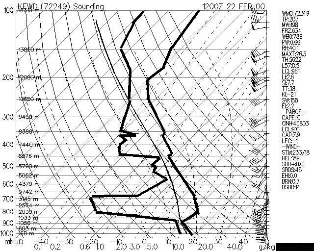
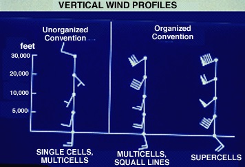
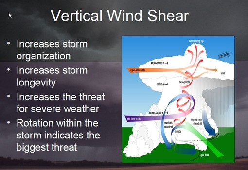
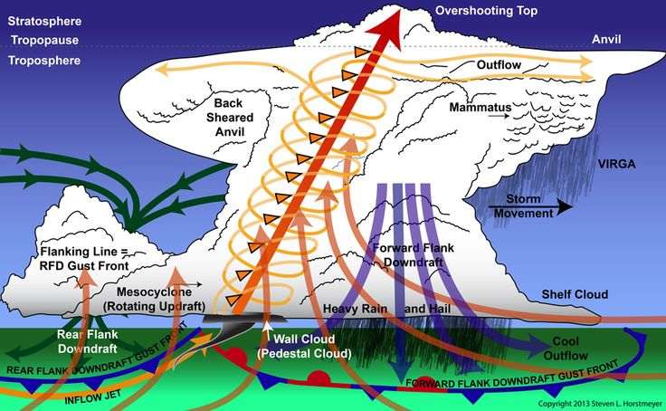
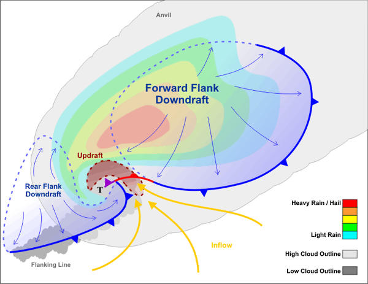
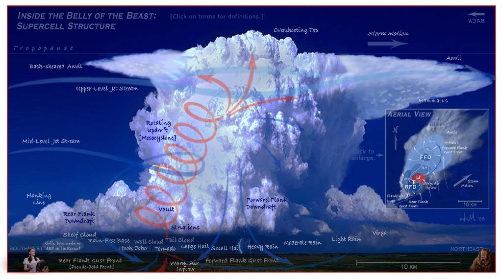

# Thunderstorm Tutorial

> Source: <http://www.weather.gov/source/zhu/ZHU_Training_Page/thunderstorm_stuff/Thunderstorms/thunderstorms.htm>  
> Section: Thunderstorms  
> Captured: 2026-08-19 06:00 UTC  
> PDF: [thunderstorm-tutorial.pdf](thunderstorm-tutorial.pdf) · Original HTML: [source/original.html](source/original.html)

---

**Select a tutorial below or scroll down...**- **[Thunderstorm Ingredients](#INGREDIENTS)**
- **[Severe Thunderstorm Environment](#SEVERE)**
- **[Severe Thunderstorm Versus Frontal Type](#SEVERE2)**
- **[Supercell Thunderstorm Cookbook](#COOKBOOK)**
- **[Severe Weather Indices](#INDEX)**

**THUNDERSTORM INGREDIENTS**

**METEOROLOGIST JEFF HABY**
[theweatherprediction.com](https://theweatherprediction.com/)

There are three ingredients that must be present for a thunderstorm to occur. They are:
**MOISTURE**, **INSTABILITY**, and **LIFTING**. Additionally, there is a fourth ingredient (**WIND SHEAR**) for severe thunderstorms and each are covered separately and in-depth farther down:

As a general rule, the **surface dewpoint needs to be 55 degrees Fahrenheit or greater for a surface based thunderstorm to occur**. A dewpoint of less than this is unfavorable for thunderstorms because the moist adiabatic lapse rate has more stable parcel lapse rate at colder dewpoints. Dewpoints at the surface can be less than 55 degrees Fahrenheit in the case of elevated thunderstorms.

Instability also decreases as low-level moisture decreases. Instability occurs when a parcel of air is warmer than the environmental air and rises on its own due to positive buoyancy. Instability is often expressed using positive CAPE or negative LI values. **Instability is what allows air in the low levels of the atmosphere to rise into the upper levels of the atmosphere. Without instability, the atmosphere will not support deep convection and thunderstorms**. Instability can be increased through daytime heating. Lift is what gives a parcel of air the impetus to rise from the low levels of the atmosphere to the elevation where positive buoyancy is realized. Very often, instability will exist in the middle and upper levels of the troposphere but not in the lower troposphere. Low level stability is often referred to as negative CAPE, convective inhibition, or the cap.

It is **lift that allows air in the low levels of the troposphere to overcome low level convective inhibition**. Lift is often referred to as a trigger mechanism. There are many lift mechanisms. **A list of many of them follows: fronts, low level convergence, low level WAA, low level moisture advection, mesoscale convergence boundaries such as outflow and sea breeze boundaries, orographic upslope, frictional convergence, vorticity, and jet streak**. All these processes force the air to rise. The region that has the greatest combination of these lift mechanisms is often the location that storms first develop. Moisture and instability must also be considered. **A thunderstorm will form first and develop toward the region that has the best combination of: high PBL moisture, low convective inhibition, CAPE and lifting mechanisms.**

**The difference between a thunderstorm and a severe thunderstorm is the wind field**. For a severe thunderstorm,
the ingredients that must be present are moisture, instability, lift and strong speed and directional storm relative wind shear. Ideally, wind will have a veering directional change of 60 degrees or more from the surface to 700 millibars, upper level winds will be greater than 70 knots, and the 850 to 700 mb winds (low level jet) will be 25 knots or greater. Wind shear aids in the following: Tilting a storm (displacing updraft from downdraft), allows the updraft to sustain itself for a longer period of time, allows the development of a mesocyclone, and allows rotating air to be ingested into the updraft (tornadogenesis).

Severe storms also tend to have these characteristics over ordinary thunderstorms: higher CAPE, drier air in the middle levels of the atmosphere (convective instability), better moisture convergence, baroclinic atmosphere, and more powerful lift.

---

## **MOISTURE**

Low level moisture is assessed by examining boundary layer dewpoints. Severe thunderstorms are more likely when
the surface dewpoint is 55 F or higher, all else being equal. Low dewpoint values inhibit sufficient latent heat release and significantly reduce the tornado threat.

Tornadoes are more likely when the LCL is relatively low as compared to relatively high. The depth of moisture in the lower troposphere and the rate of moisture advection are also important to examine.

While a lack of moisture in the lower troposphere reduces the severe storm threat, a lack of moisture
in the middle troposphere is helpful to the severe storm threat if there is abundant moisture in the lower troposphere. Convective (potential) instability is present in this situation.

The advection of higher dew point values into the boundary layer can increase instability in a severe
weather situation. This is often accomplished by advection from a warm ocean source.

---

## **INSTABILITY**

There are different types of instability and each one of these will be discussed. The release
of instability causes air to accelerate in the vertical. This is the reason air rises so quickly to
form thunderstorms. Instability is a condition in which air will rise freely on its own due to positive buoyancy.
As an example, imagine a basketball at the bottom of a swimming pool. Once the basketball is released it
accelerates upward to the top of the pool. The basketball rises because it is less dense than the water
surrounding it. A similar process occurs when instability is released in the atmosphere. Air in the
lower troposphere is lifted until it becomes less dense than surrounding air. Once it is less dense it
rises on its own. The speed that is rises depends on the density difference between the air rising and the
surrounding air. In any thunderstorm, rising motion is occurring since that air rising
in the updraft of the storm is less dense than the surrounding air.

**PARCEL INSTABILITY**

Parcel instability (also called Static Instability) is assessed by examining CAPE and/or the Lifted Index. Two
common measures of CAPE are SBCAPE (surface based CAPE) and MUCAPE (most unstable CAPE). CAPE of 1,500 J/kg is large with values above 2,500 J/kg being extremely large instability. LI values less than -4 are large with values less than -7 representing extreme instability. High instability allows for high accelerations within of the updraft. A strong updraft is important to hail generation.

**LATENT INSTABILITY**

This is instability caused by the release of latent heat. Latent instability increases as the average dewpoint
in the PBL, or in the region that lifting begins, increases. The more latent heat that is released, the more a parcel of air will warm. If the PBL is very moist and humid, the moist adiabatic lapse rate will cause cooling with height of a rising parcel of air to be small (perhaps only 4 C/km) in the low levels of the atmosphere. A storm with an abundant amount of moisture to lift will have more latent instability than a storm that is ingesting dry air. Often storm systems and storms will intensify once they get to the east of the Rockies because more low level moisture becomes available to lift. A Nor-easter is a classic example of latent instability. Warm and moist air from the Gulf Stream or Gulf of Mexico increases latent instability.

**CONVECTIVE (POTENTIAL) INSTABILITY**

Convective (also called potential) instability occurs when dry mid-level air advects over warm and moist air in the lower troposphere. Convective instability is released when dynamic lifting from the surface to mid-levels produces a moist adiabatic lapse rate of air lifted from the lower troposphere and a dry adiabatic lapse rate from air lifted in the middle troposphere. Over time, this increases the lapse rate in the atmosphere and can cause an atmosphere with little or no Surface Based CAPE to change to one with large SBCAPE (relative to a parcel of air lifted from the surface). Dry air cools more quickly when lifted compared to moist saturated air.

Convective instability exists when the mid-levels of the atmosphere are fairly dry and high dewpoints (and near saturated conditions) exist in the PBL. Water vapor imagery detects moisture in the 600 to 300 millibar range in the atmosphere. A dark color on water vapor imagery implies a lack of moisture in the mid and upper levels of the atmosphere. The surface, 850 mb, and 700 mb charts can be used to assess the low level moisture profile. The best way to analyze convective instability is by the use of a Skew-T diagram. A hydrolapse (rapid decrease of dewpoint with height) will exist at the boundary between the near saturated lower troposphere and dry mid-levels.

There will often be an inversion separating the dry air aloft and the moist air near the surface. The dry air aloft is commonly referred to as the elevated mixed layer (EML). This inversion is important because heat, moisture and instability can build under this "capping" inversion during the day. Once the cap breaks then explosive convection can result.

Below is a sounding displaying convective instability. The morning sounding shows no significant CAPE. However,
a forecaster would expect daytime heating to increase SBCAPE. If lift also occurs in this sounding environment
(from dynamic lifting mechanisms such as WAA,low level convergence, upper level divergence (e.g., jet streak, PDVA))
then CAPE will increase even further because the lifting will cool the mid-levels at a rate greater than the low levels.

---

## **LIFTING**

While instability release is like a basketball rising from the bottom of a swimming pool, lifting is caused by air being forced to rise. Forced lifting is like picking up a bowling ball from the ground or doing a bench press. The object will not rise until a force causes it to rise. It is lifting not caused by the air rising on its own.

Without enough lifting, parcels of air can not be lifted to a point in the troposphere where they can rise
on their own due to positive buoyancy. Instability, if it is present, can not be released without the
proper amount of forced lifting for the individual situation.

**LIFTING MECHANISMS**

1. Frontal boundaries, dry lines, and outflow boundaries (low level convergence)
2. Low level warm air advection
3. Upslope flow
4. Low pressure system (synoptic and mesoscale)
5. Differential heating along soil, vegetation, soil moisture, land cover boundaries (low level convergence)
6. Low level moisture advection
7. Differential Positive Vorticity Advection, jet streak divergence (upper level divergence)
8. Gravity wave

**PRECIPITATION FROM LIFTING**

Dynamic precipitation is also known as stratiform precipitation. Dynamic precipitation results from a
forced lifting of air. These forcing mechanisms include processes that cause low level convergence and upper level divergence. As unsaturated air rises the relative humidity of the air will increase. Once the air saturates, continued lifting will produce clouds and eventually precipitation. Dynamic precipitation tends to have a less intense rain rate than convective precipitation and also tends to last longer. While stratiform rain is the product of lifting, convective precipitation is the product of both lifting and instability release.

---

## **VERTICAL SPEED AND DIRECTIONAL WIND SHEAR**

Strong vertical wind shear is important to severe thunderstorm development. Wind shear influences a storm
in potentially several ways:

**VERTICAL SPEED SHEAR** - Significant increase of wind speed with height
**VERTICAL DIRECTIONAL SHEAR** - Significant change of wind direction with height

  

1. A significant increase of wind speed with height will tilt a storm's updraft. This allows the
updraft and downdraft to occur in separate regions of the storm the reduces water loading in the
updraft. The downdraft will not cut-off the updraft and actually it will even enforce it.

2. Strong upper tropospheric winds evacuates mass from the top of the updraft. This reduces
precipitation loading and allows the updraft to sustain itself.

3. Directional shear in the lower troposphere helps initiate the development of a rotating updraft. This is
one component that is important to the development of a mesocyclone and the development of tornadogenesis. Strong
lower tropospheric winds and directional shear together will generate high values of Helicity and thus this increases the tornado threat when severe storms develop.

4. The shear environment is important in determining the thunderstorm type. Both the vertical speed shear and directional wind shear have varying magnitudes. To simplify, we will have two categories: weak and strong. Thus, we have four combinations. Let's discuss each combination (assuming the updraft is of moderate strength for each case (moderate instability).

**CASE 1: WEAK SPEED SHEAR, WEAK DIRECTIONAL SHEAR**

A storm in this environment will move slowly and will be short lived. Since the storm moves slowly, the downdraft will cut-off the updraft and will thus diminish the storm. Storms in this environment are often termed "air mass thunderstorms" or "garden variety thunderstorms". If storms form in a moisture rich environment, rain can be heavy for brief periods of time. Severe weather is not likely.

**CASE 2: STRONG SPEED SHEAR, WEAK DIRECTIONAL SHEAR**

This situation is often termed "unidirectional shear". The speed shear will allow the storm to move. The
movement insures the storm will last longer than an airmass thunderstorm. Unidirectional shear often produces storms that form into lines (Mesoscale Convective Systems (MCS's)). Since the storm moves, outflow produces lift that enables new storms to grow on the storm's periphery. Over time, a line a storms result. These storms primarily produce small hail, weak tornadoes and heavy rain when they are associated with severe weather.

**CASE 3: WEAK SPEED SHEAR, STRONG DIRECTIONAL SHEAR**

When speed shear is weak the directional shear is not of significance. Storms in this environment will take on the characteristics of those in CASE 1. Hodograph wind speed will have similar pattern to CASE 1 and wind direction change with height will be high but often unorganized.

**CASE 4: STRONG SPEED SHEAR, STRONG DIRECTIONAL SHEAR**

This situation can produce single-cell super-cells. This is the best situation in order to produce a rotating updraft. The speed shear enables the storm to move quickly and helps keep the updraft and downdraft separated while the directional shear helps rotate the updraft into the storm. These storms can produce large hail, strong tornadoes and heavy rain

Click [**here**](subpages/storm-type-hodographs/storm-type-hodographs.md) for a more in-depth presentation on typical hodographs associated with various storm types.

---

## WAA, CAA and Hodographs

The change in wind direction and wind speed with height gives clues to the synoptic temperature advection. A
clockwise turning of the wind with height is termed veering. Winds turn from southeasterly at the surface to
westerly aloft in a veering case. A veering wind is associated with warm air advection. The strength of the
warm air advection will depend on the strength of the wind and the amount of veering with height. If winds are
strong and southerly at the surface and from the west at 700 mb, through time the low levels of the atmosphere
will warm while the upper levels may stay near the same temperature. This will cause instability. The amount
of instability in the low levels will depend on the amount of thermal advection and the amount of veering from
the surface to the mid-levels. A veering profile is common in the warm sector of a mid-latitude cyclone. The
wind will veer with height in the vicinity of a warm front. Before warm front passage it is common for winds
to be light northerly, shift to the east, then finally shift to a southerly direction.

Winds that turn counterclockwise with height are termed a backing wind. A backing wind is associated with cold
fronts. Behind a cold front, wind will be from a northerly direction, then shift counter-clockwise to a
westerly direction with height. Keep in mind that the winds in the mid and upper levels usually have a more
westerly component than an easterly component due to the prevailing planetary scale westerlies. A backing wind
is associated with cold air advection. A backing wind in the low levels of the atmosphere is favorable for
synoptic scale sinking motion. Most rain and thunderstorms are out ahead of cold fronts. Precipitation behind
cold fronts is generally lighter or lacking all together in most situations.

A hodograph displays the wind speed and direction with height. Veering and backing of wind can be figured very
easily through the diagram. A hodograph can be used to determine most likely thunderstorm type. The low level
of the atmosphere is from the surface to 850 mb, the mid-levels from 850 to 500 mb, and the upper levels 500
to 150 mb. These hodograph types are described below:

**SUPERCELL**

- Strong veering of wind in low levels, extending into mid-levels
- Wind speed greater than 20 knots in low levels and preferably greater than 100 knots from 500 to 300 millibars
- The stronger the wind, generally the more favorable
- Wind speed very high in upper levels, greater than 100 knots, the higher the better
- Hodograph curved sharply with height

**MULTICELLS**

- Wind veers with height, but not as pronounced as supercell
- Wind direction remains fairly unidirectional from lower mid-levels into upper levels (850 to 300 mb)
- Speed shear is present (increase of wind speed with height)

**AIR MASS STORMS**

- Wind speed change with height is relatively small
- Wind direction is fairly constant with height or unorganized
- Upper level winds are much weaker than supercell or multicell case

Click [**here**](subpages/storm-type-hodographs/storm-type-hodographs.md) for a more in-depth presentation on typical hodographs associated with various storm types.

[**TOP**](thunderstorm-tutorial.md#top)

**SEVERE THUNDERSTORM ENVIRONMENT**

**METEOROLOGIST JEFF HABY**
[theweatherprediction.com](https://theweatherprediction.com/)

Here are some conditions favorable to severe weather and an explanation of each:

**DRY AIR IN THE MID-LEVELS OF THE ATMOSPHERE:**
1) Produces convective instability
2) Produces a large negative buoyancy in association with thunderstorm downdrafts. The dry air entrains into the
moist air of the cloud causing intense evaporation, negative buoyancy, and a strong downdraft.
3) Evaporative cooling reduces the amount of melting hail experiences as it falls.

**HIGH INSTABILITY:**
High CAPE, unstable LI, unstable KI and TT; Strength of updraft is determined by amount of positive buoyancy in the atmosphere. Large instability produces large updrafts. A main determinate of hail size is the strength of the
updraft. High CAPE also causes the stretching necessary to produce tornadogenesis (wind shear must also be present).

**PBL WIND SHEAR:**
Speed shear (wind speed increasing with height in the PBL); directional shear (wind veering, turning clockwise more than 45 degrees in the PBL); Average PBL wind greater than 20 knots (It has been found that for tornadoes to develop the PBL inflow needs to be greater than 20 knots, the higher the better)

**STRONG UPPER LEVEL WINDS:**
Causes tilting of storms, displaces updraft from downdraft; Creates a vacuum affect at the top of storms; helps sustains the intensity and verticality of the updraft.

**STRONG UPPER LEVEL TROUGH:**
Generates strong positive vorticity advection; creates differential temperature advection (i.e. upper level and low level fronts)

**HIGH DEWPOINTS IN PBL:**
Must have moisture in low levels or storm development will be very limited. Low level moisture increases latent instability.

**DYNAMIC TRIGGER MECHANISMS:**
Without a trigger mechanism, such as when a strong cap is present, storms may not form. Here are examples of dynamic trigger mechanisms:
1. dryline
2. cold or warm front
3. outflow boundary
4. jet streak
5. strong upper level vorticity
6. orographic lifting
7. low level warm air advection (strong gradient of warmer temperature moving toward a fixed point)
8. Low level jet
9. Gravity waves
10. Meso-lows

[**TOP**](thunderstorm-tutorial.md#top)

**SEVERE THUNDERSTORM VERSUS FRONTAL TYPE**

**METEOROLOGIST JEFF HABY**
[theweatherprediction.com](https://theweatherprediction.com/)

Certain types of severe weather differ in association with different front types. Severe weather can occur with
cold fronts, warm fronts, and drylines. In the case of a stationary front, the severe weather tends to be similar
to that associated with a warm front. First, you need to determine the convergence along the front, moisture along
and ahead of the front, the movement of the front, and the upper level winds. Stronger convergence along a front
will result in an increased potential for uplift. An example of strong convergence along a cold front would be
winds from the southeast at 25 mph south of the front and north at 20 mph north of the front. The higher the dewpoints,
the more moisture a front will have to lift. If moisture is lacking on both sides of the front, do not expect
significant precipitation. The movement of the front will help you determine how long the precipitation will last.
Slower moving fronts are more prone to produce heavy persistent rain. The upper level winds determine how fast a
supercell will move once it forms. Supercells tend to follow the mean 700 to 500 millibar wind flow and upon maturity
will turn slightly to the right (about 30 degrees) of the mean 700 to 500 mb flow.

**COLD FRONTS:** Cold fronts tend to be the fastest movers compared to the other front types. This fast movement increases
convergence along the front and results in faster storm movement, if storms do develop. The slope of a cold front is
greater than that of the other frontal types. This results in convection that is more vertical (lifting associated
with warm fronts has a large horizontal component). For severe weather to be associated with cold fronts, look for
the following: high dewpoints ahead of the front (60 F or greater), strong upper level winds (300 mb wind greater
than 120 knots), front movement between 10 and 20 mph, and convergence along the front. Storms tend to be strongest
on the southwest edge of the frontal boundary due to a combination of the following: higher dewpoints, more
convective instability, cap breaks there last, uninhibited inflow into storms, storms are generally more isolated and
thus realize more convective energy.

**WARM FRONTS:** Severe weather generally occurs on the warm side of the warm front but is most favorable in the vicinity
of the warm front boundary. This is due to the fact that the greatest directional wind shear is located along the
warm front boundary. When storm chasing warm front convection, a good location would be to stay near the warm front
boundary while at the same time being relatively close to the mid-latitude cyclone which connects to the warm front.
As a general rule, severe weather is not as common along a warm front boundary as compared to out ahead of cold front
boundaries for these reasons: A smaller frontal slope results in less frontal convergence, east of the Rockies
convective instability (dry air in mid-levels) is not as well defined with warm fronts, convection tends to be more
horizontally slanted, the temperature gradient from one side of the frontal boundary to the other is generally
less in association with warm fronts.

**DRYLINES:** The higher the dewpoint gradient from one side of the dryline to the other is a good indication of dryline
intensity. Critical point: No convergence along the dryline results in NO storms. Drylines are most common in the
high plains in the Spring and early Summer. Certain factors must be in place for a dryline to produce severe
convection. As mentioned, the most critical is convergence. This convergence can be intensified by a combination
of the following: Strong upper level winds overriding the dryline (can produce dryline bulge), warm moisture rich
air being advected directly toward the dryline boundary (i.e. 850 mb Southeast wind at 30 knots ahead of the
dryline, West wind at 35 knots behind dryline), and a upper level trough. Severe storms in association with drylines
tend to be classic or LP supercells. The shallowness of moist air ahead of the dryline boundary limits the amount
of PW and moisture the storms can convect. The cap is critical to determining if a dryline will produce storms. If
convergence is not strong enough, the cap (inversion above PBL will prevent convection from occurring. Strong
convergence will break the cap. Generally, drylines are most intense and significant when a mid-latitude cyclone
over the High or Great Plains forces warm moist air from the Gulf and dry air from the high plains to advect over
the top of the warm moist air.

[**TOP**](thunderstorm-tutorial.md#top)

**SUPERCELL COOKBOOK**

**METEOROLOGIST JEFF HABY**
[theweatherprediction.com](https://theweatherprediction.com/)

 

The following are the main ingredients for supercell thunderstorms. The more ingredients available, the more
spectacular the storm will be once it is taken out of the oven.

**(1) Instability** - Defined by the temperature stratification of the atmosphere. Instability increases by warming the low levels (PBL) and/or cooling the mid and upper levels (700 to 300 mb). It is most easily assessed by looking at thermodynamic parameters. The most important include the CAPE, LI, cap, and dewpoint depression between 700 and 500 mb. Dry air in the mid-levels combined with warm and moist air in the PBL will produce convective instability.

**(2) Moisture (high dewpoints)** - The more moisture available, the more Latent heat can be released once storms develop. It is important to look for moisture advection hour by hour on a day severe weather is possible. The air is more unstable in regions of dewpoint maxima. Here is a guide to dewpoint values
and the instability and latent heat they can provide:

|  |  |
| --- | --- |
| **Greater than 75** | **Incredibly juicy** |
| **65-74** | **Juicy** |
| **55-64** | **Semi-juicy** |
| **Less than 55** | **Low moisture content** |

**(3) Warm PBL temperatures** - Air density decreases with increasing temperature. The greater the heating is during the day, the greater the instability of the atmosphere. Days with sunshine will be more convectively unstable than days with continuous cloud cover. The breaking of clouds on a day when severe weather has been forecast will increase the likelihood of severe weather. A temperature guide for buoyancy follows below (lift will determine if bouyancy is allowed to occur):

|  |  |
| --- | --- |
| **100+** | **Incredibly buoyant (if dewpoint greater than 55)** |
| **90-99+** | **Extremely buoyant (if dewpoint greater than 55)** |
| **80-89+** | **Very buoyant (if dewpoint greater than 55)** |
| **70-79** | **Fairly unstable (if dewpoint greater than 55)** |
| **60-69** | **Marginal (if dewpoint greater than 55)** |
| **Less than 60** | **Positive temperature and dewpoint advection needed** |

**(4) Low level jet/ inflow** - Strong low level winds will quickly advect warm and moist air into a region if it is associated with the low level jet. Unimpressive temperatures and
dewpoints can change rapidly during the day via the low level jet. If winds are light in the PBL, severe weather is not as likely. Here are some low level jet wind values at 850 to keep in mind when analyzing:

|  |  |
| --- | --- |
| **Greater than 70 knots** | **Incredibly fast advection** |
| **50 to 69 knots** | **Very strong low level jet** |
| **30 to 49 knots** | **Descent low level jet** |
| **20 to 29 knots** | **Marginal low level jet** |
| **Less than 20 knots** | **Ill-defined low level jet** |

**(5) Strong surface to 700 millibar directional shear** - Change in direction with height will cause horizontal vorticity which can lead to tornadic development. It also produces
differential advection. Best case would be to have southeast wind at the surface transporting warm and moist air, a southwest or west wind at 700 millibar transporting dry air, and a northwesterly wind in the upper levels of the atmosphere.

**(6) Strong speed shear with height** - This will cause updrafts to tilt in the vertical thus leading to supercell storms. Speed shear also causes tubes of horizontal vorticity, which can be ingested into thunderstorms.

**(7) Upper level Jet Stream** - Use forecast models to determine the strength of the jet stream. The stronger the jet, the stronger the upper level forcing. Below is a guide to jet stream wind and upper level divergence (occurs in right rear and left front quadrant of a jet streak).

|  |  |
| --- | --- |
| **Greater than 200 knots** | **Incredible divergence** |
| **150 to 200 knots** | **Large divergence** |
| **100 to 149 knots** | **Good divergence** |
| **70 to 99 knots** | **Marginal divergence** |
| **Less than 70 knots** | **Small divergence** |

(8) **500 millibar vorticity** - Vorticity is a function of trough curvature, earth vorticity, and speed gradients. When using models to assess strength of vorticity you will notice a value is given for the VORT MAX. The higher the value, the higher the potential upper level divergence. Below is a guide to 500 millibar vorticity and upper level divergence. If the values of vorticity are being rapidly advected, divergence will "in the real world" be much more than if the winds through the vorticity maximum are stationary or moving slowly.

|  |  |
| --- | --- |
| **40+** | **Incredible divergence** |
| **30+** | **Very large divergence** |
| **20-29** | **Large divergence** |
| **Teens** | **Descent divergence** |
| **Less than 12** | **Low but positive divergence** |

Click [**here**](subpages/supercell-structure/supercell-structure.md) for a more in-depth presentation on supercell thunderstorm structure and evolution.

## Right and Left moving Supercells

***What is the cause of splitting supercells? How can they move deviant to the deep-layer flow? And finally, why do left movers move more swiftly than right movers?***

The cause of supercell splitting lies in vorticity dynamics. The tilting and stretching of horizontal vorticity into the vertical yields a positive and negative vertical vorticity center on the south and north side of a supercell (given a wind profile characterized by easterly surface winds becoming, linearly, westerly and increasing in intensity with height). Buoyancy gradients along the edge of the updraft also play a role... The vertical pressure perturbation structure results in renewed development to the south of the cyclonic center and to the north of the anticyclonic center. Developing downdraft in the 'center' of the updraft, in concert with the outward (south/north) development leads to the 'splitting' of the single updraft into two discrete updrafts... This all depends on the wind profile (and more specifically, the wind SHEAR profile).

A "right-mover" denotes a storm which has turn right of the mean wind, often by 20-30 degrees, though sometimes signficantly more. Cyclonic supercells also tend to move slower than the mean wind (while left-moves tend to move left AND faster than the mean wind). For many, the term "30R75" may ring a bell -- "30 degrees right and 75% of the mean wind". Different storms may not obey this rule-of-thumb, however! Low-topped or mini-supercells tend to be less developed in the vertical (thus the term low-topped LOL), and thus the "steering wind" (so to say) for those storms may be the 850-700mb layer), while more classic supercells that extend to the tropopause may be most heavily influence by the 700-400mb mean wind. Regardless, this kind of get muddied up with supercells develop strong pressure perturbation gradients, which is largely the cause of the deviant motion to begin with.

For those that are curious, you can find other good lectures regarding supercells and tornado dynamics (e.g. how helicity aids thunderstorm rotation, how rotation in an updraft enhances the updraft well beyond the effects possible with buoyancy alone, etc) by just going [**here**](http://twister.ou.edu/MM2005/).

[**TOP**](thunderstorm-tutorial.md#top)

**SEVERE WEATHER INDICES**

**METEOROLOGIST JEFF HABY**
[theweatherprediction.com](https://theweatherprediction.com/)

**TOTAL TOTALS**

|  |  |
| --- | --- |
| **<44** | **Convection not likely** |
| **44-50** | **Likely thunderstorms** |
| **51-52** | **Isolated severe storms** |
| **53-56** | **Widely scattered severe** |
| >**56** | **Scattered severe storms** |

**SPEED SHEAR**

|  |  |
| --- | --- |
| **0-3** | **Weak** |
| **4-5** | **Moderate** |
| **6-8** | **Large** |
| **8+** | **Severe** |

**K INDEX**

|  |  |
| --- | --- |
| **15-25** | **Small convective potential** |
| **26-39** | **Moderate convective potential** |
| **40+** | **High convective potential** |

**CAPE**

|  |  |
| --- | --- |
| **1 - 1,500** | **Positive** |
| **1,500 - 2,500** | **Large** |
| **2,500+** | **Extreme** |

**SWEAT**

|  |  |
| --- | --- |
| **150-300** | **Slight severe** |
| **300-400** | **Severe possible** |
| **400+** | **Tornadic possible** |

**SR HELICITY**

|  |  |
| --- | --- |
| **150-300** | **Possible supercell** |
| **300-400** | **Supercells favorable** |
| **400+** | **Tornadic possible** |

**LIFTED INDEX / SWI**

|  |  |
| --- | --- |
| **-1 to -4** | **Marginal instability** |
| **-4 to -7** | **Large instability** |
| **-8 or less** | **Extreme instability** |

**BRN**

|  |  |
| --- | --- |
| **<45** | **Supercells favorable** |
| **<10** | **Too sheared** |
| **teens** | **Optimum** |

**EHI**

|  |  |
| --- | --- |
| **EHI >1** | **Supercells likely** |
| **1 to 5** | **F2, F3 tornadoes possible** |
| **5+** | **F4, F5 tornadoes possible** |

**NOTES:**
\*Max uvv = square root of 2 \* CAPE
\*BRN (Bulk Richardson Number) = CAPE / (0-6 km) Shear
\*Showalter (SWI) = used when elevated convection is most likely
\*EHI = (SR HEL \* CAPE) /160,000
\*SWEAT = 12(850Td) +20(TT-49) +2(V850) + (V500) +125(sin(dd500-dd850) + 0.2)
\*Total Totals = (T850- T500) + (Td850 - T500)= vertical totals plus cross totals
\*K index = (T850 -T500) + (Td850 - Tdd700)
\*SR Helicity : determines amount of horizontal streamwise vorticity available for storm ingestion
\*streamwise = parallel to storm inflow
\*Important to look for thermal and dewpoint ridges (THETA-E)
\*For tornado, inflow must be greater than 20 knots
\*20 to 30% of mesocyclones produce tornadoes
\*Tornado types: rope, needle, tube, wedge
\*Look for differential advection; warm/ moist at surface, dry air in mid levels
\*Severe weather hodograph: veering, strong sfc to 850 directional shear
\* >100 J/kg negative buoyancy is significant
\*Good match: BRN < 20 and CAPE >2,000 J/kg
\*Strong cap when > 2 degrees Celsius
\*Study depth of moisture, TT unreasonable when low level moisture is lacking
\*KI used for heavy convective rain, values vary with location/season
\*Instability enhanced by ... daytime heating, outflow boundaries
\*Models generally have weak handle on return flow from Gulf, low level jet, convective rainfall, orography,
mesoscale boundaries, and boundary conditions
\*Large hail when freezing level >675 mb, high CAPE, supercell
\*Synoptic scale uplift from either surface WAA or upper level divergence
\*Fair weather cumulus: cumulus humulus, cumulus mediocrus
\*T-storm warning when Hail > 3/4", wind > 58 mph, gate to gate shear > 90 knots
\*Sounding types: Inverted V, goal post, Type C, wet microburst

[**TOP**](thunderstorm-tutorial.md#top)
