# Thunderstorm - ZHU Presentation (with Added Slides)

> Source: <http://www.weather.gov/media/zhu/ZHU_Training_Page/thunderstorm_stuff/Thunderstorms/thunderstorms.pdf>  
> Section: Thunderstorms  
> Captured: 2026-08-19 06:00 UTC  
> PDF: [thunderstorm-zhu-presentation-with-added-slides.pdf](thunderstorm-zhu-presentation-with-added-slides.pdf) (31 pages)

---

## Page 1

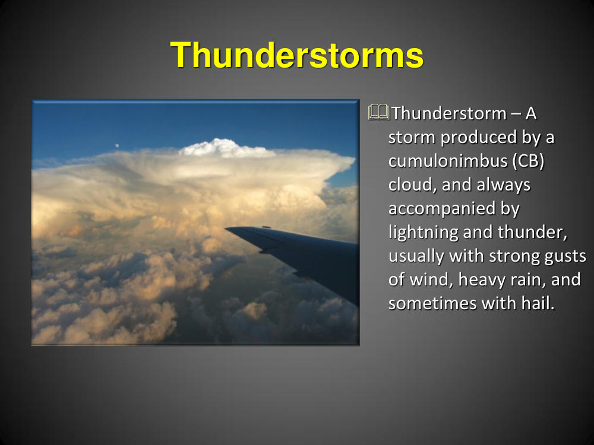

Thunderstorms
Thunderstorms 
Thunderstorm 
– A  
storm produced by a cumulonimbus (CB) cloud, and always accompanied by lightning and thunder, usually with strong gusts of wind, heavy rain, and sometimes with hail. 
 
Thunderstorm – A  
storm produced by a 
cumulonimbus (CB) 
cloud, and always 
accompanied by 
lightning and thunder, 
usually with strong gusts 
of wind, heavy rain, and 
sometimes with hail.

## Page 2

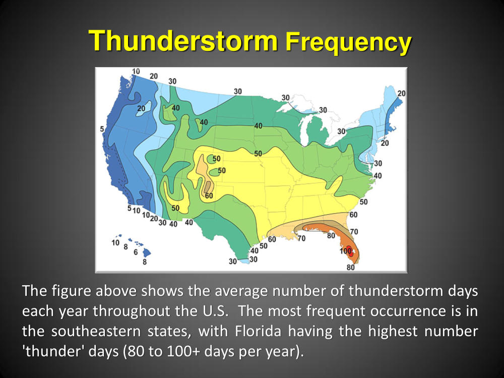

Thunderstorm
 Frequency
Thunderstorm Frequency 
The
 figure
 above
 shows
 the average
 number
 of thunderstorm
 days
 
each
 year
 throughout
 the U .S .  The most
 frequent
 occurrence
 is in 
the southeastern
 states,
 with
 Florida
 having
 the highest
 number
 
'thunder'
 days
 (80 to 100 + days
 per year)
. 
The figure above shows the average number of thunderstorm days 
each year throughout the U.S.  The most frequent occurrence is in 
the southeastern states, with Florida having the highest number 
'thunder' days (80 to 100+ days per year).

## Page 3

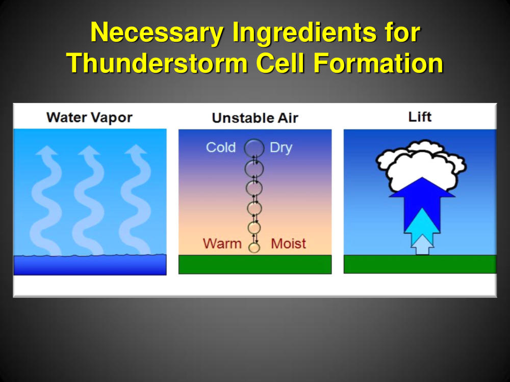

Necessary Ingredients for Thunderstorm Cell Formation
Necessary Ingredients for 
Thunderstorm Cell Formation

## Page 4

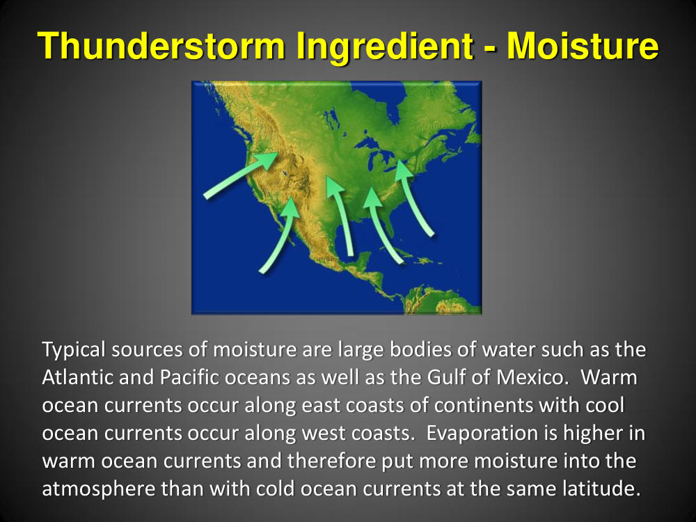

Thunderstorm Ingredient 
- Moisture
Thunderstorm Ingredient - Moisture 
Typical sources of moisture are large bodies of water such as the Atlantic and Pacific oceans as well as the Gulf of Mexico.  Warm ocean currents occur along east coasts of continents with cool ocean currents occur along west coasts.  Evaporation is higher in warm ocean currents and therefore put more moisture into the atmosphere than with cold ocean currents at the same latitude.
 
Typical sources of moisture are large bodies of water such as the 
Atlantic and Pacific oceans as well as the Gulf of Mexico.  Warm 
ocean currents occur along east coasts of continents with cool 
ocean currents occur along west coasts.  Evaporation is higher in 
warm ocean currents and therefore put more moisture into the 
atmosphere than with cold ocean currents at the same latitude.

## Page 5

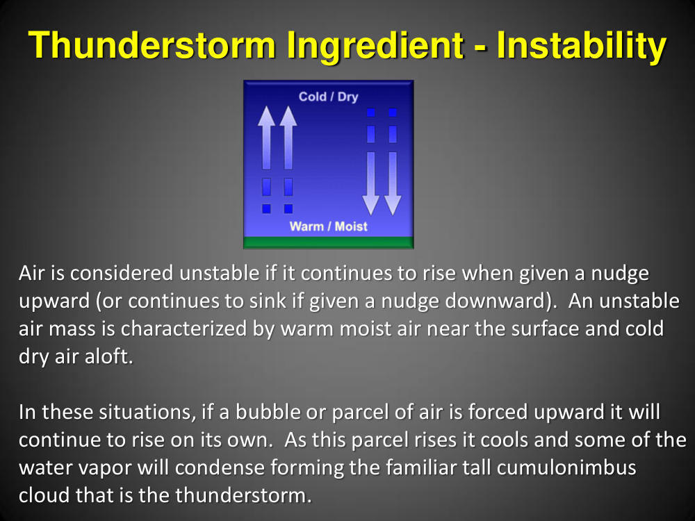

Thunderstorm Ingredient 
- Instability
Thunderstorm Ingredient - Instability 
Air is considered unstable if it continues to rise when given a nudge upward (or continues to sink if given a nudge downward).  An unstable air mass is characterized by warm moist air near the surface and cold dry air aloft.
 
 In these situations, if a bubble or parcel of air is forced upward it will continue to rise on its own.  As this parcel rises it cools and some of the water vapor will condense forming the familiar tall cumulonimbus cloud that is the thunderstorm.
 
Air is considered unstable if it continues to rise when given a nudge 
upward (or continues to sink if given a nudge downward).  An unstable 
air mass is characterized by warm moist air near the surface and cold 
dry air aloft. 
 
In these situations, if a bubble or parcel of air is forced upward it will 
continue to rise on its own.  As this parcel rises it cools and some of the 
water vapor will condense forming the familiar tall cumulonimbus 
cloud that is the thunderstorm.

## Page 6

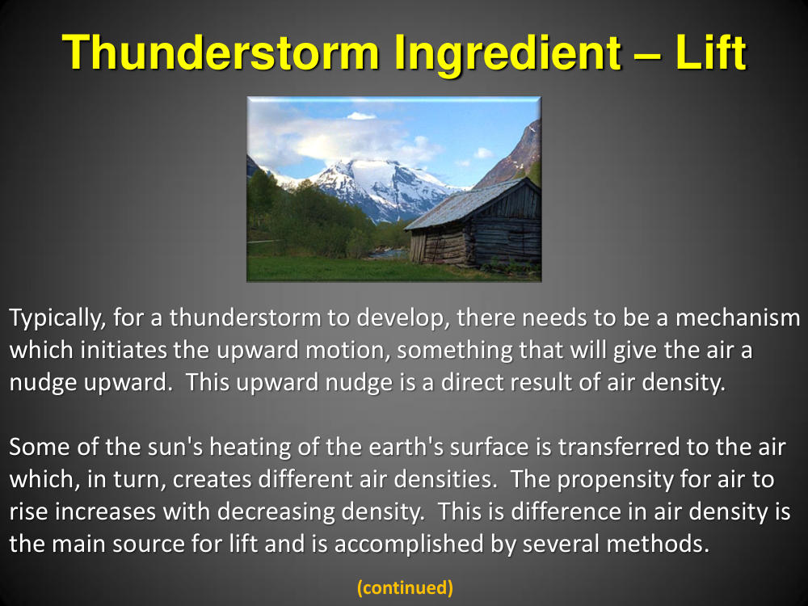

Thunderstorm Ingredient 
– Lift
Thunderstorm Ingredient – Lift 
which initiates the upward motion, something that will give the air a nudge upward.  This upward nudge is a direct result of air density.
 
 which, in turn, creates different air densities.  The propensity for air to the main source for lift and is accomplished by several methods.
 
 
Typically, for a thunderstorm to develop, there needs to be a mechanism 
which initiates the upward motion, something that will give the air a 
nudge upward.  This upward nudge is a direct result of air density. 
 
Some of the sun's heating of the earth's surface is transferred to the air 
which, in turn, creates different air densities.  The propensity for air to 
rise increases with decreasing density.  This is difference in air density is 
the main source for lift and is accomplished by several methods. 
 
(continued)

## Page 7

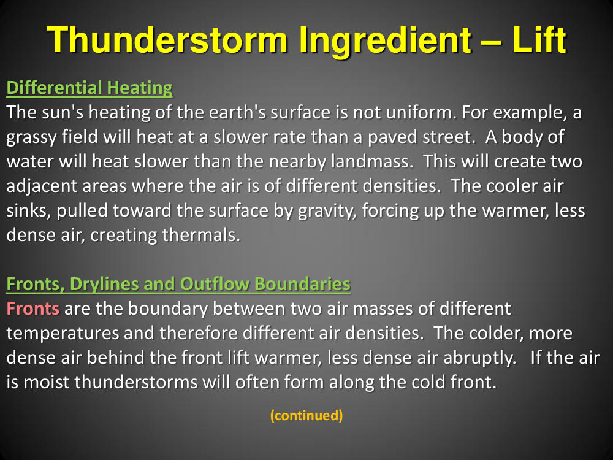

Thunderstorm Ingredient 
– Lift
Thunderstorm Ingredient – Lift 
 
grassy field will heat at a slower rate than a paved street.  A body of sinks, pulled toward the surface by gravity, forcing up the warmer, less dense air, creating thermals.
 
 Fronts, Drylines and Outflow Boundaries 
 
Fronts
 are the boundary between two air masses of different 
 
 
Differential Heating  
The sun's heating of the earth's surface is not uniform. For example, a 
grassy field will heat at a slower rate than a paved street.  A body of 
water will heat slower than the nearby landmass.  This will create two 
adjacent areas where the air is of different densities.  The cooler air 
sinks, pulled toward the surface by gravity, forcing up the warmer, less 
dense air, creating thermals. 
 
Fronts, Drylines and Outflow Boundaries  
Fronts are the boundary between two air masses of different 
temperatures and therefore different air densities.  The colder, more 
dense air behind the front lift warmer, less dense air abruptly.   If the air 
is moist thunderstorms will often form along the cold front. 
 
(continued)

## Page 8

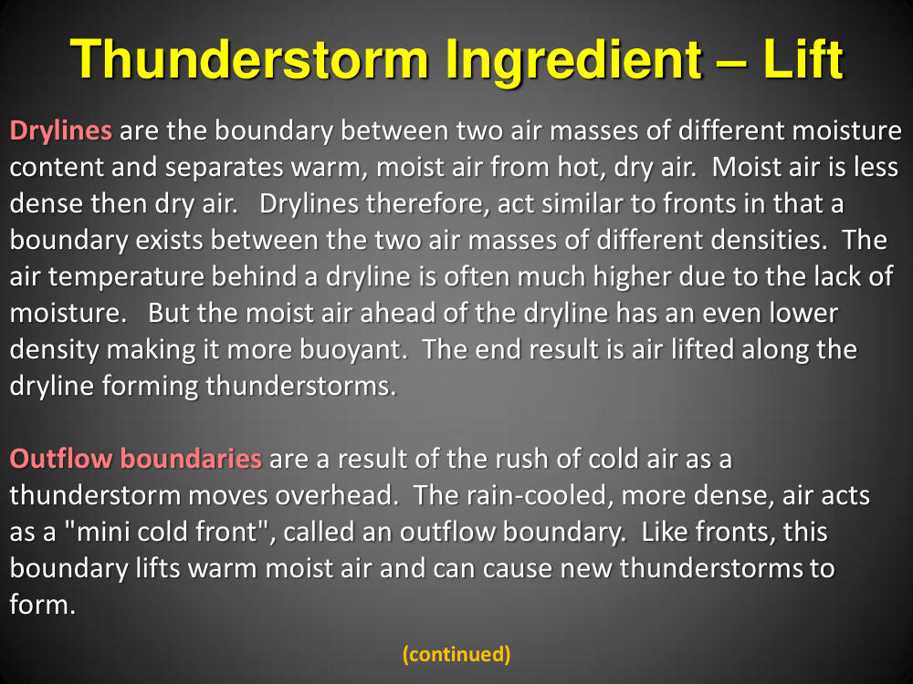

Thunderstorm Ingredient 
– Lift
Thunderstorm Ingredient – Lift 
 are the boundary between two air masses of different moisture moisture.   But the moist air ahead of the dryline has an even lower dryline forming thunderstorms. 
 
 
are a result of the rush of cold air as a 
-cooled, more dense, air acts  
as a "mini cold front", called an outflow boundary.  Like fronts, this form.
 
 
Drylines are the boundary between two air masses of different moisture 
content and separates warm, moist air from hot, dry air.  Moist air is less 
dense then dry air.   Drylines therefore, act similar to fronts in that a 
boundary exists between the two air masses of different densities.  The 
air temperature behind a dryline is often much higher due to the lack of 
moisture.   But the moist air ahead of the dryline has an even lower 
density making it more buoyant.  The end result is air lifted along the 
dryline forming thunderstorms.  
 
Outflow boundaries are a result of the rush of cold air as a 
thunderstorm moves overhead.  The rain-cooled, more dense, air acts  
as a "mini cold front", called an outflow boundary.  Like fronts, this 
boundary lifts warm moist air and can cause new thunderstorms to 
form. 
 
(continued)

## Page 9

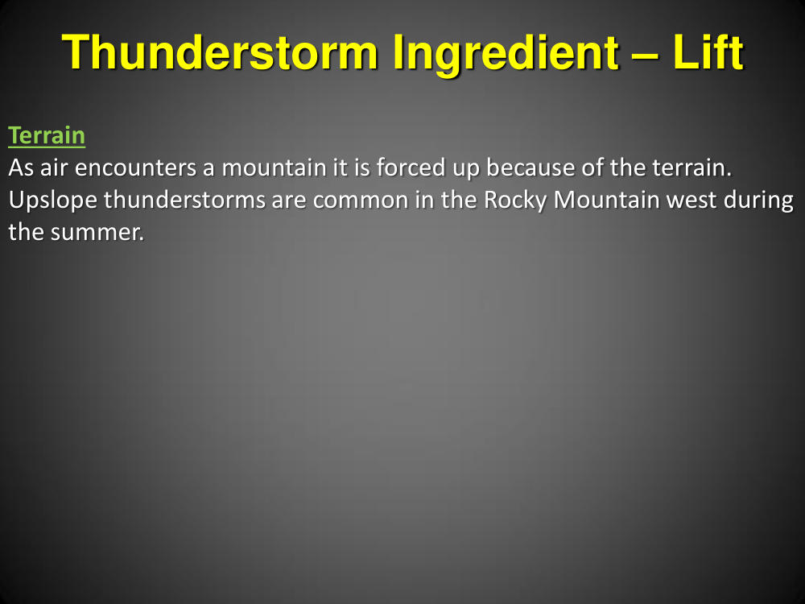

Thunderstorm Ingredient 
– Lift
Thunderstorm Ingredient – Lift 
As air encounters a mountain it is forced up because of the terrain. the summer.
 
Terrain  
As air encounters a mountain it is forced up because of the terrain. 
Upslope thunderstorms are common in the Rocky Mountain west during 
the summer.

## Page 10

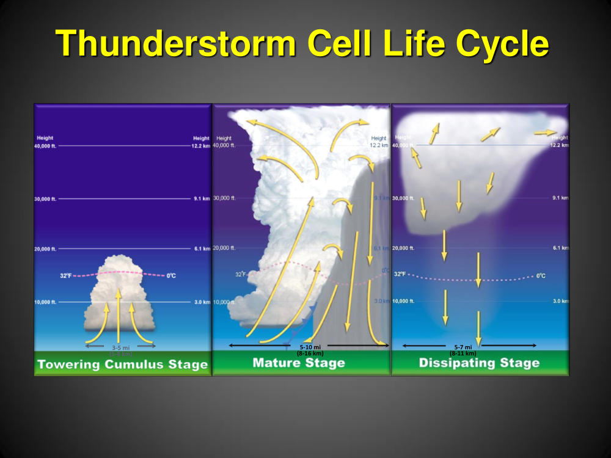

Thunderstorm Cell Life Cycle
Thunderstorm Cell Life Cycle 
3-5 mi 
(5-8 km) 
5-10 mi 
(8-16 km) 
5-7 mi 
(8-11 km)

## Page 11

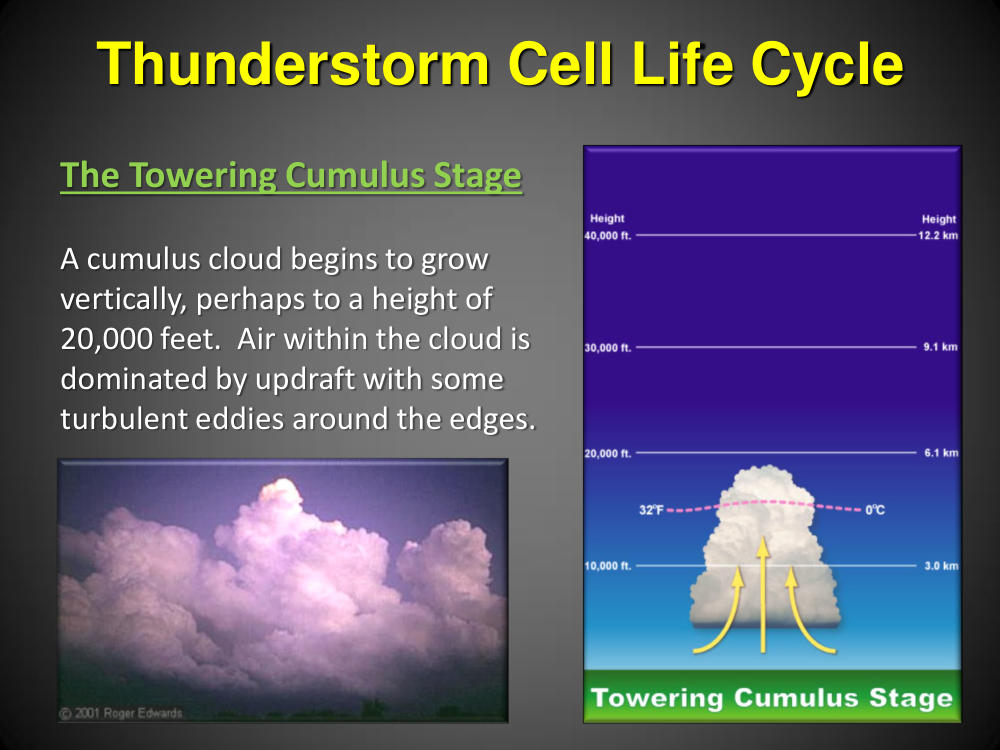

Thunderstorm Cell Life Cycle
Thunderstorm Cell Life Cycle 
The Towering Cumulus Stage
 
A cumulus cloud begins to grow vertically, perhaps to a height of  20,000 feet.  Air within the cloud is dominated by updraft with some turbulent eddies around the edges.
 
The Towering Cumulus Stage 
 
A cumulus cloud begins to grow 
vertically, perhaps to a height of  
20,000 feet.  Air within the cloud is 
dominated by updraft with some 
turbulent eddies around the edges.

## Page 12

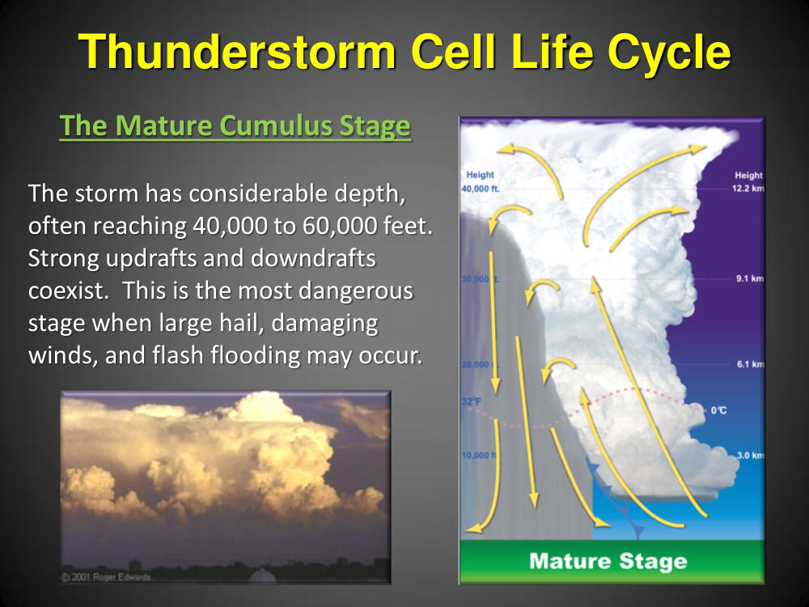

Thunderstorm Cell Life Cycle
Thunderstorm Cell Life Cycle 
The Mature Cumulus Stage
 
The storm has considerable depth, often reaching 40,000 to 60,000 feet. Strong updrafts and downdrafts coexist.  This is the most dangerous stage when large hail, damaging winds, and flash flooding may occur.
 
 
The Mature Cumulus Stage 
 
The storm has considerable depth, 
often reaching 40,000 to 60,000 feet. 
Strong updrafts and downdrafts 
coexist.  This is the most dangerous 
stage when large hail, damaging 
winds, and flash flooding may occur.

## Page 13

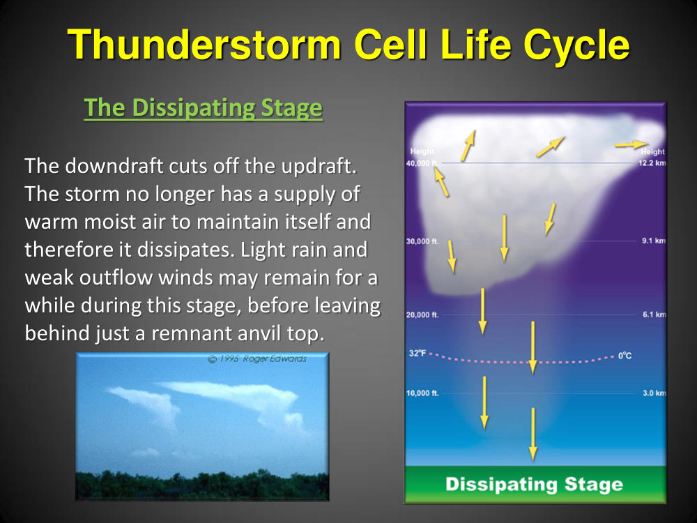

Thunderstorm Cell Life Cycle
Thunderstorm Cell Life Cycle 
The Dissipating Stage
 
The downdraft cuts off the updraft. The storm no longer has a supply of warm moist air to maintain itself and therefore it dissipates. Light rain and weak outflow winds may remain for a while during this stage, before leaving behind just a remnant anvil top.
 
The Dissipating Stage 
 
The downdraft cuts off the updraft. 
The storm no longer has a supply of 
warm moist air to maintain itself and 
therefore it dissipates. Light rain and 
weak outflow winds may remain for a 
while during this stage, before leaving 
behind just a remnant anvil top.

## Page 14

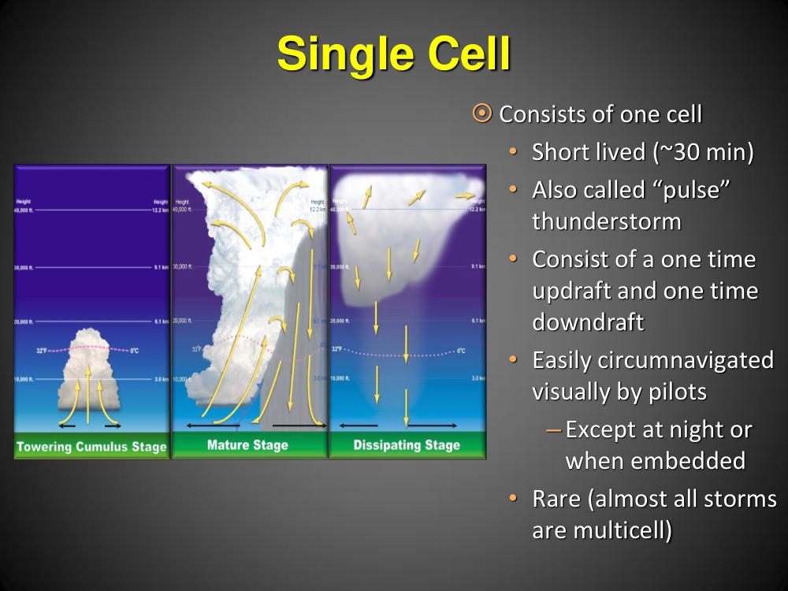

Single Cell
Single Cell 
Consists of one cell
 
• Short lived (~30 min)
 
• Also called “pulse” thunderstorm
 
• Consist of a one time updraft and one time downdraft
 
• Easily circumnavigated visually by pilots 
 
– Except at night or when embedded
 
• Rare (almost all storms  are multicell)
  
 
Consists of one cell 
• Short lived (~30 min) 
• Also called “pulse” 
thunderstorm 
• Consist of a one time 
updraft and one time 
downdraft 
• Easily circumnavigated 
visually by pilots  
– Except at night or 
when embedded 
• Rare (almost all storms  
are multicell)

## Page 15

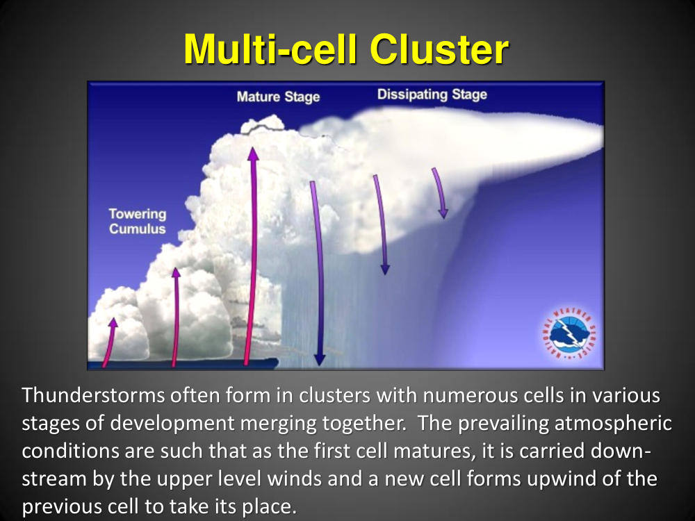

Multi
-cell Cluster
Multi-cell Cluster 
Thunderstorms often form in clusters with numerous cells in various stages of development merging together.  The prevailing atmospheric conditions are such that as the first cell matures, it is carried down
-
stream by the upper level winds and a new cell forms upwind of the previous cell to take its place.
 
 
Thunderstorms often form in clusters with numerous cells in various 
stages of development merging together.  The prevailing atmospheric 
conditions are such that as the first cell matures, it is carried down-
stream by the upper level winds and a new cell forms upwind of the 
previous cell to take its place.

## Page 16

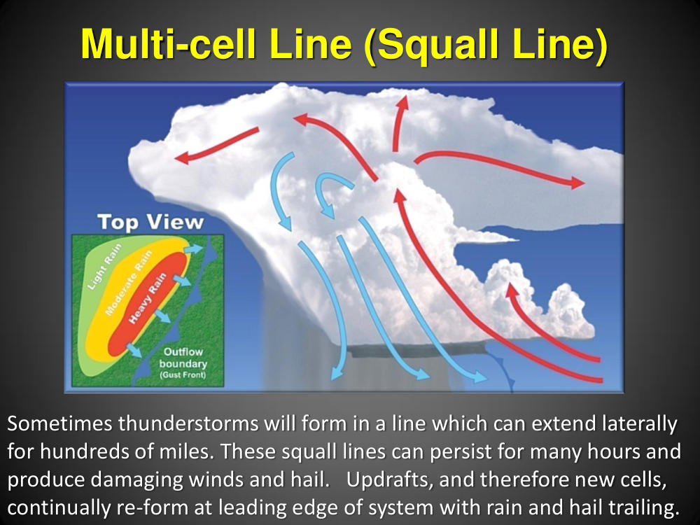

Multi
-cell Line (Squall Line)
Multi-cell Line (Squall Line) 
Sometimes thunderstorms will form in a line which can extend laterally produce damaging winds and hail.   Updrafts, and therefore new cells, 
-form at leading edge of system with rain and hail trailing.
 
Sometimes thunderstorms will form in a line which can extend laterally 
for hundreds of miles. These squall lines can persist for many hours and 
produce damaging winds and hail.   Updrafts, and therefore new cells, 
continually re-form at leading edge of system with rain and hail trailing.

## Page 17

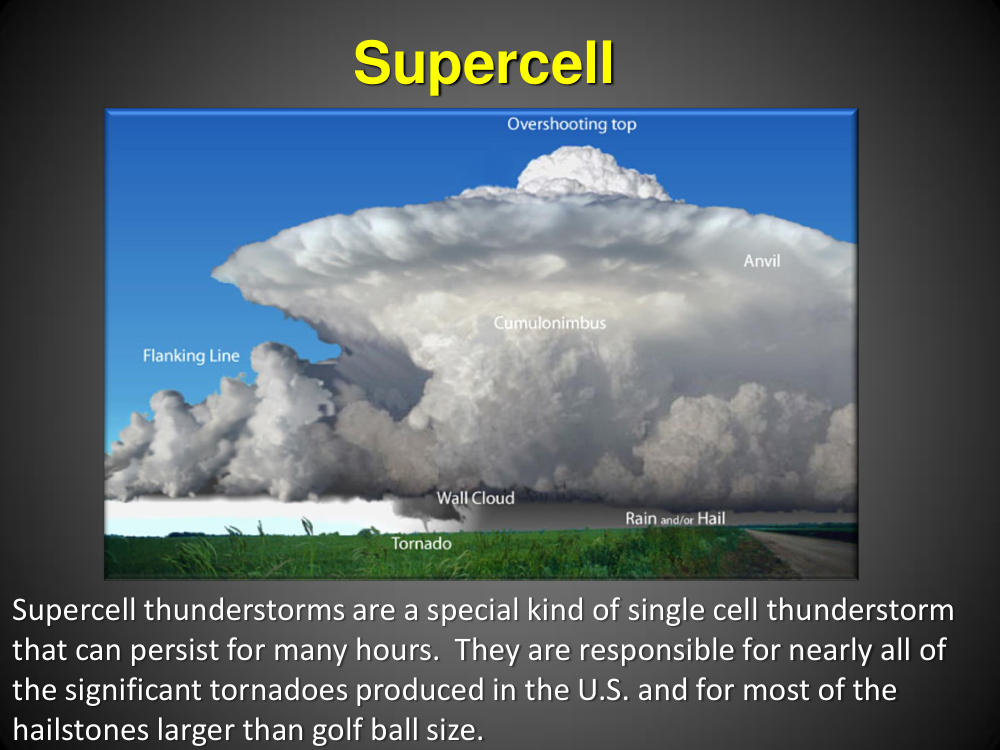

Supercell
Supercell 
that can persist for many hours.  They are responsible for nearly all of the significant tornadoes produced in the U.S. and for most of the hailstones larger than golf ball size.
 
Supercell thunderstorms are a special kind of single cell thunderstorm 
that can persist for many hours.  They are responsible for nearly all of 
the significant tornadoes produced in the U.S. and for most of the 
hailstones larger than golf ball size.

## Page 18

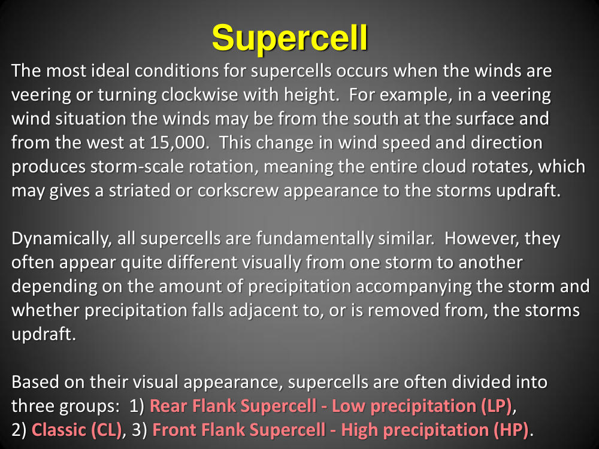

Supercell
Supercell 
wind situation the winds may be from the south at the surface and 
-scale rotation, meaning the entire cloud rotates, which 
 
 often appear quite different visually from one storm to another whether precipitation falls adjacent to, or is removed from, the storms 
 
 
Rear Flank Supercell 
- Low precipitation (LP)
,  
2) Classic (CL)
, 3) Front Flank Supercell 
- High precipitation (HP)
.  
 
The most ideal conditions for supercells occurs when the winds are 
veering or turning clockwise with height.  For example, in a veering 
wind situation the winds may be from the south at the surface and 
from the west at 15,000.  This change in wind speed and direction 
produces storm-scale rotation, meaning the entire cloud rotates, which 
may gives a striated or corkscrew appearance to the storms updraft. 
 
Dynamically, all supercells are fundamentally similar.  However, they 
often appear quite different visually from one storm to another 
depending on the amount of precipitation accompanying the storm and 
whether precipitation falls adjacent to, or is removed from, the storms 
updraft.   
 
Based on their visual appearance, supercells are often divided into 
three groups:  1) Rear Flank Supercell - Low precipitation (LP),  
2) Classic (CL), 3) Front Flank Supercell - High precipitation (HP).

## Page 19

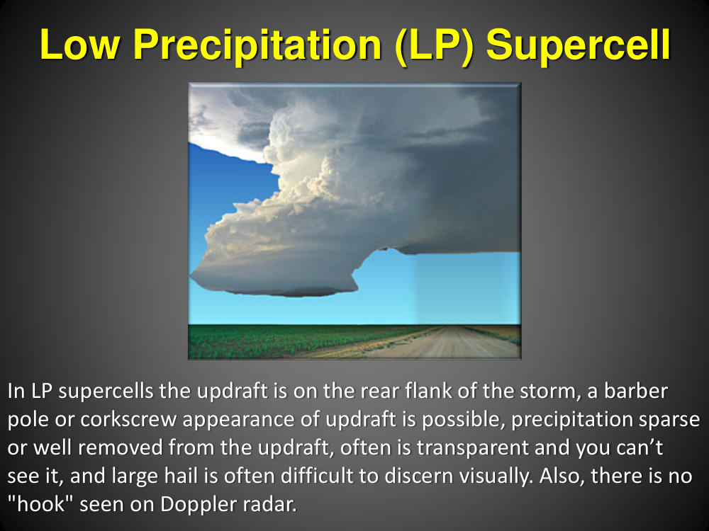

Low Precipitation (LP) Supercell
Low Precipitation (LP) Supercell 
In LP supercells the updraft is on the rear flank of the storm, a barber or well removed from the updraft, often is transparent and you can’t "hook" seen on Doppler radar.
 
 
In LP supercells the updraft is on the rear flank of the storm, a barber 
pole or corkscrew appearance of updraft is possible, precipitation sparse 
or well removed from the updraft, often is transparent and you can’t 
see it, and large hail is often difficult to discern visually. Also, there is no 
"hook" seen on Doppler radar.

## Page 20

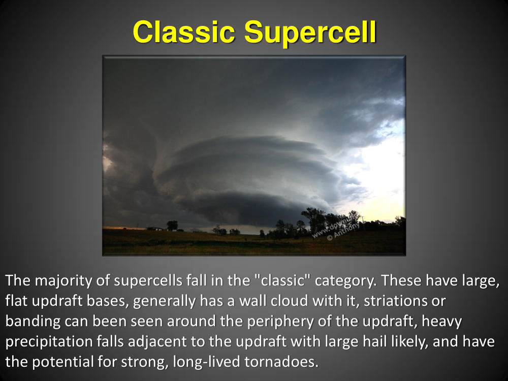

Classic Supercell
Classic Supercell 
banding can been seen around the periphery of the updraft, heavy the potential for strong, long
-lived tornadoes.
 
 
The majority of supercells fall in the "classic" category. These have large, 
flat updraft bases, generally has a wall cloud with it, striations or 
banding can been seen around the periphery of the updraft, heavy 
precipitation falls adjacent to the updraft with large hail likely, and have 
the potential for strong, long-lived tornadoes.

## Page 21

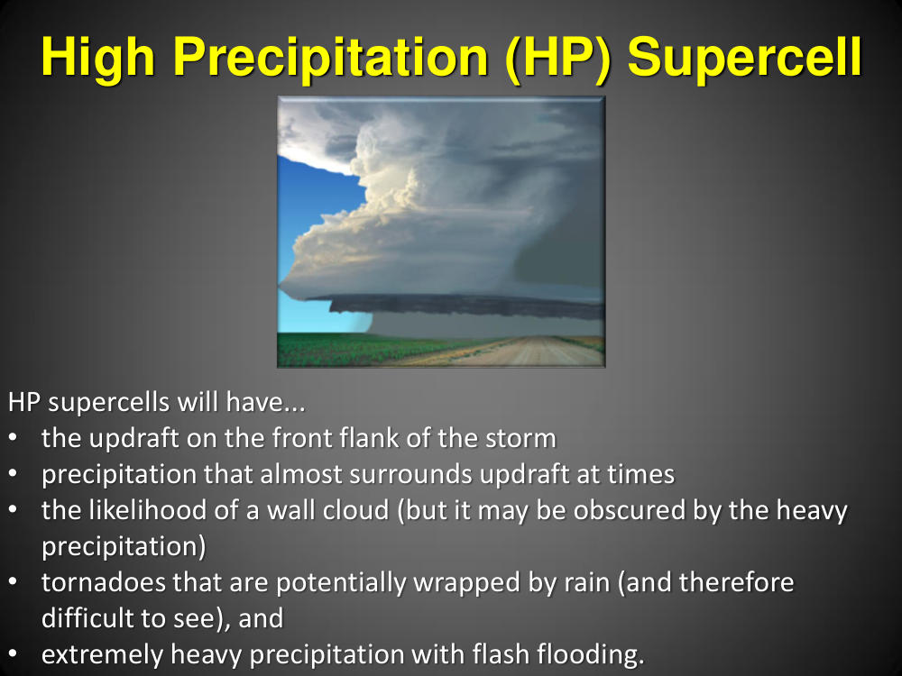

High Precipitation (HP) Supercell
High Precipitation (HP) Supercell 
  
 
 HP supercells will have... 
 
the updraft on the front flank of the storm 
 
precipitation that almost surrounds updraft at times 
 
the likelihood of a wall cloud (but it may be obscured by the heavy precipitation) 
 
tornadoes that are potentially wrapped by rain (and therefore difficult to see), and 
 
extremely heavy precipitation with flash flooding.
 
HP supercells will have...  
• the updraft on the front flank of the storm  
• precipitation that almost surrounds updraft at times  
• the likelihood of a wall cloud (but it may be obscured by the heavy 
precipitation)  
• tornadoes that are potentially wrapped by rain (and therefore 
difficult to see), and  
• extremely heavy precipitation with flash flooding.

## Page 22

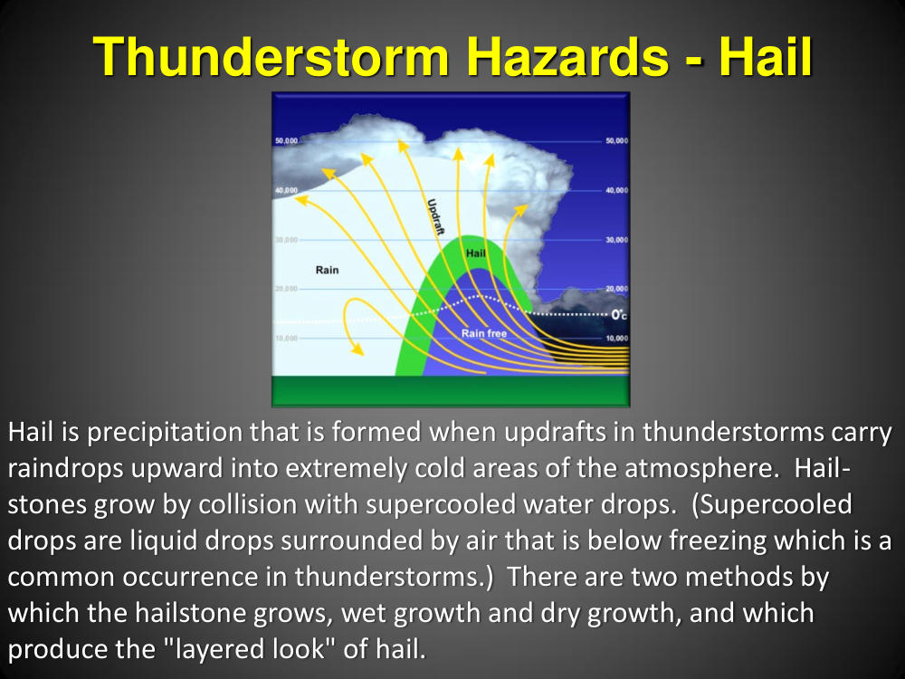

Thunderstorm Hazards 
- Hail
Thunderstorm Hazards - Hail 
  
 
 raindrops upward into extremely cold areas of the atmosphere.  Hail
-
stones grow by collision with supercooled water drops.  (Supercooled which the hailstone grows, wet growth and dry growth, and which produce the "layered look" of hail.
 
 
Hail is precipitation that is formed when updrafts in thunderstorms carry 
raindrops upward into extremely cold areas of the atmosphere.  Hail-
stones grow by collision with supercooled water drops.  (Supercooled 
drops are liquid drops surrounded by air that is below freezing which is a 
common occurrence in thunderstorms.)  There are two methods by 
which the hailstone grows, wet growth and dry growth, and which 
produce the "layered look" of hail.

## Page 23

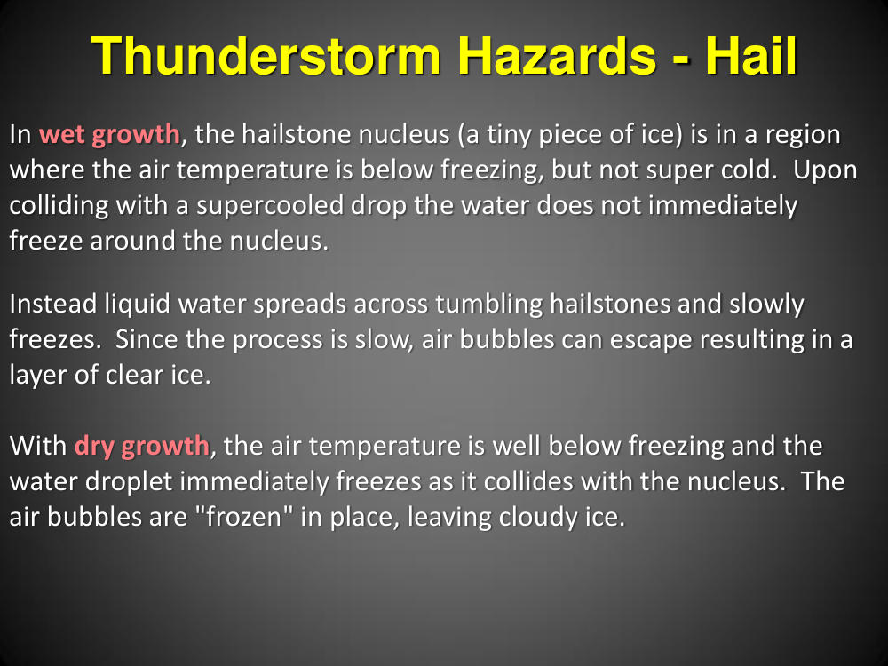

Thunderstorm Hazards 
- Hail
Thunderstorm Hazards - Hail 
  
 
 
wet growth , the hailstone nucleus (a tiny piece of ice) is in a region 
 Upon 
freeze around the nucleus.
 
 Instead liquid water spreads across tumbling hailstones and slowly 
 Since the process is slow, air bubbles can escape resulting in a 
 
 dry growth , the air temperature is well below freezing and the 
water droplet immediately freezes as it collides with the nucleus. 
 The 
 
    
In wet growth, the hailstone nucleus (a tiny piece of ice) is in a region 
where the air temperature is below freezing, but not super cold.  Upon 
colliding with a supercooled drop the water does not immediately 
freeze around the nucleus. 
 
Instead liquid water spreads across tumbling hailstones and slowly 
freezes.  Since the process is slow, air bubbles can escape resulting in a 
layer of clear ice.  
 
With dry growth, the air temperature is well below freezing and the 
water droplet immediately freezes as it collides with the nucleus.  The 
air bubbles are "frozen" in place, leaving cloudy ice.

## Page 24

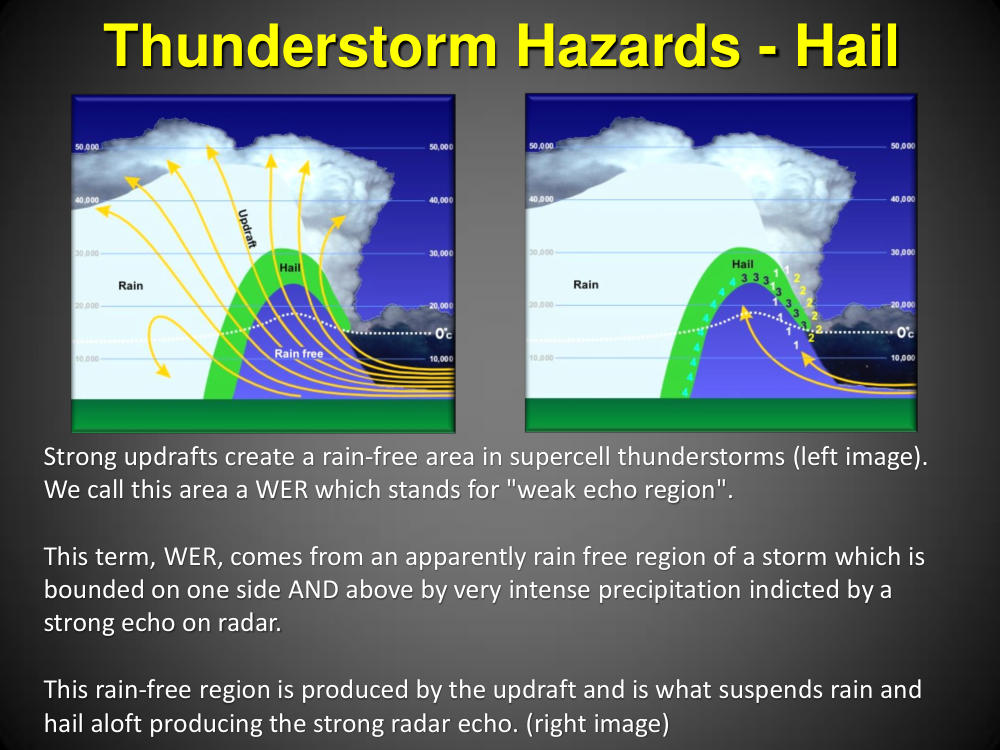

Thunderstorm Hazards 
- Hail
Thunderstorm Hazards - Hail 
  
 
 Strong updrafts create a rain
-free area in supercell thunderstorms (left image).  
We call this area a WER which stands for "weak echo region".
 
 This term, WER, comes from an apparently rain free region of a storm which is bounded on one side AND above by very intense precipitation indicted by a strong echo on radar.
 
 This rain
-free region is produced by the updraft and is what suspends rain and hail aloft producing the strong radar echo. (right image)
 
 
Strong updrafts create a rain-free area in supercell thunderstorms (left image).  
We call this area a WER which stands for "weak echo region". 
 
This term, WER, comes from an apparently rain free region of a storm which is 
bounded on one side AND above by very intense precipitation indicted by a 
strong echo on radar. 
 
This rain-free region is produced by the updraft and is what suspends rain and 
hail aloft producing the strong radar echo. (right image)

## Page 25

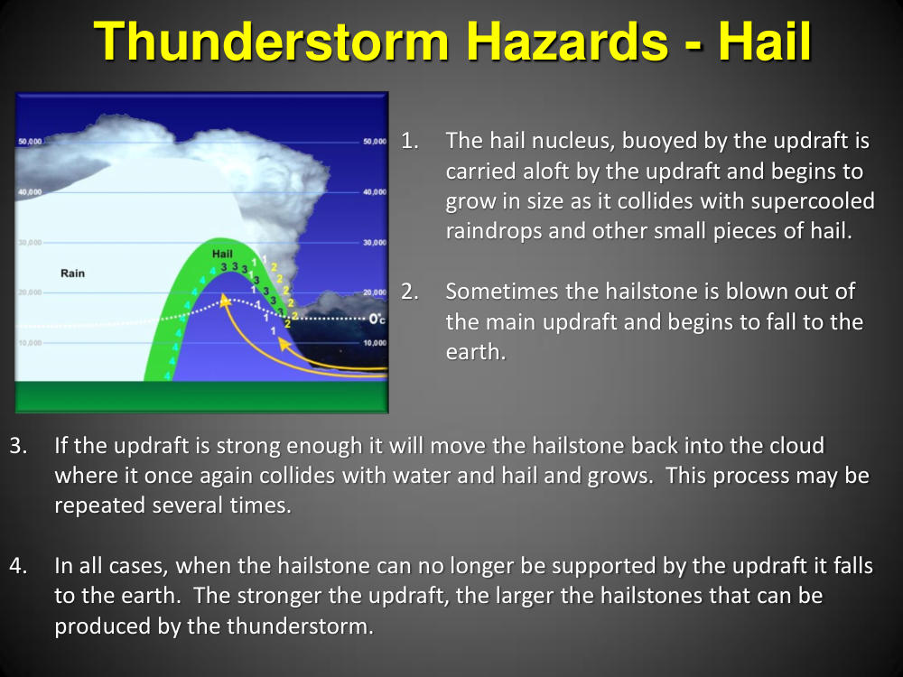

Thunderstorm Hazards 
- Hail
Thunderstorm Hazards - Hail 
  
 
 
  
 
 
3. If the updraft is strong enough it will move the hailstone back into the cloud where it once again collides with water and hail and grows.  This process may be repeated several times.
 
 4. In all cases, when the hailstone can no longer be supported by the updraft it falls to the earth.  The stronger the updraft, the larger the hailstones that can be produced by the thunderstorm. 
 
 
3.
If the updraft is strong enough it will move the hailstone back into the cloud 
where it once again collides with water and hail and grows.  This process may be 
repeated several times. 
 
4.
In all cases, when the hailstone can no longer be supported by the updraft it falls 
to the earth.  The stronger the updraft, the larger the hailstones that can be 
produced by the thunderstorm.  
1. The hail nucleus, buoyed by the updraft is carried aloft by the updraft and begins to grow in size as it collides with supercooled raindrops and other small pieces of hail.
 
 
2. Sometimes the hailstone is blown out of the main updraft and begins to fall to the earth.
 
1.
The hail nucleus, buoyed by the updraft is 
carried aloft by the updraft and begins to 
grow in size as it collides with supercooled 
raindrops and other small pieces of hail. 
 
2.
Sometimes the hailstone is blown out of 
the main updraft and begins to fall to the 
earth.

## Page 26

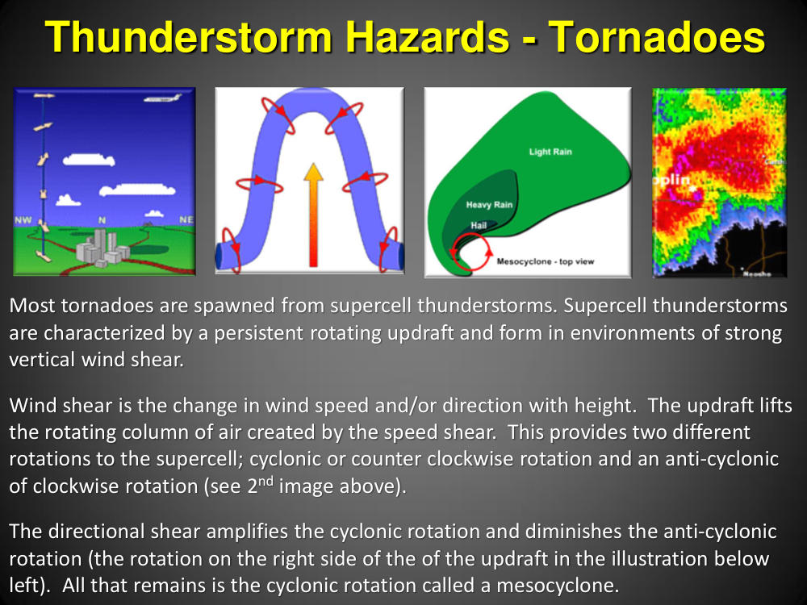

Thunderstorm Hazards 
- Tornadoes
Thunderstorm Hazards - Tornadoes 
  
 
 
  
 
 vertical wind shear.
 
the rotating column of air created by the speed shear.  This provides two different rotations to the supercell; cyclonic or counter clockwise rotation and an anti
-cyclonic 
nd image above).
 
-cyclonic 
rotation (the rotation on the right side of the of the updraft in the illustration below 
 
Most tornadoes are spawned from supercell thunderstorms. Supercell thunderstorms 
are characterized by a persistent rotating updraft and form in environments of strong 
vertical wind shear. 
 
Wind shear is the change in wind speed and/or direction with height.  The updraft lifts 
the rotating column of air created by the speed shear.  This provides two different 
rotations to the supercell; cyclonic or counter clockwise rotation and an anti-cyclonic 
of clockwise rotation (see 2nd image above). 
 
The directional shear amplifies the cyclonic rotation and diminishes the anti-cyclonic 
rotation (the rotation on the right side of the of the updraft in the illustration below 
left).  All that remains is the cyclonic rotation called a mesocyclone.

## Page 27

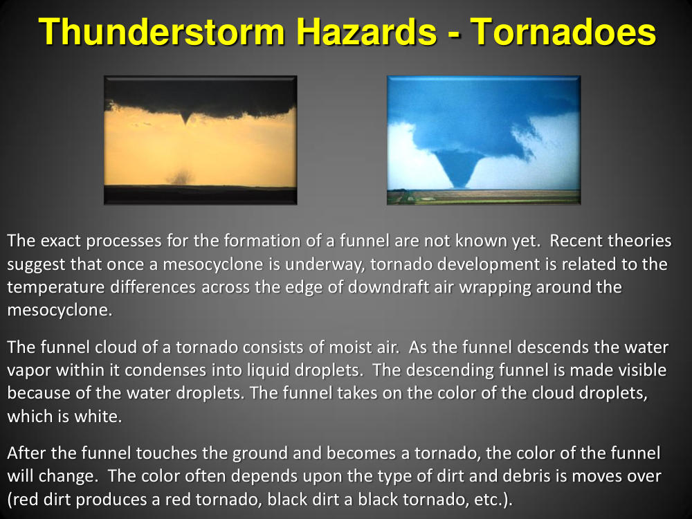

Thunderstorm Hazards 
- Tornadoes
Thunderstorm Hazards - Tornadoes 
  
 
 
  
 
 
 
 temperature differences across the edge of downdraft air wrapping around the mesocyclone.
 
 because of the water droplets. The funnel takes on the color of the cloud droplets, which is white.
 
 After the funnel touches the ground and becomes a tornado, the color of the funnel (red dirt produces a red tornado, black dirt a black tornado, etc.).
 
The exact processes for the formation of a funnel are not known yet.  Recent theories 
suggest that once a mesocyclone is underway, tornado development is related to the 
temperature differences across the edge of downdraft air wrapping around the 
mesocyclone. 
 
The funnel cloud of a tornado consists of moist air.  As the funnel descends the water 
vapor within it condenses into liquid droplets.  The descending funnel is made visible 
because of the water droplets. The funnel takes on the color of the cloud droplets, 
which is white. 
 
After the funnel touches the ground and becomes a tornado, the color of the funnel 
will change.  The color often depends upon the type of dirt and debris is moves over 
(red dirt produces a red tornado, black dirt a black tornado, etc.).

## Page 28

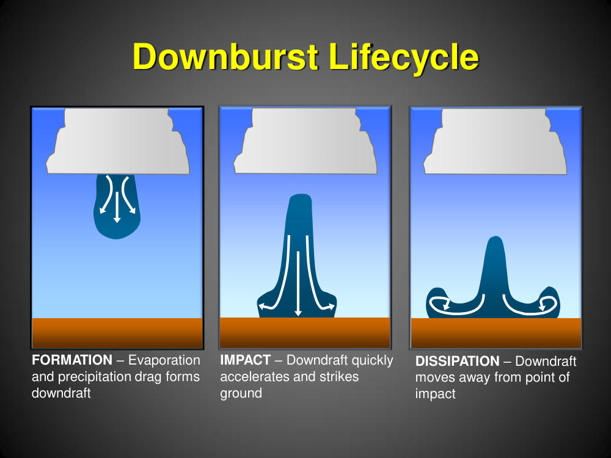

Downburst Lifecycle
Downburst Lifecycle 
FORMATION – Evaporation 
and precipitation drag forms 
downdraft 
IMPACT – Downdraft quickly 
accelerates and strikes 
ground 
DISSIPATION – Downdraft 
moves away from point of 
impact

## Page 29

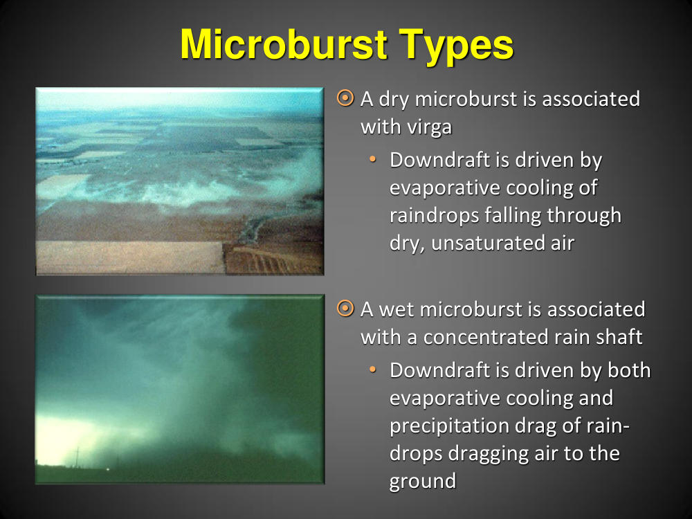

Microburst Types
Microburst Types 
A dry microburst is associated with virga
 
• Downdraft is driven by evaporative cooling of raindrops falling through dry, unsaturated air
 
 A wet microburst is associated with a concentrated rain shaft
 
• Downdraft is driven by both  evaporative cooling and precipitation drag of rain
-
drops dragging air to the ground
 
A dry microburst is associated 
with virga 
• Downdraft is driven by 
evaporative cooling of 
raindrops falling through 
dry, unsaturated air 
 
A wet microburst is associated 
with a concentrated rain shaft 
• Downdraft is driven by both  
evaporative cooling and 
precipitation drag of rain-
drops dragging air to the 
ground

## Page 30

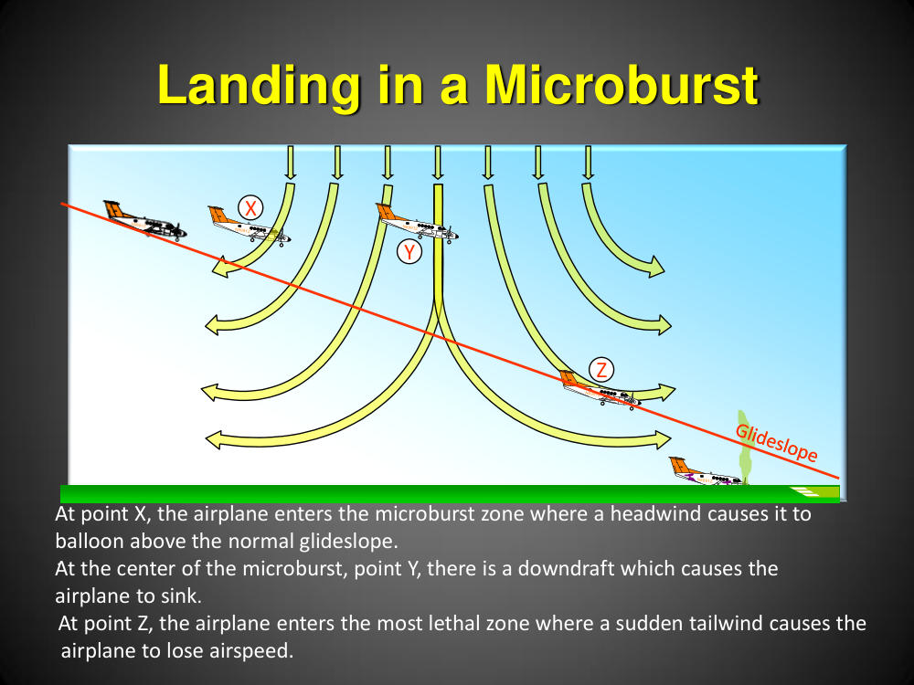

Landing in a Microburst
Landing in a Microburst 
X 
Y 
Z 
At point X, the airplane enters the microburst zone where a headwind causes it to 
balloon above the normal glideslope.    
At the center of the microburst, point Y, there is a downdraft which causes the 
airplane to sink.   
. 
    At point Z, the airplane enters the most lethal zone where a sudden tailwind causes the  
    airplane to lose airspeed.

## Page 31

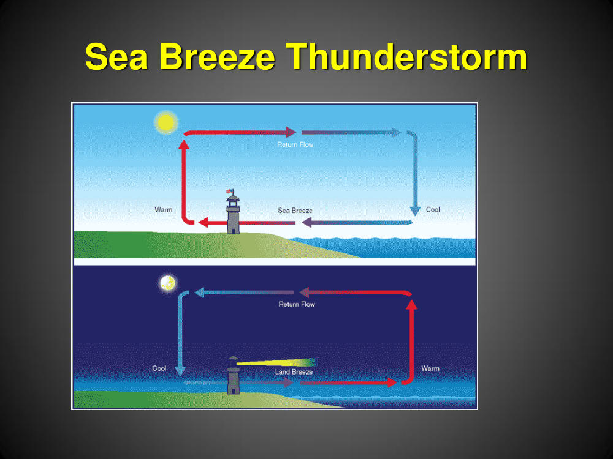

Sea Breeze Thunderstorm
Sea Breeze Thunderstorm
