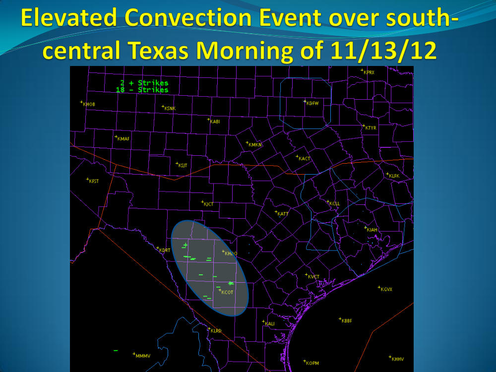
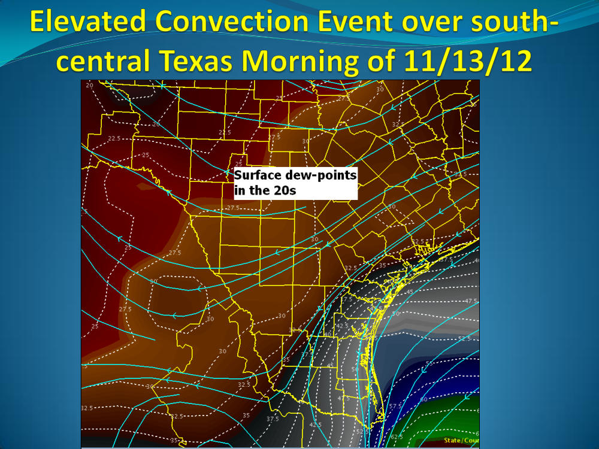
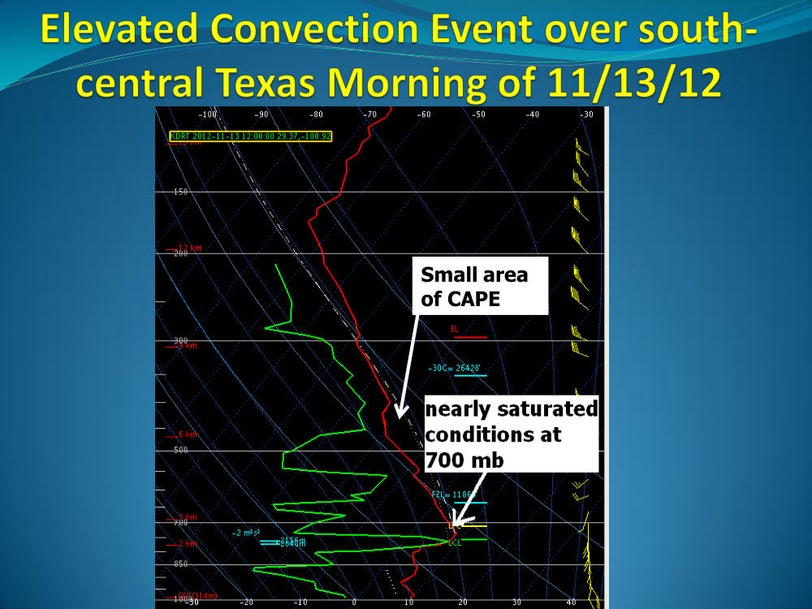
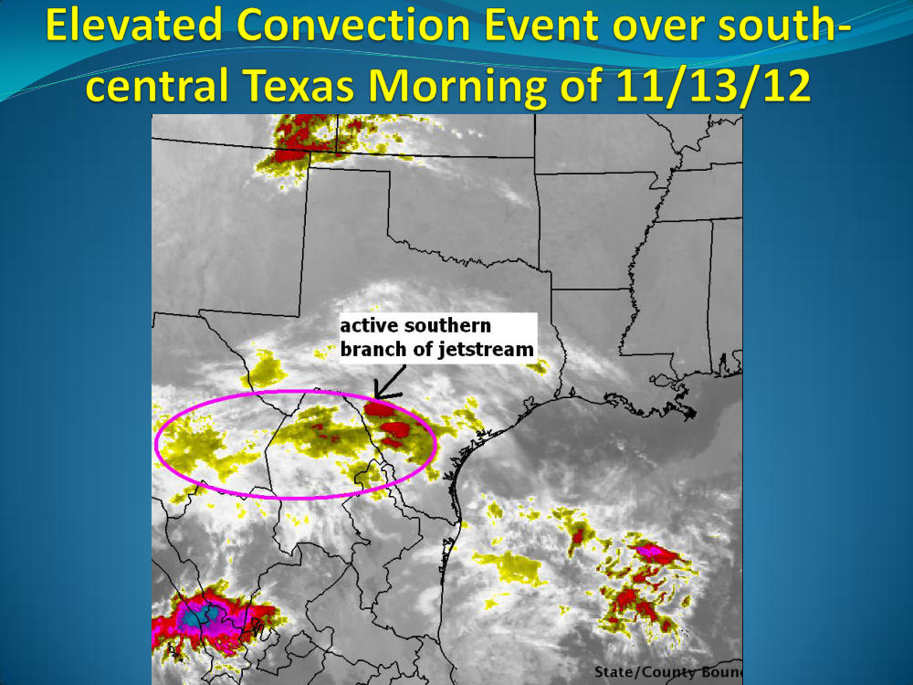
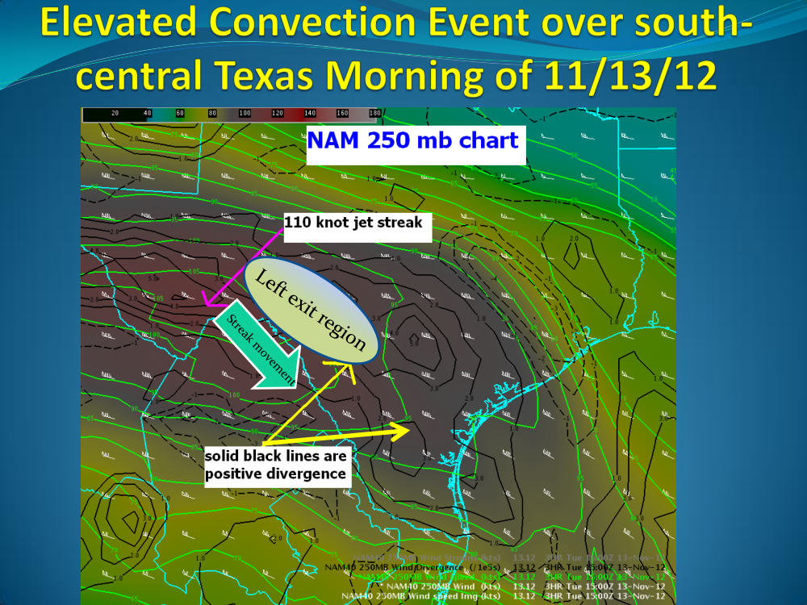
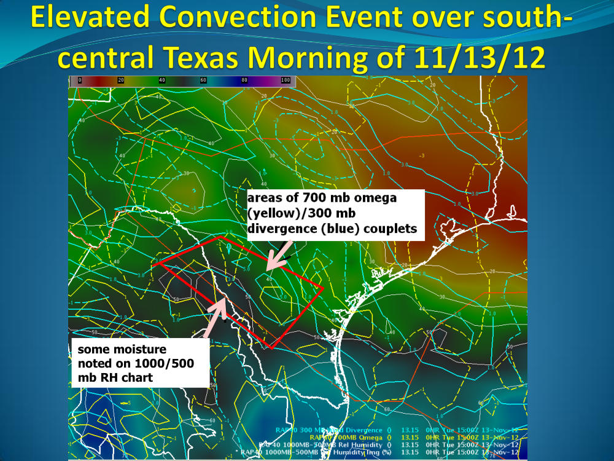

# Elevated Thunderstorm Event Review - South Texas 2012

> Source: <http://www.weather.gov/media/zhu/ZHU_Training_Page/Event_Writeups/elevated_convection_Nov2012.pdf>  
> Section: Elevated Thunderstorms  
> Captured: 2026-08-19 06:00 UTC  
> PDF: [elevated-thunderstorm-event-review-south-texas-2012.pdf](elevated-thunderstorm-event-review-south-texas-2012.pdf) (6 pages)

---

## Page 1

_(no extractable text on this page — see rendered image above)_

## Page 2

_(no extractable text on this page — see rendered image above)_

## Page 3

Small area 
of CAPE

## Page 4

_(no extractable text on this page — see rendered image above)_

## Page 5

_(no extractable text on this page — see rendered image above)_

## Page 6

some moisture 
noted on 1000/500 
mb RH chart
