# Elevated Thunderstorms across the Northern Plains - NWS Paper

> Source: <http://www.weather.gov/media/zhu/ZHU_Training_Page/thunderstorm_stuff/elevated_convection/elevated_thunderstorm_CRH_TA.pdf>  
> Section: Elevated Thunderstorms  
> Captured: 2026-08-19 06:00 UTC  
> PDF: [elevated-thunderstorms-across-the-northern-plains-nws-paper.pdf](elevated-thunderstorms-across-the-northern-plains-nws-paper.pdf) (15 pages)

---

## Page 1

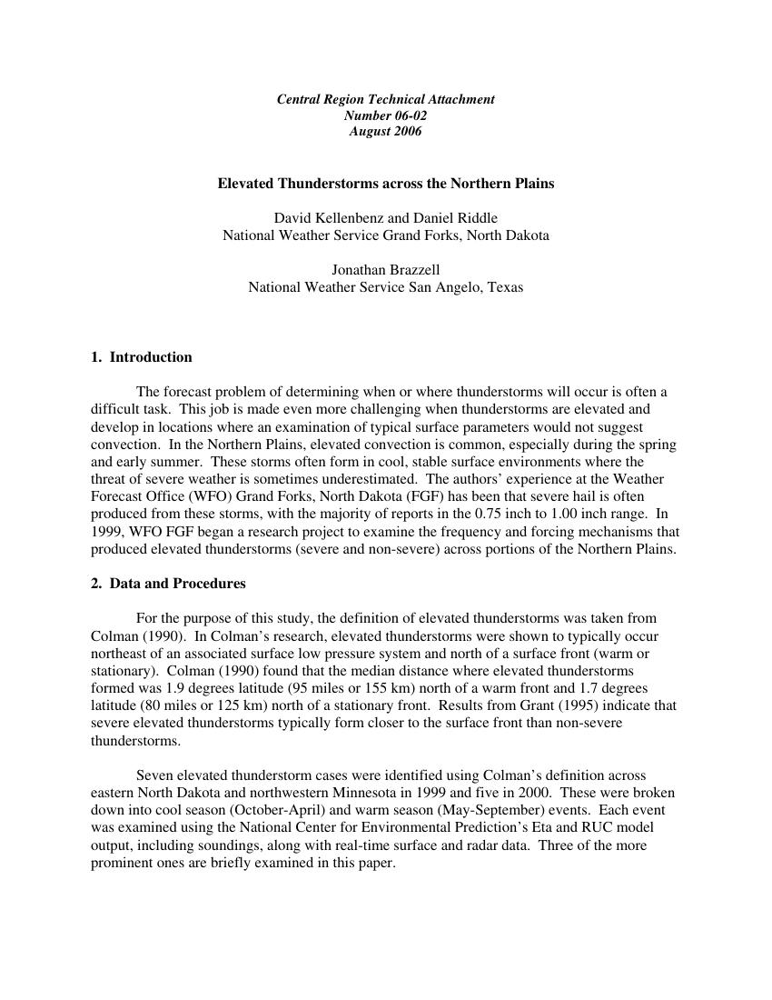

Central Region Technical Attachment 
Number 06-02 
August 2006 
 
 
Elevated Thunderstorms across the Northern Plains 
 
David Kellenbenz and Daniel Riddle 
National Weather Service Grand Forks, North Dakota 
 
Jonathan Brazzell 
National Weather Service San Angelo, Texas 
 
 
 
1.  Introduction 
 
 
The forecast problem of determining when or where thunderstorms will occur is often a 
difficult task.  This job is made even more challenging when thunderstorms are elevated and 
develop in locations where an examination of typical surface parameters would not suggest 
convection.  In the Northern Plains, elevated convection is common, especially during the spring 
and early summer.  These storms often form in cool, stable surface environments where the 
threat of severe weather is sometimes underestimated.  The authors’ experience at the Weather 
Forecast Office (WFO) Grand Forks, North Dakota (FGF) has been that severe hail is often 
produced from these storms, with the majority of reports in the 0.75 inch to 1.00 inch range.  In 
1999, WFO FGF began a research project to examine the frequency and forcing mechanisms that 
produced elevated thunderstorms (severe and non-severe) across portions of the Northern Plains.    
 
2.  Data and Procedures 
 
 
For the purpose of this study, the definition of elevated thunderstorms was taken from 
Colman (1990).  In Colman’s research, elevated thunderstorms were shown to typically occur 
northeast of an associated surface low pressure system and north of a surface front (warm or 
stationary).  Colman (1990) found that the median distance where elevated thunderstorms 
formed was 1.9 degrees latitude (95 miles or 155 km) north of a warm front and 1.7 degrees 
latitude (80 miles or 125 km) north of a stationary front.  Results from Grant (1995) indicate that 
severe elevated thunderstorms typically form closer to the surface front than non-severe 
thunderstorms. 
 
 
Seven elevated thunderstorm cases were identified using Colman’s definition across 
eastern North Dakota and northwestern Minnesota in 1999 and five in 2000.  These were broken 
down into cool season (October-April) and warm season (May-September) events.  Each event 
was examined using the National Center for Environmental Prediction’s Eta and RUC model 
output, including soundings, along with real-time surface and radar data.  Three of the more 
prominent ones are briefly examined in this paper.

## Page 2

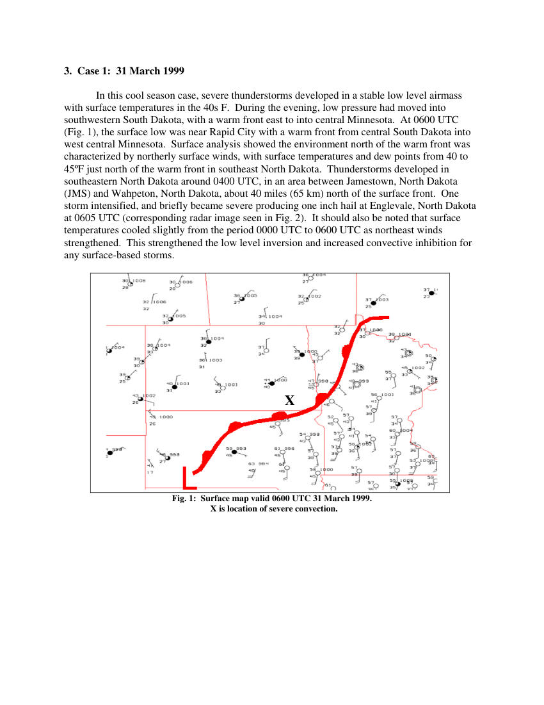

3.  Case 1:  31 March 1999  
 
 
In this cool season case, severe thunderstorms developed in a stable low level airmass 
with surface temperatures in the 40s F.  During the evening, low pressure had moved into 
southwestern South Dakota, with a warm front east to into central Minnesota.  At 0600 UTC 
(Fig. 1), the surface low was near Rapid City with a warm front from central South Dakota into 
west central Minnesota.  Surface analysis showed the environment north of the warm front was 
characterized by northerly surface winds, with surface temperatures and dew points from 40 to 
45ºF just north of the warm front in southeast North Dakota.  Thunderstorms developed in 
southeastern North Dakota around 0400 UTC, in an area between Jamestown, North Dakota 
(JMS) and Wahpeton, North Dakota, about 40 miles (65 km) north of the surface front.  One 
storm intensified, and briefly became severe producing one inch hail at Englevale, North Dakota 
at 0605 UTC (corresponding radar image seen in Fig. 2).  It should also be noted that surface 
temperatures cooled slightly from the period 0000 UTC to 0600 UTC as northeast winds 
strengthened.  This strengthened the low level inversion and increased convective inhibition for 
any surface-based storms.  
 
 
Fig. 1:  Surface map valid 0600 UTC 31 March 1999.   
X is location of severe convection. 
 
 
X

## Page 3

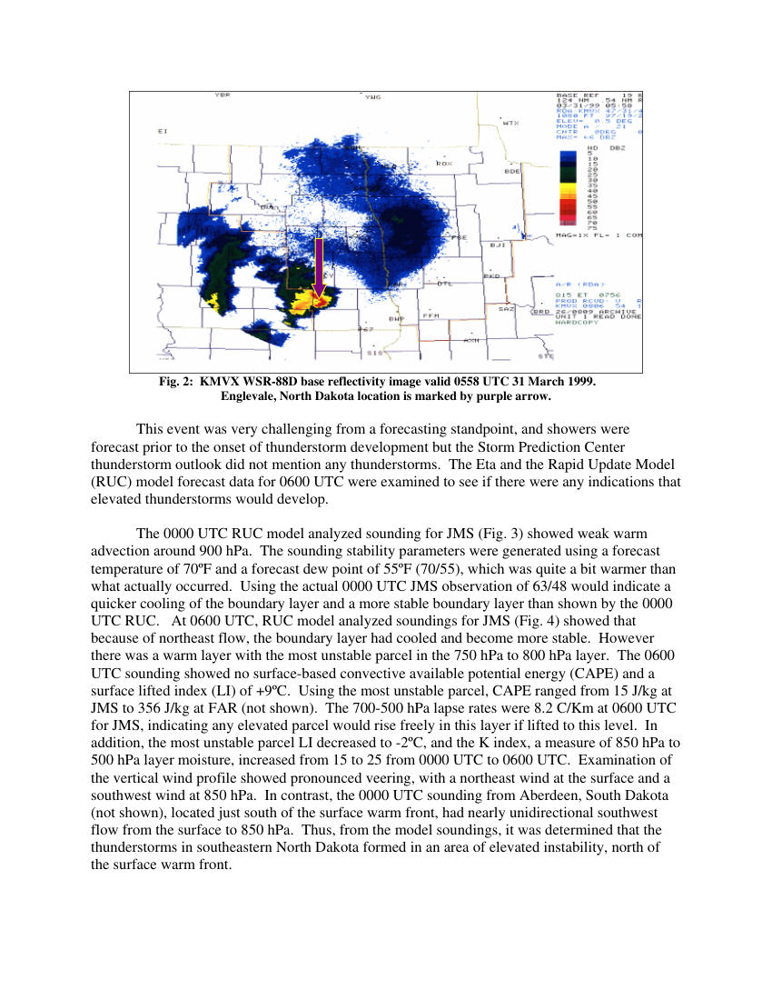

Fig. 2:  KMVX WSR-88D base reflectivity image valid 0558 UTC 31 March 1999. 
Englevale, North Dakota location is marked by purple arrow. 
 
 
 
This event was very challenging from a forecasting standpoint, and showers were 
forecast prior to the onset of thunderstorm development but the Storm Prediction Center 
thunderstorm outlook did not mention any thunderstorms.  The Eta and the Rapid Update Model 
(RUC) model forecast data for 0600 UTC were examined to see if there were any indications that 
elevated thunderstorms would develop.  
 
 
The 0000 UTC RUC model analyzed sounding for JMS (Fig. 3) showed weak warm 
advection around 900 hPa.  The sounding stability parameters were generated using a forecast 
temperature of 70ºF and a forecast dew point of 55ºF (70/55), which was quite a bit warmer than 
what actually occurred.  Using the actual 0000 UTC JMS observation of 63/48 would indicate a 
quicker cooling of the boundary layer and a more stable boundary layer than shown by the 0000 
UTC RUC.   At 0600 UTC, RUC model analyzed soundings for JMS (Fig. 4) showed that 
because of northeast flow, the boundary layer had cooled and become more stable.  However 
there was a warm layer with the most unstable parcel in the 750 hPa to 800 hPa layer.  The 0600 
UTC sounding showed no surface-based convective available potential energy (CAPE) and a 
surface lifted index (LI) of +9ºC.  Using the most unstable parcel, CAPE ranged from 15 J/kg at 
JMS to 356 J/kg at FAR (not shown).  The 700-500 hPa lapse rates were 8.2 C/Km at 0600 UTC 
for JMS, indicating any elevated parcel would rise freely in this layer if lifted to this level.  In 
addition, the most unstable parcel LI decreased to -2ºC, and the K index, a measure of 850 hPa to 
500 hPa layer moisture, increased from 15 to 25 from 0000 UTC to 0600 UTC.  Examination of 
the vertical wind profile showed pronounced veering, with a northeast wind at the surface and a 
southwest wind at 850 hPa.  In contrast, the 0000 UTC sounding from Aberdeen, South Dakota 
(not shown), located just south of the surface warm front, had nearly unidirectional southwest 
flow from the surface to 850 hPa.  Thus, from the model soundings, it was determined that the 
thunderstorms in southeastern North Dakota formed in an area of elevated instability, north of 
the surface warm front.

## Page 4

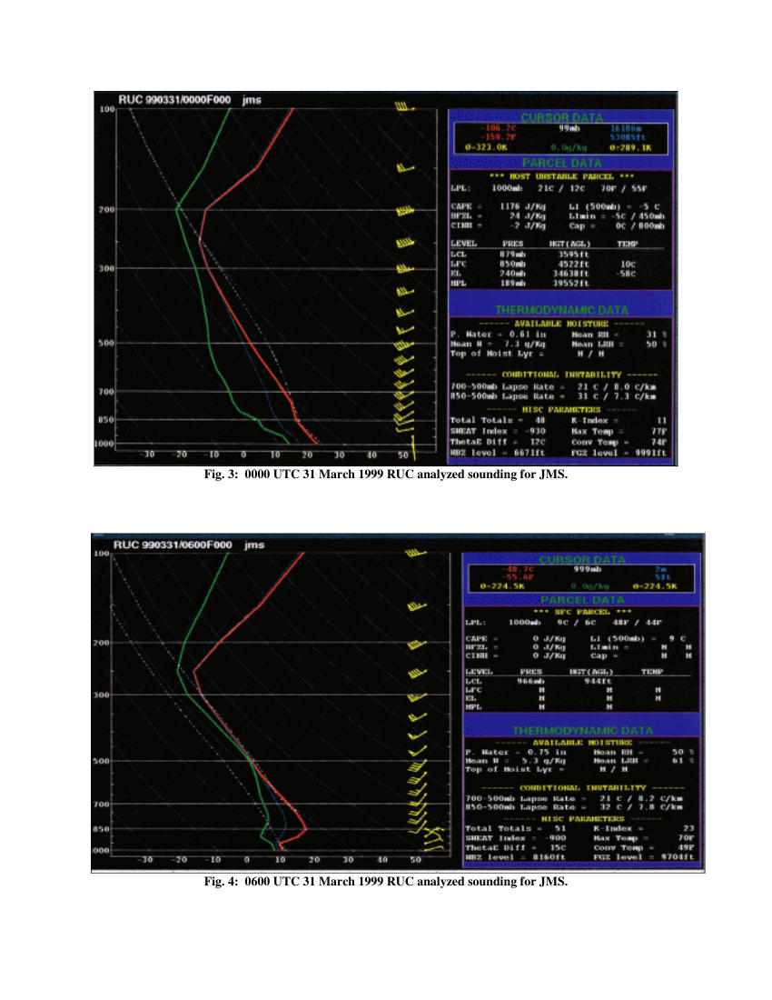

Fig. 3:  0000 UTC 31 March 1999 RUC analyzed sounding for JMS. 
 
 
 
 
Fig. 4:  0600 UTC 31 March 1999 RUC analyzed sounding for JMS.

## Page 5

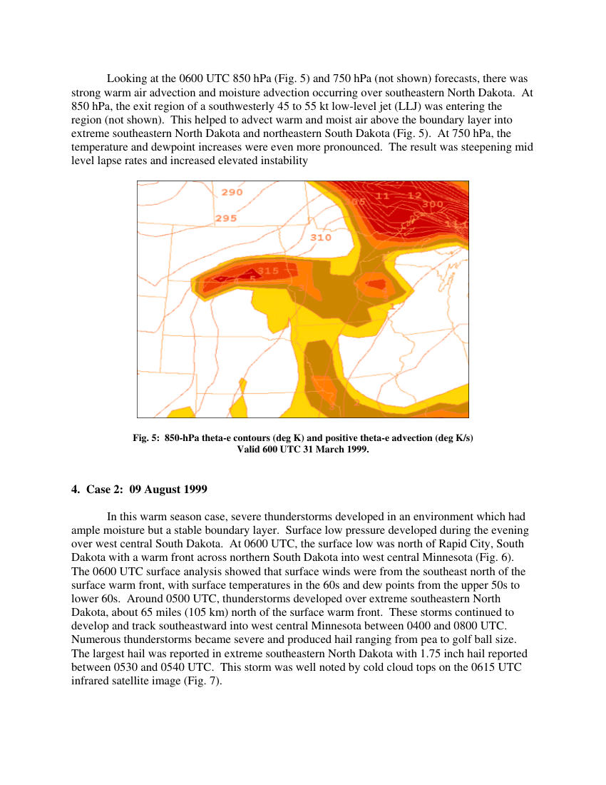

Looking at the 0600 UTC 850 hPa (Fig. 5) and 750 hPa (not shown) forecasts, there was 
strong warm air advection and moisture advection occurring over southeastern North Dakota.  At 
850 hPa, the exit region of a southwesterly 45 to 55 kt low-level jet (LLJ) was entering the 
region (not shown).  This helped to advect warm and moist air above the boundary layer into 
extreme southeastern North Dakota and northeastern South Dakota (Fig. 5).  At 750 hPa, the 
temperature and dewpoint increases were even more pronounced.  The result was steepening mid 
level lapse rates and increased elevated instability    
 
 
 
Fig. 5:  850-hPa theta-e contours (deg K) and positive theta-e advection (deg K/s) 
Valid 600 UTC 31 March 1999. 
 
 
4.  Case 2:  09 August 1999 
 
 
In this warm season case, severe thunderstorms developed in an environment which had 
ample moisture but a stable boundary layer.  Surface low pressure developed during the evening 
over west central South Dakota.  At 0600 UTC, the surface low was north of Rapid City, South 
Dakota with a warm front across northern South Dakota into west central Minnesota (Fig. 6).  
The 0600 UTC surface analysis showed that surface winds were from the southeast north of the 
surface warm front, with surface temperatures in the 60s and dew points from the upper 50s to 
lower 60s.  Around 0500 UTC, thunderstorms developed over extreme southeastern North 
Dakota, about 65 miles (105 km) north of the surface warm front.  These storms continued to 
develop and track southeastward into west central Minnesota between 0400 and 0800 UTC.  
Numerous thunderstorms became severe and produced hail ranging from pea to golf ball size.  
The largest hail was reported in extreme southeastern North Dakota with 1.75 inch hail reported 
between 0530 and 0540 UTC.  This storm was well noted by cold cloud tops on the 0615 UTC 
infrared satellite image (Fig. 7).

## Page 6

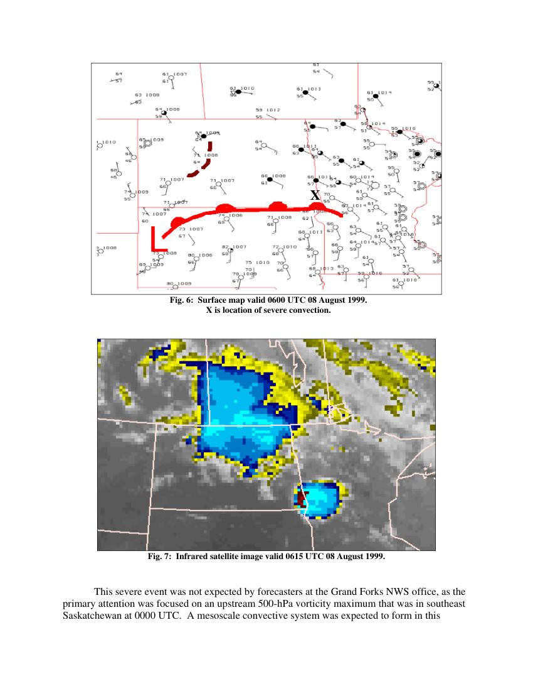

Fig. 6:  Surface map valid 0600 UTC 08 August 1999.   
X is location of severe convection. 
 
 
 
Fig. 7:  Infrared satellite image valid 0615 UTC 08 August 1999. 
 
 
 
This severe event was not expected by forecasters at the Grand Forks NWS office, as the 
primary attention was focused on an upstream 500-hPa vorticity maximum that was in southeast 
Saskatchewan at 0000 UTC.  A mesoscale convective system was expected to form in this 
X

## Page 7

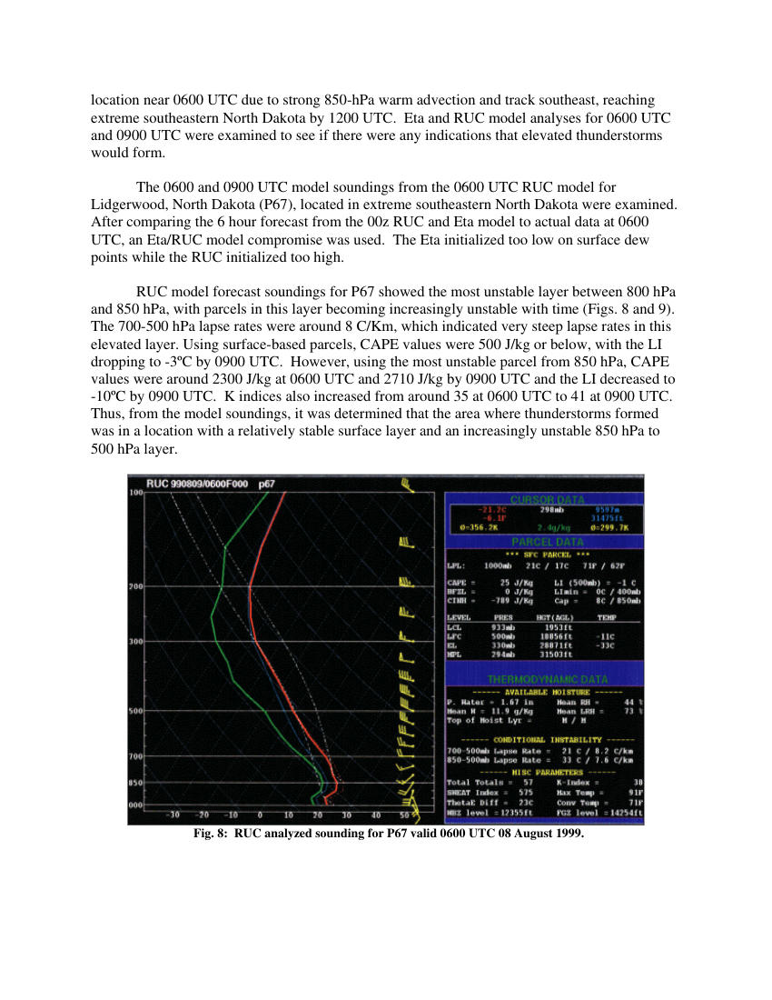

location near 0600 UTC due to strong 850-hPa warm advection and track southeast, reaching 
extreme southeastern North Dakota by 1200 UTC.  Eta and RUC model analyses for 0600 UTC 
and 0900 UTC were examined to see if there were any indications that elevated thunderstorms 
would form.  
 
 
The 0600 and 0900 UTC model soundings from the 0600 UTC RUC model for 
Lidgerwood, North Dakota (P67), located in extreme southeastern North Dakota were examined.  
After comparing the 6 hour forecast from the 00z RUC and Eta model to actual data at 0600 
UTC, an Eta/RUC model compromise was used.  The Eta initialized too low on surface dew 
points while the RUC initialized too high.   
 
 
RUC model forecast soundings for P67 showed the most unstable layer between 800 hPa 
and 850 hPa, with parcels in this layer becoming increasingly unstable with time (Figs. 8 and 9).  
The 700-500 hPa lapse rates were around 8 C/Km, which indicated very steep lapse rates in this 
elevated layer. Using surface-based parcels, CAPE values were 500 J/kg or below, with the LI 
dropping to -3ºC by 0900 UTC.  However, using the most unstable parcel from 850 hPa, CAPE 
values were around 2300 J/kg at 0600 UTC and 2710 J/kg by 0900 UTC and the LI decreased to 
-10ºC by 0900 UTC.  K indices also increased from around 35 at 0600 UTC to 41 at 0900 UTC.  
Thus, from the model soundings, it was determined that the area where thunderstorms formed 
was in a location with a relatively stable surface layer and an increasingly unstable 850 hPa to 
500 hPa layer.  
 
 
Fig. 8:  RUC analyzed sounding for P67 valid 0600 UTC 08 August 1999.

## Page 8

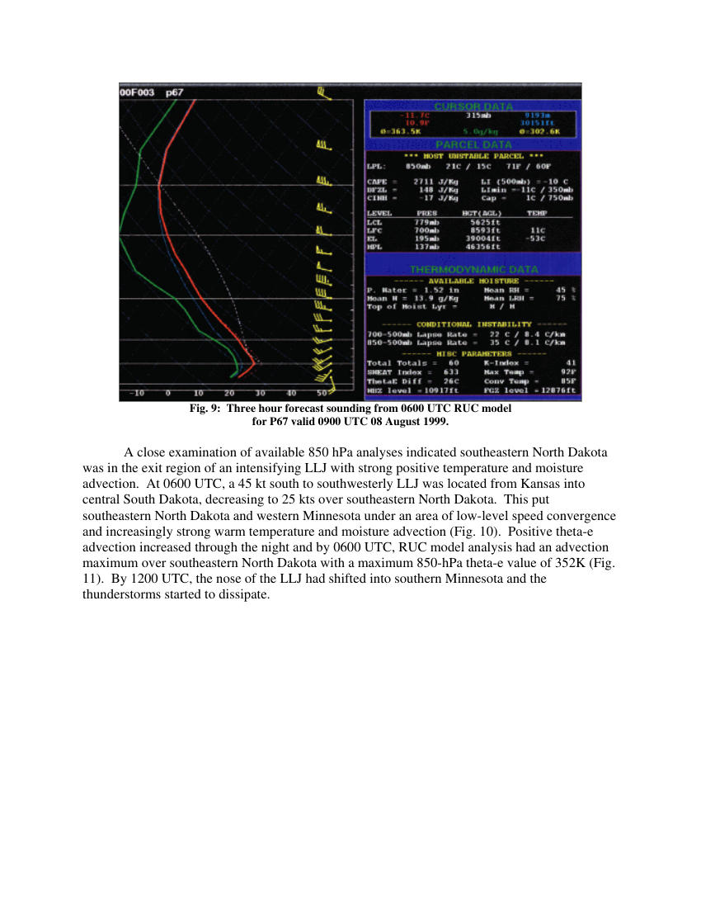

Fig. 9:  Three hour forecast sounding from 0600 UTC RUC model  
for P67 valid 0900 UTC 08 August 1999. 
 
 
A close examination of available 850 hPa analyses indicated southeastern North Dakota 
was in the exit region of an intensifying LLJ with strong positive temperature and moisture 
advection.  At 0600 UTC, a 45 kt south to southwesterly LLJ was located from Kansas into 
central South Dakota, decreasing to 25 kts over southeastern North Dakota.  This put 
southeastern North Dakota and western Minnesota under an area of low-level speed convergence 
and increasingly strong warm temperature and moisture advection (Fig. 10).  Positive theta-e 
advection increased through the night and by 0600 UTC, RUC model analysis had an advection 
maximum over southeastern North Dakota with a maximum 850-hPa theta-e value of 352K (Fig. 
11).  By 1200 UTC, the nose of the LLJ had shifted into southern Minnesota and the 
thunderstorms started to dissipate.

## Page 9

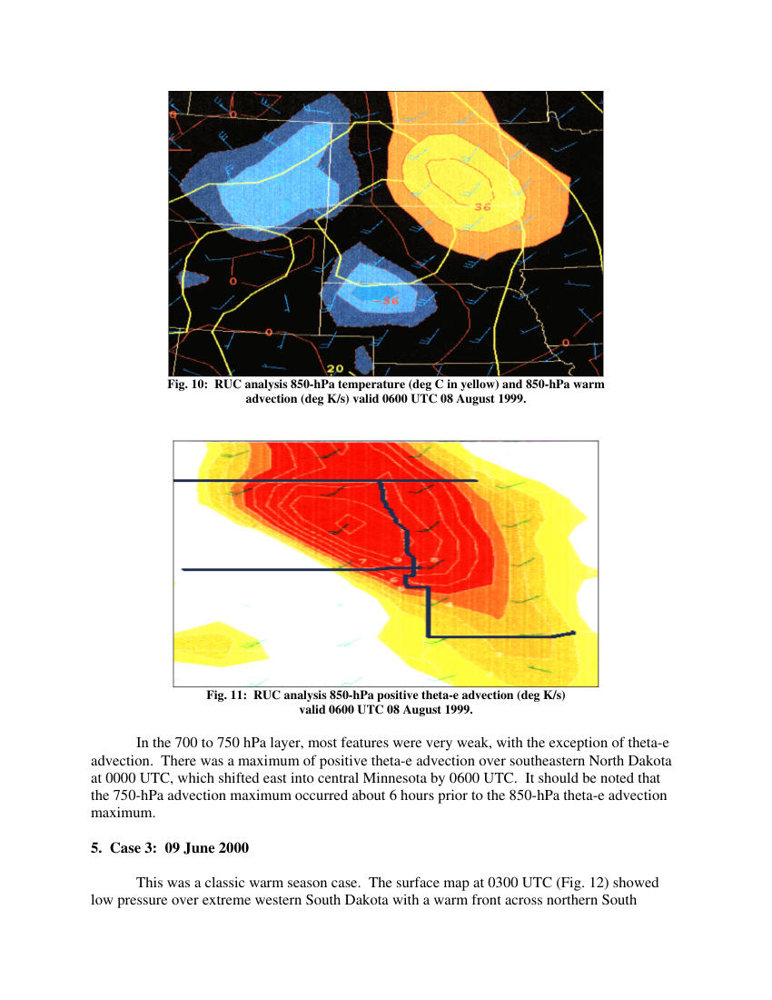

Fig. 10:  RUC analysis 850-hPa temperature (deg C in yellow) and 850-hPa warm  
advection (deg K/s) valid 0600 UTC 08 August 1999. 
 
 
 
Fig. 11:  RUC analysis 850-hPa positive theta-e advection (deg K/s) 
valid 0600 UTC 08 August 1999. 
 
 
In the 700 to 750 hPa layer, most features were very weak, with the exception of theta-e 
advection.  There was a maximum of positive theta-e advection over southeastern North Dakota 
at 0000 UTC, which shifted east into central Minnesota by 0600 UTC.  It should be noted that 
the 750-hPa advection maximum occurred about 6 hours prior to the 850-hPa theta-e advection 
maximum.       
 
5.  Case 3:  09 June 2000 
 
 
 
 
 
This was a classic warm season case.  The surface map at 0300 UTC (Fig. 12) showed 
low pressure over extreme western South Dakota with a warm front across northern South

## Page 10

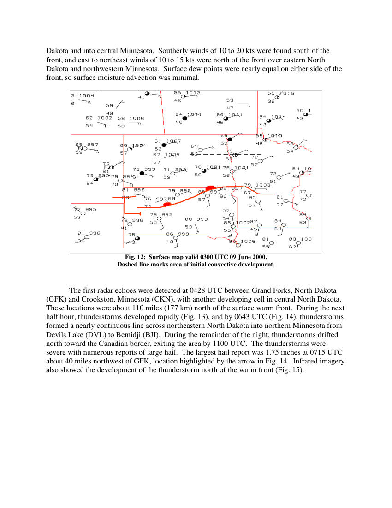

Dakota and into central Minnesota.  Southerly winds of 10 to 20 kts were found south of the 
front, and east to northeast winds of 10 to 15 kts were north of the front over eastern North 
Dakota and northwestern Minnesota.  Surface dew points were nearly equal on either side of the 
front, so surface moisture advection was minimal.   
 
 
Fig. 12:  Surface map valid 0300 UTC 09 June 2000.    
Dashed line marks area of initial convective development. 
 
 
 
 
The first radar echoes were detected at 0428 UTC between Grand Forks, North Dakota 
(GFK) and Crookston, Minnesota (CKN), with another developing cell in central North Dakota.  
These locations were about 110 miles (177 km) north of the surface warm front.  During the next 
half hour, thunderstorms developed rapidly (Fig. 13), and by 0643 UTC (Fig. 14), thunderstorms 
formed a nearly continuous line across northeastern North Dakota into northern Minnesota from 
Devils Lake (DVL) to Bemidji (BJI).  During the remainder of the night, thunderstorms drifted 
north toward the Canadian border, exiting the area by 1100 UTC.  The thunderstorms were 
severe with numerous reports of large hail.  The largest hail report was 1.75 inches at 0715 UTC 
about 40 miles northwest of GFK, location highlighted by the arrow in Fig. 14.  Infrared imagery  
also showed the development of the thunderstorm north of the warm front (Fig. 15). 
_ _ _ _ _ _ _ _ _ _ _

## Page 11

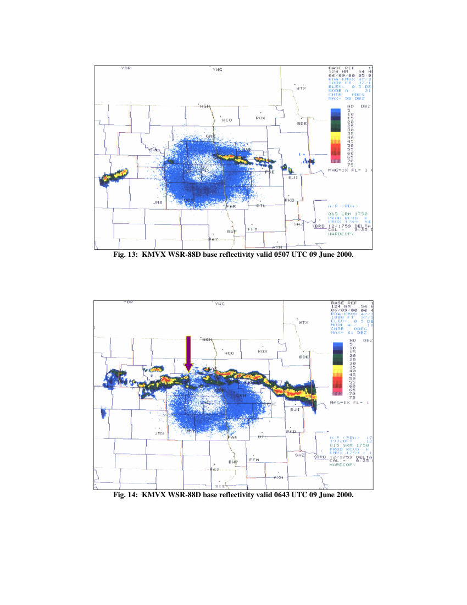

Fig. 13:  KMVX WSR-88D base reflectivity valid 0507 UTC 09 June 2000. 
 
 
 
 
 
Fig. 14:  KMVX WSR-88D base reflectivity valid 0643 UTC 09 June 2000.

## Page 12

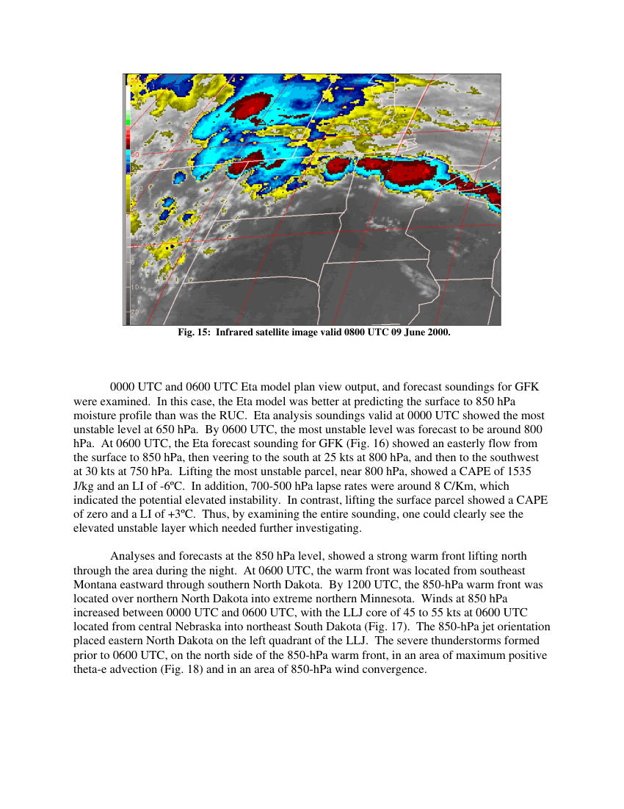

Fig. 15:  Infrared satellite image valid 0800 UTC 09 June 2000. 
 
 
 
 
0000 UTC and 0600 UTC Eta model plan view output, and forecast soundings for GFK 
were examined.  In this case, the Eta model was better at predicting the surface to 850 hPa 
moisture profile than was the RUC.  Eta analysis soundings valid at 0000 UTC showed the most 
unstable level at 650 hPa.  By 0600 UTC, the most unstable level was forecast to be around 800 
hPa.  At 0600 UTC, the Eta forecast sounding for GFK (Fig. 16) showed an easterly flow from 
the surface to 850 hPa, then veering to the south at 25 kts at 800 hPa, and then to the southwest 
at 30 kts at 750 hPa.  Lifting the most unstable parcel, near 800 hPa, showed a CAPE of 1535 
J/kg and an LI of -6ºC.  In addition, 700-500 hPa lapse rates were around 8 C/Km, which 
indicated the potential elevated instability.  In contrast, lifting the surface parcel showed a CAPE 
of zero and a LI of +3ºC.  Thus, by examining the entire sounding, one could clearly see the 
elevated unstable layer which needed further investigating. 
 
 
Analyses and forecasts at the 850 hPa level, showed a strong warm front lifting north 
through the area during the night.  At 0600 UTC, the warm front was located from southeast 
Montana eastward through southern North Dakota.  By 1200 UTC, the 850-hPa warm front was 
located over northern North Dakota into extreme northern Minnesota.  Winds at 850 hPa 
increased between 0000 UTC and 0600 UTC, with the LLJ core of 45 to 55 kts at 0600 UTC 
located from central Nebraska into northeast South Dakota (Fig. 17).  The 850-hPa jet orientation 
placed eastern North Dakota on the left quadrant of the LLJ.  The severe thunderstorms formed 
prior to 0600 UTC, on the north side of the 850-hPa warm front, in an area of maximum positive 
theta-e advection (Fig. 18) and in an area of 850-hPa wind convergence.

## Page 13

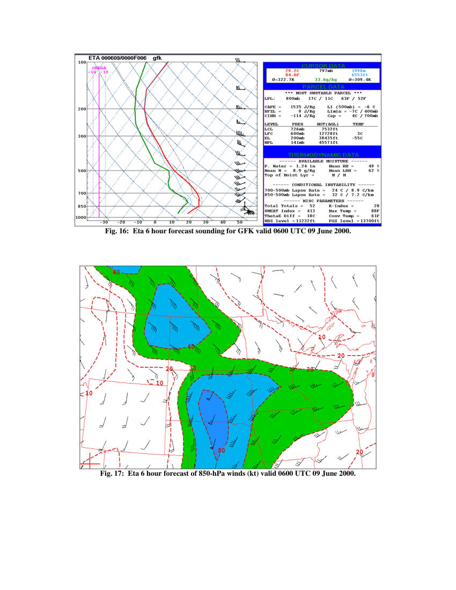

Fig. 16:  Eta 6 hour forecast sounding for GFK valid 0600 UTC 09 June 2000. 
 
 
 
 
Fig. 17:  Eta 6 hour forecast of 850-hPa winds (kt) valid 0600 UTC 09 June 2000.

## Page 14

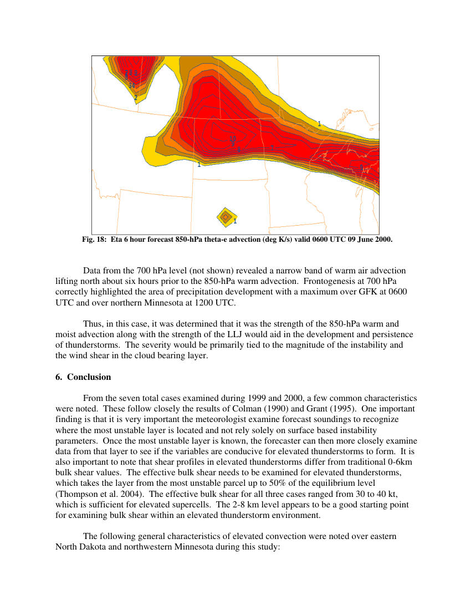

Fig. 18:  Eta 6 hour forecast 850-hPa theta-e advection (deg K/s) valid 0600 UTC 09 June 2000. 
 
 
 
Data from the 700 hPa level (not shown) revealed a narrow band of warm air advection 
lifting north about six hours prior to the 850-hPa warm advection.  Frontogenesis at 700 hPa 
correctly highlighted the area of precipitation development with a maximum over GFK at 0600 
UTC and over northern Minnesota at 1200 UTC.   
 
 
Thus, in this case, it was determined that it was the strength of the 850-hPa warm and 
moist advection along with the strength of the LLJ would aid in the development and persistence 
of thunderstorms.  The severity would be primarily tied to the magnitude of the instability and 
the wind shear in the cloud bearing layer.  
 
   
 
 
6.  Conclusion 
 
 
 
From the seven total cases examined during 1999 and 2000, a few common characteristics 
were noted.  These follow closely the results of Colman (1990) and Grant (1995).  One important 
finding is that it is very important the meteorologist examine forecast soundings to recognize 
where the most unstable layer is located and not rely solely on surface based instability 
parameters.  Once the most unstable layer is known, the forecaster can then more closely examine 
data from that layer to see if the variables are conducive for elevated thunderstorms to form.  It is 
also important to note that shear profiles in elevated thunderstorms differ from traditional 0-6km 
bulk shear values.  The effective bulk shear needs to be examined for elevated thunderstorms, 
which takes the layer from the most unstable parcel up to 50% of the equilibrium level 
(Thompson et al. 2004).  The effective bulk shear for all three cases ranged from 30 to 40 kt, 
which is sufficient for elevated supercells.  The 2-8 km level appears to be a good starting point 
for examining bulk shear within an elevated thunderstorm environment. 
 
 
 
The following general characteristics of elevated convection were noted over eastern 
North Dakota and northwestern Minnesota during this study:

## Page 15

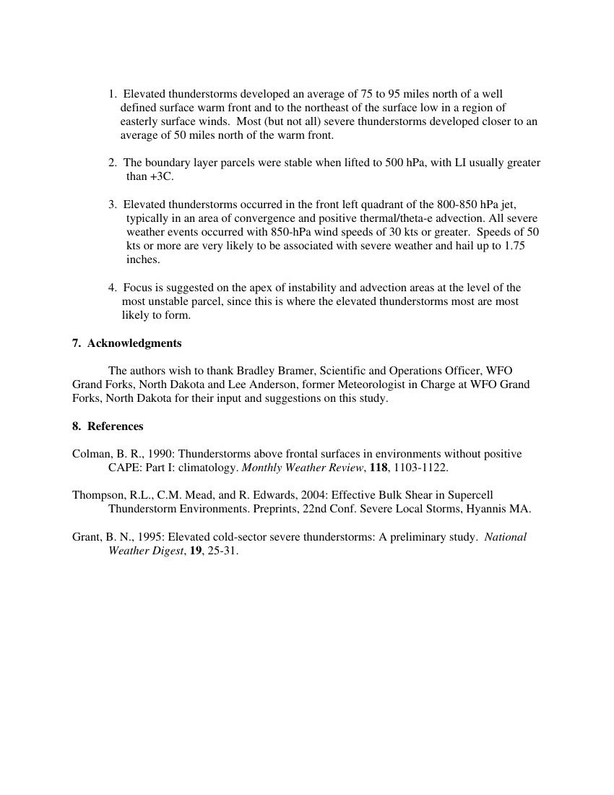

1.  Elevated thunderstorms developed an average of 75 to 95 miles north of a well 
    defined surface warm front and to the northeast of the surface low in a region of  
    easterly surface winds.  Most (but not all) severe thunderstorms developed closer to an 
    average of 50 miles north of the warm front. 
 
 
2.  The boundary layer parcels were stable when lifted to 500 hPa, with LI usually greater 
than +3C. 
 
3.  Elevated thunderstorms occurred in the front left quadrant of the 800-850 hPa jet, 
typically in an area of convergence and positive thermal/theta-e advection. All severe 
weather events occurred with 850-hPa wind speeds of 30 kts or greater.  Speeds of 50 
kts or more are very likely to be associated with severe weather and hail up to 1.75 
inches. 
       
4.  Focus is suggested on the apex of instability and advection areas at the level of the 
most unstable parcel, since this is where the elevated thunderstorms most are most 
likely to form. 
 
7.  Acknowledgments 
 
 
The authors wish to thank Bradley Bramer, Scientific and Operations Officer, WFO 
Grand Forks, North Dakota and Lee Anderson, former Meteorologist in Charge at WFO Grand 
Forks, North Dakota for their input and suggestions on this study.   
 
8.  References  
 
 
Colman, B. R., 1990: Thunderstorms above frontal surfaces in environments without positive  
 
CAPE: Part I: climatology. Monthly Weather Review, 118, 1103-1122. 
 
Thompson, R.L., C.M. Mead, and R. Edwards, 2004: Effective Bulk Shear in Supercell 
 
Thunderstorm Environments. Preprints, 22nd Conf. Severe Local Storms, Hyannis MA. 
 
Grant, B. N., 1995: Elevated cold-sector severe thunderstorms: A preliminary study.  National  
 
Weather Digest, 19, 25-31.
