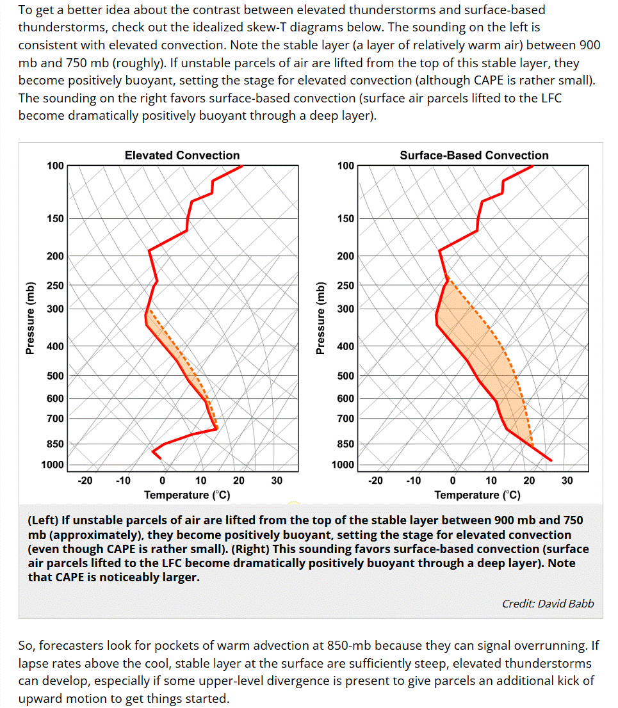

# Skew-T Comparison (Elevated vs Surface-Based Convection)

> Source: <https://www.weather.gov/source/zhu/ZHU_Training_Page/thunderstorm_stuff/elevated_convection/skew_T_Comparison.html>  
> Section: Elevated Thunderstorms  
> Captured: 2026-08-19 06:00 UTC  
> PDF: [skew-t-comparison-elevated-vs-surface-based-convection.pdf](skew-t-comparison-elevated-vs-surface-based-convection.pdf) · Original HTML: [source/original.html](source/original.html)

---

**ELEVATED CONVECTION**

**PENN STATE UNIVERSITY - DEPT OF METEOROLOGY**

