# Skew-T and Convective Parameters

> Source: <http://www.weather.gov/source/zhu/ZHU_Training_Page/convective_parameters/skewt/skewtinfo.html>  
> Section: Skew-T and Convective Parameters  
> Captured: 2026-08-19 06:00 UTC  
> PDF: [skew-t-and-convective-parameters.pdf](skew-t-and-convective-parameters.pdf) · Original HTML: [source/original.html](source/original.html)

---

**Select a tutorial below or scroll down...**- **[Skew-T Parameters](#SKEW)**
- **[Skew-T Derived Parameters](#SKEW2)**
- **[Different Weather Soundings](#SKEW3)**
- **[Skew-T FAQs](#SKEW4)**
- **[WAA, CAA and Hodographs](#SKEW5)**

---

# Skew-T Parameters

The Skew-T Log-P offers an almost instantaneous snapshot of the atmosphere from the surface to
about the 100 millibar level. The advantages and disadvantages of the Skew-T are given below:

**Why do we need Skew-T Log-P diagrams?**

- Can assess the stability of the atmosphere
- Can see weather elements at every layer in the atmosphere
- Determine cap strength, convective temperature, forecasting temperatures,
- Determine character of severe weather
- This is the data used to produce the synoptic scale forecast models

  **What are some of the disadvantages of the Skew-T Log-P diagrams:**
- Available generally twice a day (00Z and 12Z), character of weather can change dramatically between soundings.
- Sounding does not give a true vertical dimension since wind blows balloon downstream
- Sounding does not give true instantaneous measurements since it takes several minutes
  to travel from the surface to the upper troposphere

**Below are all the basics lines that make up the Skew-T:**

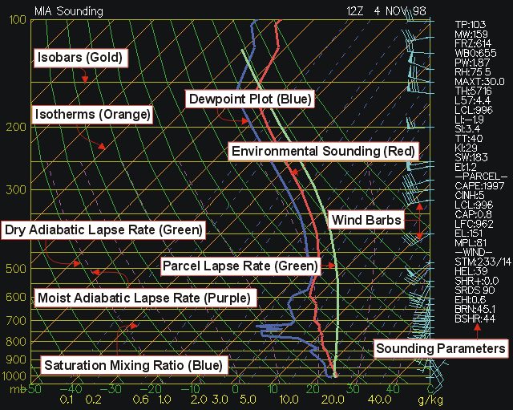

**(Isobars)** - Lines of equal pressure. They run horizontally from left to right and are labeled on
the left side of the diagram. Pressure is given in increments of 100 mb and ranges
from 1050 to 100 mb. Notice the spacing between isobars increases in the vertical
(thus the name Log P).

**(Isotherms)** - Lines of equal temperature. They run from the southwest to the northeast (thus the
name skew) across the diagram and are SOLID. Increment are given for every 10 degrees
in units of Celsius. They are labeled at the bottom of the diagram.

**(Saturation mixing ratio lines)** - Lines of equal mixing ratio (mass of water vapor divided by mass
of dry air -- grams per kilogram) These lines run from the southwest to the northeast and are DASHED.
They are labeled on the bottom of the diagram.

**(Wind barbs)** - Wind speed and direction given for each plotted barb. Plotted on the right of the
diagram.

**(Dry adiabatic lapse rate)** - Rate of cooling (10 degrees Celsius per kilometer) of a rising
unsaturated parcel of air. These lines slope from the southeast to the northwest and are SOLID.
Lines gradually arc to the North with height.

**(Moist adiabatic lapse rate)** - Rate of cooling (depends on moisture content of air) of a rising
saturated parcel of air. These lines slope from the south toward the northwest. The MALR increases
with height since cold air has less moisture content that warm air.

**(Environmental sounding)** - Same as the actual measured temperatures in the atmosphere. This is the
jagged line running south to north on the diagram. This line is always to the right of the dewpoint plot.

**(Dewpoint plot)** - This is the jagged line running south to north. It is the vertical plot of
dewpoint temperature. This line is always to the left of the environmental sounding.

**(Parcel lapse rate)** - The temperature path a parcel would take if raised from the Planetary Boundary Layer.
The lapse rate follows the DALR until saturation, then follows the MALR. This line is used to calculate the LI,
CAPE, CINH, and other thermodynamic indices.

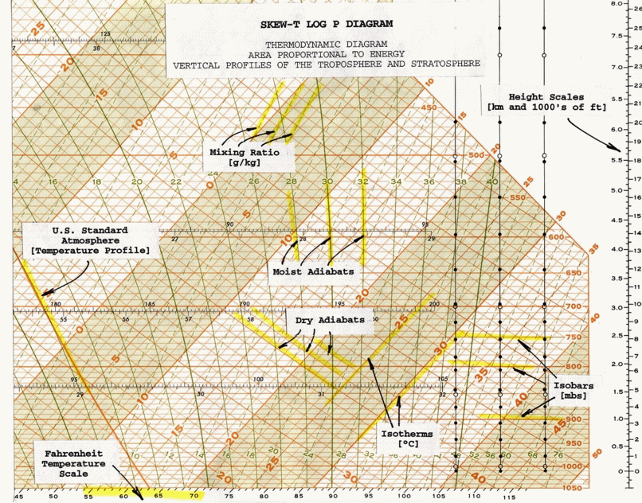

[**TOP**](skew-t-and-convective-parameters.md#top)

---

# Skew-T Derived Parameters

This section interprets most of those values and gives operational significance to the values. Each parameter or
indice will be broken down one by one. In a severe weather situations and during inclement weather, these indices
come in handy. The indices should be used as guides. Often, indices will contradict each other and can change rapidly
in the course of a couple of hours. An experienced meteorologist is well informed to how a sounding will change
throughout the day and why some sounding indices are better than others in certain situations. Soundings are most
notably changed through thermal advection, moisture advection, and evaporational cooling. Modified soundings should be
studied along with the standard 12Z and 00Z sounding.

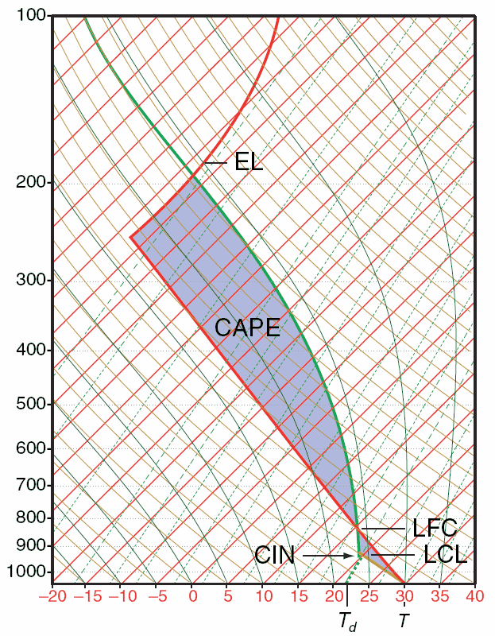  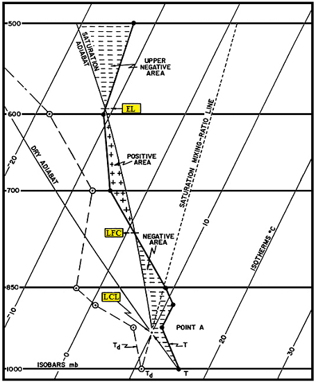

**(BRN)** - Bulk Richardson Number
*EQUATION:* (CAPE / 0-6km shear)
- less than 45 (Supercells)
- less than 10 (Environment too sheared)
- Teens (Optimum for severe storms, good balance of CAPE and shear)

**(BSHR)** - Bulk shear value (magnitude of shear over layer).

**(CAP)** - Cap strength in degrees Celsius. Values above 2 indicate convection
will not occur within at least the next couple of hours. Cap needs to be less than 2 in general before it can be
broken.

**(CAPE)** - Convective Available Potential Energy. This is the positive area on a
sounding (the area between
the
parcel and environmental temperature).
- 1 to 1,500 (Positive CAPE)
- 1,500 to 2,500 (Large CAPE)
- 2,500+ (Extreme CAPE)

- Max upward vertical velocity = (2\*CAPE)^1/2, does not take into consideration water loading, entrainment.
- Largest CAPE will occur in the warm sector of a mid-latitude cyclone
- High values of CAPE will result in high values of upward vertical velocity in the updraft region of a thunderstorm
- CAPE is increased by low level warm air advection, daytime heating, low level moisture advection (high
  low level dewpoint), upper level cold air advection (cooling temperature in mid-levels)
- CAPE values tend to be highest in the warm season (especially late Spring)

**(CCL)** - Convective Condensation Level. Level at which condensation will occur if sufficient afternoon
heating causes rising parcels of air to reach saturation. The CCL is greater than or equal in height (lower or equal pressure level) than the LCL. The CCL and the
LCL are equal when the atmosphere is saturated. Found at the intersection of the saturation mixing ratio line (through the surface dewpoint) and the environmental temperature.

**(CIN)** - Convective Inhibition. This is the negative area on a sounding. A large cap or a dry planetary
boundary layer will lead to high values of CIN and stability.

**Convective instability** - Occurs when a dry layer overlays a warm and humid layer. Lifting of atmosphere causes the lapse rate to
increase since the lower layer cool at the WALR while the dry layer cools at the DALR.

**Convective Temperature** - The approximate temperature that the air near the ground must warm to in order for
surface-based convection to develop, based on analysis of a sounding. Calculation involves many assumptions, such that thunderstorms sometimes
develop well before or well after the convective temperature is reached (or may not develop at all). However, in some cases the convective
temperature is a useful parameter for forecasting the onset of convection. Also-the convective temperature is found on a Skew-T Log-P diagram by
dropping a parcel of air dry adiabatically from the CCL (Convective Condensation Level) to the surface and reading off the new temperature once
the parcel reaches the surface.

Think of the convective temperature as the temperature the surface of the earth must warm to in order for
thunderstorms to occur in the absence of synoptic scale forcing mechanism (i.e., development of afternoon "air-mass" thunderstorms). The convective
temperature is most likely to be reached in the late afternoon hours due to cumulative solar heating. The strength of the "cap" determines if
the convective temperature will be reached. When the cap is very strong, the convective temperature will be higher than the high temperature for that day
and thus no storms develop. The amount of low level moisture also determines if the convective temperature will be reached. The CCL increases in height as
the average PBL dewpoint decreases.A higher CCL results in a higher convective temperature. Dynamic upward forcing lowers the theoretical convective temperature
since parcels of air can be "forced" or brought closer to the CCL by lifting mechanisms such as fronts, low level WAA and low level convergence.

**(EHI)** - Energy helicity index. Combines CAPE and Helicity into a single index. EHI increases as CAPE and/or Helicity increases. Tornadic
development often initiates in region of EHI max (especially if EHI max is 5 or greater).

*EQUATION:* (SR HEL \* CAPE) / 160,000
- EHI > 1 (Supercells likely)
- EHI from 1 to 5 (F2, F3 tornadoes possible)
- EHI 5+ (F4, F5 tornadoes possible)

**(EI)** - Energy Index

**(EL)** - Equilibrium level. The pressure value at the top of the positive CAPE
area In extreme situtations, EHI max will be near 10.

**Equivalent Potential Temperature** - Also known as **THETA-E**. Temperature of a parcel after all latent heat energy is released in a parcel then brought to the 1000 mb level. From pressure of interest (typically the surface) find the LCL, lift the parcel wet adiabatically to 100 mb. Next, descend the parcel dry.

**(FRZ)** - Pressure level at which the environmental sounding is exactly zero degrees Celsius. Find intersection of 0-degree
isotherm with environmental sounding.

**(HEL)** - Helicity Amount of streamwise vorticity available for ingestion into a storm. Streamwise vorticity is a function of low level inflow and horizontal vorticity generated by speed shear with height or directional shear with height in the PBL.
- 150 to 300 (possible supercell)
- 300 to 400 (supercell severe storms)
- 400+ (Tornadic supercells possible)

- Low level inflow, speed shear and directional shear maximize helicity values
- Helicity values tend to be highest ahead of cold fronts and near warm fronts within the warm sector of a mid-latitude cyclone
- The Low Level Jet can amplify low level inflow. Higher winds lead to a more rapid rotation of air if shear exists
- Differential advection and surface friction cause speed and directional shear

**Hydrolapse** - Rapid increase or decrease in dewpoint with height.

**(K)** - K Index. The K Index is primarily applicable in the prediction of air mass thunderstorms. Low values of the K Index in the presence of other strong thunderstorms indicators (sharp trough, high level jet, etc.) may suggest a severe thunderstorm potential. For example, a low K value might result from a 700 mb dry tongue. **Limitations:** Favors non severe convection. This index is a measure of thunderstorm potential but has nothing to do with severity of storms. Can not be used in mountain areas. The K value may not be representative of the airmass if the 850mb level is near the surface.

*EQUATION:* (T850 - T500) + (Td850 - Td700)
                     Lapse rate + available moisture
      -or-
*EQUATION:* (T850 - T500) + ( Td850 ) - (T700 - Td700)
(Lapse rate) + (low-level moisture) - (extent of moist layer)
- <15 (Convection not likely)
- 15 to 25 (Small potential for convection)
- 26 to 39 (Moderate potential for convection)
- 40+ (High potential for convection)

**(L57)** - 700 to 500 millibar lapse rate
- Less than 5.5 = stable
- 5.5 to 9 = conditionally unstable(unstable if moist in PBL)
- 9 or greater = incredibly unstable

**(LCL)** - (Lifted Condensation Level). Measured in millibars using surface data. This is the level in the atmosphere clouds will form if forced lifting takes place. LCL is found by the following process:
1. Draw a dry adiabat from the surface temperature.
2. Draw a mixing ratio line from the dewpoint.
3. Intersection is the LCL.

**(LFC)** - (Level of Free Convection). The level at the bottom of the area of positive CAPE. If a parcel reaches this level it will begin to accelerate in the vertical.

**(LI)** - Lifted Index. This is the temperature difference between the environmental and parcel temperatures at the 500 mb level. In theory, the LI is computed by taking parcel 25 mb above the surface and lifting it dry-adiabatically to saturation; then moist adiabatically to 500 mb. The difference between the sounding temperature and the parcel temperature yields the LI. In practice, the following method is employed:
A. Determine the mean temperature and mean dewpoint temperature in the lowest 50 mb of the sounding. These values are considered
representative of the level 25 mb above the surface.
B. From approximately 25 mb above the surface, lift the estimated mean temperature until it intersects the mixing ratio line which passes through the mean dewpoint temperature. this determines the LCL.
C. Lift the parcel moist adiabatically to 500 mb.
D. The difference between the ambient air temperature at 500 mb and the parcel temperature is the LI.

*EQUATION:* 500 mb environmental temperature - 500 mb parcel temperature
- 0 or greater (stable)
- -1 to -4 (marginal instability)
- -5 to -7 (large instability)
- -8 to -10 (extreme instability)
- -11 or less (ridiculous instability)

*VARIATIONS:*
A. **Best Lifted Index (BLI)** - this concept was first introduced by Fujita who felt that the LI from any fixed level might misrepresent the airmass. The BLI approach is to compute any number of lifted indices on the sounding, beginning near the surface to 1600m above the surface. The lowest LI (most unstable) defines the BLI for that airmass.
B. **Model Lifted Index (MLI)** - the lowest layer in the NWP models is the boundary layer which is 50 >mb thick. The mean temperature and relative humidity are used to determine the temperature and dewpoint of the parcel at 25 mb above the surface. Then the parcel is lifted dry-adiabatically to saturation, and moist adiabatically to 500 mb. This parcel temperature is subtracted from the initialized or forecast
500 mb temperatures at each grid point to yield the MLI.

**(MAXT)** - Estimated maximum afternoon temperature. Most relevant when using a morning sounding. Most accurate on days with clear skies and moderate winds.

**(MPL)** - Maximum parcel level. Highest level a parcel can rise in the atmosphere. This value is above the EL due to the updrafts momentum.

**(Potential Temperature)** - Temperature found by lifting or descending a parcel to the 1000 mb level from the pressure level of interest.

**(PW)** - Value of precipitable water in inches. This is the amount of liquid water on the surface after all water in all three phases is brought to the surface.
- Greater than 1.75 inches represents a water loaded sounding.
- Less than 0.75 inches represents a fairly dry sounding.

**(RH)** - Relative Humidity. Found by dividing the mixing ratio by the saturation mixing ratio or the vapor pressure divided by the saturation vapor pressure. Find the saturation mixing ratio value that runs through the dewpoint and the temperature. Next, divide the dewpoint mixing ratio by the temperature mixing ratio. The average relative humidity between the surface and 500 millibars. Relative humidity is a good measure of the evaporational drying power of the air and how close the atmosphere is to saturation. It does not, however, tell you how much moisture mass there is in the air. Adiabatically to the 1000 mb level. The temperature at 1000 mb of this parcel is the THETA-E.
- 0 to 40% (very low)
- 41 to 60% (low)
- 61 to 80% (moderate)
- 81 to 100% (moist)

**(SHR)** - Positive shear in the 0 to 3000m above ground level. Units are in time to the negative 1. Dividing the change in vertical wind speed by the change in the distance derives these units. Km/hr divided by km = hr-1. Value is found by finding the change in wind speed from the surface to 3000m and dividing that value by 3000m (3 km).
- 0 to 3 (weak)
- 4 to 5 (moderate)
- 6 to 8 (large)
- 9+ (very large)

**(SI)** - Showalter Index. Same as LI, except parcel is lifted from 850 mb. Use SI instead of LI in the cool season especially when surface is capped by a cool front.

*EQUATION:* 500 mb environmental temperature - 500 mb parcel temperature
A. Lift the 850 mb temperature dry adiabatically until it intersects the mixing ratio line which passes through the 850 mb dewpoint.
B. Lift the parcel moist adiabatically to 500 mb.
C. The difference between the ambient air temperature at 500 mb and the parcel temperature determines the SI.

**(SRDS)** - Storm relative directional shear.

**(STM)** - Estimated storm motion. Storm will be moving from X and X knots.

**(SWEAT)** - Severe WEAther Threat Index. Indice combining many thermodynamic and wind values.The SWEAT Index was developed by AWS to indentify areas of potentially severe convective activity. The terms in the index refer to low level moisture, convective potential, low
and mid level winds, and wind shear. Empirically, the threshold for severe thunderstorms is 300 and the threshold for tornadoes is 400. It should be stressed that the above statistics were derived from known severe weather cases; nothing can be inferred above the false alarm ratio. Also, the SWEAT Index gives severe weather potential; a trigger is still needed to realize this potential. this SWI should not be used to predict ordinary thunderstorms. Since this index can change dramatically in a short period of time, it should be computed at both 12Z and 00Z during severe weather situations. Formula covers: low level moisture, instability, low level jet, upper level jet, warm air
advection
- 150 to 300 (Slight severe)
- 300 to 400 (Severe storms possible)
- 400+ (Tornadic severe storms possible)

**(TP)** - Tropopause Level. Location in millibars of the tropopause, generally near 150 millibars.

**(TT)** - Total Totals Index. The Total Totals Index was first introduced by Miller for use in indentifying potential areas of thunderstorm development. The Vertical Totals measures the vertical lapse rate, while the
Cross Totals incorporates low level moisture. the VT and CT thresholds for potential convective activity vary widely from one region to another. Inspection of the Total Totals equation shows a strong dependence on the 500 mb temperature. Very cold 500 mb temperatures, without corresponding convective support in the lower levels, may produce artificically high index values. This might be the case in a cold deep trough. Limitations: large lapse rates can produce large TT values with little low level moisture TT is region specific

*EQUATION:* (T850 - T500) + (Td850 - T500)     (Vertical Totals + Cross Totals)
- <44 (convection not likely)
- 44 to 50 (convection likely)
- 51 - 52 (isolated severe storms)
- 53 - 56 (widely scattered severe storms)
- >56 (scattered severe storms)

**(WBO)** - Wet bulb zero temperature. Value at which the sounding is at zero degrees Celsius due to evaporational cooling. Value is given as a pressure level. This value will always be at a higher pressure
(closer to the surface) than the FRZ level unless the sounding is saturated. Value found through computer
algorithms (once the wet bulb is found for every pressure level, the wet bulb zero can then be located.) Wet bulb temperature can be found by the following sequence:
1. Pick a pressure level
2. Find LCL from that pressure level
3. From LCL go back down the sounding at the wet adiabatic lapse rate to the original pressure
4. This temperature is the wet bulb temperature

**(Wet Bulb potential temperature)** - Found the same as the wet bulb. When the wet bulb value is found, keep descending wet adiabatically to the 1000 mb level.
[**TOP**](skew-t-and-convective-parameters.md#top)

---

# Different Weather Soundings

### Select sounding below...

|  |  |  |  |  |
| --- | --- | --- | --- | --- |
| [**Inverted V**](#Sounding1) | [**Loaded Gun**](#Sounding2) | [**Rain**](#Sounding3) | [**Wet Microburst**](#Sounding4) | [**Dry**](#Sounding5) |
| [**Snow**](#Sounding6) | [**Sleet**](#Sounding7) | [**Freezing Rain**](#Sounding8) | [**Cold Rain**](#Sounding9) | [**Wet Bulb**](#Sounding10) |
| [**Front**](#Sounding11) | [**Morning Inversion**](#Sounding12) | [**Low Level Jet**](#Sounding13) | [**Elevated Convection**](#Sounding14) |  |

**Inverted V Sounding**

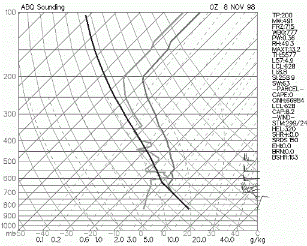

- Named Inverted-V since the dewpoint depression decreases significantly with height.
- Most common in interior Western U.S. (especially interior Southwest U.S.).
- Sounding has dry air (low RH) in lower troposphere with nearly saturated air (high RH) in middle troposphere.
- Convection tends to be high based since Convective Condensation Level is at a high elevation.
- Most common severe weather: Strong winds > 58 mph; this is due to negative buoyancy of evaporationally cooled air
  aloft that causes it to accelerate toward the surface.
- Gust fronts from inverted-V storms can have a large temperature gradient from one side to the other due to evaporational cooling.
- Hail and tornadoes are not common due to the dry boundary layer, high cloud base and unorganized wind shear.
[**TOP**](#SKEW3)

**Loaded Gun Sounding**

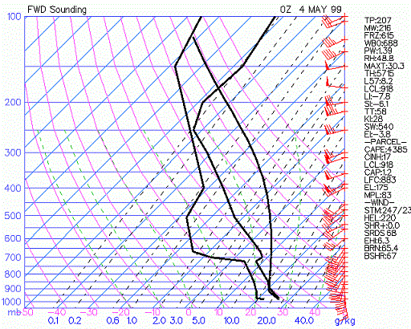

- Severe weather sounding (large CAPE, very unstable LI).
- Large hydrolapse in mid-levels (mT air in boundary layer capped by cT air).
- There must be an inversion above mT air.
- Most common and in Great Plains, Midwest and SE US.
- Most common severe weather: Large hail, tornadoes, convective wind gusts of 58 mph or greater.
- If speed/directional wind shear and strong low-level jet are present on sounding, severe weather chances are enhanced.
[**TOP**](#SKEW3)

**Rain Sounding**

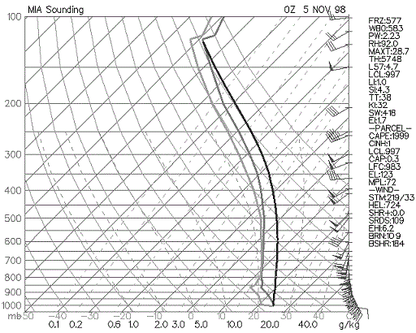

- Radiosonde is launched into deep layer of precipitation, rain at surface.
- Temperature will be near dewpoint in all layers.
- There will not be much further evaporational cooling since air is already or nearly saturated.
- Temperature and dewpoint may slightly diverge with height. Dewpoint becomes more difficult to calculate
  at low pressures and low temperatures (at temperatures below freezing frost point is higher than dewpoint also).
[**TOP**](#SKEW3)

**Wet Microburst Sounding**

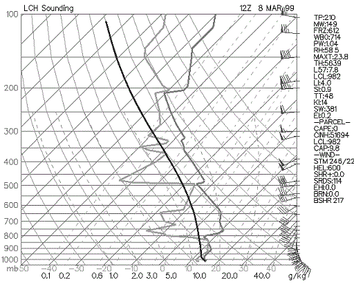

- Mid-level dry air.
- Similar to goal post sounding but with more moisture (higher precipitable water in sounding).
- The dry air aloft will entrain into the downdraft and cause evaporational cooling. This increases the
  negative buoyancy and can result in microbursts and macrobursts.
- If supercells develop they are most likely to be high precipitation supercells.
- Most common severe weather: winds > 58mph, small hail near the 3/4" threshold, tornadoes possible
  (depends on low level shear and CAPE)
- Sounding most commonly found east of Rockies.
[**TOP**](#SKEW3)

**Dry Sounding**

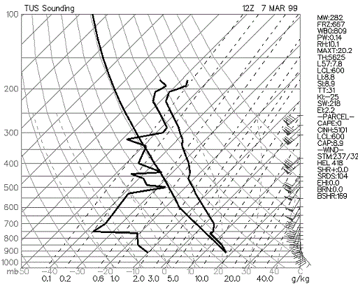

- Large dewpoint depression throughout lower and middle troposphere.
- Precipitation not likely since uplift will have difficulty saturating the air.
- Deep layer of continental air (cT or cP).
- Diurnal temperature range at surface will be large due to maximum night time radiation
  loss and maximum day time solar energy (converted directly to sensible heat).
- Most commonly found in interior western U.S., high plains, and northern plains
[**TOP**](#SKEW3)

**Snow Sounding**

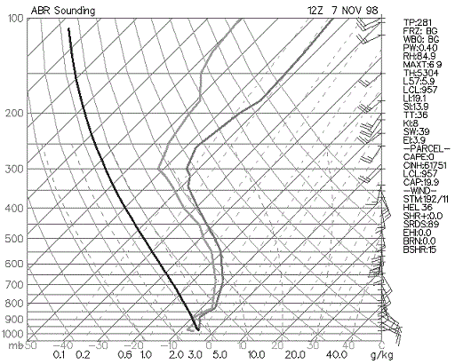

- Temperatures aloft are below freezing or near freezing.
- If the air is fairly dry and a little above freezing in the lower troposphere, evaporational cooling
  can change precipitation that is initially rain to snow.
- Most snow results from elevated lifting (parcel do not rise from surface. but rather from higher aloft
  due to dynamic lifting, usually from top of inversion).
[**TOP**](#SKEW3)

**Sleet Sounding**

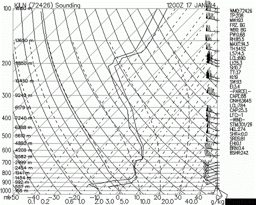

- Temperatures are below freezing in the lowest portion of troposphere while there is a layer just above freezing
  above the below freezing layer. Precipitation falls as snow aloft, then partial melts a it falls through the
  layer that is just above freezing, then refreezes in the subfreezing layer before reaching the surface.
- Sleet commonly occurs with a wintry mix of snow, freezing rain and/or rain.
- Sleet may change over to snow through evaporational cooling or cold air advection. Rain may change to sleet
  through cooling processes in the lower troposphere.
[**TOP**](#SKEW3)

**Freezing Rain Sounding**

- Below freezing at surface and complete melting of precipitation aloft before it reaches the surface.
- Temperature sounding generally consists of shallow freezing layer in the boundary layer capped with
  well above freezing temperatures aloft.
- Freezing rain will be most hazardous if soil temperature is below freezing, if surface air temperature
  is well below freezing, and if freezing rain is heavy.
- If temperatures are at or just below freezing and the soil temperature is above freezing, most freezing
  rain will accumulate on elevated surfaces such as power lines, trees, and bridges/overpasses.
[**TOP**](#SKEW3)

**Cold Rain Sounding**

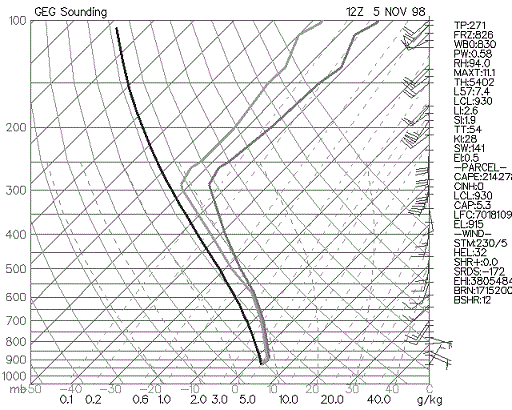

- Temperature just above freezing from surface to high enough aloft to melt frozen precipitation completely before it reaches the surface.
- Precipitation type will generally remain as rain at the surface if evaporational cooling has ceased and cold air advection is not expected.
[**TOP**](#SKEW3)

**Wet Bulb Sounding**

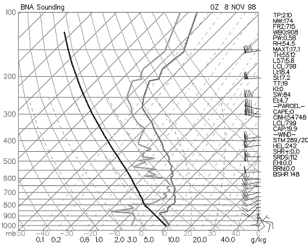

- Rain or snow falling into a dry layer will result in evaporational cooling.
- Wet bulb temperatures are used to assess potential for evaporational cooling.
- Wet bulb cooling may influence precipitation type at the surface.
- Light rain or snow may evaporate before reaching the ground (virga) if the air is too dry.
- In these situations the radar may show precipitation but precipitation reaching the ground is very light or non-existent.
- To be a wet bulb sounding there must be the potential for lifting of saturated air aloft
  that falls into the fairly dry air in the lower troposphere.
[**TOP**](#SKEW3)

**Frontal Boundary Sounding**

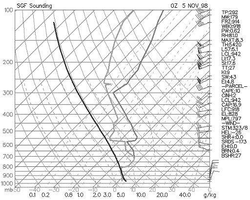

- With shallow arctic fronts: Signficant temperature change over time in lower levels of sounding caused by strong CAA.
- Produces an inversion.
- Depth of front extends from surface to top of inversion.
- If convective precip or rain occurs it will be "elevated convection".
- Temperature cools with height in the standard atmosphere (average of all soundings). With a cold front sounding or north of a warm front,
  temperatures do not decrease rapidly with height due to low level cold air advection or relatively cool air at the surface.
[**TOP**](#SKEW3)

**Morning Inversion Sounding**

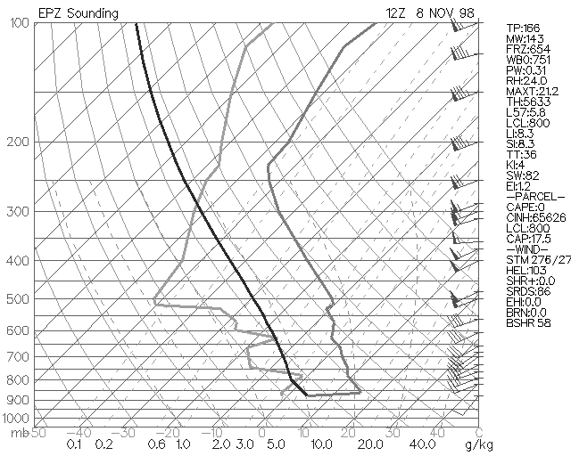

- Night time radiation loss from earth's surface results in cool temperatures at the surface.
- Temperature increases rapidly with height since best cooling occurs only at the surface in the lower troposphere.
- Morning inversions are most intense on nights with: clear skies, light winds, long nights, and dry air.
- After sunrise, temperatures rapidly increase at the surface due to convective mixing of the cold surface air with the
  much warmer air aloft and the sun warming the earth's surface.
[**TOP**](#SKEW3)

**Low Level Jet Sounding**

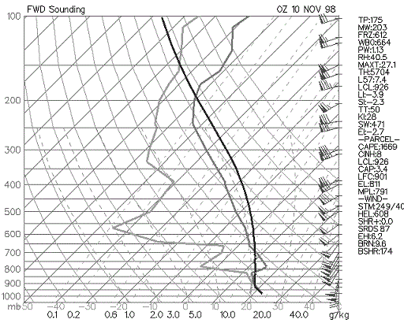

- The low level jet is a high speed return of warm and moist air from the south or southeast; moisture source is the Gulf of Mexico.
- Most common and intense over the Plains states and Southeast states.
- The low level jet occurs in the warm sector of a developing mid-latitude cyclone in the Central and Eastern U.S.;
  occurs generally ahead of the cold front boundary.
- Intensity of low level jet is increased due to temperature gradient between cooler high elevations in the high plains compared to warmer
  East Great Plains at night. Can also intensify by the warm sector of a mid-latitude cyclone being east of the cold sector.
- Low level jet adds heat, mass and momentum to developing thunderstorm and produces low level speed and directional shear (results in very
  high Helicity values).
- Produces abundant WAA (warm air advection) that may break a weak to moderate cap. WAA produces broad synoptic scale uplift
- Strongest low level jet winds are generally at the top of Planetary Boundary Layer due to less friction than at the surface.
- Advection may well be over 65 miles per hour.
[**TOP**](#SKEW3)

**Elevated Convection Sounding**

- Most common in the cool season.
- Parcels do not rise from surface during elevated convection. Parcel lapse rate on skew-T from
  surface is useless when the boundary layer is very stable.
- Parcel will generally rise from top of temperature inversion during elevated convection. On the
  sounding, a parcel rising from the 700-mb level will be much less stable than a parcel rising from the surface.
[**TOP**](#SKEW3)

[**TOP OF MAIN PAGE**](skew-t-and-convective-parameters.md#top)

---

# Skew-T FAQs

(1)  **What is the difference between the LCL and the CCL?**
(2)  **Why is the moist adiabatic lapse rate NOT a constant?**
(3)  **What is the difference between potential and equivalent potential temperature and what is their importance?**
(4)  **What is negative buoyancy and the relation it has to the CAP?**
(5)  **What is elevated convection and the importance it has to forecasting?**
(6)  **Explain the difference between the equilibrium level and the maximum parcel level?**
(7)  **How can Skew-T's be used to predict hail?**
(8)  **How can Skew-T's be used to predict winter precipitation?**
(9)  **What is a hydrolapse and its importance?**
(10)  **What are some operational uses of the LAYER SLICE method?**
(11)  **What is a quick way to calculate the wet bulb temperature when given temperature and dewpoint?**
(12)  **How can Skew-T's be used to forecast severe weather?**
(13)  **What is the difference between the saturation and actual mixing ratio?**
(14)  **Why do tornadoes tend to occur in the northeast quadrant of landfalling hurricanes?**
(15)  **Explain how wind shear can both be conducive and destructive to convective activity.**
(16)  **Can the exact location of thunderstorm development be forecasted using Skew-T's?**

1) **What is the difference between the LCL and the CCL?**
Many students confuse the LCL (lifted condensation level) with the CCL (convective condensation level). They
often ask "why are the LCL and CCL at different levels in the atmosphere? What about the rising process makes
them different? The primary difference has to do with the surface temperature. A LCL occurs when forced
lifting occurs. A surface parcel, with its temperature and dewpoint are forced into the vertical by a trigger
mechanism such as a front, vort max, dryline bulge, convergence boundary, mountain, and so forth. This air
(originally at the surface or lower PBL) cools at the dry adiabatic lapse rate until the temperature equals
the dewpoint (temperature lapse rate = 10 degrees C per kilometer, dewpoint lapse rate = 2 degrees C per
kilometer (dewpoint lapse rate is the same as the mixing ratio lapse rate.. see laminated skew T). When the
air parcel becomes saturated, the LCL is reached.

Now onto the CCL, the CCL is not found by forced lifting, but by rather a warming of the earth's surface. The
air does not rise until the surface temperature warms and reaches a critical value with this process. The CCL
is generally higher than the LCL because the AIR MUST FIRST WARM before the air can rise to the CCL (remember
air warming causes the relative humidity to decrease and the dewpoint depression to increase, because of this,
the air must rise to a higher altitude before becoming saturated). The CCL will be higher than the LCL. The
LCL and CCL are found by the same process EXCEPT from the CCL the surface temperature must rise to a critical
value (called convective temperature) before a surface parcel will begin the assent in the vertical due to
positive buoyancy. Finding the CCL is the same as the process of finding the LCL when air has warmed to the
critical convective temperature. Use the CCL for summertime air mass thunderstorms and thermodynamic daytime
heating lifting and the LCL for any dynamical lifting (jet streak, vorticity, frontal, convergence uplift).

Can forced lifting and the rising of air due to reaching the convective temperature occur at the same time?
Yes, in this case the height of the cloud base will be between the theoretical LCL and CCL. Does the LCL and
CCL value found on a Skew-T correlate perfectly with the true cloud base of a thunderstorm or cloud deck?
Sometimes yes, sometimes no; The character of the PBL with respect to temperature and dewpoint can change
rapidly during the day. A sounding and even a forecast sounding can not perfectly portray the boundary layer
conditions moment to moment. It takes a skilled forecaster to know how close the real atmosphere will mirror
the theoretical LCL and CCL Skew-T values.

2) **Why is the moist adiabatic lapse rate NOT a constant?**
The dry adiabatic lapse rate is a near constant of 9.8 C/km, however, the wet adiabatic lapse rate is much
less of a constant. The wet adiabatic lapse rate varies from about 4 C/km to nearly 9.8 C/km. The slope of the
wet adiabats depend on the moisture content of the air. The more moisture (water vapor) that is in the air,
the more latent heat that can be released when condensation takes place (the release of latent heat warms the
parcel while an absorption of latent heat cools the parcel). Any warming by latent heat release partially
offsets the cooling of rising air. Notice on the skew-T that the dry and wet adiabats become nearly parallel
in the upper atmosphere. This is due to the very cold temperatures aloft (cold air does not have much water
vapor and therefore can not release much latent heat) The slope of the wet adiabats is 4 to 5 C/km in very
warm and humid air (lifting of this saturated air releases a large amount of latent heat). Warm and humid air
in the PBL contributes to atmospheric instability. These warm and humid parcels, since they only cool slowly
with height, have a good chance of remaining warmer than the surrounding environmental air and will thus
continue to rise. In fact, planetary boundary layer warm air advection and moisture advection are the number 1
contributions to making the atmosphere thermodynamically unstable (High CAPE, negative LI, etc).

The formula for the moist adiabatic lapse rate is

MALR = dT/dz = DALR/(1 + L/Cp\*dWs/dT)

Every term in the equation is a constant except for dWs/dT. dWs/dT is the change in saturation mixing ratio
with a change in temperature. The saturation mixing ratio changes at the greatest rate at warm temperatures.
Increasing the temperature from 80 to 90 F will change the saturation mixing ratio more dramatically than
changing the temperature from 30 to 40 F. Thus dWs/dT is higher in warm air. As dWs/dT becomes larger, the
denominator in the MALR equation becomes larger and thus the MALR becomes less. Math example: 1/4 is a smaller
number than 1/3 because the 4 in the denominator is larger than 3. In very warm and moist air, the MALR will
be near 4 or 5 degrees Celsius per kilometer. At very cold temperature, dWs/dT is small, thus the denominator
is close to one and the MALR is close to the DALR (9.8 C/km). When dWs/dT approaches zero, the denominator
becomes 1 and the MALR = DALR.

The formula for the saturation mixing ratio is: Ws = 0.622Es/(P - Es). Therefore Ws depends on the pressure
and Es of the air. It is temperature that determines the moisture carrying capacity of the air. Remember that
Es is found by plugging T into the Clausius-Clapeyron equation. Therefore, ultimately, Ws depends on
temperature and pressure.

If instability is present, the instability will increase further when the PBL experiences rising dewpoints
(above 55 F and rising). Thunderstorms are much more common in the warm season. Warm and moist rising parcels
of air do not cool off as fast as rising parcels of colder air. Since warm and moist rising parcels cool at a
slower rate with height (due to more latent heat release than colder air), the parcels are more likely to
remain warmer than the environmental air and rise due to positive buoyancy.

3) **What is the difference between potential and equivalent potential temperature and what is their importance?**
Many students are curious in the operational importance of potential temperature and equivalent potential
temperature. Potential temperature can be used to compare the temperature of air parcels that are at different
levels in the atmosphere. Temperature tends to decrease with height. This fact makes it more difficult to note
which regions in the atmosphere are experiencing WAA and CAA. Therefore, bringing air parcels adiabatically to
a standard level (1000 millibars) allows comparisons to be made between air parcels at different elevations.
If the potential temperature of an air parcel at one pressure level is colder than air parcels at other
pressure levels, a forecaster can infer cold air advection or a cold pocket exists at the pressure level with
the lowest theta.

Finding the potential temperature at a constant pressure level over an area produces one type of theta chart.
The term theta and potential temperature are synonyms. Higher theta represents warmer air while lower theta
represents colder air. For example, theta can be found at 700 millibars. Each location at 700 millibars drops
a parcel from the 700 to 1000 millibar level and the temperature is read off at 1000 millibars and thus this
is the 700 millibar theta temperature (theta is always given in degrees Kelvin). A vertical cross section of
theta can be produced by finding the areal distribution of theta at many pressure levels, then connecting the
points of equal theta. At this point, sloping constant theta surfaces can be plotted (see Chaston's Weather
Maps book P. 167-8) Air parcels tend to travel along constant theta surfaces. This makes sense because
constant theta surfaces represent constant density surfaces. The path of least resistance on an air parcel
that is advecting is for it to remain at the same density as its environment. Dr. Arnold describes this as,
"If a parcel is subjected only to adiabatic transformation as it moves through the atmosphere its theta
remains constant." The term that describes this process is isentropic lifting/descent. Isentropic
lifting/descent occurs whenever WAA, CAA or flow of one air mass over another occurs. Less dense air will tend
to glide up and over more dense air (thus low level WAA leads to rising air) when less dense air advects
toward more dense air. You will hear theta and isentropic lifting referenced to often in forecast discussions.
The trajectories that wind vectors take over theta surfaces determine how much lifting or sinking will take
place due to advection. NWS forecasters are experts on these processes and use them as a major part of their
forecasting process. All the different ways of graphing theta can be quite complex. Key points to remember are
that (1) air parcels in a convectively stable environment tend to advect along constant theta surfaces and (2)
low level WAA produces isentropic lifting and uplift while CAA produces isentropic downglide and sinking.

While potential temperature can be used to compare temperatures at different elevations and the trajectory air
parcels will take (rising or sinking), equivalent potential temperature can be used to compare BOTH moisture
content and temperature of the air. The equivalent potential temperature (or Theta-e as it is usually called)
is found by lowering an air parcel to the 1000 mb level AND releasing the latent heat in the parcel. The
lifting of a parcel from its original pressure level to the upper levels of the atmosphere will release the
latent heat of condensation and freezing in that parcel. The more moisture the parcel contains the more latent
heat that can be released. Theta-e is used operationally to map out which regions have the most unstable and
thus positively buoyant air. The Theta-E of an air parcel increases with increasing temperature and increasing
moisture content. Therefore, in a region with adequate instability, areas of relatively high theta-e (called
theta-e ridges) are often the burst points for thermodynamically induced thunderstorms and MCS's. Theta-e
ridges can often be found in those areas experiencing the greatest warm air advection and moisture advection.
For more information on Theta-e, consult Chaston's book "weather maps" used in the Synoptic I (starting on
page 127).

4) **What is negative buoyancy and the relation it has to the CAP?**
Most Skew-T's that you see on the web will have a list of abbreviations and numbers to the right of the Skew-T
and wind identifiers. On the Actual diagram on the web, there will be three sounding lines (one for the
dewpoint, one for the temperature and one for the parcel lapse rate from the surface). The parcel line is easy
to pick out, it is a smooth curve first following a dry adiabat and then after saturation following a moist
adiabat. The temperature and dewpoint soundings are not as smooth in appearance. Since dewpoint is always
equal to or less than temperature, the dewpoint sounding will ALWAYS be to the left of the temperature
sounding.

Now for interpretation of some of the abbreviations and numbers to the right of the diagram. The ones we will
go over today involve positive and negative buoyancy. One value is called CAP. This value tells you the
strength of the inversion in the low levels of the atmosphere. An inversion is a temperature increase with
height. An inversion is most commonly found at the top of the planetary boundary layer or the transition zone
of differential advection. The CAP is important since it can BOTH promote severe weather OR prevent storms
from forming. If the CAP is too strong, parcels of air in the PBL will not be able to rise above the CAP.
Since the CAP is an inversion, a strong inversion of warm air prevents PBL air from rising above the CAP since
the PBL parcels become cooler than the environment when they reach the CAP. On the other hand, the CAP can
trap moisture and heat in the PBL... this will gradually weaken the CAP... the warmer and more humid the PBL
gets, the weaker the CAP will become. Once the CAP is broken, explosive development of thunderstorms can
occur. A general rule is that if the CAP is greater than 2.0, The CAP will not be broken within the next
couple of hours. Once the CAP drops below 2.0, convection is likely. The CAP is important to study in the
Plains since this is the region most vulnerable to differential advection and convective instability. It is
important to look at forecast soundings to determine the approximate time of when the CAP may break. Some days
the CAP will be too strong and no storms develop at all, even in the heat of the day. These days are called
"busts" and are one reason why days with a moderate or high chance of severe storms end up with no convective
activity. Again, this is primarily a Great Plains "tornado alley" problem. The CAP is not as important in
other parts of the country, but can be in certain weather situations (especially warm season thermodynamic
thunderstorms). The CAP is only important to thermodynamic thunderstorms as opposed to elevated convection. If
the CAP is weak in the morning, thunderstorms are liable to form earlier in the day and not be as severe.

Another term you will see under CAPE is CINH. This stands for convective inhibition. CAPE is the "positive
area" of a sounding while CINH is the "negative area" (parcel cooler than surrounding environment). CINH is
the amount of energy needed to warm the PBL in order for surface parcels of air to reach the level of free
convective. If the CAPE is high, and the CINH is low, thunderstorms are likely. If the CAPE is high and the
CINH is high, then more afternoon heating and warm/moist air advection will be needed before parcels from the
surface will be able to reach the level of free convection. CINH can also be overcome by fronts, jet streaks,
dry lines, vorticity, and others since the air is forced in the vertical to the level of free convection.
Generally, CINH values of 50 and below are low while 200 and above are high. Thermodynamic thunderstorms are
unlikely as long as the CINH remains above 200. Once the CINH drops below 50 and adequate lift, instability
and moisture are in place, thunderstorms are eminent. Remember, soundings can change rapidly throughout the
day, especially the morning sounding. This is one area where forecaster experience is critical.

Forecasting how a sounding will change throughout the day requires experience and an hour by hour analysis of
how the atmosphere is changing. RULE: soundings change most dramatically in the low levels of the atmosphere
due to thermal and moisture advection along with daytime heating. Forecast soundings can help answer several
questions of how a sounding may change throughout the day. Although CAPE can give you an idea of upward
vertical velocities that will be associated with thunderstorms and the overall instability of the atmosphere,
the CAP and CINH are just as important to study. If the CAP is large and/or CINH is large, no amount of CAPE
will produce thunderstorms.

5) **What is elevated convection and the importance it has to forecasting?**
Notice that the Skew-T's on the web always have the parcel lapse rate beginning from the surface. This is not
always the case in the real atmosphere especially in the winter season. After a cold front passes, parcels of
air no longer lift from the surface (remember that cold air is dense and resists upward motion more so than
warm air). Rain that occurs behind a cold or warm front is not a result of parcels rising from the surface but
by rather "elevated convection". Elevated convection is the lifting of air, which first begins to rise, above
the planetary boundary layer. When a front is involved (cold, warm, dryline) the parcels lift from the top of
the front. On a sounding, a temperature inversion often marks the vertical depth of the front. Wind and
dewpoint changes in the vertical can also help locate the vertical frontal boundary.

Parcels generally rise from the surface on days with air mass thunderstorms, upslope convection and
rain/thunderstorms in the warm sector of a mid-latitude cyclone. Parcels of air do NOT necessarily rise from
the surface when uplift mechanisms such as vorticity, jet streaks, isentropic lifting or frontal lifting is
involved.

Why is this important? Because many of the indices (CAPE, LI, and others) assume parcels of air begin to rise
from the surface. In a situation where "elevated convection" occurs, the convective surface will be higher in
the atmosphere and often just above an inversion, as mentioned earlier. Sounding software is required in order
to have the parcel rise from the point you want on the Skew-T and calculate the indices. Elevated convection
occurs on the cool side of a warm front, behind a cold front, near the circulation of a mid-latitude cyclone,
in association with an upper level low and in cases where a jet streak or vort max forces air from the
mid-levels of the atmosphere to the upper levels of the atmosphere (not necessarily all the way from the
surface).

Convection that begins from the surface is termed thermodynamic convection. Convection originating from other
means such as vort max's or jet streaks is termed dynamic convection. If thermodynamic and dynamic
precipitation mechanisms override each other. Such as a jet streak and vort max overriding a PBL which is
warm, humid and unstable... severe weather is likely (depending on magnitude of lifting mechanisms and wind
shear environment). Thermodynamic convection alone in a barotropic environment will produce "air mass"
thunderstorms, while dynamic mechanisms alone will produce elevated convection (especially if PBL is stable
and/or dry).

6) **Explain the difference between the equilibrium level and the maximum parcel level?**
Two more abbreviations that can be seen to the right of Skew-T's on the web are the EL and the MPL. The EL
(equilibrium level) is the pressure level that is at the top of the positive CAPE area. This is the point at
which a rising parcel that is warmer than the environmental temperature becomes equal to the environmental
temperature. It is often just below the tropopause.

The MPL (maximum parcel level) is the pressure level a rising parcel will move to after its upward momentum
has ceased. Once a parcel reaches the EL it still has upward momentum. Above the EL, the parcel will gradually
slow down since it is cooler than the environment and then stop at the MPL. The MPL is always higher in the
atmosphere than the EL. The larger the CAPE is below the EL, the higher the MPL will be above the EL. Updrafts
of over 100 miles per hour will often penetrate into the lower stratosphere.

7) **How can Skew-T's be used to predict hail?**
When predicting hail, three factors need to be examined. They are the freezing level, CAPE, and the wet-bulb
zero temperature. Lower freezing levels will allow hailstones less time to melt as they fall to the surface.
Higher elevation areas (e.g. Colorado and Wyoming) tend to have a high frequency of hail since the freezing
level is closer to the ground in these high elevation locations. The CAPE determines the potential size of
hailstones before they fall. Higher CAPEs lead to hailstones being thrown higher vertical distances into the
updraft and the potential for many "growth rings". The wet-bulb zero temperature is a function of how much dry
air there is in the mid-levels of the atmosphere. Through evaporational cooling, the freezing level will drop
closer to the earth's surface. On a Skew-T, if there is a large dewpoint depression in the mid-levels of the
atmosphere, there will be evaporational cooling (leading to high winds and hail) associated with
thunderstorms.

For maximum hail size you need the following: relatively high elevation area, low freezing level, dry air in
mid-level of atmosphere, and a high value of CAPE. This combination is most often found in the Great Plains.
The hail potential is minimized with this combination: low elevation area, high freezing level, low CAPE, and
a moist atmosphere in the mid and upper levels. The southeast US does not get as much hail and large hail as
the Great Plains due to several of this minimizing factors (especially low elevation and moist mid-levels)
Now, you are an expert hail forecaster!

8) **How can Skew-T's be used to predict winter precipitation?**
Skew-T's are handy forecasting tools for predicting winter precipitation type. If temperatures from a 1000
meters above the surface to the top of the atmosphere are below freezing, precipitation type is likely to be
snow. It may, for a short period, fall as a cold rain or a wintry mix, but through evaporational cooling the
precipitation type will change to snow (unless warm air advection is occurring in the boundary layer).

In some cases, temperatures in the PBL will be below freezing but an inversion just above the PBL will have
above freezing temperatures. This inversion could be the top of a shallow cold front or a layer of warm air
advection. This situation is conducive to producing sleet. If the below freezing temperatures extend from the
surface to 1000 meters and are capped with above freezing temperatures, precipitation type will likely be
sleet.

The set up for freezing rain is similar to that of sleet except the below freezing temperatures extend only a
short distance above the surface (ranging from below freezing temperatures just at the surface or extending to
as high as 500 or so meters above the surface). An inversion of above freezing temperatures will cap the below
freezing low level temperatures, but the inversion will be closer to the ground than inversions associated
with sleet.

Only two balloon soundings are launched each day, therefore soundings can change rapidly in just a few hours.
From studying the analysis and forecast panels, gain an insight into thermal and moisture advections that will
change the soundings. A slight change in thermal advection can change the precipitation type from one to the
other (e.g. warm air advection... snow to rain, freezing rain to rain, sleet to freezing rain;;;; cold air
advection. ... rain to snow, freezing rain to sleet, freezing rain or sleet to snow) Sometimes the vertical
depth of cold air and the inversion of above freezing temperatures will be near the cusps of a change in
precipitation type. This produces a wintry mix, precipitation type changes from one type to another or even
sleet, snow, and cold rain all falling at the same time. Evaporational cooling also plays a key role. Monitor
the wet bulb temperatures from the surface to the top of the inversion to monitor possible changes in
precipitation type (if wet bulb is at or below freezing at all levels, precipitation type will eventually
change to all snow, until or unless warm air advection again changes it back to another type.

Remember that winter precipitation is "elevated convection". Parcels of air will begin their ascent from the
top of the inversion. Calculate indices using the top of the inversion as a base for the convection.

9) **What is a hydrolapse and its importance?**
A hydrolapse is a rapid change in moisture with height. This occurs in cases with differential advection. A
common differential advection pattern is to have moist air in the boundary layer capped with dry air in the
mid-levels. Sometimes it is the opposite, a dry PBL with higher amounts a moisture aloft (termed inverted-V).

Moist air in the PBL with dry air in the mid-levels creates convective instability. As the atmosphere is
lifted by a dynamic lifting mechanism, the low-level moist air cools at the MALR while the dry air cools at
the DALR. This causes the lapse rate of temperature to increase (temperature decreases more rapidly with
height after atmosphere is lifted).

10) **What are some operational uses of the LAYER SLICE method?**
The layer slice method employs looking at various layers of the atmosphere and determining their
(in)stability. In a bulk measure analysis the (in)stability of the atmosphere is taken as a whole (such as
LI). In a layer slice analysis, the atmosphere is subdivided into distinct air masses and source regions for
the air in that layer of the sounding.

The atmosphere can be sliced by looking for rapid wind changes, rapid dewpoint changes, rapid temperature
changes and rapid changes in cloud cover with height. When employing the slice method you are looking for
fairly homogeneous layers of the atmosphere (e.g. warm and moist boundary layer, Dry and cool mid-levels,
moist between 400 and 500 millibars, upper level jet winds hauling like crazy).

Once you have divided the atmosphere into homogeneous slices (usually you find from 2 to 3 slices) then assess
the stability of each slice. See how the temperature changes from the bottom of the slice to the top of the
slice and determine the distance from the bottom to the top of the slice (e.g. PBL has a depth of 1.5 km, temp
at surface is 30 C, temp at 1.5 km level is 20 C, therefore the temperature lapse rate is (30-20)/1.5 = 6.7
C/km. Find the lapse rate for each slice using this method. If the lapse rate is greater than 9.8 C/km, then
that slice is absolutely unstable. If the lapse rate is less than 4 C/km, then that slice is absolutely
stable. If the lapse rate is between 4 and 9.8 C/km, then that slice is conditionally unstable. Of course, a
lapse rate of 8 C/km is much more conditionally unstable than a lapse rate of 5 C/km. Now you will be able to
assess which regions of the atmosphere are stable, unstable, and conditionally unstable. Soundings have an
indice called L57. This is good for estimating the stability or instability of the mid-levels of the
atmosphere. In a severe weather situation, the L57 (700 to 500mb lapse rate) will be steep indeed (e.g. 7+
degrees C per kilometer). The most stable layers will be inversions, the temperature increases with height in
these layers. With the presence of inversions, convection can not build from the surface into the mid and
upper levels of the atmosphere. Any convection would have to break the cap or develop as elevated convection
(convection above the cap). Lifting that is initiated above the cap is usually not associated with
thermodynamic thunderstorms, but rather dynamic lifting (such as cool season isentropic lifting and intense
upper level divergence). CSI is elevated convection above the cap.

Next, look for hydrolapse(s). A hydrolapse occurs in the transition between slices. It marks the boundary
between a moist and drier air mass. A wind shift usually accompanies the hydrolapse. The moist slice will have
a wind direction from a moisture source, while the drier air will have a trajectory from a drier source such
as a dry high elevation region or subsidence associated with a ridge of high pressure. The upper levels of the
atmosphere (above 500mb) are generally dry (low dewpoints) since temperatures are cold. Sometimes the mid and
upper levels will be one continuous slice. Other times there will be a distinctly different wind direction and
wind speed between the mid and upper levels (e.g. Mid level winds of 60 knts, with a jet streak in the upper
levels with wind speeds of 120 knts).

Layers of clouds can be picked up from examining the Skew-T, clouds are present when the temperature and
dewpoint just above the boundary layer are equal. In the mid and upper levels, if the temperature is within 5
degrees of the dewpoint, that is a good indication clouds exist at that level (this is why upper level station
plots fill in the station plot circle when the dewpoint depression is 5 C or less). The calculation of
dewpoint becomes more difficult as the rawinsonde climbs to low pressures and low temperature. Therefore, on
the sounding, the dewpoint will not necessarily equal the temperature in association with mid and upper level
clouds.

Ask yourself the source region for air in each slice of the atmosphere. Now you have a good composite view of
the atmosphere from the surface to the upper levels.

After finding the layer slices, also answer these questions: What is the potential for convective
instability?, how strong is the CAP and what is the potential for the cap to break?, how strong is the speed
and directional shear between slices?, are the mid-levels unstable? How will thermal advections and lifting
mechanisms impact the stability or instability of the slices throughout the day?

Bulk measures of the atmosphere such as LI ignore inversions. The CAPE value also ignores inversions.
Convection may not occur not matter how high the CAPE is. The cap must break for CAPE to be converted into KE
(kinetic energy (aka Energy of motion)) in a thermodynamic convection situation. With the layer slice method
you can answer if convection will occur at all in the first place and where in the atmosphere it has the
potential to occur. The layer slice method is critical to use for predicting winter or cool season
precipitation. Elevated convection is very common in the cool season.

Use the soundings along with analysis charts to gain a complete understanding of thermal advections, moisture
advections, lifting mechanisms, instability, the jet stream, wind shear, evaporational cooling potential and
so forth that are important to today's forecast. Try your best to begin to work Skew-T's into your forecasting
method if you have not already started.

11) **What is a quick way to calculate the wet bulb temperature when given temperature and dewpoint?**
A quick technique that many forecasters use to determine the wet-bulb temperature is called the "1/3 rule".
The technique is to first find the dewpoint depression (temperature minus dewpoint). Then take this number and
divide by 3. Subtract this number from the temperature. You now have an approximation for the wet-bulb
temperature.

Here is an example, suppose the temperature is 42 degrees Fahrenheit with a dewpoint of 15 degrees Fahrenheit.
The dewpoint depression is 42 - 15 = 27. Now divide 27 by 3 = 9. Now subtract 9 from the original temperature
of 42. 42 - 9 = 33. If the temperature was 42 with a dewpoint of 15 and it started raining, the temperature
and dewpoint would wet-bulb out to a chilly 33 degrees Fahrenheit. As dewpoint depression or temperature
increase, the evaporational potential increases.

This technique does not give the exact wet bulb temperature but it does give a pretty close approximation.
Warmer air will cool at a greater rate than colder air since more water vapor can evaporate into warm air.
Evaporation is a cooling process, therefore the more evaporation the more cooling. For temperatures between 30
and 80 degrees F, the 1/3 rule works quite well. For warmer temperatures than 80, the cooling is between about
1/3 and 1/2 the dewpoint depression.

It is important to know the wet bulb temperature in the PBL in winter weather situations. Evaporational
cooling can change rain to (snow, sleet or freezing rain.) Example, suppose the temperature is 37 with a
dewpoint of 18. Using the 1/3 rule the temperature would cool to 31 F (now below freezing).

If you want an exact wet bulb temperature you can use Skew-T software such as ROAB, plot the sounding on a
Skew-T yourself in the PBL and determine the wet bulb, or use charts in a meteorology book or computer program
to determine the wetbulb temperature.

There is a site in which you can enter the temperature and dewpoint and it will give you the relative humidity
via computer calculation. This site is on http://www.thetornado.com (the guy who runs this site is a former
on-campus MSU graduate) on the menu (to left) click calculations and conversions, next click meteorological
calculation, then click relative humidity. There are also conversions you can find there such as temperature
conversions.

12) **How can Skew-T's be used to forecast severe weather?**
One of the most important times to examine soundings is during times when severe weather is likely. Skew-T's
can give you a general idea of the character of the severe weather. Below are severe weather phenomena and how
to identify it's potential from the Skew-T diagram.

Strong straight-line WINDS-- Look for a hydrolapse and large dewpoint depressions in the mid-levels of the
atmosphere. Will also occur in association with an inverted-V sounding. The moist air parcels from the storm
mixes with the surrounding dry air. This evaporational cooling produces negative buoyancy, causing air to
accelerate toward the surface. High based storms will have stronger winds since the downdrafts have a longer
distance above the surface to accelerate to the surface.

LARGE HAIL-- Lower values of PW (precipitable water) preferred. Large PW values will water load the updraft.
For large hail you need a large updraft and thus large CAPE; High PW impedes this. PW less than 1.25 inches is
relatively low. PW above 1.75 will significantly water load the updraft. LP and classic supercells have
largest hail. Large PW (e.g. greater than 2.0 inches, can reduce upward vertical velocity of updraft by more
than half)

As mentioned, the more CAPE the better. Hail is more likely in high elevation areas since the freezing level
is closer to the surface. A low freezing level is beneficial for hail since the hailstones will not have as
much time to melt before they hit the ground. Need a supercell to produce large hail. Look for loaded gun
sounding and convective instability.

TORNADO- Strong veering of wind in boundary layer. Look for loaded gun sounding with plenty of convective
instability. Strong upper level jet will tilt thunderstorm, ensuring it will be a supercell. MUST have winds
in the boundary layer averaging above 20 knots. Strong low level jet along with veering boundary profile adds
large storm relative inflow into storm. This produces large helicity values.

HEAVY RAIN (flash flood)-- High PW value, well above climatological norm. Strong low level forcing but with
relatively weak upper level wind. Moisture convergence into stationary low level feature (such as a stationary
front, tropical circulation)

13) **What is the difference between the saturation and actual mixing ratio?**
Students sometimes confuse the saturation mixing ratio with the mixing ratio. The saturation mixing ratio is
in relation to the temperature (the maximum amount of water vapor that can be in the air at a certain
temperature). The mixing ratio line that passes through the temperature is the saturation mixing ratio on the
Skew-T. For that matter, the temperature is also used on the Skew-T to find the saturation vapor pressure.

The dewpoint is used to find the actual mixing ratio. For that matter, the dewpoint is also used to find the
actual vapor pressure (remember plugging dewpoint into the Classius-Clapyeron equation yielded the actual
vapor pressure). On a Skew-T, the actual mixing ratio is found by the mixing ratio line that passes through
the dewpoint on the Skew-T at the pressure level of interest.

14) **Why do tornadoes tend to occur in the northeast quadrant of landfalling hurricanes?**
Tornado watches are routinely issued for the NE quadrant of landfalling hurricanes. Part of the reason is the
enhanced wind shear in this quadrant. In the Northern Hemisphere, the right side (relative to direction
hurricane is moving) of the hurricane experiences winds coming from the ocean onto the land (due to
counterclockwise flow). The wind has a smoother trajectory over the water since friction is less. As the winds
on the right side of the hurricane move inland, the force of friction forces this air to turn inward toward
low pressure, thus setting the stage for wind shear in the low levels of the atmosphere. The wind in the
mid-levels is not turned as sharply as the wind near the surface. The enhanced wind shear in this quadrant of
the hurricane spawns primarily short lived shallow based tornadoes. They can be difficult to spot on radar,
therefore their occurrence is often without warning.

15) **Explain how wind shear can both be conducive and destructive to convective activity.**
Can speed shear ever be too high? You would think that the higher the speed shear with height, the greater the
chance would be for supercells to develop in an unstable environment. This is true in some cases, but not in
others. A few times when I was in Oklahoma I ran into cases where the wind shear was too high. The developing
storm broke the cap and began to climb into the mid-levels of the atmosphere. But, the mid and upper level
winds were so strong that it blew the top off the developing storm (basically shredded it in half, not just
tilted it, but chopped it) When speed shear is very high, very high CAPE is also needed. An intense updraft
(e.g 100 miles per hour) is less likely to be chopped in half than a weaker updraft. The size of the updraft
is also important. Large intense updrafts are less likely to be chopped in half. Updrafts in a high speed
shear environment can be described as "survival of the fittest updraft" since only the strongest and largest
updrafts can handle extreme speed shear, these updrafts can become monster storms. If the CAPE is marginal and
the speed shear is extreme (e.g. CAPE = 400 J/kg, PBL wind = 20 knots, 700 mb wind= 90 knots, 500 mb wind =
120 knots, these days may result in no storms (no updraft can take it, they are shredded to pieces).

16) **Can the exact location of thunderstorm development be forecasted using Skew-T's?**
One of the great mysteries in weather forecasting is predicting the exact location a thunderstorm will form.
What causes a storm to form at one location and not another just down the road? Why do some of the
thunderstorms that are near each other become stronger than others? Will we ever be able to predict the
locations individual thunderstorms will develop and move?

These are all great questions that today's technology can not yet answer fully. However, we do understand why
storms form in one place and not in another. With today's technology, forecasters know a region in which
thunderstorms or severe thunderstorms "watch boxes" are likely to develop but not over which counties they
will develop.

For warm season thunderstorms "air mass thunderstorms" the two important known factors which determine where a
storm will form are the cap and boundary layer conditions (assuming mid-levels of atmosphere are unstable).
With one Skew-T sounding the cap is only known for that one point. In every direction from the sounding the
cap strength will be different. This is synonymous with rain gauges. Spread rain gauges out over a county and
each one will record a different rainfall amount (some more than average and some less than average). This
same idea is true of the cap; it is stronger in some locations than others, even over small distances. What
makes it even more complicated is that these maximums and minimums in the cap are in motion.

The second factor is boundary conditions (region from surface to the bottom of the cap). The best tool to
assess boundary layer stability or instability is Theta-E and zones of small scale convergence. Theta-E, as
you know, combines temperature and moisture. Theta-E increases (boundary layer more unstable) as temperature
and/or moisture content increase. Theta-E ridges represent areas which are potentially more buoyant than
others if the air is allowed to rise.

Putting these two ideas together, air mass thunderstorms will first develop at locations that have a
combination of a low cap and high Theta-E and boundary layer convergence. Today, this can be done
operationally on the synoptic and the medium to large mesoscale, but not yet at a scale small enough to
predict over which county a storm will develop. Exceptions to this occur on small time scales. With a wind
analysis (areas of convergence and divergence) and a cap, theta-E analysis, thunderstorms can be predicted
just before they form (less than an hour before they form) if a mesoscale network is in place such as
Oklahoma's MESONET. But the scale is too large and atmosphere too chaotic to be able to forecast more than 6
hours in advance the exact location a storm will form. For now we will have to stick with probabilities
(percentage chance of rain, scatteredness of storms).

Of course there are other factors such as topography and dynamical lifting that make this discussion even more
complicated. The primary point to make is that every indice value on a Skew-T varies across the forecast
region.

[**TOP**](skew-t-and-convective-parameters.md#top)

---

# WAA, CAA and Hodographs

The change in wind direction and wind speed with height gives clues to the synoptic temperature advection. A
clockwise turning of the wind with height is termed veering. Winds turn from southeasterly at the surface to
westerly aloft in a veering case. A veering wind is associated with warm air advection. The strength of the
warm air advection will depend on the strength of the wind and the amount of veering with height. If winds are
strong and southerly at the surface and from the west at 700 mb, through time the low levels of the atmosphere
will warm while the upper levels may stay near the same temperature. This will cause instability. The amount
of instability in the low levels will depend on the amount of thermal advection and the amount of veering from
the surface to the mid-levels. A veering profile is common in the warm sector of a mid-latitude cyclone. The
wind will veer with height in the vicinity of a warm front. Before warm front passage it is common for winds
to be light northerly, shift to the east, then finally shift to a southerly direction.

Winds that turn counterclockwise with height are termed a backing wind. A backing wind is associated with cold
fronts. Behind a cold front, wind will be from a northerly direction, then shift counter-clockwise to a
westerly direction with height. Keep in mind that the winds in the mid and upper levels usually have a more
westerly component than an easterly component due to the prevailing planetary scale westerlies. A backing wind
is associated with cold air advection. A backing wind in the low levels of the atmosphere is favorable for
synoptic scale sinking motion. Most rain and thunderstorms are out ahead of cold fronts. Precipitation behind
cold fronts is generally lighter or lacking all together in most situations.

A hodograph displays the wind speed and direction with height. Veering and backing of wind can be figured very
easily through the diagram. A hodograph can be used to determine most likely thunderstorm type. The low level
of the atmosphere is from the surface to 850 mb, the mid-levels from 850 to 500 mb, and the upper levels 500
to 150 mb. These hodograph types are described below:

**SUPERCELL**

- Strong veering of wind in low levels, extending into mid-levels
- Wind speed greater than 20 knots in low levels and preferably greater than 100 knots from 500 to 300 millibars
- The stronger the wind, generally the more favorable
- Wind speed very high in upper levels, greater than 100 knots, the higher the better
- Hodograph curved sharply with height

**MULTICELLS**

- Wind veers with height, but not as pronounced as supercell
- Wind direction remains fairly unidirectional from lower mid-levels into upper levels (850 to 300 mb)
- Speed shear is present (increase of wind speed with height)

**AIR MASS STORMS**

- Wind speed change with height is relatively small
- Wind direction is fairly constant with height or unorganized
- Upper level winds are much weaker than supercell or multicell case

[**TOP**](skew-t-and-convective-parameters.md#top)
