# SPC Severe Weather Parameters

> Source: <https://www.spc.noaa.gov/exper/mesoanalysis/help/sfcoa.html>  
> Section: Skew-T and Convective Parameters  
> Captured: 2026-08-19 06:00 UTC  
> PDF: [spc-severe-weather-parameters.pdf](spc-severe-weather-parameters.pdf) · Original HTML: [source/original.html](source/original.html)

---

# EXPLANATION OF SPC SEVERE WEATHER PARAMETERS

**[Rich Thompson](mailto:richard.thompson@noaa.gov)** **- Storm Prediction Center**

The SPC utilizes all available surface observations, in combination with
short-term forecasts from the Rapid Refresh (RAP) model, to generate
hourly mesoscale analyses of various parameters related to severe thunderstorms
and tornadoes. Basic fields are displayed (surface MSL pressure, temperature,
dewpoint, winds), along with short-term (0-2 hour) forecasts of upper air
conditions. This document focuses on describing the sounding-derived parameters
that the SPC uses to forecast severe thunderstorms.

 

## Instability Parameters

A large part of thunderstorm forecasting involves interpreting instability
parameters, as well as sources for the lift necessary to initiate deep
convection. Many of the instability parameters displayed on the SPC page
are derived from 0-2 hour RAP forecast soundings. The basic thermodynamic
diagrams show curves that depict the paths followed by lifted parcels.
The basic curves are TEMPERATURE (dashed dark blue lines that slope up
to the right), POTENTIAL TEMPERATURE (solid dark blue lines that slope
up to the left, referred to as "dry adiabats"), and EQUIVALENT POTENTIAL
TEMPERATURE (dashed white lines that show the saturated lifted parcel path,
referred to as "moist adiabats"). This sounding diagram is known as a "skew-T"
diagram because the temperature lines are "skewed" from the potential temperature
lines such that instability parameters become easy to visualize.

Lifted air parcels are constrained by the curves on the diagram. Unsaturated
parcels follow dry adiabats upward until they become saturated, then they
follow "moist" adiabats. A saturated parcel, if moving downward, follows
a moist adiabat until it is no longer saturated, then if follows a dry
adiabat (i.e., the parcel warms at a faster rate while sinking and unsaturated).
In using "parcel theory" and this diagram to estimate various parameters,
it is assumed that: 1) the condensed water is not carried with the parcel
and all falls out, 2) the pressure of the lifted parcel adjusts immediately
to the environment, 3) there are no sources or sinks of heat and moisture
external to the lifted parcel, 4) and ice processes are ignored.

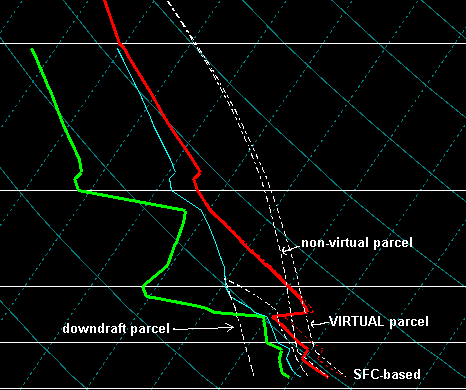

The SPC uses two different methods to calculate instability parameters
- "virtual" parcels, and "non-virtual" parcels. The "virtual" parcel is
used to calculate CAPE and LI on our web page, since it includes the effects
of moisture on density via the virtual temperature. Operational experience
suggests the "non-virtual" CIN and LFC values are more useful in forecasting
convective initiation.

For additional information, please see:

Doswell, C.A., III, and E.N. Rasmussen, 1994: The effect of neglecting
the virtual temperature correction on CAPE calculations. *Wea. Forecasting*,
**9**,
625-629.

The prefixes "**sb**", "**mu**", and "**ml**" in SPC discussion
products identify which air parcels are being used to calculate the CAPE
or LI. **SB** = the surface-based parcel, **MU** = the most unstable
parcel found in the lowest  300 mb of the atmosphere, and **ML**
= the mean conditions in the lowest 100 mb.

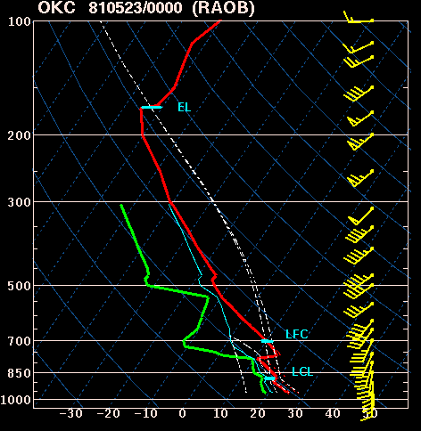

There is some confusion over which of these various parcel choices is
most relevant to forecasting thunderstorms.  Unfortunately, the science
of meteorology is still inexact, and we just don't know!  However,
recent observational evidence suggests that late afternoon cumulus cloud
base heights are best estimated using the **ml** parcel.

For additional information, please see:

Craven, J. P., R. E. Jewell, and H. E. Brooks, 2002: Comparison between
observed convective cloud base heights and lifting condensation level 
for two different lifted parcels.  *Wea. Forecasting*, **17**,
885-890.

**LCL** = lifting condensation level. This is the level at which
a lifted parcel becomes saturated, and is a reasonable estimate of cloud
base height when air parcels experience forced ascent. The LCL is this
example is for the lifted surface parcel.

**LFC** = level of free convection. The LFC is the level at which
a lifted parcel begins a free acceleration upward to the equilibrium level.
Preliminary research suggests that tornadoes become more likely
with supercells when LFC heights are less than 2,000 m above ground level, and
thunderstorms are more easily initiated and maintained when LFC heights are
lower than about 3,000 m. The LFC is this example is for the lifted surface parcel.

More details are available from **[Jon Davies' web site](http://members.cox.net/jdavies1/lfcht/lfcht.htm)**.

**LFC-LCL** = the height difference between the LFC and the LCL.
The smaller the difference between the LCL and LFC, the more likely deep
convection becomes.

**EL**= equilibrium level. The EL is the level at which a lifted
parcel becomes cooler than the environmental temperature and is no longer
buoyant (i.e., "unstable"). The EL is used primarily to estimate the height
of a thunderstorm anvil. You may notice that the "virtual" and "non-virtual"
lifted parcels both end up with the same EL. This happens because the virtual
temperature converges to the actual temperature when temperatures are very
cold (less than -20 C) and moisture effects become negligble.

**Lapse Rates** = the rate of temperature change with height. The
faster temperature decreases with height, the "steeper" the lapse rate
and more "unstable" the atmosphere becomes. The SPC graphics display the
temperature lapse rates from 850-500 mb (roughly 4500 - 18,000 ft above
sea level), and 700-500 mb (10,000 - 18,000 ft above sea level). Lapse
rates are shown in terms of degrees Celcius change per kilometer in height.
Values less than 5.5 - 6 Ckm-1 ("moist adiabatic") represent
"stable" conditions, while values near 9.5 Ckm-1 (dry adiabatic)
are considered "absolutely unstable". In between these two values, lapse
rates are considered "conditionally unstable". Conditional instability
means that if enough moisture is present, lifted air parcels could have
a negative LI or positive CAPE.

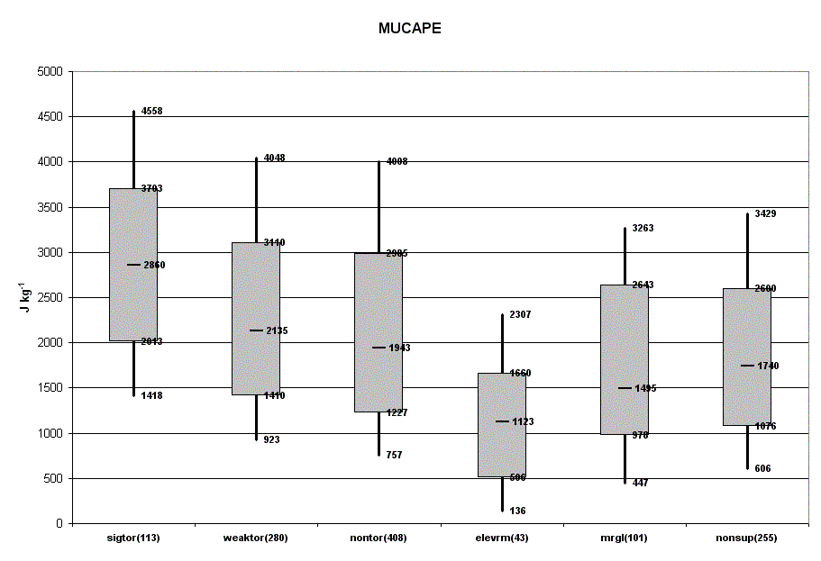

**CAPE** = Convective Available Potential Energy. CAPE is a measure
of instability through the depth of the atmosphere, and is related to updraft
strength in thunderstorms. SPC forecasters often refer to "weak instability"
(CAPE less than 1000 Jkg-1), "moderate instability" (CAPE from
1000-2500 Jkg-1), "strong instability" (CAPE from 2500-4000
Jkg-1), and "extreme instability" (CAPE greater than 4000 Jkg-1).
The CAPE in the sample sounding above is about 3500 Jkg-1 lifting
the "non-virtual" surface parcel. In the real world, CAPE is usually an
overestimate of updraft strength due to water loading and entrainment of
unsaturated environmental air.

**LI** = Lifted Index. The lifted index is the temperature difference
between the 500 mb temperature and the temperature of a parcel lifted to
500 mb. Negative values denote unstable conditions. LI is more of a measure
of actual "instability" than CAPE because it represents the potential buoyancy
of a parcel at a level, whereas CAPE is integrated through the depth of
the troposphere. The LI is the sample sounding above is about -10 C, lifting
the "non-virtual" surface parcel.

**Normalized CAPE** = CAPE divided by the depth of the layer where
CAPE is present (units of m/s2). Normalized CAPE can be interpreted
in much the same way as the LI (e.g., a "tall, skinny" CAPE gives a low
normalized CAPE value and a small negative LI, while a "short, wide" CAPE
gives a large normalized CAPE and larger negative LI.

For additional information, please see:

Blanchard, D. O., 1998: Assessing the vertical distribution of convective
available potential energy. *Wea. Forecasting*, **13**, 870-877.

**CIN** = convective inhibition. Convective inhibition represents the
"negative" area on a sounding that must be overcome for storm initiation.
The CIN in the sample sounding above is about 50 Jkg-1, lifting
the "non-virtual" SFC parcel.

**DCAPE** = Downdraft CAPE. DCAPE can be used to estimate the potential
strength of rain-cooled downdrafts with thunderstorms convection, and is
similar to CAPE. Larger DCAPE values are associated with stronger downdrafts.

For additional information, please see:

Gilmore, M.S., and L.J. Wicker, 1998: The influence of midtropospheric
dryness on supercell morphology and evolution. *Wea. Forecasting*,
**126**,
943-958.

---

## Deep Layer Wind Shear Parameters

**BL - 6 km shear** = the "boundary layer" to 6 km above ground level
change in wind. Thunderstorms tend to become more organized and persistent
as vertical shear increases, while supercells are commonly associated with
vertical shear values of 35-40 kt and greater through this depth.

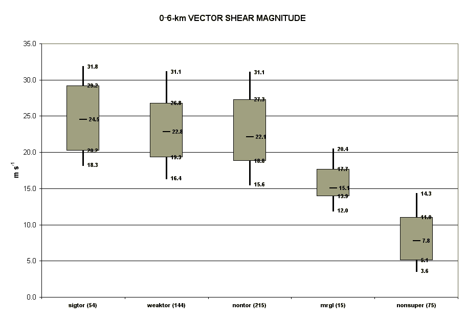

For additional information, please see:

Weisman, M.L., 1996: On the use of vertical wind shear versus helicity
in interpreting supercell dynamics. Preprints, *18th Conf. on Severe
Local Storms*, San Francisco, CA, Amer. Meteor. Soc., 200-204.

Rasmussen, E.N., and D.O. Blanchard, 1998: A baseline climatology of
sounding-derived supercell and tornado forecast parameters. *Wea. Forecasting*,
**13**,
1148-1164.

**Effective Bulk Shear** = the maximum bulk shear from the "most unstable" lifted
parcel level upward to 40-60% of the equilibrium level height. This parameter is similar
to the 0-6 km bulk shear, though it accounts for storm depth (LPL to EL) and is designed
to identify both surface-based and "elevated" supercell environments. Supercells become
more probable as the effective bulk shear increases through the range of 25-40 kt and greater.

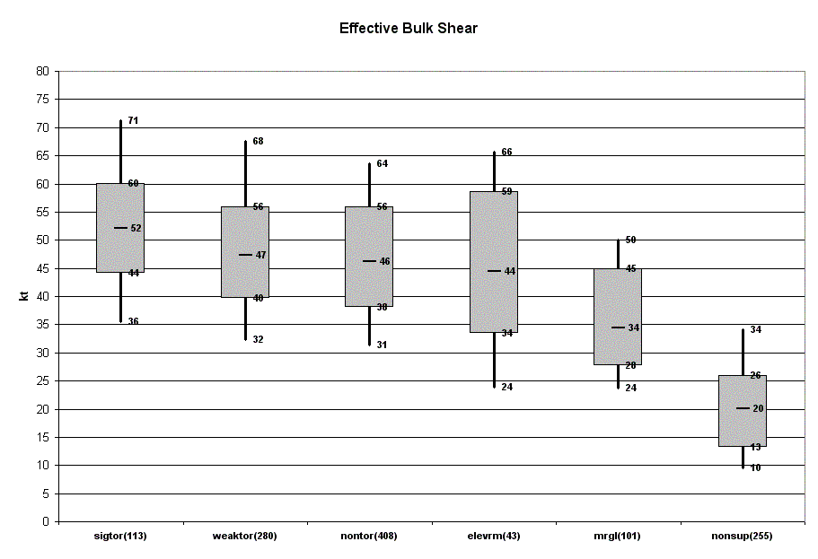

For additional information, please see:

Thompson, R. L., C. M. Mead, and R. Edwards, 2003:  [Effective storm-relative helicity and bulk shear in supercell thunderstorm environments.](http://www.spc.noaa.gov/publications/thompson/effective.pdf) *Wea. Forecasting*,
**22**, 102-115.

 
**BRN shear** = Bulk Richardson Number shear term (the denominator of
the BRN). BRN shear is similar to the BL - 6 km shear, except that BRN
shear uses a difference between the low level wind and a density-weighted
mean wind through the mid levels. Values of 35-40 m2s-2
or greater have been associated with supercells.

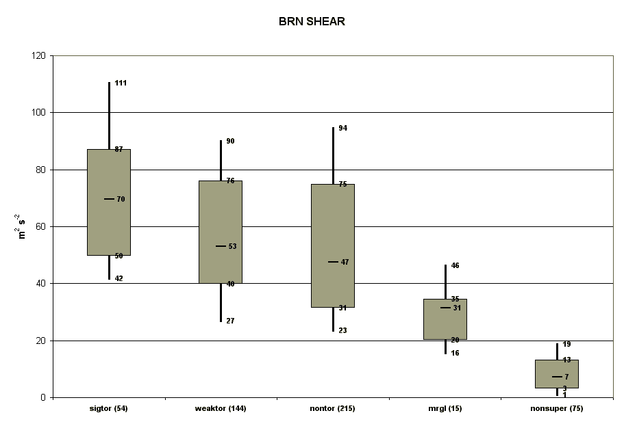

For additional information, please see:

Weisman, M.L., and J.B. Klemp, 1982: The dependence of numerically simulated
convective storms on vertical wind shear and buoyancy. *Mon. Wea. Rev.*,
**110**, 504-520.

Stensrud, D.J., J.V. Cortinas Jr., and H.E. Brooks, 1997: Discriminating
between tornadic and nontornadic thunderstorms using mesoscale model output.
*Wea. Forecasting*, **12**, 613-632.

---

## Storm-Relative Winds

Storm-relative (**SR**) winds have been examined as possible discriminators
between tornadic and nontornadic supercells. Each parameter is displayed
within the "favorable" ranges for tornadic storms.

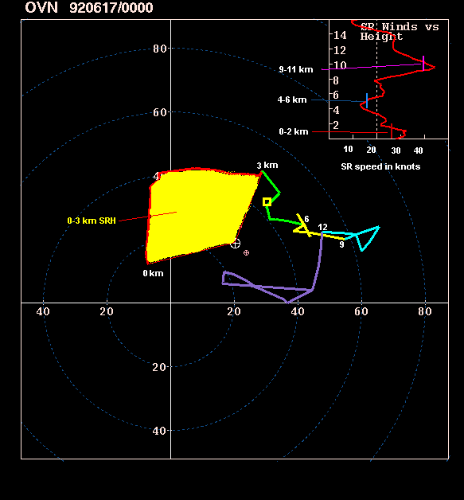

**SRH** = Storm-Relative Helicity. SRH is a measure
of the potential for cyclonic updraft rotation in right-moving supercells,
and is calculated for the lowest 1 and 3 km layers above ground level.
There is no clear threshold value for SRH when forecasting supercells,
since the formation of supercells appears to be related more strongly to
the deeper layer vertical shear. However, larger values of 0-3 km SRH (greater
than 250 m2s-2) and 0-1 km SRH (greater than 100
m2s-2) do suggest an increased threat of tornadoes
with supercells. For SRH, larger is generally better, but there are no
clear "boundaries" between nontornadic and significant tornadic supercells.

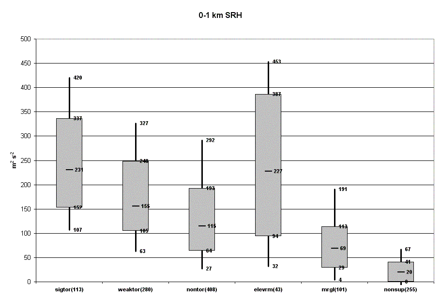

For additional information, please see:

Davies-Jones, R.P., 1984: Streamwise vorticity: The origin of updraft
rotation in supercell storms. *J. Atmos. Sci.*, **41**, 2991-3006.

Davies-Jones, R.P., D.W. Burgess, and M. Foster, 1990: Test of helicity
as a forecast parameter. Preprints, *16th Conf. on Severe Local Storms*,
Kananaskis Park, AB, Canada, Amer. Meteor. Soc. 588-592.

Rasmussen, E.N., and D.O. Blanchard, 1998: A baseline climatology of
sounding-derived supercell and tornado forecast parameters. *Wea. Forecasing*,
**13**,
1148-1164.

**"Effective" SRH** calculates SRH based on threshold values
of lifted parcel CAPE (100 J kg-1) and CIN (-250 J kg-1).
These parcel constraints are meant to confine the SRH layer calculation to the
part of a sounding where lifted parcels are buoyant, but not strongly capped.
For example, a supercell forms or moves over an area where the most unstable
parcels are located a couple of thousand feet above the ground, and stable air
is located at ground level. The question then becomes "how much of the cool air
can the supercell ingest and still survive?" Our estimate is to start with the
surface parcel level, and work upward until a lifted parcel's CAPE value increases
to 100 Jkg-1 or more, with an associated CIN greater than -250 Jkg-1.
From the level meeting the constraints (the "effective surface"), we continue to look
upward in the sounding until a lifted parcel has a CAPE less than 100 Jkg-1 OR
a CIN less than -250 J kg-1. Of the three SRH calculations displayed on the
SPC mesoanalysis page, effective SRH discriminates the best between significant tornadic
and nontornadic supercells.

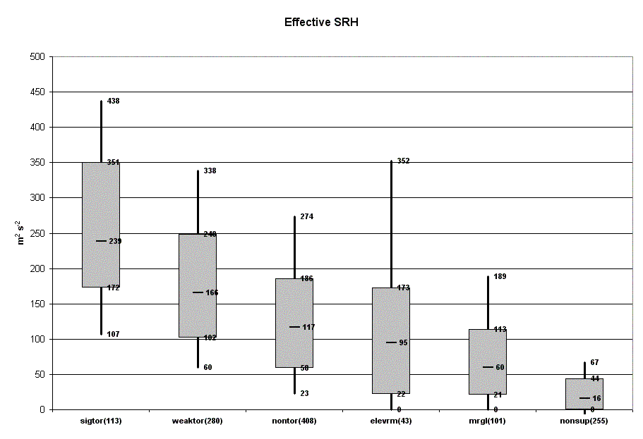

The **0-2 km SR winds** are meant to represent low-level storm inflow.
The majority of sustained supercells have 0-2 km storm inflow values of
15-20 kt or greater. The red vertical bar in the upper right inset shows
the 0-2 km mean SR speed (see sample hodograph above).

More details are available at **[http://www.spc.noaa.gov/publications/
thompson/sr.htm](http://www.spc.noaa.gov/publications/thompson/sr.htm)**.

While there appear to be some differences between significantly tornadic and
nontornadic supercells in terms of **midlevel (4-6 km) SR wind speeds**,
recent work by Thompson et al. (2003) and Markowski et al. (2003) suggests that
the differences are too small to be considered useful in forecast operations,
given typical uncertainties in storm motion estimates. The blue vertical bar
in the upper right inset shows the 4-6 km mean SR wind speed (see sample hodograph
above).

For additional information, please see:

Thompson, R. L., R. Edwards, J. A. Hart, K. L. Elmore, and P. Markowski,
2003:  [Close proximity
soundings within supercell environments obtained from the Rapid Update Cycle.](http://www.spc.noaa.gov/publications/thompson/ruc_waf.pdf) *Wea. Forecasting*,
**18**, 1243-1261.

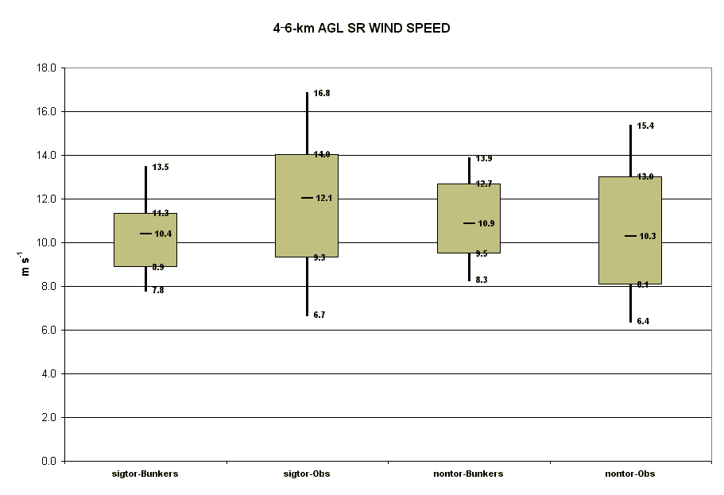
**Storm-relative winds from 9-11 km** and near the "anvil level" of
a storm are meant to discriminate supercell type. In general, upper-level
SR winds less than 40 kt have been associated with "high precipitation" supercells,
40-60 kt SR winds for "classic" supercells, and > 60 kt SR winds for "low-precipitation"
supercells.

For additional information, please see:

Rasmussen, E. N., and J.M. Straka, 1998: Variations in supercell morphology,
Part I: Observations of the role of upper-level storm-relative flow. *Mon.
Wea. Rev.*, **126**, 2406-2421.

---

## Composite CAPE/Shear Parameters

**EHI** = Energy-Helicity Index. The basic premise behind EHI is that
storm rotation should be maximized when CAPE is large and SRH is large.
0-1 km EHI values greater than 1-2 have been associated with significant
tornadoes in supercells.

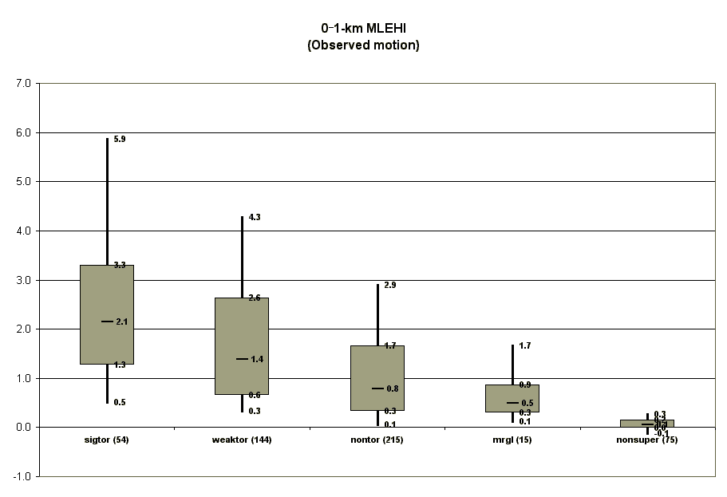

For additional information, please see:

Hart, J.A., and W. Korotky, 1991: The SHARP workstation v1.50 users
guide. National Weather Service, NOAA, US. Dept. of Commerce, 30 pp. [Available
from NWS Eastern Region Headquarters, 630 Johnson Ave., Bohemia, NY 11716.]

Davies, J.M., 1993: Hourly helicity, instability, and EHI in forecasting
supercell tornadoes. Preprints, *17th Conf. on Severe Local Storms*,
St. Louis, MO, Amer. Meteor. Soc., 107-111.

**VGP** = Vorticity Generation Parameter. The VGP is meant to estimate
the rate of tilting and stretching of horizontal vorticity by a thunderstorm
updraft. Values greater than 0.2 suggest an increasing possibility of tornadic
storms.

For additional information, please see:

Rasmussen, E.N., and D.O. Blanchard, 1998: A baseline climatology of
sounding-derived supercell and tornado forecast parameters. *Wea. Forecasting*,
**13**,
1148-1164.

**Supercell Composite Parameter** = a multi-parameter index that
includes effective SRH, muCAPE, and effective bulk shear. Each parameter
is normalized to supercell "threshold" values. Effective SRH is divided
by 50 m2/s2, muCAPE is divided by 1000 J/kg, and effective bulk shear is divided
by 20 m/s in the shear range of 10-20 m/s. Effective bulk shear less than 10 m/s
is set to zero, and effective bulk shear greater than 20 m/s is set to one.

This index is formulated as follows:

SCP = (muCAPE / 1000 J/kg) \* (ESRH / 50 m2/s2) \* (ESHEAR / 20 m/s)

For example, an ESRH of 300 m2/s2, muCAPE of 3000 J/kg, and ESHEAR of 20 m/s
results in a supercell composite index of 18.

The following "box and whiskers" graph shows the distribution of SCP
values for proximity soundings derived from RAP model hourly analyses.

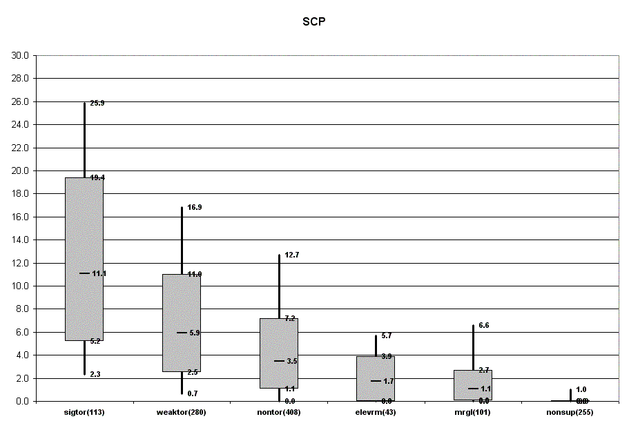

For additional information, please see:

Thompson, R. L., R. Edwards, J. A. Hart, K. L. Elmore, and P. Markowski,
2003:  [Close proximity
soundings within supercell environments obtained from the Rapid Update Cycle.](http://www.spc.noaa.gov/publications/thompson/ruc_waf.pdf) *Wea. Forecasting*,
**18**, 1243-1261.

**Significant Tornado Parameter** = a multi-parameter index that
includes effective bulk shear, effective SRH, 100 mb mean parcel CAPE, and
100 mb mean parcel LCL height.  This index is
formulated as follows:

        STP = (mlCAPE / 1500 J/kg)
\* ((2000 - mlLCL) / 1500 m) \* (ESRH / 150 m2/s2) \* (ESHEAR / 20 m/s)

A majority of significant tornadoes (F2 or greater damage) have been
associated with STP values greater than 1, while most nontornadic supercells
have been associated with vales less than 1 in a large sample of RAP analysis
proximity soundings.

 

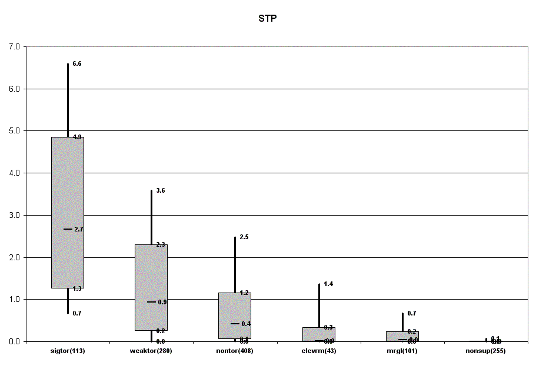

For additional information, please see:

Thompson, R. L., R. Edwards, J. A. Hart, K. L. Elmore, and P. Markowski,
2003:  [Close proximity
soundings within supercell environments obtained from the Rapid Update Cycle.](http://www.spc.noaa.gov/publications/thompson/ruc_waf.pdf) *Wea. Forecasting*,
**18**, 1243-1261.

**Significant Tornado Parameter (with mlCIN)** = a multi-parameter index that
includes effective bulk shear, effective SRH, 100 mb mean parcel CAPE, 100 mb mean
parcel LCL height, and 100 mb mean parcel CIN.
  This index is formulated as follows:

        STPC = (mlCAPE / 1500 J/kg)
\* ((2000 - mlLCL) / 1500 m) \* (ESRH / 150 m2/s2) \* (ESHEAR / 20 m/s) \* ((mlCIN + 200) / 150)

A majority of significant tornadoes (F2 or greater damage) have been
associated with STP values greater than 1, while most nontornadic supercells
have been associated with vales less than 1 in a large sample of RAP analysis
proximity soundings. Inclusion of the mlCIN term tends to reduce the size of
contoured areas, thus reducing false alarms.

For additional information, please see:

Thompson, R. L., B. T. Smith, J. S. Grams, A. R. Dean, and C. Broyles,
2012:  [Convective modes for significant severe thunderstorms
in the contiguous United States. Part II: Supercell and QLCS tornado environments.](http://www.spc.noaa.gov/publications/thompson/waf-env.pdf) *Wea. Forecasting*,
**27**, 1136-1154.

---
