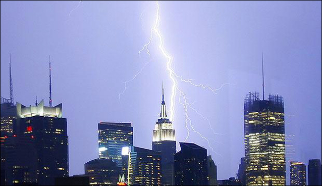

# Lightning Myths and Facts

> Source: <https://www.weather.gov/safety/lightning-myths>  
> Section: Lightning  
> Captured: 2026-08-19 06:00 UTC  
> PDF: [lightning-myths-and-facts.pdf](lightning-myths-and-facts.pdf) · Original HTML: [source/original.html](source/original.html)

---

- [HOME](#)
- [FORECAST](https://www.weather.gov/forecastmaps/)

  - [Local](https://www.weather.gov)
  - [Graphical](https://digital.weather.gov)
  - [Aviation](https://aviationweather.gov)
  - [Marine](https://www.weather.gov/marine/)
  - [Rivers and Lakes](https://water.noaa.gov)
  - [Hurricanes](https://www.nhc.noaa.gov)
  - [Severe Weather](https://www.spc.noaa.gov)
  - [Fire Weather](https://www.weather.gov/fire/)
  - [Sunrise/Sunset](https://gml.noaa.gov/grad/solcalc/)
  - [Long Range Forecasts](https://www.cpc.ncep.noaa.gov)
  - [Climate Prediction](https://www.cpc.ncep.noaa.gov)
  - [Space Weather](https://www.swpc.noaa.gov)
- [PAST WEATHER](https://www.weather.gov/wrh/climate)

  - [Past Weather](https://www.weather.gov/wrh/climate)
  - [Astronomical Data](https://gml.noaa.gov/grad/solcalc/)
  - [Certified Weather Data](https://www.climate.gov/maps-data/dataset/past-weather-zip-code-data-table)
- [SAFETY](https://www.weather.gov/safety/)
- [INFORMATION](https://www.weather.gov/informationcenter)

  - [Wireless Emergency Alerts](https://www.weather.gov/wrn/wea)
  - [Weather-Ready Nation](https://www.weather.gov/wrn/)
  - [Brochures](https://www.weather.gov/owlie/publication_brochures)
  - [Cooperative Observers](https://www.weather.gov/coop/)
  - [Daily Briefing](https://www.weather.gov/briefing/)
  - [Damage/Fatality/Injury Statistics](https://www.weather.gov/hazstat)
  - [Forecast Models](http://mag.ncep.noaa.gov)
  - [GIS Data Portal](https://www.weather.gov/gis/)
  - [NOAA Weather Radio](https://www.weather.gov/nwr)
  - [Publications](https://www.weather.gov/publications/)
  - [SKYWARN Storm Spotters](https://www.weather.gov/skywarn/)
  - [StormReady](https://www.weather.gov/stormready)
  - [TsunamiReady](https://www.weather.gov/tsunamiready/)
  - [Service Change Notices](https://www.weather.gov/notification/)
- [EDUCATION](https://www.weather.gov/education/)
- [NEWS](https://www.weather.gov/news)
- [SEARCH](https://www.weather.gov/search/)

  - Search For

    NWS

    All NOAA
- [ABOUT](https://www.weather.gov/about/)

  - [About NWS](https://www.weather.gov/about/)
  - [Organization](https://www.weather.gov/organization)
  - [For NWS Employees](https://sites.google.com/a/noaa.gov/nws-insider/)
  - [National Centers](https://www.weather.gov/ncep/)
  - [Careers](https://www.noaa.gov/nws-careers)
  - [Contact Us](https://www.weather.gov/contact)
  - [Glossary](../../15-weather-glossaries/national-weather-service-glossary/national-weather-service-glossary.md)
  - [Social Media](https://www.weather.gov/socialmedia)
  - [NWS Transformation](https://www.noaa.gov/NWStransformation)

Safety

National Program

# Lightning Myths

[Weather.gov](https://www.weather.gov)
> [Safety](https://www.weather.gov/safety)
> Lightning Myths

**Lightning Resources**

# Lightning Myths and Facts

**Myth**: If you're caught outside during a thunderstorm, you should crouch down to reduce your risk of being struck.
**Fact:** Crouching doesn't make you any safer outdoors. Run to a substantial building or hard topped vehicle. If you are too far to run to one of these options, you have no other good alternative. You are NOT safe anywhere outdoors. See our [safety](https://www.weather.gov/safety/) page for tips that may slightly reduce your risk.

**Myth**: Lightning never strikes the same place twice.
**Fact:** Lightning often strikes the same place repeatedly, especially if it's a tall, pointy, isolated object. The Empire State Building is hit an average of 23 times a year

**Myth**: If it’s not raining or there aren’t clouds overhead, you’re safe from lightning.
**Fact:** Lightning often strikes more than three miles from the center of the thunderstorm, far outside the rain or thunderstorm cloud. “Bolts from the blue” can strike 10-15 miles from the thunderstorm.

**Myth**: A lightning victim is electrified. If you touch them, you’ll be electrocuted.
**Fact:** The human body does not store electricity. It is perfectly safe to touch a lightning victim to give them first aid. This is the most chilling of lightning Myths. Imagine if someone died because people were afraid to give CPR! When tending to a lightning victim, be aware of the continued threat for lightning, and move yourself and the victim to a safe location as soon as it is possible.

**Myth**: If outside in a thunderstorm, you should seek shelter under a tree to stay dry.
**Fact:** Being underneath a tree is the second leading cause of lightning casualties. Better to get wet than fried!

**Myth**: If you are in a house, you are 100% safe from lightning.
**Fact:** A house is a safe place to be during a thunderstorm as long as you avoid anything that conducts electricity. This means staying off corded phones, electrical appliances, wires, TV cables, computers, plumbing, metal doors and windows. Windows are hazardous for two reasons: wind generated during a thunderstorm can blow objects into the window, breaking it and causing glass to shatter and second, in older homes, in rare instances, lightning can come in cracks in the sides of windows.

**Myth**: If thunderstorms threaten while you are outside playing a game, it is okay to finish it before seeking shelter.
**Fact:** Many lightning casualties occur because people do not seek shelter soon enough. No game is worth death or life-long injuries. Seek proper shelter immediately if you hear thunder. Adults are responsible for the safety of children.

**Myth**: Structures with metal, or metal on the body (jewelry, cell phones,Mp3 players, watches, etc), attract lightning.
**Fact:** Height, pointy shape, and isolation are the dominant factors controlling where a lightning bolt will strike. The presence of metal makes absolutely no difference on where lightning strikes. Natural objects that are tall and isolated, but are made of little to no metal, like trees and mountains get struck by lightning many times a year. When lightning threatens, take proper protective action immediately by seeking a safe shelter and don’t waste time removing metal. While metal does not attract lightning, it does conduct it so stay away from metal fences, railing, bleachers, etc.

**Myth**: If trapped outside and lightning is about to strike, I should lie flat on the ground.
**Fact:** Lying flat increases your chance of being affected by potentially deadly ground current. If you are caught outside in a thunderstorm, you keep moving toward a safe shelter.

**Myth**: lightning flashes are 3-4 km apart
**Fact:** Old data said successive flashes were on the order of 3-4 km apart. New data shows half the flashes are about 9 km apart. The National Severe Storms Laboratory report concludes: "It appears the safety rules need to be modified to increase the distance from a previous flash which can be considered to be relatively safe, to at least 10 to 13 km (6 to 8 miles). In the past, 3 to 5 km (2-3 miles) was as used in lightning safety education." *Source: Separation Between Successive Lightning Flashes in Different Storms Systems: 1998, Lopez & Holle, from Proceedings 1998 Intl Lightning Detection Conference, Tucson AZ, November 1998.*

**Myth**: A High Percentage of Lightning Flashes Are Forked.
**Fact:** Many cloud-to-ground lightning flashes have forked or multiple attachment points to earth. Tests carried out in the US and Japan verify this finding in at least half of negative flashes and more than 70% of positive flashes. Many lightning detectors cannot acquire accurate information about these multiple ground lightning attachments. *Source: Termination of Multiple Stroke Flashes Observed by Electro- Magnetic Field: 1998, Ishii, et al. Proceedings 1998 Int'l Lightning Protection Conference, Birmingham UK, Sept. 1998.*

**Myth**: Lightning Can Spread out Some 60 Feet After Striking Earth.
**Fact:** Radial horizontal arcing has been measured at least 20 m. from the point where lightning hits ground. Depending on soils characteristics, safe conditions for people and equipment near lightning termination points (ground rods) may need to be re-evaluated. *Source: 1993 Triggered Lightning Test Program: Environments Within 20 meters of the Lightning Channel and Small Are Temporary Protection Concepts: 1993, SAND94-0311, Sandia Natl Lab, Albuquerque NM.*

### Lightning Trivia

- Cape Canaveral Air Force Station/Kennedy Space Center has documented lightning traveling almost 90 miles outward in the thunderstorm anvil.
- How far can you see lightning? According to Cape Canaveral/Kennedy Space Center, up to 100-km flashes.
- Lightning Causes Forest Fires. Can Forest Fires Cause Lightning? Yes, smoke and carbon micro-particles, when introduced into the upper atmosphere, can become the initiators of static. Sufficient atmospheric static can spark discharge as lightning. Reports of massive lightning storms in coastal Brasil, Peru and Hawaii have been linked to burning of sugar cane fields. The late 90's Mexican forest fires resulted in unusual lightning activity in the USA High Plains area (Lyons, et al.) So too can dust in an enclosed grain elevator create a static discharge. Recent reports (Orville, et al) show the Houston TX petrochemical industry, discharging copious amounts of hydrocarbons into the upper atmosphere, may be responsible for higher-than-normal lightning activity in that area. (National Lightning Safety Institute)

[US Dept of Commerce](http://www.commerce.gov)
[National Oceanic and Atmospheric Administration](http://www.noaa.gov)
[National Weather Service](https://www.weather.gov)
Safety
 1325 East West Highway
Silver Spring, MD 20910

[Comments? Questions? Please Contact Us.](mailto:wrn.feedback@noaa.gov)

[Disclaimer](https://www.weather.gov/disclaimer)
[Information Quality](http://www.cio.noaa.gov/services_programs/info_quality.html)
[Help](https://www.weather.gov/help)
[Glossary](https://www.weather.gov/glossary)

[Privacy Policy](https://www.weather.gov/privacy)
[Freedom of Information Act (FOIA)](https://www.noaa.gov/foia-freedom-of-information-act)
[About Us](https://www.weather.gov/about)
[Career Opportunities](https://www.weather.gov/careers)
