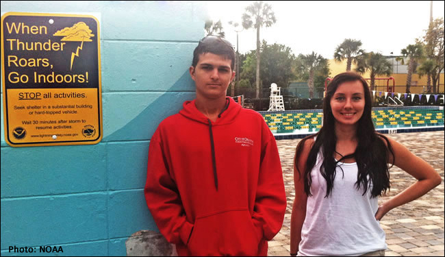

# Lightning Safety — Additional Lightning Safety Tutorials

> Source: <https://www.weather.gov/safety/lightning-safety>  
> Section: Lightning  
> Captured: 2026-08-19 06:00 UTC  
> PDF: [lightning-safety-additional-lightning-safety-tutorials.pdf](lightning-safety-additional-lightning-safety-tutorials.pdf) · Original HTML: [source/original.html](source/original.html)

---

- [HOME](#)
- [FORECAST](https://www.weather.gov/forecastmaps/)

  - [Local](https://www.weather.gov)
  - [Graphical](https://digital.weather.gov)
  - [Aviation](https://aviationweather.gov)
  - [Marine](https://www.weather.gov/marine/)
  - [Rivers and Lakes](https://water.noaa.gov)
  - [Hurricanes](https://www.nhc.noaa.gov)
  - [Severe Weather](https://www.spc.noaa.gov)
  - [Fire Weather](https://www.weather.gov/fire/)
  - [Sunrise/Sunset](https://gml.noaa.gov/grad/solcalc/)
  - [Long Range Forecasts](https://www.cpc.ncep.noaa.gov)
  - [Climate Prediction](https://www.cpc.ncep.noaa.gov)
  - [Space Weather](https://www.swpc.noaa.gov)
- [PAST WEATHER](https://www.weather.gov/wrh/climate)

  - [Past Weather](https://www.weather.gov/wrh/climate)
  - [Astronomical Data](https://gml.noaa.gov/grad/solcalc/)
  - [Certified Weather Data](https://www.climate.gov/maps-data/dataset/past-weather-zip-code-data-table)
- [SAFETY](https://www.weather.gov/safety/)
- [INFORMATION](https://www.weather.gov/informationcenter)

  - [Wireless Emergency Alerts](https://www.weather.gov/wrn/wea)
  - [Weather-Ready Nation](https://www.weather.gov/wrn/)
  - [Brochures](https://www.weather.gov/owlie/publication_brochures)
  - [Cooperative Observers](https://www.weather.gov/coop/)
  - [Daily Briefing](https://www.weather.gov/briefing/)
  - [Damage/Fatality/Injury Statistics](https://www.weather.gov/hazstat)
  - [Forecast Models](http://mag.ncep.noaa.gov)
  - [GIS Data Portal](https://www.weather.gov/gis/)
  - [NOAA Weather Radio](https://www.weather.gov/nwr)
  - [Publications](https://www.weather.gov/publications/)
  - [SKYWARN Storm Spotters](https://www.weather.gov/skywarn/)
  - [StormReady](https://www.weather.gov/stormready)
  - [TsunamiReady](https://www.weather.gov/tsunamiready/)
  - [Service Change Notices](https://www.weather.gov/notification/)
- [EDUCATION](https://www.weather.gov/education/)
- [NEWS](https://www.weather.gov/news)
- [SEARCH](https://www.weather.gov/search/)

  - Search For

    NWS

    All NOAA
- [ABOUT](https://www.weather.gov/about/)

  - [About NWS](https://www.weather.gov/about/)
  - [Organization](https://www.weather.gov/organization)
  - [For NWS Employees](https://sites.google.com/a/noaa.gov/nws-insider/)
  - [National Centers](https://www.weather.gov/ncep/)
  - [Careers](https://www.noaa.gov/nws-careers)
  - [Contact Us](https://www.weather.gov/contact)
  - [Glossary](../../15-weather-glossaries/national-weather-service-glossary/national-weather-service-glossary.md)
  - [Social Media](https://www.weather.gov/socialmedia)
  - [NWS Transformation](https://www.noaa.gov/NWStransformation)

Safety

National Program

# Lightning Safety

[Weather.gov](https://www.weather.gov)
> [Safety](https://www.weather.gov/safety)
> Lightning Safety

**Lightning Resources**

There is no safe place outside when thunderstorms are in the area. If you hear thunder, you are likely within striking distance of the storm. Just remember, ***When Thunder Roars, Go Indoors.*** Too many people wait far too long to get to a safe place when thunderstorms approach. Unfortunately, these delayed actions lead to many of the lightning deaths and injuries in the United States. Below are tips on how to stay safe indoors and outdoors as well as brochures and other tools to teach lightning safety.

- [Lightning Safety Outdoors](https://www.weather.gov/safety/lightning-outdoors)
- [Lightning Safety Indoors](https://www.weather.gov/safety/lightning-indoors)
- Dr. Lightning: [Safety](https://www.weather.gov/media/safety/Dr_Lightning_Guide%20_Safety.ppsx)
- [Overview of Lightning Safety](https://www.weather.gov/safety/lightning-safety-overview)
- [N](https://www.weather.gov/media/owlie/lightning-safety.pdf)[OAA Lightning Safety Brochure](https://www.weather.gov/media/owlie/Lightning-Brochure18.pdf)
- [What You Need to Know: Tips for Safety](https://www.weather.gov/safety/lightning-tips)
- [Lightning Safety and Recreational Activities](../lightning-safety/lightning-safety.md)
- [Lightning Safety on the Job](https://www.weather.gov/safety/lightning-job)
- Lightning and Fires, [science](https://www.weather.gov/safety/lightning-science-continuing-current)
- [Protecting Your Home](https://www.weather.gov/safety/lightning-rods)

[US Dept of Commerce](http://www.commerce.gov)
[National Oceanic and Atmospheric Administration](http://www.noaa.gov)
[National Weather Service](https://www.weather.gov)
Safety
 1325 East West Highway
Silver Spring, MD 20910

[Comments? Questions? Please Contact Us.](mailto:wrn.feedback@noaa.gov)

[Disclaimer](https://www.weather.gov/disclaimer)
[Information Quality](http://www.cio.noaa.gov/services_programs/info_quality.html)
[Help](https://www.weather.gov/help)
[Glossary](https://www.weather.gov/glossary)

[Privacy Policy](https://www.weather.gov/privacy)
[Freedom of Information Act (FOIA)](https://www.noaa.gov/foia-freedom-of-information-act)
[About Us](https://www.weather.gov/about)
[Career Opportunities](https://www.weather.gov/careers)
