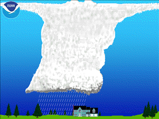

# NWS Lightning Tutorial — Additional NWS Tutorials

> Source: <https://www.weather.gov/safety/lightning-science-scienceintro>  
> Section: Lightning  
> Captured: 2026-08-19 06:00 UTC  
> PDF: [nws-lightning-tutorial-additional-nws-tutorials.pdf](nws-lightning-tutorial-additional-nws-tutorials.pdf) · Original HTML: [source/original.html](source/original.html)

---

- [HOME](#)
- [FORECAST](https://www.weather.gov/forecastmaps/)

  - [Local](https://www.weather.gov)
  - [Graphical](https://digital.weather.gov)
  - [Aviation](https://aviationweather.gov)
  - [Marine](https://www.weather.gov/marine/)
  - [Rivers and Lakes](https://water.noaa.gov)
  - [Hurricanes](https://www.nhc.noaa.gov)
  - [Severe Weather](https://www.spc.noaa.gov)
  - [Fire Weather](https://www.weather.gov/fire/)
  - [Sunrise/Sunset](https://gml.noaa.gov/grad/solcalc/)
  - [Long Range Forecasts](https://www.cpc.ncep.noaa.gov)
  - [Climate Prediction](https://www.cpc.ncep.noaa.gov)
  - [Space Weather](https://www.swpc.noaa.gov)
- [PAST WEATHER](https://www.weather.gov/wrh/climate)

  - [Past Weather](https://www.weather.gov/wrh/climate)
  - [Astronomical Data](https://gml.noaa.gov/grad/solcalc/)
  - [Certified Weather Data](https://www.climate.gov/maps-data/dataset/past-weather-zip-code-data-table)
- [SAFETY](https://www.weather.gov/safety/)
- [INFORMATION](https://www.weather.gov/informationcenter)

  - [Wireless Emergency Alerts](https://www.weather.gov/wrn/wea)
  - [Weather-Ready Nation](https://www.weather.gov/wrn/)
  - [Brochures](https://www.weather.gov/owlie/publication_brochures)
  - [Cooperative Observers](https://www.weather.gov/coop/)
  - [Daily Briefing](https://www.weather.gov/briefing/)
  - [Damage/Fatality/Injury Statistics](https://www.weather.gov/hazstat)
  - [Forecast Models](http://mag.ncep.noaa.gov)
  - [GIS Data Portal](https://www.weather.gov/gis/)
  - [NOAA Weather Radio](https://www.weather.gov/nwr)
  - [Publications](https://www.weather.gov/publications/)
  - [SKYWARN Storm Spotters](https://www.weather.gov/skywarn/)
  - [StormReady](https://www.weather.gov/stormready)
  - [TsunamiReady](https://www.weather.gov/tsunamiready/)
  - [Service Change Notices](https://www.weather.gov/notification/)
- [EDUCATION](https://www.weather.gov/education/)
- [NEWS](https://www.weather.gov/news)
- [SEARCH](https://www.weather.gov/search/)

  - Search For

    NWS

    All NOAA
- [ABOUT](https://www.weather.gov/about/)

  - [About NWS](https://www.weather.gov/about/)
  - [Organization](https://www.weather.gov/organization)
  - [For NWS Employees](https://sites.google.com/a/noaa.gov/nws-insider/)
  - [National Centers](https://www.weather.gov/ncep/)
  - [Careers](https://www.noaa.gov/nws-careers)
  - [Contact Us](https://www.weather.gov/contact)
  - [Glossary](../../15-weather-glossaries/national-weather-service-glossary/national-weather-service-glossary.md)
  - [Social Media](https://www.weather.gov/socialmedia)
  - [NWS Transformation](https://www.noaa.gov/NWStransformation)

Safety

National Program

# Understanding Lightning

[Weather.gov](https://www.weather.gov)
> [Safety](https://www.weather.gov/safety)
> Understanding Lightning

*By John S. Jensenius, Jr., Lightning Safety Specialist*

Lightning is one of the top three storm-related killers in the United States. It is also one of the least understood weather phenomena. Learn more about lightning science at the links below. You can go through the site sequentially for a complete intro to lightning science or pick the topics of interest to you.

- [Lightning Science Overview](https://www.weather.gov/safety/lightning-science-overview)
- [Thunderstorm Development](https://www.weather.gov/safety/lightning-thunderstorm-development)
- [Thunderstorm Electrification](https://www.weather.gov/safety/lightning-science-electrification)
- [Types of Flashes](https://www.weather.gov/safety/lightning-science-types-flashes)
- [I](http://www.lightningsafety.noaa.gov/science/science_initiation_leaders.shtml)[nitiation of Leaders](https://www.weather.gov/safety/lightning-science-initiation-leaders)
- [Negatively-Charged Flash:](https://www.weather.gov/safety/lightning-science-negative-charged-flash)
  - [Initiation of Stepped Leader](https://www.weather.gov/safety/lightning-science-initiation-stepped-leader)
  - [Making A Connection With The Ground](https://www.weather.gov/safety/lightning-science-connection-ground)
  - [Return Stroke](https://www.weather.gov/safety/lightning-science-return-stroke)
  - [Subsequent Dart Leaders and Return Strokes](https://www.weather.gov/safety/lightning-science-dart-leaders)
  - [Slow Motion Video Of Lightning Flashes](https://www.weather.gov/safety/lightning-science-slow-motion-flashes)
  - [Ground Current](https://www.weather.gov/safety/lightning-science-ground-currents)
- [Positive Flash](https://www.weather.gov/safety/lightning-science-positive-flashes)
- [Upward Leaders/Discharges](https://www.weather.gov/safety/lightning-science-upward-leaders)
- [Continuing Current/Hot Lightning](https://www.weather.gov/safety/lightning-science-continuing-current)
- [Thunder](https://www.weather.gov/safety/lightning-science-thunder)
- [Acknowledgements And References](https://www.weather.gov/safety/lightning-science-references)

*Return to lightning [Science](https://www.weather.gov/safety/lightning-science) page*

[US Dept of Commerce](http://www.commerce.gov)
[National Oceanic and Atmospheric Administration](http://www.noaa.gov)
[National Weather Service](https://www.weather.gov)
Safety
 1325 East West Highway
Silver Spring, MD 20910

[Comments? Questions? Please Contact Us.](mailto:wrn.feedback@noaa.gov)

[Disclaimer](https://www.weather.gov/disclaimer)
[Information Quality](http://www.cio.noaa.gov/services_programs/info_quality.html)
[Help](https://www.weather.gov/help)
[Glossary](https://www.weather.gov/glossary)

[Privacy Policy](https://www.weather.gov/privacy)
[Freedom of Information Act (FOIA)](https://www.noaa.gov/foia-freedom-of-information-act)
[About Us](https://www.weather.gov/about)
[Career Opportunities](https://www.weather.gov/careers)
