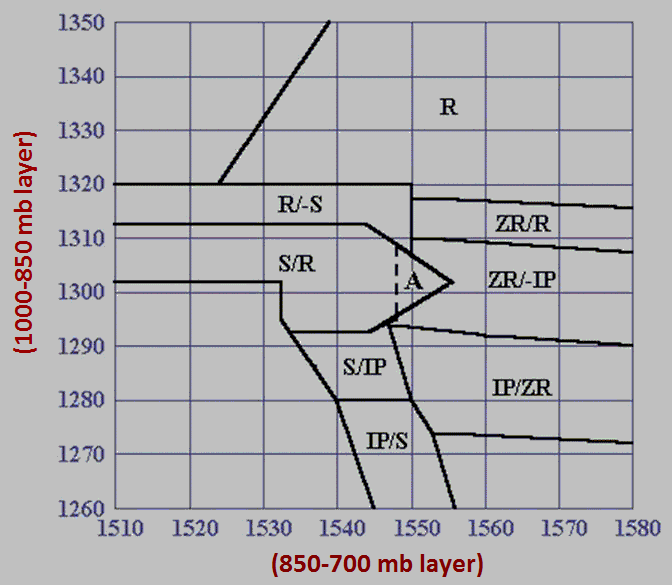

# Precipitation Nomogram

> Source: <http://www.weather.gov/source/zhu/ZHU_Training_Page/winter_stuff/precip_nomogram/Nomo_index.html>  
> Section: Precipitation Types (Winter Stuff)  
> Captured: 2026-08-19 06:00 UTC  
> PDF: [precipitation-nomogram.pdf](precipitation-nomogram.pdf) · Original HTML: [source/original.html](source/original.html)

---

# Precip Type based on Nomogram

The weather grids produced by this tool indicate where a type of precip is expected
(rain or frozen precip) based on model thickness in the 1000-850mb layer and 850-700 mb layer.

| Nomogram Abbreviation | Precip Type |
| --- | --- |
| R | Rain |
| S (-S) | Snow (Light Snow, Flurries) |
| IP | Sleet |
| ZR | Freezing Rain |

