# Precipitation Types

> Source: <http://www.weather.gov/source/zhu/ZHU_Training_Page/winter_stuff/winter_wx/winter_wx.html>  
> Section: Precipitation Types (Winter Stuff)  
> Captured: 2026-08-19 06:00 UTC  
> PDF: [precipitation-types.pdf](precipitation-types.pdf) · Original HTML: [source/original.html](source/original.html)

---

# Will it rain, sleet or snow?

When meteorologists forecast a winter storm one of the important questions they must answer is what type of precipitation is going to
fall (rain, sleet, or freezing rain)? Look at the graphics below. Decide how precipitation changes from as it falls through the air at different temperatures from the upper
levels of the atmosphere to the ground.

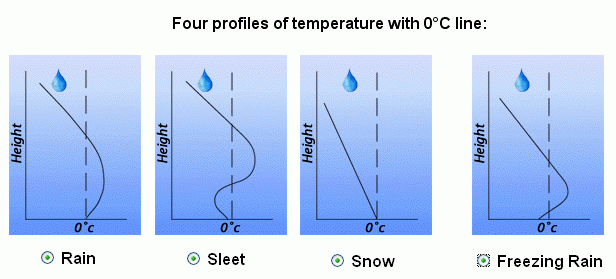

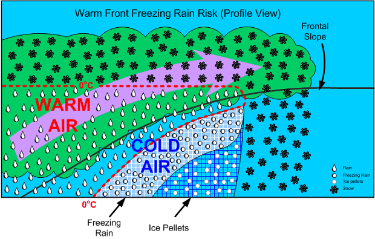

---

# Winter precipitation types and their environments

The vertical distribution of temperature will often determine the type of precipitation (rain vs. snow vs. sleet vs. freezing rain) that occurs at the surface during the wintertime. More often than not, the temperature does not decrease with height but increases, many times by several degrees, before decreasing. This increase, then decrease is called an inversion. In winter, an inversion can be critical in determining the type or types of weather.

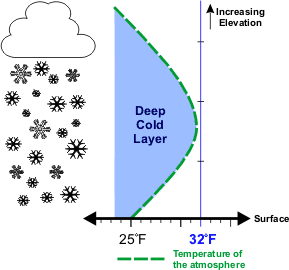

In the image (left) the green dashed line is the temperature in respect to elevation. The surface temperature is 25°F (-4°C) and increases with height before decreasing. However, since the temperature remains below freezing any precipitation that falls will remain as **snow**.

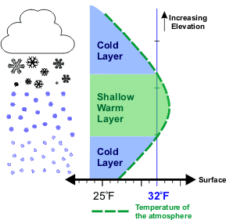

In this image the surface temperature is higher, 27°F (-3°C). Also as elevation increases, the temperature increases to a point where some of the atmosphere is above freezing before the temperature lowers again below freezing.

As snow falls into the layer of air where the temperature is above freezing, the snow flakes partially melt. As the precipitation reenters the air that is below freezing, the precipitation will re-freeze into ice pellets that bounce off the ground, commonly called **sleet**. The most likely place for freezing rain and sleet is to the north of warm fronts. The cause of the wintertime mess is a layer of air above freezing aloft.

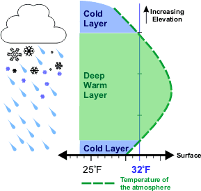

**Freezing rain** will occur if the warm layer in the atmosphere is deep with only a shallow layer of below freezing air at the surface. The precipitation can begin as either rain and/or snow but becomes all rain in the warm layer. The rain falls back into the air that is below freezing but since the depth is shallow, the rain does not have time to freeze into sleet.

Upon hitting the ground or objects such as bridges and vehicles, the rain freezes on contact. Some of the most disastrous winter weather storms are due primarily to freezing rain.

---

# Rain

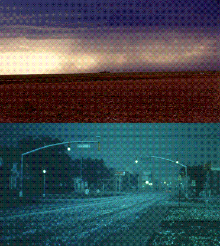

Rain develops when growing cloud droplets become too heavy to remain in the cloud and as a result, fall toward the surface as rain. Rain can also begin
as ice crystals that collect each other to form large snowflakes. As the falling snow passes through the freezing level into warmer air, the flakes
melt and collapse into rain drops. The picture to the left shows heavy rain falling from a Texas thunderstorm.

Hail is a large frozen raindrop produced by intense thunderstorms, where snow and rain can coexist in the central updraft. As the snowflakes fall, liquid
water freezes onto them forming ice pellets that will continue to grow as more and more droplets are accumulated. Upon reaching the bottom of the
cloud, some of the ice pellets are carried by the updraft back up to the top of the storm.

As the ice pellets once again fall through the cloud, another layer of ice is added and the hail stone grows even larger. Typically the stronger the
updraft, the more times a hail stone repeats this cycle and consequently, the larger it grows. Once the hail stone becomes too heavy to be supported by
the updraft, it falls out of the cloud toward the surface. The hail stone reaches the ground as ice since it is not in the warm air below the
thunderstorm long enough to melt before reaching the ground.

---

# Freezing Rain

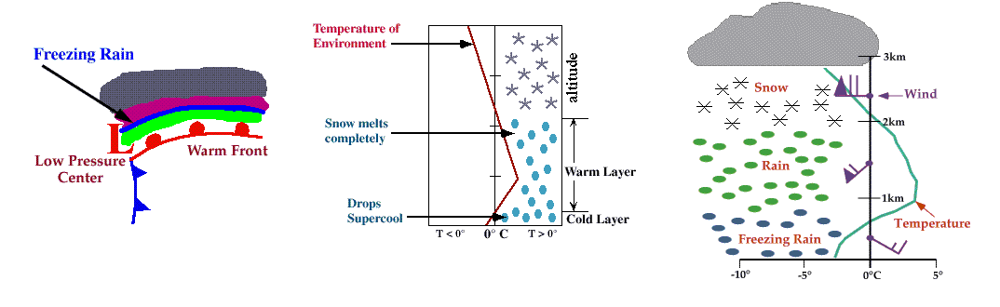

Ice storms can be the most devastating of winter weather phenomena and are often the cause of automobile accidents, power outages and personal injury.
Ice storms result from the accumulation of freezing rain, which is rain that becomes supercooled and freezes upon impact with cold surfaces. Freezing
rain is most commonly found in a narrow band on the cold side of a warm front, where surface temperatures are at or just below freezing.

The diagram shows a typical temperature profile for freezing rain with the red line indicating the atmosphere's temperature at any given altitude.
The vertical line in the center of the diagram is the freezing line. Temperatures to the left of this line are below freezing, while temperatures
to the right are above freezing.

Freezing rain develops as falling snow encounters a layer of warm air deep enough for the snow to completely melt and become rain. As the rain
continues to fall, it passes through a thin layer of cold air just above the surface and cools to a temperature below freezing. However, the drops
themselves do not freeze, a phenomena called supercooling (or forming "supercooled drops"). When the supercooled drops strike the frozen ground
(power lines, or tree branches), they instantly freeze, forming a thin film of ice, hence freezing rain.

## Regions

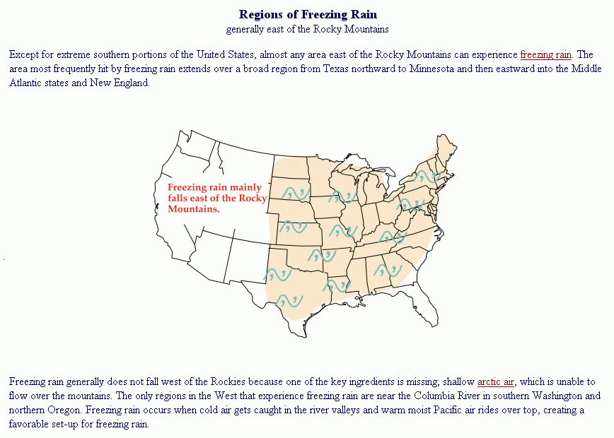

## Ice Crystal Process

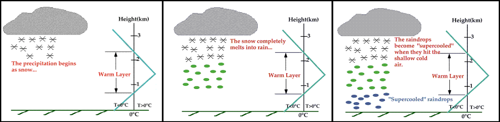

Freezing rain can develop either through ice crystal processes or supercooled warm-rain processes. Ice crystals high in the atmosphere
grow by collecting water vapor molecules, which are sometimes supplied by microscopic evaporating cloud droplets. In the diagram the blue line
represents the temperature of the atmosphere and the black line represents the 0°C (32°F) isotherm (a line of equal temperature). When
the blue line is to the right of the black line, the atmosphere is warmer than 0°C and when the blue line is to the left, the atmosphere is
colder than 0°C.

As the snow falls, it encounters a layer of warm air where snow and ice particles completely melt and collapse into raindrops.

As the raindrops approach the ground, they encounter a layer of cold air and cool to temperatures below 0°C. However, since the cold layer is so
shallow, the drops themselves do not freeze, a phenomena called supercooling (or forming "supercooled raindrops"). The supercooled
raindrops are raindrops that are colder than 0C and freeze on contact when they strike the ground.

## Warm Rain Process

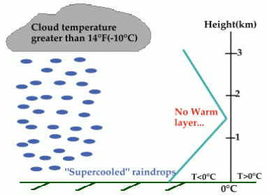

A less common way that freezing rain forms is through supercooled warm-rain process (SWRP), where cloud top temperatures are warmer than about
-10°C. Supercooled raindrops develop as microscopic cloud droplets collect one another as they fall. Ice processes are not involved in the
formation of these raindrops.
The precipitation falls to the surface as supercooled rain or drizzle and freezes instantly on contact. The raindrops do not freeze within the
cold layer because there are very few ice nuclei in the presence of warmer temperatures.

## Cold Air Damming and Extended Lows

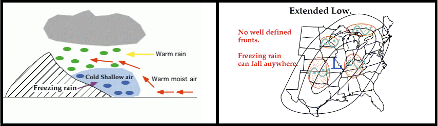

Cold-air damming is common along the East Coast of the United States and occurs when a layer of cold air gets trapped between the coast and
inland mountains. Freezing rain develops when warm oceanic air rises up and over the cold air, producing liquid precipitation that falls
through the cold layer. The falling droplets become supercooled and freeze on impact with the cold surface.

Another weather pattern that may lead to the development of freezing rain is a broad area of low pressure called an "extended low", which is
typically very weak and covers a large area of the country. An extended low has very diffuse frontal boundaries and is often the remnants of a
dying cyclone.

Upper-level winds transport warm moist air up and over the pool of cold air associated with the extended low, and given the right conditions,
freezing rain occurs. In addition, convergence associated with the low produces upward motions that may also contribute to the development of
freezing rain. Freezing rain can be found anywhere in the vicinity of an extended low since there are typically no preferred regions of
development.

## Cyclones and Fronts

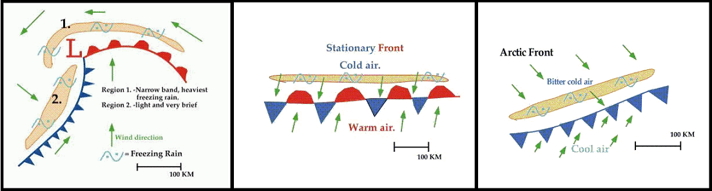

In most cases, freezing rain results from the process of warm moist air "overrunning" colder air. Perhaps the most common overrunning scenario
occurs as warm moist air flows up and over a warm front associated with a midlatitude cyclone. The rising air cools, the water vapor condenses,
producing a narrow band of freezing rain ahead of the front. This band is typically less than 50 kilometers (30 miles) wide and is represented by
region #1 (shaded in orange) in the diagram. This band is often wrapped around and behind the low pressure center by counterclockwise winds
flowing around the cyclone. Some of the most devastating ice storms occur in association with this narrow band of freezing rain.

A second area of freezing rain is typically found behind the cold front, (region #2 shaded in orange in the diagram). Freezing rain develops as
southerly winds at upper levels push warm moist air up and over the cold front, producing precipitation that falls into the colder air. Freezing
rain associated with the cold front is usually very light and scattered, and in rare cases, even observed ahead of the front.

Stationary fronts can be associated with the production of freezing rain. A stationary front separates cold air to the north from warm moist air
to the south. Freezing rain develops as upper-level winds (typically light and southwesterly) push warm moist air over the colder air north of
the stationary front, producing a narrow band of freezing rain on the cold side of the frontal boundary.

---

# Sleet

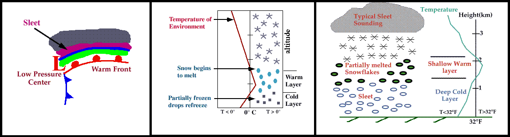

Progressing further ahead of the warm front, surface temperatures continue to decrease and the freezing rain eventually changes over to sleet. Areas of
sleet are located on the colder side (typically north) of the freezing rain band.

Sleet is less prevalent than freezing rain and is defined as frozen raindrops that bounce on impact with the ground or other objects. The diagram shows a
typical temperature profile for sleet with the red line indicating the atmosphere's temperature at any given altitude. The vertical line in the
center of the diagram is the freezing line. Temperatures to the left of this line are below freezing, while temperatures to the right are above freezing.

Sleet is more difficult to forecast than freezing rain because it develops under more specialized atmospheric conditions. It is very similar to freezing
rain in that it causes surfaces to become very slick, but is different because it's easily visible.

---

# Snow

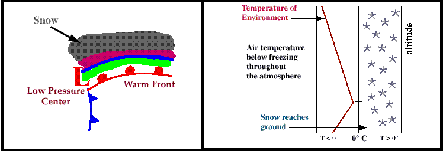

Progressing even further away from the warm front, surface temperatures continue to decrease and the sleet changes over to snow.

Snowflakes are simply aggregates of ice crystals that collect to each other as they fall toward the surface. The diagram shows a typical temperature
profile for snow with the red line indicating the atmosphere's temperature at any given altitude. The vertical line in the center of the diagram is
the freezing line. Temperatures to the left of this line are below freezing, while temperatures to the right are above freezing.

Since the snowflakes do not pass through a layer of air warm enough to cause them to melt, they remain intact and reach the ground as snow.
