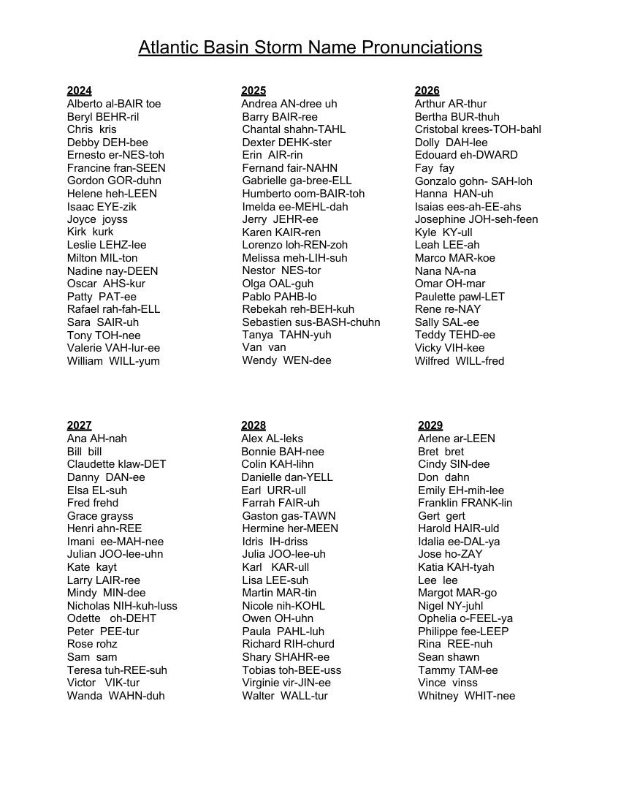

# Atlantic Basin Names

> Source: <http://www.weather.gov/media/zhu/ZHU_Training_Page/tropical_stuff/stormnames/atlantic_names.pdf>  
> Section: Tropical Cyclones  
> Captured: 2026-08-19 06:00 UTC  
> PDF: [atlantic-basin-names.pdf](atlantic-basin-names.pdf) (1 pages)

---

## Page 1

Atlantic Basin Storm Name Pronunciations 
 
 
2024 
Alberto al-BAIR toe  
Beryl BEHR-ril  
Chris kris 
Debby DEH-bee  
Ernesto er-NES-toh  
Francine fran-SEEN  
Gordon GOR-duhn  
Helene heh-LEEN  
Isaac EYE-zik  
Joyce joyss 
Kirk kurk 
Leslie LEHZ-lee  
Milton MIL-ton  
Nadine nay-DEEN  
Oscar  AHS-kur  
Patty  PAT-ee  
Rafael rah-fah-ELL  
Sara SAIR-uh 
Tony TOH-nee  
Valerie VAH-lur-ee  
William WILL-yum 
2025 
Andrea AN-dree uh  
  Barry BAIR-ree  
  Chantal shahn-TAHL  
  Dexter DEHK-ster  
  Erin AIR-rin 
  Fernand fair-NAHN  
  Gabrielle ga-bree-ELL        
  Humberto oom-BAIR-toh  
  Imelda ee-MEHL-dah  
  Jerry JEHR-ee 
  Karen KAIR-ren  
  Lorenzo loh-REN-zoh  
  Melissa meh-LIH-suh  
  Nestor NES-tor 
  Olga OAL-guh  
  Pablo PAHB-lo 
  Rebekah reh-BEH-kuh      
  Sebastien sus-BASH-chuhn 
  Tanya TAHN-yuh 
  Van van 
  Wendy WEN-dee 
 
2026 
Arthur AR-thur 
Bertha BUR-thuh 
Cristobal krees-TOH-bahl  
Dolly DAH-lee 
Edouard eh-DWARD  
Fay fay 
Gonzalo gohn- SAH-loh 
Hanna HAN-uh 
Isaias ees-ah-EE-ahs 
Josephine JOH-seh-feen  
Kyle KY-ull 
Leah LEE-ah  
Marco MAR-koe  
Nana NA-na  
Omar OH-mar  
Paulette pawl-LET  
Rene re-NAY  
Sally SAL-ee  
Teddy TEHD-ee  
Vicky VIH-kee  
Wilfred WILL-fred 
 
 
 
2027 
Ana AH-nah  
Bill bill 
Claudette klaw-DET  
Danny DAN-ee 
Elsa EL-suh  
Fred frehd  
Grace grayss  
Henri ahn-REE  
Imani ee-MAH-nee 
Julian JOO-lee-uhn  
Kate kayt 
Larry LAIR-ree  
Mindy MIN-dee 
Nicholas NIH-kuh-luss 
Odette   oh-DEHT  
Peter PEE-tur 
Rose rohz  
Sam sam 
Teresa tuh-REE-suh  
Victor   VIK-tur  
Wanda WAHN-duh 
 
2028 
Alex AL-leks  
Bonnie BAH-nee  
Colin KAH-lihn  
Danielle dan-YELL  
Earl URR-ull 
  Farrah FAIR-uh  
  Gaston gas-TAWN  
  Hermine her-MEEN  
  Idris  IH-driss 
  Julia JOO-lee-uh 
  Karl   KAR-ull  
  Lisa LEE-suh  
  Martin MAR-tin  
  Nicole nih-KOHL  
  Owen OH-uhn  
  Paula PAHL-luh 
  Richard RIH-churd  
  Shary SHAHR-ee  
  Tobias toh-BEE-uss  
  Virginie vir-JIN-ee  
  Walter WALL-tur 
 
2029 
Arlene ar-LEEN  
Bret bret 
Cindy SIN-dee  
Don dahn 
Emily EH-mih-lee  
Franklin FRANK-lin  
Gert gert 
Harold HAIR-uld  
Idalia ee-DAL-ya  
Jose ho-ZAY  
Katia KAH-tyah  
Lee lee 
Margot MAR-go  
Nigel NY-juhl  
Ophelia o-FEEL-ya  
Philippe fee-LEEP  
Rina  REE-nuh  
Sean shawn  
Tammy TAM-ee  
Vince  vinss  
Whitney WHIT-nee
