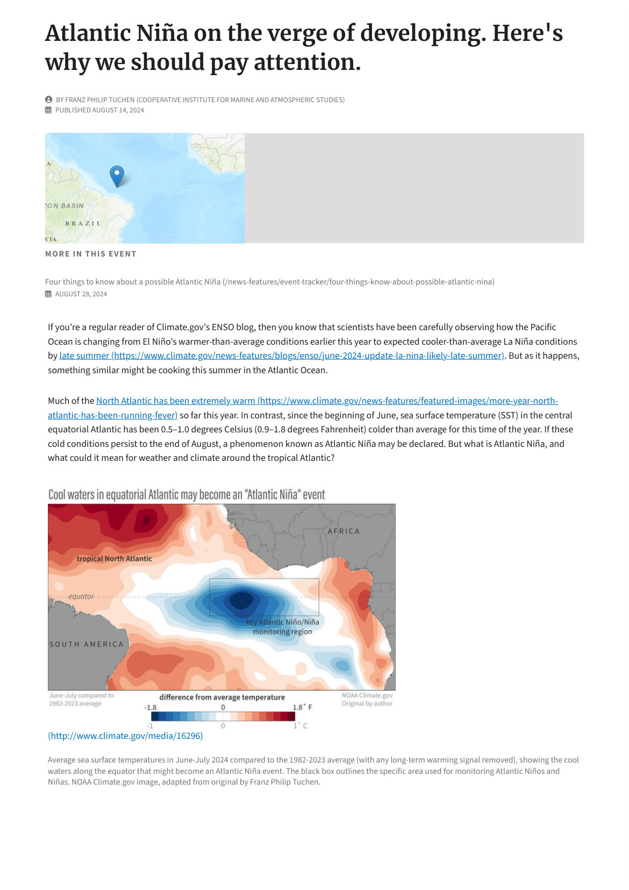
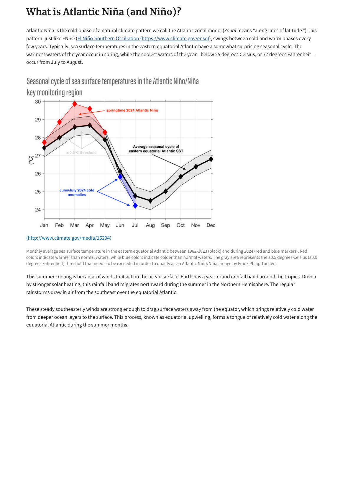
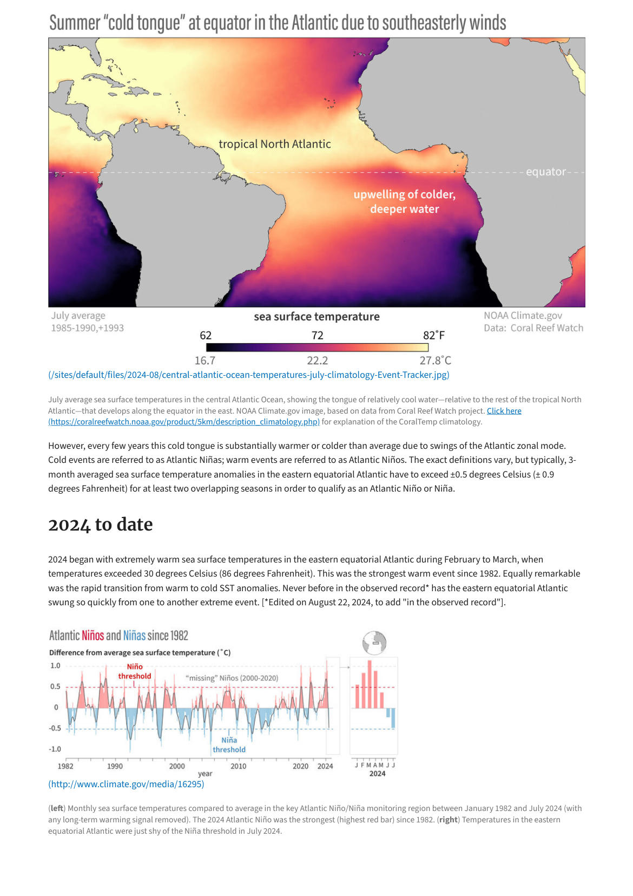
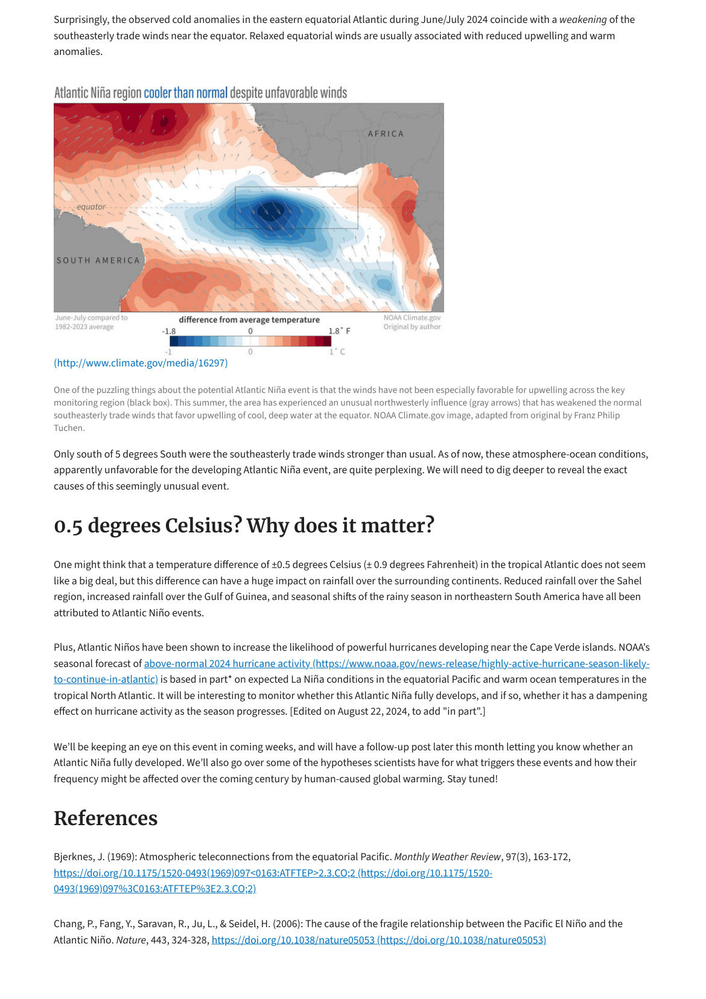
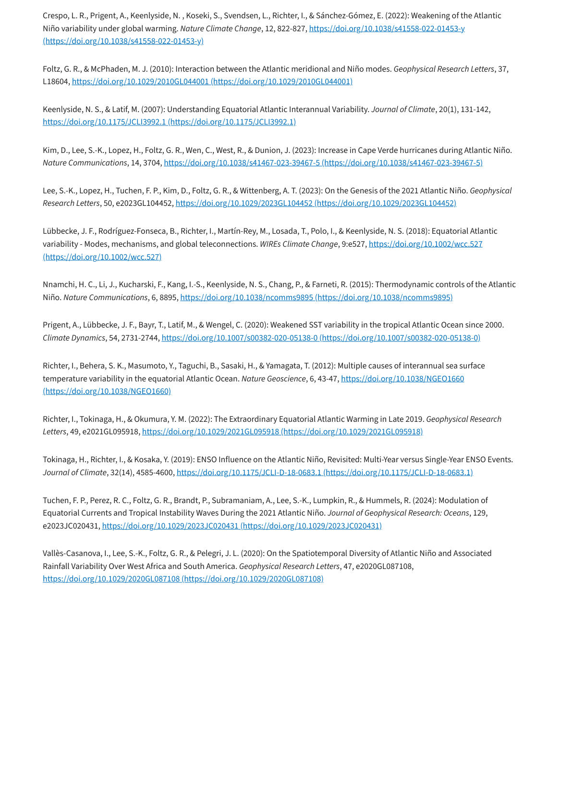

# Hurricane Facts — La Niña and Atlantic Hurricanes

> Source: <http://www.weather.gov/media/zhu/ZHU_Training_Page/tropical_stuff/Misc/La_Nina_Hurricanes.pdf>  
> Section: Tropical Cyclones  
> Captured: 2026-08-19 06:00 UTC  
> PDF: [hurricane-facts-la-nina-and-atlantic-hurricanes.pdf](hurricane-facts-la-nina-and-atlantic-hurricanes.pdf) (5 pages)

---

## Page 1

Atlantic Niña on the verge of developing. Here's
why we should pay attention.
BY FRANZ PHILIP TUCHEN (COOPERATIVE INSTITUTE FOR MARINE AND ATMOSPHERIC STUDIES)
PUBLISHED AUGUST 14, 2024
MORE IN THIS EVENT
Four things to know about a possible Atlantic Niña (/news-features/event-tracker/four-things-know-about-possible-atlantic-nina)
AUGUST 28, 2024
If you’re a regular reader of Climate.gov’s ENSO blog, then you know that scientists have been carefully observing how the Pacific
Ocean is changing from El Niño’s warmer-than-average conditions earlier this year to expected cooler-than-average La Niña conditions
by late summer (https://www.climate.gov/news-features/blogs/enso/june-2024-update-la-nina-likely-late-summer). But as it happens,
something similar might be cooking this summer in the Atlantic Ocean. 
Much of the North Atlantic has been extremely warm (https://www.climate.gov/news-features/featured-images/more-year-north-
atlantic-has-been-running-fever) so far this year. In contrast, since the beginning of June, sea surface temperature (SST) in the central
equatorial Atlantic has been 0.5–1.0 degrees Celsius (0.9–1.8 degrees Fahrenheit) colder than average for this time of the year. If these
cold conditions persist to the end of August, a phenomenon known as Atlantic Niña may be declared. But what is Atlantic Niña, and
what could it mean for weather and climate around the tropical Atlantic? 
(http://www.climate.gov/media/16296)
Average sea surface temperatures in June-July 2024 compared to the 1982-2023 average (with any long-term warming signal removed), showing the cool
waters along the equator that might become an Atlantic Niña event. The black box outlines the specific area used for monitoring Atlantic Niños and
Niñas. NOAA Climate.gov image, adapted from original by Franz Philip Tuchen.

## Page 2

What is Atlantic Niña (and Niño)?
Atlantic Niña is the cold phase of a natural climate pattern we call the Atlantic zonal mode. (Zonal means “along lines of latitude.”) This
pattern, just like ENSO (El Niño-Southern Oscillation (https://www.climate.gov/enso)), swings between cold and warm phases every
few years. Typically, sea surface temperatures in the eastern equatorial Atlantic have a somewhat surprising seasonal cycle. The
warmest waters of the year occur in spring, while the coolest waters of the year—below 25 degrees Celsius, or 77 degrees Fahrenheit—
occur from July to August.
(http://www.climate.gov/media/16294)
Monthly average sea surface temperature in the eastern equatorial Atlantic between 1982-2023 (black) and during 2024 (red and blue markers). Red
colors indicate warmer than normal waters, while blue colors indicate colder than normal waters. The gray area represents the ±0.5 degrees Celsius (±0.9
degrees Fahrenheit) threshold that needs to be exceeded in order to qualify as an Atlantic Niño/Niña. Image by Franz Philip Tuchen.
This summer cooling is because of winds that act on the ocean surface. Earth has a year-round rainfall band around the tropics. Driven
by stronger solar heating, this rainfall band migrates northward during the summer in the Northern Hemisphere. The regular
rainstorms draw in air from the southeast over the equatorial Atlantic. 
These steady southeasterly winds are strong enough to drag surface waters away from the equator, which brings relatively cold water
from deeper ocean layers to the surface. This process, known as equatorial upwelling, forms a tongue of relatively cold water along the
equatorial Atlantic during the summer months.

## Page 3

(/sites/default/files/2024-08/central-atlantic-ocean-temperatures-july-climatology-Event-Tracker.jpg)
July average sea surface temperatures in the central Atlantic Ocean, showing the tongue of relatively cool water—relative to the rest of the tropical North
Atlantic—that develops along the equator in the east. NOAA Climate.gov image, based on data from Coral Reef Watch project. Click here
(https://coralreefwatch.noaa.gov/product/5km/description_climatology.php) for explanation of the CoralTemp climatology. 
However, every few years this cold tongue is substantially warmer or colder than average due to swings of the Atlantic zonal mode.
Cold events are referred to as Atlantic Niñas; warm events are referred to as Atlantic Niños. The exact definitions vary, but typically, 3-
month averaged sea surface temperature anomalies in the eastern equatorial Atlantic have to exceed ±0.5 degrees Celsius (± 0.9
degrees Fahrenheit) for at least two overlapping seasons in order to qualify as an Atlantic Niño or Niña. 
2024 to date
2024 began with extremely warm sea surface temperatures in the eastern equatorial Atlantic during February to March, when
temperatures exceeded 30 degrees Celsius (86 degrees Fahrenheit). This was the strongest warm event since 1982. Equally remarkable
was the rapid transition from warm to cold SST anomalies. Never before in the observed record* has the eastern equatorial Atlantic
swung so quickly from one to another extreme event. [*Edited on August 22, 2024, to add "in the observed record"].
(http://www.climate.gov/media/16295)
(left) Monthly sea surface temperatures compared to average in the key Atlantic Niño/Niña monitoring region between January 1982 and July 2024 (with
any long-term warming signal removed). The 2024 Atlantic Niño was the strongest (highest red bar) since 1982. (right) Temperatures in the eastern
equatorial Atlantic were just shy of the Niña threshold in July 2024.

## Page 4

Surprisingly, the observed cold anomalies in the eastern equatorial Atlantic during June/July 2024 coincide with a weakening of the
southeasterly trade winds near the equator. Relaxed equatorial winds are usually associated with reduced upwelling and warm
anomalies.
(http://www.climate.gov/media/16297)
One of the puzzling things about the potential Atlantic Niña event is that the winds have not been especially favorable for upwelling across the key
monitoring region (black box). This summer, the area has experienced an unusual northwesterly influence (gray arrows) that has weakened the normal
southeasterly trade winds that favor upwelling of cool, deep water at the equator. NOAA Climate.gov image, adapted from original by Franz Philip
Tuchen.
Only south of 5 degrees South were the southeasterly trade winds stronger than usual. As of now, these atmosphere-ocean conditions,
apparently unfavorable for the developing Atlantic Niña event, are quite perplexing. We will need to dig deeper to reveal the exact
causes of this seemingly unusual event. 
0.5 degrees Celsius? Why does it matter? 
One might think that a temperature difference of ±0.5 degrees Celsius (± 0.9 degrees Fahrenheit) in the tropical Atlantic does not seem
like a big deal, but this difference can have a huge impact on rainfall over the surrounding continents. Reduced rainfall over the Sahel
region, increased rainfall over the Gulf of Guinea, and seasonal shifts of the rainy season in northeastern South America have all been
attributed to Atlantic Niño events. 
Plus, Atlantic Niños have been shown to increase the likelihood of powerful hurricanes developing near the Cape Verde islands. NOAA’s
seasonal forecast of above-normal 2024 hurricane activity (https://www.noaa.gov/news-release/highly-active-hurricane-season-likely-
to-continue-in-atlantic) is based in part* on expected La Niña conditions in the equatorial Pacific and warm ocean temperatures in the
tropical North Atlantic. It will be interesting to monitor whether this Atlantic Niña fully develops, and if so, whether it has a dampening
effect on hurricane activity as the season progresses. [Edited on August 22, 2024, to add "in part".] 
We’ll be keeping an eye on this event in coming weeks, and will have a follow-up post later this month letting you know whether an
Atlantic Niña fully developed. We’ll also go over some of the hypotheses scientists have for what triggers these events and how their
frequency might be affected over the coming century by human-caused global warming. Stay tuned!
References
Bjerknes, J. (1969): Atmospheric teleconnections from the equatorial Pacific. Monthly Weather Review, 97(3), 163-172,
https://doi.org/10.1175/1520-0493(1969)097<0163:ATFTEP>2.3.CO;2 (https://doi.org/10.1175/1520-
0493(1969)097%3C0163:ATFTEP%3E2.3.CO;2)
Chang, P., Fang, Y., Saravan, R., Ju, L., & Seidel, H. (2006): The cause of the fragile relationship between the Pacific El Niño and the
Atlantic Niño. Nature, 443, 324-328, https://doi.org/10.1038/nature05053 (https://doi.org/10.1038/nature05053)

## Page 5

Crespo, L. R., Prigent, A., Keenlyside, N. , Koseki, S., Svendsen, L., Richter, I., & Sánchez-Gómez, E. (2022): Weakening of the Atlantic
Niño variability under global warming. Nature Climate Change, 12, 822-827, https://doi.org/10.1038/s41558-022-01453-y
(https://doi.org/10.1038/s41558-022-01453-y)
Foltz, G. R., & McPhaden, M. J. (2010): Interaction between the Atlantic meridional and Niño modes. Geophysical Research Letters, 37,
L18604, https://doi.org/10.1029/2010GL044001 (https://doi.org/10.1029/2010GL044001)
Keenlyside, N. S., & Latif, M. (2007): Understanding Equatorial Atlantic Interannual Variability. Journal of Climate, 20(1), 131-142,
https://doi.org/10.1175/JCLI3992.1 (https://doi.org/10.1175/JCLI3992.1)
Kim, D., Lee, S.-K., Lopez, H., Foltz, G. R., Wen, C., West, R., & Dunion, J. (2023): Increase in Cape Verde hurricanes during Atlantic Niño.
Nature Communications, 14, 3704, https://doi.org/10.1038/s41467-023-39467-5 (https://doi.org/10.1038/s41467-023-39467-5)
Lee, S.-K., Lopez, H., Tuchen, F. P., Kim, D., Foltz, G. R., & Wittenberg, A. T. (2023): On the Genesis of the 2021 Atlantic Niño. Geophysical
Research Letters, 50, e2023GL104452, https://doi.org/10.1029/2023GL104452 (https://doi.org/10.1029/2023GL104452)
Lübbecke, J. F., Rodríguez-Fonseca, B., Richter, I., Martín-Rey, M., Losada, T., Polo, I., & Keenlyside, N. S. (2018): Equatorial Atlantic
variability - Modes, mechanisms, and global teleconnections. WIREs Climate Change, 9:e527, https://doi.org/10.1002/wcc.527
(https://doi.org/10.1002/wcc.527)
Nnamchi, H. C., Li, J., Kucharski, F., Kang, I.-S., Keenlyside, N. S., Chang, P., & Farneti, R. (2015): Thermodynamic controls of the Atlantic
Niño. Nature Communications, 6, 8895, https://doi.org/10.1038/ncomms9895 (https://doi.org/10.1038/ncomms9895)
Prigent, A., Lübbecke, J. F., Bayr, T., Latif, M., & Wengel, C. (2020): Weakened SST variability in the tropical Atlantic Ocean since 2000.
Climate Dynamics, 54, 2731-2744, https://doi.org/10.1007/s00382-020-05138-0 (https://doi.org/10.1007/s00382-020-05138-0)
Richter, I., Behera, S. K., Masumoto, Y., Taguchi, B., Sasaki, H., & Yamagata, T. (2012): Multiple causes of interannual sea surface
temperature variability in the equatorial Atlantic Ocean. Nature Geoscience, 6, 43-47, https://doi.org/10.1038/NGEO1660
(https://doi.org/10.1038/NGEO1660)
Richter, I., Tokinaga, H., & Okumura, Y. M. (2022): The Extraordinary Equatorial Atlantic Warming in Late 2019. Geophysical Research
Letters, 49, e2021GL095918, https://doi.org/10.1029/2021GL095918 (https://doi.org/10.1029/2021GL095918)
Tokinaga, H., Richter, I., & Kosaka, Y. (2019): ENSO Influence on the Atlantic Niño, Revisited: Multi-Year versus Single-Year ENSO Events.
Journal of Climate, 32(14), 4585-4600, https://doi.org/10.1175/JCLI-D-18-0683.1 (https://doi.org/10.1175/JCLI-D-18-0683.1)
Tuchen, F. P., Perez, R. C., Foltz, G. R., Brandt, P., Subramaniam, A., Lee, S.-K., Lumpkin, R., & Hummels, R. (2024): Modulation of
Equatorial Currents and Tropical Instability Waves During the 2021 Atlantic Niño. Journal of Geophysical Research: Oceans, 129,
e2023JC020431, https://doi.org/10.1029/2023JC020431 (https://doi.org/10.1029/2023JC020431)
Vallès-Casanova, I., Lee, S.-K., Foltz, G. R., & Pelegri, J. L. (2020): On the Spatiotemporal Diversity of Atlantic Niño and Associated
Rainfall Variability Over West Africa and South America. Geophysical Research Letters, 47, e2020GL087108,
https://doi.org/10.1029/2020GL087108 (https://doi.org/10.1029/2020GL087108)
