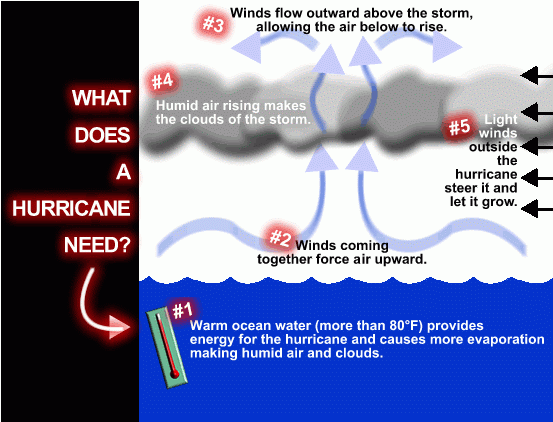
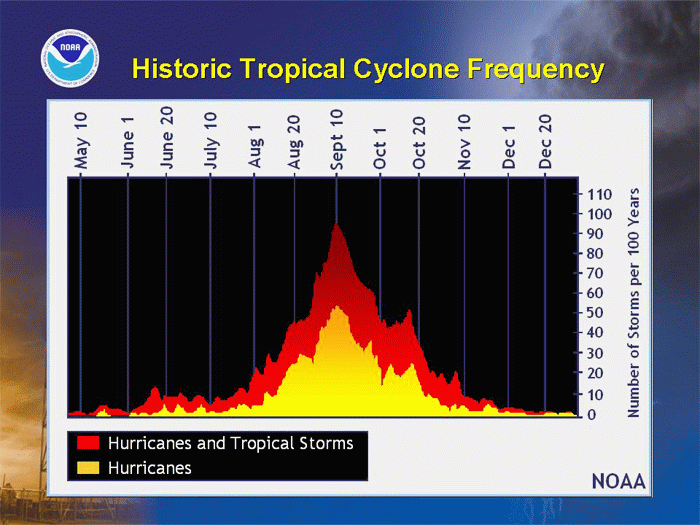

# Hurricane Facts

> Source: <http://www.weather.gov/source/zhu/ZHU_Training_Page/tropical_stuff/hurricane_anatomy/hurricane_anatomy.html>  
> Section: Tropical Cyclones  
> Captured: 2026-08-19 06:00 UTC  
> PDF: [hurricane-facts.pdf](hurricane-facts.pdf) · Original HTML: [source/original.html](source/original.html)

---

**Hurricane Facts**

**There are six widely accepted conditions for hurricane development:**

**1.** The first condition is that ocean waters must be above 26 degrees Celsius
(79 degrees Fahrenheit). Below this threshold temperature, hurricanes will
not form or will weaken rapidly once they move over water below this
threshold. Ocean temperatures in the tropical East Pacific and the tropical
Atlantic routinely surpass this threshold.

**2.** The second ingredient is distance from the equator. Without the spin of the
earth and the resulting Coriolis force, hurricanes would not form. Since
the Coriolis force is at a maximum at the poles and a minimum at the
equator, hurricanes can not form within 5 degrees latitude of the equator.
The Coriolis force generates a counterclockwise spin to low pressure in the
Northern Hemisphere and a clockwise spin to low pressure in the Southern
Hemisphere.

**3.** The third ingredient is that of a saturated lapse rate gradient near the
center of rotation of the storm. A saturated lapse rate insures latent heat
will be released at a maximum rate. Hurricanes are warm core storms. The
heat hurricanes generate is from the condensation of water vapor as it
convectively rises around the eye wall. The lapse rate must be unstable
around the eyewall to insure rising parcels of air will continue to rise
and condense water vapor.

**4.** The fourth and one of the most important ingredients is that of a low
vertical wind shear, especially in the upper level of the atmosphere. Wind
shear is a change in wind speed with height. Strong upper level winds
destroy the storms structure by displacing the warm temperatures above the
eye and limiting the vertical accent of air parcels. Hurricanes will not
form when the upper level winds are too strong.

**5.** The fifth ingredient is high relative humidity values from the surface to
the mid levels of the atmosphere. Dry air in the mid levels of the
atmosphere impedes hurricane development in two ways. First, dry air causes
evaporation of liquid water. Since evaporation is a cooling process, it
reduces the warm core structure of the hurricane and limits vertical
development of convection. Second, dry air in the mid levels can create what
is known as a trade wind inversion. This inversion is similar to sinking air
in a high pressure system. The trade wind inversion produces a layer of warm
temperatures and dryness in the mid levels of the atmosphere due to the
sinking and adiabatic warming of the mid level air. This inhibits deep
convection and produces a stable lapse rate.

**6.** The sixth ingredient is that of a tropical wave. Often hurricanes in the
Atlantic begin as a thunderstorm complex that moves off the coast of
Africa. It becomes what is known as a midtropospheric wave. If this wave
encounters favorable conditions such as stated in the first five
ingredients, it will amplify and evolve into a tropical storm or hurricane.
Hurricanes in the East Pacific can develop by a midtropospheric wave or by
what is known as a monsoonal trough.

**Additional items...**

- Each year, an average of ten tropical storms develop over the Atlantic Ocean,
  Carribean Sea, and Gulf of Mexico. Many of these remain over the ocean. Six of
  these storms become hurricanes each year. In an average 3-year period, roughly
  five hurricanes strike the United States coastline, killing approximately 50 to
  100 people anywhere from Texas to Maine. Of these, two are typically major
  hurricanes (winds greater than 110 mph).

- Typical hurricanes are about 300 miles wide although they can vary considerably in
  size.

- The eye at a hurricane's center is a relatively calm, clear area approximately
  20-40 miles across.

- The eyewall surrounding the eye is composed of dense clouds that contain the
  highest winds in the storm.

- The storm's outer rainbands (often with hurricane or tropical storm-force winds)
  are made up of dense bands of thunderstorms ranging from a few miles to tens of
  miles wide and 50 to 300 miles long.

- Hurricane-force winds can extend outward to about 25 miles in a small hurricane and
  to more than 150 miles for a large one. Tropical storm-force winds can stretch out
  as far as 300 miles from center of a large hurricane.

- Frequently, the right side of a hurricane is the most dangerous in terms of storm
  surge, winds, and tornadoes.

- A hurricane's speed and path depend on complex ocean and atmospheric interactions,
  including the presence or absence of other weather patterns. This complexity of the
  flow makes it very difficult to predict the speed and direction of a hurricane.

- Do not focus on the eye or the track-hurricanes are immense systems that can move
  in complex patterns that are difficult to predict. Be prepared for changes in size,
  intensity, speed and direction.

