# Tropical Tidbits — Spaghetti Models - Mike's Wx Page

> Source: <http://spaghettimodels.com/>  
> Section: Tropical Cyclones  
> Captured: 2026-08-19 06:00 UTC  
> PDF: [tropical-tidbits-spaghetti-models-mike-s-wx-page.pdf](tropical-tidbits-spaghetti-models-mike-s-wx-page.pdf) · Original HTML: [source/original.html](source/original.html)

---



#scroller {
width: 322px;
height: 14px;
background: black;
border: 0px solid black;
padding: 0px;
margin-left: 15px;
text-align: left;
}
#scroller a{
font-family: Arial, Helvetica, sans-serif; font-size: 9pt; font-weight:bold; color: #FF0000; text-decoration: underline;
}
.auto-style48 {
font-size: 10pt;
font-weight: bold;
}
.auto-style56 {
font-size: 7pt;
}

Mike's Weather Page... powered by Firman Power Equipment!

a {
color: #00FFFF;
text-align: left;
}
a:visited {
color: #00FFFF;
}
a:active {
color: #000000;
}
a:hover {
color: #00FFFF;
}
.auto-style1 {
font-size: 8pt;
}
.auto-style3 {
border: 2px solid #000000;
border-collapse: collapse;
}
.style1 {
font-size: 10pt;
text-align: left;
}
.auto-style5 {
font-size: 3pt;
}
.auto-style6 {
text-align: left;
margin-left: 13px;
}
.auto-style7 {
font-size: 2pt;
}
.auto-style10 {
color: #000000;
font-size: 9pt;
background-color: #FF0000;
}
.auto-style11 {
font-size: 4pt;
}
.auto-style12 {
font-size: x-small;
}
.auto-style14 {
font-size: xx-small;
}
.auto-style15 {
text-align: center;
}
.style7 {
color: #00FFFF;
font-size: 8pt;
font-weight: bold;
}
.style9 {
font-size: 8pt;
font-weight: bold;
}
.style8 {
font-weight: bold;
}
.style4 {
font-size: 8pt;
text-align: left;
}
.auto-style32 {
font-size: 1pt;
}
.style3 {
font-size: 4pt;
}
.style6 {
border-color: #FF0000;
border-width: 1px;
width: 148px;
}
.auto-style40 {
color: #FFFFFF;
}
#imgRadar3 {
border-color: #FFFFFF;
border-width: 1px;
}
.auto-style60 {
font-size: 10px;
}
.auto-style73 {
font-size: 9pt;
color: #000000;
background-color: #FFFFFF;
}
.auto-style75 {
color: #448CBC;
}
.auto-style82 {
text-align: left;
}
.auto-style87 {
background-color: #FF0000;
}
.auto-style88 {
color: #FFFFFF;
background-color: #000000;
}
.auto-style100 {
font-size: 8pt;
text-align: left;
}
.auto-style101 {
font-size: 6pt;
}
.auto-style105 {
font-size: 11pt;
color: #FFFFFF;
}
.auto-style106 {
color: #808080;
}
.auto-style107 {
color: #FF0000;
}
.auto-style111 {
font-size: 7pt;
text-align: left;
color: #808080;
}
.auto-style114 {
border-color: #FF0000;
border-width: 0px;
}
#inputstring {
width: 218px;
}
.auto-style118 {
font-size: 3.35896e-038;
text-align: left;
}
.auto-style120 {
font-size: 3pt;
text-align: left;
}
.auto-style121 {
font-size: 7pt;
text-align: left;
}
.auto-style122 {
color: #C0C0C0;
}
.auto-style125 {
text-decoration: underline;
font-size: 10pt;
color: #FF0000;
}
.auto-style126 {
font-size: 7;
text-align: left;
color: #808080;
}
.auto-style139 {
border-width: 0;
}
.auto-style143 {
color: #00FFFF;
}
.auto-style153 {
font-size: 4pt;
text-align: left;
}
.auto-style154 {
border-color: #FF0000;
border-width: 0;
}
.auto-style155 {
border-width: 0;
margin-right: 0px;
margin-bottom: 0px;
}
.auto-style157 {
font-size: 7pt;
color: #C0C0C0;
}
.auto-style159 {
color: #FF0707;
}
.auto-style133 {
border-width: 1px;
color: #FFFFFF;
}
.auto-style164 {
font-size: 6pt;
text-align: left;
}
.auto-style166 {
text-align: left;
color: #808080;
}
.auto-style168 {
color: #000000;
font-size: 9pt;
background-color: #C0C0C0;
}
.auto-style169 {
font-size: 10pt;
color: #FF0000;
}
.auto-style109 {
text-decoration: underline;
}
.auto-style180 {
font-size: 11pt;
}
.auto-style181 {
text-decoration: none;
}
.auto-style182 {
border-width: 0px;
}
.auto-style190 {
border: 0 solid #000000;
background-color: #000000;
text-align: center;
}
.auto-style191 {
font-size: 9pt;
}

TROPICAL WEATHER UPDATES
Satellites / Spaghetti Model Pages:

[CSU](https://tropical.colostate.edu/)
 / [Albany](http://www.atmos.albany.edu/facstaff/tang/tcguidance/)
 /
[Google AI](https://deepmind.google.com/science/weatherlab)
 / [PolarWX](https://www.polarwx.com/tropical)
[Cyclonicwx](https://cyclonicwx.com/)
 / [DuPage](http://weather.cod.edu/forecast/)
 / [Fox](https://www.myfoxhurricane.com/index.html)
 /
[McNoldy](https://bmcnoldy.earth.miami.edu/)
 / [FSU](http://moe.met.fsu.edu/tcgengifs/)
[Weather](https://weathermodels.com/)
 / [Tropical
Tidbits](../tropical-tidbits/tropical-tidbits.md)
 / [Weathernerds](http://weathernerds.org/)

[**GFS**](https://www.tropicaltidbits.com/analysis/models/?model=gfs&region=atl&pkg=mslpaNorm)[**EURO**](https://www.tropicaltidbits.com/analysis/models/?model=ecmwf&region=atl&pkg=mslpaNorm)[**CMC**](https://www.tropicaltidbits.com/analysis/models/?model=gem&region=atl&pkg=mslpaNorm)

 [**ICON**](https://www.tropicaltidbits.com/analysis/models/?model=icon&region=atl) 

[**HRRR**](https://www.tropicaltidbits.com/analysis/models/?model=hrrr&region=seus&pkg=ref_frzn)
   

    

   Weather Page is LIVE as of   / Read About Mike on
[Wikipedia](https://en.wikipedia.org/wiki/Mike's_Weather_Page) / Tropical Meteorology
[Winner](https://youtu.be/VuaDs-UBfgw) / [Contact MWP](mailto:mikesweatherpage@gmail.com)

 

 [Storm Names](http://www.nhc.noaa.gov/aboutnames.shtml) / [NHC
Discussion](http://www.nhc.noaa.gov/text/MIATWDAT.shtml?) /

[#1](https://www.ospo.noaa.gov/Products/ocean/tropical/)  [#2](http://moe.met.fsu.edu/cyclonephase/) 
[#3](http://tropic.ssec.wisc.edu/)  [#4](https://www.emc.ncep.noaa.gov/gmb/tpm/emchurr/tcgen/)  [#5](http://ftp.nhc.noaa.gov/atcf/btk/) 
[#6](https://viewer.weather.noaa.gov/tropical#layers=1+40090+41806+42431+41782&x=-102.41291&y=27.824&z=3.1&panel=legend)  [#7](https://www.arcgis.com/apps/dashboards/177e9c5d85da46cb8ca8771879fa12b0) 
[#8](https://www.arcgis.com/apps/dashboards/110ee04d7328448986136cdfea58c5c8)  [#9](https://charts.ecmwf.int/products/pangu_medium-mslp-wind850?base_time=202308140000&projection=opencharts_west_tropic) 
[#10](https://charts.ecmwf.int/products/mofc_multi_tcyc_family_forecast/overview/valid_time?area=Atlantic%20Ocean&base_time=202405060000&intensity=Tropical%20storms&parameter=Forecast&valid_time=202405130000)
/ [Hurricane Harbor](https://www.hurricaneharbor.blogspot.com/) / [MWP
Songs](https://youtube.com/playlist?list=PLq5st1KUHzoyQY7RIqvDFzCuloFm88ylQ) / [**Buy
MWP Merch**](https://mikesweatherpage.square.site/s/shop)
      

  
   **Note: Please read my privacy policy below and disclaimer. Please consult with
the NWS/NHC for official forecasts and planning.**

  
[Firman US Power Outage Tracker Map](https://firmanpowerequipment.com/pages/firman-power-outage-tracker)
  
[Get
30% off a Firman & FREE Shipping - Here](https://firmanpowerequipment.com/discount/MWP30?redirect=%2Fcollections%2Fallow-coupons)

Current UTC Time:

  

[UTC Time Conversion](http://www.timebie.com/std/zulu.php)

[Models run on Z time](http://www.theweatherprediction.com/basic/ztime/)

**MWP IS ON SOCIAL MEDIA:**

Mike's Weather Page
P.O. Box 1223
Oldsmar, FL 34677
[mikesweatherpage@gmail.com](mailto:mikesweatherpage@gmail.com)

 

MWP Page of Resources and More:

  

        

Listen to Local NOAA Radio:

[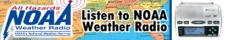](https://noaaweatherradio.org/)

Scanner Pages: [Here](http://incidentpage.net/)  / [Here](https://www.broadcastify.com/)
NOAA Tropics Audio [Outlook](https://www.weather.gov/media/mfl/nwr/MIATWOAT.mp3):

Your browser does not support the audio element.

  

Get Mikes APP on
[Apple](https://itunes.apple.com/us/app/mikes-weather-page/id1211775645?mt=8) &
[Android](https://play.google.com/store/apps/details?id=com.app.mikesweatherpagea) Devices:

     
Become
a
MWP [Supporter](https://spaghettimodels.com/support.htm) and Get Perks:

  
 

**CURRENT WEATHER IMAGES/LINKS:**

Great Links from [UW-Madison CIMSS](https://cimss.ssec.wisc.edu/)

[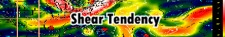](http://tropic.ssec.wisc.edu/real-time/atlantic/winds/wg8sht.GIF)

[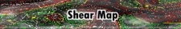](http://tropic.ssec.wisc.edu/real-time/atlantic/winds/wg8shr.GIF)

[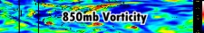](http://cimss.ssec.wisc.edu/tropic2/real-time/atlantic/winds/wg8vor.GIF)

[500mb
Vorticity](http://tropic.ssec.wisc.edu/real-time/atlantic/winds/wg8vor2.GIF) / [200mb
Vorticity](http://tropic.ssec.wisc.edu/real-time/atlantic/winds/wg8vor1.GIF)

[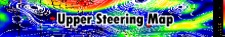](http://tropic.ssec.wisc.edu/real-time/atlantic/winds/wg8dlm5-1.GIF)
Sea Surface Temps:

[Live Water Temps](https://www.ncei.noaa.gov/access/coastal-water-temperature-guide/all_table.html)

[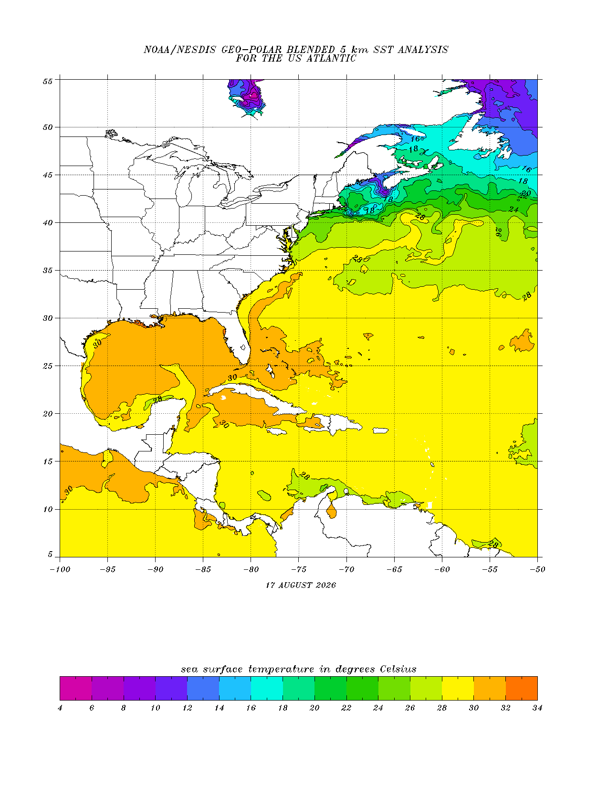](http://www.ospo.noaa.gov/data/sst/contour/usatlant.fc.gif)

[El
Nino La Nina Page](http://www.cpc.ncep.noaa.gov/products/precip/CWlink/MJO/enso.shtml)

/ [What
They Effect](https://www.stormgeo.com/assets/Uploads/el-nino-la-nina-influence2.png)

[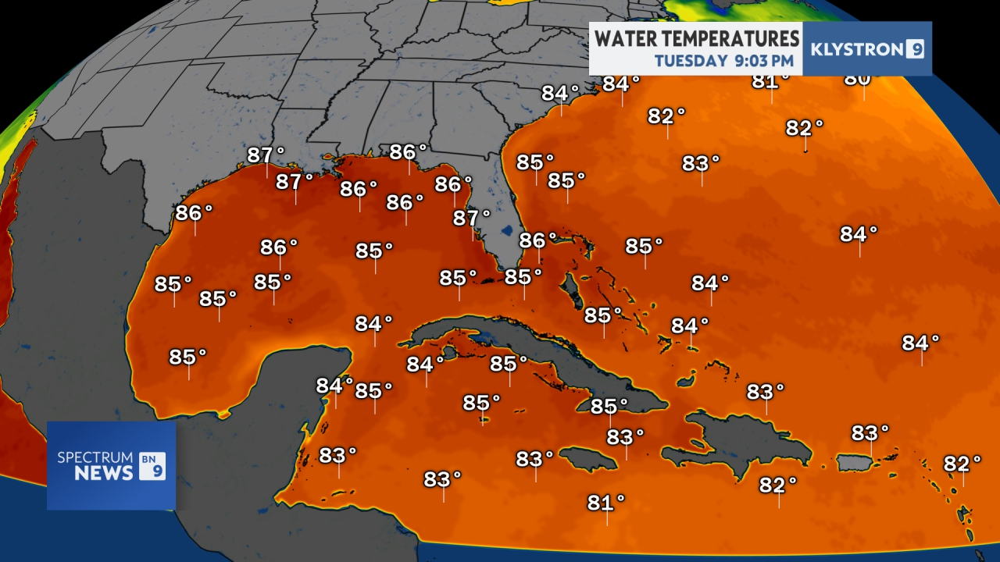](https://baynews9.com/fl/tampa/weather/tropical.map.html/HurricaneIndex#Water_Temperatures-WX) **Tropics
generally need 80F 27C**
Tropical Cyclone Heat Potential:
**[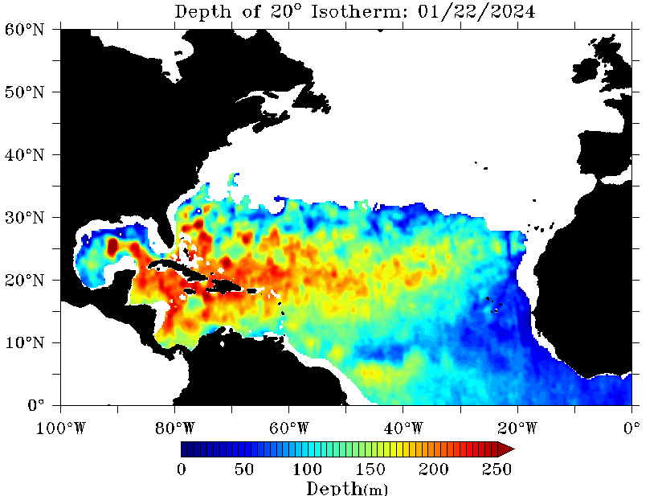](https://www.ospo.noaa.gov/Products/ocean/ohc/)**
Sea Surface Temp Anomaly:
**[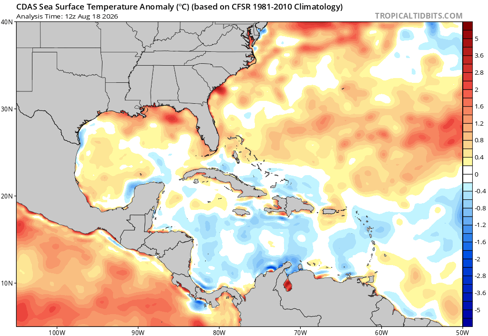](https://www.tropicaltidbits.com/analysis/ocean/)**

[NOAA Satellite
Anomoly Map](https://www.nnvl.noaa.gov/view/globaldata.html#SSTA)
Sea Surface 7-Day Temp Change:
**[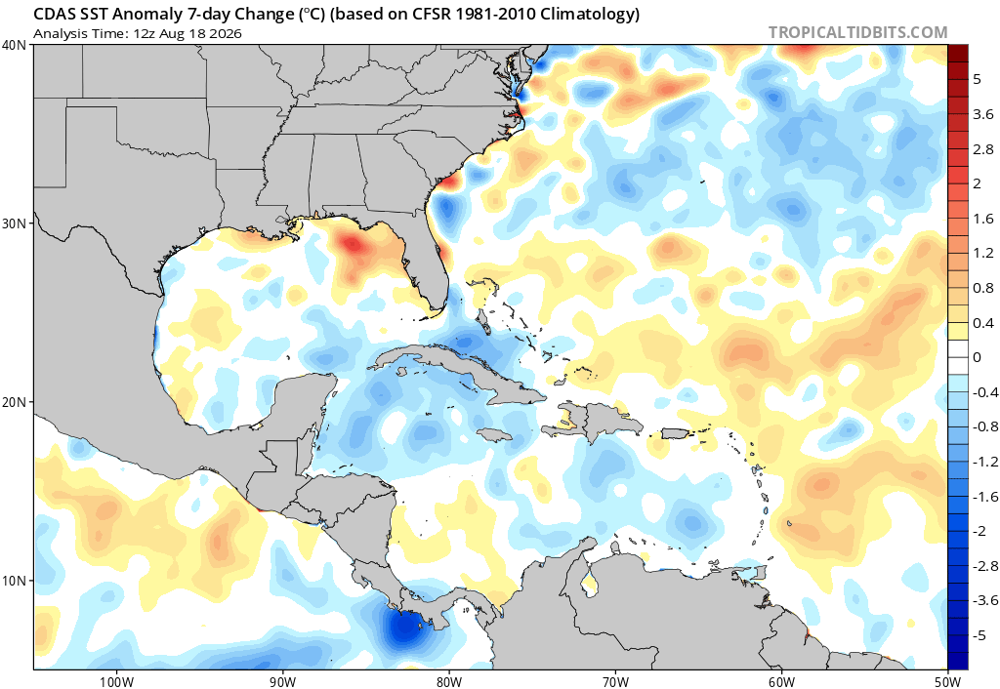](https://www.tropicaltidbits.com/analysis/ocean/)**
Wind Shear Map:
**[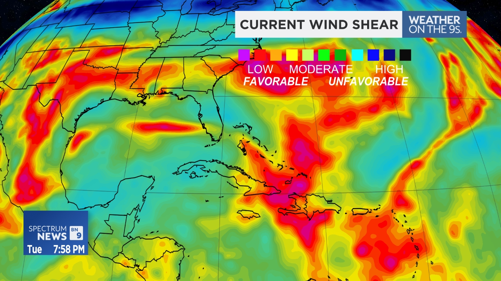](https://baynews9.com/fl/tampa/weather/tropical.map.html/HurricaneIndex#Wind_Shear-WX)**
Vertical Wind Shear:
**[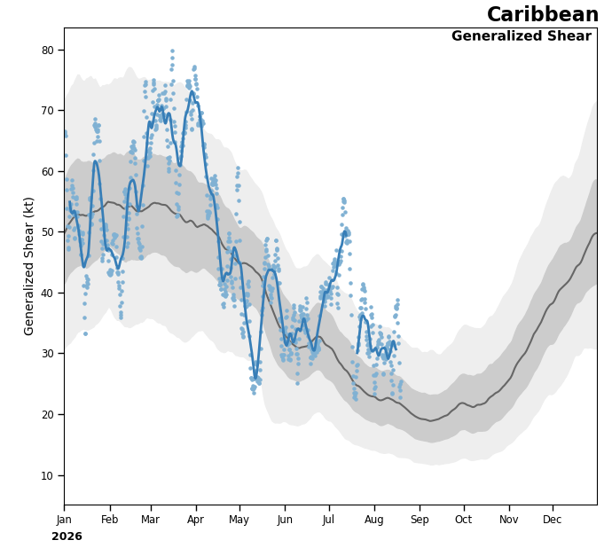](https://www.ospo.noaa.gov/Visualization01/cData/Ocean/Tropical/TCFP/images/ts_al_car_VSHD.png)**
[Current Lower Winds](http://tropic.ssec.wisc.edu/real-time/windmain.php?&basin=atlantic&sat=wg8&prod=ir&zoom=&time=) /
[Current Upper Winds](http://tropic.ssec.wisc.edu/real-time/windmain.php?&basin=atlantic&sat=wg8&prod=wvir&zoom=&time=)
 Airport Delays:
****
[Live
Flight Tracker Map](https://www.flightradar24.com/28.19,-97.2/4) /
[Echo Tops](https://www.turbulenceforecast.com/radar)
Jet Stream Pattern:
**[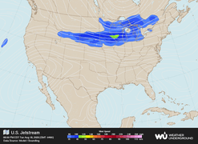](https://www.wunderground.com/maps/wind/jet-stream)**

[Jet Stream
Forecast](https://www.eldoradoweather.com/current/currentusjetstream.html)
/ [Jet Stream
Animation](https://www.netweather.tv/charts-and-data/global-jetstream#2019/03/15/0600Z/jetstream/surface/level/overlay=jetstream/orthographic=-91.33,43.10,712)

ASCAT/WindSAT Winds:
**[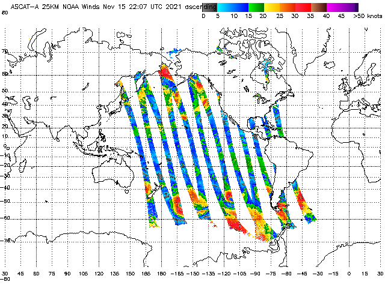](https://manati.star.nesdis.noaa.gov/datasets/ASCATBData.php)**
Current and Future WindAlert Winds:
**[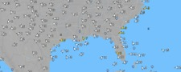](https://www.windalert.com/en-us/Search/ViewResults.aspx#30.78,-81.533,5,1)**
Current Winds of the Earth:
**[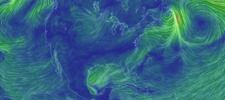](https://earth.nullschool.net/#current/wind/surface/level/orthographic=-71.66,28.89,1196)**

[See Your WINDS](http://hint.fm/wind/)
MJO Forecast:
**[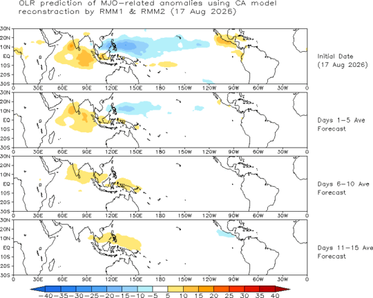](https://www.cpc.ncep.noaa.gov/products/precip/CWlink/MJO/spatial_olrmap_CA_full.gif)**

[CPC
MJO Page](https://www.cpc.ncep.noaa.gov/products/precip/CWlink/MJO/mjo.shtml)
Saharan Air Layer:

[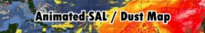](http://tropic.ssec.wisc.edu/real-time/sal/g16split/movies/goes16split.html)
**[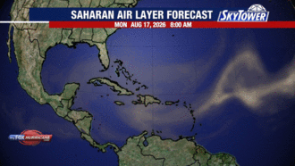](https://www.myfoxhurricane.com/saharan_dust_car.html)**

[SAL
Map](https://earth.nullschool.net/?fbclid=IwAR3TpOYLPvc3OdtO1RkIGGk0x_ZFnbZOAqFKglcMwbl7fmQTc8tbRHAWbY8#current/particulates/surface/level/overlay=duexttau/orthographic=-41.34,18.21,1032)
/ [True
Color SAL](http://tropic.ssec.wisc.edu/real-time/sal/truecol-8.jpg)
Current Lightning Strikes:
****

[Lightning History](https://weather.us/lightning/usa)

River Forecasts & Observations:
**[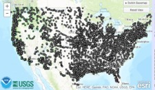](https://water.noaa.gov/)**
Buoy Data:
**[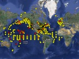](http://www.ndbc.noaa.gov/)**
**[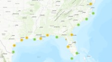](https://tidesandcurrents.noaa.gov/map/index.html?region=Florida)**

[Gulf
Surge](https://slosh.nws.noaa.gov/etsurge/index.php?page=map&region=gm&datum=msl&list=gm&map=0-48&type=both&stn=) 
CERA Coastal Storm Surge Map:
[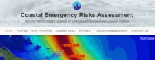](https://cera.coastalrisk.live/)

[Surge
Map](https://www.nws.noaa.gov/mdl/etsurge/index.php)
/ [Surge
Potential](https://coast.noaa.gov/floodexposure/#-8281882,3642082,5z)
/ [Storm
Surge?](https://www.nhc.noaa.gov/surge/surge_intro.pdf)
Forecast Wave Heights:
**[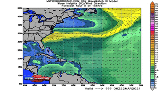](https://www.myfoxhurricane.com/ww3_sigwave_atl.html)**

[NOAA Graphical Analysis](https://ocean.weather.gov/Atl_tab.php)
Current Wave Heights:
**[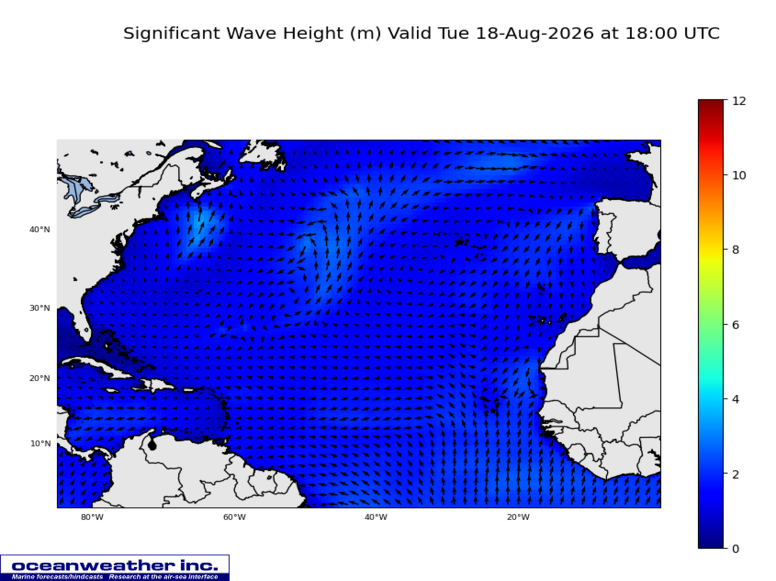](http://www.stormsurfing.com/cgi/display.cgi?a=eus_height)**
[Surf Forecast](https://www.surf-forecast.com/weather_maps/United-States?type=htsgw&&over=none&)
/ [Red
Tide](https://myfwc.com/research/redtide/statewide/)
/ [Red
Tide Zoom](https://myfwc.maps.arcgis.com/apps/View/index.html?appid=87162eec3eb846218cec711d16462a72)
****
[Wave Maps](http://www.stormsurfing.com/cgi/display.cgi?a=natla_height)
/ [Gulf
Waves](http://www.stormsurfing.com/cgi/display.cgi?a=gom_height)
/ [Caribbean
Waves](http://www.stormsurfing.com/cgi/display.cgi?a=carib_height)
Ocean Currents:
**[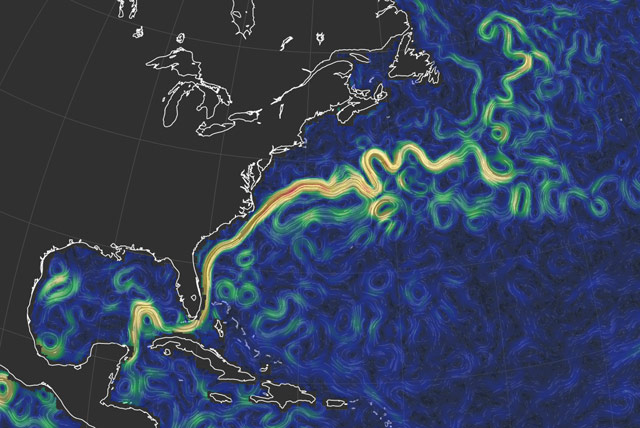](https://earth.nullschool.net/#current/ocean/surface/currents/orthographic=-75.38,28.43,1186)**

[Influence of Ocean Currents](https://oceanblueproject.org/ocean-current-map/?fbclid=IwAR0Zlzuled0mZRKPobNYeIf98FnRE1RsxcXDD9R11EomXCJ7kmphfMvnVpI)
[Live Marine Traffic Map](https://www.marinetraffic.com/en/ais/home/centerx:-46.8/centery:21.7/zoom:4.693091408012989)
/ [Wave
Watch Model](http://polar.ncep.noaa.gov/waves/viewer.shtml?-multi_1-latest-US_eastcoast-tp_sw1-)
NOAA Marine Forecasts by Regions:
[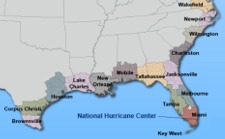](https://www.weather.gov/marine/)
[U.S.
Coastal Tide Charts](https://tidesandcurrents.noaa.gov/)
/ [Tideschart.com](https://www.tideschart.com/?na)
Saffir-Simpson Hurricane Scale:

[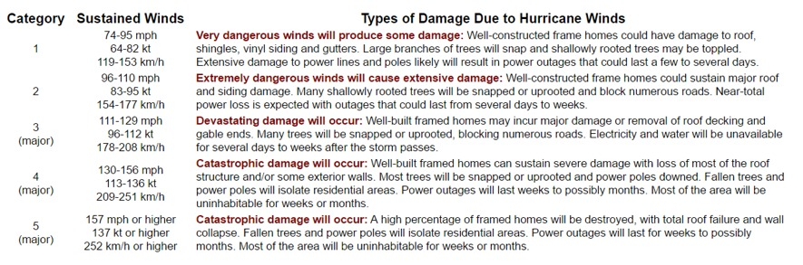](http://spaghettimodels.com/images/Saffir-Simpson.jpg)

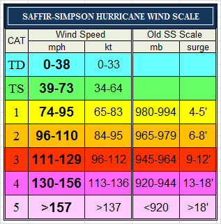

[Beaufort Wind
Scale](http://www.spaghettimodels.com/images/BeaufortScale.jpg)

dBZ Scale from Radar:
[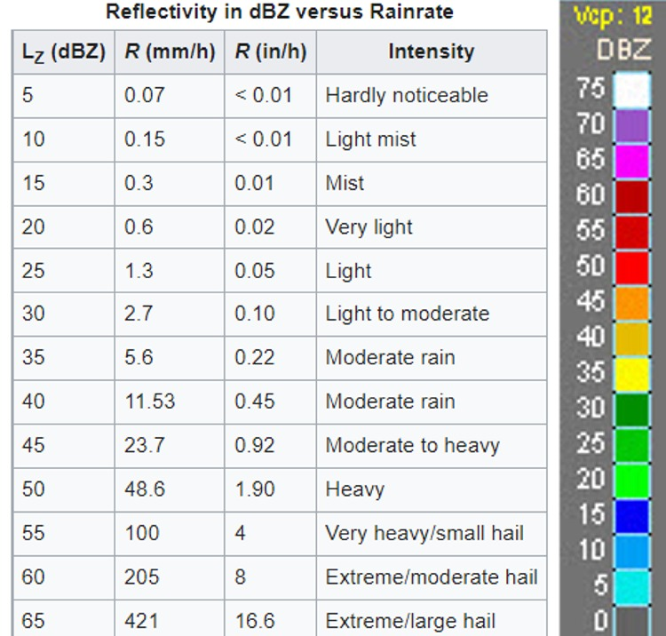](http://spaghettimodels.com/images/dbz.jpg)
LIVE Earthquake Page:
[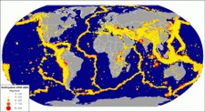](https://earthquaketrack.com/recent)

[24-Hour Quake Map](https://earthquake.usgs.gov/earthquakes/map/#%7B%22autoUpdate%22%3A%5B%22autoUpdate%22%5D%2C%22basemap%22%3A%22grayscale%22%2C%22feed%22%3A%221day_m25%22%2C%22listFormat%22%3A%22default%22%2C%22mapposition%22%3A%5B%5B10.487811882056695%2C-151.259765625%5D%2C%5B58.58543569119917%2C-38.759765625%5D%5D%2C%22overlays%22%3A%5B%22plates%22%5D%2C%22restrictListToMap%22%3A%5B%22restrictListToMap%22%5D%2C%22search%22%3Anull%2C%22sort%22%3A%22newest%22%2C%22timezone%22%3A%22utc%22%2C%22viewModes%22%3A%5B%22list%22%2C%22map%22%5D%2C%22event%22%3Anull%7D)
 / [tsunami.gov](https://tsunami.gov/)
US Drought Monitor:
[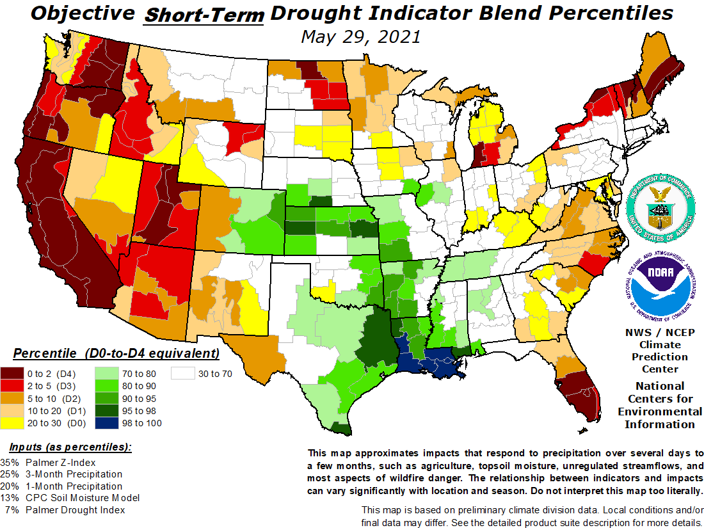](https://droughtmonitor.unl.edu/)
US Wildfire Potential:
[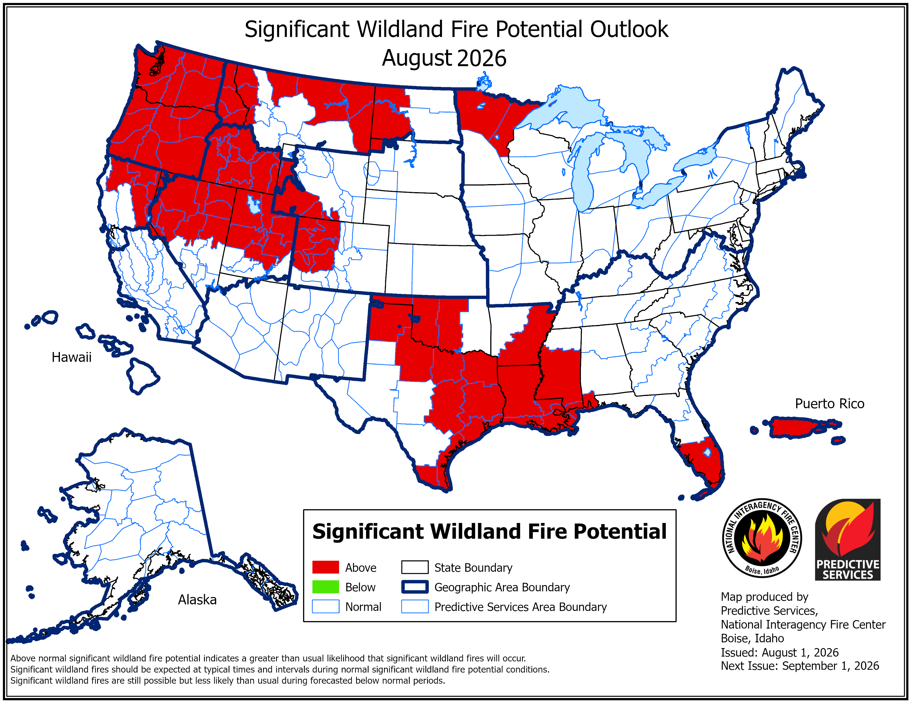](https://www.nifc.gov/nicc-files/predictive/outlooks/month1_outlook.png)

[Fire Map](https://mapofire.com/?utm_campaign=mapofire&utm_source=mapotechnology.com&utm_medium=header&_gl=1*1fh0pgx*_ga*NTA0NTMwNjQ3LjE3NzE5Mzk1NTg.*_ga_J2PB456CE6*czE3NzI3MTUzNjkkbzMkZzEkdDE3NzI3MTUzNzMkajU2JGwwJGgw#5/28.76/-85.57)
 / [Smoke
Map](https://fire.airnow.gov/)
 / [Fire
Outlook](https://www.nifc.gov/nicc/predictive-services/outlooks)
UV Index Forecast:
[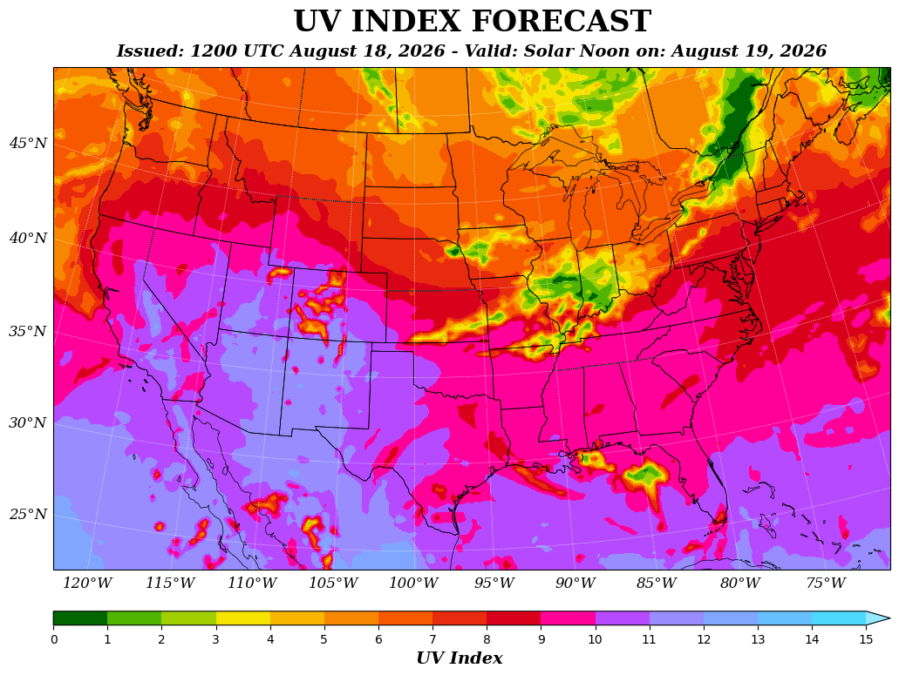](https://www.cpc.ncep.noaa.gov/products/stratosphere/uv_index/gif_files/uvi_usa_f1_wmo.gif)

[Air Quality Map](https://gispub.epa.gov/airnow/?showgreencontours=false)
 / [Air
Pollution Map](https://aqicn.org/map/usa/)

Get 10% off a Tempest Station:

  

   

**WATCH
'THE DAILY BREW':**

MWP
[YouTube
Channel](https://www.youtube.com/c/mikesweatherpage)

Next DAILY BREW Wednesday 8/19 9:19am ET

**ATLANTIC /
GULF TROPICAL MAPS:**

[Super Duper Zoomed](https://cdn.star.nesdis.noaa.gov/GOES16/ABI/SECTOR/taw/Sandwich/7200x4320.jpg)

[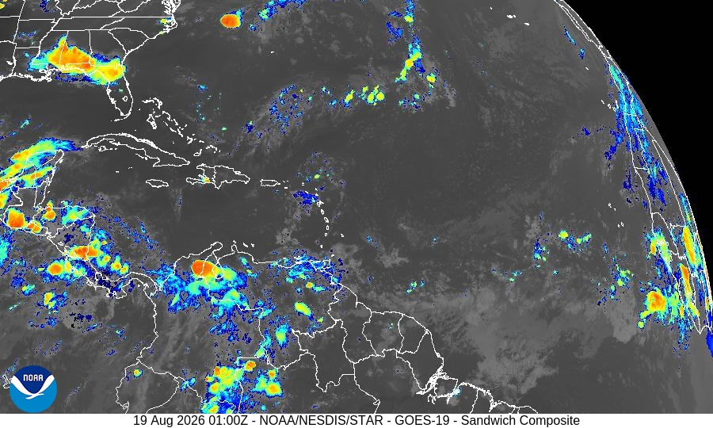](https://cdn.star.nesdis.noaa.gov/GOES19/ABI/SECTOR/taw/Sandwich/GOES19-TAW-Sandwich-900x540.gif)

[GOES-East](https://www.star.nesdis.noaa.gov/GOES/index.php)
/ [Floaters](https://www.nhc.noaa.gov/satellite.php?) /
[7-Day Past Satellite](https://www.iweathernet.com/satellite-images-and-loops/fast-7-day-satellite-loop) /
[Goes-West](https://www.star.nesdis.noaa.gov/goes/fulldisk.php?sat=G17)

[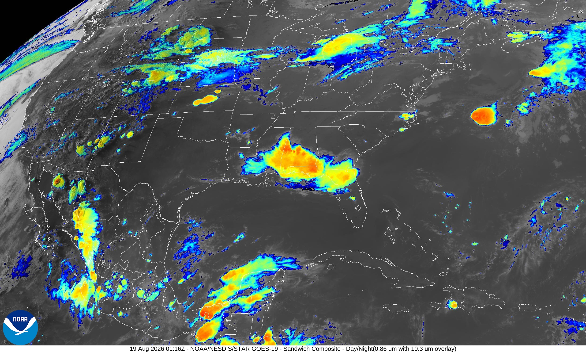](https://cdn.star.nesdis.noaa.gov/GOES19/ABI/CONUS/Sandwich/GOES19-CONUS-Sandwich-625x375.gif)
[Satellite Loop Detailed](http://www.atmos.washington.edu/~ovens/loops/wxloop.cgi?wv_east_enhanced+12) /
[DuPage GOES
Page](http://weather.cod.edu/satrad/exper/)

[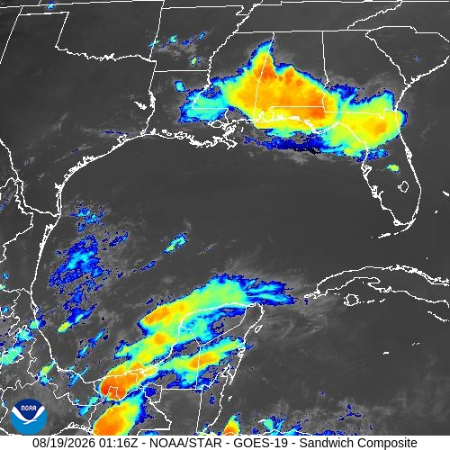](https://cdn.star.nesdis.noaa.gov/GOES19/ABI/SECTOR/ga/Sandwich/GOES19-GA-Sandwich-1000x1000.gif)
[Caribbean Weather
Page](https://caribbeanweather.org/) /

[Atlantic Radars](http://tropicalatlantic.com/radars/)

[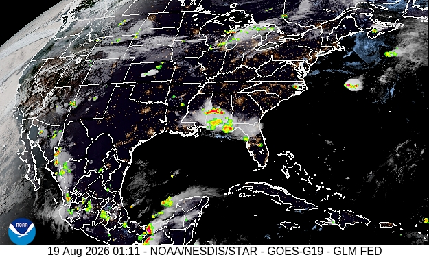](https://cdn.star.nesdis.noaa.gov/GOES19/GLM/CONUS/EXTENT3/GOES19-CONUS-EXTENT3-625x375.gif)
Water Vapor Loop:

[DuPage
GOES Viewer](http://weather.cod.edu/satrad/exper/) / [Great
IR Page](https://weather.cod.edu/satrad/?parms=continental-southconus-13-24-0-100-1&checked=map&colorbar=data)
/ [Bobbi's](https://weather.cod.edu/satrad/?parms=continental-southconus-13-24-0-100-1&checked=map&colorbar=data)
Current Wind and Wave Analysis:

[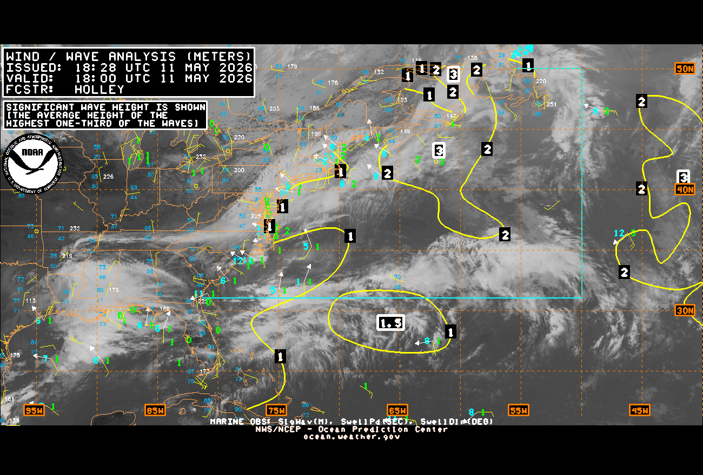](https://ocean.weather.gov/shtml/ira1.gif)

Africa
/ Hawaii Satellites:

[Canada Weather](https://weather.gc.ca/) /
[Africa Water Vapor](https://www.ssd.noaa.gov/eumet/eatl/wv-l.jpg)

Current Surface Analysis:

[Gulf Surface](https://www.nhc.noaa.gov/tafb_latest/GULF_latest.gif)
/ [Caribbean](https://www.nhc.noaa.gov/tafb_latest/CAR_latest.gif)
/ [Atlantic
#1](https://www.nhc.noaa.gov/tafb_latest/USA_latest.gif)
/ [Atlantic
#2](https://ocean.weather.gov/UA/Atl_Tropics.gif)

[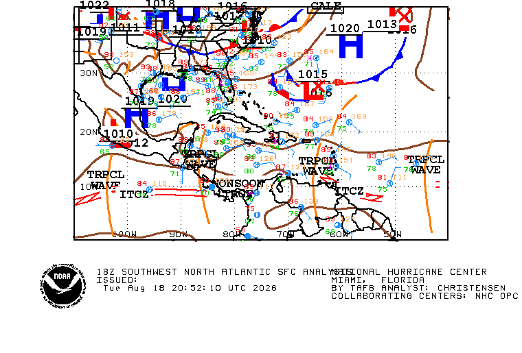](https://www.nhc.noaa.gov/tafb_latest/WATL_latest.gif)

[Surface Chart Symbols](http://spaghettimodels.com/images/SurfaceCharts.jpeg)

Tomorrow's NHC Forecast Map:

[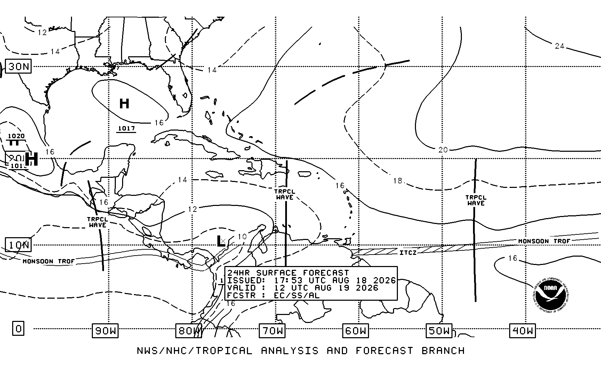](http://www.nhc.noaa.gov/tafb_latest/atlsfc24_latestBW.gif)
48-Hour NHC Forecast Map:

[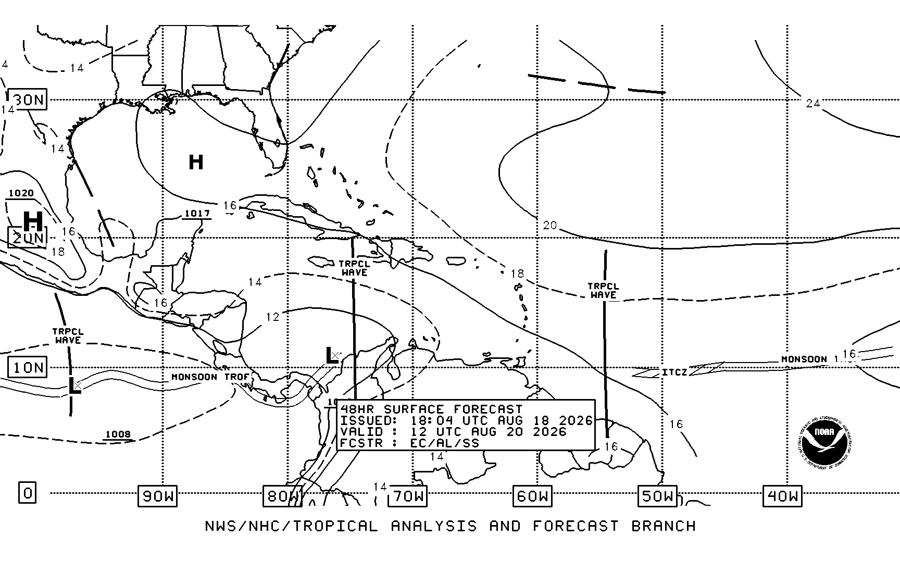](https://www.nhc.noaa.gov/tafb_latest/atlsfc48_latestBW.gif)
72-Hour NHC Forecast Map:

[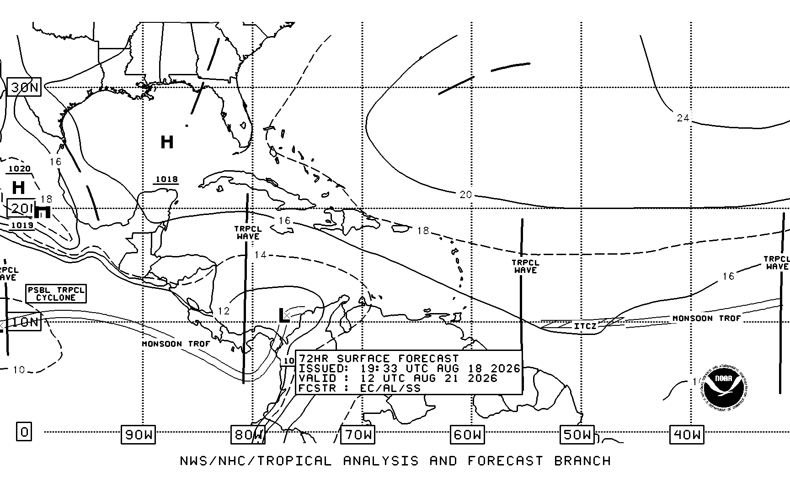](http://www.nhc.noaa.gov/tafb_latest/atlsfc72_latestBW.gif)
Precipitable Water Maps:

[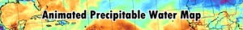](http://tropic.ssec.wisc.edu/real-time/mtpw2/product.php?color_type=tpw_nrl_colors&prod=natl&timespan=120hrs&anim=anigf)

[Super Duper COOL Animation](http://tropic.ssec.wisc.edu/real-time/mtpw2/product.php?color_type=tpw_nrl_colors&prod=natl&timespan=120hrs&anim=anigf)

[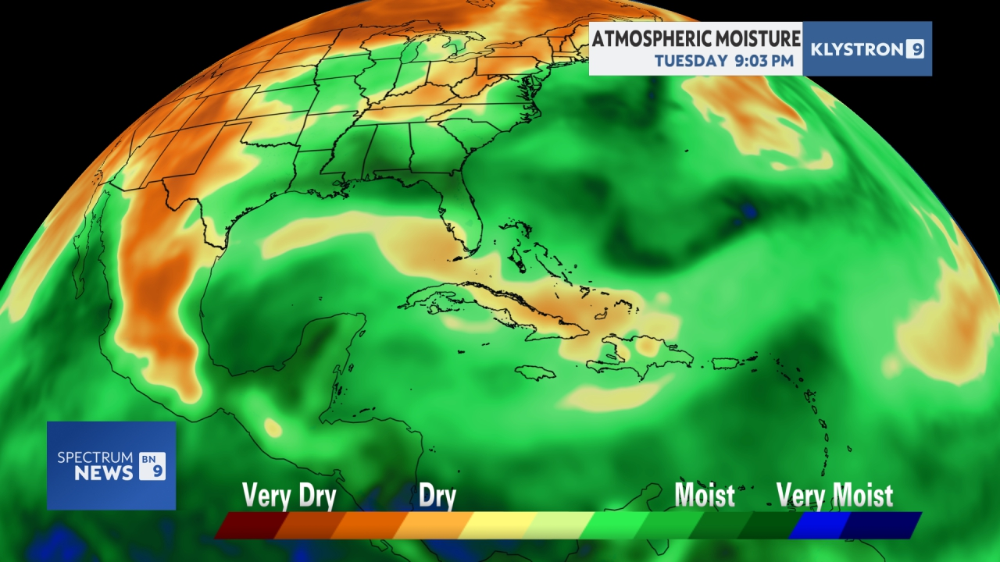](https://baynews9.com/fl/tampa/weather/tropical.map.html/HurricaneIndex#Precipitable_Water-WX)
[Baron Hurricane Index](http://www.worldwindsinc.com/bhi.htm) / [Maximum
Hurricane Intensity](http://wxmaps.org/pix/hurpot?fbclid=IwAR0dhrprNL11Pd_V0ZIOTmyigsQCO8ZFj-H3q-6292z0CRd0SAQWHa1lwgI)

[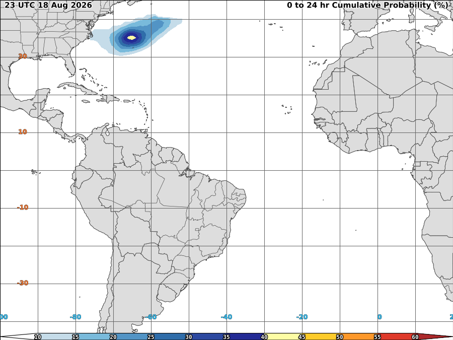](https://www.ospo.noaa.gov/Visualization01/cData/Ocean/Tropical/TCFP/images/al_rCUMP_024.png)[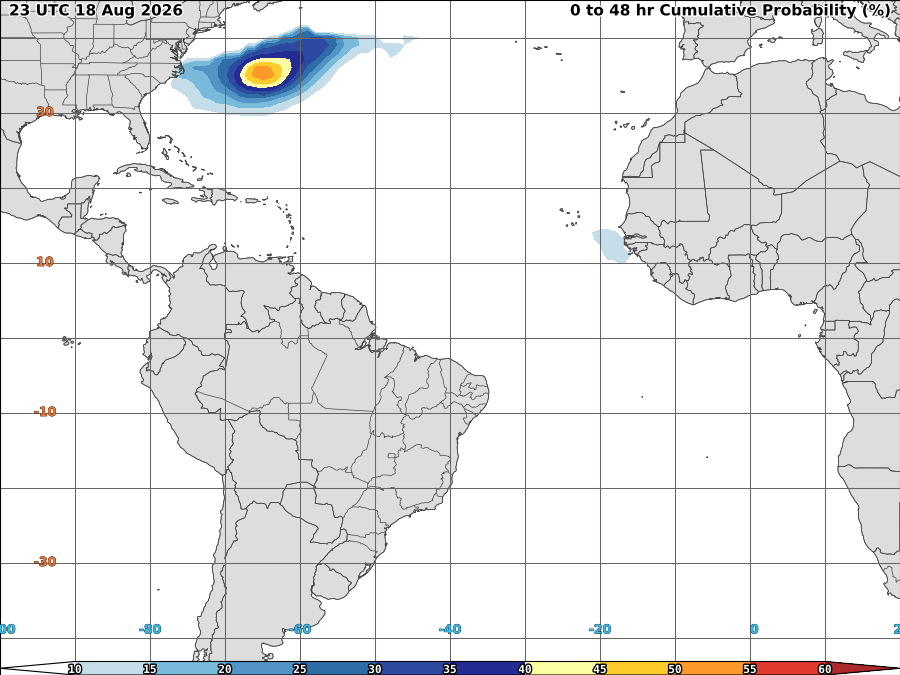](https://www.ospo.noaa.gov/Visualization01/cData/Ocean/Tropical/TCFP/images/al_rCUMP_048.png)
[East
Pacific Probabilities](http://www.ssd.noaa.gov/PS/TROP/TCFP/east_pacific.html) / [Global
Weekly Satellite](https://www.ssec.wisc.edu/data/composites/satsfctemp/animation/)
Vertical Shear and Instability:

[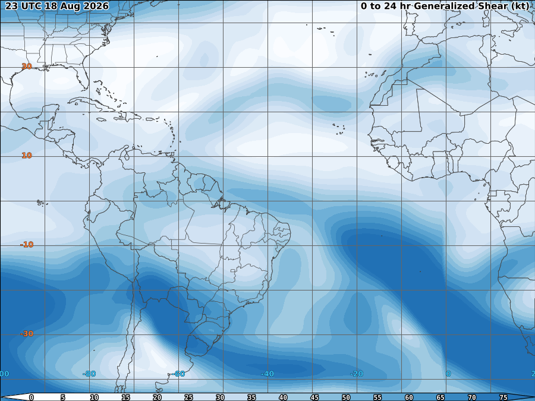](https://www.ospo.noaa.gov/Visualization01/cData/Ocean/Tropical/TCFP/images/al_rVSHD_024.png)[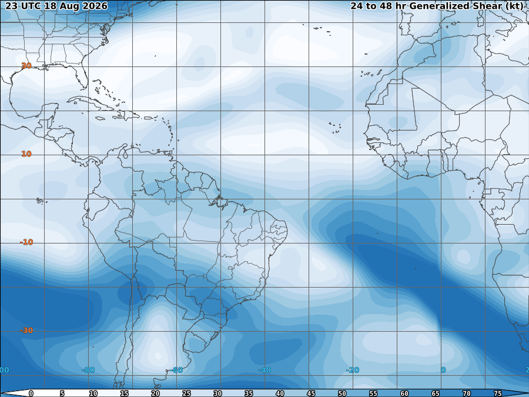](https://www.ospo.noaa.gov/Visualization01/cData/Ocean/Tropical/TCFP/images/al_rVSHD_048.png)

[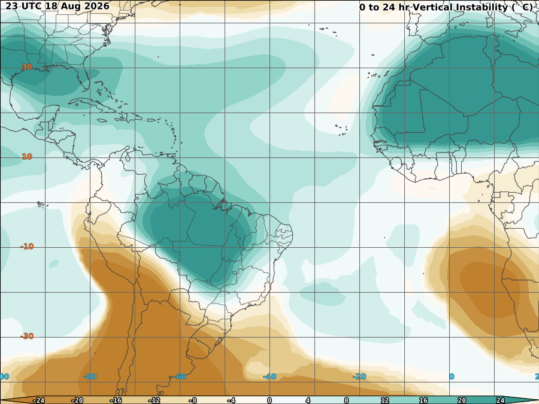](https://www.ospo.noaa.gov/Visualization01/cData/Ocean/Tropical/TCFP/images/al_rTHDV_024.png)[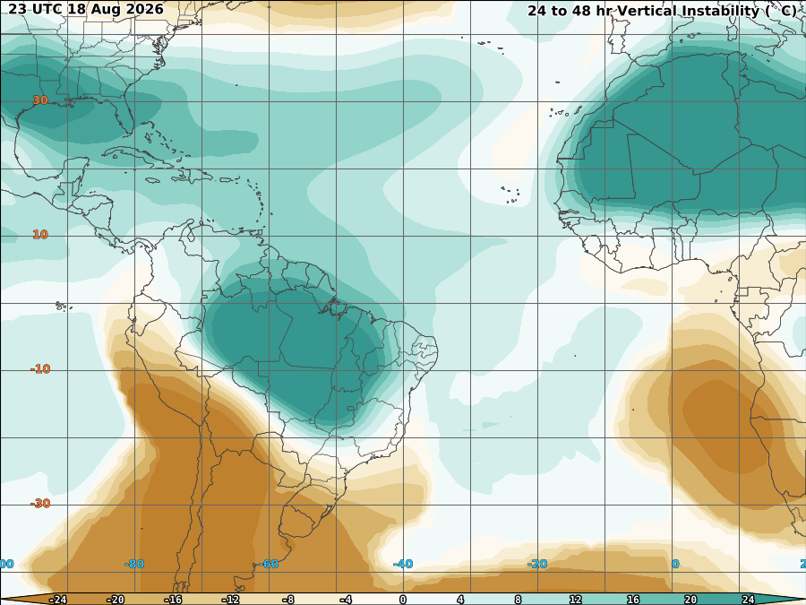](https://www.ospo.noaa.gov/Visualization01/cData/Ocean/Tropical/TCFP/images/al_rTHDV_048.png)

[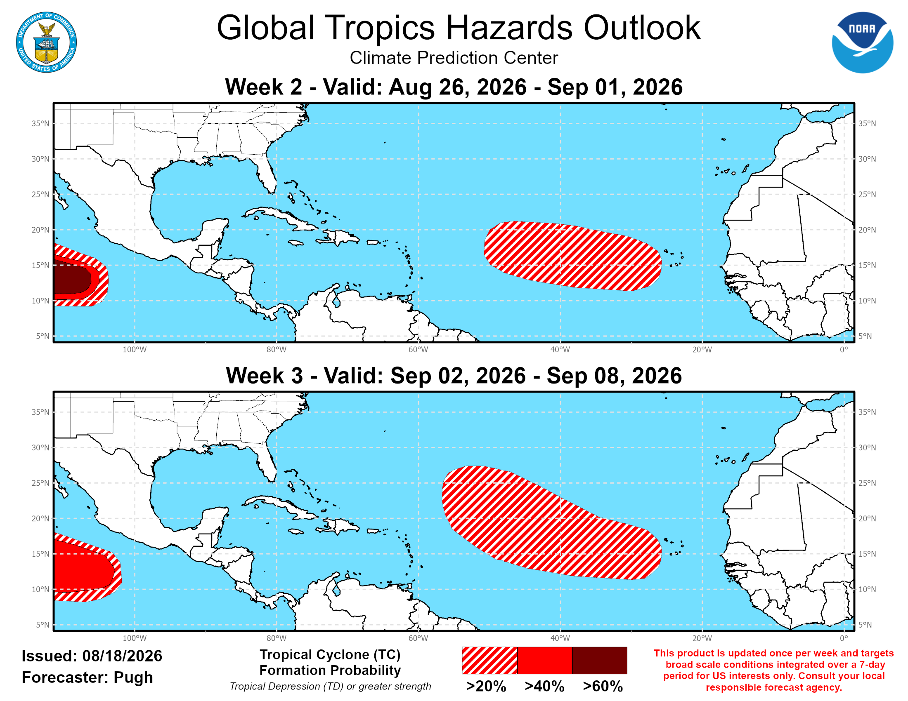](https://www.cpc.ncep.noaa.gov/products/precip/CWlink/ghaz/gth_full_TConly_ATL.png)
[CPC Prediction Outlooks](https://www.cpc.ncep.noaa.gov/) /
[Interactive Hazards](https://www.cpc.ncep.noaa.gov/products/predictions/threats/threats.php)

ENSO El Nino
La Nina Outlook:

[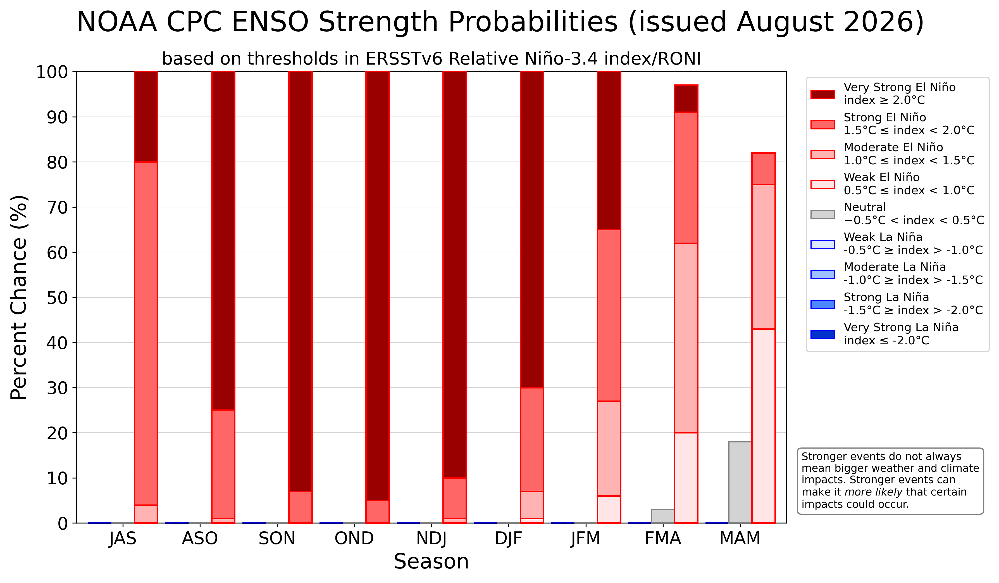](https://pbs.twimg.com/media/HPdvL8LXYAAO5kF?format=png&name=4096x4096)

The 2025 Season:

[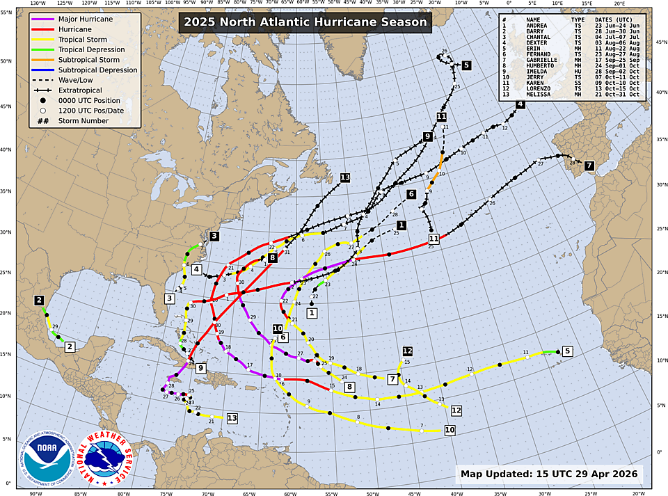](https://www.nhc.noaa.gov/data/tcr/track_maps/atl_season_2025_sm.png)

[Past
Hurricane Seasons](https://www.nhc.noaa.gov/data/tcr/index.php)
General Estimate of Tropical System Timing:
  

Hurricane Categories with Potential Damages:

[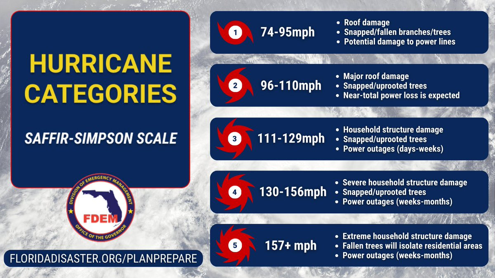](https://pbs.twimg.com/media/G0lqdAEXsAAGvHs?format=jpg&name=medium)
  

**SEE YOUR LOCAL
NWS FORECAST:**

Enter your location by city or
zip:
  
 

[NWS Forecast Points](https://www.weather.gov/forecastpoints?lat=27.968&lon=-82.476&clat=27.968&clon=-82.476&zoom=22.0&basemap=openstreetmap&bbox=-19719439,1706091,-1372338,10673494&layers=RangeRings,USStates,ForecastPointPolygon,ForecastPoint,Domain,&obs=ttffffft&countyNames=f)
/ [City Forecast+](https://www.weather.city)

**NHC OUTLOOKS:**

Official 2-day NHC Outlook:
[NWS Hurricane Plan](https://www.weather.gov/safety/hurricane-plan)

[Prepare](https://www.weather.gov/wrn/hurricane-preparedness) / [What
is the Cone](https://www.nhc.noaa.gov/video/nhc_cone_usage.mp4)

[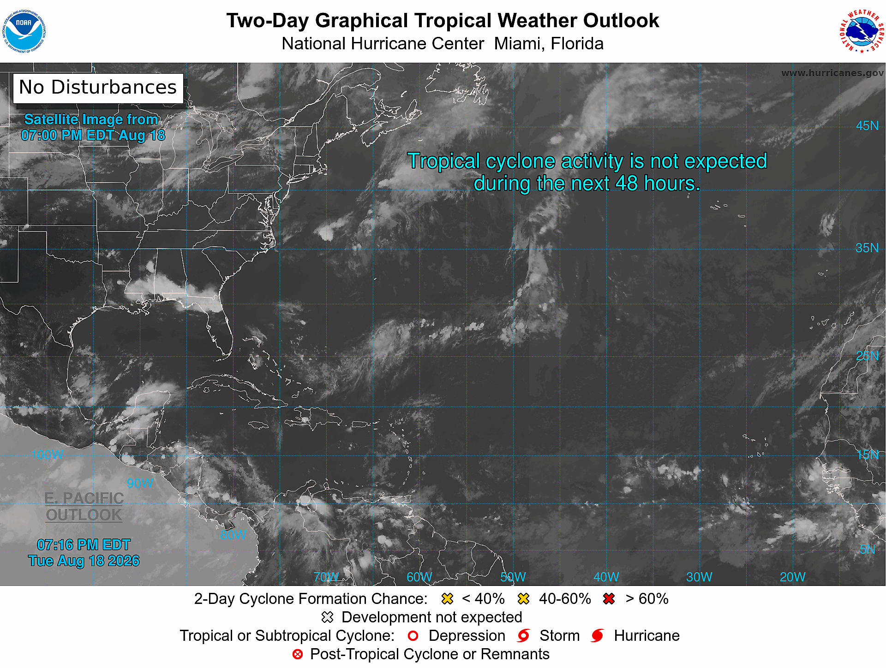](https://www.nhc.noaa.gov/gtwo.php?basin=atlc&fdays=2)
[Worldwide](http://www.wunderground.com/hurricane/)
/ [East
Pacific](http://www.nhc.noaa.gov/gtwo.php?basin=epac&fdays=2) /
[Central
Pacific](https://www.nhc.noaa.gov/gtwo.php?basin=cpac&fdays=2) / [Indian Ocean](https://www.cyclocane.com/tropical-storm-risk/)
Official 7-day NHC Outlook:
[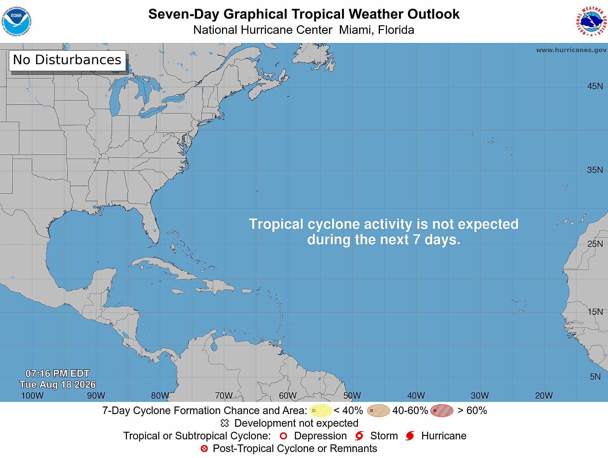](http://www.nhc.noaa.gov/gtwo.php?basin=atlc&fdays=5)
[EURO/CMC/GFS/UK Probability](http://moe.met.fsu.edu/modelgen/) / [5
Day Model Runs](https://moe.met.fsu.edu/modelgen/summary120al.php)

   

**NWS RADAR / RAIN MAPS:**

Current Radar:

[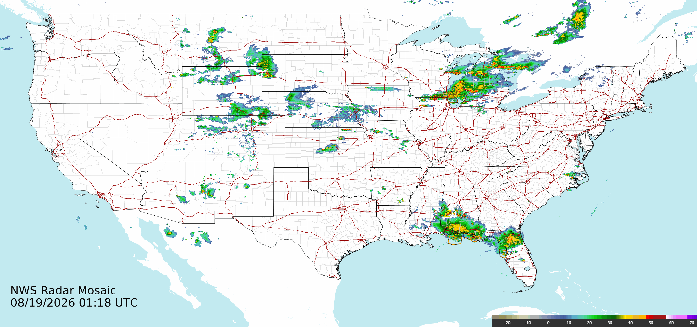](https://radar.weather.gov/)

[Google Radar](https://thurlowpa.com/FullScreenRadarStuartZoom7Statewide.html) /
[Satellite
Radar](https://www.accuweather.com/en/us/national/weather-radar) /

[MRMS Radar](https://mrms.nssl.noaa.gov/qvs/product_viewer/) /
[PWAT](https://www.spc.noaa.gov/exper/mesoanalysis/new/viewsector.php?sector=18&parm=pwtr)

[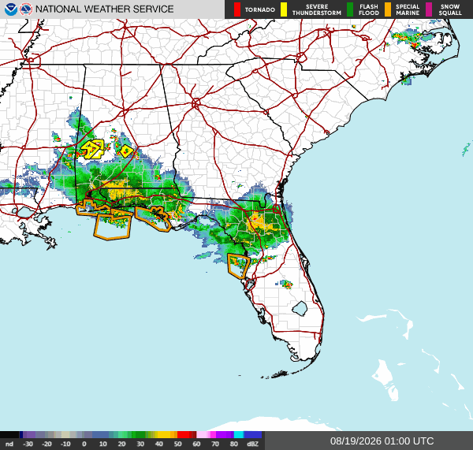](https://radar.weather.gov/ridge/standard/SOUTHEAST_loop.gif)

[All NWS Sites](https://radar.weather.gov/ridge/standard/) /
[Full
US Animated](https://radar.weather.gov/ridge/standard/CONUS-LARGE_loop.gif) /

[nowCOAST](https://nowcoast.noaa.gov/)

[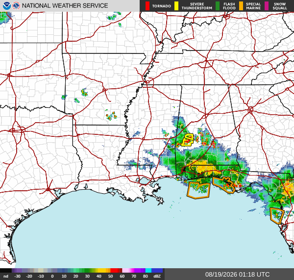](https://radar.weather.gov/ridge/standard/SOUTHMISSVLY_loop.gif)[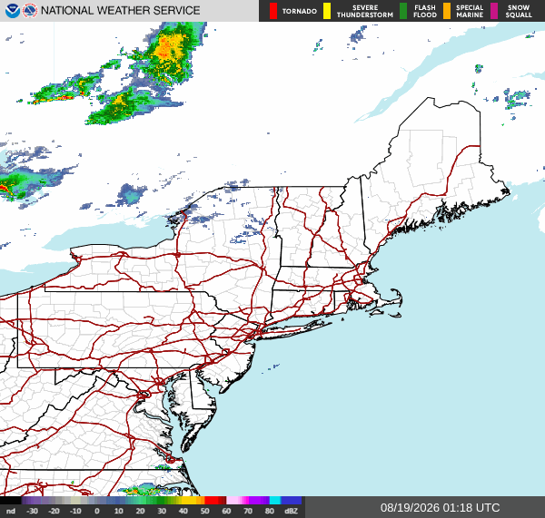](https://radar.weather.gov/ridge/standard/NORTHEAST_loop.gif)

[NWS Data Viewer](https://www.weather.gov/wrh/hazards) /

[Past Totals](http://agroclimate.org/tools/rainfall-and-temp-monitoring/) /

[FL Radar](https://www.sfwmd.gov/weather-radar/current-weather-conditions/florida-radar-extended-views) /

[SE Data](https://sercc.com/acis-precipitation-maps/)
   24-Hour Rain Forecast:          Next 5-Days Rain Forecast:
**[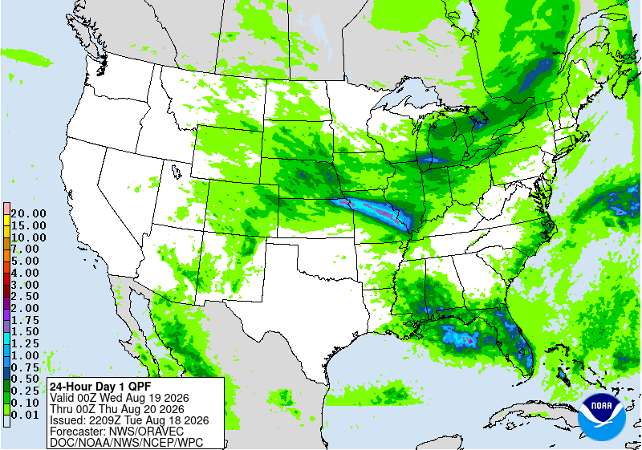](http://www.wpc.ncep.noaa.gov/qpf/fill_94qwbg.gif)[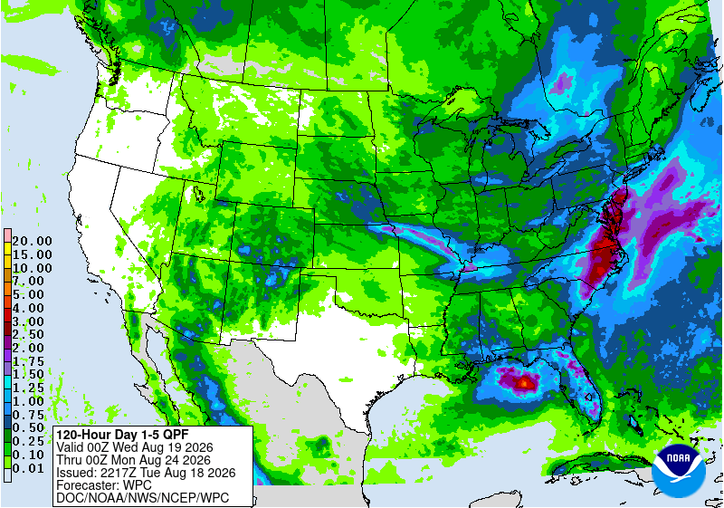](http://www.wpc.ncep.noaa.gov/qpf/p120i.gif)**

[QPF Page](http://www.wpc.ncep.noaa.gov/#page=qpf) /

[Day After Tomorrow Rain](http://www.wpc.ncep.noaa.gov/qpf/fill_98qwbg.gif) /

[7-Day Forecast](http://www.wpc.ncep.noaa.gov/qpf/p168i.gif)
Excessive Rain Outlooks

/ Today
and Tomorrow:

[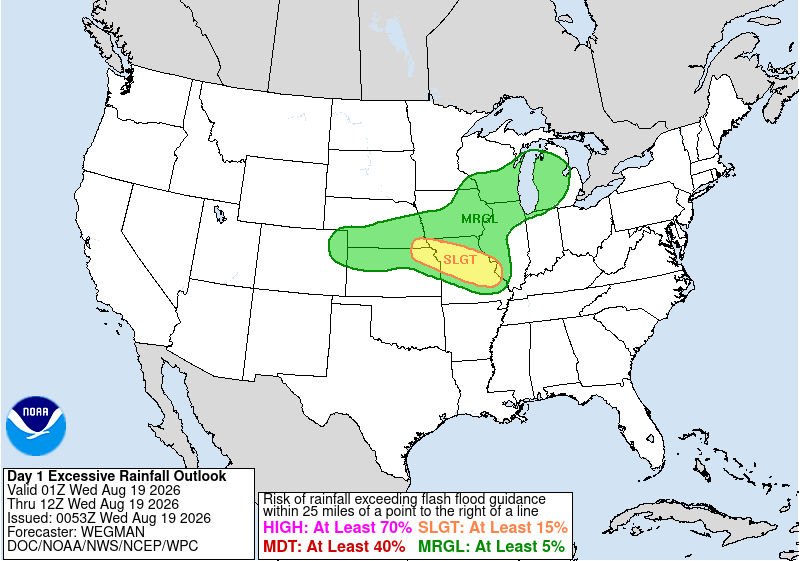](https://www.wpc.ncep.noaa.gov/qpf/94ewbg.gif)[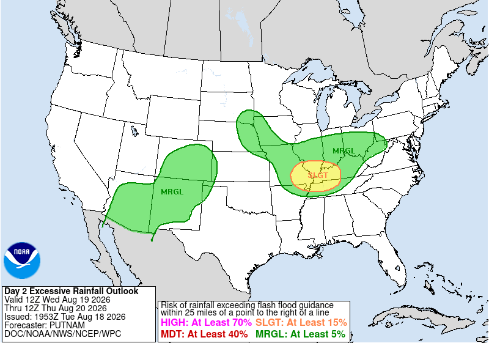](https://www.wpc.ncep.noaa.gov/qpf/98ewbg.gif)

Day after Tomorow and Day-4

[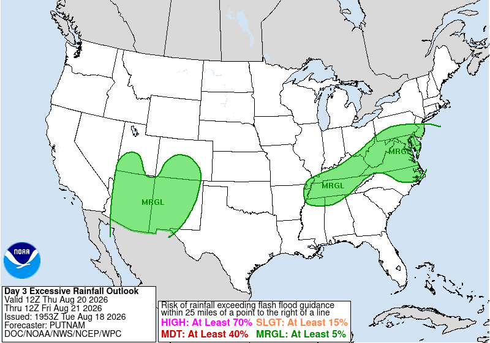](https://www.wpc.ncep.noaa.gov/qpf/99ewbg.gif)[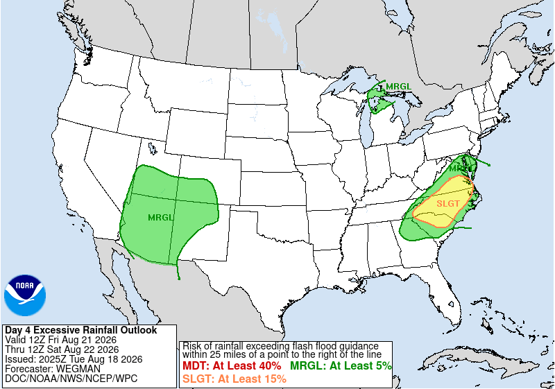](https://www.wpc.ncep.noaa.gov/qpf/ero_d45/images/d4wbg.gif)

[Excessive Rainfall WPC Page](https://www.wpc.ncep.noaa.gov/qpf/excessive_rainfall_outlook_ero.php)

 

**GENERAL WEATHER:**
Your Local NWS Alerts Map:

**Click map then
your area.**

[Critical
Weather Status](https://www.nco.ncep.noaa.gov/status/cwd/)

[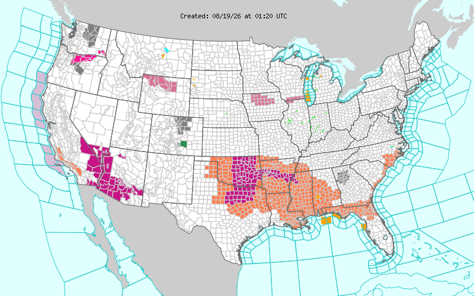](https://www.weather.gov/)
[NWS Colors Key](https://www.weather.gov/help-map)
 /
[Current Warnings](https://kamala.cod.edu/svr/)
 /
[Interactive](https://weatherology.com/maps-radar/alerts.html)
Current Tornado and Severe Thunderstorm Watches:

[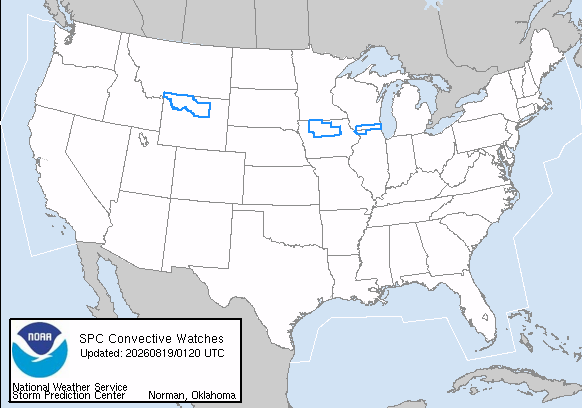](http://www.spc.noaa.gov/products/watch/)
SPC Storm Outlooks: 
[SPC Colors Key](http://www.spc.noaa.gov/new/images/Outlook-category-descriptions.png) / [Nadocast](https://twitter.com/nadocast)
[STORM OUTLOOK

](https://www.spc.noaa.gov/products/outlook/day1otlk.html)

[Storm Prediction Center](http://www.spc.noaa.gov/) / [Storm Chasers](https://www.iweathernet.com/thunderstorms/watch-storm-chasers-live-real-time-storm-cams) / [WPC](https://www.wpc.ncep.noaa.gov/#page=ovw)
Tomorrow's
Outlook:               
Day After Tomorrow:
**[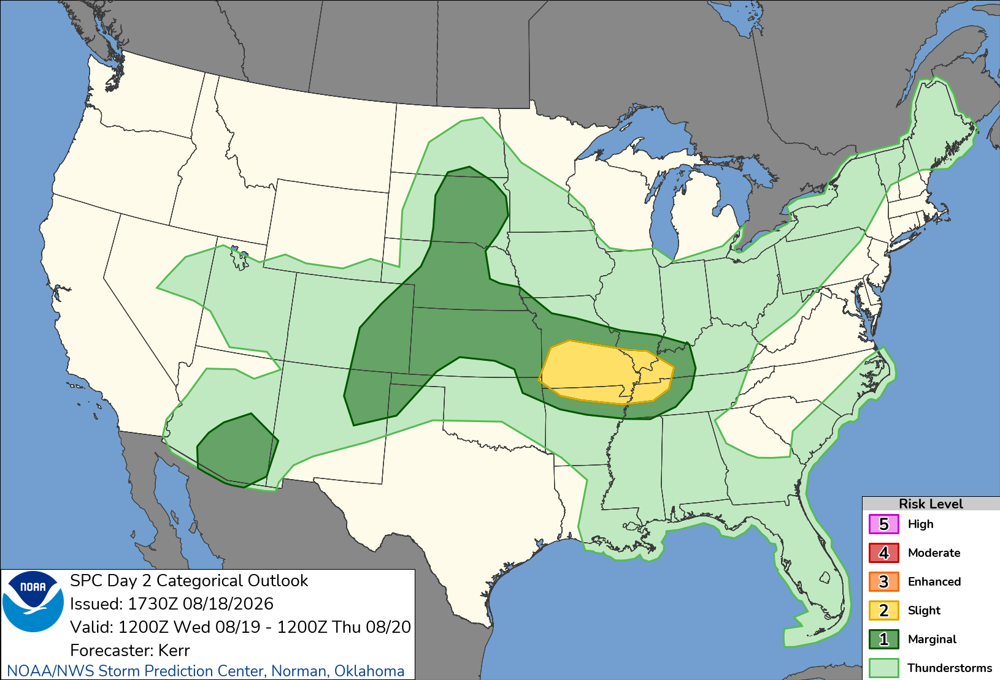](https://www.spc.noaa.gov/products/outlook/day2otlk.html)[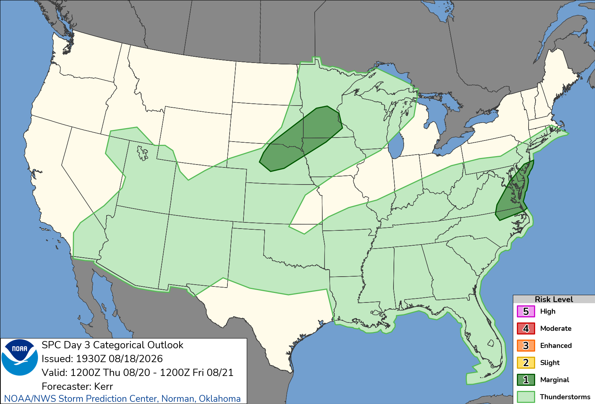](https://www.spc.noaa.gov/products/outlook/day3otlk.html)**

[CIPS Severe](http://www.eas.slu.edu/CIPS/SVRprob/SVRprob.php) / [CSU](https://schumacher.atmos.colostate.edu/hilla/csu_mlp/index.php) / [SPC
Detailed](https://www.spc.noaa.gov/partners/outlooks/) / [Lifted
Index](https://weather.us/model-charts/standard/lifted-index-surface.html)
Day 4-8 Storm Outlook:         
SPC Color Descriptions:
[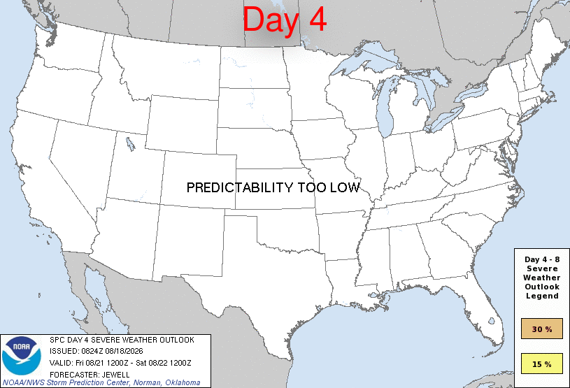](http://www.spc.noaa.gov/products/exper/day4-8/)**[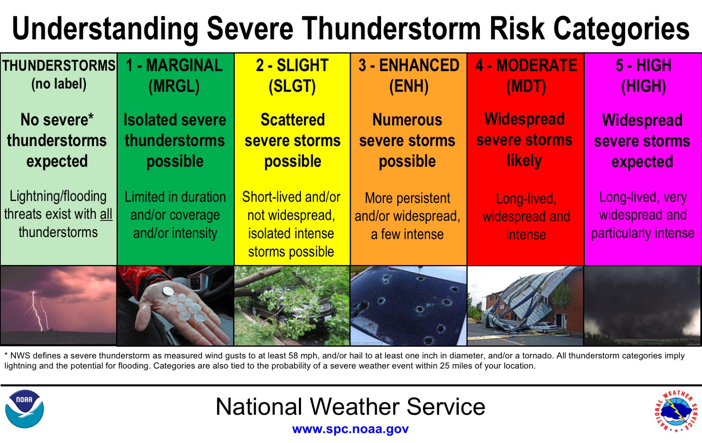](http://www.spc.noaa.gov/new/images/Outlook-category-descriptions.png)**
  Yesterdays Storm Reports:

 [Plot
Past Storm Data](https://mesonet.agron.iastate.edu/plotting/auto/?q=109) / [Tornado
Stats](https://www.tornadohq.com/) / [Florida
Tornadoes](https://www.tornadohq.com/)

[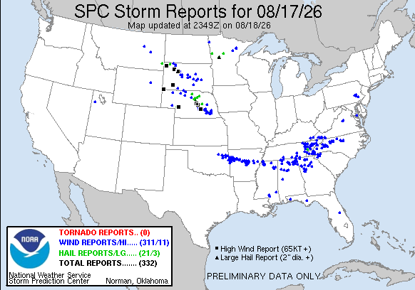](https://www.spc.noaa.gov/exper/archive/event.php)
  Day 3-7 Hazards Map:

[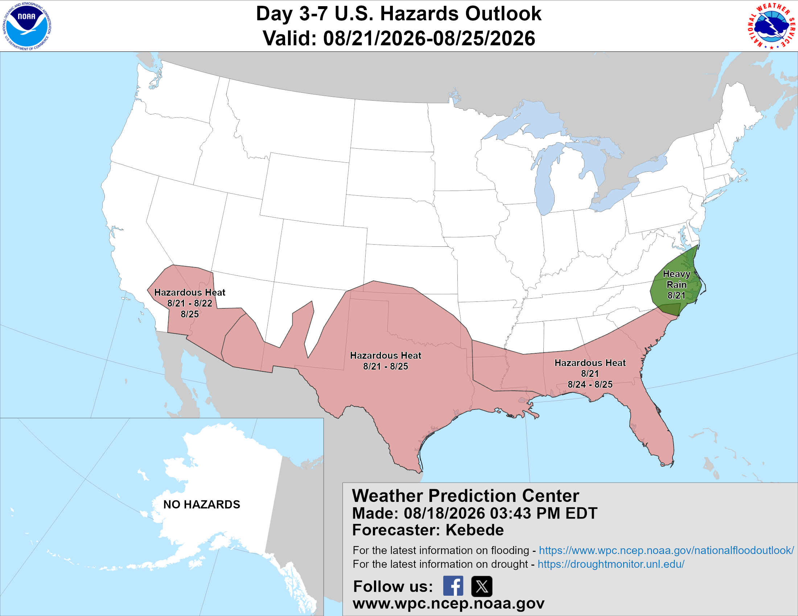](https://www.wpc.ncep.noaa.gov/threats/final/hazards_d3_7_contours.png)

[US Hazards
Outlook Page](https://www.wpc.ncep.noaa.gov/threats/threats.php) / [8-14
Day Outlook](https://www.cpc.ncep.noaa.gov/products/predictions/threats/threats.php)
Click Play for the EURO 10-Day
Forecast:

[Windy.com](https://www.windy.com/-Rain-thunder-rain?rain,28.401,-78.574,5,i:pressure)
 /
[Ventusky.com](https://www.ventusky.com/)
Current Power Outages:
 

[Full Page Outage Map](https://outage-pro.com)   

Current
Skycover:              
Wind Speed & Direction:

[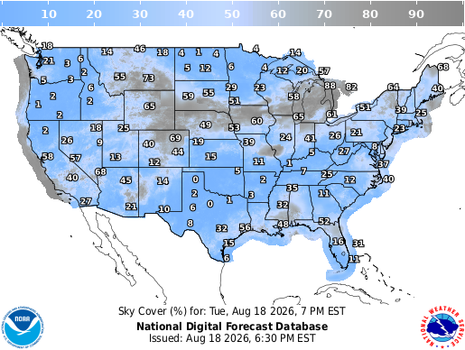](https://graphical.weather.gov/sectors/conus.php?element=Sky)[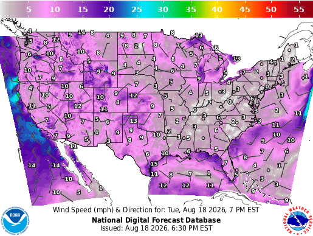](https://graphical.weather.gov/sectors/conus.php?element=WindSpd)
The Next Few Days Forecast:

[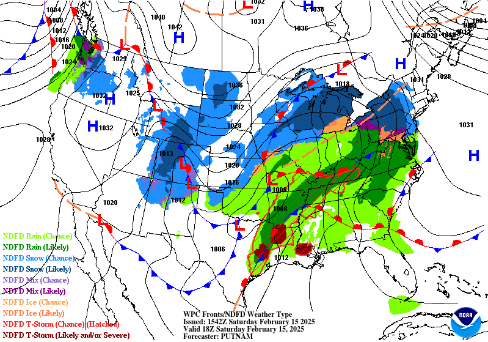](http://origin.wpc.ncep.noaa.gov/basicwx/allfcsts_loop_ndfd.gif)

[WPC Interactive Page Day 1-3](http://www.wpc.ncep.noaa.gov/basicwx/basicwx_ndfd.php) / [Animate
Day 1-7](https://www.wpc.ncep.noaa.gov/medr/display/d0-7.php)
Today's Weather Forecast:
[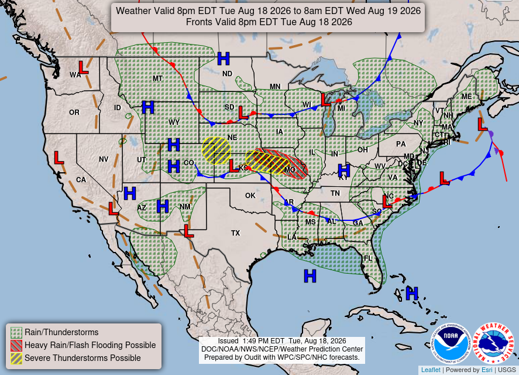](http://www.wpc.ncep.noaa.gov/noaa/noaad1.gif?1430959785)
      
Tomorrow's Forecast:       
Day After Tomorrow's Forecast:

 [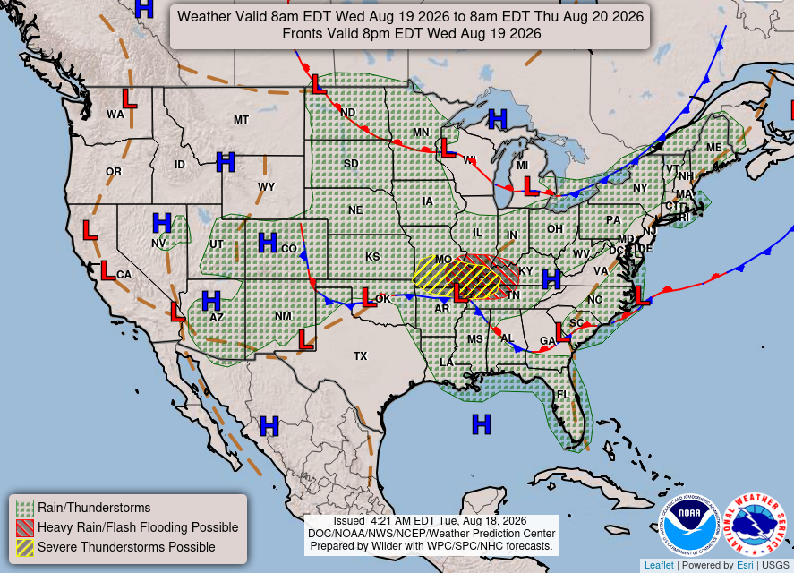](http://www.wpc.ncep.noaa.gov/noaa/noaad2.gif?1430959924)[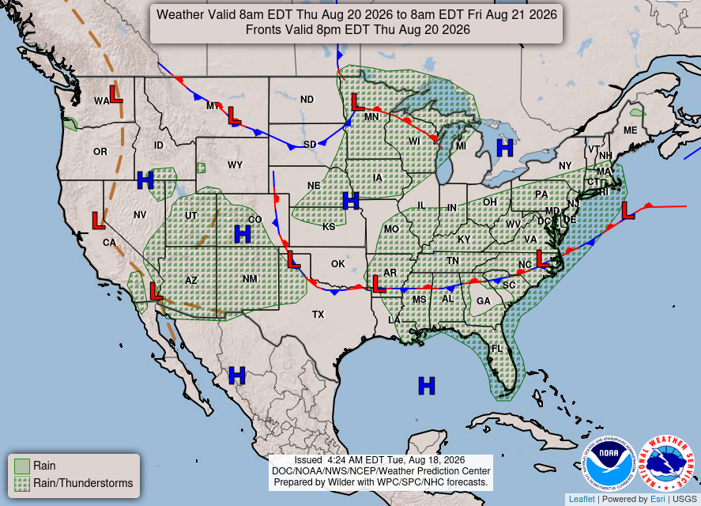](http://www.wpc.ncep.noaa.gov/noaa/noaad3.gif?1430959936)

[Hawaii Weather](https://www.tropicaltidbits.com/analysis/models/?model=fv3p&region=cpac&pkg=mslp_pcpn) / [Alaska
Weather](https://www.tropicaltidbits.com/analysis/models/?model=gfs&region=ak&pkg=mslp_pcpn_frzn)
Day 3-7 Weather Forecast:

[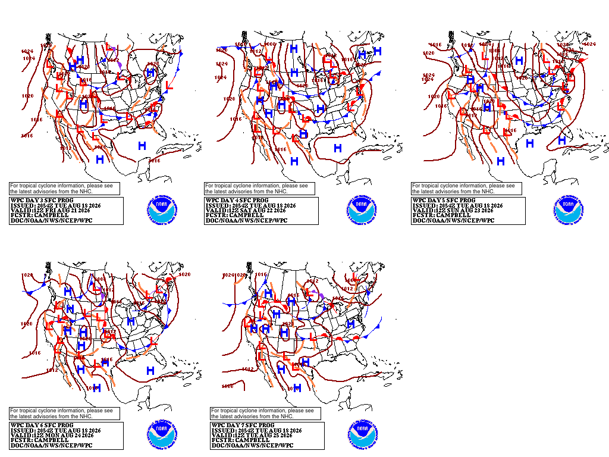](http://www.wpc.ncep.noaa.gov/medr/5dayfcst_wbg_conus.gif)

[7 Day Loop of Surface Analysis](http://www.wpc.ncep.noaa.gov/basicwx/day0-7loop.html) / [Surface
Analysis Charts](http://www.wpc.ncep.noaa.gov/)

Daily Precipitation
/ Weekly
Precipitation:

[NOAA Rain Totals](https://water.weather.gov/precip/) / [Yesterday's Radar](https://s.w-x.co/staticmaps/wu/wxtype/none/usa/animate-yesterday.png) / [CoCoRaHA Totals](http://CoCoRaHs.org)
Current Temperatures:

[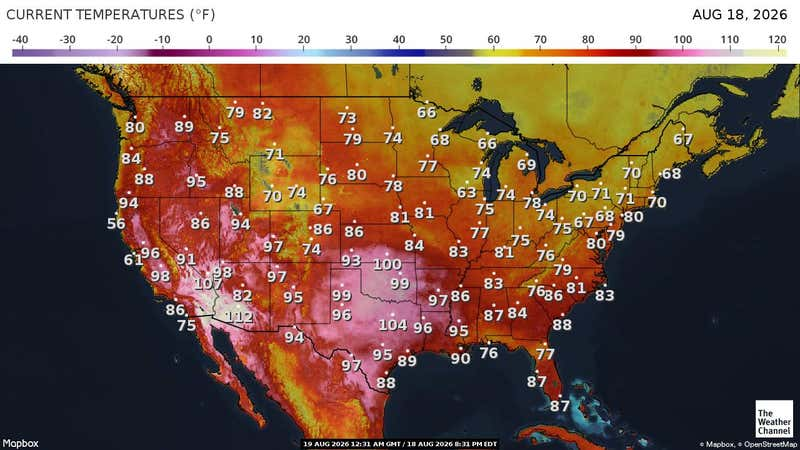](https://s.w-x.co/staticmaps/acttemp_1280x720.jpg?crop=16:9&width=800&format=pjpg&auto=webp&quality=60)
[Detailed Temps](http://www.usairnet.com/weather/maps/current/current-temperature/) / [Daily
Temp Records](http://coolwx.com/record/) / [Potential
Records](https://www.wpc.ncep.noaa.gov/exper/ndfd/ndfd.html)
High Temperature
Forecast:      
Low Temperature Forecast:

[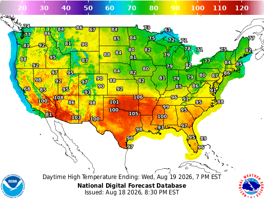](https://graphical.weather.gov/images/conus/MaxT1_conus.png)[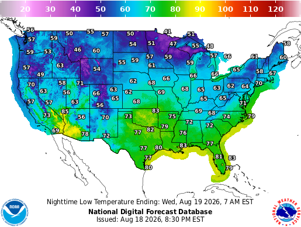](https://graphical.weather.gov/images/conus/MinT1_conus.png)

[Weather History](https://gis.ncdc.noaa.gov/maps/ncei/summaries/daily) / [Wx Stations](https://www.wunderground.com/wundermap?lat=27.91055489&lon=-82.68722534&cm_ven=localwx_wumap) / [Data
Archive](https://www.wunderground.com/history) / [Wx History](http://spaghettimodels.com/history.htm)

Dew
Points
/ Pollen
Count:
[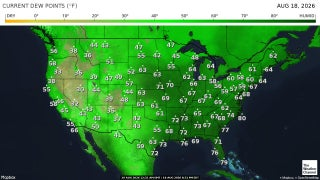](https://s.w-x.co/staticmaps/actdew_1280x720.jpg?v=ap&w=1280&h=720&api=7db9fe61-7414-47b5-9871-e17d87b8b6a0)[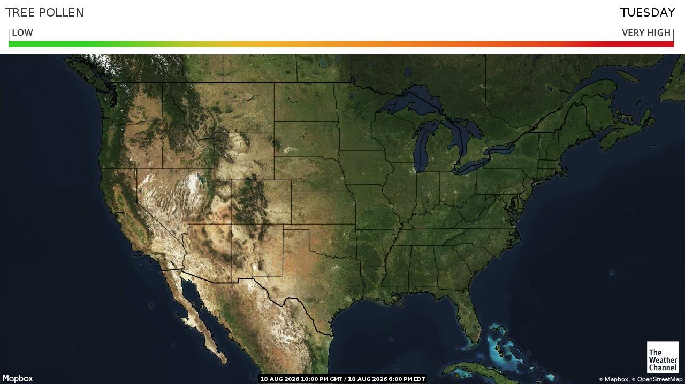](https://weather.com/maps/health/allergies/treepollen)
[Current Heat Index
Leaders](http://coolwx.com/usstats/data/maxhi.lis) / [NWS
Heat Risk](https://www.wpc.ncep.noaa.gov/heatrisk/)

 

**CURRENT SUN AND MOON MAP:**

[Solar Cycle Progression](https://www.swpc.noaa.gov/products/solar-cycle-progression)

[Northen Lights](http://www.softservenews.com/Aurora.htm) / [Ozone
Watch](http://ozonewatch.gsfc.nasa.gov/) /
[Sunset Map](https://sunsetwx.com/view/?id=0) /
[Moon](https://www.timeanddate.com/moon/phases/)
  

**CURRENT LOOK:**

[Gulf
Winds](https://baynews9.com/fl/tampa/weather/tropical#Gulf_Winds-WX)
/ [Gulf
Pressures](https://www.baynews9.com/fl/tampa/weather/tropical#Gulf_Pressure-WX) / [Caribbean](https://baynews9.com/fl/tampa/weather/tropical#Caribbean_Gulf_Winds-WX)
/ [Puerto
Rico](https://baynews9.com/fl/tampa/weather/tropical#Puerto_Rico-WX)
NHC Marine Discussions and Custom Maps:

[Gulf](https://www.nhc.noaa.gov/marine/forecast/enhanced_gom.php)
/ [Caribbean](https://www.nhc.noaa.gov/marine/forecast/enhanced_carib.php)
/ [SW
Atlantic](https://www.nhc.noaa.gov/marine/forecast/enhanced_atlc.php)
Webcams:

[Florida Webcams](https://liveworldwebcams.com/category/americas/united-states/florida/)
/ [American
Eagle Webcam](https://eaglecountry.net/)

  

**MIKE IN THE
NEWS:**

[**GET
A CAMEO FROM MIKE**](https://www.cameo.com/mikesweatherpage)

[Flamingo
Mag '24](https://flamingomag.com/2024/07/08/storm-freaks-tk/) / [FOX
News '24](https://www.foxnews.com/video/6363000789112) / [FOX
News '24](https://www.foxnews.com/video/6362517280112)
[CNN '24](https://vimeo.com/980960519/abbe04b6dc) / [CNN '24](https://vimeo.com/1013353927/9a42563405) / [CNN '24](https://vimeo.com/1018115416/5482d34404)
[FOX LIVE Now '24](https://www.livenowfox.com/video/1521950) / [FOX
LIVE Now '24](https://www.livenowfox.com/video/1529890)
[Broward County
Show '24](https://www.youtube.com/watch?v=BBsSWUF7hDE)
[CNN Erin Burnett '22](https://twitter.com/tropicalupdate/status/1628754708163698695) / [FOX
News '22](https://www.foxnews.com/lifestyle/florida-weather-blogger-talks-hurricane-ian-storms-unite-people-neighbors-helping-neighbors)
[NASCAR Magazine '23](https://issuu.com/ae-engine/docs/nascar_pole_position_january_february/s/21856653)
[USF Interview '23](https://twitter.com/USFalumniAssn/status/1684590376739278851) / [Florida
Trend '2](https://www.floridatrend.com/article/37024/icon-mike-boylan)[3](https://twitter.com/USFalumniAssn/status/1684590376739278851)
[Oldsmar Podcast '23](https://youtu.be/TpCQi_m71Og) / [Storm
Front Freaks '23](https://www.youtube.com/watch?v=1QixKQb_y-M&ab_channel=StormFrontFreaks)
[Firman Behind the Scenes with MWP
'23](https://youtu.be/tpJiEfq2BL8)
[Spirit 90.5 Interview '23](https://soundcloud.com/myspiritfm/hurricane-season-begins-with-mike-boylan-weather-guy) / [Tampa
Bay Axios '23](https://www.axios.com/local/tampa-bay/2023/08/01/mike-boylan-best-day-ever-mikes-weather-page)
[WFLA Tampa '23](https://www.wfla.com/video/hurricane-awareness-machine-to-race-in-daytona-this-weekend/8392945/) / [Tampa
Bay Times '23](https://www.tampabay.com/weather/2023/02/16/mikes-weather-page-nascar-daytona-speedway-spaghetti-models-bayley-currey/)
[The AP '21](https://apnews.com/article/climate-hurricane-ida-florida-fort-lauderdale-storms-fcdcd90fb28519876c2c5468c26b3240) / [Suncoast News '20](https://www.suncoastnews.com/news/oldsmar-weather-watcher-taking-the-internet-by-storm/article_9bacd810-cee0-11eb-a999-532076ac1f2b.html) / [Wikipedia](https://en.wikipedia.org/wiki/Mike's_Weather_Page)
[National News '19](https://youtu.be/RMKA3doVjD8) / [Miami News
'19](https://www.spaghettimodels.com/news09012019.htm)
 / [Biscayne
Times '19](https://www.spaghettimodels.com/news10172019.htm)
 [NSM
Today '19](http://www.nicholsonstudentmedia.com/news/social-media-and-disaster-communication-osc-hosts-knight-at-the-museum-speaker-series/article_16c3ca92-f213-11e9-b54c-5ba33814c97f.html)
 / [Tampa
News '18](http://spaghettimodels.com/news11162018.htm)
 / [SunSentinel
'17](http://www.sun-sentinel.com/news/weather/hurricane/fl-reg-tropics-june-16th-20170616-story.html)

[Tampa News '17](http://spaghettimodels.com/news09082017.htm)
 / [Island
Packet '16](http://www.islandpacket.com/news/weather/hurricane/article106630072.html)

Weather Channel's Stephanie
Abrams likes Mike's: 
[Here](http://spaghettimodels.com/images/SATweet.jpg)
Weather Channel's Jim Cantore follows Mike's: 
[Here](http://spaghettimodels.com/images/JCTweet.jpg)
The famous NOAA Hurricane Hunters like Mike's: 
[Here](http://spaghettimodels.com/images/NOAA.jpg)
NOLA Homeland Security & Emergency like
Mike's: 
[Here](http://spaghettimodels.com/images/NOLA.jpg)
1/2 Million reached on Facebook during 2012 Isaac: 
[Here](http://spaghettimodels.com/images/insights.jpg)

8 Million reached on Facebook during 2021 Laura: 
[Here](http://spaghettimodels.com/images/FBNumbers.jpg)

ABC Action News Hurricane
Special from Mike's:  [Here](https://youtu.be/LxxN7QhSQBA)

  

**MIKE VIDEO MOMENTS:**
[Hurricane Michael](https://www.facebook.com/mikesweatherpage/videos/285525328775130/)

 / [Drunk
Donkey](https://youtu.be/EE9Y1Yr08rg)
/ [Hurricane
Florence](https://www.facebook.com/mikesweatherpage/videos/217586219118244/)

[Mike in a Tornado](https://www.facebook.com/mikesweatherpage/videos/728528020846827/)

/ [Mike
Speaking](https://www.facebook.com/mikesweatherpage/videos/316487525510939/)
/ [Bahama
Interview](https://www.facebook.com/mikesweatherpage/videos/276692172992481/)

[Florida
Snow](https://www.facebook.com/mikesweatherpage/videos/580826949008111/)
/ [Mike
in a Waterspout](https://www.facebook.com/mikesweatherpage/videos/1102284749934448/)
[Sam
Champion](https://www.facebook.com/mikesweatherpage/videos/277599619780725/)
/ [Denis
Phillips](https://www.facebook.com/denisphillipsweatherman/videos/750352342787670)
    

**MIKE IN
SOME PODCASTS:**
[The
HartBeat Show](https://www.facebook.com/TimHartJr/videos/705282819970590/)  / [Tom
and Dan](https://www.youtube.com/watch?v=YVOu4ZObeaM)
 / [Carolina
Weather](https://www.carolinaweathergroup.com/single-post/2017/07/26/Talking-tropics-with-Mike-Boylan-of-Mikes-Weather-Page)

[Pet Paws](https://www.swiftpaws.com/prepare-your-pup-for-hurricane-season/)  / [Behind
the Front 2018](https://www.wbrc.com/2018/10/03/behind-front-mikes-weather-page/)  / [Andy
Simmons Show](https://www.youtube.com/watch?v=DmcK_U-DN5U)

[Brown Water Banter](https://www.facebook.com/brownwaterb/videos/607816099925461/)  / [Cotton
Grower 20](https://www.cottongrower.com/companion/talking-weather-hurricanes-and-drunk-donkeys/)/ [Talking
Isaac](http://www.spaghettimodels.com/MikeInterview2012.mp3)

[Behind
the Front 2020](https://www.wbrc.com/2020/09/23/behind-front-mikes-weather-page/)  / [The
Leadersmith](https://podcasts.apple.com/us/podcast/an-interview-with-mike-of-mikes-weather-page-episode-93/id1513241760?i=1000494062906)
[Intellectual People Podcast](https://youtu.be/5MVojq6sXU0)  / [Cotton
Grower 21](https://www.growingproduce.com/citrus/we-believe-in-florida-citrus-podcast-2021-hurricane-season-is-one-to-watch)
[Meredith For
Real](https://www.facebook.com/watch/?v=572883403401072)

 

**SEE MIKE'S DAILY
POSTS:**

[Click Here to
Read](https://twitter.com/tropicalupdate)

Thanks to all the supporters of Mike and Mike's Weather Page.
Your help
enables all that we do, from the webstite and app, to storm chasing, seminars, education, social media, and more.

[Has
Mike Helped You](https://www.facebook.com/mikesweatherpage/posts/10157608554242367) / [Mike's Reviews](https://www.facebook.com/mikesweatherpage/reviews/) / [99%
Trust Mike](https://www.facebook.com/mikesweatherpage/posts/10157962583447367)
  

     
    

 

     
    

    

**CONUS HURRICANE LANDFALL
INFORMATION:**
Landfall Numbers: 
[Florida](https://www.nhc.noaa.gov/climo/images/strikes_egulf.jpg)
/ [East
Coast](https://www.nhc.noaa.gov/climo/images/strikes_se.jpg)
/ [Upper
Gulf](https://www.nhc.noaa.gov/climo/images/strikes_wgulf.jpg)
/ [Northeast](https://www.nhc.noaa.gov/climo/images/strikes_ne.jpg)
[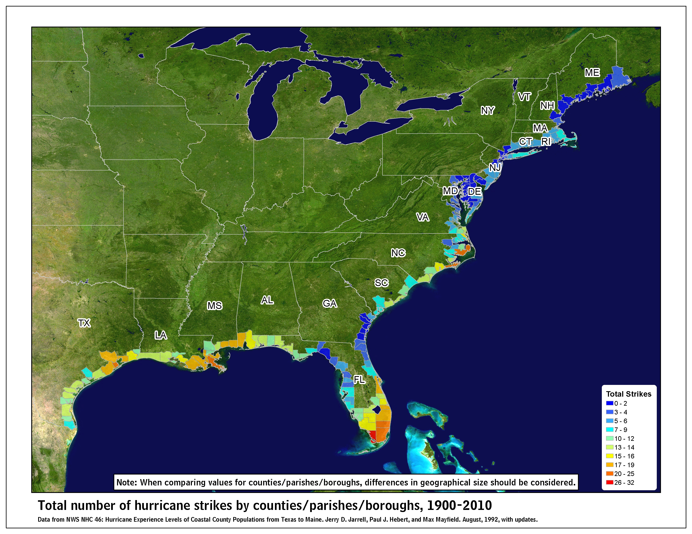](https://www.nhc.noaa.gov/climo/images/strikes_us.jpg)

[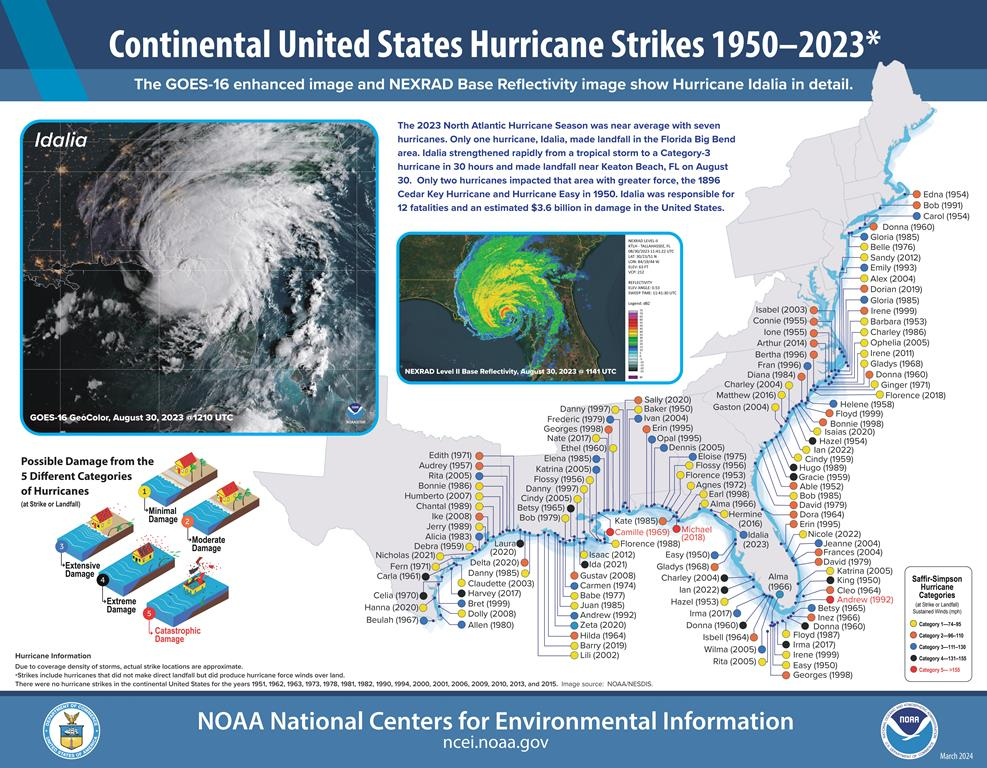](http://spaghettimodels.com/images/HurricaneStrikes2023.jpg)

  

    
**LINKS ON VARIOUS STORM INFO AND STUFF:**

[Tracking Charts](http://weather.about.com/od/hurricaneformation/qt/tracking_charts.htm) / [Past
Tracks](http://coast.noaa.gov/hurricanes/) / [History](https://www.tropicaltidbits.com/analysis/tchist/) / [Model
Accuracy](http://www.nhc.noaa.gov/verification/figs/ALtkerrtrd_earlymdl.jpg)

[Storm Cyclopedia](https://mikematics22800.github.io/Cyclopedia/) / [Bermuda
High](https://en.wikipedia.org/wiki/Azores_High)
/ [Tropical
Terms](https://blog.weather.us/tropical-cyclones-101-glossary-of-common-terms/)
/ [AMO](https://www.aoml.noaa.gov/phod/amo_faq.php)
[Model
Types](http://www.nhc.noaa.gov/modelsummary.shtml) / [MB's](http://www.theweatherprediction.com/habyhints/77/) / [Legend](http://www.nhc.noaa.gov/images/Graphical_Prod_Legend.jpg)
/ [How
Storms Form](http://www.nasa.gov/vision/earth/environment/HURRICANE_RECIPE.html) / [Fronts](https://www.weather.gov/jetstream/basic)

[El Nino](../../13-el-nino-la-nina-enso-mjo-stuff/el-nino-la-nina-enso-stuff-cpc-website/el-nino-la-nina-enso-stuff-cpc-website.md)

/ [El Nino
Explained](https://www.weather.gov/jan/el_nino_and_la_nina)
/ [Watches/Warnings](https://www.youtube.com/watch?v=x3V3HZBs1Y4)
/ [Wildfires](http://www.redcross.org/images/MEDIA_CustomProductCatalog/m4340149_Wildfire.pdf)
[Drought
Monitor](http://droughtmonitor.unl.edu/)
/ [Monsoon
SW Weather](http://monsoonweather.site)
/ [Compare
Canes](https://www.youtube.com/watch?v=NoxKH_v8b-8)

[°F to °C](https://www.iweathernet.com/calculators)
/ [USA Power Outages](https://poweroutage.us/)
/ [Tornado
Formation](https://youtu.be/LT7yRMLAkCY)
/ [TUTT](https://en.wikipedia.org/wiki/Tropical_upper_tropospheric_trough)

[Storm Radar History](http://bmcnoldy.rsmas.miami.edu/tropics/radar/)
/ [50
Star Search and Rescue](https://www.facebook.com/50StarSAR/)
/ [Radar?](https://youtu.be/KFWsT1N30Y0)

[Cape Launch Info](https://www.patrick.af.mil/About-Us/Weather/)
/ [Todays
Weather History](https://www.weatherforyou.com/weather_history/)

[Wind
Barbs](http://weather.rap.ucar.edu/info/about_windbarb.html)
/ [NAO](https://www.ncdc.noaa.gov/teleconnections/nao/)

/ [Webcams](https://www.skylinewebcams.com/en/webcam.html)
/ [FEMA Risk Index](https://hazards.geoplatform.gov/portal/apps/MapSeries/index.html?appid=ddf915a24fb24dc8863eed96bc3345f8)

[Hebert Box](https://en.wikipedia.org/wiki/Hebert_Box)
/ [Storm
Surge Explained](https://youtu.be/bBa9bVYKLP0)
/ [Scalable
Map](https://mapmaker.nationalgeographic.org/)

[How Far Inland Winds](https://www.nhc.noaa.gov/aboutmeow.shtml)
/ [PV
Streamers](https://www.atmos.albany.edu/student/ppapin/research_phd.php)
/ [Pressure
Conversion](http://www.rescuedynamics.ca/articles/ConvertP.htm)
       

**INFORMATION
ON TROPICAL CYCLONES:**

NHC Hurricane Planning:
[NWS Hurricane Plan](https://www.weather.gov/safety/hurricane-plan) &

[Prepare](https://www.weather.gov/wrn/hurricane-preparedness)
[Custom NWS Text Products](https://textwx.com/)
A hurricane is a tropical cyclone, which generally forms in the tropics and
is accompanied by thunderstorms and a counterclockwise circulation of winds.
Tropical cyclones are classified as follows:

[Tropical Depression:](https://en.wikipedia.org/wiki/Tropical_depression#Tropical_depression)
Organized system of clouds/ thunderstorms with defined surface circulation
& max sustained winds of 38 mph or less.

[Tropical
Storm:](https://en.wikipedia.org/wiki/Tropical_storm#Tropical_storm)
Organized system of strong thunderstorms with a defined surface circulation
& maximum sustained winds of 39-73 mph.
[Hurricane:](https://en.wikipedia.org/wiki/Hurricane)
Intense tropical weather system of strong thunderstorms with a
well-defined surface circulation & max sustained winds of 74 mph or higher.
[The Atlantic Hurricane Season is from June 1 - November 30](https://en.wikipedia.org/wiki/Atlantic_hurricane_season)

                 

**HURRICANE WATCHES AND WARNINGS:**
- When a
 [Hurricane Watch](https://en.wikipedia.org/wiki/Tropical_cyclone_warnings_and_watches) is issued for your part of the coast this indicates
the possibility that you could experience hurricane conditions within 48 hours. This
watch should trigger your family's disaster
plan, and proactive measures should be initiated especially those actions
that require extra time such as securing a boat, leaving a barrier island,
etc.
- When a [Hurricane Warning](https://en.wikipedia.org/wiki/Tropical_cyclone_warnings_and_watches) is issued for your part of the coast this indicates that
sustained winds of at least 74 mph are expected within 36 hours. Once this
warning has been issued, your family should be in the process of completing
proactive actions and deciding the safest location to be during the storm.
[See the Difference
Betweeen a WATCH and a WARNING](https://www.youtube.com/watch?v=x3V3HZBs1Y4)
**WHAT ARE
SOME HURRICANE HAZARDS:**

[Storm Surge:](http://www.nhc.noaa.gov/prepare/hazards.php)
Water that is pushed toward the shore by the force of the winds swirling around
the storm. This advancing surge combines with the normal tides to create the
hurricane storm tide, which can increase the mean water level 15 feet or more.

[Inland Flooding:](http://www.floridadisaster.org/EMTOOLS/Severe/floods.htm)
In the last 30 years, inland flooding has been responsible for more than half
the deaths associated with tropical cyclones in the US.

[High Winds:](http://www.nhc.noaa.gov/prepare/hazards.php#wind)
Hurricane force winds can destroy poorly constructed buildings and mobile homes.
Debris such as signs, roofing material, and small items left outside become
flying missiles in hurricanes.

[Tornadoes:](https://www.nssl.noaa.gov/education/svrwx101/tornadoes/)
Hurricanes can produce tornadoes that add to the storm's
destructive power. They are most likely to occur in the right-front quadrant of the
hurricane. **HURRICANE
HELPFUL LINKS:**

[Insurance Claim Help](https://oceanpoint.claims/?utm_source=spaghetti_models&utm_medium=bn)
/ [Homeowners checklist](https://www.fema.gov/pdf/plan/prevent/nhp/hurdam.pdf)
/ [Fact sheet](http://www.ready.gov/hurricanes)
[Supply
Preparedness](https://hdsupplysolutions.com/shop/static--er_hurricanes)
/ [All about window
shutters](http://www.aoml.noaa.gov/hrd/shutters/index1.html)
[Evacuate or Stay](https://www.disasterassistance.gov/information/immediate-needs/evacuate-or-stay-put)
/ [Family and Individual preparedness](http://www.ready.gov/make-a-plan)
[Should you crack your windows](http://www.ehow.com/how_6518451_should-do-hurricane-watch-issued_.html)
/ [Protecting
from wind](https://www.depts.ttu.edu/nwi/research/windprotection.php)
[Family disaster Plan and Evacutation](https://www.redcross.org/get-help/how-to-prepare-for-emergencies/make-a-plan.html)
/ [Disaster eating guide](https://extension.umn.edu/how-prepare/preparing-2-week-emergency-food-supply)
[Interactive wind maps](http://www.nhc.noaa.gov/aboutmeow.shtml)
/ [Hurricane
Tidbits](https://www.strublelawfirm.com/insurance-claim-blog/hurricane-history-facts/)
/ [Lightning safety](http://www.homecity.com/homeowners-lightning-safety-guide)
[Water Damage Advisor](https://www.waterdamageadvisor.com/)
/ [FloodSmart Community Resources](https://www.floodsmart.gov/)
[Red Cross
Checklist](http://www.redcross.org/prepare/disaster-safety-library)
/ [Protect home from flood damage](https://www.redfin.com/blog/2015/03/how-to-protect-your-home-from-flood-damage.html)
[Emergency Planning](https://www.fema.gov/emergency-managers/national-preparedness/plan)
/ [Protect
Pets](https://bellalagovethospital.com/hurricane.html#:~:text=If%20you%20shelter%20in%20place,dogs%20may%20need%20some%20thought.)
/ [Flood damaged cars](http://www.carfax.com/guides/buying-used/things-to-avoid/flood-damage)
[STEM challenge for kids](http://practicalaction.org/beattheflood) [/](http://practicalaction.org/beattheflood)[Building flood resistant homes](http://practicalaction.org/beattheflood)
[Pet Disaster Prepardness & Recoveryng](https://www.redcross.org/get-help/how-to-prepare-for-emergencies/pet-disaster-preparedness.html)
/ [Pet
Safety](https://humanesocietytampa.org/natural-disaster/)
[Hide from the Wind](http://www.HideFromTheWind.com)
/ [Basement
Flooding](https://www.basementguides.com/flooding/)
/ [How
to Prepare](https://www.kin.com/blog/how-to-prepare-for-a-hurricane/)
[Hurricane
Homeowner Guide](https://www.iii.org/article/hurricane-season-insurance-guide)
/ [Kids
& Natural Disasters](https://www.nctsn.org/what-is-child-trauma/trauma-types/disasters)
[Helping those with
Disabilities](https://www.mydacil.org/hurricane-preparedness)
**WHAT
ACTIONS TO DO TO BE PREPARED:**
Have a
[Family Disaster Plan](https://www.redcross.org/get-help/how-to-prepare-for-emergencies/make-a-plan.html) and  [Disaster Supply Kit](https://www.ready.gov/build-a-kit).
Build or identify a Safe-Room in your Home.
Purchase a NOAA [Weather Radio](http://www.nws.noaa.gov/nwr/) with a
tone alert feature, which allows you to receive warnings by your local NWS
office.
Inquire if your Community is
[StormReady](https://www.weather.gov/StormReady)**.**
**MONTHLY AREAS OF ORIGIN AND TRACKS:**[Cyclone
Climatology](https://www.nhc.noaa.gov/climo/)
/ [Past
Radar](http://bmcnoldy.rsmas.miami.edu/tropics/radar/)
/ [Storm
History](http://bmcnoldy.rsmas.miami.edu/tropics/radar/)
/ [Florida
History](https://hintfl.com/)
[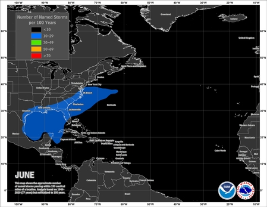](https://www.nhc.noaa.gov/climo/images/2021climo/atl_climo_ns_jun.jpg)[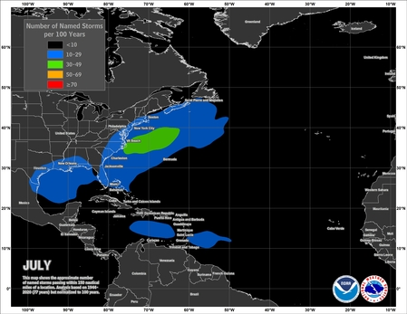](https://www.nhc.noaa.gov/climo/images/2021climo/atl_climo_ns_jul.jpg)
[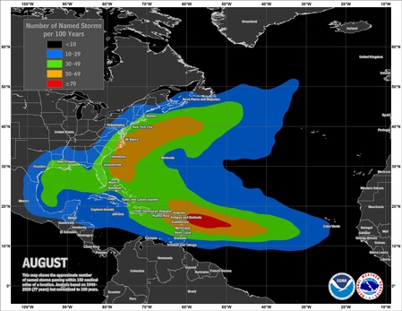](https://www.nhc.noaa.gov/climo/images/2021climo/atl_climo_ns_aug.jpg)[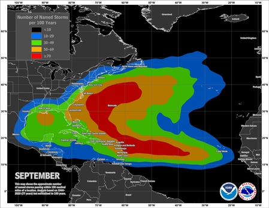](https://www.nhc.noaa.gov/climo/images/2021climo/atl_climo_ns_sep.jpg)
[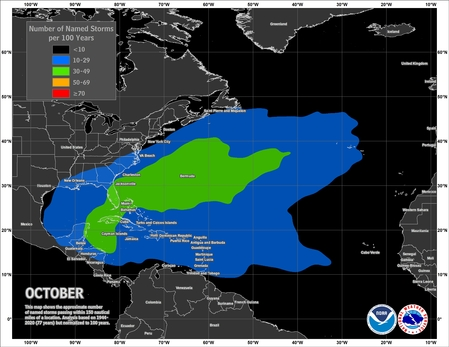](https://www.nhc.noaa.gov/climo/images/2021climo/atl_climo_ns_oct.jpg)[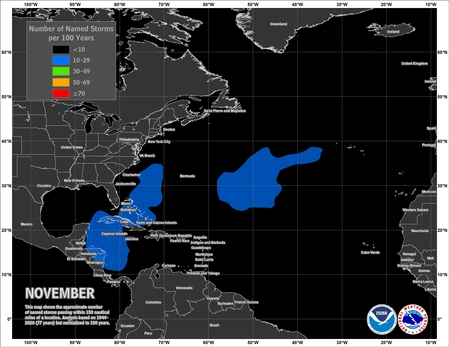](https://www.nhc.noaa.gov/climo/images/2021climo/atl_climo_ns_nov.jpg)
[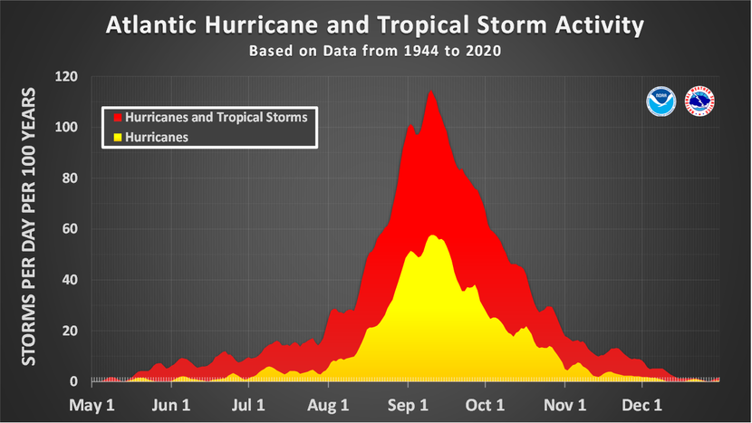](https://www.nhc.noaa.gov/climo/images/2021climo/AtlanticCampfire_sm.png)

What is the MJO: 
[MJO
Defined](https://en.wikipedia.org/wiki/Madden–Julian_oscillation)

[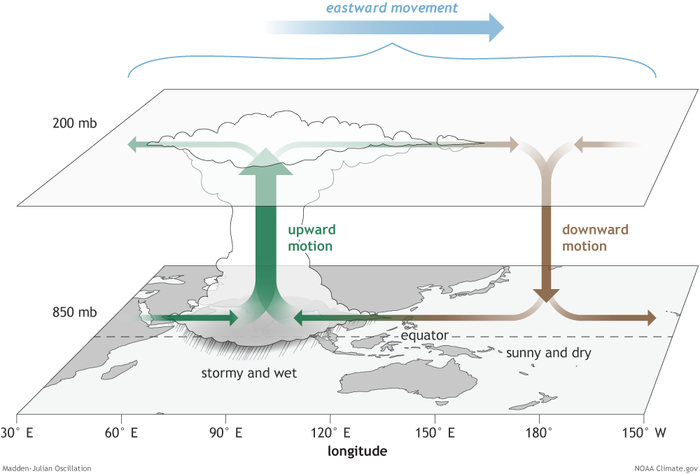](http://spaghettimodels.com/images/MJO.png)
El Nino and La Nina and Hurricanes:

[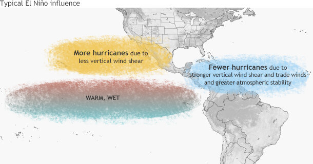](http://spaghettimodels.com/images/ENSO-TypicalElNino.jpg)

[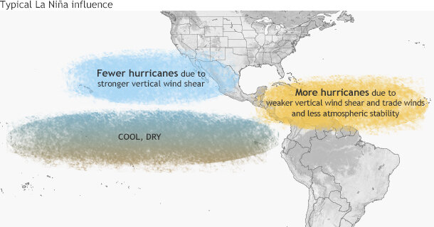](http://spaghettimodels.com/images/ENSO-TypicalLaNina.jpg)

 MWP Terms of Service: 

 **DISCLAIMER:**My website is for general information only and not to be used for any official forecast. Weather is a hobby of mine and having a site for friends and family with as
many useful links for hurricane tracking and information has always been my objective. Watch local and National news for your weather making
decisions. Not responsible for inaccurate maps or data on this page.**
**PRIVACY POLICY:**

**My website (www.spaghettimodels.com) uses browsing cookies and conducts others means to collect user information in order to display contextual ads.My website (www.spaghettimodels.com) uses browsing cookies and conducts others means to collect user information in order to display contextual ads.

- Third party vendors, including Google, use cookies to serve ads based on a
user's prior visits to this website or other websites.
- Google's use of advertising cookies enables it and its partners to serve
ads to you based on your visit to this site and/or other sites on the
Internet.
- You may opt out of personalized advertising by visiting**

[**Ads Settings**](https://www.google.com/settings/u/0/ads/authenticated)**. You can also opt out by
visiting**

[**www.aboutads.info**](http://www.aboutads.info)**.**
**YOUTUBE / API SERVICES:**

[YouTube Terms of Services](https://www.youtube.com/t/terms) /
[Google Privacy Policy](https://www.google.com/policies/privacy)

**By using YouTube users are agreeing to be bound by the YouTube Terms
of Service. Mike's Weather Page uses YouTube API Services. User data is not
collected, stored, or used by Mike's Weather Page. User data is not
processed or shared. [Contact](mailto:mikesweatherpage@gmail.com) for more info.**
