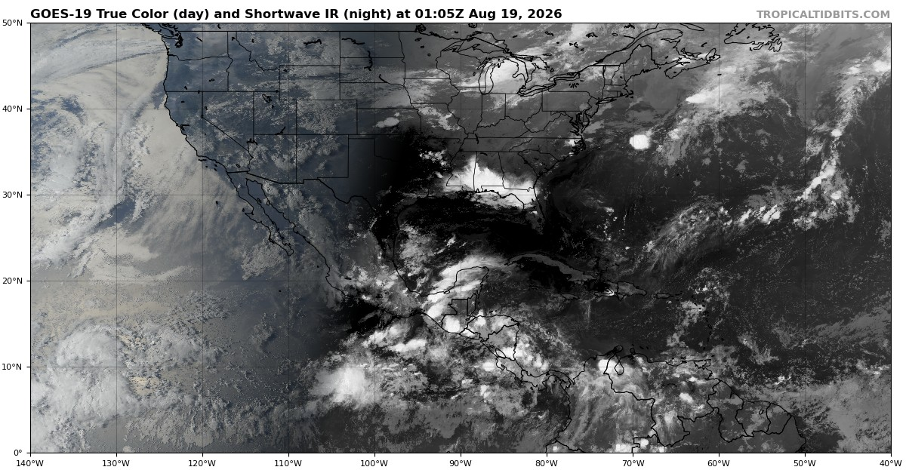

# Tropical Tidbits

> Source: <https://www.tropicaltidbits.com/>  
> Section: Tropical Cyclones  
> Captured: 2026-08-19 06:00 UTC  
> PDF: [tropical-tidbits.pdf](tropical-tidbits.pdf) · Original HTML: [source/original.html](source/original.html)

---

[- Current Storms](https://www.tropicaltidbits.com/storminfo/)
[- Aircraft Recon](https://www.tropicaltidbits.com/recon/)
[- Satellite Imagery](https://www.tropicaltidbits.com/sat/)
[- Forecast Models](https://www.tropicaltidbits.com/analysis/models/)
[- Analysis Tools](https://www.tropicaltidbits.com/analysis/)
[- About](https://www.tropicaltidbits.com/about/)
[Support TT](https://www.tropicaltidbits.com/support/)

Levi's Latest Video Update

---

[Support Tropical Tidbits](https://www.tropicaltidbits.com/support/)

Follow:

---

Advertisement

Twitter Feed:

[Follow @TropicalTidbits](https://twitter.com/TropicalTidbits?ref_src=twsrc%5Etfw)

[Tweets by TropicalTidbits](https://twitter.com/TropicalTidbits?ref_src=twsrc%5Etfw)

There have been no videos during the past week. Videos are normally published when there are active tropical cyclones in the Atlantic.

In the mean time, track the tropics with our [data visualizations](https://www.tropicaltidbits.com/analysis), or check out Levi's social media feeds for the latest analysis.

Current Atlantic-Pacific Satellite View:

---

Copyright © 2012- 2026 Tropical Tidbits, All Rights
Reserved.

Contact:
[levicowan@tropicaltidbits.com](mailto:levicowan@tropicaltidbits.com)

Privacy Policy:
[tropicaltidbits.com/privacy-policy.html](https://www.tropicaltidbits.com/privacy-policy.html)

[×](javascript:void(0))
Settings

---

Dark Theme
