# Tropical Weather (NWS) — NWS Tropical Cyclone Brochure

> Source: <http://www.weather.gov/media/zhu/ZHU_Training_Page/tropical_stuff/tropical_cyclone_brochure/TropicalCyclones.pdf>  
> Section: Tropical Cyclones  
> Captured: 2026-08-19 06:00 UTC  
> PDF: [tropical-weather-nws-nws-tropical-cyclone-brochure.pdf](tropical-weather-nws-nws-tropical-cyclone-brochure.pdf) (12 pages)

---

## Page 1

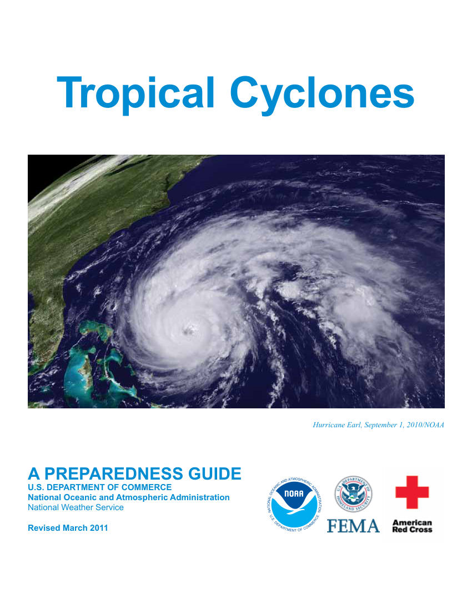

Hurricane Earl, September 1, 2010/NOAA
Tropical Cyclones 
A PREPAREDNESS GUIDE
U.S. DEPARTMENT OF COMMERCE
National Oceanic and Atmospheric Administration
National Weather Service
Revised March 2011

## Page 2

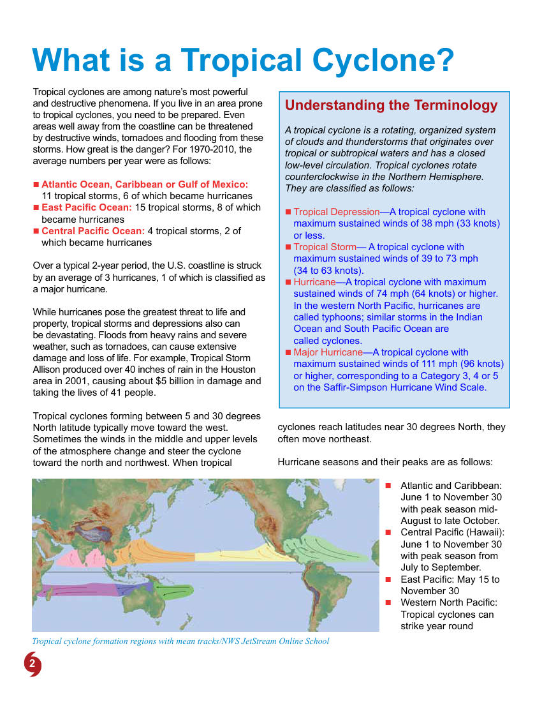

2
Tropical cyclones are among nature’s most powerful 
and destructive phenomena. If you live in an area prone 
to tropical cyclones, you need to be prepared. Even 
areas well away from the coastline can be threatened 
by destructive winds, tornadoes and flooding from these 
storms. How great is the danger? For 1970-2010, the 
average numbers per year were as follows:
 

„ Atlantic Ocean, Caribbean or Gulf of Mexico:  
11 tropical storms, 6 of which became hurricanes 

„ East Pacific Ocean: 15 tropical storms, 8 of which  
became hurricanes

„ Central Pacific Ocean: 4 tropical storms, 2 of 
which became hurricanes
Over a typical 2-year period, the U.S. coastline is struck 
by an average of 3 hurricanes, 1 of which is classified as 
a major hurricane.
While hurricanes pose the greatest threat to life and 
property, tropical storms and depressions also can 
be devastating. Floods from heavy rains and severe 
weather, such as tornadoes, can cause extensive 
damage and loss of life. For example, Tropical Storm 
Allison produced over 40 inches of rain in the Houston 
area in 2001, causing about $5 billion in damage and 
taking the lives of 41 people.
Tropical cyclones forming between 5 and 30 degrees 
North latitude typically move toward the west. 
Sometimes the winds in the middle and upper levels 
of the atmosphere change and steer the cyclone 
toward the north and northwest. When tropical 
What is a Tropical Cyclone?
cyclones reach latitudes near 30 degrees North, they 
often move northeast. 
Hurricane seasons and their peaks are as follows:

„	 Atlantic and Caribbean: 	
June 1 to November 30 
with peak season mid-
August to late October. 

„	 Central Pacific (Hawaii): 
June 1 to November 30 
with peak season from 
July to September. 

„	 East Pacific: May 15 to 
November 30 

„	 Western North Pacific: 
Tropical cyclones can 
strike year round 
Understanding the Terminology
A tropical cyclone is a rotating, organized system 
of clouds and thunderstorms that originates over 
tropical or subtropical waters and has a closed 
low-level circulation. Tropical cyclones rotate 
counterclockwise in the Northern Hemisphere. 
They are classified as follows:

„ Tropical Depression—A tropical cyclone with 
maximum sustained winds of 38 mph (33 knots) 
or less.

„ Tropical Storm— A tropical cyclone with 
maximum sustained winds of 39 to 73 mph  
(34 to 63 knots).

„ Hurricane—A tropical cyclone with maximum 
sustained winds of 74 mph (64 knots) or higher. 
In the western North Pacific, hurricanes are 
called typhoons; similar storms in the Indian 
Ocean and South Pacific Ocean are  
called cyclones.

„ Major Hurricane—A tropical cyclone with 
maximum sustained winds of 111 mph (96 knots) 
or higher, corresponding to a Category 3, 4 or 5 
on the Saffir-Simpson Hurricane Wind Scale.
Tropical cyclone formation regions with mean tracks/NWS JetStream Online School

## Page 3

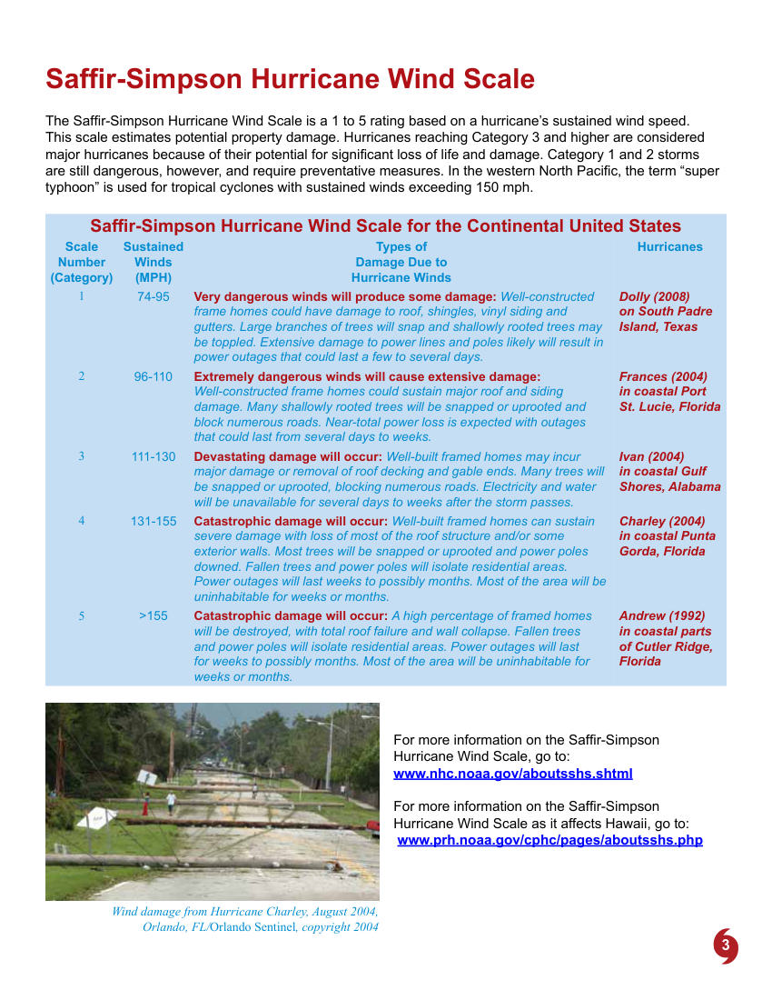

3
Saffir-Simpson Hurricane Wind Scale
The Saffir-Simpson Hurricane Wind Scale is a 1 to 5 rating based on a hurricane’s sustained wind speed. 
This scale estimates potential property damage. Hurricanes reaching Category 3 and higher are considered 
major hurricanes because of their potential for significant loss of life and damage. Category 1 and 2 storms 
are still dangerous, however, and require preventative measures. In the western North Pacific, the term “super 
typhoon” is used for tropical cyclones with sustained winds exceeding 150 mph. 
Saffir-Simpson Hurricane Wind Scale for the Continental United States
Scale 
Number 
(Category) 
Sustained 
Winds 
(MPH)
Types of
Damage Due to
Hurricane Winds
Hurricanes
1
74-95
Very dangerous winds will produce some damage: Well-constructed 
frame homes could have damage to roof, shingles, vinyl siding and 
gutters. Large branches of trees will snap and shallowly rooted trees may 
be toppled. Extensive damage to power lines and poles likely will result in 
power outages that could last a few to several days.
Dolly (2008) 
on South Padre 
Island, Texas
2
96-110
Extremely dangerous winds will cause extensive damage:  
Well-constructed frame homes could sustain major roof and siding 
damage. Many shallowly rooted trees will be snapped or uprooted and 
block numerous roads. Near-total power loss is expected with outages 
that could last from several days to weeks. 
Frances (2004)  
in coastal Port  
St. Lucie, Florida
3
111-130
Devastating damage will occur: Well-built framed homes may incur 
major damage or removal of roof decking and gable ends. Many trees will 
be snapped or uprooted, blocking numerous roads. Electricity and water 
will be unavailable for several days to weeks after the storm passes.
Ivan (2004)  
in coastal Gulf 
Shores, Alabama
4
131-155
Catastrophic damage will occur: Well-built framed homes can sustain 
severe damage with loss of most of the roof structure and/or some 
exterior walls. Most trees will be snapped or uprooted and power poles 
downed. Fallen trees and power poles will isolate residential areas. 
Power outages will last weeks to possibly months. Most of the area will be 
uninhabitable for weeks or months.
Charley (2004) 
in coastal Punta 
Gorda, Florida
5
>155
Catastrophic damage will occur: A high percentage of framed homes 
will be destroyed, with total roof failure and wall collapse. Fallen trees 
and power poles will isolate residential areas. Power outages will last 
for weeks to possibly months. Most of the area will be uninhabitable for 
weeks or months.
Andrew (1992)  
in coastal parts 
of Cutler Ridge, 
Florida
For more information on the Saffir-Simpson 
Hurricane Wind Scale, go to: 
www.nhc.noaa.gov/aboutsshs.shtml
For more information on the Saffir-Simpson 
Hurricane Wind Scale as it affects Hawaii, go to: 
 www.prh.noaa.gov/cphc/pages/aboutsshs.php
Wind damage from Hurricane Charley, August 2004, 
Orlando, FL/Orlando Sentinel, copyright 2004

## Page 4

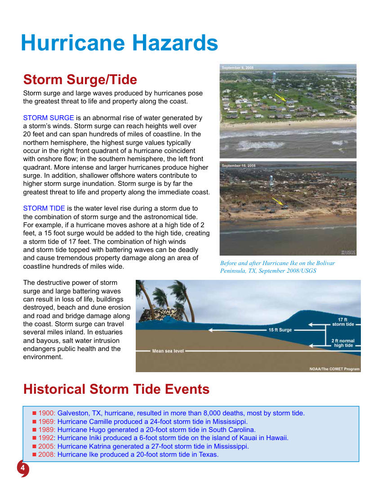

4
Historical Storm Tide Events

„ 1900: Galveston, TX, hurricane, resulted in more than 8,000 deaths, most by storm tide.

„ 1969: Hurricane Camille produced a 24-foot storm tide in Mississippi.

„ 1989: Hurricane Hugo generated a 20-foot storm tide in South Carolina.

„ 1992: Hurricane Iniki produced a 6-foot storm tide on the island of Kauai in Hawaii.

„ 2005: Hurricane Katrina generated a 27-foot storm tide in Mississippi.

„ 2008: Hurricane Ike produced a 20-foot storm tide in Texas.
Hurricane Hazards
Storm Surge/Tide
Storm surge and large waves produced by hurricanes pose 
the greatest threat to life and property along the coast.
STORM SURGE is an abnormal rise of water generated by 
a storm’s winds. Storm surge can reach heights well over 
20 feet and can span hundreds of miles of coastline. In the 
northern hemisphere, the highest surge values typically 
occur in the right front quadrant of a hurricane coincident 
with onshore flow; in the southern hemisphere, the left front 
quadrant. More intense and larger hurricanes produce higher 
surge. In addition, shallower offshore waters contribute to 
higher storm surge inundation. Storm surge is by far the 
greatest threat to life and property along the immediate coast. 
STORM TIDE is the water level rise during a storm due to 
the combination of storm surge and the astronomical tide. 
For example, if a hurricane moves ashore at a high tide of 2 
feet, a 15 foot surge would be added to the high tide, creating 
a storm tide of 17 feet. The combination of high winds 
and storm tide topped with battering waves can be deadly 
and cause tremendous property damage along an area of 
coastline hundreds of miles wide.
The destructive power of storm 
surge and large battering waves 
can result in loss of life, buildings 
destroyed, beach and dune erosion 
and road and bridge damage along 
the coast. Storm surge can travel 
several miles inland. In estuaries 
and bayous, salt water intrusion 
endangers public health and the 
environment.
Before and after Hurricane Ike on the Bolivar 
Peninsula, TX, September 2008/USGS

## Page 5

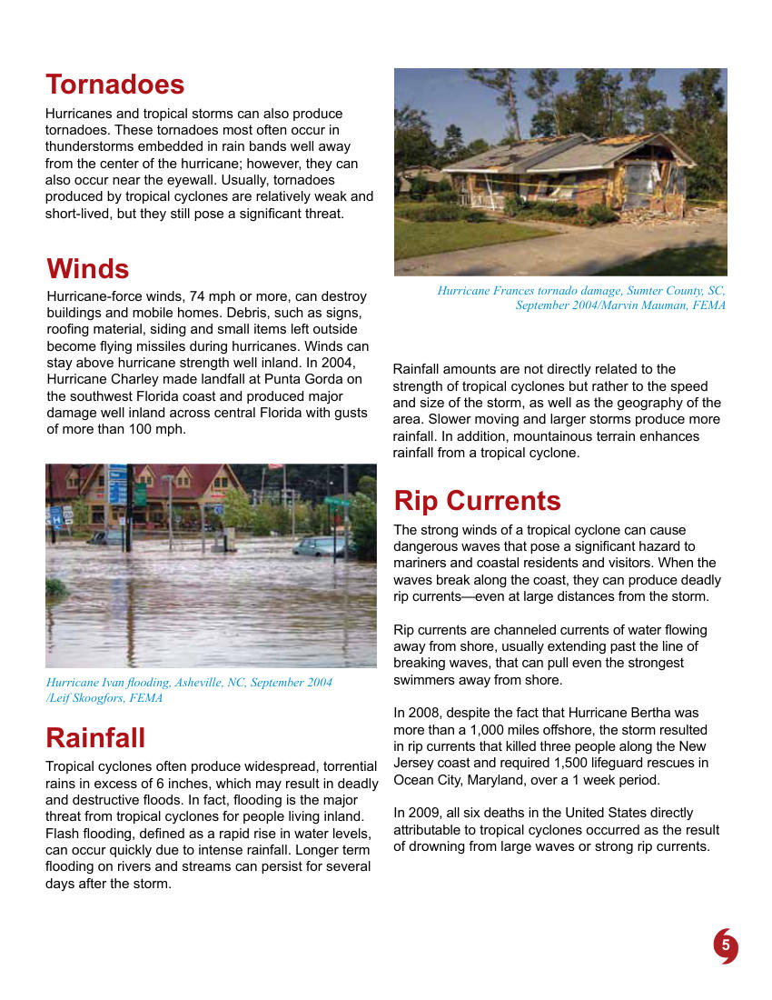

5
Rip Currents
The strong winds of a tropical cyclone can cause 
dangerous waves that pose a significant hazard to 
mariners and coastal residents and visitors. When the 
waves break along the coast, they can produce deadly 
rip currents—even at large distances from the storm. 
Rip currents are channeled currents of water flowing 
away from shore, usually extending past the line of 
breaking waves, that can pull even the strongest 
swimmers away from shore. 
In 2008, despite the fact that Hurricane Bertha was 
more than a 1,000 miles offshore, the storm resulted 
in rip currents that killed three people along the New 
Jersey coast and required 1,500 lifeguard rescues in 
Ocean City, Maryland, over a 1 week period. 
In 2009, all six deaths in the United States directly 
attributable to tropical cyclones occurred as the result 
of drowning from large waves or strong rip currents.
Tornadoes
Hurricanes and tropical storms can also produce 
tornadoes. These tornadoes most often occur in 
thunderstorms embedded in rain bands well away 
from the center of the hurricane; however, they can 
also occur near the eyewall. Usually, tornadoes 
produced by tropical cyclones are relatively weak and 
short-lived, but they still pose a significant threat.
Winds
Hurricane-force winds, 74 mph or more, can destroy 
buildings and mobile homes. Debris, such as signs, 
roofing material, siding and small items left outside 
become flying missiles during hurricanes. Winds can 
stay above hurricane strength well inland. In 2004, 
Hurricane Charley made landfall at Punta Gorda on 
the southwest Florida coast and produced major 
damage well inland across central Florida with gusts 
of more than 100 mph.
Rainfall 
Tropical cyclones often produce widespread, torrential 
rains in excess of 6 inches, which may result in deadly 
and destructive floods. In fact, flooding is the major 
threat from tropical cyclones for people living inland. 
Flash flooding, defined as a rapid rise in water levels, 
can occur quickly due to intense rainfall. Longer term 
flooding on rivers and streams can persist for several 
days after the storm. 
Hurricane Ivan flooding, Asheville, NC, September 2004 
/Leif Skoogfors, FEMA
Rainfall amounts are not directly related to the 
strength of tropical cyclones but rather to the speed 
and size of the storm, as well as the geography of the 
area. Slower moving and larger storms produce more 
rainfall. In addition, mountainous terrain enhances 
rainfall from a tropical cyclone.
Hurricane Frances tornado damage, Sumter County, SC, 
September 2004/Marvin Mauman, FEMA

## Page 6

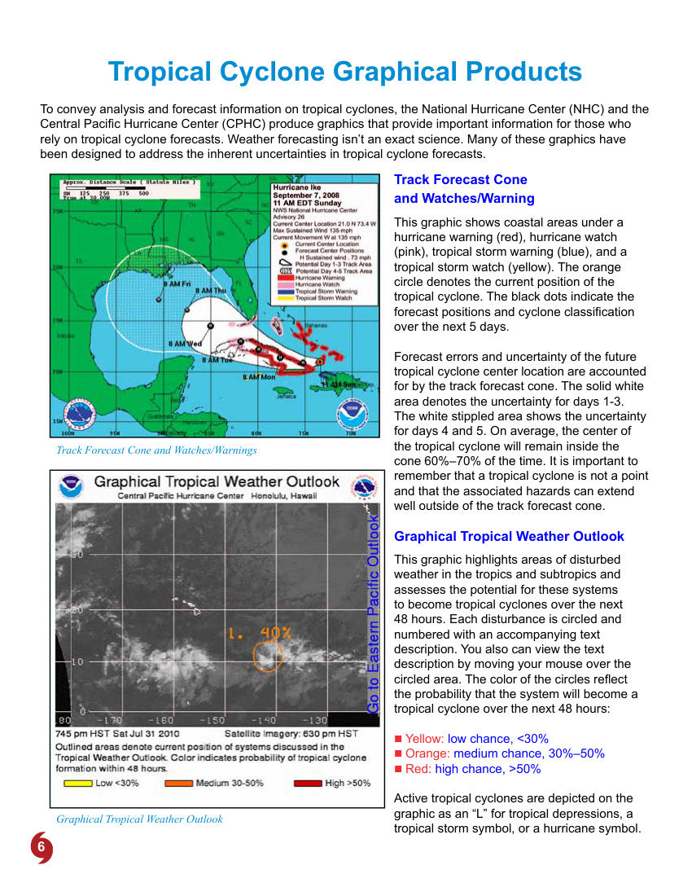

6
Tropical Cyclone Graphical Products
To convey analysis and forecast information on tropical cyclones, the National Hurricane Center (NHC) and the 
Central Pacific Hurricane Center (CPHC) produce graphics that provide important information for those who 
rely on tropical cyclone forecasts. Weather forecasting isn’t an exact science. Many of these graphics have 
been designed to address the inherent uncertainties in tropical cyclone forecasts.
Track Forecast Cone  
and Watches/Warning
This graphic shows coastal areas under a 
hurricane warning (red), hurricane watch 
(pink), tropical storm warning (blue), and a 
tropical storm watch (yellow). The orange 
circle denotes the current position of the 
tropical cyclone. The black dots indicate the 
forecast positions and cyclone classification 
over the next 5 days. 
Forecast errors and uncertainty of the future  
tropical cyclone center location are accounted 
for by the track forecast cone. The solid white 
area denotes the uncertainty for days 1-3. 
The white stippled area shows the uncertainty 
for days 4 and 5. On average, the center of 
the tropical cyclone will remain inside the 
cone 60%–70% of the time. It is important to 
remember that a tropical cyclone is not a point 
and that the associated hazards can extend 
well outside of the track forecast cone.
Graphical Tropical Weather Outlook
Track Forecast Cone and Watches/Warnings
Graphical Tropical Weather Outlook
This graphic highlights areas of disturbed 
weather in the tropics and subtropics and 
assesses the potential for these systems 
to become tropical cyclones over the next 
48 hours. Each disturbance is circled and 
numbered with an accompanying text 
description. You also can view the text 
description by moving your mouse over the 
circled area. The color of the circles reflect 
the probability that the system will become a 
tropical cyclone over the next 48 hours:

„ Yellow: low chance, <30%

„ Orange: medium chance, 30%–50%

„ Red: high chance, >50%
Active tropical cyclones are depicted on the 
graphic as an “L” for tropical depressions, a 
tropical storm symbol, or a hurricane symbol.

## Page 7

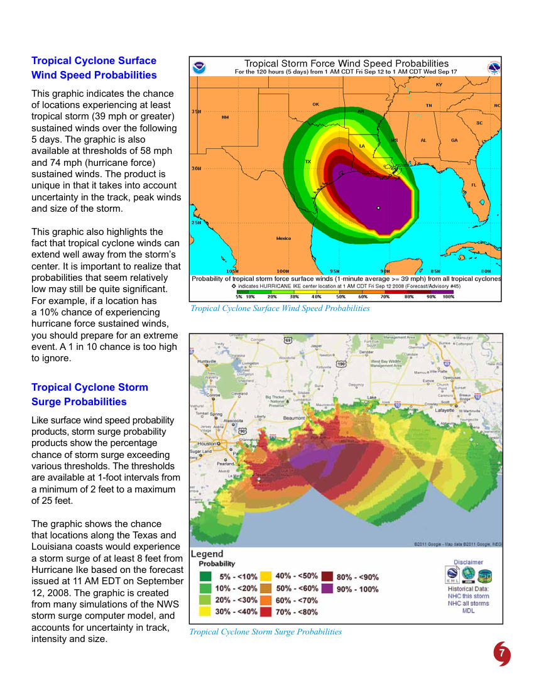

7
Tropical Cyclone Storm Surge Probabilities
Tropical Cyclone Surface Wind Speed Probabilities
Tropical Cyclone Surface  
Wind Speed Probabilities
This graphic indicates the chance 
of locations experiencing at least 
tropical storm (39 mph or greater) 
sustained winds over the following 
5 days. The graphic is also 
available at thresholds of 58 mph 
and 74 mph (hurricane force) 
sustained winds. The product is 
unique in that it takes into account 
uncertainty in the track, peak winds 
and size of the storm. 
This graphic also highlights the 
fact that tropical cyclone winds can 
extend well away from the storm’s 
center. It is important to realize that 
probabilities that seem relatively 
low may still be quite significant. 
For example, if a location has 
a 10% chance of experiencing 
hurricane force sustained winds, 
you should prepare for an extreme 
event. A 1 in 10 chance is too high 
to ignore.
Tropical Cyclone Storm  
Surge Probabilities
Like surface wind speed probability 
products, storm surge probability 
products show the percentage 
chance of storm surge exceeding 
various thresholds. The thresholds 
are available at 1-foot intervals from 
a minimum of 2 feet to a maximum 
of 25 feet.
The graphic shows the chance 
that locations along the Texas and 
Louisiana coasts would experience 
a storm surge of at least 8 feet from 
Hurricane Ike based on the forecast 
issued at 11 AM EDT on September 
12, 2008. The graphic is created 
from many simulations of the NWS 
storm surge computer model, and 
accounts for uncertainty in track, 
intensity and size.

## Page 8

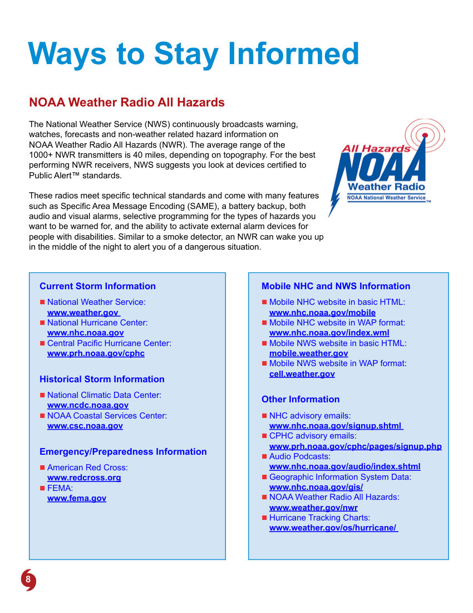

8
Ways to Stay Informed
NOAA Weather Radio All Hazards
 
The National Weather Service (NWS) continuously broadcasts warning, 
watches, forecasts and non-weather related hazard information on  
NOAA Weather Radio All Hazards (NWR). The average range of the  
1000+ NWR transmitters is 40 miles, depending on topography. For the best 
performing NWR receivers, NWS suggests you look at devices certified to 
Public Alert™ standards. 
These radios meet specific technical standards and come with many features 
such as Specific Area Message Encoding (SAME), a battery backup, both 
audio and visual alarms, selective programming for the types of hazards you 
want to be warned for, and the ability to activate external alarm devices for 
people with disabilities. Similar to a smoke detector, an NWR can wake you up 
in the middle of the night to alert you of a dangerous situation.
Current Storm Information

„ National Weather Service:  
www.weather.gov 

„ National Hurricane Center:  
www.nhc.noaa.gov

„ Central Pacific Hurricane Center:  
www.prh.noaa.gov/cphc
Historical Storm Information

„ National Climatic Data Center:	
 
www.ncdc.noaa.gov

„ NOAA Coastal Services Center:	
 
www.csc.noaa.gov
Emergency/Preparedness Information

„ American Red Cross:	
 
www.redcross.org

„ FEMA:	
 
www.fema.gov
Mobile NHC and NWS Information 

„ Mobile NHC website in basic HTML:  
www.nhc.noaa.gov/mobile

„ Mobile NHC website in WAP format:	
 
www.nhc.noaa.gov/index.wml

„ Mobile NWS website in basic HTML:  
mobile.weather.gov

„ Mobile NWS website in WAP format: 
cell.weather.gov
Other Information

„ NHC advisory emails: 
www.nhc.noaa.gov/signup.shtml 

„ CPHC advisory emails: 
www.prh.noaa.gov/cphc/pages/signup.php

„ Audio Podcasts: 
www.nhc.noaa.gov/audio/index.shtml

„ Geographic Information System Data:  
www.nhc.noaa.gov/gis/

„ NOAA Weather Radio All Hazards:  
www.weather.gov/nwr

„ Hurricane Tracking Charts: 
www.weather.gov/os/hurricane/

## Page 9

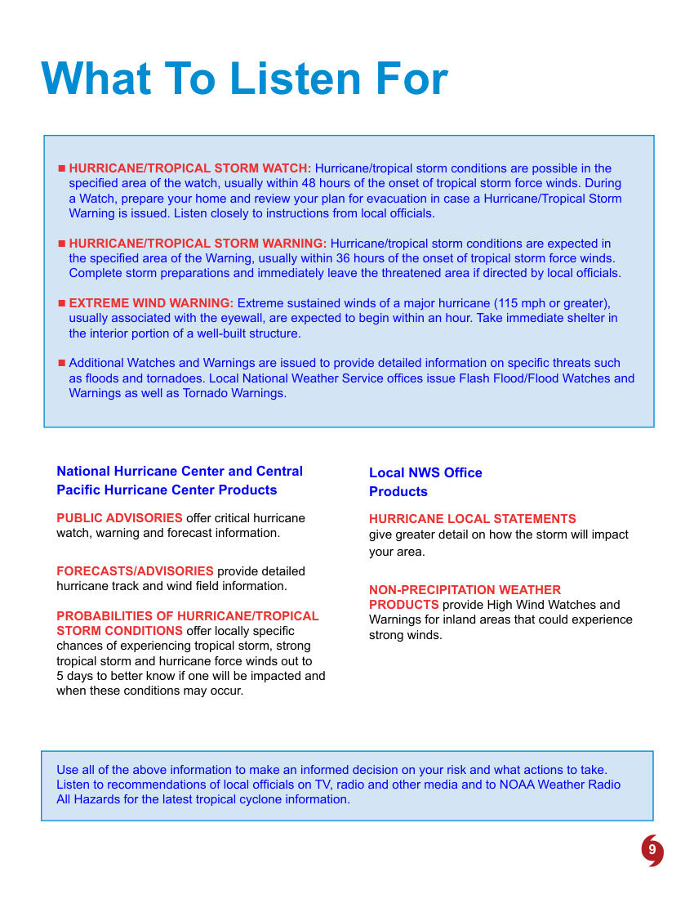

9
What To Listen For

„ HURRICANE/TROPICAL STORM WATCH: Hurricane/tropical storm conditions are possible in the 
specified area of the watch, usually within 48 hours of the onset of tropical storm force winds. During 
a Watch, prepare your home and review your plan for evacuation in case a Hurricane/Tropical Storm 
Warning is issued. Listen closely to instructions from local officials. 

„ HURRICANE/TROPICAL STORM WARNING: Hurricane/tropical storm conditions are expected in 
the specified area of the Warning, usually within 36 hours of the onset of tropical storm force winds. 
Complete storm preparations and immediately leave the threatened area if directed by local officials. 

„ EXTREME WIND WARNING: Extreme sustained winds of a major hurricane (115 mph or greater), 
usually associated with the eyewall, are expected to begin within an hour. Take immediate shelter in 
the interior portion of a well-built structure. 

„ Additional Watches and Warnings are issued to provide detailed information on specific threats such 
as floods and tornadoes. Local National Weather Service offices issue Flash Flood/Flood Watches and 
Warnings as well as Tornado Warnings.
National Hurricane Center and Central 
Pacific Hurricane Center Products 
PUBLIC ADVISORIES offer critical hurricane 
watch, warning and forecast information.
 
FORECASTS/ADVISORIES provide detailed 
hurricane track and wind field information.
PROBABILITIES OF HURRICANE/TROPICAL 
STORM CONDITIONS offer locally specific 
chances of experiencing tropical storm, strong 
tropical storm and hurricane force winds out to  
5 days to better know if one will be impacted and 
when these conditions may occur.
Local NWS Office  
Products
HURRICANE LOCAL STATEMENTS  
give greater detail on how the storm will impact 
your area.
NON-PRECIPITATION WEATHER 
PRODUCTS provide High Wind Watches and 
Warnings for inland areas that could experience 
strong winds.
Use all of the above information to make an informed decision on your risk and what actions to take.  
Listen to recommendations of local officials on TV, radio and other media and to NOAA Weather Radio  
All Hazards for the latest tropical cyclone information.

## Page 10

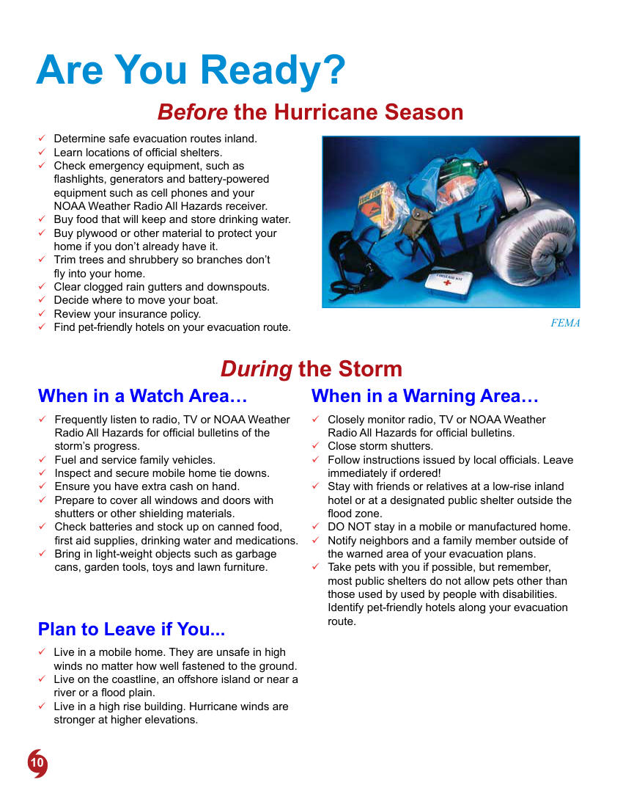

10
Are You Ready?
Before the Hurricane Season
FEMA
9
9 Determine safe evacuation routes inland.
9
9 Learn locations of official shelters.
9
9 Check emergency equipment, such as 
flashlights, generators and battery-powered 
equipment such as cell phones and your  
NOAA Weather Radio All Hazards receiver.
9
9 Buy food that will keep and store drinking water.
9
9 Buy plywood or other material to protect your 
home if you don’t already have it.
9
9 Trim trees and shrubbery so branches don’t  
fly into your home. 
9
9 Clear clogged rain gutters and downspouts.
9
9 Decide where to move your boat.
9
9 Review your insurance policy.
9
9 Find pet-friendly hotels on your evacuation route.
When in a Watch Area… 
9
9 Frequently listen to radio, TV or NOAA Weather 
Radio All Hazards for official bulletins of the 
storm’s progress.
9
9 Fuel and service family vehicles.
9
9 Inspect and secure mobile home tie downs.
9
9 Ensure you have extra cash on hand.
9
9 Prepare to cover all windows and doors with 
shutters or other shielding materials.
9
9 Check batteries and stock up on canned food, 
first aid supplies, drinking water and medications.
9
9 Bring in light-weight objects such as garbage 
cans, garden tools, toys and lawn furniture.
When in a Warning Area…
9
9 Closely monitor radio, TV or NOAA Weather 
Radio All Hazards for official bulletins.
9
9 Close storm shutters.
9
9 Follow instructions issued by local officials. Leave 
immediately if ordered!
9
9 Stay with friends or relatives at a low-rise inland 
hotel or at a designated public shelter outside the 
flood zone.
9
9 DO NOT stay in a mobile or manufactured home.
9
9 Notify neighbors and a family member outside of 
the warned area of your evacuation plans.
9
9 Take pets with you if possible, but remember, 
most public shelters do not allow pets other than 
those used by used by people with disabilities. 
Identify pet-friendly hotels along your evacuation 
route.
During the Storm
Plan to Leave if You...
9
9 Live in a mobile home. They are unsafe in high 
winds no matter how well fastened to the ground.
9
9 Live on the coastline, an offshore island or near a 
river or a flood plain.
9
9 Live in a high rise building. Hurricane winds are 
stronger at higher elevations.

## Page 11

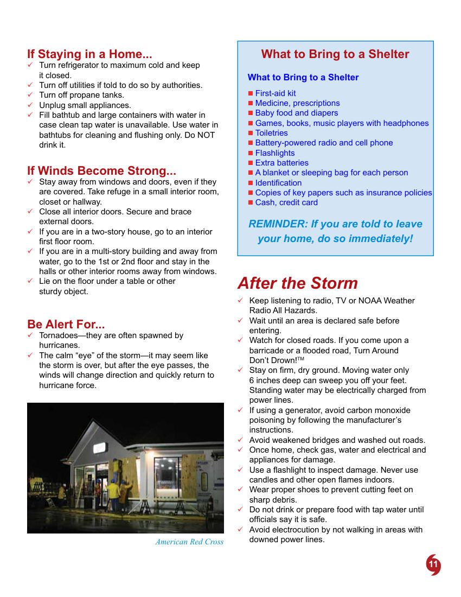

11
What to Bring to a Shelter
REMINDER: If you are told to leave 
your home, do so immediately!
What to Bring to a Shelter

„ First-aid kit

„ Medicine, prescriptions

„ Baby food and diapers

„ Games, books, music players with headphones

„ Toiletries

„ Battery-powered radio and cell phone

„ Flashlights

„ Extra batteries

„ A blanket or sleeping bag for each person

„ Identification

„ Copies of key papers such as insurance policies

„ Cash, credit card
If Staying in a Home...
9
9 Turn refrigerator to maximum cold and keep  
it closed.
9
9 Turn off utilities if told to do so by authorities.
9
9 Turn off propane tanks.
9
9 Unplug small appliances.
9
9 Fill bathtub and large containers with water in 
case clean tap water is unavailable. Use water in 
bathtubs for cleaning and flushing only. Do NOT 
drink it.  
If Winds Become Strong...
9
9 Stay away from windows and doors, even if they 
are covered. Take refuge in a small interior room, 
closet or hallway.
9
9 Close all interior doors. Secure and brace  
external doors.
9
9 If you are in a two-story house, go to an interior 
first floor room.
9
9 If you are in a multi-story building and away from 
water, go to the 1st or 2nd floor and stay in the 
halls or other interior rooms away from windows.
9
9 Lie on the floor under a table or other  
sturdy object.
Be Alert For...
9
9 Tornadoes­—they are often spawned by 
hurricanes.
9
9 The calm “eye” of the storm—it may seem like 
the storm is over, but after the eye passes, the 
winds will change direction and quickly return to 
hurricane force.
After the Storm
9
9 Keep listening to radio, TV or NOAA Weather 
Radio All Hazards.
9
9 Wait until an area is declared safe before 
entering.
9
9 Watch for closed roads. If you come upon a 
barricade or a flooded road, Turn Around  
Don’t Drown!TM 
9
9 Stay on firm, dry ground. Moving water only 
6 inches deep can sweep you off your feet. 
Standing water may be electrically charged from 
power lines. 
9
9 If using a generator, avoid carbon monoxide 
poisoning by following the manufacturer’s 
instructions.
9
9 Avoid weakened bridges and washed out roads.
9
9 Once home, check gas, water and electrical and 
appliances for damage.
9
9 Use a flashlight to inspect damage. Never use 
candles and other open flames indoors.
9
9 Wear proper shoes to prevent cutting feet on 
sharp debris.
9
9 Do not drink or prepare food with tap water until 
officials say it is safe.
9
9 Avoid electrocution by not walking in areas with 
downed power lines. 
American Red Cross

## Page 12

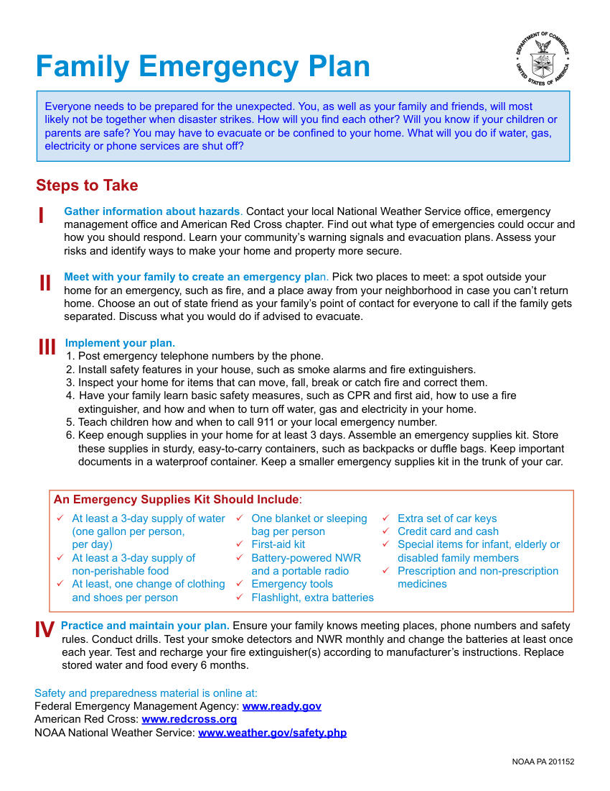

12
NOAA PA 201152 
Gather information about hazards. Contact your local National Weather Service office, emergency 
management office and American Red Cross chapter. Find out what type of emergencies could occur and 
how you should respond. Learn your community’s warning signals and evacuation plans. Assess your 
risks and identify ways to make your home and property more secure.
Meet with your family to create an emergency plan. Pick two places to meet: a spot outside your 
home for an emergency, such as fire, and a place away from your neighborhood in case you can’t return 
home. Choose an out of state friend as your family’s point of contact for everyone to call if the family gets 
separated. Discuss what you would do if advised to evacuate.
Implement your plan. 
1. Post emergency telephone numbers by the phone.
2. Install safety features in your house, such as smoke alarms and fire extinguishers.
3. Inspect your home for items that can move, fall, break or catch fire and correct them.
4.	 Have your family learn basic safety measures, such as CPR and first aid, how to use a fire
    extinguisher, and how and when to turn off water, gas and electricity in your home.
5. Teach children how and when to call 911 or your local emergency number.
6. Keep enough supplies in your home for at least 3 days. Assemble an emergency supplies kit. Store
    these supplies in sturdy, easy-to-carry containers, such as backpacks or duffle bags. Keep important
    documents in a waterproof container. Keep a smaller emergency supplies kit in the trunk of your car.
Family Emergency Plan
Practice and maintain your plan. Ensure your family knows meeting places, phone numbers and safety 
rules. Conduct drills. Test your smoke detectors and NWR monthly and change the batteries at least once 
each year. Test and recharge your fire extinguisher(s) according to manufacturer’s instructions. Replace 
stored water and food every 6 months. 
9
9 At least a 3-day supply of water 
(one gallon per person,  
per day)
9
9 At least a 3-day supply of  
non-perishable food
9
9 At least, one change of clothing 
and shoes per person
9
9 One blanket or sleeping 
bag per person
9
9 First-aid kit
9
9 Battery-powered NWR 
and a portable radio
9
9 Emergency tools
9
9 Flashlight, extra batteries
An Emergency Supplies Kit Should Include:
9
9 Extra set of car keys
9
9 Credit card and cash
9
9 Special items for infant, elderly or 
disabled family members
9
9 Prescription and non-prescription 
medicines 
Everyone needs to be prepared for the unexpected. You, as well as your family and friends, will most 
likely not be together when disaster strikes. How will you find each other? Will you know if your children or 
parents are safe? You may have to evacuate or be confined to your home. What will you do if water, gas, 
electricity or phone services are shut off?
Steps to Take
I
II
III
IV
Safety and preparedness material is online at:
Federal Emergency Management Agency: www.ready.gov
American Red Cross: www.redcross.org
NOAA National Weather Service: www.weather.gov/safety.php
