# El Niño/La Niña/ENSO Stuff ***CPC website***

> Source: <https://www.cpc.ncep.noaa.gov/products/precip/CWlink/MJO/enso.shtml#forecast>  
> Section: El Niño/La Niña/ENSO/MJO Stuff  
> Captured: 2026-08-19 06:00 UTC  
> PDF: [el-nino-la-nina-enso-stuff-cpc-website.pdf](el-nino-la-nina-enso-stuff-cpc-website.pdf) · Original HTML: [source/original.html](source/original.html)

---

[www.weather.gov](https://www.weather.gov/)

|  |  |  |  |
| --- | --- | --- | --- |
|  |  |  | [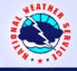](https://www.weather.gov/) |
|  |

[home](https://www.cpc.ncep.noaa.gov/ "to the climate prediction center home page")

[Site Map](https://www.cpc.ncep.noaa.gov/products/site_index.shtml "to Climate Prediction Center site map")

[News](https://www.weather.gov/news/ "to National Weather Service news page")

[Organization](https://www.weather.gov/organization/)

Search  

Search

[Climate Outlooks](https://www.cpc.ncep.noaa.gov/products/forecasts/)

[Climate & Weather Link](https://www.cpc.ncep.noaa.gov/products/precip/CWlink/MJO/climwx.shtml)
   [El Niño/La Niña](el-nino-la-nina-enso-stuff-cpc-website.md)
   [MJO](https://www.cpc.ncep.noaa.gov/products/precip/CWlink/MJO/mjo.shtml)
   [Teleconnections](https://www.cpc.ncep.noaa.gov/products/precip/CWlink/daily_ao_index/teleconnections.shtml)
       [AO](https://www.cpc.ncep.noaa.gov/products/precip/CWlink/daily_ao_index/ao.shtml)
       [NAO](https://www.cpc.ncep.noaa.gov/products/precip/CWlink/pna/nao.shtml)
       [PNA](https://www.cpc.ncep.noaa.gov/products/precip/CWlink/pna/pna.shtml)
       [AAO](https://www.cpc.ncep.noaa.gov/products/precip/CWlink/daily_ao_index/aao/aao.shtml)
   [Blocking](https://www.cpc.ncep.noaa.gov/products/precip/CWlink/MJO/block.shtml)
   [Storm Tracks](https://www.cpc.ncep.noaa.gov/products/precip/CWlink/stormtracks/mstrack.shtml)

[Climate Glossary](https://www.cpc.ncep.noaa.gov/products/outreach/glossary.shtml)

[Outreach](https://www.cpc.ncep.noaa.gov/products/outreach/)

About Us
   [Our Mission](https://www.cpc.ncep.noaa.gov/information/who_we_are/mission.shtml)
   [Who We Are](https://www.cpc.ncep.noaa.gov/information/who_we_are/index.shtml)

Contact Us
   [Web Team](https://www.cpc.ncep.noaa.gov/comment-form.php)

[**HOME**](https://www.cpc.ncep.noaa.gov/) > [Climate & Weather Linkage](https://www.cpc.ncep.noaa.gov/products/precip/CWlink/MJO/climwx.shtml) > El Niño / Southern Oscillation (ENSO)

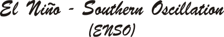

- [**Current Conditions**](#current)
- [**Historical Information**](#history)
- [**Outlooks**](#forecast)
- [**Expert Discussions/Assessments**](#discussion)
- [**Diagnostic and Attribution Tools**](#composite)
- [**Educational Materials**](#educational material)
- [**References**](#references)

---

- **Current Conditions**

**Note:** Move cursor over product name to display the graphic.

Animations

[Sea Surface Temperatures (SST)](https://www.cpc.ncep.noaa.gov/products/analysis_monitoring/enso_update/sstanim.shtml "Tropical Pacific Sea Surface Temperatures Animation")

[SST Anomalies - Tropical Pacific](https://www.cpc.ncep.noaa.gov/products/analysis_monitoring/enso_update/sstanim.shtml "Tropical Pacific Sea Surface Temperatures Anomalies Animation")

[T-Depth Anomalies - Equatorial Pacific](https://www.cpc.ncep.noaa.gov/products/analysis_monitoring/enso_update/wkxzteq.shtml "Equatorial Pacific Temperature Depth Anomalies Animation")

Tropical Outgoing Longwave Radiation (OLR) & Winds (Last 30 Days)

[OLR Anomalies](https://www.cpc.ncep.noaa.gov/products/analysis_monitoring/enso_update/olra-30d.gif "Time longitude section of Anomalous OLR")

[850hPa Wind Anomalies](https://www.cpc.ncep.noaa.gov/products/analysis_monitoring/enso_update/uv850-30d.gif "850hPa Wind Anomalies")

[200hPa Wind Anomalies](https://www.cpc.ncep.noaa.gov/products/analysis_monitoring/enso_update/uv200-30d.gif "2000hPa Wind Anomalies")

Sea Surface Temperatures (SST)

[Weekly Anomalies](https://www.cpc.ncep.noaa.gov/products/analysis_monitoring/enso_update/sstweek_c.gif "Weekly Sea Surface Temperatures anomalies")

[Niño Regions Anomalies](https://www.cpc.ncep.noaa.gov/products/analysis_monitoring/enso_update/ssta_c.gif "Time series of weekly sea surface temperatures anomalies for the 4 Niño regions")

[Anomalies (5oN-5oS)](https://www.cpc.ncep.noaa.gov/products/analysis_monitoring/enso_update/ssttlon5_c.gif "Time longitude section of Sea Surface Temperatures Anomalies (5 degrees North to 5 degrees South)")

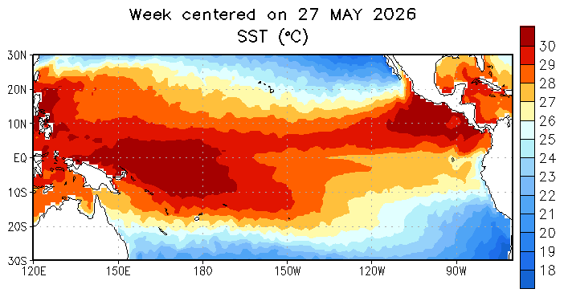

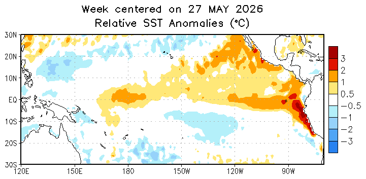

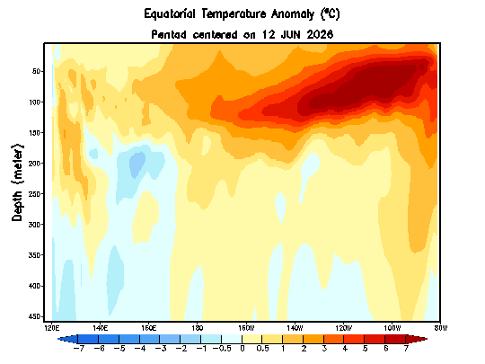

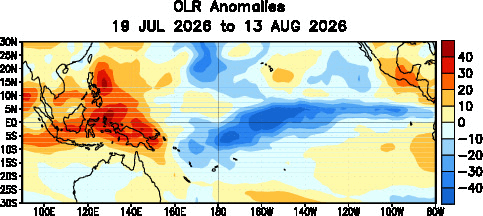

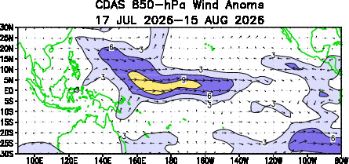

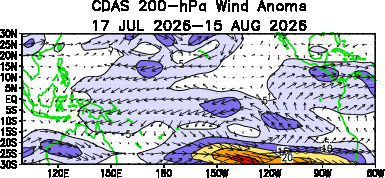

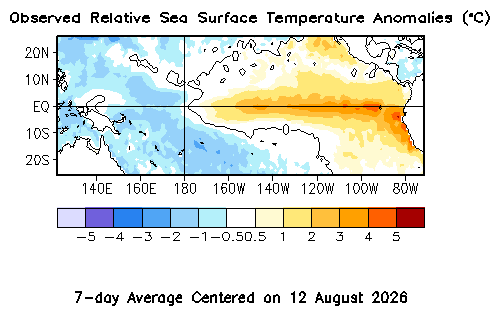

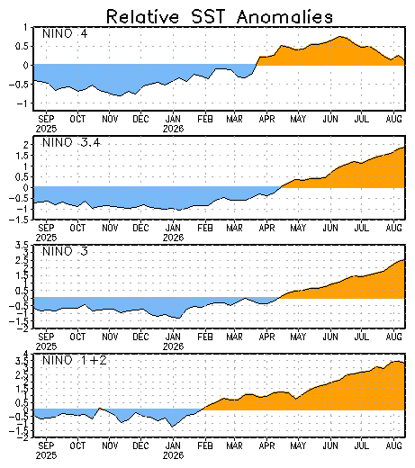

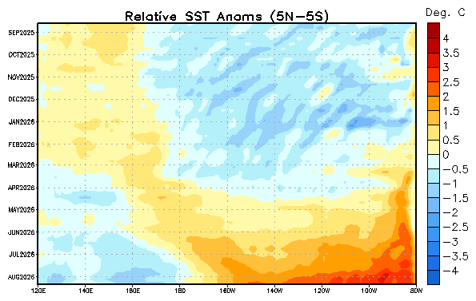

- [**SST Animation**](https://www.cpc.ncep.noaa.gov/products/analysis_monitoring/enso_update/sstanim.shtml) - Tropical Pacific
- [**SST Animation**](https://www.cpc.ncep.noaa.gov/products/analysis_monitoring/enso_update/gsstanim.shtml) - Global
- [**T-Depth Animation**](https://www.cpc.ncep.noaa.gov/products/analysis_monitoring/enso_update/wkxzteq.shtml) - Equatorial Pacific

**Outgoing Longwave Radiation (OLR)**

[Pentad mean and anomalous OLR](https://www.cpc.ncep.noaa.gov/products/analysis_monitoring/enso_update/polr_c.gif)

[Time-longitude section of anomalous OLR](https://www.cpc.ncep.noaa.gov/products/analysis_monitoring/enso_update/olra_c.gif)

[Last 30 day average of anomalous OLR](https://www.cpc.ncep.noaa.gov/products/analysis_monitoring/enso_update/olra_last30days-hr.png)

**850-hPa Zonal Wind**

[Time-longitude Section (CORE data)](https://www.cpc.ncep.noaa.gov/products/analysis_monitoring/enso_update/u850_c.gif)

[Time-longitude Section (Anomalous)](https://www.cpc.ncep.noaa.gov/products/analysis_monitoring/enso_update/u850a_c.gif)

**Sea Surface Temperature (SST)**

[Weekly SST Anomalies](https://www.cpc.ncep.noaa.gov/products/analysis_monitoring/enso_update/sstweek_c.gif)

[Time-longitude section of SST anomalies (5oN-5oS)](https://www.cpc.ncep.noaa.gov/products/analysis_monitoring/enso_update/ssttlon5_c.gif)

[Time series of weekly SST anomalies for the 4 Niño regions](https://www.cpc.ncep.noaa.gov/products/analysis_monitoring/enso_update/ssta_c.gif)

[Time series of weekly SST and Climatology for the 4 Niño
regions](https://www.cpc.ncep.noaa.gov/products/analysis_monitoring/enso_update/sst_c.gif)

[Most recent Monthly SST Anomalies](https://www.cpc.ncep.noaa.gov/products/analysis_monitoring/enso_update/Monthly_RelSSTA_map-hr.png)

[Time series of monthly SST anomalies for the 4 Niño regions](https://www.cpc.ncep.noaa.gov/products/analysis_monitoring/enso_update/rel_nino_month-hr.png)

**Subsurface Tropical Pacific Ocean Analyses**

(Click [**NCEP's Global Ocean Data Assimilation System**](https://www.cpc.ncep.noaa.gov/products/GODAS/) for more Information)

[Mean and anomalous equatorial temperatures](https://www.cpc.ncep.noaa.gov/products/analysis_monitoring/ocean/weeklyenso_clim_81-10/wkteq_xz.gif)

[Equatorial depth of the 20oC isotherm](https://www.cpc.ncep.noaa.gov/products/analysis_monitoring/ocean/weeklyenso_clim_81-10/wkd20eq2.gif)

[Anomalous equatorial depth of the 20oC isotherm](https://www.cpc.ncep.noaa.gov/products/analysis_monitoring/ocean/weeklyenso_clim_81-10/wkd20eq2_anm.gif)

[Equatorial 55 meter depth temperature anomalies](https://www.cpc.ncep.noaa.gov/products/analysis_monitoring/ocean/weeklyenso_clim_81-10/wkteq2_anm_55m.gif)

[Equatorial 105 meter depth temperature anomalies](https://www.cpc.ncep.noaa.gov/products/analysis_monitoring/ocean/weeklyenso_clim_81-10/wkteq2_anm_105m.gif)

[Equatorial 155 meter depth temperature anomalies](https://www.cpc.ncep.noaa.gov/products/analysis_monitoring/ocean/weeklyenso_clim_81-10/wkteq2_anm_155m.gif)

[Sea level anomalies](https://www.cpc.ncep.noaa.gov/products/analysis_monitoring/ocean/weeklyenso_clim_81-10/wksl_anm.gif)

[Equatorial Upper-Ocean Temperature Anomalies](https://www.cpc.ncep.noaa.gov/products/analysis_monitoring/enso_update/heat-last-year-hr.png)

[Most recent pentad of anomalous equatorial temperatures](https://www.cpc.ncep.noaa.gov/products/analysis_monitoring/enso_update/zlon_last-hr.png)

[[Back to the Top]](#list)

- **Historical**

- [Historical El Nino/ La Nina episodes (1950–present)](https://www.cpc.ncep.noaa.gov/products/analysis_monitoring/enso/roni/)
- [Equatorial Upper-Ocean Heat Content Anomalies(1979–present)](https://www.cpc.ncep.noaa.gov/products/analysis_monitoring/ocean/index/heat_content_index.txt)

- **Outlooks**

- [Official NOAA CPC ENSO Outlook](https://www.cpc.ncep.noaa.gov/products/analysis_monitoring/enso/roni/outlook/)
- [Official NOAA CPC ENSO Probabilities](https://www.cpc.ncep.noaa.gov/products/analysis_monitoring/enso/roni/probabilities/)
- [Official NOAA CPC ENSO Strength Probabilities](https://www.cpc.ncep.noaa.gov/products/analysis_monitoring/enso/roni/strengths/)
- [Seasonal CFSv2 SST Outlook](https://www.cpc.ncep.noaa.gov/products/CFSv2/cfsv2fcst/CFSv2SST8210.html)

[[Back to the Top]](#list)

- **Expert Discussions/Assessments**

- [**Weekly ENSO Evolution, Status, and Prediction Presentation (PDF)**](https://www.cpc.ncep.noaa.gov/products/analysis_monitoring/lanina/enso_evolution-status-fcsts-web.pdf)  
- [**Weekly ENSO Evolution, Status, and Prediction Presentation (powerpoint)**](https://www.cpc.ncep.noaa.gov/products/analysis_monitoring/lanina/enso_evolution-status-fcsts-web.ppt) 
- [**Weekly Global Tropics Benefits/ Hazards Assessment**](https://www.cpc.ncep.noaa.gov/products/precip/CWlink/ghazards/ghaz.shtml)
- [Monthly El Niño/La Niña Diagnostics Discussion](https://www.cpc.ncep.noaa.gov/products/analysis_monitoring/enso_advisory/)
- Monthly Climate Diagnostics Bulletin: [**Current**](https://www.cpc.ncep.noaa.gov/products/CDB/)   [Archive](https://www.cpc.ncep.noaa.gov/products/CDB/CDB_Archive_html/CDB_archive.shtml)

[[Back to the Top]](#list)

- **Diagnostic and Attribution Tools**

- [U.S. Temperature, Precipitation, and Snowfall Impacts based on historical ENSO episodes (seasonal)](https://www.cpc.ncep.noaa.gov/products/precip/CWlink/ENSO/composites/)
- [Global Temperature and Precipitation Linear Regressions and Correlations](https://www.cpc.ncep.noaa.gov/products/precip/CWlink/ENSO/regressions/) 

[[Back to the Top]](#list)

- **Educational Material**

Frequently asked questions area available to help the public better understand the climate system and how climate
patterns in far off places affect our weather patterns.

- **Fact Sheets**

- [**El Niño/La Niña**](https://www.cpc.ncep.noaa.gov/products/analysis_monitoring/ensostuff/prelude_to_ensofaq.shtml) - Frequently Asked Questions on El Niño/La Niña.
- [**El Niño/La Niña Cycle (Tutorial)**](https://www.cpc.ncep.noaa.gov/products/analysis_monitoring/ensocycle/enso_cycle.shtml) - El Niño/La Niña Tutorial.
- [**El Niño and Climate Impacts**](https://www.cpc.ncep.noaa.gov/products/analysis_monitoring/impacts/warm_impacts.shtml) - Technical discussion of El Niño's oceanic and atmospheric conditions and their global climate impacts.
- [**La Niña and Climate Impacts**](https://www.cpc.ncep.noaa.gov/products/analysis_monitoring/lanina/cold_impacts.shtml) - Technical discussion of La Niña's oceanic and atmospheric conditions and their global climate impacts.
- [**SST Niño Regions**](https://www.cpc.ncep.noaa.gov/products/analysis_monitoring/ensostuff/nino_regions.shtml) - Graphical depiction of the regions (i.e. "NINO Boxes") most commonly used in the diagnosis and forecast of El Nino.
- [**Other El Niño Links**](https://www.cpc.ncep.noaa.gov/products/outreach/othermat.shtml) - Links to the most informative El Niño/La Niña links on the web.

- **Monographs** - The Office of Global Programs together with the University
  Consortium on Atmospheric Research in consultation with CPC and others produces a series of monographs written for the layperson called Reports to the Nation on Our Changing
  Planet. These monographs are used by many science teachers in their earth sciences classes.

- [**El Nino and Climate Prediction**](http://www.nws.noaa.gov/cgi-bin/nwsexit.pl?url=http://www.atmos.washington.edu/gcg/RTN/rtnt.html)
- [**Our Changing Climate (text format)**](http://www.nws.noaa.gov/cgi-bin/nwsexit.pl?url=http://www.atmos.washington.edu/~dennis/rtn.html)
- [**Our Ozone Shield**](http://www.oar.noaa.gov/climate/t_ozonelayer.html)

[[Back to the Top]](#list)

- **References**

Barnston, A.G., C. F. Ropelewski, 1992: Prediction of ENSO episodes using canonical correlation analysis. J. Climate, 5, 1316-1345.

Barnston, A.G., M. Chelliah and S.B. Goldenberg, 1997: Documentation of a highly ENSO-related SST region in the equatorial Pacific. Atmosphere-Ocean, 35, 367-383.

Barnston, A. G., M. H. Glantz, and Y. He, 1999: Predictive skill of statistical and dynamical climate models in SST forecasts during the 1997-98 El Nino episode and the 1998 LNa Nina onset. Bull. Am. Met. Soc., 80, 217-243.

Halpert, M. S. and C. F. Ropelewski, 1992: Surface temperature patterns associated with the Southern Oscillation. J. Climate, 5, 577-593.

Higgins, R.W., Y. Zhou and H.-K. Kim, 2001: Relationships between El Nino-Southern
Oscillation and the Arctic Oscillation: A Climate-Weather Link. NCEP/Climate Prediction Center ATLAS 8.

Higgins, R. W., V. E. Kousky, H.-K. Kim, W. Shi, and D. Unger, 2002: High frequency and trend adjusted composites of United States temperature and precipitation by ENSO phase, NCEP/Climate Prediction Center ATLAS No. 10, 22 pp.

Hoerling, M. P., and A. Kumar. 1997. Why do North American climate anomalies differ from one El Nino event to another? Geophysical Research Letters, 24 (1 May): 1059-1062.

Hoerling, M. P., and A. Kumar, 1997: Origins of extreme climate states during the 1982-83 ENSO winter. J. Climate, 10, 2859-2870.

Hoerling, M. P., and A. Kumar, 2000: Understanding and predicting extratropical teleconnections related to ENSO. In El Niño and the Southern Oscillation: Multi-scale Variationsnd Global and Regional Impacts, H.F. Diaz and V. Markgraf (Eds.), Cambridge University Press, 57-88.

Hoerling, M. P., A. Kumar, and T. Xu, 2001: Robustness of the nonlinear climate response to ENSO's extreme phases. J. Climate, 14, 1277-1293.

Kousky, V.E., M.T. Kayano, and I.F.A Cavalcanti, 1984: The Southern Oscillation:
Oceanic-atmospheric circulation changes and related rainfall anomalies. Tellus, 36A, 490-504.

Kousky, V. E. 1997. Warm (El Nino) episode conditions return to the tropical Pacific. Mariners Weather Log 41, no.1 (Spring): 4-7.

Kousky, V. E. and R. W. Higgins, 2004: An Alert Classifications System for
Monitoring and Assessment of the ENSO Cycle, *Wea and Forecasting*, **22**, 353-371

Kumar, A., and M. P. Hoerling, 1997: Interpretation and implications of observed inter-El Niño variability. J. Climate, 10, 83-91.

Kumar, A., and M. P. Hoerling, 1998: Annual cycle of Pacific/North American seasonal predictability associated with different phases of ENSO. J. Climate, 11, 3295-3308.

Kumar, A., A. Barnston, P. Peng, M. P. Hoerling, and L. Goddard, 2000: Changes in the spread of the seasonal mean atmospheric states associated with ENSO. J. Climate, 13, 3139-3151.

Kumar, A., and M. P. Hoerling, 2003: The nature and causes for the delayed atmospheric response to El Niño. J. Climate, 16, 1391-1403.

Leetma, Ants. 1989. The interplay of El Nino and La Nina. Oceanus, 32 (Summer) : 30-3434

Leetmaa, A. 1999: The first El Niño observed and forecasted from start to finish. Bull. Am. Met. Soc., 80, 111-112.

Rasmusson, E. M. and T. H. Carpenter, 1982: Variations in tropical sea surface temperature and surface wind fields associated with the Southern Oscillation / El. Nino. Mon. Wea. Rev., 110, 354-384.

Rasmusson, E. M., T. H. Carpenter, 1983: The relationship between eastern equatorial Pacific sea surface temperatures and rainfall over India and Sri Lanka. Mon. Wea. Rev., 111, 517-528.

Rasmusson, E. M., and J. M. Wallace, 1983: Meteorological aspects of El Nino / Southern Oscillation. Science, 222, 1195-1202.

Rasmusson, E. M. and K. Mo, 1993: Linkages between 200-mb tropical and extratropical circulation anomalies during the 1986-1989 ENSO cycle. J. Climate, 6, 595-616.

Ropelewski, C. F., and M. S. Halpert, 1986: North American precipitation and temperature patterns associated with the El Nino/ Southern Oscillation (ENSO). Mon. Wea. Rev., 114, 2352-2362.

Ropelewski, C. F., and M. S. Halpert ,1987: Global and regional scale precipitation patterns associated with the El Nino/ Southern Oscillation. Mon. Wea. Rev., 115, 1606-1626.

Ropelewski, C.F. and P.D. Jones, 1987: An extension of the Tahiti-Darwin Southern Oscillation Index. Mon. Wea. Rev, 115, 2161-2165.

Ropelewski, C. F., and M. S. Halpert, 1989: Precipitation patterns associated with the
high index phase of the Southern Oscillation. J. Climate, 2, 268-284.

Ropelewski, C. F., and M. S. Halpert, 1996: Quantifying Southern Oscillation-precipitation relationships. J. Climate, 9, 1043-1059.

Xue, Y. and A. Leetmaa, 2000: Forecast of tropical pacific SST and sea level using a Markov model. accepted by Geophys. Res. Lett.

Xue, Y., A. Leetmaa, and M. Ji, 2000: ENSO prediction with Markov models: the impact of sea level. J. Climate, 13, 849-871.

[[Back to the Top]](#list)

---

[NOAA/](http://www.noaa.gov/)
[National Weather Service](http://www.nws.noaa.gov/)
[National Centers for Environmental Prediction](http://www.ncep.noaa.gov/)
Climate Prediction Center
5830 University Research Court
Riverdale Park, MD 20737
Page Author: [Climate Prediction Center Internet Team](https://www.cpc.ncep.noaa.gov/comment-form.html)
Page last modified: December 12, 2005

[Disclaimer](http://www.weather.gov/disclaimer.php)
[Information Quality](http://www.cio.noaa.gov/Policy_Programs/info_quality.html)
[Credits](http://www.nws.noaa.gov/credits.php)
[Glossary](http://www.nws.noaa.gov/glossary/)

[Privacy Policy](http://www.weather.gov/privacy.php)
[Freedom of Information Act (FOIA)](http://www.rdc.noaa.gov/%7Efoia/)
[About Us](http://www.nws.noaa.gov/admin.php)
[Career Opportunities](http://www.nws.noaa.gov/careers.php)
