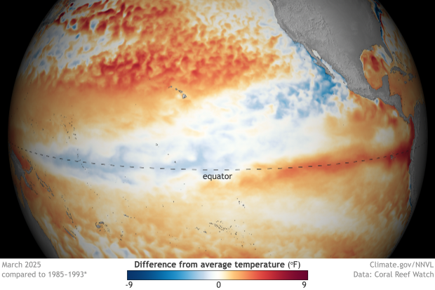
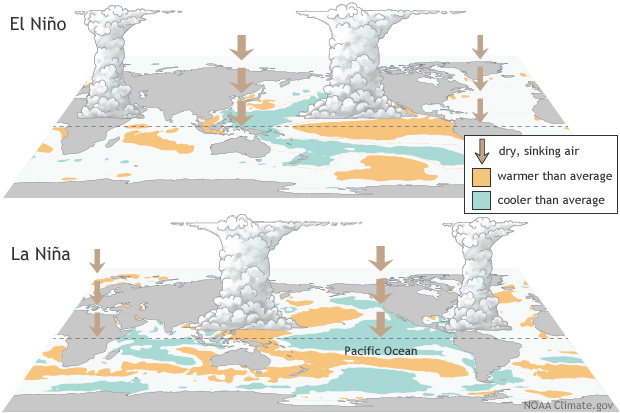
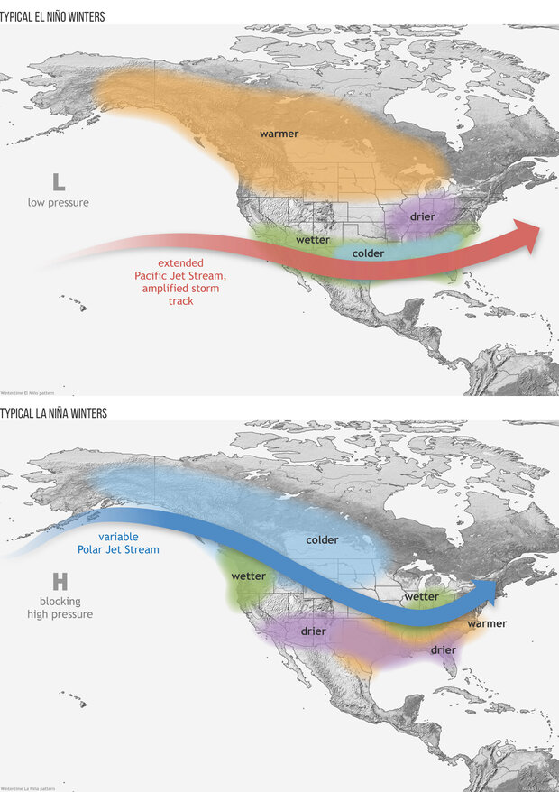
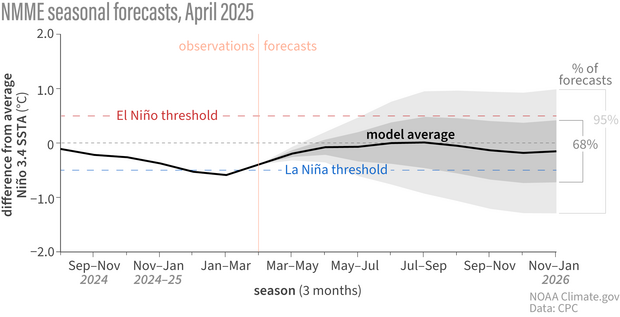
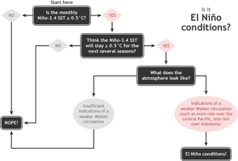
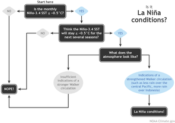

# El Niño/La Niña/ENSO Stuff (https://www.climate.gov/enso)

> Source: <https://www.climate.gov/enso>  
> Section: El Niño/La Niña/ENSO/MJO Stuff  
> Captured: 2026-08-19 06:00 UTC  
> PDF: [el-nino-la-nina-enso-stuff-https-www-climate-gov-enso.pdf](el-nino-la-nina-enso-stuff-https-www-climate-gov-enso.pdf) · Original HTML: [source/original.html](source/original.html)

---

[Skip to main content](#main-content)

Menu

/\*\*\*\*\*\*\* mobile menu fix
\*\*\*\*\*\*\*\*\*\*\*\*\*\*\*\*\*\*\*\*\*\*\*\*\*\*\*\*\*\*\*/
.socialmedia-search-bar {
bottom: auto !important;
}
/\*\*\*\*\*\*\*\*\*\*\*\*\*\*\*\*\*\*\*\*\*\*\*\*\*\*\*\*\*\*\*/
.region-breadcrumb,
.alert[class\*='mb-'] {
margin-bottom: 0 !important;
}
.region-breadcrumb .breadcrumb li {
font-family: "Source Sans 3", "Source Sans Pro", Arial, sans-serif;
font-size: 14px;
}
.featured-content,
h1[class\*='--block-heading'],
h2[class\*='--block-heading'],
h3[class\*='--block-heading'],
h4[class\*='--block-heading'],
h5[class\*='--block-heading'],
h6[class\*='--block-heading'],
.text-formatted h1,
.text-formatted h2,
.text-formatted h3,
.text-formatted h4,
.text-formatted h5,
.text-formatted h6,
h1 {
margin-top: 0 !important;
margin-bottom: 30px !important;
}
@media (max-width: 767px) {
.featured-content,
h1[class\*='--block-heading'],
h2[class\*='--block-heading'],
h3[class\*='--block-heading'],
h4[class\*='--block-heading'],
h5[class\*='--block-heading'],
h6[class\*='--block-heading'],
.text-formatted h1,
.text-formatted h2,
.text-formatted h3,
.text-formatted h4,
.text-formatted h5,
.text-formatted h6,
h1 {
margin-bottom: 15px !important;
}
}
/\*\*\*\*\*\*\*
The base font size is 10px, which needs to be corrected
\*\*\*\*\*\*\*/
/\*\*\*\*\*
h1,
h2.style-as-h1,
h3.style-as-h1,
h4.style-as-h1,
h5.style-as-h1,
h6.style-as-h1 {
font-size: clamp(2rem, 1.1372rem + 2.439vw, 4rem) !important;
font-weight: 700 !important;
line-height: 1.35 !important;
}
h2,
h1.style-as-h2,
h3.style-as-h2,
h4.style-as-h2,
h5.style-as-h2,
h6.style-as-h2 {
font-size: clamp(1.8rem, 1.1372rem + 2.439vw, 3rem) !important;
font-weight: 700 !important;
line-height: 1.45 !important;
}
h3,
h1.style-as-h3,
h2.style-as-h3,
h4.style-as-h3,
h5.style-as-h3,
h6.style-as-h3 {
font-size: clamp(1.8rem, 1.1372rem + 2.439vw, 2.4rem) !important;
font-weight: 700 !important;
line-height: 1.55 !important;
}
\*\*\*\*\*/
[id=main-content] {
padding-top: 30px !important;
}
[id=main-content] p {
margin-top: 0 !important;
margin-bottom: 30px !important;
}
.region-help {
margin-top: 30px;
}
.region-help p {
font-size: 15px;
text-align: center;
}
.region-help .alert-danger p a {
color: #721c24;
text-decoration: underline;
}
.region-help .alert-danger p a:hover {
text-decoration: none;
}
.region-help .alert-danger p:last-of-type {
margin: 0;
}
[id=main-content] .text-formatted p a:not(.button-clg):not(.button-blue--open),
[id=main-content] .text-formatted li a:not(.button-clg):not(.button-blue--open),
[id=main-content] .usa-accordion p a:not(.button-clg):not(.button-blue--open),
[id=main-content] .usa-accordion li a:not(.button-clg):not(.button-blue--open) {
text-decoration: underline !important;
}
[id=main-content] .text-formatted p a:not(.button-clg):not(.button-blue--open):hover,
[id=main-content] .text-formatted li a:not(.button-clg):not(.button-blue--open):hover,
[id=main-content] .usa-accordion p a:not(.button-clg):not(.button-blue--open):hover,
[id=main-content] .usa-accordion li a:not(.button-clg):not(.button-blue--open):hover {
text-decoration: none !important;
}
[id=main-content] .text-formatted hr {
margin-top: 30px !important;
margin-bottom: 30px !important;
border-top: 1px solid rgba(0, 0, 0, 0.15) !important;
}
.button-blue--open {
padding: 8px 16px;
background: transparent;
border: 1px solid #0071bc !important;
border-radius: 10px;
color: #0071bc !important;
font-weight: 600;
text-decoration: none;
line-height: normal !important;
display: inline-block;
transition: all 0.15s ease-out !important;
}
.button-blue--open:hover {
background: #0071bc;
color: white !important;
text-decoration: none !important;
}
.featured-content\_\_metadata,
.featured-hero\_\_metadata {
margin-top: 8px;
}
.metadata\_\_item--category:not(:first-of-type),
.metadata\_\_item--published:not(:first-of-type),
.metadata\_\_item--updated:not(:first-of-type),
.metadata\_\_item--comments:not(:first-of-type),
.metadata\_\_item--section:not(:first-of-type),
.metadata\_\_item--author:not(:first-of-type),
.metadata\_\_item--reviewer:not(:first-of-type),
.metadata\_\_item--source:not(:first-of-type) {
margin-left: 18px;
position: relative;
}
.metadata .metadata\_\_item--inline:not(:first-of-type):before,
.page--climate-data-primer .dataset\_\_metadata--item .metadata\_\_item--inline:not(:first-of-type):before {
content: "";
width: 1px;
height: 13px;
padding: 0;
background: rgba(0, 0, 0, 0.25);
position: absolute;
top: 2px;
left: -11px;
}
figcaption,
.figure\_\_credit,
.figure\_\_caption,
.field--name-field-media-caption {
border-color: rgba(0, 0, 0, 0.15) !important;
}
figcaption p,
.figure\_\_credit p,
.figure\_\_caption p,
.field--name-field-media-caption p {
margin-top: 0 !important;
margin-bottom: 15px !important;
}
figcaption p:last-of-type,
.figure\_\_credit p:last-of-type,
.figure\_\_caption p:last-of-type,
.field--name-field-media-caption p:last-of-type {
margin-bottom: 0 !important;
}
.top-50-50 {
display: flex;
}
.top-50-50--text {
flex: 0 0 50%;
max-width: 50%;
}
.top-50-50--text p {
margin-top: 0;
}
figure.align-left {
max-width: 50%;
margin-right: 30px !important;
margin-bottom: 0 !important;
}
.field--name-field-media-caption {
margin-bottom: 0 !important;
padding-bottom: 0 !important;
border: none !important;
}
.img-width-100 img,
.img-width-100 figure img {
width: 100%;
}
.img-width-75 img,
.img-width-75 figure img {
width: 75%;
}
.img-width-50 img,
.img-width-50 figure img {
width: 50%;
}
.ghg-news-item:not(:last-of-type) {
margin-bottom: 30px;
}
.ghg-news-item h3,
.ghg-news-item h4 {
margin-bottom: 10px !important;
}
.ghg-news-item h3 a,
.ghg-news-item h4 a {
text-decoration: underline !important;
}
.ghg-news-item h3 a:hover,
.ghg-news-item h4 a:hover {
text-decoration: none !important;
}
.ghg-news-item p:last-of-type {
margin: 0 !important;
}
.ghg-news-item--featured {
margin-bottom: 30px;
padding: 30px;
border: 1px solid rgba(0, 0, 0, 0.15);
}
.ghg-news-item--featured img {
margin: 0 auto;
}
.ghg-news-item--padding {
padding: 0 30px;
}
.ghg-report-item {
margin-bottom: 30px;
padding-bottom: 10px;
border-bottom: 1px solid rgba(0, 0, 0, 0.075);
}
.ghg-report-item h3 {
margin-bottom: 15px !important;
}
.ghg-report-item--last {
padding-bottom: 0;
border: none;
}
@media (max-width: 991px) {
[id=main-content] {
padding-top: 15px !important;
}
/\*\*\*\*\*\*\*
mobile blog article reorder fix
\*\*\*\*\*\*\*\*\*\*\*\*\*\*\*\*\*\*\*\*\*\*\*\*\*\*\*\*\*\*\*/
.page-node-type-blog-article .page--blog-articleblog-article [id=main-content] .main-content > .container > .row {
flex-direction: column-reverse;
}
.page-node-type-blog-article .page--blog-articleblog-article [id=main-content] .main-content > .container > .row .content {
margin-bottom: 45px;
}
/\*\*\*\*\*\*\*\*\*\*\*\*\*\*\*\*\*\*\*\*\*\*\*\*\*\*\*\*\*\*\*/
.region-help {
margin-top: 15px;
}
[id=main-content] .text-formatted hr {
margin-top: 15px !important;
margin-bottom: 15px !important;
}
.ghg-news-item:not(:last-of-type) {
margin-bottom: 15px;
}
.ghg-news-item--featured {
margin-top: 15px;
margin-bottom: 15px;
padding: 15px;
}
.ghg-news-item--padding {
padding: 0 15px;
}
.ghg-report-item {
padding-bottom: 15px;
}
.ghg-news-item h3 a:hover,
.ghg-news-item h4 a:hover,
.region-help .alert-danger p a:hover,
[id=main-content] .text-formatted p a:not(.button-clg):hover,
[id=main-content] .text-formatted li a:not(.button-clg):hover,
[id=main-content] .usa-accordion p a:not(.button-clg):hover,
[id=main-content] .usa-accordion li a:not(.button-clg):hover {
text-decoration: underline !important;
}
.top-50-50 {
display: block;
}
.top-50-50--text {
flex: 0 0 100%;
max-width: 100%;
}
figure.align-left {
width: 100%;
max-width: 100%;
margin-right: 0 !important;
margin-bottom: 30px !important;
}
.img-width-75 img,
.img-width-50 img,
.img-width-75 figure img,
.img-width-50 figure img {
width: 100%;
}
.button-blue--open:hover {
background: transparent;
color: #0071bc !important;
text-decoration: none !important;
}
}
@media (min-width: 768px) {
.usa-secondary-menu,
.usa-sidebar-nav,
.sidenav {
padding-right: 0 !important;
padding-left: 0 !important;
}
}
.sidenav,
.usa-sidebar-nav {
top: 0;
}
[id=main-content] ul.usa-unstyled-list ul.menu.mt-0,
[id=main-content] ul.usa-sidenav-list {
border-top: 1px solid rgba(0, 0, 0, 0.15);
}
[id=main-content] ul.usa-unstyled-list ul.menu,
[id=main-content] ul.usa-unstyled-list ul.menu li {
list-style-type: none !important;
list-style-image: none !important;
margin: 0 !important;
padding: 0 !important;
}
[id=main-content] ul.usa-unstyled-list ul.menu li a,
[id=main-content] ul.usa-sidenav-list li a {
padding: 12px 15px;
border-bottom: 1px solid rgba(0, 0, 0, 0.15) !important;
display: block;
transition: background 0.15s ease-out !important;
}
[id=main-content] ul.usa-unstyled-list ul.menu.mt-0 li a.is-active,
[id=main-content] ul.usa-unstyled-list ul.menu.mt-0 > li.menu-item--expanded > a,
[id=main-content] ul.usa-sidenav-list li a.usa-current {
padding: 12px 15px 12px 11px;
background: #f1f1f1;
border-left: 4px solid #0071bc;
}
[id=main-content] ul.usa-unstyled-list ul.menu.mt-0 li ul.menu li a,
[id=main-content] ul.usa-sidenav-list li ul.usa-sidenav-sub\_list li a {
padding: 12px 30px;
}
[id=main-content] ul.usa-unstyled-list ul.menu.mt-0 li ul.menu li a.is-active,
[id=main-content] ul.usa-sidenav-list li ul.usa-sidenav-sub\_list li a.usa-current {
border-left: none;
}
[id=main-content] ul.usa-unstyled-list ul.menu > li,
[id=main-content] ul.usa-sidenav-list > li {
border: none;
font-size: 1.5rem;
}
[id=main-content] nav.sidenav a:hover,
[id=main-content] ul.usa-sidebar-nav a:hover,
[id=main-content] ul.usa-sidenav-list li a:hover,
[id=main-content] ul.usa-sidenav-list li a.usa-current:hover,
[id=main-content] ul.usa-sidenav-list li a.usa-current {
background: #f1f1f1;
font-weight: 400 !important;
}
[id=main-content] .wl\_search\_cgov\_radioLine {
border: none;
font-size: 1.5rem;
}
[id=main-content] .wl\_search\_cgov\_radioLine a.linklabel {
margin: 0 !important;
padding: 12px 15px;
border-bottom: 1px solid rgba(0, 0, 0, 0.15) !important;
color: black !important;
}
[id=main-content] .wl\_search\_cgov\_radioLine a.linklabel.current {
padding: 12px 15px 12px 11px;
border-left: 4px solid #0071bc;
}
[id=main-content] .wl\_search\_cgov\_radioLine a.linklabel:hover,
[id=main-content] .wl\_search\_cgov\_radioLine a.linklabel.current {
background: #f1f1f1 !important;
font-weight: 400 !important;
text-decoration: none !important;
}
.node--unpublished {
background: none !important;
}

[

Climate.gov
Science & information for a climate-smart nation](https://www.climate.gov/ "Home")

## Main Menu

- #### Main menu
- News & Features
  - - [Home](https://www.climate.gov/news-features)
    - [All News & Features](https://www.climate.gov/news-features/all)
    - [Blogs](https://www.climate.gov/news-features/blogs)
    - [ENSO Blog](https://www.climate.gov/news-features/blogs/enso)
    - [Polar Vortex Blog](https://www.climate.gov/news-features/blogs/polar-vortex)
    - [Beyond the Data Blog](https://www.climate.gov/news-features/blogs/beyond-data)
    - [Climate And ...](https://www.climate.gov/news-features/climate-and)
    - [Climate Case Studies](https://www.climate.gov/news-features/climate-case-studies)
    - [Climate Dashboard](https://www.climate.gov/climatedashboard)
    - [Climate Q&A](https://www.climate.gov/news-features/climate-qa)
    - [Event Tracker](https://www.climate.gov/news-features/event-tracker)
    - [Climate Tech](https://www.climate.gov/news-features/climate-tech)
    - [Featured Images](https://www.climate.gov/news-features/featured-images)
    - [Decision Makers Take 5](https://www.climate.gov/news-features/decision-makers-take-5)
    - [Videos](https://www.climate.gov/news-features/videos)
    - [Decision Makers Toolbox](https://www.climate.gov/news-features/decision-makers-toolbox)
    - [El Niño & La Niña Page](el-nino-la-nina-enso-stuff-https-www-climate-gov-enso.md)
    - [NOAA Greenhouse Gas](https://www.climate.gov/ghg)
    - [Features](https://www.climate.gov/news-features/features)
    - [News & Research Highlights](https://www.climate.gov/news-features/news-research-highlights)
    - [Understanding Climate](https://www.climate.gov/news-features/understanding-climate)

    ---

    #### [View News & Features section](https://www.climate.gov/news-features)
- Maps & Data
  - - [Home](https://www.climate.gov/maps-data)
    - [All Maps & Data](https://www.climate.gov/maps-data/all)
    - [Climate Dashboard](https://www.climate.gov/climatedashboard)
    - [Climate Data Primer](https://www.climate.gov/maps-data/climate-data-primer)
    - [Dataset Gallery](https://www.climate.gov/maps-data/all?listingMain=datasetgallery)
    - [Tools & Interactives](https://www.climate.gov/maps-data/tools-interactives)
    - [Data Snapshots](https://www.climate.gov/maps-data/data-snapshots)

    ---

    #### [View Maps & Data section](https://www.climate.gov/maps-data)
- Teaching Climate
  - - [Home](https://www.climate.gov/teaching)
    - [Climate Dashboard](https://www.climate.gov/climatedashboard)
    - [Teaching Climate](https://cleanet.org/clean/literacy/climate/index.html)
    - [Teaching Energy](https://www.climate.gov/teaching/energy)
    - [Toolbox for Climate & Energy](https://www.climate.gov/teaching/toolbox)
    - [Partnership with CLEAN collection](https://www.climate.gov/teaching/partnership-with-clean-collection)

    ---

    #### [View Teaching Climate section](https://www.climate.gov/teaching)
- [Resilience Toolkit](https://toolkit.climate.gov)
- About
  - - [About Us](https://www.climate.gov/about)
    - [What's New](https://www.climate.gov/whats-new)
    - [FAQs](https://www.climate.gov/faqs)
    - [Sitemap](https://www.climate.gov/sitemap)

- [Facebook](https://www.facebook.com/NOAAClimateGov?loc=header "Climate.gov on Facebook")
- [BlueSky](https://bsky.app/profile/climate.noaa.gov "Climate.gov on BlueSky")
- [Twitter](https://www.twitter.com/NOAAClimate?loc=header "Climate.gov on Twitter")
- [Instagram](https://www.instagram.com/NOAAClimate?loc=header "Climate.gov on Instagram")
- [YouTube](https://www.youtube.com/user/NOAAClimate?loc=header "Climate.gov on YouTube")

This website is an ARCHIVED version of NOAA Climate.gov as of June 25, 2025.
Content is not being updated or maintained, and some links may no longer work.
To access current NOAA climate information resources, please visit [www.noaa.gov/climate](https://www.noaa.gov/climate)

- [Facebook](https://www.facebook.com/NOAAClimateGov?loc=header "Climate.gov on Facebook")
- [BlueSky](https://bsky.app/profile/climate.noaa.gov "Climate.gov on BlueSky")
- [Twitter](https://www.twitter.com/NOAAClimate?loc=header "Climate.gov on Twitter")
- [Instagram](https://www.instagram.com/NOAAClimate?loc=header "Climate.gov on Instagram")
- [YouTube](https://www.youtube.com/user/NOAAClimate?loc=header "Climate.gov on YouTube")

Search

Search

powered by [webLyzard](https://www.weblyzard.com) technology

## Breadcrumb

1. [Home](https://www.climate.gov/)

# El Niño & La Niña (El Niño-Southern Oscillation)

Current Status

April 10, 2025

Final La Niña Advisory

After just a few months of La Niña conditions, the tropical Pacific is now ENSO-neutral, and [forecasters expect](https://www.cpc.ncep.noaa.gov/products/analysis_monitoring/enso_advisory/ensodisc.shtml) neutral to continue through the Northern Hemisphere summer.

[Latest Official ENSO Update](https://www.cpc.ncep.noaa.gov/products/analysis_monitoring/enso_advisory/ensodisc.shtml)

#### More ENSO

- [Latest ENSO blog](https://www.climate.gov/news-features/blogs/enso)
- [ENSO in a nutshell](https://www.climate.gov/news-features/blogs/enso/what-el-ni%C3%B1o%E2%80%93southern-oscillation-enso-nutshell)
- [ENSO FAQs](https://www.climate.gov/news-features/understanding-climate/el-ni%C3%B1o-and-la-ni%C3%B1a-frequently-asked-questions)
- [Popular El Niño and La Niña images](https://www.climate.gov/news-features/understanding-climate/climategovs-most-requested-el-ni%C3%B1o-and-la-ni%C3%B1a-images)

## What Is ENSO

El Niño and La Niña are the warm and cool phases of a natural climate pattern across the tropical Pacific known as the El Niño-Southern Oscillation, or “ENSO” for short. The pattern shifts back and forth irregularly every two to seven years, bringing predictable changes in ocean temperature and disrupting the normal wind and rainfall patterns across the tropics. These changes in the seasonal climate of the world's biggest ocean have a cascade of global side effects.

#### More About el Niño

- [What is El Niño in a nutshell?](https://www.climate.gov/news-features/blogs/enso/what-el-ni%C3%B1o%E2%80%93southern-oscillation-enso-nutshell)
- [Understanding El Niño (video)](https://youtu.be/_Tuou_QcgxI)
- [FAQs](https://www.climate.gov/news-features/understanding-climate/el-ni%C3%B1o-and-la-ni%C3%B1a-frequently-asked-questions)
- [NOAA's ENSO alert system](https://www.climate.gov/news-features/understanding-climate/el-ni%C3%B1o-and-la-ni%C3%B1a-alert-system)
- [ENSO essentials](http://iri.columbia.edu/our-expertise/climate/enso/enso-essentials/)
- [Educational Resources on ENSO](https://www.climate.gov/teaching/resources/search-subjects/causes-climate-change-15/search-subjects/cyclical-and-natural-changes-32/search-subjects/el-nino-la-nina-enso-34/)

## Typical U.S. impacts

La Niña has ended, and the tropical Pacific is now in a neutral state—neither La Niña nor El Niño. Without those strong patterns influencing the atmosphere, it’s harder to anticipate seasonal shifts in rain, storms, or temperatures. Neutral likely lasts through fall.

**More U.S. impacts**

- [ENSO-neutral and weather](https://www.climate.gov/news-features/blogs/enso/august-2017-enso-update-extreme-neutral)
- [Other patterns that impact U.S. winter climate](https://www.climate.gov/news-features/blogs/enso/other-climate-patterns-impact-us-winter-climate)
- [Winter temperature and precipitation](https://www.climate.gov/news-features/featured-images/how-el-ni%C3%B1o-and-la-ni%C3%B1a-affect-winter-jet-stream-and-us-climate)
- [Climate patterns and predictability](https://www.climate.gov/news-features/blogs/enso/how-much-do-climate-patterns-influence-predictability-across-united-states)
- [Hurricane season impacts](../impacts-of-el-nino-and-la-nina-on-the-hurricane-season-climate-gov/impacts-of-el-nino-and-la-nina-on-the-hurricane-season-climate-gov.md)

#### More About el Niño

- [6-10 day outlook](http://www.cpc.ncep.noaa.gov/products/predictions/610day/)
- [8-14 day outlook](http://www.cpc.ncep.noaa.gov/products/predictions/814day/)
- [1-month outlook](http://www.cpc.ncep.noaa.gov/products/predictions/long_range/lead14/)
- [3-month outlook](http://www.cpc.ncep.noaa.gov/products/predictions/long_range/seasonal.php?lead=1)

### Global Resources

- [ENSO @ the Australian Bureau of Meteorology](http://www.bom.gov.au/climate/enso/tracker/)
- [ENSO @ the World Meteorological Organization](http://www.wmo.int/pages/prog/wcp/wcasp/enso_update_latest.html)
- [ENSO @ the International Research Institute for Climate & Society](http://iri.columbia.edu/our-expertise/climate/enso/)
- [ENSO @ Instituto del Mar del Perú (IMARPE) (Spanish)](http://www.imarpe.pe/imarpe/index.php?id_seccion=I0178010000000000000000)
- [ENSO @ the Centro Internacional para la Investigación del Fenómeno de El Niño (CIIFEN) (Spanish)](http://www.ciifen.org/)

### Regional & Local Impacts

- [Alaska](https://www.drought.gov/documents?document_type=179&dews_region=All&state=All&climate_region=All&text_search=Quarterly%20Climate%20Impacts%20and%20Outlook%20for%20Alaska%20and%20Northwestern%20Canada)
- [Eastern Region](https://www.drought.gov/documents?document_type=179&dews_region=All&state=All&climate_region=All&text_search=quarterly%20climate%20impacts%20and%20outlook%20for%20the%20northeast)
- [Great Lakes Region](https://www.drought.gov/documents?document_type=179&dews_region=All&state=All&climate_region=All&text_search=Quarterly%20Climate%20Impacts%20and%20Outlook%20for%20the%20Great%20Lakes%20Region)
- [Gulf of Maine](https://www.drought.gov/documents?document_type=179&dews_region=All&state=All&climate_region=All&text_search=Quarterly%20Climate%20Impacts%20and%20Outlook%20for%20the%20Gulf%20of%20Maine%20Region)
- [Hawaii and Pacific Islands Regions](https://www.drought.gov/documents?document_type=179&dews_region=All&state=All&climate_region=All&text_search=Quarterly%20Climate%20Impacts%20and%20Outlook%20for%20the%20Pacific%20Region)
- [Midwest](https://www.drought.gov/documents?document_type=179&dews_region=All&state=All&climate_region=All&text_search=Quarterly%20Climate%20Impacts%20and%20Outlook%20for%20the%20Midwest%20Region)
- [Missouri River Basin](https://www.drought.gov/documents?document_type=179&dews_region=All&state=All&climate_region=All&text_search=Quarterly%20Climate%20Impacts%20and%20Outlook%20for%20the%20Missouri%20River%20Basin)
- [South/Southern Plains](https://www.drought.gov/documents?document_type=179&dews_region=All&state=All&climate_region=All&text_search=Quarterly%20Climate%20Impacts%20and%20Outlook%20for%20the%20Southern%20Region)
- [Southeast Region](https://www.drought.gov/documents?document_type=179&dews_region=All&state=All&climate_region=All&text_search=Quarterly%20Climate%20Impacts%20and%20Outlook%20for%20the%20Southeast%20Region)
- [Western U.S.](https://www.drought.gov/documents?document_type=179&dews_region=All&state=All&climate_region=All&text_search=Quarterly%20Climate%20Impacts%20and%20Outlook%20for%20the%20Western%20Region)

### ENSO Across NOAA

- [ENSO monitoring & prediction (CPC)](http://www.cpc.ncep.noaa.gov/products/precip/CWlink/MJO/enso.shtml)
- [El Niño/Southern Oscillation (NCEI)](https://www.ncdc.noaa.gov/teleconnections/enso/)
- [Modeling El Niño (NOAA GFDL)](http://www.gfdl.noaa.gov/el-nino)
- [El Niño theme page (PMEL)](http://www.pmel.noaa.gov/tao/elnino/nino-home.html)
- [ENSO research and monitoring (ESRL)](http://www.esrl.noaa.gov/psd/enso/)

## ENSO Blog

## [April 2025 ENSO update: La Niña has ended](https://www.climate.gov/news-features/blogs/enso/april-2025-enso-update-la-nina-has-ended)

[ENSO](el-nino-la-nina-enso-stuff-https-www-climate-gov-enso.md)

April 10, 2025

After just a few months, La Niña conditions have ended and the tropical Pacific has returned to neutral conditions. Our blogger gives you the scoop on La Niña's end and the forecast for the rest of 2025.

[Read More](https://www.climate.gov/news-features/blogs/enso/april-2025-enso-update-la-nina-has-ended)

## Global Impacts

ENSO conditions can affect the climate over sizable portions of the globe, including regions far removed from the tropical Pacific Ocean. El Niño and La Niña have weaker impacts during Northern Hemisphere summer than they do in winter.

#### More About el Niño

- [ENSO's cascade of global impacts](https://www.climate.gov/news-features/blogs/enso/how-enso-leads-cascade-global-impacts)
- [The Walker Circulation](https://www.climate.gov/news-features/blogs/enso/walker-circulation-ensos-atmospheric-buddy)
- [More maps of global impacts of La Niña and El Niño](https://www.climate.gov/news-features/featured-images/global-impacts-el-ni%C3%B1o-and-la-ni%C3%B1a)

## ENSO Videos Promotional Section

## ENSO Videos

### Featured Resources & Articles

- [El Niño and La Niña: Frequently asked questions](https://www.climate.gov/news-features/understanding-climate/el-nino-and-la-nina-frequently-asked-questions)

## Understanding the ENSO Alert System

Understanding the ENSO Alert System

On the second Thursday of each month, scientists with NOAA’s Climate Prediction Center in collaboration with forecasters at the International Research Institute for Climate and Society (IRI) release an official update on the status of the El Niño-Southern Oscillation (ENSO). Here is a description of the categories and criteria they use.

- **Watch***:*Issued when conditions are favorable for the development of El Niño or La Niña conditions within the next six months.
- **Advisory***:*Issued when El Niño or La Niña conditions are observed and expected to continue.
- **Final advisory**: Issued after El Niño or La Niña conditions have ended.
- **Not Active:** ENSO Alert System is not active. Neither El Niño nor La Niña are observed or expected in coming 6 months.

Summary of NOAA decision process in determining El Niño conditions. NOAA Climate.gov drawing by Glen Becker and Fiona Martin.

Flowchart showing decision process for determining La Niña conditions. Figure by Fiona Martin, adapted by Climate.gov.

### El Niño criteria

- Average sea surface temperatures in the [Niño-3.4 region](https://www.climate.gov/sites/default/files/Fig3_ENSOindices_SST_large.png) of the equatorial Pacific Ocean were at least 0.5°C (0.9°F) warmer than average (5°N-5°S, 120°W-170°W) in the preceding month, **and**
- the anomaly has persisted or is expected to persist for 5 consecutive, overlapping 3-month periods (e.g.,  DJF, JFM, FMA, etc), **and**
- the atmosphere over the tropical Pacific exhibits one or more of the changes commonly associated with El Niño:
  - weaker than usual easterly trade winds,
  - reduced cloudiness and rainfall over Indonesia and a corresponding increase in the average surface pressure, or
  - increased cloudiness and rainfall in central or eastern part of the basin and a corresponding drop in the average surface pressure.

### La Niña criteria

- Average sea surface temperatures in the Niño-3.4 region of the equatorial Pacific Ocean (5°N-5°S, 120°W-170°W) were at least 0.5°C (0.9°F) cooler than average in the preceding month, and
- an average anomaly of at least -0.5°C has persisted or is expected to persist for 5 consecutive, overlapping 3-month periods (e.g.,  DJF, JFM, FMA, etc), and
- the atmosphere over the tropical Pacific exhibits changes commonly associated with La Niña, including one or more of the following:
  - stronger than usual easterly trade winds,
  - an increase in cloudiness and rainfall over Indonesia and a corresponding drop in average surface pressure,
  - a decrease in cloudiness and rainfall in the eastern tropical Pacific, and an increase in the average surface pressure.

[Return to top](# "Click to return to the top of the page")

## Stay Connected

#### Follow Climate.gov

- [Facebook](https://www.facebook.com/NOAAClimateGov?loc=footer "Climate.gov on Facebook")
- [BlueSky](https://bsky.app/profile/climate.noaa.gov "Climate.gov on BlueSky")
- [Twitter](https://www.twitter.com/NOAAClimate?loc=footer "Climate.gov on Twitter")
- [Instagram](https://www.instagram.com/NOAAClimate?oc=footer "Climate.gov on Instagram")
- [YouTube](https://www.youtube.com/user/NOAAClimate?loc=footer "Climate.gov on YouTube")

- #### Main Menu
- [Home](https://www.climate.gov/)
- [News & Features](https://www.climate.gov/news-features)
- [Teaching Climate](https://www.climate.gov/teaching)
- [Maps & Data](https://www.climate.gov/maps-data)
- [FAQs](https://www.climate.gov/faqs)
- [Feeds](https://www.climate.gov/feeds)
- [Sitemap](https://www.climate.gov/sitemap)

- #### News & Features
- [News & Features Home](https://www.climate.gov/news-features)
- [Beyond the Data Blog](https://www.climate.gov/news-features/blogs/beyond-data)
- [Climate Case Studies](https://www.climate.gov/news-features/all?listingMain=climateCaseStudies&sorting=date)
- [Climate Q&A](https://www.climate.gov/news-features/all?listingMain=climateQA&sorting=date)
- [Climate Tech](https://www.climate.gov/news-features/all?listingMain=climateTech&sorting=date)
- [Climate and …](https://www.climate.gov/news-features/all?listingMain=climateAnd&sorting=date)
- [Decision Makers Take 5](https://www.climate.gov/news-features/all?listingMain=decisionMakersTake5&sorting=date)
- [Decision Makers Toolbox](https://www.climate.gov/news-features/all?listingMain=decisionMakersToolbox&sorting=date)
- [ENSO Blog](https://www.climate.gov/news-features/blogs/enso)
- [Event Tracker](https://www.climate.gov/news-features/event-tracker)
- [Featured Images](https://www.climate.gov/news-features/featured-images)
- [Featured Videos](https://www.climate.gov/news-features/videos)
- [Features](https://www.climate.gov/news-features/all?listingMain=features&sorting=date)
- [News and Research Highlights](https://www.climate.gov/news-features/all?listingMain=nrHighlights&sorting=date)
- [Understanding Climate](https://www.climate.gov/news-features/all?listingMain=understandingClimate&sorting=date)

- #### Maps & Data
- [Maps and Data Home](https://www.climate.gov/maps-data)
- [Climate Dashboard](https://www.climate.gov/climatedashboard)
- [Climate Data Primer](https://www.climate.gov/maps-data/climate-data-primer)
- [Data Snapshots](https://www.climate.gov/maps-data/data-snapshots)
- [Dataset Gallery](https://www.climate.gov/maps-data/all?listingMain=datasetgallery)

- #### Teaching Climate
- [Teaching Climate Home](https://www.climate.gov/teaching)

- [Department of Commerce](https://www.commerce.gov/)
- [NOAA](https://www.noaa.gov/)
- [Privacy](https://www.noaa.gov/protecting-your-privacy)
- [Accessibility](https://www.noaa.gov/accessibility)
- [FOIA](https://www.noaa.gov/information-technology/foia)
- [Information Quality](https://www.noaa.gov/organization/information-technology/policy-oversight/information-quality)
- [No-FEAR Act](https://www.noaa.gov/organization/inclusion-and-civil-rights/no-fear-act)
- [Ready.gov](https://www.ready.gov/)
- [USA.gov](https://www.usa.gov/)
