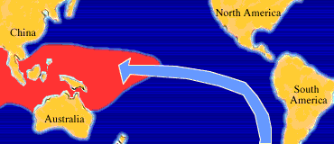

# El Niño/La Niña/ENSO Stuff ***NWS website***

> Source: <http://www.weather.gov/source/zhu/ZHU_Training_Page/tropical_stuff/enso/enso10.htm>  
> Section: El Niño/La Niña/ENSO/MJO Stuff  
> Captured: 2026-08-19 06:00 UTC  
> PDF: [el-nino-la-nina-enso-stuff-nws-website.pdf](el-nino-la-nina-enso-stuff-nws-website.pdf) · Original HTML: [source/original.html](source/original.html)

---

El Niño

1. [Intro](el-nino-la-nina-enso-stuff-nws-website.md)
2. [ENSO](subpages/enso/enso.md)
3. [El Niño /La Niña](subpages/enso2/enso2.md)
4. [Weather Impacts](subpages/enso3/enso3.md)
5. [Definitions](subpages/enso4/enso4.md)

# Introduction

**El Niño** (Spanish name for the male child), initially referred to a weak, warm current appearing annually around Christmas time along the coast of Ecuador and Peru and lasting only a few weeks to a month or more. Every three to seven years, an El Niño event may last for many months, having significant economic and atmospheric consequences worldwide.

In the tropical Pacific, trade winds generally drive the surface waters westward. The surface water becomes progressively warmer going westward because of its longer exposure to solar heating. El Niño is observed when the easterly trade winds weaken, allowing warmer waters of the western Pacific to migrate eastward and eventually reach the South American Coast (shown in orange). The cool nutrient-rich sea water normally found along the coast of Peru is replaced by warmer water depleted of nutrients, resulting in a dramatic reduction in marine fish and plant life.

 

In contrast to El Niño, La Niña (female child) refers to an anomaly of unusually cold sea surface temperatures found in the eastern tropical Pacific. La Niña occurs roughly half as often as El Niño.

Next: [ENSO](subpages/enso/enso.md)

---

### Other Good El Niño, La Niña articles

**General Overview (Wikipedia)**- [El Niño](https://en.wikipedia.org/wiki/El_Ni%C3%B1o)
- [La Niña](https://en.wikipedia.org/wiki/La_Ni%C3%B1a)
- [El Niño Southern Oscillation](https://en.wikipedia.org/wiki/El_Ni%C3%B1o_Southern_Oscillation)

**Impacts of Traditional (Eastern Pacific) El Niño and La Niña on the hurricane season**- [Impacts of El Niño and La Niña on the hurricane season (Climate.gov Article)](../impacts-of-el-nino-and-la-nina-on-the-hurricane-season-climate-gov/impacts-of-el-nino-and-la-nina-on-the-hurricane-season-climate-gov.md)
- [El Niño Is Hanging On: What that Means for Hurricanes (Climate Central Article)](http://www.climatecentral.org/news/el-nino-hurricanes-18887)

**Impacts of Traditional (Eastern Pacific) El Niño and La Niña on the United States**- [United States El Niño Impacts (Climate.gov Article)](https://www.climate.gov/news-features/blogs/enso/united-states-el-ni%C3%B1o-impacts-0)
- [United States El Niño Impacts (AccuWeather Article)](http://www.accuweather.com/en/weather-news/what-impact-will-the-coming-el/24864631)

**El Niño "Modoki" and Central-Pacific El Niño**- [Japan Agencey For Marine-Earth Science and Technology (JAMTEC) Article](http://www.jamstec.go.jp/frcgc/research/d1/iod/enmodoki_home_s.html.en)
- [Earth Science Article](http://earthscience.stackexchange.com/questions/2822/what-is-el-ni%C3%B1o-modoki)
- [ABC News Article](http://abcnews.go.com/Technology/story?id=7992490&page=1)
