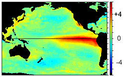
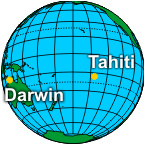
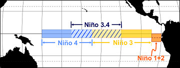
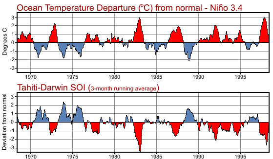

# El Niño/La Niña/ENSO Stuff ***NWS website*** — enso

> Source: <http://www.weather.gov/source/zhu/ZHU_Training_Page/tropical_stuff/enso/enso.htm>  
> Section: El Niño/La Niña/ENSO/MJO Stuff  
> Captured: 2026-08-19 06:00 UTC  
> PDF: [enso.pdf](enso.pdf) · Original HTML: [source/original.html](source/original.html)

---

El Niño

1. [Intro](../../el-nino-la-nina-enso-stuff-nws-website.md)
2. [ENSO](enso.md)
3. [El Niño /La Niña](../enso2/enso2.md)
4. [Weather Impacts](../enso3/enso3.md)
5. [Definitions](../enso4/enso4.md)

# El Niño Southern Oscillation (ENSO)

From December 1997,
this image shows the change of sea surface temperature from normal. The bright
red colors (water temperatures warmer than normal) in the Eastern Pacific
indicates the presence of El Niño.

One of the most prominent aspects of our weather and climate is its
variability. This variability ranges from small-scale phenomena such as wind
gusts, localized thunderstorms and tornadoes, to larger-scale features such as
fronts and storms to multi-seasonal, multi-year, multi-decade and even
multi-century time scales.

Typically, long time-scale events are often associated with changes in
atmospheric circulations that encompass vast areas. At times, these persistent
circulations occur simultaneously over seemingly unrelated, parts of the
hemisphere, and result in abnormal weather, temperature and rainfall patterns
worldwide.

El Niño is one of these naturally occurring
phenomenon. The term El Niño (the Christ child) comes from the name Paita
sailors called a periodic ocean current because it was observed to appear
usually immediately after Christmas. It marked a time with poor fishing
conditions as the nutrient rich water off the northwest coast of South America
remained very deep. However, over land, this ocean current were heavy rains in
very dry regions which produced luxurious vegetation.

Further research found
that El Niño is actually part of a much larger global variation in the
atmosphere called ENSO (El Niño/Southern Oscillation).
The Southern Oscillation refers to changes in sea level air pressure patterns in
the Southern Pacific Ocean between Tahiti and Darwin, Australia.

During El Niño conditions, the average air pressure is higher in Darwin than
in Tahiti. Therefore, the change in air pressures in the South Pacific and water
temperature in the East Pacific ocean, 8000 miles away, are related.

With the occurrence of warmer than normal temperature in the Eastern Pacific
it stands to reason that there will be periods where the water temperature will
be *cooler* than normal. The cooler periods are called La Niña. By convention, when you hear the name El Niño it
refers to the *warm* episode of ENSO while the *cool* episode of
ENSO is called La Niña.

ENSO is primarily monitored by the Southern Oscillation Index (SOI), based on
pressure differences between Tahiti and Darwin, Australia. The SOI is a
mathematical way of smoothing the daily fluctuations in air pressure between
Tahiti and Darwin and standardizing the information. The added bonus in using
the SOI is weather records are more than 100 years long which gives us over a
century of ENSO history.

Sea surface temperatures
are monitored in four regions along the equator:

- Niño 1 (80°-90°W and 5°-10°S)
- Niño 2 (80°-90°W and 0°-5°S)
- Niño 3 (90°-150°W and 5°N-5°S)
- Niño 4 (150°-160°E and 5°N-5°S)

These regions were created in the early 1980s. Since then, continued research
has lead to modifications of these original regions. The original Niño 1 and
Niño 2 are now combined and is called Niño 1+2. A new region, called Niño 3.4
(120°-150°W and 5°N-5°S) is now used as it corrolates better with the Southern
Oscillation Index and is the prefered region to monitor sea surface
temperature.

The two graphs (right)
shows this corrolation. The top graph shows the change in water temperature from
normal for Niño 3.4. The bottom graph shows the southern oscillation index for
the same period. When the pressure in Tahiti is *lower* than Darwin,
Australia the temperature in Niño 3.4 is *higher* than normal and El Niño
is occurring; the warm episode of ENSO.

Conversely, when the pressure in Tahiti is *higher* than Darwin,
Australia the temperature in Niño 3.4 is *lower* than normal and La Niña
is occurring; the cool episode of ENSO.

What is suprising is these changes in sea surface temperatures are not large,
plus or minus 6°F (3°C) and generally much less. However these minor changes can
have large effects our global weather patterns.

Next: [El Niño / La Niña](../enso2/enso2.md)
