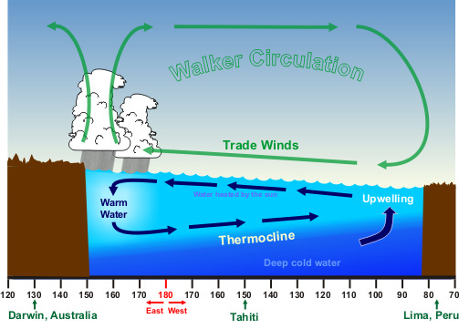
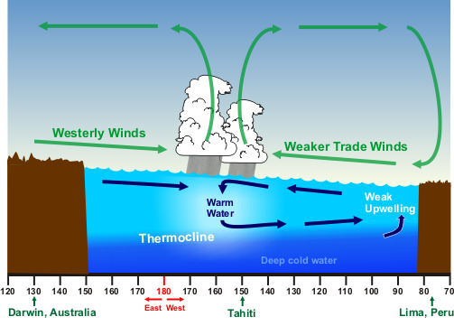
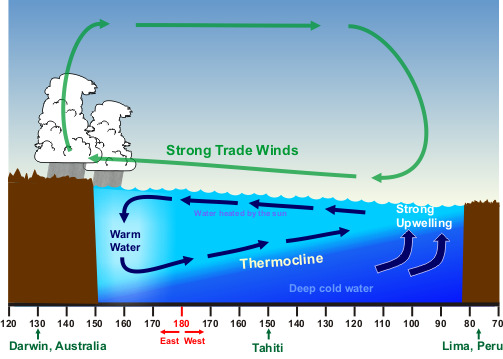

# El Niño/La Niña/ENSO Stuff ***NWS website*** — El Niño /La Niña

> Source: <http://www.weather.gov/source/zhu/ZHU_Training_Page/tropical_stuff/enso/enso2.htm>  
> Section: El Niño/La Niña/ENSO/MJO Stuff  
> Captured: 2026-08-19 06:00 UTC  
> PDF: [enso2.pdf](enso2.pdf) · Original HTML: [source/original.html](source/original.html)

---

El Niño

1. [Intro](../../el-nino-la-nina-enso-stuff-nws-website.md)
2. [ENSO](../enso/enso.md)
3. [El Niño /La Niña](enso2.md)
4. [Weather Impacts](../enso3/enso3.md)
5. [Definitions](../enso4/enso4.md)

# Effects of ENSO in the Pacific

## Normal Conditions

Normally, sea surface temperature is about 14°F higher in the Western Pacific
than the waters off South America.

This is due to the trade winds blowing from east to west along the equator
allowing the upwelling of cold, nutrient rich water from deeper levels off the
northwest coast of South America.

Also, these same trade winds push water west which piles higher in the
Western Pacific. The average sea-level height is about 1½ feet higher at
Indonesia than at Peru.

The trade winds, in piling up water in the Western Pacific, make a deep 450
feet (150 meter) warm layer in the west that pushes the thermocline down there,
while it rises in the east.

The shallow 90 feet (30 meter) eastern thermocline allows the winds to pull
up water from below, water that is generally much richer in nutrients than the
surface layer.

## El Niño Conditions

However, when the air pressure patterns in the South Pacific reverse
direction (the air pressure at Darwin, Australia is higher than at Tahiti), the
trade winds decrease in strength (and can reverse direction).

The result is the normal flow of water away from South America decreases and
ocean water piles up off South America. This pushes the thermocline deeper and a
decrease in the upwelling.

With a deeper thermocline and decreased westward transport of water, the sea
surface temperature increases *to greater than normal* in the Eastern
Pacific. This is the warm phase of ENSO, called El Niño.

The net result is a shift of the prevailing rain pattern from the normal
Western Pacific to the Central Pacific. The effect is the rainfall is more
common in the Central Pacific while the Western Pacific becomes relatively
dry.

## La Niña Conditions

There are occasions when the trade winds that blow west across the tropical
Pacific are stronger than normal leading to increased upwelling off South
America and hence the *lower than normal* sea surface temperatures.

The prevailing rain pattern also shifts farther west than normal. These winds
pile up warm surface water in the West Pacific. This is the cool phase of ENSO
called La Niña.

What is surprising is these changes in sea surface temperatures are not
large, plus or minus 6°F (3°C) and generally much less.

Next: [Weather Impacts](../enso3/enso3.md)
