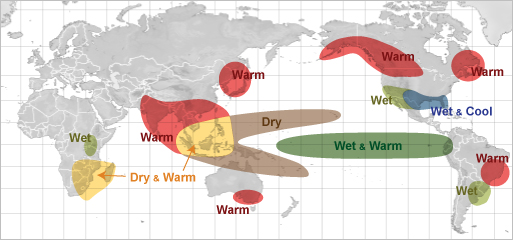
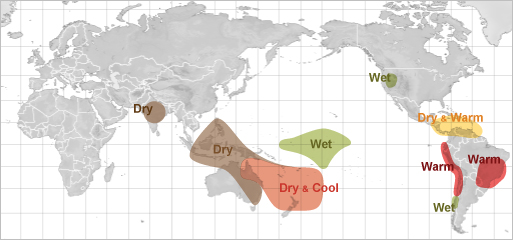
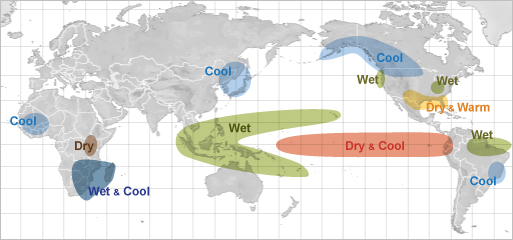
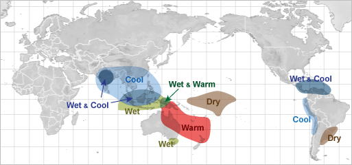
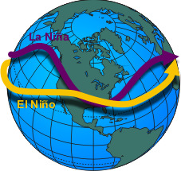

# El Niño/La Niña/ENSO Stuff ***NWS website*** — Weather Impacts

> Source: <http://www.weather.gov/source/zhu/ZHU_Training_Page/tropical_stuff/enso/enso3.htm>  
> Section: El Niño/La Niña/ENSO/MJO Stuff  
> Captured: 2026-08-19 06:00 UTC  
> PDF: [enso3.pdf](enso3.pdf) · Original HTML: [source/original.html](source/original.html)

---

El Niño

1. [Intro](../../el-nino-la-nina-enso-stuff-nws-website.md)
2. [ENSO](../enso/enso.md)
3. [El Niño /La Niña](../enso2/enso2.md)
4. [Weather Impacts](enso3.md)
5. [Definitions](../enso4/enso4.md)

# Weather Impacts of ENSO

## The Jetstream

El Niño effect during December through February

El Niño effect
during June through August

La Niña effect during December through
February

La Niña effect during June through August

As the position of the warm water along the equator shifts back and
forth across the Pacific Ocean, the position where the greatest evaporation of
water into the atmosphere also shifts with it. This has a profound effect on the
average position of the jet stream which, in turn, effects the storm track.

During El Niño (warm phase of ENSO), the jet stream's position shows a dip in
the Eastern Pacific. The stronger the El Niño, the farther east in the Eastern
Pacific the dip in the jetstream occurs. Conversely, during La Niña's, this dip
in the jet stream shifts west of its normal position toward the Central
Pacific.

The position of this dip in the jet stream, called a trough, can have a huge
effect on the type of weather experienced in North America.

During the warm episode of ENSO (El Niño) the eastern shift in the trough
typically sends the storm track, with huge amounts of tropical moisture, into
California, south of its normal position of the Pacific Northwest.

Very strong El Niños will cause the trough to shift further south with the
average storm track position moving into Southern California.

During these times, rainfall in California can be significantly above normal,
leading to numerous occurrences of flash flood and debris flows. With the storm
track shifted south, the Pacific Northwest becomes drier and drier as the
tropical moisture is shunted south of the region.

The maps (right) show the regions where the greatest impacts due to the shift
in the jet stream as a result of ENSO. The highlighted areas indicate
significant changes from normal weather occur. The the magnitude of the change
from normal is dependent upon the strength of the El Niño or La Niña.
