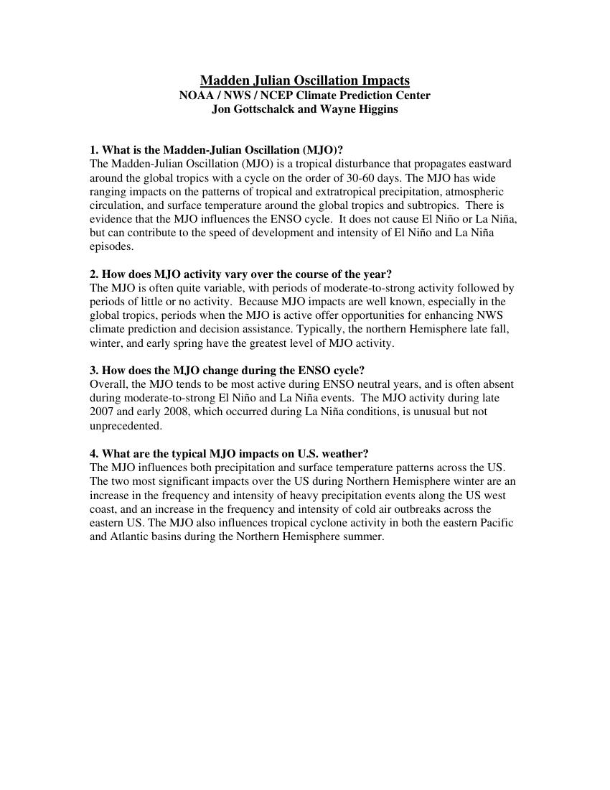

# Madden Julian Oscillation (MJO) Factsheet

> Source: <http://www.weather.gov/media/zhu/ZHU_Training_Page/tropical_stuff/MJO/MJO_factsheet.pdf>  
> Section: El Niño/La Niña/ENSO/MJO Stuff  
> Captured: 2026-08-19 06:00 UTC  
> PDF: [madden-julian-oscillation-mjo-factsheet.pdf](madden-julian-oscillation-mjo-factsheet.pdf) (1 pages)

---

## Page 1

Madden Julian Oscillation Impacts 
NOAA / NWS / NCEP Climate Prediction Center 
Jon Gottschalck and Wayne Higgins 
 
 
1. What is the Madden-Julian Oscillation (MJO)? 
The Madden-Julian Oscillation (MJO) is a tropical disturbance that propagates eastward 
around the global tropics with a cycle on the order of 30-60 days. The MJO has wide 
ranging impacts on the patterns of tropical and extratropical precipitation, atmospheric 
circulation, and surface temperature around the global tropics and subtropics.  There is 
evidence that the MJO influences the ENSO cycle.  It does not cause El Niño or La Niña, 
but can contribute to the speed of development and intensity of El Niño and La Niña 
episodes.  
 
2. How does MJO activity vary over the course of the year?  
The MJO is often quite variable, with periods of moderate-to-strong activity followed by 
periods of little or no activity.  Because MJO impacts are well known, especially in the 
global tropics, periods when the MJO is active offer opportunities for enhancing NWS 
climate prediction and decision assistance. Typically, the northern Hemisphere late fall, 
winter, and early spring have the greatest level of MJO activity. 
 
3. How does the MJO change during the ENSO cycle?  
Overall, the MJO tends to be most active during ENSO neutral years, and is often absent 
during moderate-to-strong El Niño and La Niña events.  The MJO activity during late 
2007 and early 2008, which occurred during La Niña conditions, is unusual but not 
unprecedented. 
 
4. What are the typical MJO impacts on U.S. weather?  
The MJO influences both precipitation and surface temperature patterns across the US. 
The two most significant impacts over the US during Northern Hemisphere winter are an 
increase in the frequency and intensity of heavy precipitation events along the US west 
coast, and an increase in the frequency and intensity of cold air outbreaks across the 
eastern US. The MJO also influences tropical cyclone activity in both the eastern Pacific 
and Atlantic basins during the Northern Hemisphere summer.
