# Deformation Band/Col Region — Tutorial 2

> Source: <https://resources.eumetrain.org/satmanu/CMs/Def/print.htm>  
> Section: Miscellaneous  
> Captured: 2026-08-19 06:00 UTC  
> PDF: [deformation-band-col-region-tutorial-2.pdf](deformation-band-col-region-tutorial-2.pdf) · Original HTML: [source/original.html](source/original.html)

---

- [Basics](http://resources.eumetrain.org/satmanu/index_basics.html)
- [Conceptual Models](http://resources.eumetrain.org/satmanu/index_conc.html)
- [Short Versions](http://resources.eumetrain.org/satmanu/index_short.html)
- [Glossary](http://resources.eumetrain.org/satmanu/index_glos.html)
- [Abbreviations](http://resources.eumetrain.org/satmanu/index_abb.html)
- [Units](http://resources.eumetrain.org/satmanu/index_units.html)
- [User Information](http://resources.eumetrain.org/satmanu/index_user.html)

Produced by EUMeTrain

# [Deformation Band](https://resources.eumetrain.org/satmanu/CMs/Def/index.htm)

## Print Version

- [Table of Contents](https://resources.eumetrain.org/satmanu/CMs/Def/index.htm)
- [Short Version](https://resources.eumetrain.org/satmanu/CMs/Def/short.html)

---

- [Print Version](https://resources.eumetrain.org/satmanu/CMs/Def/print.html)

### Table of Contents

- [Cloud Structure In Satellite Images](#page_1.0.0)
- [Meteorological Physical Background](#page_2.0.0)
- [Key Parameters](#page_3.0.0)
- [Typical Appearance In Vertical Cross Sections](#page_4.0.0)
- [Weather Events](#page_5.0.0)
- [References](#page_6.0.0)

[Top of page](#header)

### Cloud Structure In Satellite Images

Deformation is a feature of a varying wind field, which affects cloud formations and humid areas influenced by the wind field.

In satellite images, a Deformation Band is a cloud line that:

- elongates, becoming narrower and longer, usually keeping its orientation
- thins out in the middle, eventually breaking
- can be straight or slightly arched

Deformation zones are generated by opposing flows, where two synoptic or meso-scale cloud systems are brought closer to each other. A deformation zone needs a cyclonic and an anticyclonic circulation to form. As anticyclonic circulations tend to be rather dry, characteristic patterns for deformation zones can be best seen in water vapour image loops. After the deformation stage the cloud dissipates or merges with other cloudiness.

The deforming band elongates in the direction of the upper level flow. Often there is sinking motion on the poleward side of the cloud band. This sinking air can be seen spreading in both directions with the upper level wind field.

Appearance in the basic channels

- In VIS images grey, partly translucent fibres with well confined, even sharp, edges
- In IR images, a grey or white, narrow, fibrous cloud band with well confined edges
- In WV images, a grey or white band, often with a dark area on the poleward side

[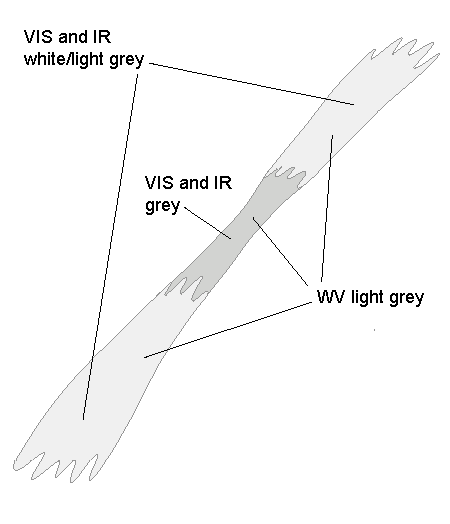](https://resources.eumetrain.org/satmanu/CMs/Def/media/images/dbsask01.gif)

**Appearance in the basic RGBs**

Airmass RGB

As the deformation band cloudiness expands into two low centres travelling in opposite directions, the cold and dry air masses at the rear side of these low centres appear on different sides of the band. In the southern part of a deformation cloud band, warm air masses with greenish colours tend to occur.

The deformation cloud band appears very similar to that in the IR image.

Dust RGB

Around the deformation cloud band there are blue or pinkish blue colours where there is no cloud beneath, but it is mostly it is filled with low level cloud patches and cells in ochre colours.

In the most advanced stage of development, the deformation cloud band consists of dark red stripes and fibres indicating rather thick ice cloud. During the decay process, the stripes and fibres become thinner and therefore change to black colours. Low level cloud patches also appear below.

[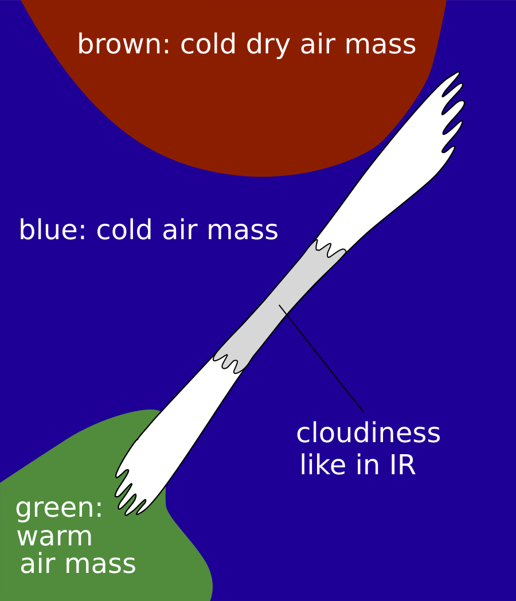](https://resources.eumetrain.org/satmanu/CMs/Def/media/images/Deformation_Band_Airmass.png "Basic RGB schematics - Airmass RGB")

[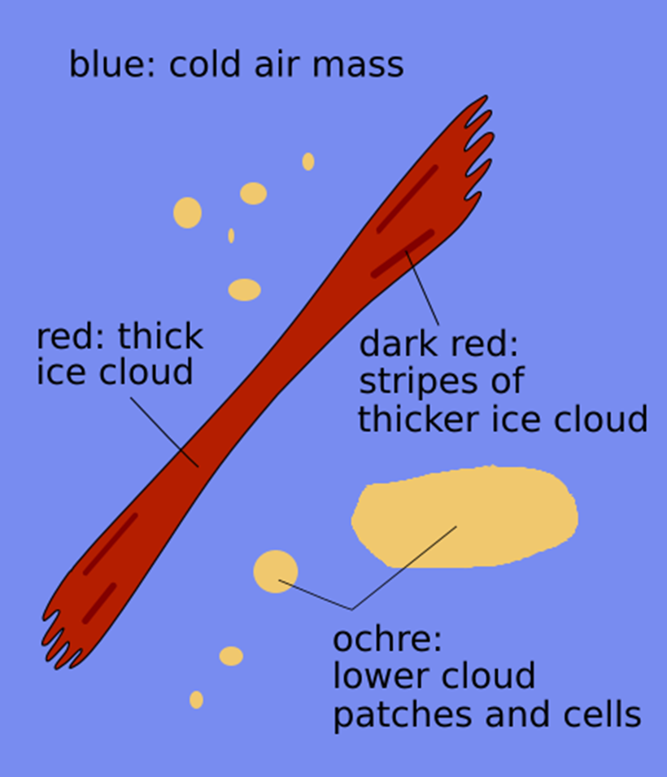](https://resources.eumetrain.org/satmanu/CMs/Def/media/images/Deformation_Band_Dust.png "Basic RGB schematics - Dust RGB")

Basic RGB schematics. Left: Airmass RGB; right: Dust RGB.

This case from 4 May 2020 at 12UTC shows a deformation band at its most advanced stage of development.

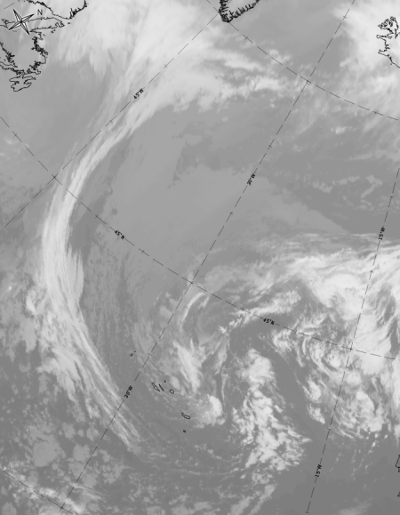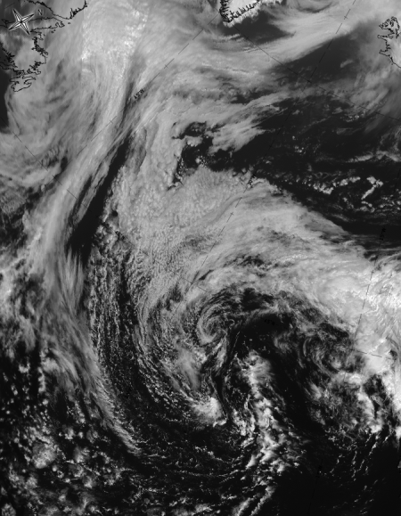

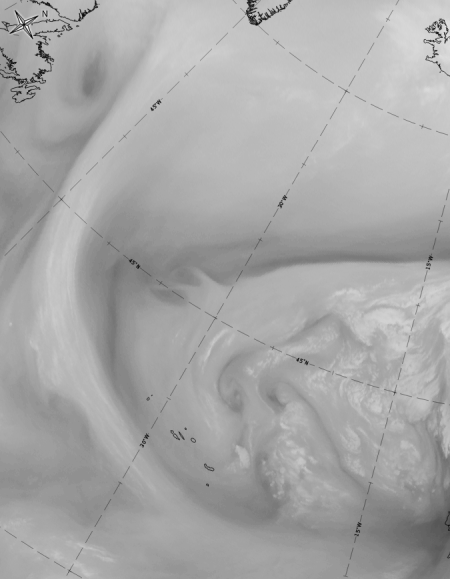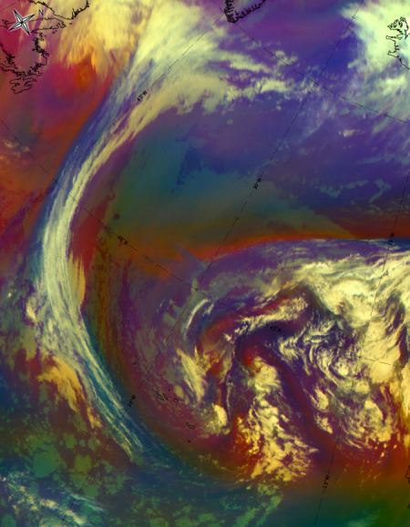

[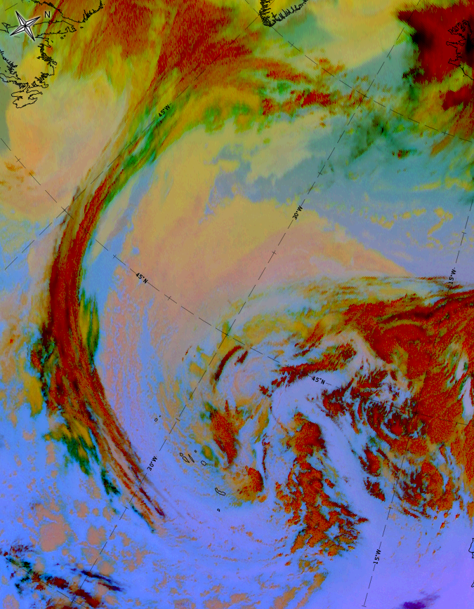](https://resources.eumetrain.org/satmanu/CMs/Def/media/images/4_May_12_dust.png "4 May 2020, 12UTC: Dust RGB image")

4 May 2020, 12UTC: 1st row: IR (above) + HRV (below); 2nd row: WV (above) + Airmass RGB (below); 3rd row: Dust RGB + image gallery.
**\*Note:** click on the Dust RGB image to access image gallery (navigate using arrows on keyboard)

|  |  |
| --- | --- |
| **IR** | White to light grey; fibrous appearance. |
| **HRV** | Some white parts, mostly grey. |
| **WV** | Light grey band of high humidity. |
| **Airmass RGB** | Cloud band similar to IR; embedded within blue to brown areas. The brown areas representing cold and dry air belong to the two cyclonic systems. |
| **Dust RGB** | Dark red stripes above ochre to greenish colours. |

This 6-hourly image sequence from 4 May, 12 UTC to 5 May, 06 UTC demonstrates the decay of the deformation cloud band. The dark red stripes dissolve and/or change to black translucent stripes that also dissolve, leaving small ochre cloud bands typical of mid-level cloud. Green areas represent thin low to mid-level cloud.

|  |  |
| --- | --- |
|  | [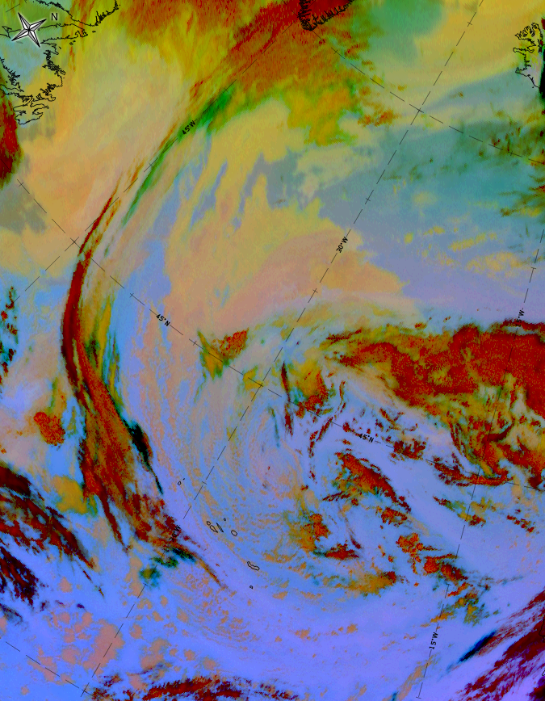](https://resources.eumetrain.org/satmanu/CMs/Def/media/images/4_May_18_dust.png "Dust RGB 4 May 18 UTC") |
| [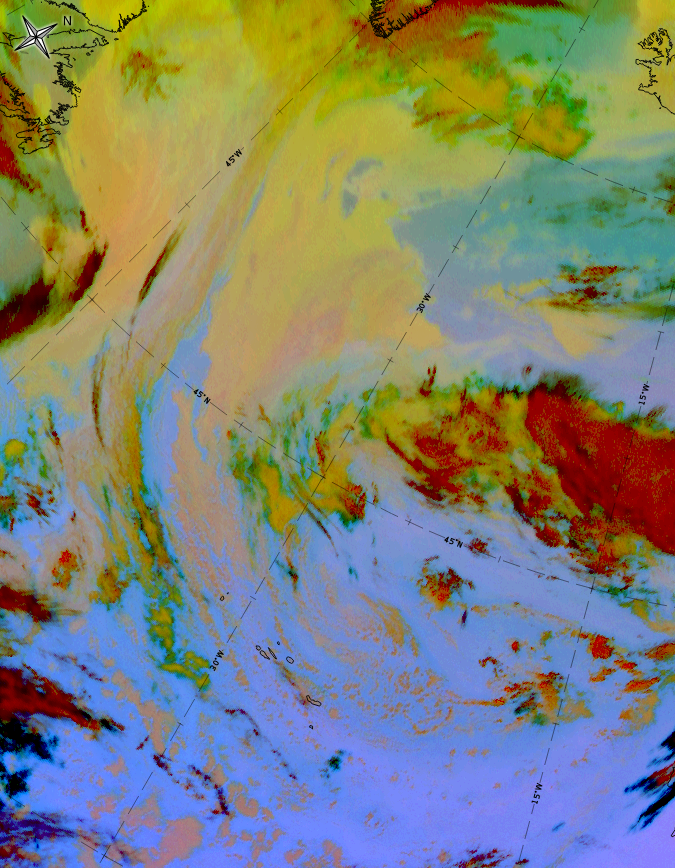](https://resources.eumetrain.org/satmanu/CMs/Def/media/images/5_May_00_dust.png "Dust RGB 5 May 00 UTC") | [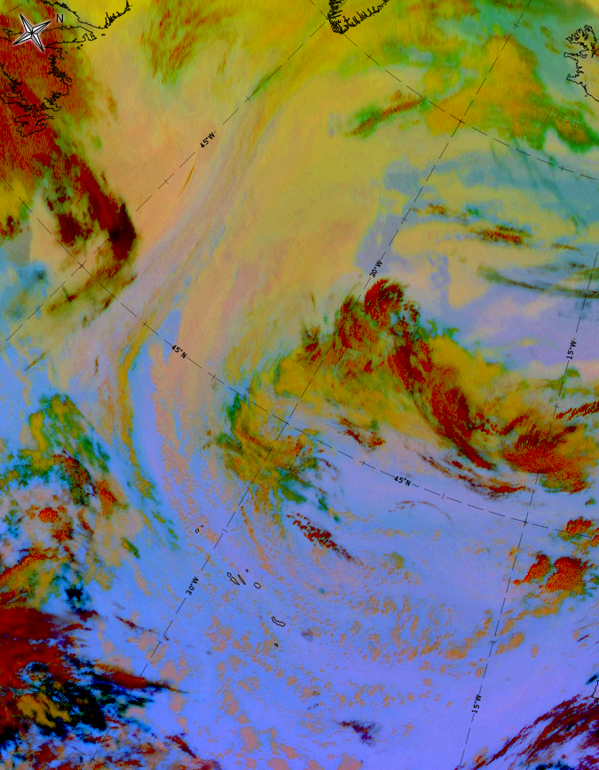](https://resources.eumetrain.org/satmanu/CMs/Def/media/images/5_May_06_dust.png "Dust RGB 5 May 06 UTC") |

4 May 2020, 12 UTC to 5 May 2020, 06 UTC: Dust RGB;
u.l.: 4 May 12UTC , u.r.: 4 May 18 UTC l.l.: 5 May 00 UTC, l.r.: 5 May 06 UTC.
**Note:** click on any Dust RGB image to access image gallery (navigate using arrows on keyboard)

The development of the Deformation Band can best be seen in an animation:

[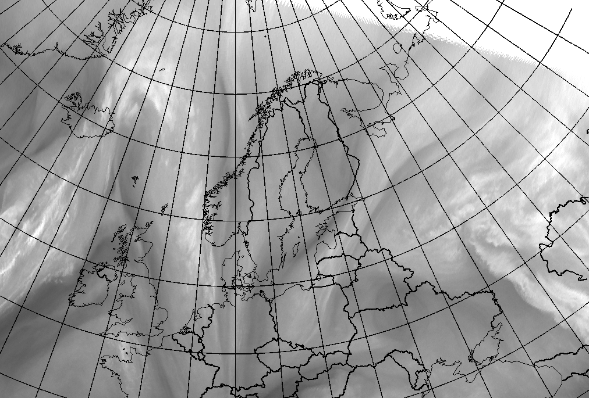](https://resources.eumetrain.org/satmanu/CMs/Def/media/images/dbsa05.gif "18 February 2009/00.00 UTC - Meteosat 8 WV 6.2 image")

18 February 2009/00.00 UTC - Meteosat 8 IR 10.8 image;

In this loop a Deformation Band stretching from Poland to White Sea gradually narrows and elongates while being stationary. Loop shows WV 6.2 images 18 February 2009 hourly from 00.00 UTC to 07.00 UTC.

[Top of page](#header)

### Meteorological Physical Background

#### Deformation in the wind field

In a changing wind field four different kind of variations can affect elements flowing in the field (such as clouds and humid areas):
translation, divergence, vorticity and deformation. The correspondent changes in clouds and humid areas are:

| variation in the wind field | change to the cloud |
| --- | --- |
| Translation | location |
| Divergence | area |
| Vorticity | orientation |
| Deformation | shape |

- Translation shifts elements
- Divergence either contracts (convergence) or expands (divergence) elements
- Vorticity rotates elements either cyclonically (positive vorticity) or anticyclonically (negative vorticity)
- Deformation changes the shape of the elements

Mathematically the deformation D can be written as a sum of two components, stretching and shearing deformation (Dst and Dsh) as follows:

D = √Dst2 + Dsh2 , where in a (x,y)-plane

Dst = ∂u/∂x - ∂v/∂y and

Dsh = ∂u/∂y + ∂v/∂x,

u being the wind component in x-direction, v in y-direction.

The effect of stretching and shearing terms can be represented schematically as follows:

Stretching deformation. Green lines and arrows show the wind field. Light green square is an element, which stretches into the
darker green rectangle. The area of the element stays the same. Here x-axis is the axis of dilatation and y-axis is the axis of
contraction.

Shearing deformation. The situation is the same as on the left, but now the axes of dilatation and contraction are at 45° angle
to the x- and y-axes.

[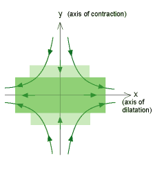](https://resources.eumetrain.org/satmanu/CMs/Def/media/images/dbcosk01.gif "Stretching deformation. Green lines and arrows show the wind field.	Light green square is an element, which stretches into the darker green	rectangle. The area of the element stays the same. Here x-axis is the axis of dilatation and y-axis is the axis of contraction.")

[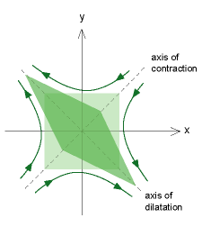](https://resources.eumetrain.org/satmanu/CMs/Def/media/images/dbcosk02.gif "Shearing deformation. The situation is the same as on the left, but now the axes of dilatation and contraction are at 45° angle to the x-	and y-axes.")

In the schematics above it can be seen that a col (saddle surface) and a confluent zone are required for the deformation to occur.

In the satellite images the stretching and shearing deformation can be pictured as follows:

Stretching deformation. A cloud band elongates uniformly. This is typical for occluded cloud bands.

Shearing deformation. Different parts of a cloud band elongate in opposite directions. This can be seen e.g. in Cold Fronts.

[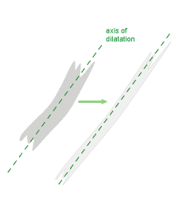](https://resources.eumetrain.org/satmanu/CMs/Def/media/images/dbcosk03.gif "Stretching deformation. A cloud band elongates uniformly. This is typical for occluded cloud bands.")

[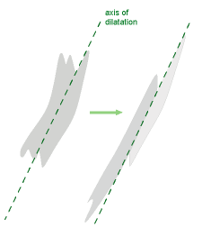](https://resources.eumetrain.org/satmanu/CMs/Def/media/images/dbcosk04.gif "Shearing deformation. Different parts of a cloud band elongate in opposite directions. This can be seen e.g. in Cold Fronts.")

The col surface can also be half of a saddle, which leads to the formation of a "mushroom pattern" (a curved cloud band):

28 November 2004/06.00 UTC - Meteosat 8 IR 10.8 image; red solid: positive stretching deformation 300 hPa, red dashed: negative
stretching deformation 300 hPa

[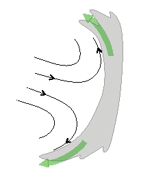](https://resources.eumetrain.org/satmanu/CMs/Def/media/images/dbcosk05.gif)

[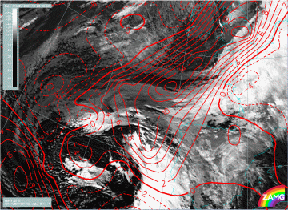](https://resources.eumetrain.org/satmanu/CMs/Def/media/images/dbcosa01.gif "28 November 2004/06.00 UTC - Meteosat 8 IR 10.8 image; red solid: positive stretching deformation 300 hPa, red dashed: negative stretching deformation 300 hPa")

[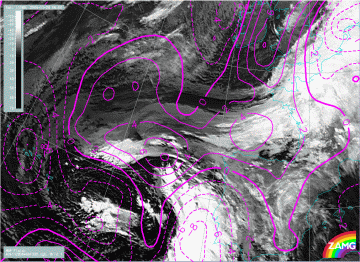](https://resources.eumetrain.org/satmanu/CMs/Def/media/images/dbcosa02.gif "28 November 2004/06.00 UTC - Meteosat 8 IR 10.8 image; magenta solid: positive shear deformation 300 hPa, magenta dashed: negative shear	deformation 300 hPa")

[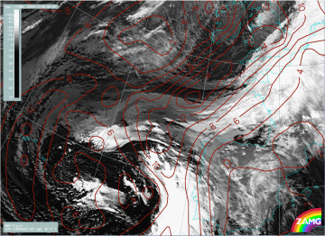](https://resources.eumetrain.org/satmanu/CMs/Def/media/images/dbcosa03.gif "28 November 2004/06.00 UTC - Meteosat 8 IR 10.8 image; red solid: positive stretching deformation 300 hPa, red dashed: negative stretching deformation 300 hPa")

28 November 2004/06.00 UTC - Meteosat 8 IR 10.8 image; magenta solid: positive shear deformation 300 hPa, magenta dashed: negative
shear deformation 300 hPa

#### Typical locations for Deformation Bands

Deformation zones are generated by opposing flows. Typical situations in which deformation occurs, are those in which the cloud bands of two
synoptic or meso-scale cloud systems are brought close to each other. Once they start merging, the elongation of the cloud band becomes obvious.

The location of deformation is most often a col (see sketches before). The maximum of a deformation field is nearly always in the confluent
area of the wind field, on the colder side of it. At the saddle point the deformation is non-existent.

The most likely location is the area near the pole ward boundary of Warm Front and Occlusion cloud bands. Often a cold front approaches this
cloud area from the north. The cloud bands merge, then they start to elongate. In the end the cloud band breaks somewhere in the middle of the
band, and the rest of the cloudiness dissipates.

Deformation on a col with a Cold Front and an occluded front merging

Part of warm frontal cloudiness breaks off

[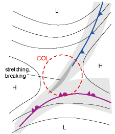](https://resources.eumetrain.org/satmanu/CMs/Def/media/images/dbcosk06.gif "Deformation on a col with a Cold Front and an occluded front merging")

[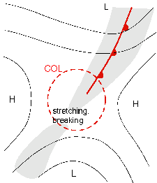](https://resources.eumetrain.org/satmanu/CMs/Def/media/images/dbcosk07.gif "Part of warm frontal cloudiness breaks off")

Deformation zones are seen as linear structures with diverging moisture parcels along the line. The intensity of the deformation zone is
proportional to the contrast in moisture gradient across the zone.

The moisture gradient is typically sharpest pole wards of the Deformation Band. Dry sinking air coming from the north is advected towards the
axis of dilatation, which can be seen as a dark area in WV imagery. The contrast between dry and moist air is enhanced by the transportation of
moist air from the south by the moist upper level conveyor belt.

28 November 2004/06.00 UTC - Meteosat 8 WV 6.2 image; blue solid: relative humidity 500 hPa > 70%, blue dashed: relative
humidity 500 hPa < 70%, green: streamlines 300 hPa

[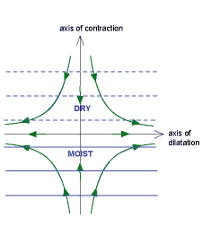](https://resources.eumetrain.org/satmanu/CMs/Def/media/images/dbcosk08.gif)

[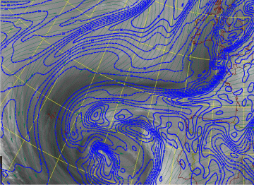](https://resources.eumetrain.org/satmanu/CMs/Def/media/images/dbcosa04.gif "28 November 2004/06.00 UTC - Meteosat 8 WV 6.2 image; blue solid: relativ  humidity 500 hPa > 70%, blue dashed: relative humidity 500 hPa < 70%, green: streamlines 300 hPa")

#### Deformation Bands and Frontogenesis

Deformation is a primary factor in frontogenesis and frontolysis.

The full frontogenesis function Ft consists of three components: Ft = Fh + Fv + Fq,
where Ft is frontogenesis caused by horizontal wind field, Fv frontogenesis by vertical motions and Fq
frontogenesis by diabatic heating. The contribution from Fh is necessary for the formation of synoptic scale fronts. It can be
expressed as:

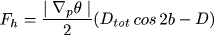

where Dtot is the total deformation, D is the horizontal wind divergence and b the angle between the axis of dilatation and the
isentropes.

Frontogenesis can occur when cos2b > 0, which means that 2b < 90° or b < 45°. Frontolysis can occur when 45° < b <
90°.

Frontogenesis is strongest in the confluence zone, and zero in the saddle point, where there is no wind.

Frontogenesis

Frontolysis

[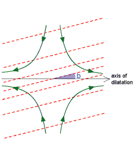](https://resources.eumetrain.org/satmanu/CMs/Def/media/images/dbcosk09.gif "Frontogenesis")

[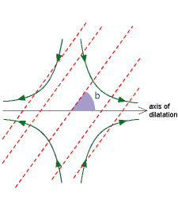](https://resources.eumetrain.org/satmanu/CMs/Def/media/images/dbcosk10.gif "Frontolysis")

The effect of vorticity on the deformation field is shown the following diagram:

[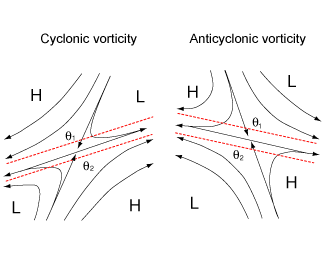](https://resources.eumetrain.org/satmanu/CMs/Def/media/images/dbcosk11.gif)

[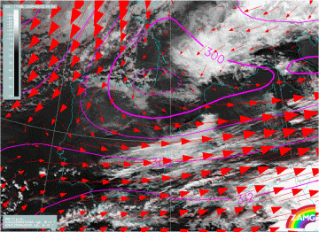](https://resources.eumetrain.org/satmanu/CMs/Def/media/images/dbcosa05.gif "25 March 2004/06.00 UTC - Meteosat 8 IR 10.8 image; red: wind 500 hPa, magenta: equivalent potential temperature 500 hPa")

[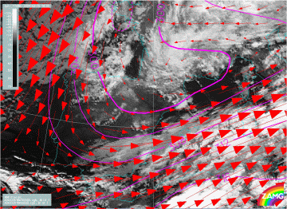](https://resources.eumetrain.org/satmanu/CMs/Def/media/images/dbcosa06.gif "25 March 2004/18.00 UTC - Meteosat 8 IR 10.8 image; red: wind 500 hPa, magenta: equivalent potential temperature 500 hPa")

25 March 2004/06.00 UTC - Meteosat 8 IR 10.8 image; red: wind 500 hPa, magenta: equivalent potential temperature 500 hPa

25 March 2004/18.00 UTC - Meteosat 8 IR 10.8 image; red: wind 500 hPa, magenta: equivalent potential temperature 500 hPa

#### Deformation Bands and Jet Fibres

Deformation Bands have a somewhat similar appearance to Jet Fibres towards the end their life cycle (see
[*Jet Fibres*](https://resources.eumetrain.org/satmanu/CMs/JeCl/index.htm)
). Their origins and often also the locations with respect to jet streams, however, are different. The similarities and differences can be
briefly listed as follows:

- Jet Fibres occur only in the vicinity of an upper level jet. Deformation Bands extends to areas with weak winds, usually a col.
- Jet fibres associated with a Cold Front occur only on the cold side of the front, whereas Deformation Bands are more likely on the warm
  side of a Cold Front.
- Jet Fibres have a typical life cycle ranging from 8 hours up to 24 hours. Deformation Bands have shorter life-cycles, due to the strong
  sinking motion that takes place at the poleward side of the cloud band. Typical life cycle for Deformation Band cloudiness is 6-9 hours.
- Both Jet Fibres and Deformation Bands have a dark stripe in WV imagery along the cold side of the cloudiness due to sinking motion at
  upper and middle troposphere.
- Jet Fibres experience deformation when they are brought into a deforming wind field. They should in this case be still classified as
  Jet Fibres due to their origin.

The example below illustrates a case showing Jet Fibres and Deformation Band over the Atlantic Ocean. The Deformation Band is within weak, but
confluent upper level flow, whereas the Jet Fibres, more to the south, are clearly associated with a polar front jet streak.

19 April 2004/18.00 UTC - Meteosat 8 IR 10.8 image; yellow: isotachs 300 hPa; yellow arrows: wind 300 hPa

[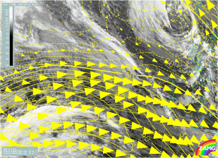](https://resources.eumetrain.org/satmanu/CMs/Def/media/images/dbcosa07.gif "19 April 2004/18.00 UTC - Meteosat 8 IR 10.8 image; yellow: isotachs 300 hPa; yellow arrows: wind 300 hPa")

[Top of page](#header)

### Key Parameters

- Wind vectors or streamlines at 300 and 500 hPa

  Wind vectors, preferably streamlines, show the presence of a col (saddle surface) at the area of deformation, with confluence on both
  sides of the col
- Total deformation at 300 and 500 hPa

  Total deformation maximum found in the vicinity of the col, with maximum values in the confluent zone on the cold side, where the jet
  is tightest
- Upper/middle tropospheric humidity

  High relative humidity gradient at the axis of dilation
- Omega at 700 hPa

  Weak or moderate sinking motion at, and on the cold side of the deformation zone

#### Wind/streamlines 300/500 hPa

28 November 2004/06.00 UTC - Meteosat 8 IR 10.8 image; yellow: streamlines 300 hPa

[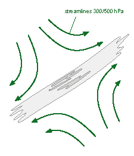](https://resources.eumetrain.org/satmanu/CMs/Def/media/images/dbkesk01.gif)

[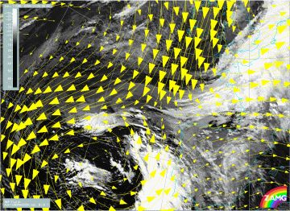](https://resources.eumetrain.org/satmanu/CMs/Def/media/images/dbke01.gif "28 November 2004/06.00 UTC - Meteosat 8 IR 10.8 image; yellow: streamlines 300 hPa")

#### Total deformation 300 hPa

28 November 2004/06.00 UTC - Meteosat IR image; brown: total deformation 300 hPa

[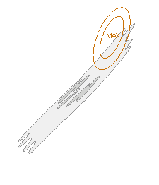](https://resources.eumetrain.org/satmanu/CMs/Def/media/images/dbkesk02.gif)

#### Humidity 500 hPa

28 November 2004/06.00 UTC - Meteosat 8 WV 6.2 image; blue solid: relative humidity 500 hPa > 70%, blue dashed: relative
humidity 500 hPa < 70%

[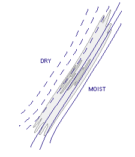](https://resources.eumetrain.org/satmanu/CMs/Def/media/images/dbkesk03.gif)

[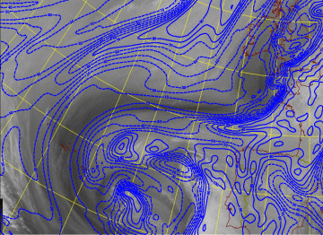](https://resources.eumetrain.org/satmanu/CMs/Def/media/images/dbke03.gif "28 November 2004/06.00 UTC - Meteosat  8 WV 6.2 image; blue solid: relative humidity 500 hPa > 70%, blue dashed: relative humidity 500 hPa < 70%")

#### Omega 700 hPa

28 November 2004/06.00 UTC - Meteosat IR 8 10.8 image; yellow solid: sinking motion, yellow dashed: rising motion

[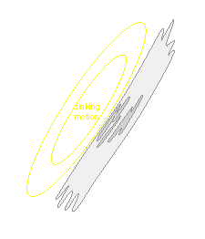](https://resources.eumetrain.org/satmanu/CMs/Def/media/images/dbkesk04.gif)

[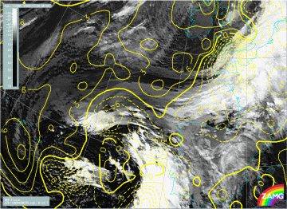](https://resources.eumetrain.org/satmanu/CMs/Def/media/images/dbke04.gif "28 November 2004/06.00 UTC - Meteosat IR 8 10.8 image; yellow solid: sinking motion, yellow dashed: rising motion")

[Top of page](#header)

### Typical Appearance In Vertical Cross Sections

As Deformation Bands occur either in the vicinity of frontal clouds or outside frontal zones, the vertical cross sections, especially the
isentropes, may vary substantially from case to case.

- Total deformation

  Total deformation maximum at the level of maximum winds (jet stream level), on the pole ward side of the band.
- Upper/middle tropospheric humidity

  High upper and middle tropospheric relative humidity gradient at the axis of dilation.
- Vertical motion

  Weak or moderate sinking motion in middle and upper levels of the troposphere, within and towards the cold side of the
  Deformation Band.

28 November 2004/06.00 UTC - Meteosat IR image; position of vertical cross section indicated

[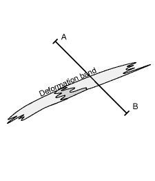](https://resources.eumetrain.org/satmanu/CMs/Def/media/images/dbqssk00.gif)

[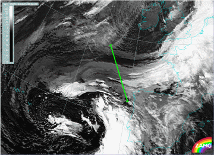](https://resources.eumetrain.org/satmanu/CMs/Def/media/images/dbqs00.gif "28 November 2004/06.00 UTC - Meteosat IR image; position of vertical cross section indicated")

#### Total deformation

28 November 2004/06.00 UTC - Vertical cross section; black: isentropes (ThetaE), brown: total deformation

[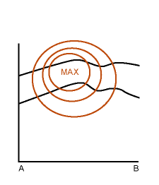](https://resources.eumetrain.org/satmanu/CMs/Def/media/images/dbqssk01.gif)

[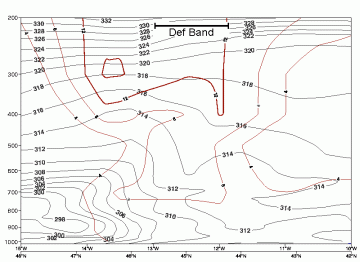](https://resources.eumetrain.org/satmanu/CMs/Def/media/images/dbqs01.gif "28 November 2004/06.00 UTC - Vertical cross section; black: isentropes (ThetaE), brown: total deformation")

#### Upper/middle tropospheric humidity

28 November 2004/06.00 UTC - Vertical cross section; black: isentropes (ThetaE), blue: relative humidity

[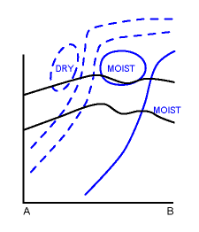](https://resources.eumetrain.org/satmanu/CMs/Def/media/images/dbqssk02.gif)

[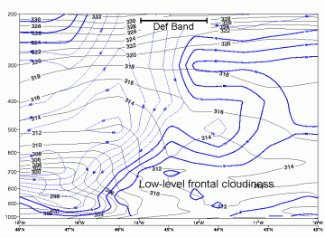](https://resources.eumetrain.org/satmanu/CMs/Def/media/images/dbqs02.gif "28 November 2004/06.00 UTC - Vertical cross section; black: isentropes (ThetaE), blue: relative humidity")

#### Vertical Motion

28 November 2004/06.00 UTC - Vertical cross section; black: isentropes (ThetaE), cyan thick: vertical motion (omega) - upward
motion, cyan thin: vertical motion (omega) - downward motion

[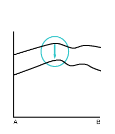](https://resources.eumetrain.org/satmanu/CMs/Def/media/images/dbqssk03.gif)

[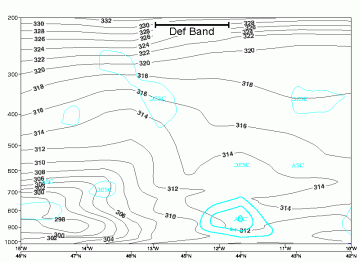](https://resources.eumetrain.org/satmanu/CMs/Def/media/images/dbqs03.gif "28 November 2004/06.00 UTC - Vertical cross section; black: isentropes (ThetaE), cyan thick: vertical motion (omega) - upward motion, cyan thin: vertical motion (omega) - downward motion")

[Top of page](#header)

### Weather Events

A Deformation Band occurs when there is deformation of the cloudiness at middle or upper levels in the troposphere. There are no surface weather features associated with a Deformation Band. The example below shows a Deformation Band over Western Europe.

Parameter

Description

Precipitation

- No precipitation associated with the Deformation Band. Existing rainbands tend to weaken in deformation areas.
- Precipitation from low level clouds not dependent on deformation at upper levels

Temperature

- No significant change

Wind (incl. gusts)

- No significant change

Other relevant information

- Upper/mid level cloudiness dispersing
- Upper level cloudiness in the form of fibres

To demonstrate the typical weather features, a case from 18 December 2019 at 06 UTC has been chosen. A deformation band stretches from the Pyrenees northward to northern Germany and southward into the Mediterranean.

[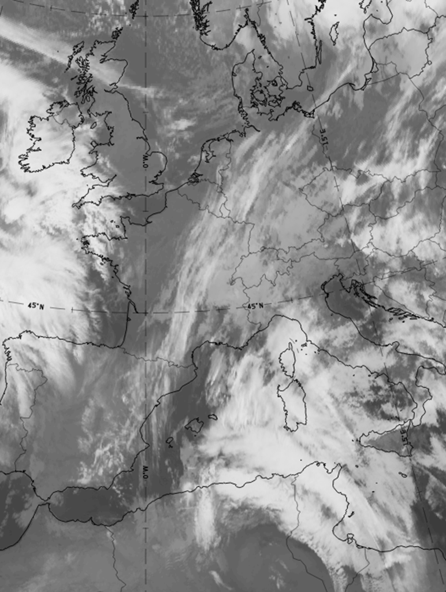](https://resources.eumetrain.org/satmanu/CMs/Def/media/images/18_Dec_06_IR.png)

[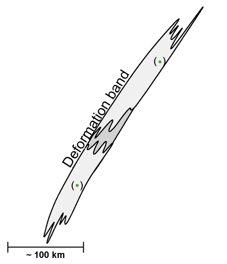](https://resources.eumetrain.org/satmanu/CMs/Def/media/images/dbwesk01.gif)

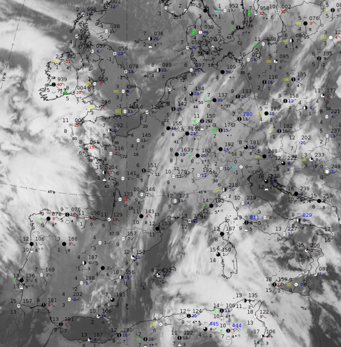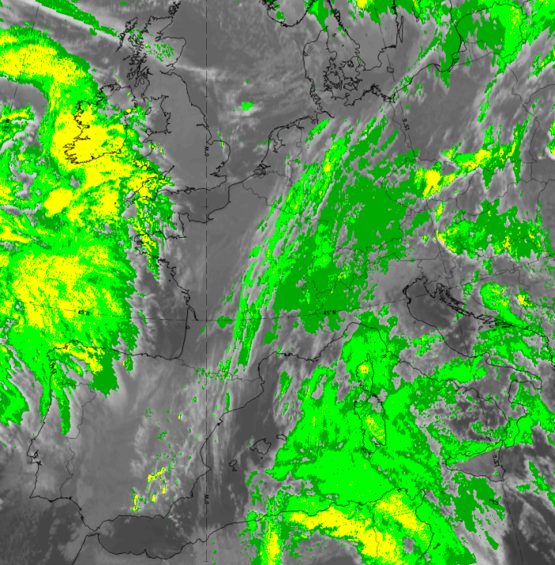

18 December 2019, 06UTC: IR + synoptic measurements (above) + probability of moderate rain (Precipitting clouds PC - NWCSAF).
**Note:** for a larger SYNOP image click [this link](https://resources.eumetrain.org/satmanu/CMs/Def/media/images/18_Dec_06_synops.png).

There are no precipitation reports within the deformation band and the probability of rain is lower than 15 %.

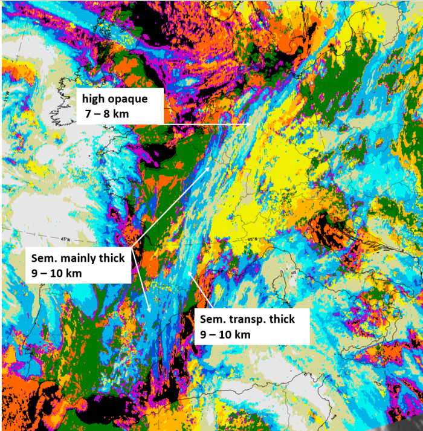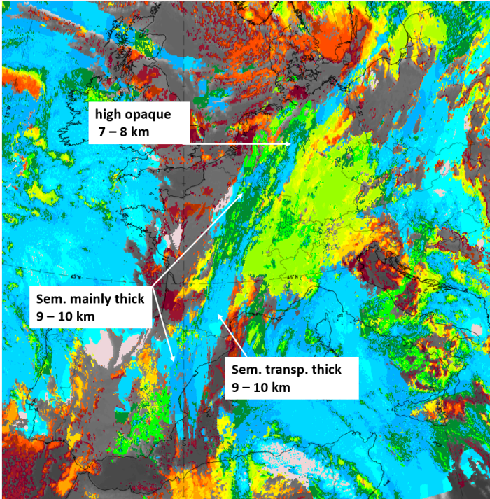

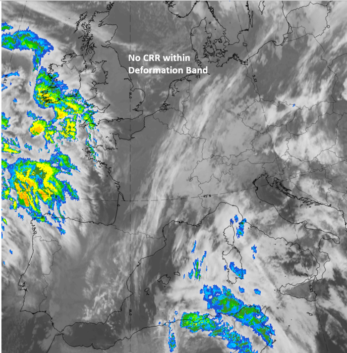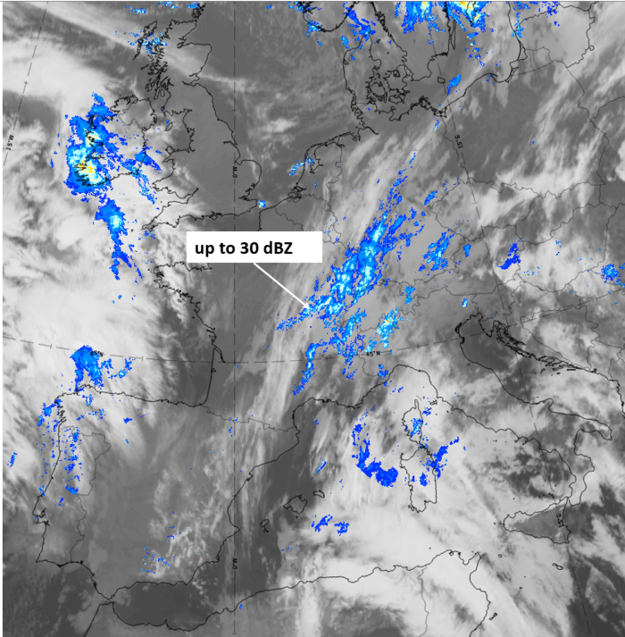

18 December 2019, 06 UTC, IR; superimposed:
1st row: Cloud Type (CT NWCSAF) (above) + Cloud Top Height (CTTH - NWCSAF) (below); 2nd row: Convective Rainfall Rate (CRR NWCSAF) (above) + Radar intensities from Opera radar system (below).

For identifying values for Cloud type (CT), Cloud type height (CTTH), precipitating clouds (PC), and Opera radar for any pixel in the images look into the legends. ([link](https://resources.eumetrain.org/satmanu/CMs/Def/media/images/legends.png))

[Top of page](#header)

### References

- BERGERON T (1928): Über die Dreidimensional Verknüpfende Wetteranalyse (I). Geofys. Publikasjoner, Norske Videnskaps-Akad.
  Oslo 5, No. 6,1-111.
- BLUESTEIN H.B. (1992): Synoptic-Dynamic Meteorology in Midlatitudes, Vol 1: Principles of Kinematics and Dynamics. Oxford Univ. Press.
- CARLSON T. N. (1998): Mid-Latitude Weather Systems, American Meteorological Society.
- HOLTON J.R. (1979): An Introduction to Dynamic Meteorology. 2nd Ed., Academic Press, New York.
- KURZ M (1998).: Synoptic Meteorology; Deutscher Wetterdienst.
- PALMEN E., NEWTON C.W (1969):Atmospheric Circulation Systems. Academic Press.
- SAUCIER W.J (1955): Principles of Meteorological Analysis, Chapter 10. Univ. of Chicago Press, Chicago, Illinois.

Copyright 2014, [EUMeTrain](http://www.eumetrain.org). All rights reserved.
