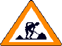
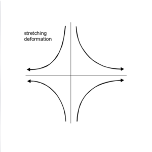
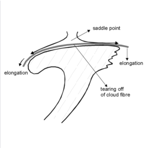
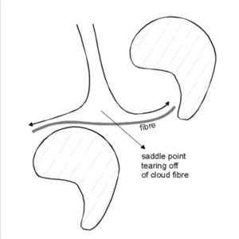
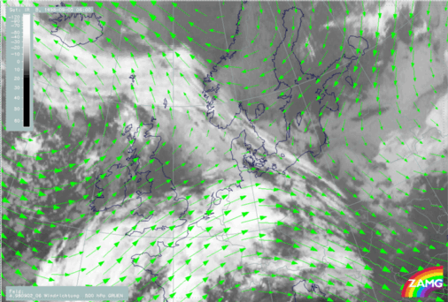

# Deformation Band/Col Region

> Source: <https://rammb.cira.colostate.edu/wmovl/VRL/Tutorials/SatManu-eumetsat/SatManu/CMs/Def/index.htm>  
> Section: Miscellaneous  
> Captured: 2026-08-19 06:00 UTC  
> PDF: [deformation-band-col-region.pdf](deformation-band-col-region.pdf) · Original HTML: [source/original.html](source/original.html)

---

# DEFORMATION BAND

by ZAMG

UNDER CONSTRUCTION

---

Deformation is a quality of the stream field like divergence or vorticity. It consists of two components: stretching and shear deformation. A lot of small scale features in satellite imagery may be explained with the help of deformation. At present only one situation, which can often be detected, is used and formulated as a conceptual model.

Narrow cloud fibres mostly several thousand kilometres long and connecting quasi-different conceptual models undergo elongation. The consequence of this is a:

- lengthening of the cloud fibre at both ends into different directions and
- tearing off somewhere in the middle of the band
- dissolution of the rest of the cloudiness.

The accompanying model fields of wind vectors clearly show the typical form of the stretching deformation with a saddle point, which is the area where the tearing off of the cloud fibre happens. It is not yet clear if the frontogenetic effect of the stretching deformation field contributes to the development of the cloud fibre or is only responsible for its formation. The angle of the isotherms with the outflow axis is the determining factor for frontogenesis and/or frontolysis.

Typical situations where these deformation bands can be observed are:

- the area at the northern boundary of Warm Front and Occlusion cloud bands
- areas between a row of cloud spirals accompanying developing Commas and/or mesoscale Occlusion systems.

This is a conceptual model which aims towards diagnosis of small scale features and the forecast of their elongation and dissolution.

02 September 1998/06.00 UTC - Meteosat IR image; green: wind vectors 500 hPa

The satellite image shows a cloud band extending from south Norway to Poland and Slovakia which is under the influnece of a deformation. The wind field at 500 hPa shows a saddle point over Kattegat at approximately 57N/11E.

---

## Useful Links

- [Relevant Case Studies](https://rammb.cira.colostate.edu/wmovl/VRL/Tutorials/SatManu-eumetsat/SatManu/Cases/index.htm#Def)
- [Short Version](https://rammb.cira.colostate.edu/wmovl/VRL/Tutorials/SatManu-eumetsat/SatManu/Short/Def/short.htm)
- Exercises

---

[Back To Index Of Conceptual Models](https://rammb.cira.colostate.edu/wmovl/VRL/Tutorials/SatManu-eumetsat/SatManu/CMs/index.htm)

---
