# Divergence/Convergence/500mb Chart (Level of Non-Divergence)

> Source: <http://www.weather.gov/source/zhu/ZHU_Training_Page/Miscellaneous/Divergence/divergence.html>  
> Section: Miscellaneous  
> Captured: 2026-08-19 06:00 UTC  
> PDF: [divergence-convergence-500mb-chart-level-of-non-divergence.pdf](divergence-convergence-500mb-chart-level-of-non-divergence.pdf) · Original HTML: [source/original.html](source/original.html)

---

# Divergence/Convergence/Diffluence

**Divergence - Texas A&M University Notes**

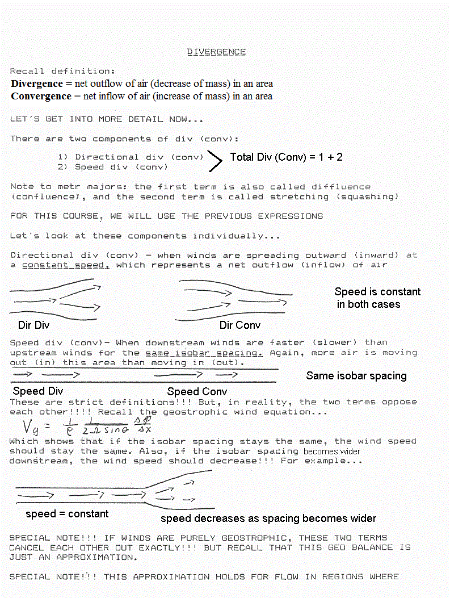
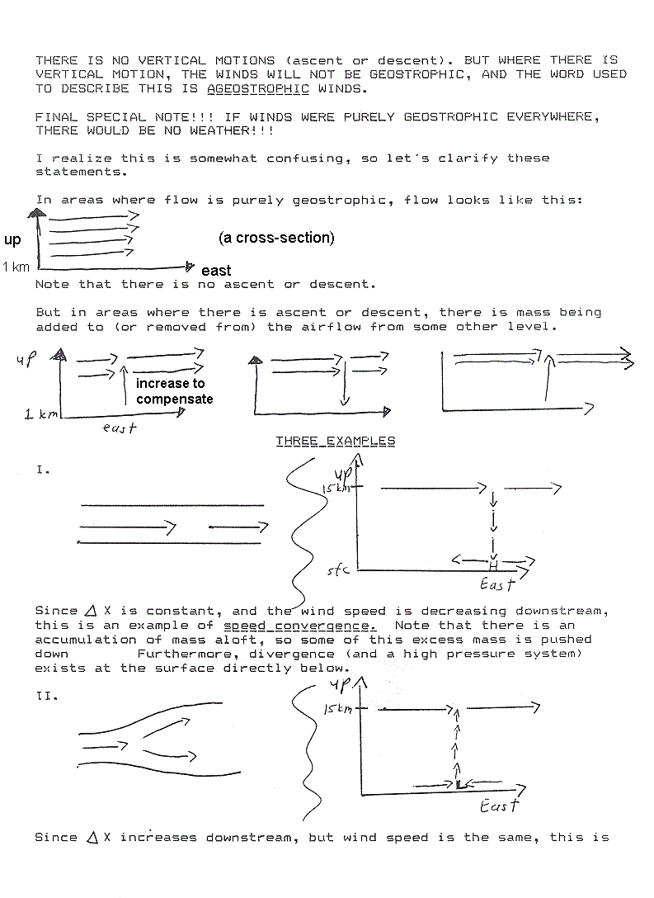
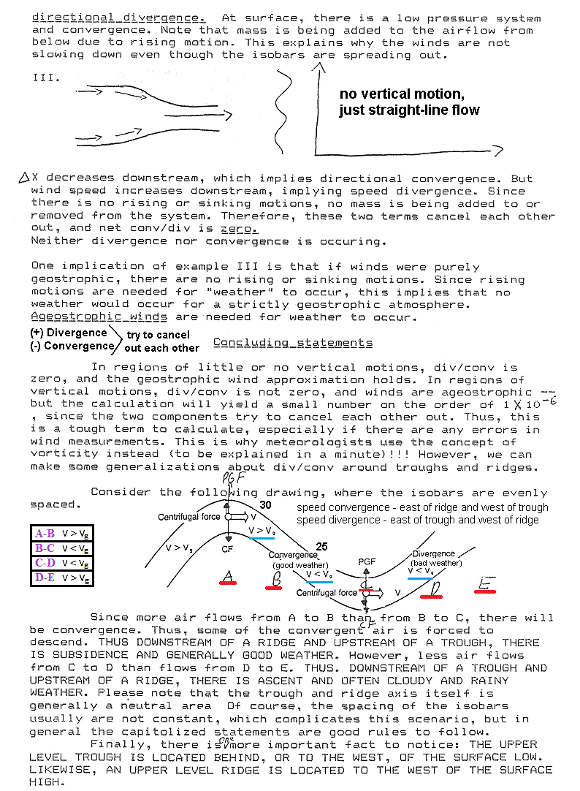
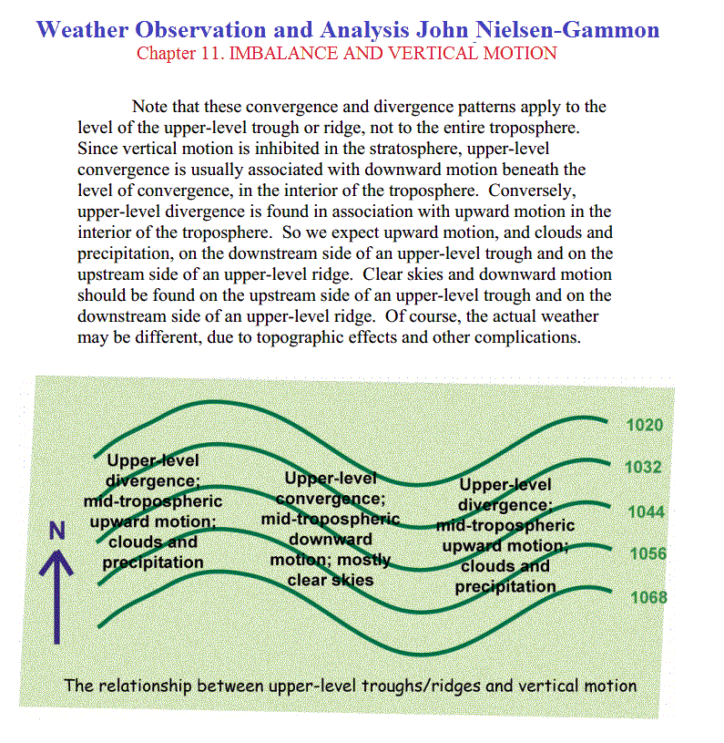
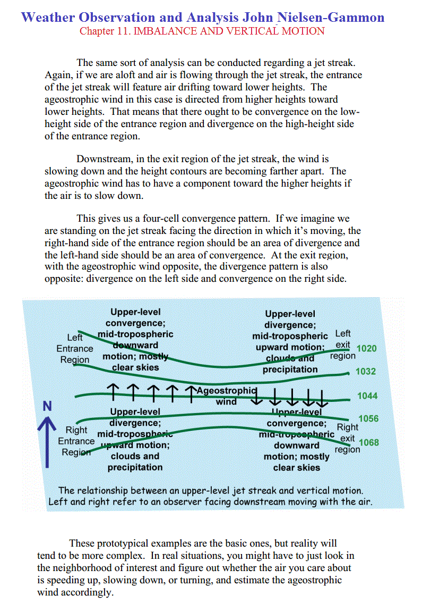

**The Effects Of Divergence & Convergence On Weather Systems**

# The Effects Of Divergence & Convergence On Weather Systems

 Written by [Garry Ward](https://meteorology101.com/author/wardge/)  in [Dynamics](https://meteorology101.com/category/dynamics/)

All atmospheric synoptic scale systems either thrive or die with the abundance or lack of divergence aloft. You can judge the intensity of of a system by how far it extends into the upper levels and if it has a vertical stack or a tilted stack.

An illustration of upper level divergence would be if you turned your ceiling fan on and had the rotation set for a clockwise rotation or blowing up toward the ceiling. When the air being pulled from the floor below the fan reaches the ceiling, it has no place to go but out. This is a picture of divergence aloft.

When an updraft occur in a weather system, it is either caused by low level convergence, a heated surface causing an updraft or the jet stream could act as an air flow being blown over a tube creating a vacuum.

## Divergence

The divergence of a wind field is a measure of the net removal of mass out of a volume of air above a given point.

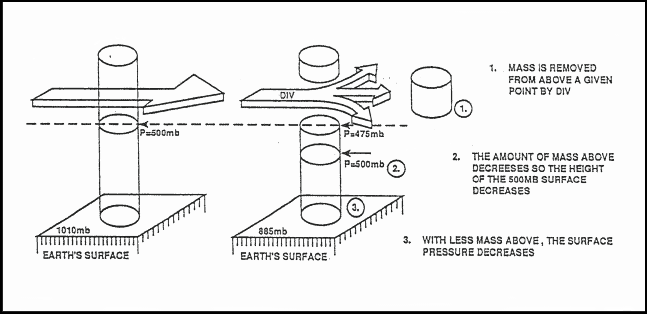

Effects of Divergence

## Convergence

The convergence of the wind field is a measure of the rate of the net addition of mass into a volume above a given point. The effect of convergence is to promote surface pressure and height rises.

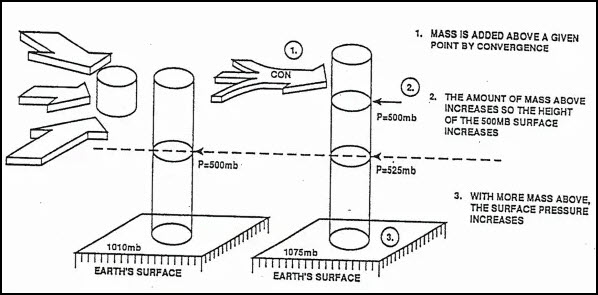

Effects of Convergence

## Main Components

Direction and speed are the main components of the wind flow patterns that cause divergence and convergence.

### Wind Direction

**Directional Diffluence** is the spreading of wind flow and contours, which results in mass being removed from an area.

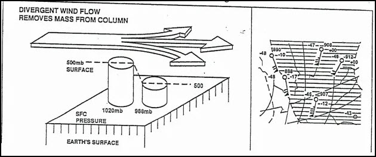

Directional Diffluence

**Directional Confluence** is coming together of wind flow or contours which results is mass being added to the area.

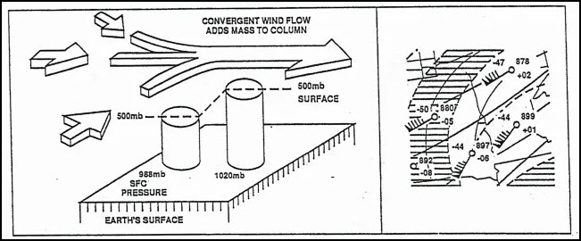

Directional Confluence

### Wind Speed

**Speed divergence** is cause by winds rapidly increasing speed downstream on the pressure surface. High wind speeds will pull mass out of an area faster than it can be replaced by the slower wind speeds, thus decreasing the mass.

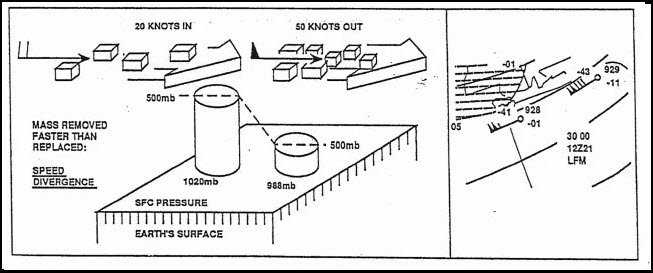

Speed Divergence

**Speed Convergence** is caused by winds rapidly decreasing speed downstream. The higher wind speeds push mass into an area faster than it can be removed by the slower wind speeds, thus increasing the mass.

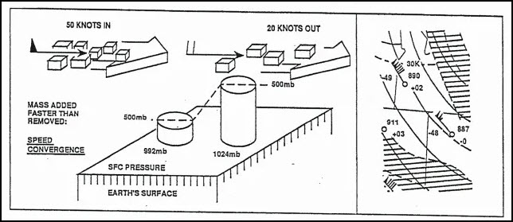

Speed Convergence

Wind direction and speed will offset each other on constant pressure charts. As contour (or Isobar) spacing increases or decreases, wind speeds will increase or decrease to remain a balance of forces. Therefore, divergence (removal of mass), or convergence (addition of mass) are difficult to evaluate on a constant pressure chart. The vorticity chart is used to determine the vertical motions and if net divergence or convergence is occurring aloft.

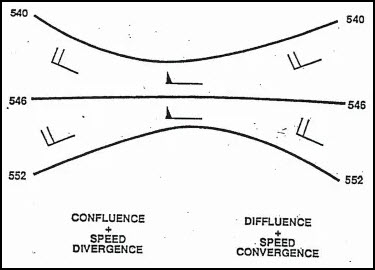

Wind Direction & Speed Offset

## The Effects Of Convergence And Divergence

### The Chimney Effect

If divergence is occurring in the upper troposphere the atmosphere will attempt to compensate by initiating convergence in the lower troposphere, this is called the chimney effect.

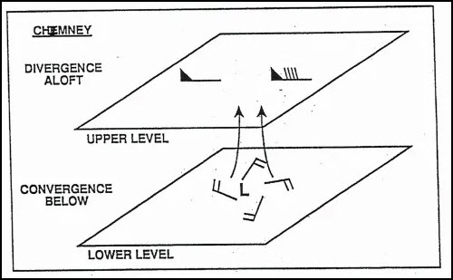

Chimney Effect

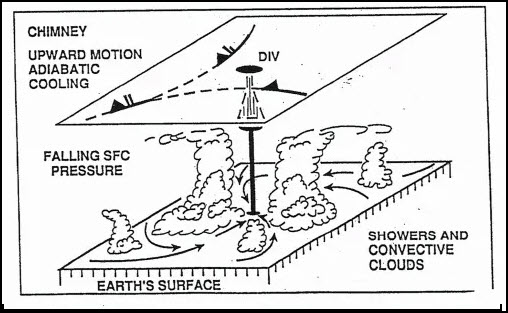

Chimney Effect on the Atmosphere

### The Damper Effect

If convergence is occurring in the upper troposphere the atmosphere will attempt to compensate by initiating divergence in the lower troposphere, this is called the damper effect. This condition results in downward vertical motion and adiabatic warming, which could represent improving weather with increased stability. If convergence aloft is stronger than divergence at low levels, surface pressure and constant pressure surfaces will rise. If the convergence is weaker than the divergence, surface pressure and constant pressure surfaces will fall despite the downward vertical motions.

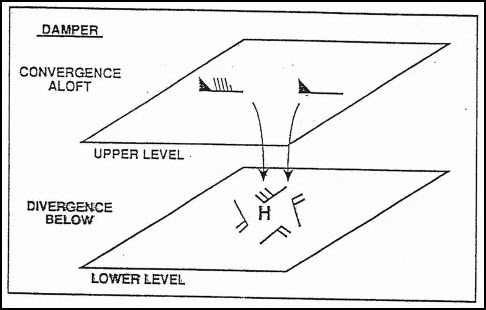

Damper Effect

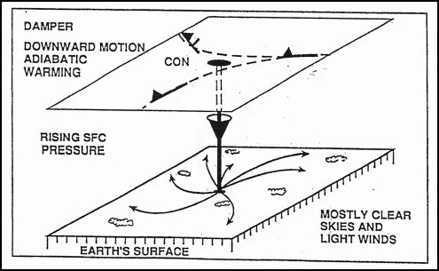

Damper Effect on the Atmosphere

## Level Of Non-Divergence

Convergence or divergence aloft results in the opposite effect in the lower troposphere; therefore, there must exist at some level in the atmosphere a level of non-divergence (LND)

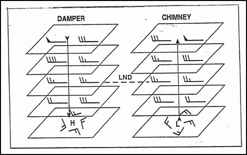

Level Of Non-Divergence (LND)

The LND is found under average conditions around 600mb and marks the level of transition from convergence to divergence and visa/versa. The height of the LND will be highly variable, based on the atmospheric stability.

Divergence in the upper levels and convergence in the lower levels results in upward vertical motion and adiabatic cooling, which could represent deteriorating weather as stability changes. If the divergence aloft is stronger than the convergence at the lower levels, surface pressure and constant pressure surfaces will fall. If the divergence aloft is weaker than the convergence in the lower levels, then the surface and constant pressure surfaces will rise.

## Horizontal Divergence & Convergence

At lower levels, within the boundary layer, friction disrupts the geostrophic balance of forces and causes winds to cross the isobars toward lower pressures. This is called **boundary layer convergence (BLC)** around surface lows and **boundary layer divergence (BLD)** around surface highs.In the upper levels, the gradient wind relationships produce the divergence and convergence associated with the atmospheric waves. Near the tropopause, strong convergence and divergence patterns are produced by the jet stream maxima.

Above the tropopause, due to changes in height of the tropopause caused by the replacement and displacement of mass, warm and cold pockets are found at 200mb and 300mb levels above areas of strong divergence and convergence. **Warm sinks** are warm pockets of stratospheric air evident to the 200mb chart, and found above strong upper level divergence which causes the height of the tropopause to sink with respect to the 200mb surface. **Cold domes** are cold pockets of tropospheric air evident on the 200mb chart, and found above strong upper level convergence which causes the height of the tropopause to raise with respect to the 200mb surface.

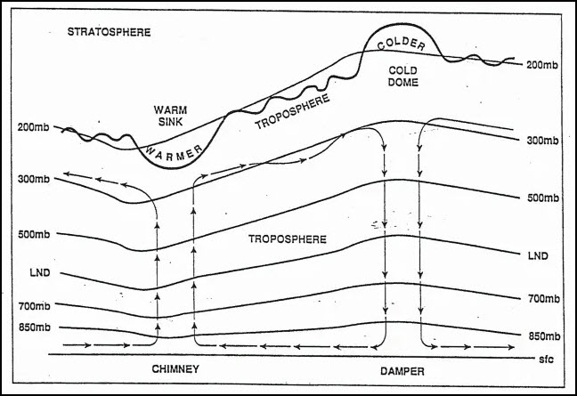

Vertical Cross Section of Chimney & Damper

## Effects Of Temperature Advection

### Effect on Height of Constant Pressure Surfaces

The 1000mb surface and sea level pressure are found below the gradient level, while 700mb level lies above the gradient level when the surface is smooth and located near sea level.The 850mb surface may be above or below the gradient level, depending upon the elevation and roughness of the terrain, stability and wind shear. Typically, in the eastern half of the U.S. the 850mb surface is above the gradient level, temperature advection is typically a maximum somewhere between the gradient level and 500mb.

### Cold Air Advection (CAA)

Cold air advection is when wind flow is displacing warm, less dense air with cold, dense air. Therefore it will tend to sink (subsidence), Because the cold air is more dense, surface pressures and the 1000mb height surface will rise. Heights above the level of maximum CAA will fall. Heights and pressures below the level of maximum CAA will rise. The resulting effect is a decrease in thickness. Because the cold air sinks and causes subsidence, the vertical motion is downward.

### Warm Air Advection (WAA)

Warm air advection is when wind flow is replacing cold dense air with warm, less dense air. Because the warm air is less dense, surface pressures and the 1000mb height surface will fall. Heights above the level of maximum WAA will rise. Heights and pressures below the level of maximum WAA will fall. The result is an increase in thickness. Since the air is warm and less dense, the vertical motion is upward.

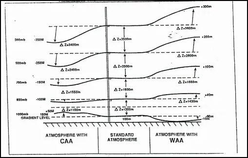

Effect Of Temperature Advection

## Effect of WAA & CAA on Upper Level Ridges & Troughs

**Warm air advection** at the gradient level into a ridge will build it at the upper levels (height rises), while cold air advection into a ridge will weaken it at upper levels (height falls)

**Cold air advection** at the gradient level into a trough will deepen it at the upper levels (height falls), while warm air advection into a trough will fill it at the upper levels (height rises).

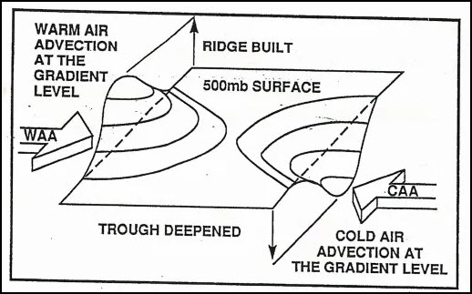

Effect Of Temperature Advection On The Upper Levels

### Combined Effects

The vertical motion is estimated by combining the results of the possible combinations of cold air advection, warm air advection at the gradient level, and convergence and divergence above the LND. When forces oppose each other, then the result is indeterminable. Represented by ? below.

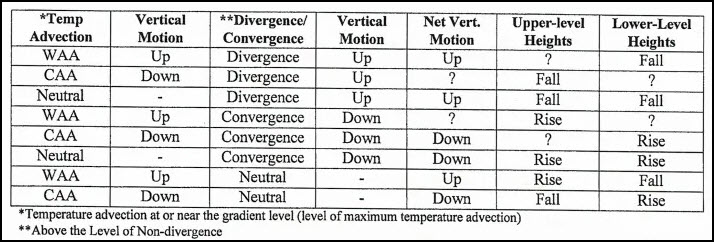

Combined Effects of Divergence/Convergence & Temperature Advection

Temperature advection can be determined by analyzing thickness charts, such as the 1000mb-500mb or the 1000mb-850mb thickness charts, as well as the 850mb chart (700mb in mountainous regions) for determination of WAA or CAA.

The thermal wind relationship can also be applied to determine the temperature advection through a given layer of the atmosphere when the thickness or 850mb charts are not available.

**Divergence in Natural Coordinates**

**SAN FRANSISCO STATE UNIVERSITY, DEPT. OF GEOSCIENCES**

A. Background

While it is easy to visualize how divergence occurs with respect to pressure patterns when there is NO Coriolis effect (air moves at right angles to pressure or height contours towards low values), how does divergence "appear" on charts on which the wind is flowing parallel (or nearly parallel) to contours.

While it is difficult to visualize this, or actually see it on charts, divergence can be conceptualized better if one transforms it into the natural coordinate system. (As before, divergence in natural coordinates takes the form of ∆V/∆s, and has conventional units).

B. Diffluence and Speed Divergence

The concept equation for divergence in natural coordinates is as follows:

**Horizontal Divergence = Diffluence + Speed Divergence**

(Note: if diffluence is negative, it is called confluence, and if speed divergence is negative it is called speed convergence). The plus sign merely means you have to consider both effects, although the algebraic sign of one or both of the terms can be negative.

Let's consider this using the 500 mb level, since that is near the Level of Non-divergence. The concept equation above should produce a value near zero, therefore, when applied to the 500 mb level.

You have enough experience with charts drawn for the middle and upper troposphere (700 mb to 200 mb) to realize that the height and wind patterns resemble sine waves, with ridges and troughs. Let's examine the trough that was associated with the storminess in Southern California on February 22, 2005.

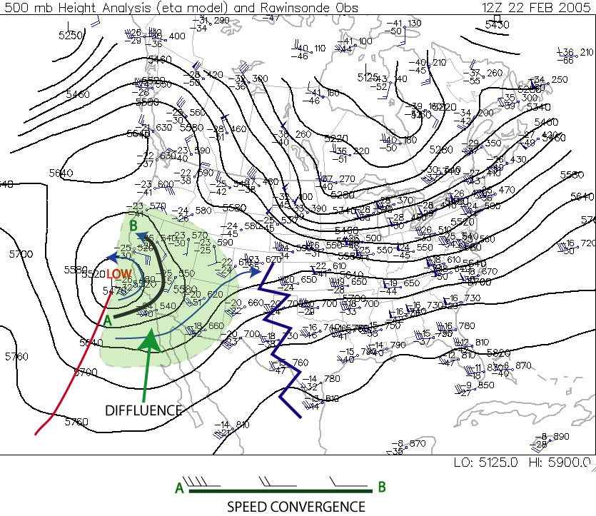

Note that in the green shaded area the wind streamlines are generally splitting apart from trough axis to ridge axis. This is called diffluence and it is very characteristis of trough/ridge systems in the jet stream that diffluence occurs east of troughs and confluence east of ridges.

That would suggest to the eye, at least, that divergence is occuring in the green region. But this is the 500 mb level, the level at which Non-divergence should be occuring.

Note that along each streamline, however, the wind speeds are stronger near the trough axis and weaker near the ridge axis. The inset shows the streamline that stretches from A to B on the chart. You will note that speed convergence is occurring along the streamline (meaning, that the air parcels on the west side of the streamline are "catching up" to the air parcels on the east side.

Thus in the concept equation above, diffluence would have a positive sign, but there would be a negative speed divergence. At the Level of Non-Divergence, these two terms are very nearly equal in opposite, producing non-divergence.

Let's take a look at a chart in the upper troposphere.

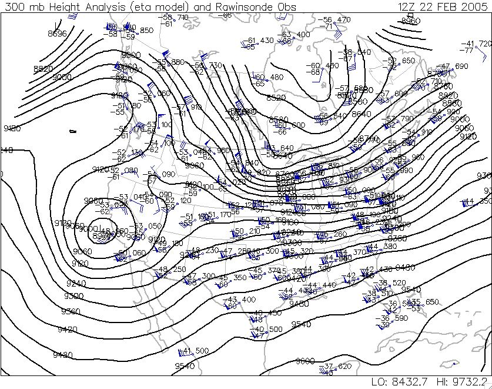

Note first that the chart has a very similar geometry, meaning the troughs and ridges are in basically the same location as they are on the 500 mb chart, as is the jet stream (this occurs in all cases, allowing you to infer positions of jet streams and troughs and ridges in the upper troposphere simply by looking at a 500 mb chart).

Note also that diffluence is occurring in the same region as it is on the 500 mb chart. But, to some extent, so is speed convergence. At this point, we must leave the quasi-quantative discussion aside, because it turns out that in the upper troposphere the two terms generally are not balanced...so that diffluence "wins" out, producing net divergence east of trough axes.

***Below is excerpt from following web page: <http://www.propilotmag.com/archives/2013/April%2013/A4_Wx%20Brief_p1.html>***

Although air is in constant movement through all parts of the troposphere, the layer itself can be divided, meteorologically, in half. The lower half is the layer that provides the heat and moisture needed to support convection, while the upper half is the layer that promotes or suppresses the vertical motion of the air from below. The halfway point—around 500 mb or roughly FL180—is known by meteorologists as the level of nondivergence.

The level of nondivergence (LND) is so called because it rests beneath the upper levels of the troposphere, where a great deal of convergence or divergence of air flow takes place. This convergence and divergence is what helps to enhance or suppress the pressure systems moving along the surface.

For example, an area of diverging air in the upper troposphere will lower the air density aloft, encouraging the uplift of lower-level air and enhancing a surface low beneath it.

Conversely, upper troposphere convergence will increase density there, resulting in increased surface pressure. The strength of convergence or divergence aloft can best be captured by evaluating conditions at the LND.
One of the most important measures of the potential of the upper levels to support convergence or divergence is **vorticity**.

**Highs, Lows, and Weight Management**

**PENN STATE - METEO 3 (Highs, Lows, and Weight Management)**

Imagine for a second that air converges into a column over a surface low all the way from the ground up to the tropopause. Using typically observed values for convergence, such a concentration of mass in this column from convergence would result in an increase in sea-level pressure on the order of 500 millibars over the course of 24 hours (I'm skipping the details of the calculations). Given what you know of the typical range for sea-level pressures, you should realize that such a huge pressure change is completely unrealistic. Indeed, typical sea-level pressure changes amount to only a few to several millibars in one day.

Meteorologists have coined a term for cases with "extreme" sea-level pressure changes with rapidly-developing low-pressure systems (such as occasionally happens along the Atlantic Coast during winter). When sea-level pressure in a rapidly-developing low-pressure system decreases by at least 24 millibars in 24 hours, meteorologists call it "bombogenesis" (pronounced "bomb-o-genesis") because of the "explosive" nature of the weather that occurs with such storms (typically very strong winds and heavy precipitation). Such meteorological "bombs," are extreme cases, however, and may only happen a few times a year, even in parts of the globe prone to such rapid development.

Ultimately, however, such huge sea-level pressure tendencies are so rare because low- and high-pressure systems have "checks and balances" that limit their ability to strengthen. For example, recall that divergence aloft removes weight from local air columns and reduces sea-level pressure (acting alone, creating a weak low at the surface). But, in order to avoid a significant depletion of air from local air columns, air spirals in toward low pressure at the surface. This convergence of air in the lower part of the air column works against the divergence aloft and limits its ability to reduce sea-level pressure.

Thus, a much more realistic profile of convergence and divergence in the column of air over the center of a developing low-pressure system has a more balanced look to it. In the figure below, examine the left panel which shows the pattern of convergence and divergence characteristic of a "steady-state" low-pressure system (neither strengthening or weakening). Surface low-pressure systems which are neither strengthening or weakening have convergence near the surface with an *equal* magnitude of divergence aloft. On the other hand, check out the right panel below which illustrates a realistic profile of the air column at the center of a steady-state high-pressure system. Surface highs have divergence in the lower half of the troposphere and convergence in the upper half of the troposphere.

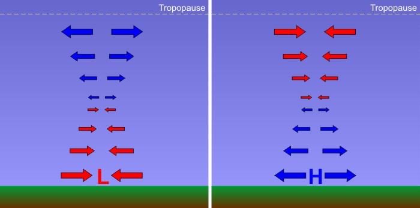

The atmosphere is always trying to correct imbalances. As a result, convergence of air around a surface low is approximately offset by divergence aloft (left), and divergence of air around a surface high is approximately offset by convergence aloft (right). The length of the arrows indicates how much air converges (diverges) into (out of) the column at any level.

Credit: David Babb

For sea-level pressure to change, either convergence or divergence must get the upper hand within an air column. For a modestly developing low-pressure system (sea-level pressure decreases in time), the total amount of air diverging from the low's central air column at high levels (a weight loss) must exceed the total amount of air converging into the low's central air column at low levels (a weight gain). Thus, there must be a *net divergence* and a net loss of weight, allowing the sea-level pressure to decrease and the low to "deepen" (intensify). On the other hand, for a developing high-pressure system (sea-level pressure increases in time), the total amount of air converging into the high's central air column at high levels (causing weight gain) must exceed the total amount of air diverging from the column at low levels (a weight loss). There must be a *net* convergence into the column and a resulting weight gain.

Consider the following two graphs below. These graphs show a plot of convergence and divergence with height. Convergence is shaded in red while divergence is shaded in blue. To figure out the *net* convergence or divergence, compare the sizes of the shaded areas. If the blue area is greater than the red area, then there is more mass divergence out of the column than mass convergence into the column. If the red area is greater than the blue area, then there is more mass convergence into the column than divergence out of the column.

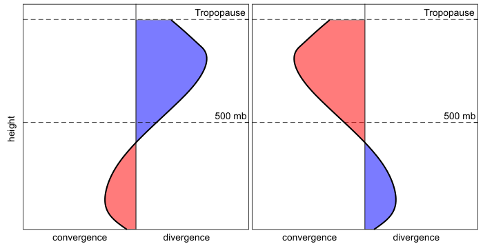

These profile plots of convergence and divergence can tell you a great deal about the sea-level pressure at the bottom of a column. If you compare the total convergence to the total divergence you can determine if the sea-level pressure is rising or falling.

Credit: David Babb

In the plot (above) on the left, notice first that the divergence and convergence profile is associated with a surface low pressure system. How do we know? We know that air swirls in and converges toward the center of low pressure in the lower atmosphere, and this profile shows low-level convergence. But, also notice that the total divergence aloft is much larger than the total convergence, so the column will lose weight over time. That weight loss means that sea-level pressure will decrease and the low-pressure system is deepening (becoming stronger).

We know that the graph on the right above is associated with a surface high-pressure system because there's divergence in the lower part of the atmosphere. But, also notice that the region of convergence aloft is larger than the region of divergence, so the column will gain weight over time. This means that the sea-level pressure will rise in time, further strengthening the high-pressure system.

On the other hand, what if there was a low-pressure system in which the convergence in the lower half of the troposphere was exceeding the divergence aloft? The low would weaken in time because the central air column would be gaining more weight from convergence than it was shedding via divergence aloft. A similar argument holds true for a high that is shedding more weight through divergence in the lower half of the troposphere than it is gaining from convergence aloft. Such a high would weaken in time because sea-level pressure would decrease.

The bottom line is that whenever you're thinking about changes in sea-level pressure, you need to think about weight management. Obviously, divergence and convergence in the upper-half of the troposphere play a pivotal role in the fate of surface low- and high-pressure systems, so weather forecasters are always looking at upper-air patterns to spot regions of convergence and divergence. To give you more of a three-dimensional view of how the vertical patterns of convergence and divergence with low- and high-pressure systems fit together, check out the schematic below.

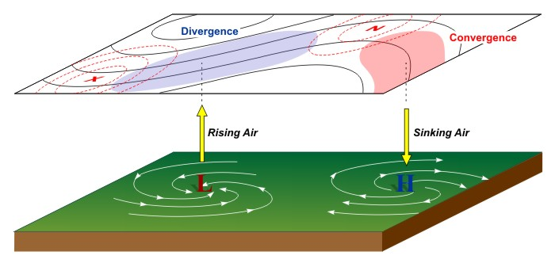

While air swirls inward and converges into the center of surface low pressure, an "upper-level disturbance" causes divergence aloft that allows air columns to shed weight. The end result is rising air, and usually clouds and precipitation associated with a low. Meanwhile, air swirls outward away from the center of surface high pressure, while upper-level convergence allows air columns to gain weight. The end result is sinking air, which typically leads to calm and mostly clear conditions.

Credit: David Babb

In particular, forecasters are always on the lookout for waves and accelerations or decelerations in the winds aloft, often referred to as "upper-level disturbances" which cause divergence aloft (marked by the blue shaded area in the image above), which cause air columns to shed weight and sea-level pressures to decrease. The resulting low-level convergence and rising air frequently causes the clouds and precipitation typically associated with low-pressure systems. On the other hand, regions of convergence aloft cause sea-level pressures to increase. The resulting low-level divergence and sinking air typically leads to the calm and mostly clear conditions associated with surface high-pressure systems.

#### Key Concepts to Remember

- "Steady-state" highs and lows have equal amounts of divergence and convergence in their central air columns, resulting in no change in sea-level pressure.
- A strengthening low-pressure system (sea-level pressure decreasing with time) has upper-level divergence that exceeds low-level convergence, resulting in weight loss in the central air columns.
- A weakening low-pressure system (sea-level pressure increasing with time) has low-level convergence in the column that exceeds upper-level divergence, resulting in weight gain in the central air columns.
- A strengthening high-pressure system (sea-level pressure increasing with time) has upper-level convergence in the column that exceeds low-level divergence, resulting in weight gain in the central air columns.
- A weakening high-pressure system (sea-level pressure decreasing with time) has low-level divergence in the column that exceeds upper-level convergence, resulting in weight loss in the central air columns.

So, it's all about weight management, and ultimately low-pressure systems need a source of upper-level divergence to form and thrive, while high-pressure systems need a source of upper-level convergence to form and thrive.

**500 MB HEIGHT PATTERN AND PRECIPITATION**

**UNIVERSITY OF ARIZONA - ATMOSPHERE 336**

The 500 mb pattern can also be used to locate where surface storms and precipitation are most likely to be occurring. Surface storms and precipitation are most often found over areas downstream of 500 mb troughs (following the horizontal wind direction from a trough to a ridge). The reason for this is that rising air motion is forced in this part of the flow pattern. Rising motion means that surface air is forced to move upward into the atmosphere. Clouds and precipitation develop where air rises. Thus, we try to use weather maps to pick out areas where air is forced to rise upward, as these are places where precipitation may be occurring. Conversely, sinking air motion is forced over areas downstream of ridges. Clouds do not develop where air is sinking. Underneath these areas fair weather is most likely. By looking at a 500 mb map, you should be able to distinguish where precipitation is most likely and where fair weather is most likely.

The reason that rising motion occurs just downstream of 500 mb troughs is that in this region divergence of air occurs above the 500 mb height level in the upper troposphere, while just downstream of ridges, sinking motion occurs as a result of convergence of air above the 500 mb height level in the upper troposphere.

Divergence occurs when horizontal winds cause a net outflow of air from a region (more air leaving a vertical column of air than entering), while convergence occurs when horizontal winds cause a net inflow of air into a region (more air entering a vertical column than leaving it). *Take a look at these  [Notes on dynamical lifting of air](subpages/p500mb-handout1-annotated/p500mb-handout1-annotated.md)  to help you to understand what is meant by divergence and convergence, and why divergence above the 500 mb level in the upper troposphere forces air in a vertical column to rise, while convergence above the 500 mb height level in the upper troposphere forces air in a vertical column to sink.*

You are not expected to understand why upper level divergence and convergence occur downstream of upper level troughs and ridges respectively, just that it does. You should associate upper level divergence, which occurs downstream of 500 mb troughs, with rising air, clouds, and precipitation. Conversely, you should assoicated upper level convergence, which occurs downstream of 500 mb ridges, with sinking air and fair weather (lack of clouds and precipitation).

As shown in the Notes on dynamical lifting of air, the relationship between horizontal divergence/convergence of winds just above the ground surface (at low height levels in the lower troposphere) and rising motion is reversed. This will be discussed further in later lectures along with a review of horizontal convergence and divergence. Typically, where air is rising upward, there will be convergence at low altitudes (below the 500 mb height) and divergence at high altitudes (above the 500 mb height). Conversely, where air is sinking downward, there will be divergence at low altitudes (below the 500 mb height) and convergence at high altitudes (above the 500 mb height). These concepts are also shown in the figure below. This is important since clouds and precipitation happen where air is moving upward with generally cloud-free conditions expected where air is moving downward.

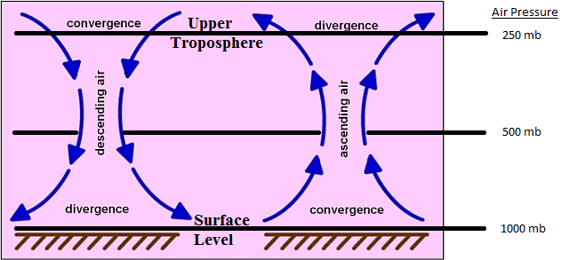

Relationship between horizontal covergence and divergence and vertical air motion.

- Left side shows that sinking air
  motion (air moving vertically downward) is forced by horizontal covergence at the top of the troposphere and divergence at the surface or bottom
  of the troposphere. Convergence in the upper troposphere happens just downwind of 500 mb ridges. Note that the upper-level convergence itself takes
  place above the 500 mb pressure level. Divergence
  in the lower troposphere takes place near surface high pressure areas.
- Right side shows that rising air motion (air moving vertically upward) is forced by divergence
  at the top of the troposphere and convergence at the surface or bottom of the troposphere. Divergence
  in the upper troposphere happens just downwind of 500 mb troughs. Note that the upper-level divergence itself takes place
  above the 500 mb pressure level.
  Convergence in the lower troposphere
  takes place near surface
  low pressure areas. *Clouds and precipitation form in regions where air is ascending or moving upward.*

The amount of precipitation that occurs with a winter-type storm depends on two main
factors: atmospheric dynamics (how strongly air is forced to rise) and the availability
of water vapor. Keep in mind
that if the air does not contain sufficient water vapor, then no matter how forcefully
it rises, clouds and precipitation will not form. On the other hand, if the air contains
a lot of water vapor, then it does not take much lifting before clouds and precipitation
will form. The stronger the
divergence of air in the upper troposphere, the stronger air is forced to rise.
The shape of a 500 mb trough often indicates something about its dynamical strength, i.e.,
its potential to force strong rising motion in the atmosphere and hence strong areas
of precipitation.
Below is a list of several things to look for in 500 mb pattern that act to increase divergence
and hence rising motion. [Link to Hand-drawn pictures for the items
in the list.](subpages/p500mb-handout2/p500mb-handout2.md)

1. Stonger winds increase divergence. Therefore, the more closely spaced the height lines,
   the stronger the divergence downwind of troughs.
2. The more amplified the pattern (amplitude of the ridge/trough pattern), the stronger
   the divergence downwind of troughs.
3. The sharper the curvature of a trough, the stronger the divergence downwind of the
   trough. This is very important when considering shortwaves (defined below).
4. The orientation of the trough axis with repect to a north-south line. Troughs that
   are oriented along a northwest to southeast line are said to a have a "negative tilt",
   while troughs oriented along a northeat to southwest axis are said to have a
   "positive tilt." In general, a negatively tilted trough indicates a stronger weather
   system.

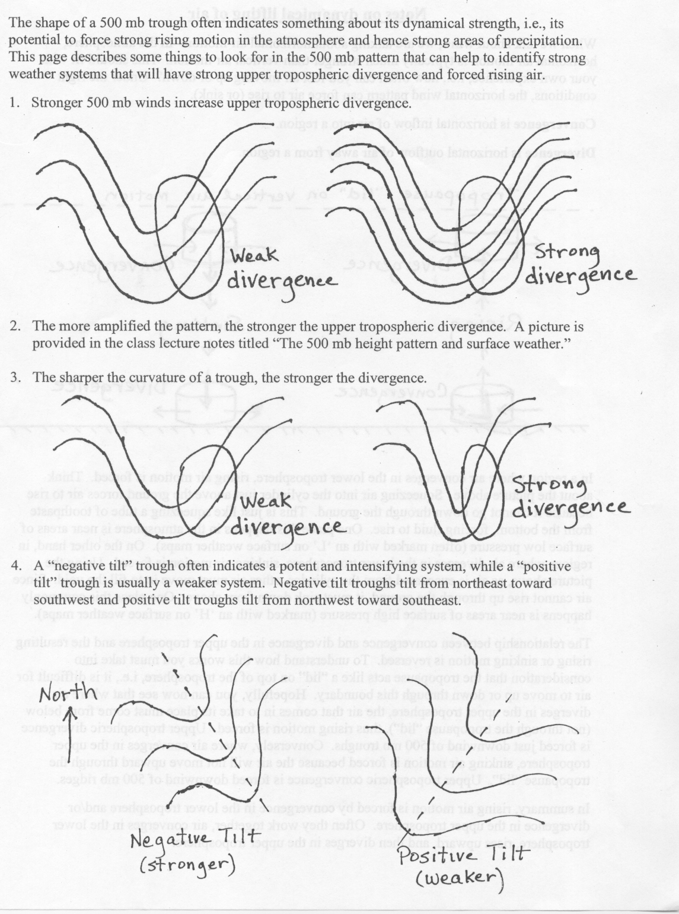

**Divergence Versus Diffluence**

**METEOROLOGIST JEFF HABY**

Divergence occurs when a stronger wind moves away from a weaker wind or when air streams move in opposite directions. When
divergence occurs in the upper levels of the atmosphere it leads to rising air. The rate the air rises depends on the
magnitude of the divergence and other lifting or sinking mechanisms in the atmosphere. The 1st diagram below shows two
examples of divergence.

Diffluence is the spreading of wind vectors. In a diffluent pattern the height contours become further spaced from each
other over distance. Does this spreading out of the wind vectors and height contours cause the air to rise? The 2nd diagram
below is an example of 300-mb diffluence.

In a diffluent pattern, two distinct phenomena occur at the same time. First, strong wind is moving into weaker wind. Where
the height contours are closer spaced, the wind velocity is higher. As you know, a strong wind moving into a weak wind is
convergence. Second, as height contours spread apart, a divergence of air occurs. The convergence due to stronger wind
moving into weaker wind replenishes the mass lost due to the divergence in the diffluent flow. In the bottom diagram below,
notice in the diffluent pattern that strong wind is moving into weaker wind and the air streams are diverging over distance
also.

The effect of convergence and divergence occurring at the same time is no vertical motion. The air is merely being deformed
into a new shape. The air is spreading out, but it is not rising or sinking. It is upper level divergence that causes
rising air. The two best examples of upper level divergence are PVA and divergence associated with the right rear and left
front quadrants of a jet streak. Upper level diffluence by itself does not cause rising air.

An upper level diffluence pattern by itself does not cause rising air. It is upper level divergence that causes rising air.

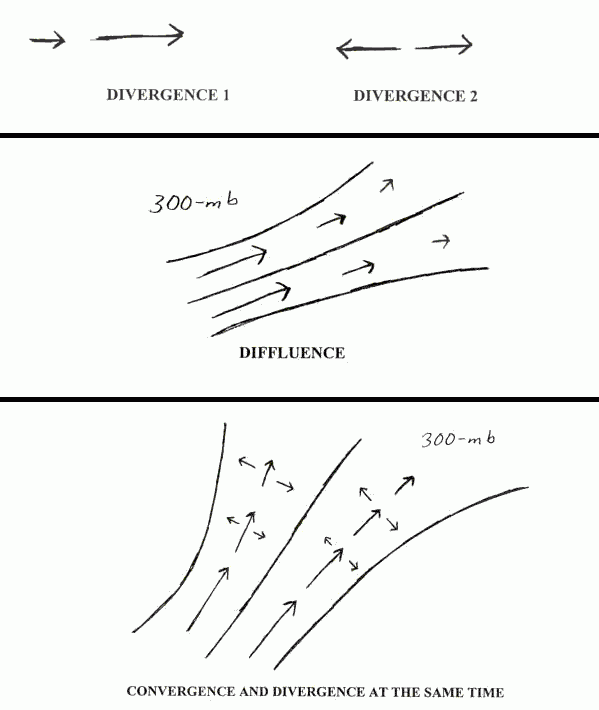
