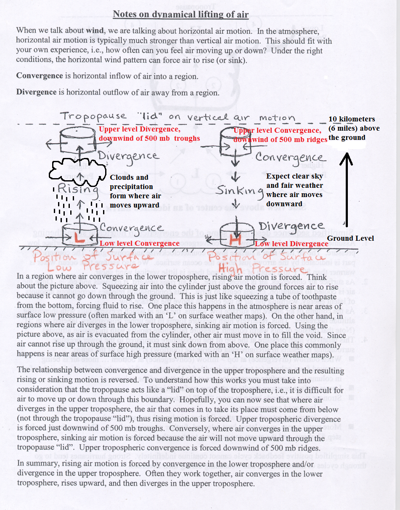

# Divergence/Convergence/500mb Chart (Level of Non-Divergence) — Notes on dynamical lifting of air

> Source: <http://www.weather.gov/source/zhu/ZHU_Training_Page/Miscellaneous/Divergence/p500mb_handout1_annotated.png>  
> Section: Miscellaneous  
> Captured: 2026-08-19 06:00 UTC  
> PDF: [p500mb-handout1-annotated.pdf](p500mb-handout1-annotated.pdf) · 951×1214px

---

