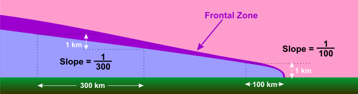
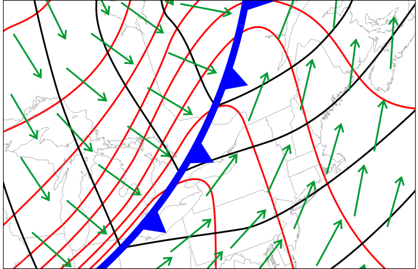
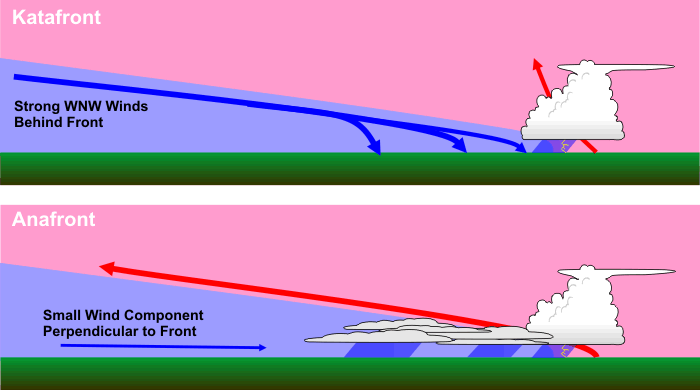

# Fronts/Frontogenesis — Cold Fronts

> Source: <https://www.e-education.psu.edu/meteo3/l7_p5.html>  
> Section: Miscellaneous  
> Captured: 2026-08-19 06:00 UTC (via Wayback Machine: https://web.archive.org/web/20210506192841/https://www.e-education.psu.edu/meteo3/l7_p5.html)  
> PDF: [fronts-frontogenesis-cold-fronts.pdf](fronts-frontogenesis-cold-fronts.pdf) · Original HTML: [source/original.html](source/original.html)

---

[Skip to main content](#main-content)

METEO 3
 Introductory Meteorology

[Meteorology Department](http://www.meteo.psu.edu/) [Penn State](http://www.psu.edu/)

- [HOME](https://www.e-education.psu.edu/meteo3/)
- [SYLLABUS](https://www.e-education.psu.edu/meteo3/syllabus)
- [LESSONS](https://www.e-education.psu.edu/meteo3/node/1940)
- [GETTING HELP](https://www.e-education.psu.edu/meteo3/node/2257)
- [LOGIN](https://www.e-education.psu.edu/meteo3/login)

# Cold Fronts

[‹ Cooking Up a Mid-Latitude Cyclone](https://www.e-education.psu.edu/meteo3/l7_p4.html "Go to previous page")
[Warm Fronts and Stationary Fronts ›](../fronts-frontogenesis-warm-stationary-fronts/fronts-frontogenesis-warm-stationary-fronts.md "Go to next page")

### Prioritize...

After reading this section, you should be able to describe the structure of a cold front, explain what typically causes rising air near cold fronts, and describe the weather that often accompanies cold frontal passages (including temperature and dew point trends, clouds and precipitation, and winds). You should also be able to describe the difference between katafronts and anafronts.

### Read...

As you just learned, cold fronts form as a natural consequence of the circulation of mid-latitude cyclones (the circulation causes a cold air mass to advance on the west (and eventually south) side of the low (in the Northern Hemisphere). You already studied the basics of cold fronts in a previous lesson, primarily the idea that **a cold front is the leading edge of an advancing cold air mass**. Cold fronts, marked by a [chain of blue triangles](https://www.e-education.psu.edu/meteo3/sites/www.e-education.psu.edu.meteo3/files/images/lesson3/cold_front.png) pointing in the direction of movement (toward the warmer air), often mark the boundary between a maritime-Tropical (mT) and an advancing continental-Polar (cP) air mass or perhaps the boundary between a cP air mass and an advancing continental-Arctic (cA) air mass (the coldest of the cold). As a result, temperatures and dew points often decrease after a cold front passes (as colder, drier air arrives at your location). But, now it's time to look more closely at cold fronts so that we can better understand their other weather impacts.

For starters, what determines whether cold air advances, retreats or just holds its ground? To answer this question, weather forecasters *always look at the winds on the cold side of a front*. As long as the surface wind on the cold side of a front is blowing at least somewhat toward the front, cold air advances and the forecasters classify the front as cold. However, if cold air advances at a speed less than 5 knots (about 5 miles an hour), forecasters classify the front as "stationary" by convention.

But, air masses aren't just two-dimensional. They are three-dimensional blobs of air, so when cold air advances at the surface, cold air at higher altitudes also advances on warm air. Therefore, the narrow frontal zone that separates the two contrasting air masses must extend upward from the surface. To see what I mean, focus your attention on the cross-sectional profile of an advancing continental-Polar air mass below. The cold front is steepest in the lowest several hundred meters of the atmosphere with a slope of about 1/100, meaning that elevation increases about 1 kilometer for every 100 kilometers of horizontal distance from the surface front. Then the upward slant relaxes into a much more gentle slope (e.g. 1/300). All along the upward slant of the cold wedge, cold air abuts with warmer air, creating an upward-slanting boundary characterized by large temperature contrasts.

A vertical slice through the troposphere across a classic cold front reveals that the steepest slope of the "dome" of advancing cold air lies in the lowest several hundred meters near the leading edge of the cold air (near the cold front). Away from the leading edge of cold air, this cross section shows that the upward slant of the "cold dome" relaxes into a much more gentle slope.

Credit: David Babb

The depth of this **frontal zone** associated with a cP air mass typically extends to altitudes as high as five kilometers, so there can be fronts in middle troposphere (and on occasion, in the upper troposphere). Upper-air fronts are favored locations for turbulence that affects aircraft, so pilots are always on the lookout for these high-altitude frontal features.

After a surface cold front passes a given location, cold-air advection always follows in its wake (remember, cold air advances in concert with a cold front). During winter, temperatures usually tumble in response to strong cold-air advection associated with the arrival of a chilly continental-Polar air mass or a frigid continental-Arctic air mass. From late spring through early fall, however, daytime temperatures often rise after a morning passage of a cold front, provided, of course, that skies become sunny and strong solar heating can overwhelm the usually weak cold advection following summer cold fronts.

As pointed out previously, fronts lie in troughs of low pressure and are thus marked by a wind shift. Below is a typical pattern of isobars (black lines) forming the trough that houses a cold front. Note the wind shift from south-southwesterly winds (green arrows) on the warm side of the front to west-northwesterly winds on the cold side of the front.

As a cold front advances eastward, surface winds blow from the south for a long time just ahead of the cold front, causing temperatures to spike upward and creating a northward bulge in the surface isotherms. Operational forecasters call this northward spike in isotherms a thermal ridge. As a result, weather forecasters usually place cold fronts just to the west of thermal ridges.

Credit: David Babb

Besides being housed in a pressure trough, a cold front also lies in a **thermal ridge**, which is a northward bulge in the surface isotherms (red lines on the graphic above). A thermal ridge marks an elongated area of maximum warmth, supporting the notion that temperatures typically increase along or just ahead of a cold front. That may seem puzzling to you, but it's generally true. As a cold front approaches a given location, winds start to blow from the south, allowing increasingly warm air to move northward. As the cold front bears down on the location, southerly winds intensify, enhancing the build-up of warm air. Thus, by the time the cold front reaches the given location, winds have blown from the south there for the longest time (compared to locations farther east), allowing temperatures to spike. Taking into account all locations along and just ahead of the cold front, the general spike in temperatures takes the form of a thermal ridge.

So, cold fronts typically bring a surge of warmth just ahead of them, and their passage brings a wind shift and cold advection. But, what are the other weather impacts of a cold frontal passage? First, consider that surface air converges at the cold front (remember, a cold front lies in a trough which always marks a wind shift and a zone of convergence). The relatively "steep" nature of the cold front near the surface can result in strong surface convergence, and [surface convergence promotes rising currents of air](https://www.e-education.psu.edu/meteo3/sites/www.e-education.psu.edu.meteo3/files/images/lesson9/surface_conv0903.jpg). Second, consider that warm, moist air along and ahead of the cold front can be favorable for the development of thunderstorms (you may recall that warm, moist air has greater positive buoyancy, which favors rising air parcels via convection). [Thus, showers and / or thunderstorms often precede the passage of a cold front](https://www.e-education.psu.edu/meteo3/sites/www.e-education.psu.edu.meteo3/files/images/lesson9/cf_onvection0903.gif) (although not as often in the winter).

In the wake of the front, cold-air advection tends to promote currents of sinking air, which helps cause clouds to evaporate, promoting clearing or partially clearing skies. Cold fronts that promote currents of sinking air in their wakes are called **katafronts**. A katafront, by definition, is a front with sinking air currents on its cold side. *Most cold fronts are katafronts.*

However, not *all* cold fronts behave this way. For particularly slow-moving cold fronts, it is possible to have rising air behind the surface front (along the upper-level frontal zone). Weather forecasters refer to *any kind* of surface front characterized by upward motion on its cold side as an **anafront**. Anafrontal cold fronts often have steady rain or snow that develops within the cold air behind the front. For example, check out the 12Z [surface analysis on January 13, 2007](https://www.e-education.psu.edu/meteo3/sites/www.e-education.psu.edu.meteo3/files/images/lesson9/anacoldfront0903.gif). The green blobs mark areas where precipitation was falling at the time (note the area of precipitation on the cold side of the cold front in the East).

Weather forecasters classify a cold front as a katafront if air sinks on the cold side of the front. Indeed, most cold fronts tend to be katafronts because cold air moving with strong westerly winds often catches up to the front and sinks down the frontal zone toward the ground, promoting clearing. If, however, air rises on the cold side of a front and clouds and / or precipitation form, forecasters classify the front as an anafront.

Credit: David Babb

Wind speeds also often increase near cold fronts, especially after a katafrontal cold front passes. These fast winds can help cause [eddies to form](https://www.e-education.psu.edu/meteo3/sites/www.e-education.psu.edu.meteo3/files/images/lesson9/eddy_creation0903.jpg), and these eddies mix momentum toward the surface from relatively fast winds several thousand feet above the ground, increasing the surface wind speed and often causing the wind to become quite gusty.

#### What to expect with a cold front...

- cold advection in its wake. Temperatures often fall after a cold front passes as a colder mass arrives (although this may not be the case in the warmer months, when solar heating during the day can overwhelm cold advection).
- a decrease in dew points behind the front. Arriving continental-Polar or continental-Arctic air masses are often drier than the air masses ahead of the cold front.
- rising currents of air caused by low-level convergence, which often leads to clouds, showers, and / or thunderstorms along and ahead of the front.
- sinking air and clearing skies behind the front, as long as it's a katafront (as most cold fronts are).
- a minimum in sea-level pressure as the front passes (remember that fronts lie in pressure troughs).
- A shift in wind direction, and often gusty winds near the front and behind it.

I should point out that most occluded fronts behave somewhat like cold fronts. They, too, bring a wind shift and low-level convergence that can lead to clouds and showers. Anafronts, however, are a different story, as they cause rising air in a different way. We'll explore the main types of anafronts (warm fronts and stationary fronts) in the next section. Read on.

[‹ Cooking Up a Mid-Latitude Cyclone](https://www.e-education.psu.edu/meteo3/l7_p4.html "Go to previous page")
[Warm Fronts and Stationary Fronts ›](../fronts-frontogenesis-warm-stationary-fronts/fronts-frontogenesis-warm-stationary-fronts.md "Go to next page")

- [Print](https://www.e-education.psu.edu/meteo3/print/book/export/html/2014 "Display a printer-friendly version of this page.")

METEO 3  Introductory Meteorology

## Lessons

- [Lesson 1: A Meteorologist's Toolbox](https://www.e-education.psu.edu/meteo3/l1.html)
- [Lesson 2: The Global Ledger of Heat Energy](https://www.e-education.psu.edu/meteo3/l2.html)
- [Lesson 3: Global and Local Controllers of Temperature](https://www.e-education.psu.edu/meteo3/l3.html)
- [Lesson 4: The Role of Water in Weather](https://www.e-education.psu.edu/meteo3/l4.html)
- [Lesson 5: Remote Sensing of the Atmosphere](https://www.e-education.psu.edu/meteo3/l5.html)
- [Lesson 6: Surface Patterns of Pressure and Wind](https://www.e-education.psu.edu/meteo3/l6.html)
- [Lesson 7: Mid-Latitude Weather Systems](https://www.e-education.psu.edu/meteo3/l7.html)
  - [Upper-Air Patterns](https://www.e-education.psu.edu/meteo3/l7_p2.html)
  - [Highs, Lows, and Weight Management](https://www.e-education.psu.edu/meteo3/node/2244)
  - [Cooking Up a Mid-Latitude Cyclone](https://www.e-education.psu.edu/meteo3/l7_p4.html)
  - [Cold Fronts](fronts-frontogenesis-cold-fronts.md)
  - [Warm Fronts and Stationary Fronts](../fronts-frontogenesis-warm-stationary-fronts/fronts-frontogenesis-warm-stationary-fronts.md)
  - [Conveyor Belts](https://www.e-education.psu.edu/meteo3/l7_p7.html)
  - [Types of Winter Precipitation](https://www.e-education.psu.edu/meteo3/l7_p8.html)
  - [Winter Weather Safety](https://www.e-education.psu.edu/meteo3/l7_p9.html)
- [Lesson 8: The Role of Stability in Thunderstorm Formation](https://www.e-education.psu.edu/meteo3/l8.html)
- [Lesson 9: Severe Weather](https://www.e-education.psu.edu/meteo3/l9.html)
- [Lesson 10: The Human Impact on Weather and Climate](https://www.e-education.psu.edu/meteo3/l10.html)
- [Lesson 11: Patterns of Wind, Water, and Weather in the Tropics](https://www.e-education.psu.edu/meteo3/l11.html)
- [Lesson 12: Hurricanes](https://www.e-education.psu.edu/meteo3/l12.html)
- [Lesson 13: Becoming a Savvy Weather Consumer](https://www.e-education.psu.edu/meteo3/l13.html)

## Search form

Search

Course Author: Steven Seman (Assistant Teaching Professor, Department of Meteorology and Atmospheric Science, College of Earth and Mineral Sciences,
The Pennsylvania State University). Some portions adapted from original course materials by David Babb and Lee M. Grenci.

This courseware module is part of Penn State's College of Earth and Mineral Sciences' [OER Initiative](http://open.ems.psu.edu/).

Except where otherwise noted, content on this site is licensed under a [Creative Commons Attribution-NonCommercial-ShareAlike 4.0 International License](http://creativecommons.org/licenses/by-nc-sa/4.0/).

The College of Earth and Mineral Sciences is committed to making its websites accessible to all users, and welcomes comments or suggestions on access improvements. Please send comments or suggestions on accessibility to the [site editor](mailto:editor@e-education.psu.edu?subject=Question/Feedback for METEO 3). The site editor may also be contacted with questions or comments about this Open Educational Resource.

The John A. Dutton e-Education Institute is the learning design unit of the [College of Earth and Mineral Sciences](http://www.ems.psu.edu) at [The Pennsylvania State University](http://www.psu.edu).

### Navigation

- [Home](http://www.e-education.psu.edu/)
- [News](http://www.e-education.psu.edu/news)
- [About](http://www.e-education.psu.edu/about)
- [Contact Us](http://www.e-education.psu.edu/contact)
- [Programs and Courses](http://www.e-education.psu.edu/node/4)
- [People](http://www.e-education.psu.edu/node/3)
- [Resources](http://www.e-education.psu.edu/node/5)
- [Services](http://www.e-education.psu.edu/node/6)
- [Login](https://www.e-education.psu.edu/meteo3/user)

### EMS

- [College of Earth and Mineral Sciences](http://www.ems.psu.edu/)
- [Department of Energy and Mineral Engineering](http://www.eme.psu.edu/)
- [Department of Geography](http://www.geog.psu.edu/)
- [Department of Geosciences](http://www.geosc.psu.edu/)
- [Department of Materials Science and Engineering](http://www.matse.psu.edu/)
- [Department of Meteorology and Atmospheric Science](http://www.met.psu.edu/)
- [Earth and Environmental Systems Institute](https://www.eesi.psu.edu/)
- [Earth and Mineral Sciences Energy Institute](http://www.energy.psu.edu/)

### Programs

- [Online Geospatial Education Programs](http://gis.e-education.psu.edu/)
- [iMPS in Renewable Energy and Sustainability Policy Program Office](http://ress.psu.edu/)
- [BA in Energy and Sustainability Policy Program Office](http://esp.e-education.psu.edu/)
- [M.Ed. in Earth Sciences Program Office](http://earth.e-education.psu.edu/)

### Related Links

- [Dutton Community Yammer Group](https://www.yammer.com/psu.edu/#/threads/inGroup?type=in_group&feedId=1099225)
- [Penn State Digital Learning Cooperative](http://dlc.psu.edu/)
- [Penn State World Campus](http://www.worldcampus.psu.edu/)
- [Web Learning @ Penn State](https://weblearning.psu.edu/)

<!--/\*--><![CDATA[/\* ><!--\*/
@namespace url(xhtml.html);
/\*--><!]]>\*/

<!--/\*--><![CDATA[/\* ><!--\*/
@namespace url(xhtml.html);
/\*--><!]]>\*/

<!--/\*--><![CDATA[/\* ><!--\*/
@namespace url(xhtml.html);
/\*--><!]]>\*/

[2217 Earth and Engineering Sciences Building, University Park, Pennsylvania 16802](https://goo.gl/maps/9SC1XJVPTqD2)
[Contact Us](http://www.psu.edu/contact-us)

[Privacy & Legal Statements](http://www.psu.edu/web-privacy-statement) | [Copyright Information](http://www.psu.edu/copyright-information)
The Pennsylvania State University © 2020
