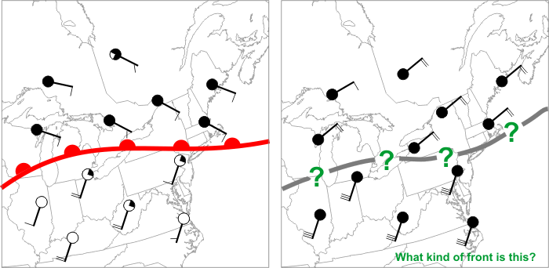
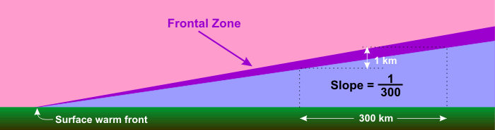
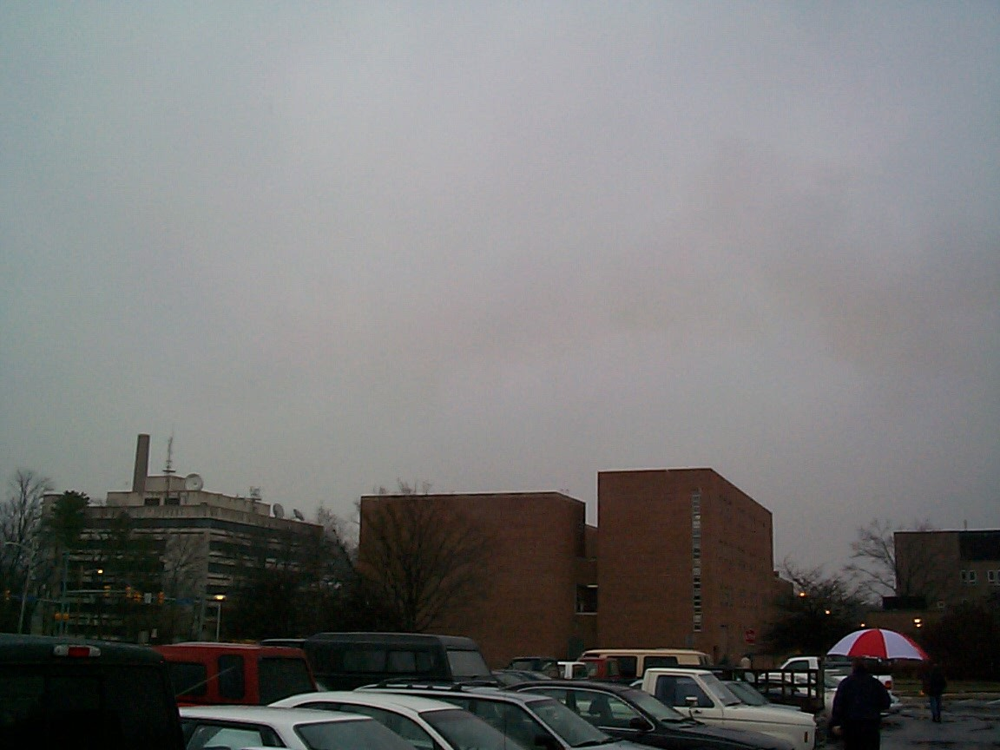
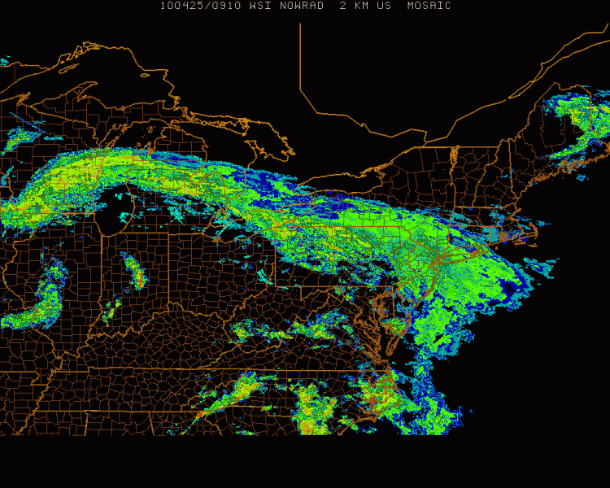

# Fronts/Frontogenesis — Warm/Stationary Fronts

> Source: <https://www.e-education.psu.edu/meteo3/l7_p6.html>  
> Section: Miscellaneous  
> Captured: 2026-08-19 06:00 UTC (via Wayback Machine: https://web.archive.org/web/20240510203456/https://www.e-education.psu.edu/meteo3/l7_p6.html)  
> PDF: [fronts-frontogenesis-warm-stationary-fronts.pdf](fronts-frontogenesis-warm-stationary-fronts.pdf) · Original HTML: [source/original.html](source/original.html)

---

[Skip to main content](#main-content)

METEO 3
 Introductory Meteorology

[Meteorology Department](http://www.meteo.psu.edu/) [Penn State](http://www.psu.edu/)

- [HOME](https://www.e-education.psu.edu/meteo3/)
- [SYLLABUS](https://www.e-education.psu.edu/meteo3/syllabus)
- [LESSONS](https://www.e-education.psu.edu/meteo3/node/1940)
- [GETTING HELP](https://www.e-education.psu.edu/meteo3/node/2257)
- [LOGIN](https://www.e-education.psu.edu/meteo3/login)

# Warm Fronts and Stationary Fronts

[‹ Cold Fronts](../fronts-frontogenesis-cold-fronts/fronts-frontogenesis-cold-fronts.md "Go to previous page")
[Conveyor Belts ›](https://www.e-education.psu.edu/meteo3/l7_p7.html "Go to next page")

### Prioritize...

By the end of this section, you should be able to define warm fronts and stationary fronts and properly characterize them as anafronts. You should also be able to describe the process of overrunning and the resulting clouds and weather associated with these types of fronts.

### Read...

As with cold fronts, we've also studied the basics of warm and stationary fronts previously, but we mainly defined the difference between the two. Now it's time to look a bit closer at the structure of these fronts and the weather associated with them. To review, a warm front isn't simply the leading edge of advancing warm air (as a cold front is the leading edge of advancing colder air). To see what I mean, review the idealized weather maps below:

In the case of a classic warm front (left), cold air north of the front retreats, allowing warm air to advance at the surface. What about the front on the right?  Note the strong southerly winds south of the front. Those strong southerly winds can't push warm air northward at the surface if cold air isn't retreating.

Credit: David Babb

The image on the left shows a classic **warm front**, which is marked by a [chain of red semicircles](https://www.e-education.psu.edu/meteo3/sites/www.e-education.psu.edu.meteo3/files/images/lesson3/warm_front.png) directed toward the cold air. This boundary is a warm front because the cold air is retreating (winds on the cold side of the front are blowing away from the front). Why is the retreat of cold air important? Because cold air is more dense than warm air at the surface of the earth, cold air is "the boss" and can push its way around as it pleases. So, warm air can only advance if cold air retreats, and the presence of a warm front signals that cold air is retreating.

What about the boundary on the right? Is it a warm front? The winds in the warm air (south of the boundary) make it look like the warm air is advancing, but that's not the case because the cold air is not retreating: The winds on the cold side of the front are actually blowing slightly toward the front, meaning this is actually a cold front. Remember that determining the type of front is a matter of figuring out whether the cold air is retreating or advancing (and forecasters do so by examining the winds on the cold side of the front).

If cold air is neither advancing nor retreating, then we have a **stationary front**, which is marked by [a chain of alternating blue triangles and red semicircles](https://www.e-education.psu.edu/meteo3/sites/www.e-education.psu.edu.meteo3/files/images/lesson3/stat_front2.png). In such a scenario, winds on the cold side of the front blow mostly parallel to the front, resulting in a frontal movement of less than five knots (fronts moving at less than 5 knots are considered stationary). Again, the winds on the warm side of the front don't really matter: Cold air is the boss, and if the cold air isn't advancing or retreating, the front is stationary.

In the context of mid-latitude cyclones, stationary fronts east of the low's center [typically become warm fronts](https://www.e-education.psu.edu/meteo3/sites/www.e-education.psu.edu.meteo3/files/images/lesson7/low_development.jpg) as the low's circulation causes cold air northeast of the low's center to retreat northward (allowing warm air to advance), but if stronger winds on the warm side of a front are of no consequence in pushing back the cold air, this would suggest that warm fronts are structurally different from cold fronts. Remember that near the surface, a cold front is quite steep, as the cold air wedges its way underneath the warmer air mass. Because cold air is *retreating* near the surface of a warm front, its profile looks different from that of a cold front. Notice that with a warm front (in the cross-section schematic below), the slope of the frontal zone is uniform throughout the lower atmosphere and is on average about 300 to 1 (1 kilometer vertical for every 300 kilometers in the horizontal). This gentle, consistent slope has a dramatic impact on the type of clouds and precipitation generated by a warm front.

The wedge of cold air north of a warm front usually has a very shallow slope, averaging one kilometer in depth for every 300 kilometers in horizontal distance from the location of the surface warm front.

Credit: David Babb

Generally speaking, dense (heavy) cold air retreats more slowly than the wind speeds on the warm side of the front. As a result, warm air rapidly overtakes the cold air at the surface. However, because warm air is less dense than cold air (at equal pressures), it is [forced up the incline created by the cold-air wedge](https://www.e-education.psu.edu/meteo3/sites/www.e-education.psu.edu.meteo3/files/images/lesson7/warm_front_slice0904_annotate.png). Meteorologists often say that the warm air *overruns* the cold air -- the process is often called **overrunning**, which results in air gliding up the frontal zone.

Thus, **all conventional warm fronts are anafronts** because overrunning produces rising air on the cold side of the front (all stationary fronts are anafronts as well). Unlike the convective clouds along and ahead of a cold front, clouds that form north of a warm front are usually stratiform in nature (layered clouds). That's because parcels rising along the frontal zone of a warm front quickly find themselves cooler than their surroundings, which prevents them from rising via convection (they are negatively buoyant). But, with steady overrunning continuing below the now negatively buoyant parcels of cloudy air, rising parcels take a more lateral path, spreading out in large horizontal sheets. Thus, clouds that form as a consequence of overrunning tend to form in multiple, shallow layers (you may recall that such layered clouds fall into the "stratus" family).

Rain falls from nimbostratus clouds on the Penn State University Park campus.

Credit: David Babb

Typically, the further you are from an approaching warm front, the higher the stratiform clouds. As a warm front approaches a given location, a deck of [cirrostratus](https://www.e-education.psu.edu/meteo3/sites/www.e-education.psu.edu.meteo3/files/images/lesson9/cirrostratus0904.jpg) clouds dims sunshine or moonshine, and sometimes a [22-degree halo](https://www.e-education.psu.edu/meteo3/sites/www.e-education.psu.edu.meteo3/files/images/lesson9/halo0904.jpg) or [sundogs](https://en.wikipedia.org/wiki/Sun_dog) appear as ice crystals in cirrostratus refract light like glass prisms. Then, a deck of [altostratus](https://www.e-education.psu.edu/meteo3/sites/www.e-education.psu.edu.meteo3/files/images/lesson9/altostratus0904.jpg) builds, with only a faint image of the sun now visible through this layer of middle clouds. Finally, the ceiling continues to lower toward the ground, with steady rain or snow falling from nimbostratus (see photo on the right). Cloud ceilings can be as low as a few hundred feet, sometimes resulting in heavy fog on hill tops or mountain tops.

There's an old saying in weather folklore that states "Halo around the sun or moon, snow or rain is coming soon." The progression of clouds ahead of a warm front I just described explains why that saying often has some merit. High cirrostratus clouds can create a halo, but as a warm front draws closer, cloud bases typically lower to altostratus, and eventually nimbostratus clouds which produce precipitation (the progression from cirrostratus to nimbostratus may take a day or a little more).

Not surprisingly, upward speeds associated with the relatively gentle ascent from overrunning are on the order of several centimeters per second. Compare this with the several to tens of meters per second ascent found in the line of strong thunderstorms along a fast-moving cold front. This benign lifting causes warm fronts contain light, but widespread stratiform precipitation. As an example, consider the 09Z [surface analysis on April 25, 2010](https://www.e-education.psu.edu/meteo3/sites/www.e-education.psu.edu.meteo3/files/images/lesson9/surface_analysis0904.gif), and note the warm front associated with a deep low-pressure system centered over western Illinois. The widespread overrunning associated with the warm front produced a wide swath of stratiform precipitation as seen in the 0910Z radar reflectivity map (below). You can easily identify stratiform precipitation on the radar image by noting the large, relatively uniform region of 15-35 dBZ reflectivity values (greens and pale yellows) from off the East Coast back to the eastern Great Lakes. Although typically benign in terms of severe weather, we will learn that warm fronts in winter can bring a mixed bag of snow, sleet, and freezing rain.

A large area of stratiform precipitation stretching from off the East Coast back toward the eastern Great Lakes formed north of a warm front, in concert with overrunning on April 25, 2010.

Credit: WSI Corporation

I should note that, once in awhile, convective showers can develop north of the warm front within a mostly stratiform area of precipitation. This can happen when a strong [upper-level disturbance creates strong divergence aloft](https://www.e-education.psu.edu/meteo3/sites/www.e-education.psu.edu.meteo3/files/images/lesson9/warm_front_convect0904.gif) that can force the layer of air above the overrunning warm air to also rise. Precipitation in these areas of convection can be briefly heavy (but typically not as heavy as the thunderstorms that sometimes develop along and ahead of a cold front). Nonetheless, convection on the cold side of a warm front can, during winter, for example, produce splotches of extremely heavy snow, or even "thunder snow" (which [gets some meteorologists awfully excited](https://www.youtube.com/embed/xSweKAp_Icc?rel=0) because it's relatively rare) within a large area of generally moderate snow.

When a warm front passes a given location, temperatures tend to increase (as colder air retreats and a warmer air mass arrives). Pressure also reaches a minimum with a warm frontal passage (remember that all fronts lie in pressure troughs). The steady rain typically comes to an end after a warm front passes as your location enters the warm sector, but the chances for showers and possibly thunderstorms increase again as the mid-latitude cyclone's cold front approaches.

#### What to expect with a warm front...

- increasing temperatures as the front approaches and passes (as colder air retreats and warmer air arrives).
- rising air on the cold side of the front via overrunning, which results in a gradually thickening deck of stratiform clouds (cirrostratus to altostratus, and eventually to nimbostratus typically) and a large area of light to moderate precipitation (typically).
- a minimum in sea-level pressure as the front passes (remember that fronts lie in pressure troughs).
- a shift in wind direction, with winds typically blowing increasingly from the south after the front passes.

As a reminder, stationary fronts are also anafronts and generate rising air on their cold sides via overrunning as well. Therefore, layered stratiform clouds and precipitation are often found on the cold side of stationary fronts, too. Furthermore, since the cold air mass isn't moving, precipitation can occasionally be long-lasting, which can increase the risk for flooding (especially in the warmer months).

Now that we've looked at the types of fronts associated with mid-latitude cyclones and the types of weather that they bring, let's look at mid-latitude cyclone features on satellite and radar imagery. I think this look will help you reinforce some of the concepts from the last few sections. Read on.

[‹ Cold Fronts](../fronts-frontogenesis-cold-fronts/fronts-frontogenesis-cold-fronts.md "Go to previous page")
[Conveyor Belts ›](https://www.e-education.psu.edu/meteo3/l7_p7.html "Go to next page")

- [Print](https://www.e-education.psu.edu/meteo3/print/book/export/html/2015 "Display a printer-friendly version of this page.")

METEO 3  Introductory Meteorology

## Lessons

- [Lesson 1: A Meteorologist's Toolbox](https://www.e-education.psu.edu/meteo3/l1.html)
- [Lesson 2: The Global Ledger of Heat Energy](https://www.e-education.psu.edu/meteo3/l2.html)
- [Lesson 3: Global and Local Controllers of Temperature](https://www.e-education.psu.edu/meteo3/l3.html)
- [Lesson 4: The Role of Water in Weather](https://www.e-education.psu.edu/meteo3/l4.html)
- [Lesson 5: Remote Sensing of the Atmosphere](https://www.e-education.psu.edu/meteo3/l5.html)
- [Lesson 6: Surface Patterns of Pressure and Wind](https://www.e-education.psu.edu/meteo3/l6.html)
- [Lesson 7: Mid-Latitude Weather Systems](https://www.e-education.psu.edu/meteo3/l7.html)
  - [Upper-Air Patterns](https://www.e-education.psu.edu/meteo3/l7_p2.html)
  - [Highs, Lows, and Weight Management](https://www.e-education.psu.edu/meteo3/node/2244)
  - [Cooking Up a Mid-Latitude Cyclone](https://www.e-education.psu.edu/meteo3/l7_p4.html)
  - [Cold Fronts](../fronts-frontogenesis-cold-fronts/fronts-frontogenesis-cold-fronts.md)
  - [Warm Fronts and Stationary Fronts](fronts-frontogenesis-warm-stationary-fronts.md)
  - [Conveyor Belts](https://www.e-education.psu.edu/meteo3/l7_p7.html)
  - [Types of Winter Precipitation](https://www.e-education.psu.edu/meteo3/l7_p8.html)
  - [Winter Weather Safety](https://www.e-education.psu.edu/meteo3/l7_p9.html)
- [Lesson 8: The Role of Stability in Thunderstorm Formation](https://www.e-education.psu.edu/meteo3/l8.html)
- [Lesson 9: Severe Weather](https://www.e-education.psu.edu/meteo3/l9.html)
- [Lesson 10: The Human Impact on Weather and Climate](https://www.e-education.psu.edu/meteo3/l10.html)
- [Lesson 11: Patterns of Wind, Water, and Weather in the Tropics](https://www.e-education.psu.edu/meteo3/l11.html)
- [Lesson 12: Hurricanes](https://www.e-education.psu.edu/meteo3/l12.html)
- [Lesson 13: Becoming a Savvy Weather Consumer](https://www.e-education.psu.edu/meteo3/l13.html)

## Search form

Search

Course Author: Steven Seman (Assistant Teaching Professor, Department of Meteorology and Atmospheric Science, College of Earth and Mineral Sciences,
The Pennsylvania State University). Some portions adapted from original course materials by David Babb and Lee M. Grenci.

This courseware module is offered as part of the [Repository of Open and Affordable Materials](https://roam.libraries.psu.edu/) at Penn State.

Except where otherwise noted, content on this site is licensed under a [Creative Commons Attribution-NonCommercial-ShareAlike 4.0 International License](http://creativecommons.org/licenses/by-nc-sa/4.0/).

The College of Earth and Mineral Sciences is committed to making its websites accessible to all users, and welcomes comments or suggestions on access improvements. Please send comments or suggestions on accessibility to the [site editor](mailto:editor@e-education.psu.edu?subject=Question/Feedback for METEO 3). The site editor may also be contacted with questions or comments about this Open Educational Resource.

The [John A. Dutton Institute for Teaching and Learning Excellence](https://dutton.psu.edu) is the learning design unit of the [College of Earth and Mineral Sciences](https://www.ems.psu.edu) at [The Pennsylvania State University](https://www.psu.edu).

### Navigation

- [Home](https://dutton.psu.edu)
- [News](https://dutton.psu.edu/news)
- [About](https://dutton.psu.edu/about)
- [Contact Us](https://dutton.psu.edu/contact-us)
- [People](https://dutton.psu.edu/about)
- [Resources](https://dutton.psu.edu/resources)
- [Services](https://dutton.psu.edu/services)
- [Login](https://www.e-education.psu.edu/meteo3/user)

### EMS

- [College of Earth and Mineral Sciences](http://www.ems.psu.edu/)
- [Department of Energy and Mineral Engineering](http://www.eme.psu.edu/)
- [Department of Geography](http://www.geog.psu.edu/)
- [Department of Geosciences](http://www.geosc.psu.edu/)
- [Department of Materials Science and Engineering](http://www.matse.psu.edu/)
- [Department of Meteorology and Atmospheric Science](http://www.met.psu.edu/)
- [Earth and Environmental Systems Institute](https://www.eesi.psu.edu/)
- [Earth and Mineral Sciences Energy Institute](http://www.energy.psu.edu/)

### Programs

- [Online Geospatial Education Programs](https://geospatial.psu.edu/)
- [iMPS in Renewable Energy and Sustainability Policy Program Office](http://ress.psu.edu/)
- [BA in Energy and Sustainability Policy Program Office](https://esp.e-education.psu.edu/)

### Related Links

- [Penn State Digital Learning Cooperative](http://dlc.psu.edu/)
- [Penn State World Campus](http://www.worldcampus.psu.edu/)
- [Web Learning @ Penn State](https://weblearning.psu.edu/)

<!--/\*--><![CDATA[/\* ><!--\*/
@namespace url(xhtml.html);
/\*--><!]]>\*/

<!--/\*--><![CDATA[/\* ><!--\*/
@namespace url(xhtml.html);
/\*--><!]]>\*/

<!--/\*--><![CDATA[/\* ><!--\*/
@namespace url(xhtml.html);
/\*--><!]]>\*/

[2217 Earth and Engineering Sciences Building, University Park, Pennsylvania, 16802](https://goo.gl/maps/9SC1XJVPTqD2)
[Contact Us](http://www.psu.edu/contact-us)

[Privacy & Legal Statements](http://www.psu.edu/web-privacy-statement) | [Copyright Information](http://www.psu.edu/copyright-information)
The Pennsylvania State University © 2023
