# Fronts/Frontogenesis

> Source: <http://www.weather.gov/media/zhu/ZHU_Training_Page/Miscellaneous/fronts/fronts.pdf>  
> Section: Miscellaneous  
> Captured: 2026-08-19 06:00 UTC  
> PDF: [fronts-frontogenesis.pdf](fronts-frontogenesis.pdf) (22 pages)

---

## Page 1

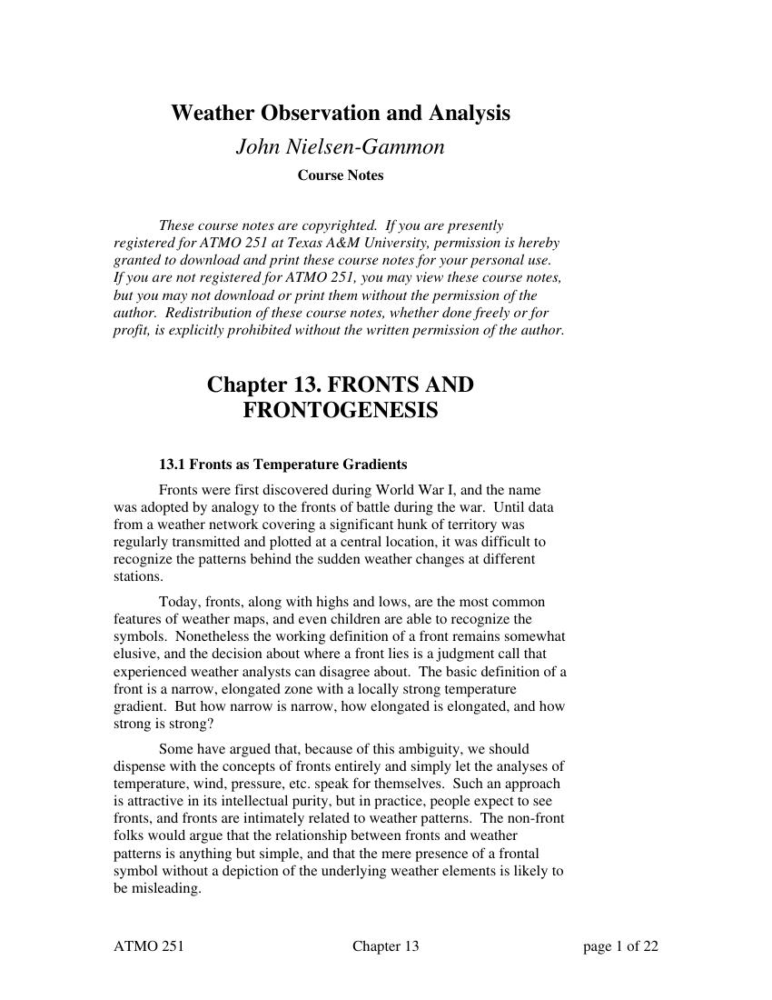

Weather Observation and Analysis 
John Nielsen-Gammon 
Course Notes 
 
These course notes are copyrighted.  If you are presently 
registered for ATMO 251 at Texas A&M University, permission is hereby 
granted to download and print these course notes for your personal use.  
If you are not registered for ATMO 251, you may view these course notes, 
but you may not download or print them without the permission of the 
author.  Redistribution of these course notes, whether done freely or for 
profit, is explicitly prohibited without the written permission of the author. 
 
Chapter 13. FRONTS AND 
FRONTOGENESIS  
 
13.1 Fronts as Temperature Gradients 
Fronts were first discovered during World War I, and the name 
was adopted by analogy to the fronts of battle during the war.  Until data 
from a weather network covering a significant hunk of territory was 
regularly transmitted and plotted at a central location, it was difficult to 
recognize the patterns behind the sudden weather changes at different 
stations. 
Today, fronts, along with highs and lows, are the most common 
features of weather maps, and even children are able to recognize the 
symbols.  Nonetheless the working definition of a front remains somewhat 
elusive, and the decision about where a front lies is a judgment call that 
experienced weather analysts can disagree about.  The basic definition of a 
front is a narrow, elongated zone with a locally strong temperature 
gradient.  But how narrow is narrow, how elongated is elongated, and how 
strong is strong? 
Some have argued that, because of this ambiguity, we should 
dispense with the concepts of fronts entirely and simply let the analyses of 
temperature, wind, pressure, etc. speak for themselves.  Such an approach 
is attractive in its intellectual purity, but in practice, people expect to see 
fronts, and fronts are intimately related to weather patterns.  The non-front 
folks would argue that the relationship between fronts and weather 
patterns is anything but simple, and that the mere presence of a frontal 
symbol without a depiction of the underlying weather elements is likely to 
be misleading. 
ATMO 251 
Chapter 13 
page 1 of 22

## Page 2

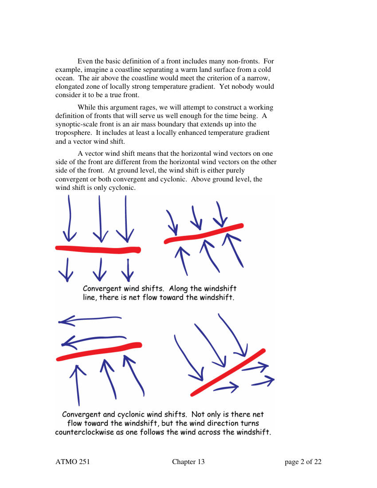

Even the basic definition of a front includes many non-fronts.  For 
example, imagine a coastline separating a warm land surface from a cold 
ocean.  The air above the coastline would meet the criterion of a narrow, 
elongated zone of locally strong temperature gradient.  Yet nobody would 
consider it to be a true front. 
While this argument rages, we will attempt to construct a working 
definition of fronts that will serve us well enough for the time being.  A 
synoptic-scale front is an air mass boundary that extends up into the 
troposphere.  It includes at least a locally enhanced temperature gradient 
and a vector wind shift.   
A vector wind shift means that the horizontal wind vectors on one 
side of the front are different from the horizontal wind vectors on the other 
side of the front.  At ground level, the wind shift is either purely 
convergent or both convergent and cyclonic.  Above ground level, the 
wind shift is only cyclonic.   
 
ATMO 251 
Chapter 13 
page 2 of 22

## Page 3

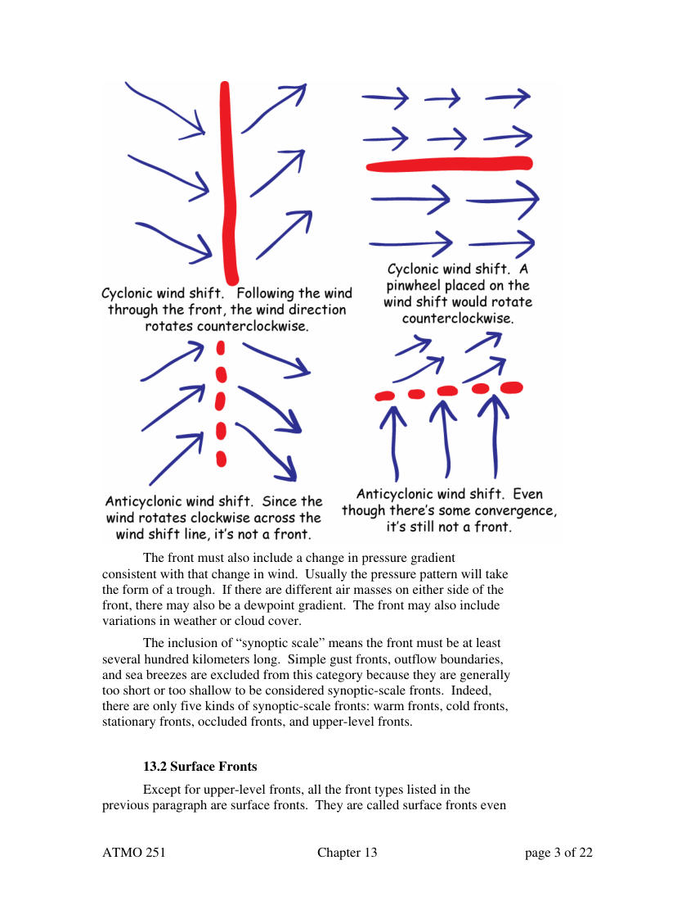

The front must also include a change in pressure gradient 
consistent with that change in wind.  Usually the pressure pattern will take 
the form of a trough.  If there are different air masses on either side of the 
front, there may also be a dewpoint gradient.  The front may also include 
variations in weather or cloud cover. 
The inclusion of “synoptic scale” means the front must be at least 
several hundred kilometers long.  Simple gust fronts, outflow boundaries, 
and sea breezes are excluded from this category because they are generally 
too short or too shallow to be considered synoptic-scale fronts.  Indeed, 
there are only five kinds of synoptic-scale fronts: warm fronts, cold fronts, 
stationary fronts, occluded fronts, and upper-level fronts. 
 
13.2 Surface Fronts 
Except for upper-level fronts, all the front types listed in the 
previous paragraph are surface fronts.  They are called surface fronts even 
ATMO 251 
Chapter 13 
page 3 of 22

## Page 4

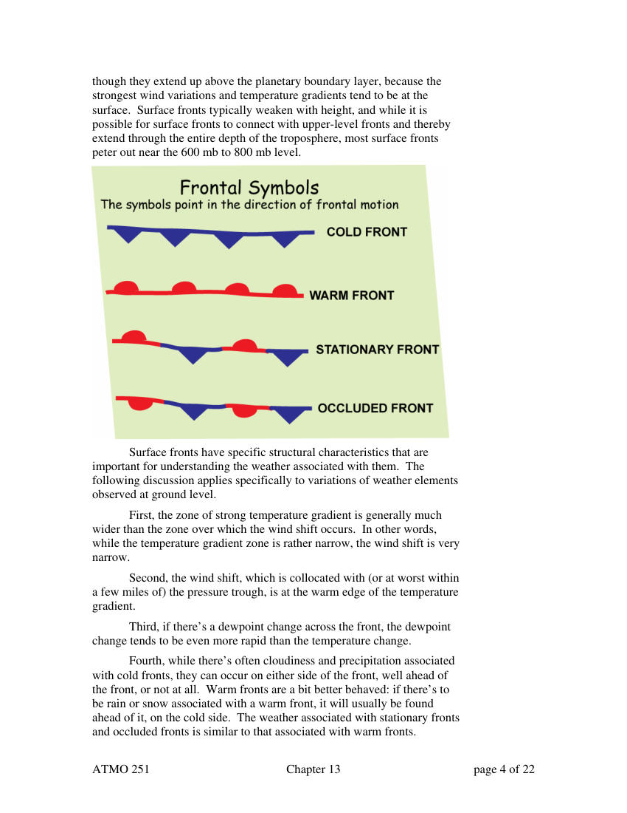

though they extend up above the planetary boundary layer, because the 
strongest wind variations and temperature gradients tend to be at the 
surface.  Surface fronts typically weaken with height, and while it is 
possible for surface fronts to connect with upper-level fronts and thereby 
extend through the entire depth of the troposphere, most surface fronts 
peter out near the 600 mb to 800 mb level. 
 
Surface fronts have specific structural characteristics that are 
important for understanding the weather associated with them.  The 
following discussion applies specifically to variations of weather elements 
observed at ground level. 
First, the zone of strong temperature gradient is generally much 
wider than the zone over which the wind shift occurs.  In other words, 
while the temperature gradient zone is rather narrow, the wind shift is very 
narrow. 
Second, the wind shift, which is collocated with (or at worst within 
a few miles of) the pressure trough, is at the warm edge of the temperature 
gradient.   
Third, if there’s a dewpoint change across the front, the dewpoint 
change tends to be even more rapid than the temperature change.   
Fourth, while there’s often cloudiness and precipitation associated 
with cold fronts, they can occur on either side of the front, well ahead of 
the front, or not at all.  Warm fronts are a bit better behaved: if there’s to 
be rain or snow associated with a warm front, it will usually be found 
ahead of it, on the cold side.  The weather associated with stationary fronts 
and occluded fronts is similar to that associated with warm fronts. 
ATMO 251 
Chapter 13 
page 4 of 22

## Page 5

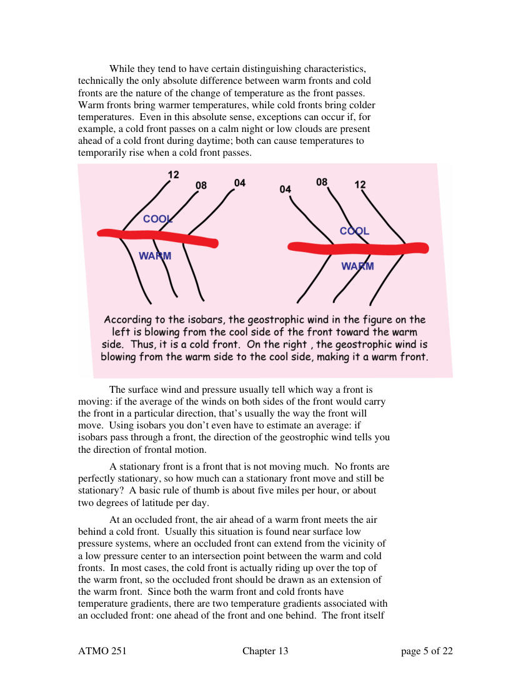

While they tend to have certain distinguishing characteristics, 
technically the only absolute difference between warm fronts and cold 
fronts are the nature of the change of temperature as the front passes.  
Warm fronts bring warmer temperatures, while cold fronts bring colder 
temperatures.  Even in this absolute sense, exceptions can occur if, for 
example, a cold front passes on a calm night or low clouds are present 
ahead of a cold front during daytime; both can cause temperatures to 
temporarily rise when a cold front passes.   
 
The surface wind and pressure usually tell which way a front is 
moving: if the average of the winds on both sides of the front would carry 
the front in a particular direction, that’s usually the way the front will 
move.  Using isobars you don’t even have to estimate an average: if 
isobars pass through a front, the direction of the geostrophic wind tells you 
the direction of frontal motion. 
A stationary front is a front that is not moving much.  No fronts are 
perfectly stationary, so how much can a stationary front move and still be 
stationary?  A basic rule of thumb is about five miles per hour, or about 
two degrees of latitude per day. 
At an occluded front, the air ahead of a warm front meets the air 
behind a cold front.  Usually this situation is found near surface low 
pressure systems, where an occluded front can extend from the vicinity of 
a low pressure center to an intersection point between the warm and cold 
fronts.  In most cases, the cold front is actually riding up over the top of 
the warm front, so the occluded front should be drawn as an extension of 
the warm front.  Since both the warm front and cold fronts have 
temperature gradients, there are two temperature gradients associated with 
an occluded front: one ahead of the front and one behind.  The front itself 
ATMO 251 
Chapter 13 
page 5 of 22

## Page 6

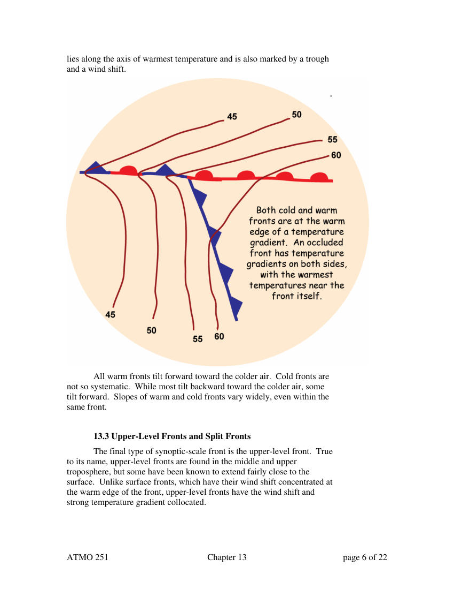

lies along the axis of warmest temperature and is also marked by a trough 
and a wind shift. 
 
All warm fronts tilt forward toward the colder air.  Cold fronts are 
not so systematic.  While most tilt backward toward the colder air, some 
tilt forward.  Slopes of warm and cold fronts vary widely, even within the 
same front.   
 
13.3 Upper-Level Fronts and Split Fronts 
The final type of synoptic-scale front is the upper-level front.  True 
to its name, upper-level fronts are found in the middle and upper 
troposphere, but some have been known to extend fairly close to the 
surface.  Unlike surface fronts, which have their wind shift concentrated at 
the warm edge of the front, upper-level fronts have the wind shift and 
strong temperature gradient collocated. 
ATMO 251 
Chapter 13 
page 6 of 22

## Page 7

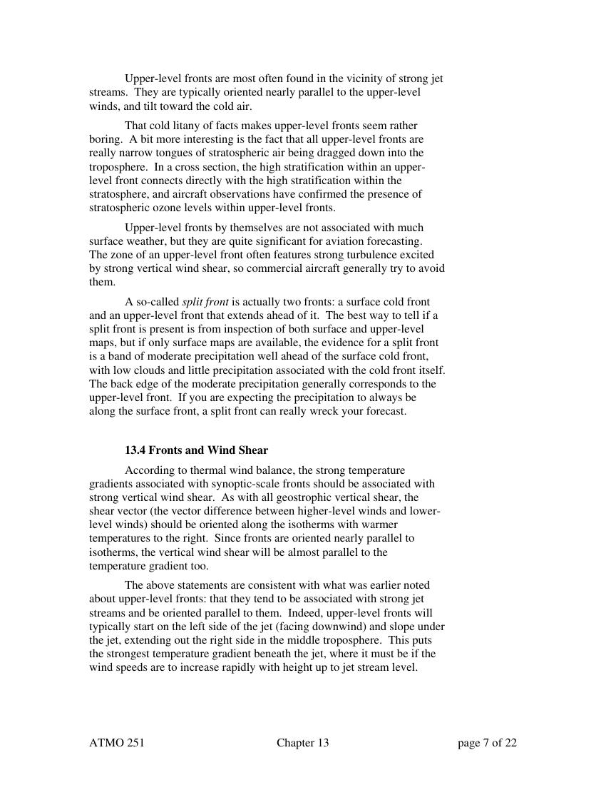

Upper-level fronts are most often found in the vicinity of strong jet 
streams.  They are typically oriented nearly parallel to the upper-level 
winds, and tilt toward the cold air. 
That cold litany of facts makes upper-level fronts seem rather 
boring.  A bit more interesting is the fact that all upper-level fronts are 
really narrow tongues of stratospheric air being dragged down into the 
troposphere.  In a cross section, the high stratification within an upper-
level front connects directly with the high stratification within the 
stratosphere, and aircraft observations have confirmed the presence of 
stratospheric ozone levels within upper-level fronts. 
Upper-level fronts by themselves are not associated with much 
surface weather, but they are quite significant for aviation forecasting.  
The zone of an upper-level front often features strong turbulence excited 
by strong vertical wind shear, so commercial aircraft generally try to avoid 
them. 
A so-called split front is actually two fronts: a surface cold front 
and an upper-level front that extends ahead of it.  The best way to tell if a 
split front is present is from inspection of both surface and upper-level 
maps, but if only surface maps are available, the evidence for a split front 
is a band of moderate precipitation well ahead of the surface cold front, 
with low clouds and little precipitation associated with the cold front itself.  
The back edge of the moderate precipitation generally corresponds to the 
upper-level front.  If you are expecting the precipitation to always be 
along the surface front, a split front can really wreck your forecast. 
 
13.4 Fronts and Wind Shear 
According to thermal wind balance, the strong temperature 
gradients associated with synoptic-scale fronts should be associated with 
strong vertical wind shear.  As with all geostrophic vertical shear, the 
shear vector (the vector difference between higher-level winds and lower-
level winds) should be oriented along the isotherms with warmer 
temperatures to the right.  Since fronts are oriented nearly parallel to 
isotherms, the vertical wind shear will be almost parallel to the 
temperature gradient too. 
The above statements are consistent with what was earlier noted 
about upper-level fronts: that they tend to be associated with strong jet 
streams and be oriented parallel to them.  Indeed, upper-level fronts will 
typically start on the left side of the jet (facing downwind) and slope under 
the jet, extending out the right side in the middle troposphere.  This puts 
the strongest temperature gradient beneath the jet, where it must be if the 
wind speeds are to increase rapidly with height up to jet stream level. 
 
 
ATMO 251 
Chapter 13 
page 7 of 22

## Page 8

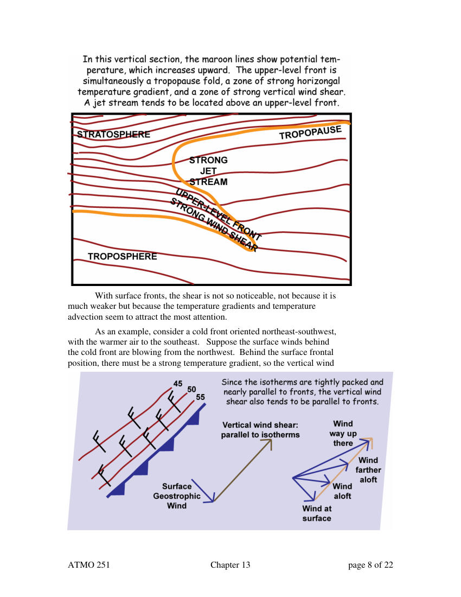

With surface fronts, the shear is not so noticeable, not because it is 
much weaker but because the temperature gradients and temperature 
advection seem to attract the most attention.   
As an example, consider a cold front oriented northeast-southwest, 
with the warmer air to the southeast.   Suppose the surface winds behind 
the cold front are blowing from the northwest.  Behind the surface frontal 
position, there must be a strong temperature gradient, so the vertical wind  
 
ATMO 251 
Chapter 13 
page 8 of 22

## Page 9

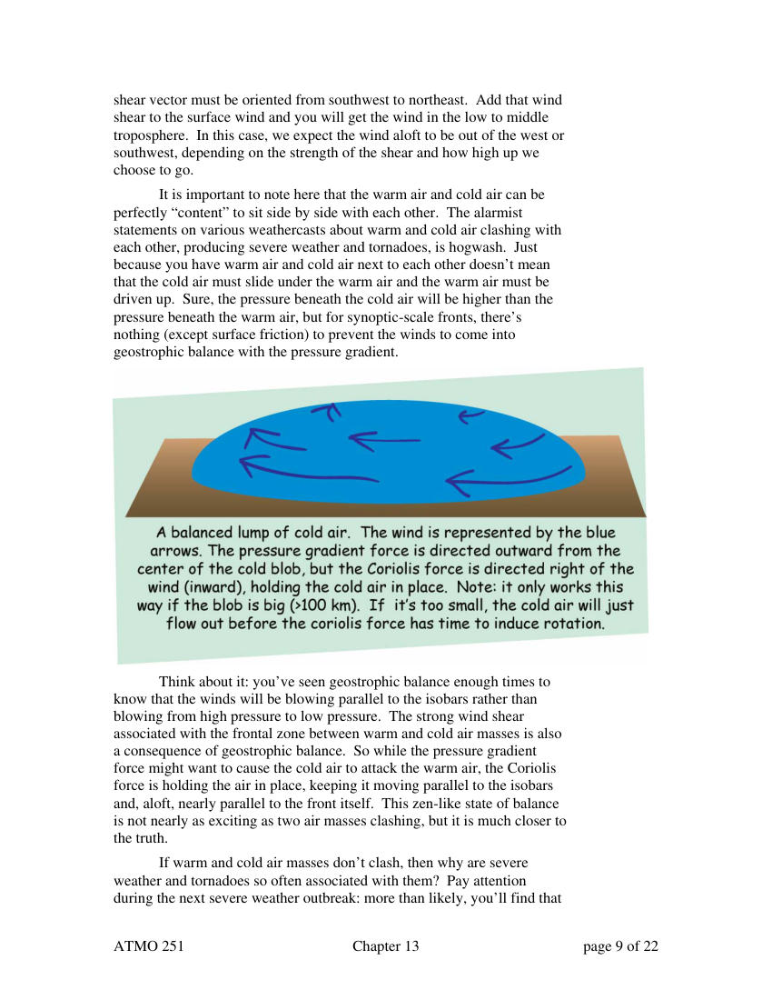

shear vector must be oriented from southwest to northeast.  Add that wind 
shear to the surface wind and you will get the wind in the low to middle 
troposphere.  In this case, we expect the wind aloft to be out of the west or 
southwest, depending on the strength of the shear and how high up we 
choose to go. 
It is important to note here that the warm air and cold air can be 
perfectly “content” to sit side by side with each other.  The alarmist 
statements on various weathercasts about warm and cold air clashing with 
each other, producing severe weather and tornadoes, is hogwash.  Just 
because you have warm air and cold air next to each other doesn’t mean 
that the cold air must slide under the warm air and the warm air must be 
driven up.  Sure, the pressure beneath the cold air will be higher than the 
pressure beneath the warm air, but for synoptic-scale fronts, there’s 
nothing (except surface friction) to prevent the winds to come into 
geostrophic balance with the pressure gradient.   
 
Think about it: you’ve seen geostrophic balance enough times to 
know that the winds will be blowing parallel to the isobars rather than 
blowing from high pressure to low pressure.  The strong wind shear 
associated with the frontal zone between warm and cold air masses is also 
a consequence of geostrophic balance.  So while the pressure gradient 
force might want to cause the cold air to attack the warm air, the Coriolis 
force is holding the air in place, keeping it moving parallel to the isobars 
and, aloft, nearly parallel to the front itself.  This zen-like state of balance 
is not nearly as exciting as two air masses clashing, but it is much closer to 
the truth.   
If warm and cold air masses don’t clash, then why are severe 
weather and tornadoes so often associated with them?  Pay attention 
during the next severe weather outbreak: more than likely, you’ll find that 
ATMO 251 
Chapter 13 
page 9 of 22

## Page 10

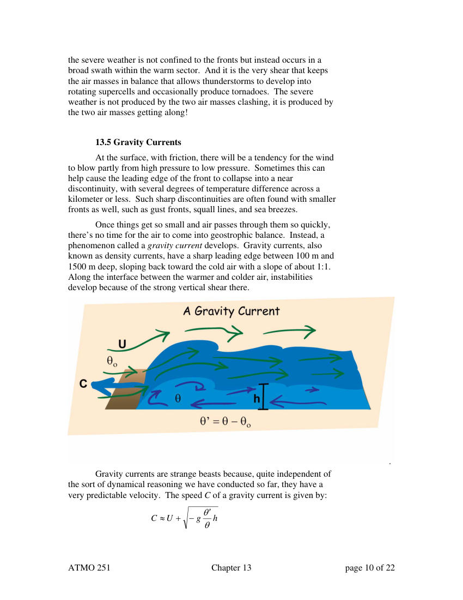

the severe weather is not confined to the fronts but instead occurs in a 
broad swath within the warm sector.  And it is the very shear that keeps 
the air masses in balance that allows thunderstorms to develop into 
rotating supercells and occasionally produce tornadoes.  The severe 
weather is not produced by the two air masses clashing, it is produced by 
the two air masses getting along! 
 
13.5 Gravity Currents 
At the surface, with friction, there will be a tendency for the wind 
to blow partly from high pressure to low pressure.  Sometimes this can 
help cause the leading edge of the front to collapse into a near 
discontinuity, with several degrees of temperature difference across a 
kilometer or less.  Such sharp discontinuities are often found with smaller 
fronts as well, such as gust fronts, squall lines, and sea breezes. 
Once things get so small and air passes through them so quickly, 
there’s no time for the air to come into geostrophic balance.  Instead, a 
phenomenon called a gravity current develops.  Gravity currents, also 
known as density currents, have a sharp leading edge between 100 m and 
1500 m deep, sloping back toward the cold air with a slope of about 1:1.  
Along the interface between the warmer and colder air, instabilities 
develop because of the strong vertical shear there. 
 
Gravity currents are strange beasts because, quite independent of 
the sort of dynamical reasoning we have conducted so far, they have a 
very predictable velocity.  The speed C of a gravity current is given by: 
 
 
h
g
U
C
θ
θ′
−
+
≈
 
ATMO 251 
Chapter 13 
page 10 of 22

## Page 11

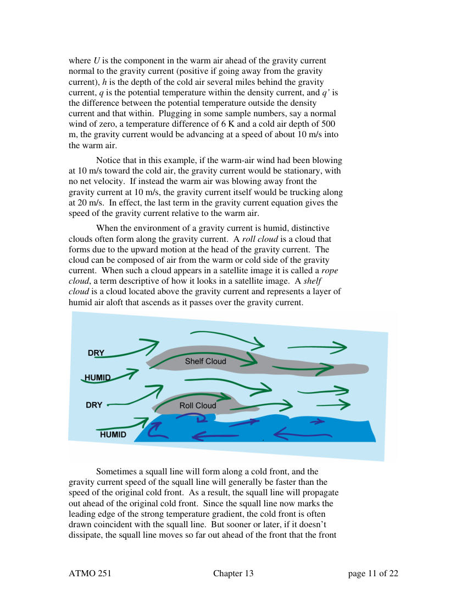

where U is the component in the warm air ahead of the gravity current 
normal to the gravity current (positive if going away from the gravity 
current), h is the depth of the cold air several miles behind the gravity 
current, q is the potential temperature within the density current, and q’ is 
the difference between the potential temperature outside the density 
current and that within.  Plugging in some sample numbers, say a normal 
wind of zero, a temperature difference of 6 K and a cold air depth of 500 
m, the gravity current would be advancing at a speed of about 10 m/s into 
the warm air. 
Notice that in this example, if the warm-air wind had been blowing 
at 10 m/s toward the cold air, the gravity current would be stationary, with 
no net velocity.  If instead the warm air was blowing away front the 
gravity current at 10 m/s, the gravity current itself would be trucking along 
at 20 m/s.  In effect, the last term in the gravity current equation gives the 
speed of the gravity current relative to the warm air.   
When the environment of a gravity current is humid, distinctive 
clouds often form along the gravity current.  A roll cloud is a cloud that 
forms due to the upward motion at the head of the gravity current.  The 
cloud can be composed of air from the warm or cold side of the gravity 
current.  When such a cloud appears in a satellite image it is called a rope 
cloud, a term descriptive of how it looks in a satellite image.  A shelf 
cloud is a cloud located above the gravity current and represents a layer of 
humid air aloft that ascends as it passes over the gravity current. 
 
Sometimes a squall line will form along a cold front, and the 
gravity current speed of the squall line will generally be faster than the 
speed of the original cold front.  As a result, the squall line will propagate 
out ahead of the original cold front.  Since the squall line now marks the 
leading edge of the strong temperature gradient, the cold front is often 
drawn coincident with the squall line.  But sooner or later, if it doesn’t 
dissipate, the squall line moves so far out ahead of the front that the front 
ATMO 251 
Chapter 13 
page 11 of 22

## Page 12

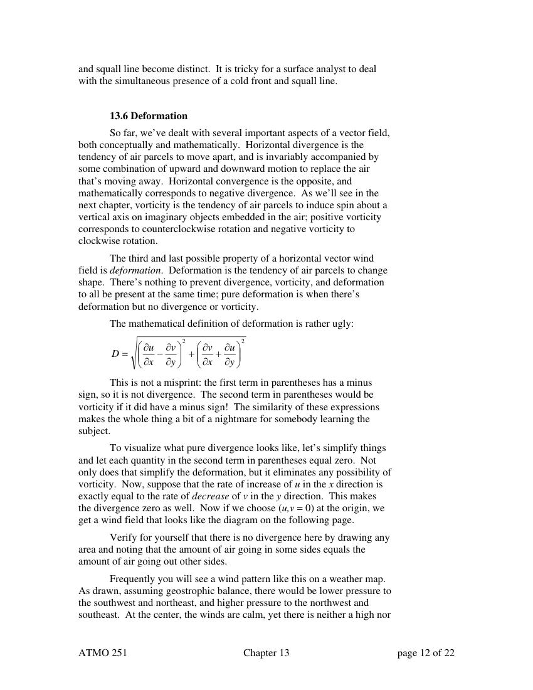

and squall line become distinct.  It is tricky for a surface analyst to deal 
with the simultaneous presence of a cold front and squall line. 
 
13.6 Deformation 
So far, we’ve dealt with several important aspects of a vector field, 
both conceptually and mathematically.  Horizontal divergence is the 
tendency of air parcels to move apart, and is invariably accompanied by 
some combination of upward and downward motion to replace the air 
that’s moving away.  Horizontal convergence is the opposite, and 
mathematically corresponds to negative divergence.  As we’ll see in the 
next chapter, vorticity is the tendency of air parcels to induce spin about a 
vertical axis on imaginary objects embedded in the air; positive vorticity 
corresponds to counterclockwise rotation and negative vorticity to 
clockwise rotation. 
The third and last possible property of a horizontal vector wind 
field is deformation.  Deformation is the tendency of air parcels to change 
shape.  There’s nothing to prevent divergence, vorticity, and deformation 
to all be present at the same time; pure deformation is when there’s 
deformation but no divergence or vorticity. 
The mathematical definition of deformation is rather ugly: 
2
2
⎟⎟
⎠
⎞
⎜⎜
⎝
⎛
∂
∂
+
∂
∂
+
⎟⎟
⎠
⎞
⎜⎜
⎝
⎛
∂
∂
−
∂
∂
=
y
u
x
v
y
v
x
u
D
 
This is not a misprint: the first term in parentheses has a minus 
sign, so it is not divergence.  The second term in parentheses would be 
vorticity if it did have a minus sign!  The similarity of these expressions 
makes the whole thing a bit of a nightmare for somebody learning the 
subject. 
To visualize what pure divergence looks like, let’s simplify things 
and let each quantity in the second term in parentheses equal zero.  Not 
only does that simplify the deformation, but it eliminates any possibility of 
vorticity.  Now, suppose that the rate of increase of u in the x direction is 
exactly equal to the rate of decrease of v in the y direction.  This makes 
the divergence zero as well.  Now if we choose (u,v = 0) at the origin, we 
get a wind field that looks like the diagram on the following page. 
Verify for yourself that there is no divergence here by drawing any 
area and noting that the amount of air going in some sides equals the 
amount of air going out other sides.   
Frequently you will see a wind pattern like this on a weather map.  
As drawn, assuming geostrophic balance, there would be lower pressure to 
the southwest and northeast, and higher pressure to the northwest and 
southeast.  At the center, the winds are calm, yet there is neither a high nor  
ATMO 251 
Chapter 13 
page 12 of 22

## Page 13

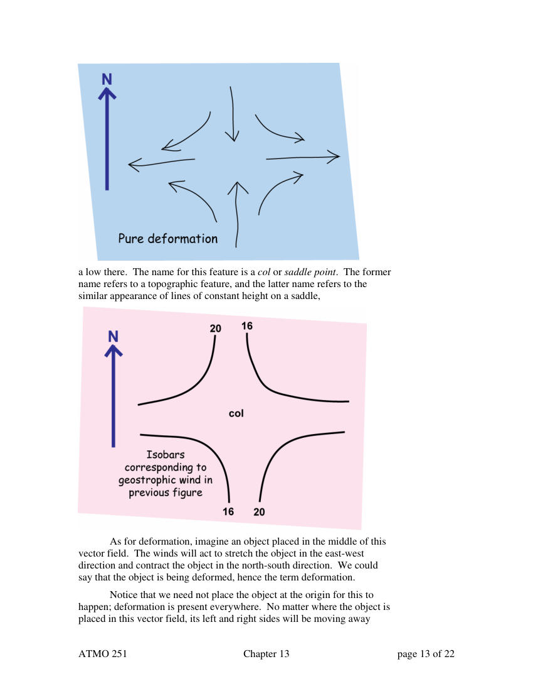

a low there.  The name for this feature is a col or saddle point.  The former 
name refers to a topographic feature, and the latter name refers to the 
similar appearance of lines of constant height on a saddle,  
 
As for deformation, imagine an object placed in the middle of this 
vector field.  The winds will act to stretch the object in the east-west 
direction and contract the object in the north-south direction.  We could 
say that the object is being deformed, hence the term deformation. 
Notice that we need not place the object at the origin for this to 
happen; deformation is present everywhere.  No matter where the object is 
placed in this vector field, its left and right sides will be moving away 
ATMO 251 
Chapter 13 
page 13 of 22

## Page 14

from each other and its north and south sides will be moving toward each 
other.   
 
A useful quantity in connection with deformation is the axis of 
dilatation.  This is the axis along which the imaginary object would be 
stretched (or dilated) most strongly.  In the example above, the axis of 
dilatation is oriented east-west. 
Now take the example above and rotate it counterclockwise by 45 
degrees.  Presumably we have not altered the magnitude of the 
deformation, since objects would still be stretched or shrunk by the same 
amount as before.  The axis of dilatation will have rotated too, and now 
would be oriented northeast-southwest. 
 
With the rotated wind pattern, consider the mathematical terms in 
the definition of deformation.  After the rotation, each of the derivatives in 
the first term in parentheses is suddenly zero!  (Don’t take my word for it, 
work it out for yourself.)  But not to worry, the second term is now 
nonzero.  Since v increases in the positive x direction, the first derivative is 
positive.  Since u increases in the positive y direction, the other derivative 
is also positive.  The lesson here is that there’s really nothing special about 
which of the terms contributes to deformation. 
ATMO 251 
Chapter 13 
page 14 of 22

## Page 15

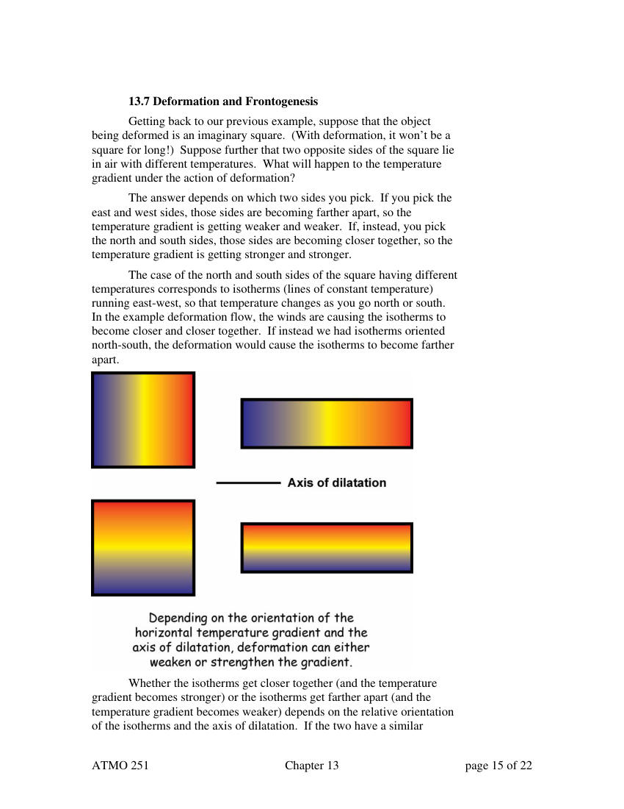

13.7 Deformation and Frontogenesis 
Getting back to our previous example, suppose that the object 
being deformed is an imaginary square.  (With deformation, it won’t be a 
square for long!)  Suppose further that two opposite sides of the square lie 
in air with different temperatures.  What will happen to the temperature 
gradient under the action of deformation? 
The answer depends on which two sides you pick.  If you pick the 
east and west sides, those sides are becoming farther apart, so the 
temperature gradient is getting weaker and weaker.  If, instead, you pick 
the north and south sides, those sides are becoming closer together, so the 
temperature gradient is getting stronger and stronger.   
The case of the north and south sides of the square having different 
temperatures corresponds to isotherms (lines of constant temperature) 
running east-west, so that temperature changes as you go north or south.  
In the example deformation flow, the winds are causing the isotherms to 
become closer and closer together.  If instead we had isotherms oriented 
north-south, the deformation would cause the isotherms to become farther 
apart. 
 
Whether the isotherms get closer together (and the temperature 
gradient becomes stronger) or the isotherms get farther apart (and the 
temperature gradient becomes weaker) depends on the relative orientation 
of the isotherms and the axis of dilatation.  If the two have a similar 
ATMO 251 
Chapter 13 
page 15 of 22

## Page 16

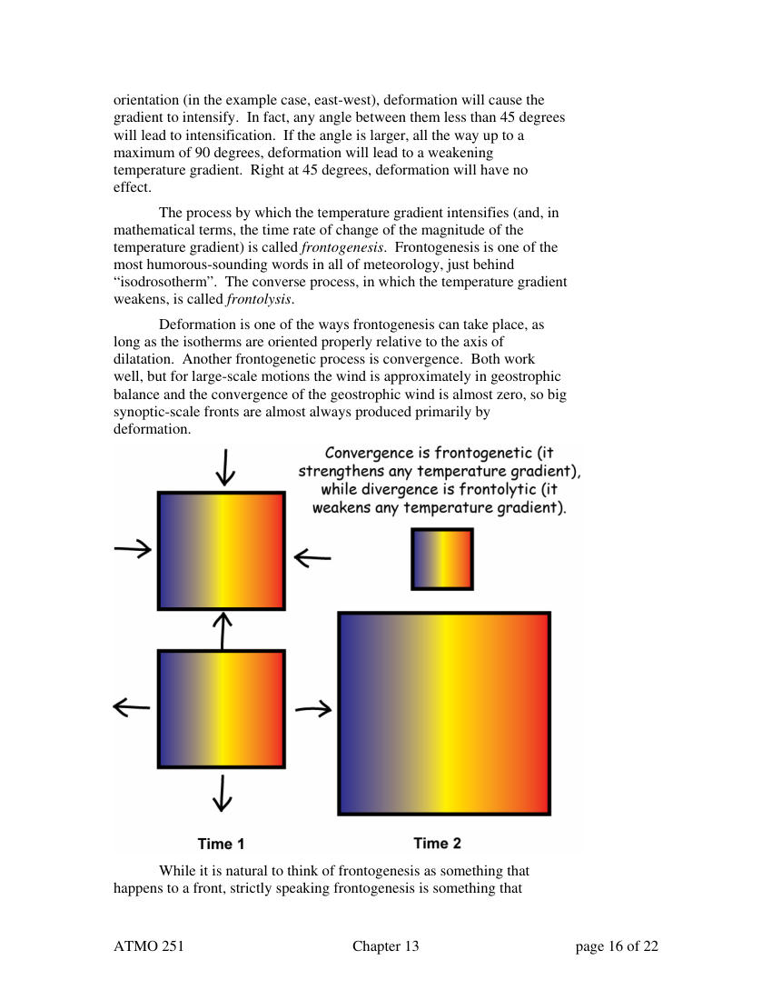

orientation (in the example case, east-west), deformation will cause the 
gradient to intensify.  In fact, any angle between them less than 45 degrees 
will lead to intensification.  If the angle is larger, all the way up to a 
maximum of 90 degrees, deformation will lead to a weakening 
temperature gradient.  Right at 45 degrees, deformation will have no 
effect. 
The process by which the temperature gradient intensifies (and, in 
mathematical terms, the time rate of change of the magnitude of the 
temperature gradient) is called frontogenesis.  Frontogenesis is one of the 
most humorous-sounding words in all of meteorology, just behind 
“isodrosotherm”.  The converse process, in which the temperature gradient 
weakens, is called frontolysis. 
Deformation is one of the ways frontogenesis can take place, as 
long as the isotherms are oriented properly relative to the axis of 
dilatation.  Another frontogenetic process is convergence.  Both work 
well, but for large-scale motions the wind is approximately in geostrophic 
balance and the convergence of the geostrophic wind is almost zero, so big 
synoptic-scale fronts are almost always produced primarily by 
deformation. 
 
While it is natural to think of frontogenesis as something that 
happens to a front, strictly speaking frontogenesis is something that 
ATMO 251 
Chapter 13 
page 16 of 22

## Page 17

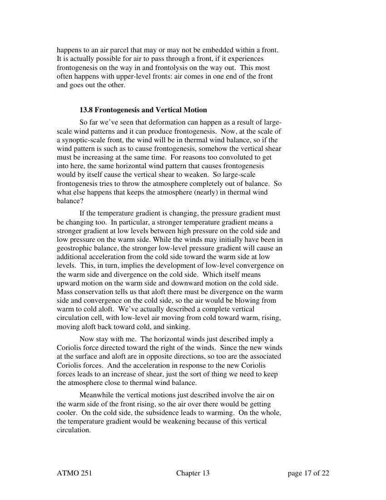

happens to an air parcel that may or may not be embedded within a front.  
It is actually possible for air to pass through a front, if it experiences 
frontogenesis on the way in and frontolysis on the way out.  This most 
often happens with upper-level fronts: air comes in one end of the front 
and goes out the other.   
 
13.8 Frontogenesis and Vertical Motion 
So far we’ve seen that deformation can happen as a result of large-
scale wind patterns and it can produce frontogenesis.  Now, at the scale of 
a synoptic-scale front, the wind will be in thermal wind balance, so if the 
wind pattern is such as to cause frontogenesis, somehow the vertical shear 
must be increasing at the same time.  For reasons too convoluted to get 
into here, the same horizontal wind pattern that causes frontogenesis 
would by itself cause the vertical shear to weaken.  So large-scale 
frontogenesis tries to throw the atmosphere completely out of balance.  So 
what else happens that keeps the atmosphere (nearly) in thermal wind 
balance? 
If the temperature gradient is changing, the pressure gradient must 
be changing too.  In particular, a stronger temperature gradient means a 
stronger gradient at low levels between high pressure on the cold side and 
low pressure on the warm side. While the winds may initially have been in 
geostrophic balance, the stronger low-level pressure gradient will cause an 
additional acceleration from the cold side toward the warm side at low 
levels.  This, in turn, implies the development of low-level convergence on 
the warm side and divergence on the cold side.  Which itself means 
upward motion on the warm side and downward motion on the cold side.  
Mass conservation tells us that aloft there must be divergence on the warm 
side and convergence on the cold side, so the air would be blowing from 
warm to cold aloft.  We’ve actually described a complete vertical 
circulation cell, with low-level air moving from cold toward warm, rising, 
moving aloft back toward cold, and sinking. 
Now stay with me.  The horizontal winds just described imply a 
Coriolis force directed toward the right of the winds.  Since the new winds 
at the surface and aloft are in opposite directions, so too are the associated 
Coriolis forces.  And the acceleration in response to the new Coriolis 
forces leads to an increase of shear, just the sort of thing we need to keep 
the atmosphere close to thermal wind balance. 
Meanwhile the vertical motions just described involve the air on 
the warm side of the front rising, so the air over there would be getting 
cooler.  On the cold side, the subsidence leads to warming.  On the whole, 
the temperature gradient would be weakening because of this vertical 
circulation. 
 
ATMO 251 
Chapter 13 
page 17 of 22

## Page 18

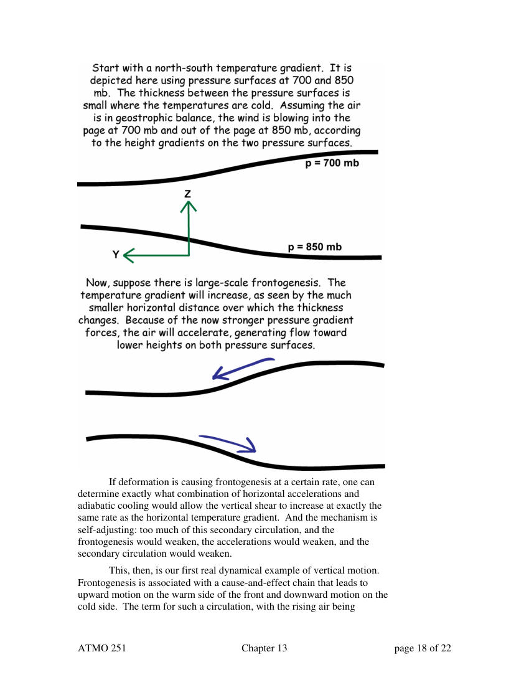

If deformation is causing frontogenesis at a certain rate, one can 
determine exactly what combination of horizontal accelerations and 
adiabatic cooling would allow the vertical shear to increase at exactly the 
same rate as the horizontal temperature gradient.  And the mechanism is 
self-adjusting: too much of this secondary circulation, and the 
frontogenesis would weaken, the accelerations would weaken, and the 
secondary circulation would weaken. 
This, then, is our first real dynamical example of vertical motion.  
Frontogenesis is associated with a cause-and-effect chain that leads to 
upward motion on the warm side of the front and downward motion on the 
cold side.  The term for such a circulation, with the rising air being  
ATMO 251 
Chapter 13 
page 18 of 22

## Page 19

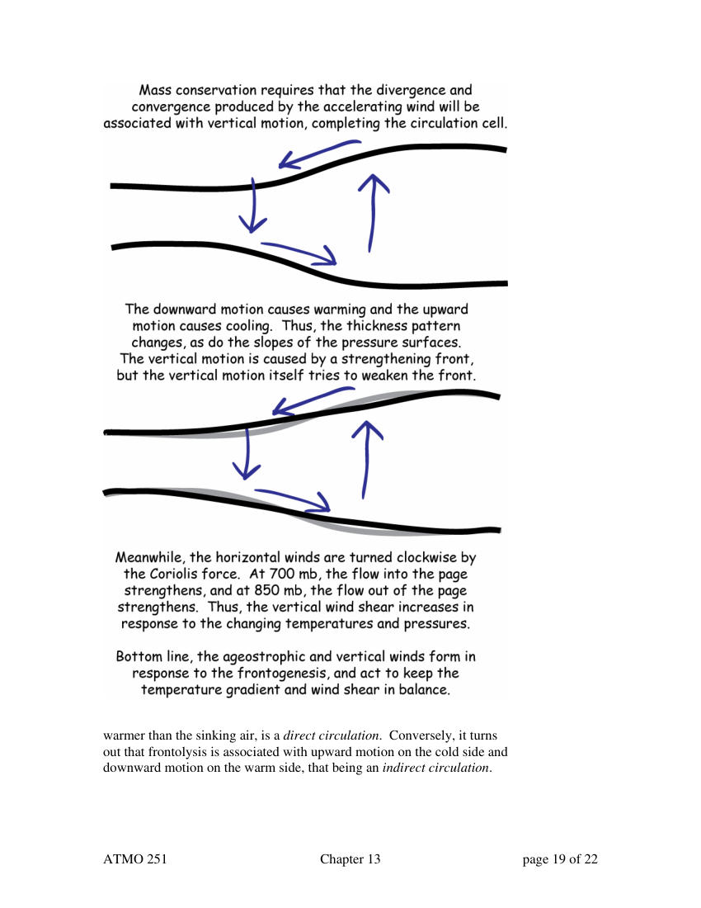

warmer than the sinking air, is a direct circulation.  Conversely, it turns 
out that frontolysis is associated with upward motion on the cold side and 
downward motion on the warm side, that being an indirect circulation.   
 
 
ATMO 251 
Chapter 13 
page 19 of 22

## Page 20

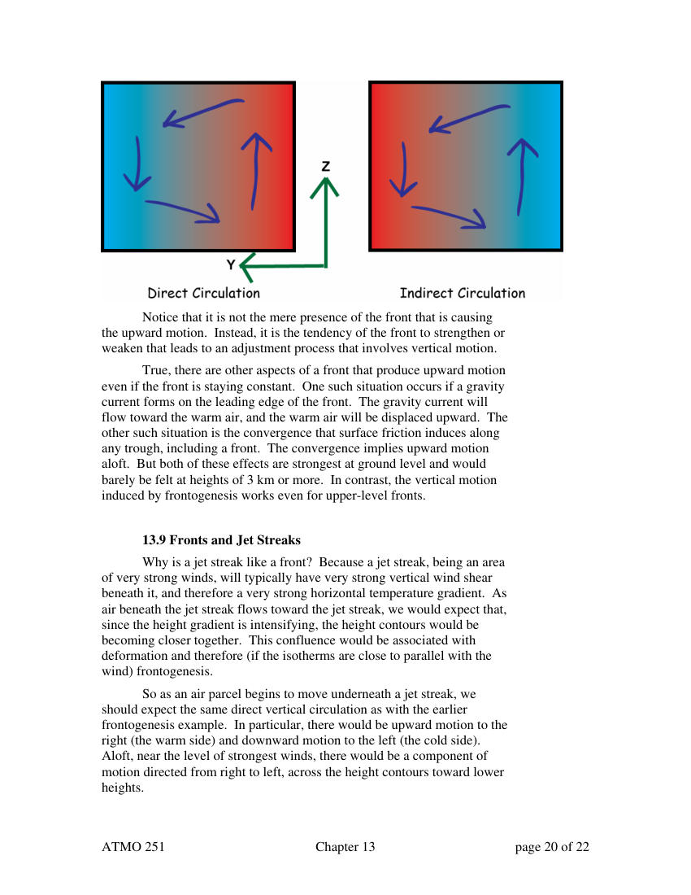

Notice that it is not the mere presence of the front that is causing 
the upward motion.  Instead, it is the tendency of the front to strengthen or 
weaken that leads to an adjustment process that involves vertical motion. 
True, there are other aspects of a front that produce upward motion 
even if the front is staying constant.  One such situation occurs if a gravity 
current forms on the leading edge of the front.  The gravity current will 
flow toward the warm air, and the warm air will be displaced upward.  The 
other such situation is the convergence that surface friction induces along 
any trough, including a front.  The convergence implies upward motion 
aloft.  But both of these effects are strongest at ground level and would 
barely be felt at heights of 3 km or more.  In contrast, the vertical motion 
induced by frontogenesis works even for upper-level fronts. 
 
13.9 Fronts and Jet Streaks 
Why is a jet streak like a front?  Because a jet streak, being an area 
of very strong winds, will typically have very strong vertical wind shear 
beneath it, and therefore a very strong horizontal temperature gradient.  As 
air beneath the jet streak flows toward the jet streak, we would expect that, 
since the height gradient is intensifying, the height contours would be 
becoming closer together.  This confluence would be associated with 
deformation and therefore (if the isotherms are close to parallel with the 
wind) frontogenesis. 
So as an air parcel begins to move underneath a jet streak, we 
should expect the same direct vertical circulation as with the earlier 
frontogenesis example.  In particular, there would be upward motion to the 
right (the warm side) and downward motion to the left (the cold side).  
Aloft, near the level of strongest winds, there would be a component of 
motion directed from right to left, across the height contours toward lower 
heights. 
ATMO 251 
Chapter 13 
page 20 of 22

## Page 21

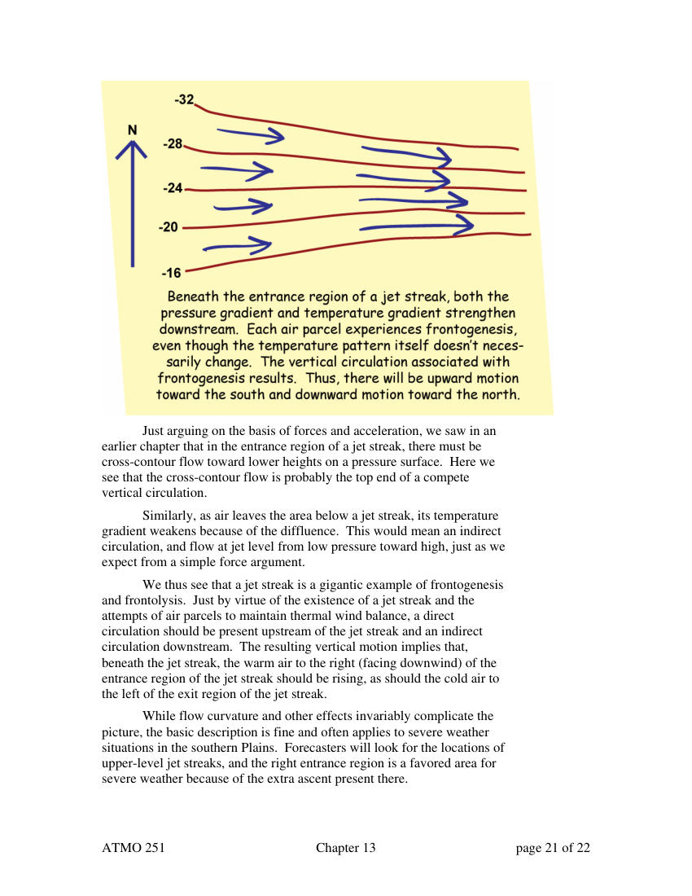

Just arguing on the basis of forces and acceleration, we saw in an 
earlier chapter that in the entrance region of a jet streak, there must be 
cross-contour flow toward lower heights on a pressure surface.  Here we 
see that the cross-contour flow is probably the top end of a compete 
vertical circulation. 
Similarly, as air leaves the area below a jet streak, its temperature 
gradient weakens because of the diffluence.  This would mean an indirect 
circulation, and flow at jet level from low pressure toward high, just as we 
expect from a simple force argument.   
We thus see that a jet streak is a gigantic example of frontogenesis 
and frontolysis.  Just by virtue of the existence of a jet streak and the 
attempts of air parcels to maintain thermal wind balance, a direct 
circulation should be present upstream of the jet streak and an indirect 
circulation downstream.  The resulting vertical motion implies that, 
beneath the jet streak, the warm air to the right (facing downwind) of the 
entrance region of the jet streak should be rising, as should the cold air to 
the left of the exit region of the jet streak. 
While flow curvature and other effects invariably complicate the 
picture, the basic description is fine and often applies to severe weather 
situations in the southern Plains.  Forecasters will look for the locations of 
upper-level jet streaks, and the right entrance region is a favored area for 
severe weather because of the extra ascent present there. 
 
ATMO 251 
Chapter 13 
page 21 of 22

## Page 22

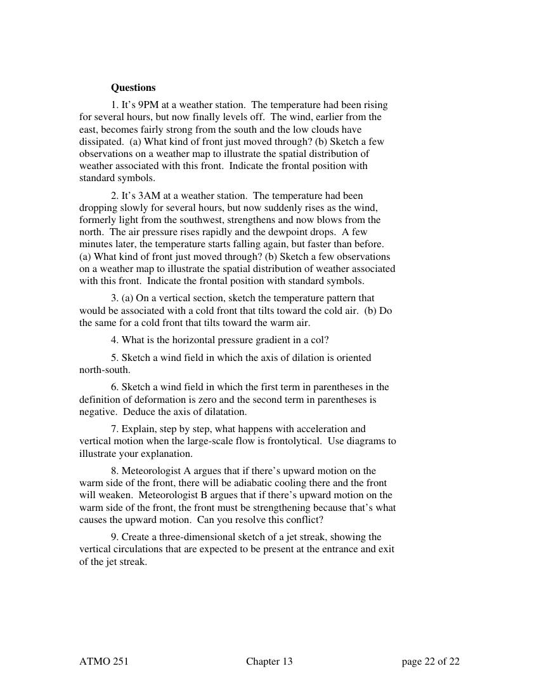

Questions 
1. It’s 9PM at a weather station.  The temperature had been rising 
for several hours, but now finally levels off.  The wind, earlier from the 
east, becomes fairly strong from the south and the low clouds have 
dissipated.  (a) What kind of front just moved through? (b) Sketch a few 
observations on a weather map to illustrate the spatial distribution of 
weather associated with this front.  Indicate the frontal position with 
standard symbols. 
2. It’s 3AM at a weather station.  The temperature had been 
dropping slowly for several hours, but now suddenly rises as the wind, 
formerly light from the southwest, strengthens and now blows from the 
north.  The air pressure rises rapidly and the dewpoint drops.  A few 
minutes later, the temperature starts falling again, but faster than before.  
(a) What kind of front just moved through? (b) Sketch a few observations 
on a weather map to illustrate the spatial distribution of weather associated 
with this front.  Indicate the frontal position with standard symbols. 
3. (a) On a vertical section, sketch the temperature pattern that 
would be associated with a cold front that tilts toward the cold air.  (b) Do 
the same for a cold front that tilts toward the warm air. 
4. What is the horizontal pressure gradient in a col? 
5. Sketch a wind field in which the axis of dilation is oriented 
north-south. 
6. Sketch a wind field in which the first term in parentheses in the 
definition of deformation is zero and the second term in parentheses is 
negative.  Deduce the axis of dilatation. 
7. Explain, step by step, what happens with acceleration and 
vertical motion when the large-scale flow is frontolytical.  Use diagrams to 
illustrate your explanation. 
8. Meteorologist A argues that if there’s upward motion on the 
warm side of the front, there will be adiabatic cooling there and the front 
will weaken.  Meteorologist B argues that if there’s upward motion on the 
warm side of the front, the front must be strengthening because that’s what 
causes the upward motion.  Can you resolve this conflict? 
9. Create a three-dimensional sketch of a jet streak, showing the 
vertical circulations that are expected to be present at the entrance and exit 
of the jet streak. 
ATMO 251 
Chapter 13 
page 22 of 22
