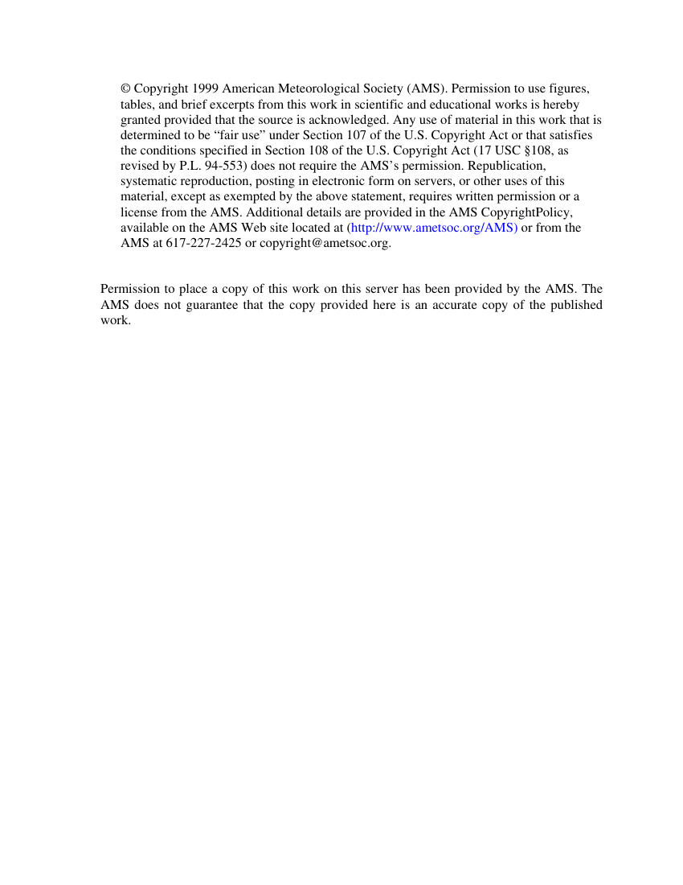
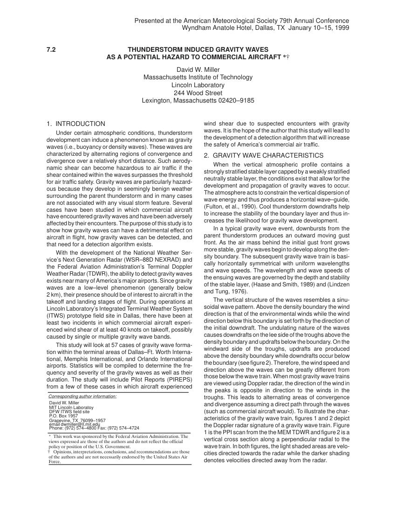
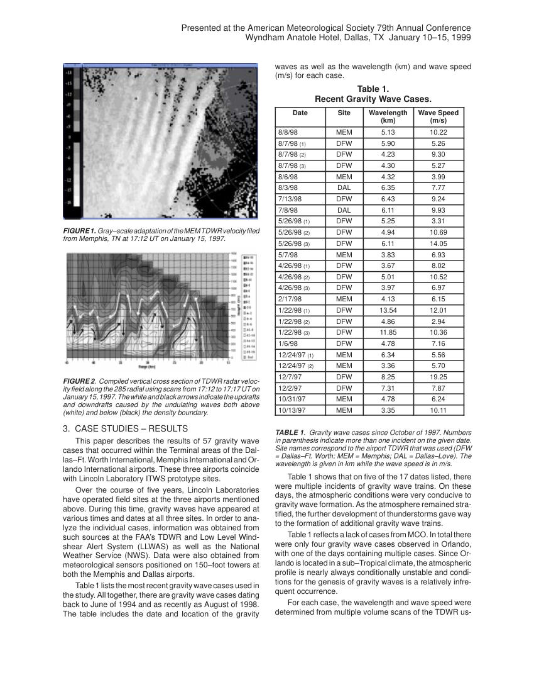
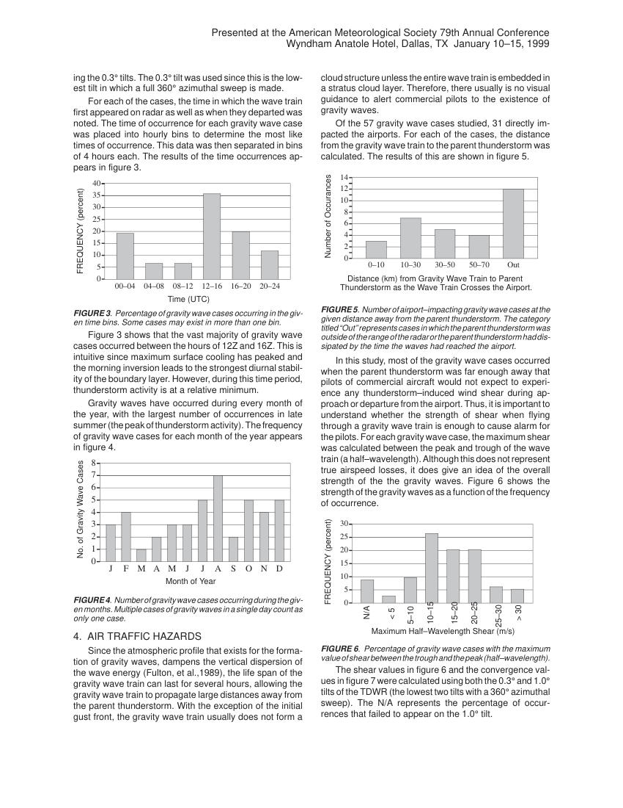
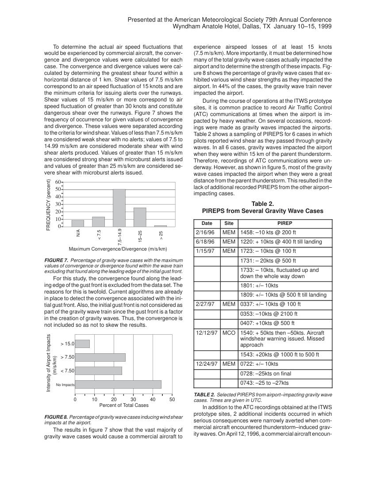
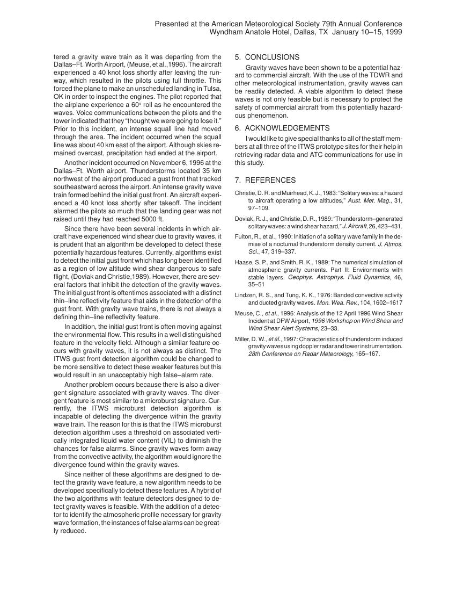

# Gravity Waves — Impacts of Gravity Waves on Aviation (Paper)

> Source: <https://www.weather.gov/media/zhu/ZHU_Training_Page/Met_Tutorials/TS%20Gravity%20Waves%20and%20Impacts%20to%20Aviation.pdf>  
> Section: Miscellaneous  
> Captured: 2026-08-19 06:00 UTC  
> PDF: [gravity-waves-impacts-of-gravity-waves-on-aviation-paper.pdf](gravity-waves-impacts-of-gravity-waves-on-aviation-paper.pdf) (6 pages)

---

## Page 1

© Copyright 1999 American Meteorological Society (AMS). Permission to use figures, 
tables, and brief excerpts from this work in scientific and educational works is hereby 
granted provided that the source is acknowledged. Any use of material in this work that is 
determined to be “fair use” under Section 107 of the U.S. Copyright Act or that satisfies 
the conditions specified in Section 108 of the U.S. Copyright Act (17 USC §108, as 
revised by P.L. 94-553) does not require the AMS’s permission. Republication, 
systematic reproduction, posting in electronic form on servers, or other uses of this 
material, except as exempted by the above statement, requires written permission or a 
license from the AMS. Additional details are provided in the AMS CopyrightPolicy, 
available on the AMS Web site located at (http://www.ametsoc.org/AMS) or from the 
AMS at 617-227-2425 or copyright@ametsoc.org.  
 
 
Permission to place a copy of this work on this server has been provided by the AMS. The 
AMS does not guarantee that the copy provided here is an accurate copy of the published 
work.

## Page 2

Presented at the American Meteorological Society 79th Annual Conference
Wyndham Anatole Hotel, Dallas, TX  January 10–15, 1999
7.2
THUNDERSTORM INDUCED GRAVITY WAVES
AS A POTENTIAL HAZARD TO COMMERCIAL AIRCRAFT 
David W. Miller
Massachusetts Institute of Technology
Lincoln Laboratory
244 Wood Street
Lexington, Massachusetts 02420–9185
1.  INTRODUCTION
Under certain atmospheric conditions, thunderstorm
development can induce a phenomenon known as gravity
waves (i.e., buoyancy or density waves). These waves are
characterized by alternating regions of convergence and
divergence over a relatively short distance. Such aerody-
namic shear can become hazardous to air traffic if the
shear contained within the waves surpasses the threshold
for air traffic safety. Gravity waves are particularly hazard-
ous because they develop in seemingly benign weather
surrounding the parent thunderstorm and in many cases
are not associated with any visual storm feature. Several
cases have been studied in which commercial aircraft
have encountered gravity waves and have been adversely
affected by their encounters. The purpose of this study is to
show how gravity waves can have a detrimental effect on
aircraft in flight, how gravity waves can be detected, and
that need for a detection algorithm exists.
With the development of the National Weather Ser-
vice’s Next Generation Radar (WSR–88D NEXRAD) and
the Federal Aviation Administration’s Terminal Doppler
Weather Radar (TDWR), the ability to detect gravity waves
exists near many of America’s major airports. Since gravity
waves are a low–level phenomenon (generally below
2 km), their presence should be of interest to aircraft in the
takeoff and landing stages of flight. During operations at
Lincoln Laboratory’s Integrated Terminal Weather System
(ITWS) prototype field site in Dallas, there have been at
least two incidents in which commercial aircraft experi-
enced wind shear of at least 40 knots on takeoff, possibly
caused by single or multiple gravity wave bands.
This study will look at 57 cases of gravity wave forma-
tion within the terminal areas of Dallas–Ft. Worth Interna-
tional, Memphis International, and Orlando International
airports. Statistics will be compiled to determine the fre-
quency and severity of the gravity waves as well as their
duration. The study will include Pilot Reports (PIREPS)
from a few of these cases in which aircraft experienced
Corresponding author information:
David W. Miller
MIT Lincoln Laboratoy
DFW ITWS field site
P.O. Box 1957 
Grapevine, TX  76099–1957
email dwmiller@ll.mit.edu
Phone: (972) 574–4800 Fax: (972) 574–4724
 
    
!     

             
!     	 
       
      !  
!   	 

wind shear due to suspected encounters with gravity
waves. It is the hope of the author that this study will lead to
the development of a detection algorithm that will increase
the safety of America’s commercial air traffic.
2.  GRAVITY WAVE CHARACTERISTICS
When the vertical atmospheric profile contains a
strongly stratified stable layer capped by a weakly stratified
neutrally stable layer, the conditions exist that allow for the
development and propagation of gravity waves to occur.
The atmosphere acts to constrain the vertical dispersion of
wave energy and thus produces a horizontal wave–guide,
(Fulton, et al., 1990). Cool thunderstorm downdrafts help
to increase the stability of the boundary layer and thus in-
creases the likelihood for gravity wave development.
In a typical gravity wave event, downbursts from the
parent thunderstorm produces an outward moving gust
front. As the air mass behind the initial gust front grows
more stable, gravity waves begin to develop along the den-
sity boundary. The subsequent gravity wave train is basi-
cally horizontally symmetrical with uniform wavelengths
and wave speeds. The wavelength and wave speeds of
the ensuing waves are governed by the depth and stability
of the stable layer, (Haase and Smith, 1989) and (Lindzen
and Tung, 1976).
The vertical structure of the waves resembles a sinu-
soidal wave pattern. Above the density boundary the wind
direction is that of the environmental winds while the wind
direction below this boundary is set forth by the direction of
the initial downdraft. The undulating nature of the waves
causes downdrafts on the lee side of the troughs above the
density boundary and updrafts below the boundary. On the
windward side of the troughs, updrafts are produced
above the density boundary while downdrafts occur below
the boundary (see figure 2). Therefore, the wind speed and
direction above the waves can be greatly different from
those below the wave train. When most gravity wave trains
are viewed using Doppler radar, the direction of the wind in
the peaks is opposite in direction to the winds in the
troughs. This leads to alternating areas of convergence
and divergence assuming a direct path through the waves
(such as commercial aircraft would). To illustrate the char-
acteristics of the gravity wave train, figures 1 and 2 depict
the Doppler radar signature of a gravity wave train. Figure
1 is the PPI scan from the the MEM TDWR and figure 2 is a
vertical cross section along a perpendicular radial to the
wave train. In both figures, the light shaded areas are velo-
cities directed towards the radar while the darker shading
denotes velocities directed away from the radar.

## Page 3

Presented at the American Meteorological Society 79th Annual Conference
Wyndham Anatole Hotel, Dallas, TX  January 10–15, 1999
FIGURE 1.  Gray–scale adaptation of the MEM TDWR velocity filed
from Memphis, TN at 17:12 UT on January 15, 1997. 
FIGURE 2.  Compiled vertical cross section of TDWR radar veloc-
ity field along the 285 radial using scans from 17:12 to 17:17 UT on
January 15, 1997. The white and black arrows indicate the updrafts
and downdrafts caused by the undulating waves both above
(white) and below (black) the density boundary.
3.  CASE STUDIES – RESULTS
This paper describes the results of 57 gravity wave
cases that occurred within the Terminal areas of the Dal-
las–Ft. Worth International, Memphis International and Or-
lando International airports. These three airports coincide
with Lincoln Laboratory ITWS prototype sites.
Over the course of five years, Lincoln Laboratories
have operated field sites at the three airports mentioned
above. During this time, gravity waves have appeared at
various times and dates at all three sites. In order to ana-
lyze the individual cases, information was obtained from
such sources at the FAA’s TDWR and Low Level Wind-
shear Alert System (LLWAS) as well as the National
Weather Service (NWS). Data were also obtained from
meteorological sensors positioned on 150–foot towers at
both the Memphis and Dallas airports.
Table 1 lists the most recent gravity wave cases used in
the study. All together, there are gravity wave cases dating
back to June of 1994 and as recently as August of 1998.
The table includes the date and location of the gravity
waves as well as the wavelength (km) and wave speed
(m/s) for each case.
Table 1.
Recent Gravity Wave Cases.
Date
Site
Wavelength
(km)
Wave Speed
(m/s)
8/8/98
MEM
5.13
10.22
8/7/98 (1)
DFW
5.90
5.26
8/7/98 (2)
DFW
4.23
9.30
8/7/98 (3)
DFW
4.30
5.27
8/6/98
MEM
4.32
3.99
8/3/98
DAL
6.35
7.77
7/13/98
DFW
6.43
9.24
7/8/98
DAL
6.11
9.93
5/26/98 (1)
DFW
5.25
3.31
5/26/98 (2)
DFW
4.94
10.69
5/26/98 (3)
DFW
6.11
14.05
5/7/98
MEM
3.83
6.93
4/26/98 (1)
DFW
3.67
8.02
4/26/98 (2)
DFW
5.01
10.52
4/26/98 (3)
DFW
3.97
6.97
2/17/98
MEM
4.13
6.15
1/22/98 (1)
DFW
13.54
12.01
1/22/98 (2)
DFW
4.86
2.94
1/22/98 (3)
DFW
11.85
10.36
1/6/98
DFW
4.78
7.16
12/24/97 (1)
MEM
6.34
5.56
12/24/97 (2)
MEM
3.36
5.70
12/7/97
DFW
8.25
19.25
12/2/97
DFW
7.31
7.87
10/31/97
MEM
4.78
6.24
10/13/97
MEM
3.35
10.11
TABLE 1.  Gravity wave cases since October of 1997. Numbers
in parenthesis indicate more than one incident on the given date.
Site names correspond to the airport TDWR that was used (DFW
= Dallas–Ft. Worth; MEM = Memphis; DAL = Dallas–Love). The
wavelength is given in km while the wave speed is in m/s.
Table 1 shows that on five of the 17 dates listed, there
were multiple incidents of gravity wave trains. On these
days, the atmospheric conditions were very conducive to
gravity wave formation. As the atmosphere remained stra-
tified, the further development of thunderstorms gave way
to the formation of additional gravity wave trains.
Table 1 reflects a lack of cases from MCO. In total there
were only four gravity wave cases observed in Orlando,
with one of the days containing multiple cases. Since Or-
lando is located in a sub–Tropical climate, the atmospheric
profile is nearly always conditionally unstable and condi-
tions for the genesis of gravity waves is a relatively infre-
quent occurrence.
For each case, the wavelength and wave speed were
determined from multiple volume scans of the TDWR us-

## Page 4

Presented at the American Meteorological Society 79th Annual Conference
Wyndham Anatole Hotel, Dallas, TX  January 10–15, 1999
ing the 0.3° tilts. The 0.3° tilt was used since this is the low-
est tilt in which a full 360° azimuthal sweep is made.
For each of the cases, the time in which the wave train
first appeared on radar as well as when they departed was
noted. The time of occurrence for each gravity wave case
was placed into hourly bins to determine the most like
times of occurrence. This data was then separated in bins
of 4 hours each. The results of the time occurrences ap-
pears in figure 3.
0
5
10
15
20
25
30
35
40
00–04
04–08
08–12
12–16
16–20
20–24
Time (UTC)
FREQUENCY (percent)
FIGURE 3.  Percentage of gravity wave cases occurring in the giv-
en time bins. Some cases may exist in more than one bin.
Figure 3 shows that the vast majority of gravity wave
cases occurred between the hours of 12Z and 16Z. This is
intuitive since maximum surface cooling has peaked and
the morning inversion leads to the strongest diurnal stabil-
ity of the boundary layer. However, during this time period,
thunderstorm activity is at a relative minimum.
Gravity waves have occurred during every month of
the year, with the largest number of occurrences in late
summer (the peak of thunderstorm activity). The frequency
of gravity wave cases for each month of the year appears
in figure 4.
0
1
2
3
4
5
6
7
8
J
F
M
A
M
J
J
A
S
O
N
D
Month of Year
No. of Gravity Wave Cases
FIGURE 4.  Number of gravity wave cases occurring during the giv-
en months. Multiple cases of gravity waves in a single day count as
only one case.
4.  AIR TRAFFIC HAZARDS
Since the atmospheric profile that exists for the forma-
tion of gravity waves, dampens the vertical dispersion of
the wave energy (Fulton, et al.,1989), the life span of the
gravity wave train can last for several hours, allowing the
gravity wave train to propagate large distances away from
the parent thunderstorm. With the exception of the initial
gust front, the gravity wave train usually does not form a
cloud structure unless the entire wave train is embedded in
a stratus cloud layer. Therefore, there usually is no visual
guidance to alert commercial pilots to the existence of
gravity waves.
Of the 57 gravity wave cases studied, 31 directly im-
pacted the airports. For each of the cases, the distance
from the gravity wave train to the parent thunderstorm was
calculated. The results of this are shown in figure 5.
0
2
4
6
8
10
12
14
0–10
10–30
30–50
50–70
Out
Distance (km) from Gravity Wave Train to Parent 
Thunderstorm as the Wave Train Crosses the Airport.
Number of Occurances
FIGURE 5.  Number of airport–impacting gravity wave cases at the
given distance away from the parent thunderstorm. The category
titled “Out” represents cases in which the parent thunderstorm was
outside of the range of the radar or the parent thunderstorm had dis-
sipated by the time the waves had reached the airport.
In this study, most of the gravity wave cases occurred
when the parent thunderstorm was far enough away that
pilots of commercial aircraft would not expect to experi-
ence any thunderstorm–induced wind shear during ap-
proach or departure from the airport. Thus, it is important to
understand whether the strength of shear when flying
through a gravity wave train is enough to cause alarm for
the pilots. For each gravity wave case, the maximum shear
was calculated between the peak and trough of the wave
train (a half–wavelength). Although this does not represent
true airspeed losses, it does give an idea of the overall
strength of the the gravity waves. Figure 6 shows the
strength of the gravity waves as a function of the frequency
of occurrence.
0
5
10
15
20
25
30
Maximum Half–Wavelength Shear (m/s)
FREQUENCY (percent)
N/A
< 5
5–10
10–15
15–20
20–25
> 30
25–30
FIGURE 6.  Percentage of gravity wave cases with the maximum
value of shear between the trough and the peak (half–wavelength).
The shear values in figure 6 and the convergence val-
ues in figure 7 were calculated using both the 0.3° and 1.0°
tilts of the TDWR (the lowest two tilts with a 360° azimuthal
sweep). The N/A represents the percentage of occur-
rences that failed to appear on the 1.0° tilt.

## Page 5

Presented at the American Meteorological Society 79th Annual Conference
Wyndham Anatole Hotel, Dallas, TX  January 10–15, 1999
To determine the actual air speed fluctuations that
would be experienced by commercial aircraft, the conver-
gence and divergence values were calculated for each
case. The convergence and divergence values were cal-
culated by determining the greatest shear found within a
horizontal distance of 1 km. Shear values of 7.5 m/s/km
correspond to an air speed fluctuation of 15 knots and are
the minimum criteria for issuing alerts over the runways.
Shear values of 15 m/s/km or more correspond to air
speed fluctuation of greater than 30 knots and constitute
dangerous shear over the runways. Figure 7 shows the
frequency of occurrence for given values of convergence
and divergence. These values were separated according
to the criteria for wind shear. Values of less than 7.5 m/s/km
are considered weak shear with no alerts; values of 7.5 to
14.99 m/s/km are considered moderate shear with wind
shear alerts produced. Values of greater than 15 m/s/km
are considered strong shear with microburst alerts issued
and values of greater than 25 m/s/km are considered se-
vere shear with microburst alerts issued.
0
10
20
30
40
50
60
Maximum Convergence/Divergence (m/s/km)
FREQUENCY (percent)
N/A
< 7.5 
7.5–14.9
> 25
15–25
FIGURE 7.  Percentage of gravity wave cases with the maximum
values of convergence or divergence found within the wave train
excluding that found along the leading edge of the initial gust front.
For this study, the convergence found along the lead-
ing edge of the gust front is excluded from the data set. The
reasons for this is twofold. Current algorithms are already
in place to detect the convergence associated with the ini-
tial gust front. Also, the initial gust front is not considered as
part of the gravity wave train since the gust front is a factor
in the creation of gravity waves. Thus, the convergence is
not included so as not to skew the results.
0
10
20
30
40
50
> 15.0
> 7.50
< 7.50
Percent of Total Cases
Intensity of Airport Impacts
(m/s/km)
No Impacts
FIGURE 8.  Percentage of gravity wave cases inducing wind shear
impacts at the airport.
The results in figure 7 show that the vast majority of
gravity wave cases would cause a commercial aircraft to
experience airspeed losses of at least 15 knots
(7.5 m/s/km). More importantly, it must be determined how
many of the total gravity wave cases actually impacted the
airport and to determine the strength of these impacts. Fig-
ure 8 shows the percentage of gravity wave cases that ex-
hibited various wind shear strengths as they impacted the
airport. In 44% of the cases, the gravity wave train never
impacted the airport.
During the course of operations at the ITWS prototype
sites, it is common practice to record Air Traffic Control
(ATC) communications at times when the airport is im-
pacted by heavy weather. On several occasions, record-
ings were made as gravity waves impacted the airports.
Table 2 shows a sampling of PIREPS for 6 cases in which
pilots reported wind shear as they passed through gravity
waves. In all 6 cases, gravity waves impacted the airport
when they were within 15 km of the parent thunderstorm.
Therefore, recordings of ATC communications were un-
derway. However, as shown in figure 5, most of the gravity
wave cases impacted the airport when they were a great
distance from the parent thunderstorm. This resulted in the
lack of additional recorded PIREPS from the other airport–
impacting cases.
Table 2.
PIREPS from Several Gravity Wave Cases
Date
Site
PIREP
2/16/96
MEM
1458: –10 kts @ 200 ft
6/18/96
MEM
1220: + 10kts @ 400 ft till landing
1/15/97
MEM
1723: – 10kts @ 100 ft
1731: – 20kts @ 500 ft
1733: – 10kts, fluctuated up and
down the whole way down
1801: +/– 10kts
1809: +/– 10kts @ 500 ft till landing
2/27/97
MEM
0337: +/– 10kts @ 100 ft
0353: –10kts @ 2100 ft
0407: +10kts @ 500 ft
12/12/97
MCO
1540: + 50kts then –50kts. Aircraft
windshear warning issued. Missed
approach
1543: +20kts @ 1000 ft to 500 ft
12/24/97
MEM
0722: +/– 10kts
0728: –25kts on final
0743: –25 to –27kts
TABLE 2.  Selected PIREPS from airport–impacting gravity wave
cases. Times are given in UTC.
In addition to the ATC recordings obtained at the ITWS
prototype sites, 2 additional incidents occurred in which
serious consequences were narrowly averted when com-
mercial aircraft encountered thunderstorm–induced grav-
ity waves. On April 12, 1996, a commercial aircraft encoun-

## Page 6

Presented at the American Meteorological Society 79th Annual Conference
Wyndham Anatole Hotel, Dallas, TX  January 10–15, 1999
tered a gravity wave train as it was departing from the
Dallas–Ft. Worth Airport, (Meuse, et al.,1996). The aircraft
experienced a 40 knot loss shortly after leaving the run-
way, which resulted in the pilots using full throttle. This
forced the plane to make an unscheduled landing in Tulsa,
OK in order to inspect the engines. The pilot reported that
the airplane experience a 60° roll as he encountered the
waves. Voice communications between the pilots and the
tower indicated that they “thought we were going to lose it.”
Prior to this incident, an intense squall line had moved
through the area. The incident occurred when the squall
line was about 40 km east of the airport. Although skies re-
mained overcast, precipitation had ended at the airport.
Another incident occurred on November 6, 1996 at the
Dallas–Ft. Worth airport. Thunderstorms located 35 km
northwest of the airport produced a gust front that tracked
southeastward across the airport. An intense gravity wave
train formed behind the initial gust front. An aircraft experi-
enced a 40 knot loss shortly after takeoff. The incident
alarmed the pilots so much that the landing gear was not
raised until they had reached 5000 ft.
Since there have been several incidents in which air-
craft have experienced wind shear due to gravity waves, it
is prudent that an algorithm be developed to detect these
potentially hazardous features. Currently, algorithms exist
to detect the initial gust front which has long been identified
as a region of low altitude wind shear dangerous to safe
flight, (Doviak and Christie,1989). However, there are sev-
eral factors that inhibit the detection of the gravity waves.
The initial gust front is oftentimes associated with a distinct
thin–line reflectivity feature that aids in the detection of the
gust front. With gravity wave trains, there is not always a
defining thin–line reflectivity feature.
In addition, the initial gust front is often moving against
the environmental flow. This results in a well distinguished
feature in the velocity field. Although a similar feature oc-
curs with gravity waves, it is not always as distinct. The
ITWS gust front detection algorithm could be changed to
be more sensitive to detect these weaker features but this
would result in an unacceptably high false–alarm rate.
Another problem occurs because there is also a diver-
gent signature associated with gravity waves. The diver-
gent feature is most similar to a microburst signature. Cur-
rently, the ITWS microburst detection algorithm is
incapable of detecting the divergence within the gravity
wave train. The reason for this is that the ITWS microburst
detection algorithm uses a threshold on associated verti-
cally integrated liquid water content (VIL) to diminish the
chances for false alarms. Since gravity waves form away
from the convective activity, the algorithm would ignore the
divergence found within the gravity waves.
Since neither of these algorithms are designed to de-
tect the gravity wave feature, a new algorithm needs to be
developed specifically to detect these features. A hybrid of
the two algorithms with feature detectors designed to de-
tect gravity waves is feasible. With the addition of a detec-
tor to identify the atmospheric profile necessary for gravity
wave formation, the instances of false alarms can be great-
ly reduced.
5.  CONCLUSIONS
Gravity waves have been shown to be a potential haz-
ard to commercial aircraft. With the use of the TDWR and
other meteorological instrumentation, gravity waves can
be readily detected. A viable algorithm to detect these
waves is not only feasible but is necessary to protect the
safety of commercial aircraft from this potentially hazard-
ous phenomenon.
6.  ACKNOWLEDGEMENTS
I would like to give special thanks to all of the staff mem-
bers at all three of the ITWS prototype sites for their help in
retrieving radar data and ATC communications for use in
this study.
7.  REFERENCES
Christie, D. R. and Muirhead, K. J., 1983: “Solitary waves: a hazard
to aircraft operating a low altitudes,” Aust. Met. Mag., 31,
97–109.
Doviak, R. J., and Christie, D. R., 1989: “Thunderstorm–generated
solitary waves: a wind shear hazard,” J. Aircraft, 26, 423–431.
Fulton, R., et al., 1990: Initiation of a solitary wave family in the de-
mise of a nocturnal thunderstorm density current. J. Atmos.
Sci., 47, 319–337.
Haase, S. P., and Smith, R. K., 1989: The numerical simulation of
atmospheric gravity currents. Part II: Environments with
stable layers. Geophys. Astrophys. Fluid Dynamics, 46,
35–51
Lindzen, R. S., and Tung, K. K., 1976: Banded convective activity
and ducted gravity waves. Mon. Wea. Rev., 104, 1602–1617
Meuse, C., et al., 1996: Analysis of the 12 April 1996 Wind Shear
Incident at DFW Airport, 1996 Workshop on Wind Shear and
Wind Shear Alert Systems, 23–33.
Miller, D. W., et al., 1997: Characteristics of thunderstorm induced
gravity waves using doppler radar and tower instrumentation.
28th Conference on Radar Meteorology, 165–167.
