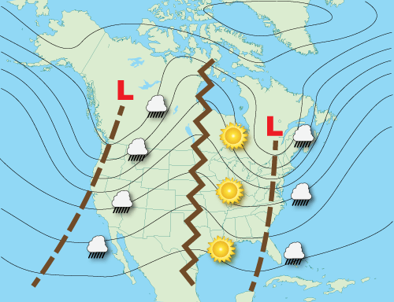
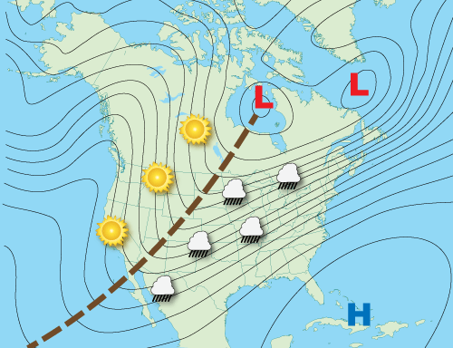
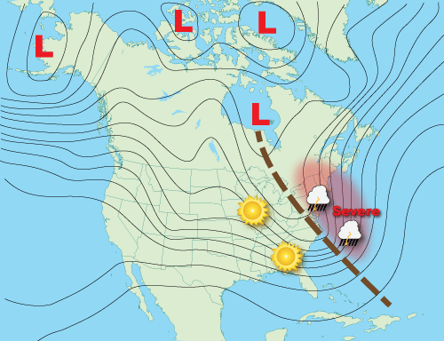
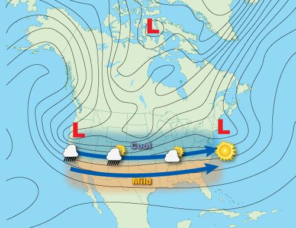
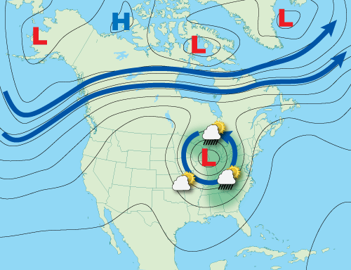
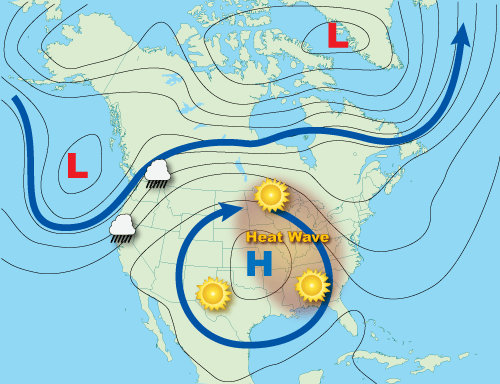
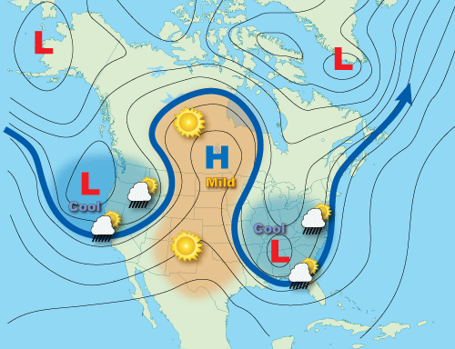
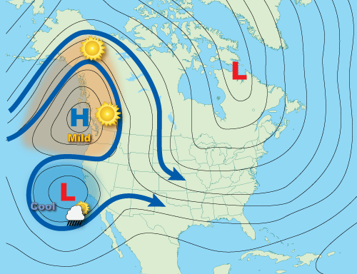

# Longwave Patterns — Basic Wave Patterns

> Source: <https://www.noaa.gov/jetstream/upper-air-charts/basic-wave-patterns>  
> Section: Miscellaneous  
> Captured: 2026-08-19 06:00 UTC  
> PDF: [longwave-patterns-basic-wave-patterns.pdf](longwave-patterns-basic-wave-patterns.pdf) · Original HTML: [source/original.html](source/original.html)

---

[Skip to main content](#main)

Main Menu

- [Home](https://www.noaa.gov/)
- [Weather](https://www.noaa.gov/weather)
- [Climate](https://www.noaa.gov/climate)
- [Ocean & Coasts](https://www.noaa.gov/ocean-coasts)
- [Fisheries](https://www.noaa.gov/fisheries)
- [Satellites](https://www.noaa.gov/satellites)
- [Research](https://www.noaa.gov/research)
- [Marine & Aviation](https://www.noaa.gov/marine-aviation)
- [Charting](https://www.noaa.gov/charting)
- [Sanctuaries](https://www.noaa.gov/sanctuaries)
- [Education](https://www.noaa.gov/education)
- [News and features](https://www.noaa.gov/news-features)
- [Our data](https://www.noaa.gov/data)
- [Tools & resources](https://www.noaa.gov/tools-and-resources)
- [About our agency](https://www.noaa.gov/about-our-agency)

An official website of the United States government

Here’s how you know

Here’s how you know

**Official websites use .gov**

 A **.gov** website belongs to an official government organization in the United States.

**Secure .gov websites use HTTPS**

 A **lock** (LockA locked padlock) or **https://** means you’ve safely connected to the .gov website. Share sensitive information only on official, secure websites.

Find your local weather

Change location:

Enter City, State or ZIP code

- [News](https://www.noaa.gov/news-features)
- [Data](https://www.noaa.gov/data)
- [Tools](https://www.noaa.gov/tools-and-resources)
- [About](https://www.noaa.gov/about-our-agency)

[National Oceanic and Atmospheric Administration](https://www.noaa.gov/ "National Oceanic and Atmospheric Administration home")
[U.S. Department of Commerce](https://www.commerce.gov)

Enter Search Terms

## Breadcrumb

1. [Home](https://www.noaa.gov/)
2. [JetStream](https://www.noaa.gov/jetstream)
3. [Topic Matrix](https://www.noaa.gov/jetstream/topic-matrix)
4. [Upper Air Charts](https://www.noaa.gov/jetstream/upper-air-charts)

- [JetStream home](https://www.noaa.gov/jetstream)
- Topic

  - [Topic](https://www.noaa.gov/jetstream/topic-matrix)
  - [The Atmosphere](https://www.noaa.gov/jetstream/atmosphere)

    - [Layers of the Atmosphere](../../16-commonly-misunderstood-terms/layers-of-the-atmosphere/layers-of-the-atmosphere.md)
    - [Air Pressure](https://www.noaa.gov/jetstream/atmosphere/air-pressure)
    - [The Transfer of Heat Energy](../../16-commonly-misunderstood-terms/radiation-conduction-and-convection-defined/radiation-conduction-and-convection-defined.md)
    - [Energy Balance](https://www.noaa.gov/jetstream/atmosphere/energy)
    - [Hydrologic Cycle](https://www.noaa.gov/jetstream/atmosphere/hydro)
    - [Precipitation](https://www.noaa.gov/jetstream/atmosphere/precipitation)
  - [The Ocean](https://www.noaa.gov/jetstream/ocean)

    - [Layers of the Ocean](https://www.noaa.gov/jetstream/ocean/layers-of-ocean)
    - [Sea Water](https://www.noaa.gov/jetstream/ocean/sea-water)
    - [Ocean Circulations](https://www.noaa.gov/jetstream/ocean/circulations)
    - [Waves](https://www.noaa.gov/jetstream/ocean/waves)
    - [Tides](https://www.noaa.gov/jetstream/ocean/tides)
    - [The Sea Breeze](https://www.noaa.gov/jetstream/ocean/sea-breeze)
    - [The Marine Layer](https://www.noaa.gov/jetstream/ocean/marine-layer)
    - [Rip Currents](https://www.noaa.gov/jetstream/ocean/rip-currents)

      - [Rip Current Safety](https://www.noaa.gov/jetstream/ocean/rip-currents/rip-current-safety)
  - [Global Weather](https://www.noaa.gov/jetstream/global)

    - [Global Atmospheric Circulations](https://www.noaa.gov/jetstream/global/global-atmospheric-circulations)
    - [The Jet Stream](https://www.noaa.gov/jetstream/global/jet-stream)
    - [Climate vs. Weather](https://www.noaa.gov/jetstream/global/climate-vs-weather)
    - [Climate Zones](https://www.noaa.gov/jetstream/global/climate-zones)
  - [Clouds](https://www.noaa.gov/jetstream/clouds)

    - [How clouds form](https://www.noaa.gov/jetstream/clouds/how-clouds-form)
    - [The Core Four](https://www.noaa.gov/jetstream/clouds/four-core-types-of-clouds)
    - [The Basic Ten](https://www.noaa.gov/jetstream/clouds/ten-basic-clouds)
    - [Cloud Chart](https://www.noaa.gov/jetstream/clouds/nws-cloud-chart)
    - [Color of Clouds](https://www.noaa.gov/jetstream/clouds/color-of-clouds)
  - [The Upper Air](https://www.noaa.gov/jetstream/upperair)

    - [Parcel Theory](https://www.noaa.gov/jetstream/upperair/parcel-theory)
    - [Stability-Instability](https://www.noaa.gov/jetstream/upperair/bowls)
    - [Radiosondes](https://www.noaa.gov/jetstream/upperair/radiosondes)
    - [Skew-T Log-P Diagrams](https://www.noaa.gov/jetstream/upperair/skew-t-log-p-diagrams)
    - [Skew-T Plots](https://www.noaa.gov/jetstream/upperair/skew-t-plots)
    - [Skew-T Examples](https://www.noaa.gov/jetstream/upperair/skewt_samples)
  - [Upper Air Charts](https://www.noaa.gov/jetstream/upper-air-charts)

    - [Pressure vs. Elevation](https://www.noaa.gov/jetstream/upper-air-charts/verses)
    - [Longwaves and Shortwaves](../longwave-patterns-long-shortwaves/longwave-patterns-long-shortwaves.md)
    - [Basic Wave Patterns](longwave-patterns-basic-wave-patterns.md)
    - [Common Features](https://www.noaa.gov/jetstream/upper-air-charts/common-features-of-constant-pressure-charts)
    - [200 mb](https://www.noaa.gov/jetstream/upper-air-charts/constant-pressure-charts-200-mb)
    - [300 mb](https://www.noaa.gov/jetstream/upper-air-charts/constant-pressure-charts-300-mb)
    - [500 mb](https://www.noaa.gov/jetstream/upper-air-charts/constant-pressure-charts-500-mb)
    - [700 mb](https://www.noaa.gov/jetstream/upper-air-charts/constant-pressure-charts-700-mb)
    - [850 mb](https://www.noaa.gov/jetstream/upper-air-charts/constant-pressure-charts-850-mb)
    - [Thickness Charts](https://www.noaa.gov/jetstream/upper-air-charts/constant-pressure-charts-thickness)
    - [Weather Models](https://www.noaa.gov/jetstream/upper-air-charts/weather-models)
  - [Synoptic Meteorology](https://www.noaa.gov/jetstream/synoptic)

    - [Time](https://www.noaa.gov/jetstream/time)
    - [Wind](https://www.noaa.gov/jetstream/synoptic/origin-of-wind)
    - [Air Masses](https://www.noaa.gov/jetstream/synoptic/air-masses)
    - [Surface Weather Maps](https://www.noaa.gov/jetstream/wxmaps)

      - [Surface Weather Plots](https://www.noaa.gov/jetstream/wxmaps-max)
    - [Norwegian Cyclone Model](https://www.noaa.gov/jetstream/synoptic/norwegian-cyclone-model)
    - [Types of Weather Phenomena](https://www.noaa.gov/jetstream/synoptic/types-of-weather-phenomena)
    - [Heat Index](https://www.noaa.gov/jetstream/synoptic/heat-index)
    - [Wind Chill](https://www.noaa.gov/jetstream/synoptic/wind-chill)
  - [Satellites](https://www.noaa.gov/jetstream/satellites)

    - [Electromagnetic waves](https://www.noaa.gov/jetstream/satellites/electromagnetic-waves)
    - [The Atmospheric Window](https://www.noaa.gov/jetstream/satellites/absorb)
    - [Weather Satellites](https://www.noaa.gov/jetstream/weather-satellites)
    - [GOES East](https://www.noaa.gov/jetstream/goes_east)
    - [GOES West](https://www.noaa.gov/jetstream/satellites/goes-west-goes-17)
  - [Doppler Radar](https://www.noaa.gov/jetstream/doppler)

    - [How radar works](https://www.noaa.gov/jetstream/doppler/how-radar-works)
    - [Volume Coverage Patterns (VCP)](https://www.noaa.gov/jetstream/vcp_max)
    - [Radar Images: Reflectivity](https://www.noaa.gov/jetstream/reflectivity)
    - [Radar Images: Velocity](https://www.noaa.gov/jetstream/velocity)
    - [Radar Images: Precipitation](https://www.noaa.gov/jetstream/precipitation)
  - [Tropical Weather Systems](../../12-tropical-cyclones/tropical-weather-nws/tropical-weather-nws.md)

    - [Inter-Tropical Convergence Zone](https://www.noaa.gov/jetstream/tropical/convergence-zone)
    - [Tropical Cyclones](https://www.noaa.gov/jetstream/tropical/tropical-cyclone-introduction)

      - [Structure](https://www.noaa.gov/jetstream/tropical/tropical-cyclone-introduction/tropical-cyclone-structure)
      - [Classification](https://www.noaa.gov/jetstream/tropical/tropical-cyclone-introduction/tropical-cyclone-classification)
      - [Names](https://www.noaa.gov/jetstream/tropical/tropical-cyclone-introduction/tropical-cyclone-names)
      - [NHC Forecasts](https://www.noaa.gov/jetstream/tc-tcm)
      - [Hazards & Safety](https://www.noaa.gov/jetstream/tc-hazards)
      - [Damage Potential](https://www.noaa.gov/jetstream/tc-potential)
    - [El Niño/Southern Oscillation](https://www.noaa.gov/jetstream/tropical/enso)

      - [ENSO Pacific Impacts](https://www.noaa.gov/jetstream/tropical/enso/enso-patterns)
      - [ENSO Weather Impacts](https://www.noaa.gov/jetstream/enso_impacts)
  - [Thunderstorms](../../07-thunderstorms/nws-jetstream/nws-jetstream.md)

    - [Ingredients for a Thunderstorm](https://www.noaa.gov/jetstream/thunderstorms/ingredients-for-thunderstorm)
    - [Life Cycle of a Thunderstorm](https://www.noaa.gov/jetstream/thunderstorms/life-cycle-of-thunderstorm)
    - [Types of Thunderstorms](https://www.noaa.gov/jetstream/tstrmtypes)
    - [Hazard: Hail](https://www.noaa.gov/jetstream/hail)
    - [Hazard: Damaging wind](https://www.noaa.gov/jetstream/wind_damage)
    - [Hazard: Tornadoes](https://www.noaa.gov/jetstream/thunderstorms/thunderstorm-hazards-tornadoes)
    - [Hazard: Flash Floods](https://www.noaa.gov/jetstream/thunderstorms/flood)
    - [Staying Ahead of the Storms](https://www.noaa.gov/jetstream/thunderstorms/staying-ahead-of-storms)
  - [Lightning](../../10-lightning/nws-lightning-tutorial/nws-lightning-tutorial.md)

    - [How Lightning is Created](https://www.noaa.gov/jetstream/lightning/how-lightning-is-created)
    - [The Positive and Negative Side of Lightning](https://www.noaa.gov/jetstream/lightning/positive-and-negative-side-of-lightning)
    - [The Sound of Thunder](https://www.noaa.gov/jetstream/lightning/sound-of-thunder)
    - [Lightning Safety](https://www.noaa.gov/jetstream/lightning/lightning-safety)
    - [Frequently Asked Questions](https://www.noaa.gov/jetstream/lightning/frequently-asked-questions)
  - [Derechos](https://www.noaa.gov/jetstream/derechos)

    - [Bow Echoes](https://www.noaa.gov/jetstream/derechos/bow-echoes)
    - [Types of Derechos](https://www.noaa.gov/jetstream/derechos/types-of-derechos)
    - [Where and When](https://www.noaa.gov/jetstream/derecho-climo)
    - [Notable Derechos](https://www.noaa.gov/jetstream/derecho-past)
    - [Keeping Yourself Safe](https://www.noaa.gov/jetstream/derecho-safety)
  - [Tsunamis](https://www.noaa.gov/jetstream/tsunamis)

    - [Historical Context](https://www.noaa.gov/jetstream/tsunamis/historical-context)
    - [Causes: Earthquakes](https://www.noaa.gov/jetstream/tsunamis/tsunami-generation-earthquakes)
    - [Causes: Landslides](https://www.noaa.gov/jetstream/tsunamis/tsunami-generation-landslides)
    - [Causes: Volcanoes](https://www.noaa.gov/jetstream/tsunamis/tsunami-generation-volcanoes)
    - [Causes: Weather](https://www.noaa.gov/jetstream/tsunamis/tsunami-generation-weather)
    - [Propagation](https://www.noaa.gov/jetstream/tsunamis/tsunami-propagation)
    - [Inundation](https://www.noaa.gov/jetstream/tsunamis/tsunami-inundation)
    - [Dangers](https://www.noaa.gov/jetstream/tsunamis/tsunami-dangers)
    - [Locations](https://www.noaa.gov/jetstream/tsunamis/tsunami-locations)
    - [Detection, Warning, and Forecasting](https://www.noaa.gov/jetstream/tsunamis/detection-warning-and-forecasting)
    - [Preparedness and Mitigation: Communities](https://www.noaa.gov/jetstream/prep-com)
    - [Preparedness and Mitigation: Individuals (You!)](https://www.noaa.gov/jetstream/prep-you)
    - [Select NOAA Tsunami Resources](https://www.noaa.gov/jetstream/tsu-resources)
  - [The National Weather Service](https://www.noaa.gov/jetstream/nws_intro)

    - [Weather Forecast Offices](https://www.noaa.gov/jetstream/wfos)
    - [River Forecast Centers](https://www.noaa.gov/jetstream/rfcs)
    - [Center Weather Service Units](https://www.noaa.gov/jetstream/cwsus)
    - [Regional Offices](https://www.noaa.gov/jetstream/regions)
    - [National Centers for Environmental Prediction](https://www.noaa.gov/jetstream/ncep)
    - [NOAA Weather Radio](https://www.noaa.gov/jetstream/nws_intro/noaa-weather-radio-all-hazards)
    - [NWS Careers: Educational Requirements](https://www.noaa.gov/jetstream/nws_intro/educational-requirements-for-careers-in-national-weather-service)
  - [Appendix](https://www.noaa.gov/jetstream/appendix)

    - [Weather Glossary](https://www.noaa.gov/jetstream/appendix/weather-glossary)
    - [Weather Acronyms](https://www.noaa.gov/jetstream/appendix/weather-acronyms)
    - [Downloads](https://www.noaa.gov/jetstream/appendix/downloads)
- [Learning Lessons](https://www.noaa.gov/jetstream/learning-lessons)
- [NWS Info](https://www.noaa.gov/jetstream/info)
- About

  - [About](https://www.noaa.gov/jetstream/about)
  - [Contact Us](https://www.noaa.gov/jetstream/about/contact-jetstream)

# Basic Wave Patterns

Share:

[Share to Twitter](https://twitter.com/intent/tweet?url=https://www.noaa.gov/jetstream/upper-air-charts/basic-wave-patterns)
[Share to Facebook](https://www.facebook.com/sharer/sharer.php?u=https://www.noaa.gov/jetstream/upper-air-charts/basic-wave-patterns)
[Share by email](mailto:?body=https://www.noaa.gov/jetstream/upper-air-charts/basic-wave-patterns)
[Print](javascript:window.print())

- [Upper Air Charts](https://www.noaa.gov/jetstream/upper-air-charts)

  - [Pressure vs. Elevation](https://www.noaa.gov/jetstream/upper-air-charts/verses)
  - [Longwaves and Shortwaves](../longwave-patterns-long-shortwaves/longwave-patterns-long-shortwaves.md)
  - [Basic Patterns](longwave-patterns-basic-wave-patterns.md)
  - [Common Features](https://www.noaa.gov/jetstream/upper-air-charts/common-features-of-constant-pressure-charts)
  - [200 mb](https://www.noaa.gov/jetstream/upper-air-charts/constant-pressure-charts-200-mb)
  - [300 mb](https://www.noaa.gov/jetstream/upper-air-charts/constant-pressure-charts-300-mb)
  - [500 mb](https://www.noaa.gov/jetstream/upper-air-charts/constant-pressure-charts-500-mb)

    - [The "Spin" Zone](https://www.noaa.gov/jetstream/upper-air-charts/constant-pressure-charts-500-mb/absolute-vorticity)
  - [700 mb](https://www.noaa.gov/jetstream/upper-air-charts/constant-pressure-charts-700-mb)
  - [850 mb](https://www.noaa.gov/jetstream/upper-air-charts/constant-pressure-charts-850-mb)
  - [Thickness Chart](https://www.noaa.gov/jetstream/upper-air-charts/constant-pressure-charts-thickness)
  - [Weather Models](https://www.noaa.gov/jetstream/upper-air-charts/weather-models)

    - [Model Output Statistics](https://www.noaa.gov/jetstream/upper-air-charts/weather-models/jetstream-max-model-output-statistics)

- [Upper Air Charts](https://www.noaa.gov/jetstream/upper-air-charts)

  - [Pressure vs. Elevation](https://www.noaa.gov/jetstream/upper-air-charts/verses)
  - [Longwaves and Shortwaves](../longwave-patterns-long-shortwaves/longwave-patterns-long-shortwaves.md)
  - [Basic Patterns](longwave-patterns-basic-wave-patterns.md)
  - [Common Features](https://www.noaa.gov/jetstream/upper-air-charts/common-features-of-constant-pressure-charts)
  - [200 mb](https://www.noaa.gov/jetstream/upper-air-charts/constant-pressure-charts-200-mb)
  - [300 mb](https://www.noaa.gov/jetstream/upper-air-charts/constant-pressure-charts-300-mb)
  - [500 mb](https://www.noaa.gov/jetstream/upper-air-charts/constant-pressure-charts-500-mb)

    - [The "Spin" Zone](https://www.noaa.gov/jetstream/upper-air-charts/constant-pressure-charts-500-mb/absolute-vorticity)
  - [700 mb](https://www.noaa.gov/jetstream/upper-air-charts/constant-pressure-charts-700-mb)
  - [850 mb](https://www.noaa.gov/jetstream/upper-air-charts/constant-pressure-charts-850-mb)
  - [Thickness Chart](https://www.noaa.gov/jetstream/upper-air-charts/constant-pressure-charts-thickness)
  - [Weather Models](https://www.noaa.gov/jetstream/upper-air-charts/weather-models)

    - [Model Output Statistics](https://www.noaa.gov/jetstream/upper-air-charts/weather-models/jetstream-max-model-output-statistics)

The following are examples of some basic wave patterns often seen in upper level charts. These patterns can occur just about anywhere in the world outside of the tropics. The images also show the typical locations of weather associated with the basic patterns.

## Open Waves

Whether longwave or shortwave, by far the most common pattern seen in upper air charts are just plain troughs and ridges. These waves and troughs are considered open because, for the most part, there is no closed circulation associated with the waves.

They are progressive, meaning they move from west to east. Low-pressure troughs are identified by brown dashed lines while ridges of high pressure are identified by brown zigzag lines.

The majority of inclement weather occurs between the trough and the downwind (eastward) ridge, while fair weather occurs between the ridge and the downwind trough.

## Positive Tilted Troughs

A trough's axis is usually not directly north to south but has some tilt relative to the poles.

Positive tilted troughs will extend from the lowest pressure, northeast to southwest in the Northern Hemisphere (southeast to northwest in the Southern Hemisphere).

Positive tilted troughs produce the least amount of severe weather.

## Negative Tilted Troughs

Negative tilted troughs usually begin as positive tiled troughs. As the shortwave energy races east though the longwave, it distorts its shape from positive to neutral (north-south) orientation to a negative (northwest to southeast) orientation.

These types of troughs are typically more conducive for severe weather. Because a negatively tilted trough typically means a strong surface low is developing, this results in a large change in wind direction from the surface into the upper atmosphere (called wind shear), which aids in the formation of supercell thunderstorms.

## Zonal Flow

When the air flow is parallel (or nearly parallel) to the latitude lines, then it is considered to be a zonal flow. Surface level storm systems and associated cold fronts move very fast from west to east in zonal flows but have very little north and south movement.

As a result, locations pole-ward of a zonal flow will remain cool or cold, while equator-ward, the weather remains mild or warm. Usually there is a positively and negatively tilted trough at each end of zonal flow.

## Cut-off Low

"Cut-off low, weatherman's woe." These are persistent low-pressure areas that have become isolated or "cut-off" from the main airflow.

They usually result from a strong shortwave moving south on the west side of troughs that extended toward the equator. The momentum of the shortwave pulls the trough out of the main airflow and forms a closed, low pressure, circulation.

The "woe" comes for their agonizingly slow motion as they can drift for many days. While modern weather computer models forecast their drift rather well, they still tend to forecast the closed low pressure to "open up" and rejoin the main airflow aloft too quickly.

They can occur any time of the year and just about anywhere on the planet. Unsettled weather occurs over the eastern half of cut-off lows, though there can be some precipitation wrapping around the north end of the low, affecting the northwest quadrant.

## Blocking Patterns

Blocking patterns occurs when centers of high pressure and/or low pressure set up over a region in such a way that they prevent other weather systems from moving through. When the blocking pattern is in place other systems are forced to go around it. Blocking patterns can remain in place for several days, resulting in long spans of persistent weather for locations under the block.

### Blocking High

Typically a summertime occurrence, blocking highs are responsible for major heat waves. Any precipitation is usually shunted around the periphery of the high-pressure area.

High pressure aloft causes the air to subside or sink. This downward motion compresses and warms the air in the lower atmosphere while simultaneously trapping heat rising from the Earth's surface, leading to heat waves.

The skies are usually clear due to the downward motion of air. Eventually, blocking highs will weaken when a shortwave moves over the top of the high, causing it to decrease, with an end to the heat wave.

### Omega Block

Omega blocks get their name because the upper air pattern looks like the Greek letter omega (Ω). Omega blocks are a combination of two cutoff lows with one blocking high sandwiched between them.

Because of their size, Omega blocks are often quite persistent and can lead to flooding and drought conditions, depending upon the location under the pattern. Cooler temperatures and precipitation accompany the lows, while warm and clear conditions prevail under the high.

### Rex Block

Rex blocks are characterized by a high-pressure system located pole-ward of a low-pressure system. The Rex block will remain nearly stationary until one of the height centers changes intensity, unbalancing the high-over-low pattern.

Unsettled, stormy weather is usually found near the low pressure, while dry conditions are typical with the high-pressure. Strong, particularly persistent Rex blocks can cause flooding near the low-pressure part of the block and short-term drought under the high-pressure part.

- [Upper Air Charts](https://www.noaa.gov/jetstream/upper-air-charts)

  - [Pressure vs. Elevation](https://www.noaa.gov/jetstream/upper-air-charts/verses)
  - [Longwaves and Shortwaves](../longwave-patterns-long-shortwaves/longwave-patterns-long-shortwaves.md)
  - [Basic Patterns](longwave-patterns-basic-wave-patterns.md)
  - [Common Features](https://www.noaa.gov/jetstream/upper-air-charts/common-features-of-constant-pressure-charts)
  - [200 mb](https://www.noaa.gov/jetstream/upper-air-charts/constant-pressure-charts-200-mb)
  - [300 mb](https://www.noaa.gov/jetstream/upper-air-charts/constant-pressure-charts-300-mb)
  - [500 mb](https://www.noaa.gov/jetstream/upper-air-charts/constant-pressure-charts-500-mb)

    - [The "Spin" Zone](https://www.noaa.gov/jetstream/upper-air-charts/constant-pressure-charts-500-mb/absolute-vorticity)
  - [700 mb](https://www.noaa.gov/jetstream/upper-air-charts/constant-pressure-charts-700-mb)
  - [850 mb](https://www.noaa.gov/jetstream/upper-air-charts/constant-pressure-charts-850-mb)
  - [Thickness Chart](https://www.noaa.gov/jetstream/upper-air-charts/constant-pressure-charts-thickness)
  - [Weather Models](https://www.noaa.gov/jetstream/upper-air-charts/weather-models)

    - [Model Output Statistics](https://www.noaa.gov/jetstream/upper-air-charts/weather-models/jetstream-max-model-output-statistics)

## Select Citation Format

- Select citation style -APA (American Psychological Association) 7th editionChicago Manual of Style 17th editionMLA (Modern Language Association) 8th editionPlain Text

Last updated May 18, 2023

[Cite this page](#)

[Have a comment on this page? Let us know.](https://www.noaa.gov/noaa_landing_page/comment_modal?email=JetStream%40noaa.gov&url=https%3A%2F%2Fwww.noaa.gov%2Fjetstream%2Fupper-air-charts%2Fbasic-wave-patterns)

[NOAA Home](https://www.noaa.gov/)

Science. Service. Stewardship.

- [News](https://www.noaa.gov/news-features)
- [Tools](https://www.noaa.gov/tools-and-resources)
- [About](https://www.noaa.gov/about-our-agency)

- [Resources for Tribal & Indigenous Communities](https://www.noaa.gov/legislative-and-intergovernmental-affairs/noaa-tribal-resources)
- [Bipartisan Infrastructure Law (BIL)](https://www.noaa.gov/infrastructure-law)
- [Inflation Reduction Act (IRA)](https://www.noaa.gov/inflation-reduction-act)
- [Protecting Your Privacy](https://www.noaa.gov/protecting-your-privacy)
- [FOIA](https://www.noaa.gov/information-technology/foia)
- [Information Quality](https://www.noaa.gov/organization/information-technology/policy-oversight/information-quality)
- [Accessibility](https://www.noaa.gov/accessibility)
- [Guidance](https://www.noaa.gov/guidance)
- [Budget & Performance](https://www.noaa.gov/budget-finance-performance)
- [Disclaimer](https://www.noaa.gov/disclaimer)
- [EEO](https://www.noaa.gov/civil-rights)
- [No-Fear Act](https://www.noaa.gov/organization/inclusion-and-civil-rights/no-fear-act)
- [USA.gov](https://www.usa.gov)
- [Ready.gov](https://www.ready.gov)
- [Employee Check-In](https://www.noaa.gov/organization/information-technology/emergency-information-for-noaa-employees)
- [Staff Directory](https://nsd.rdc.noaa.gov)
- [Contact Us](https://www.noaa.gov/contact-us)
- [Need Help?](https://www.noaa.gov/need-help)
- [COVID-19 hub for NOAA personnel offsite link](https://sites.google.com/noaa.gov/ohcs/current-event)
- [Vote.gov](https://vote.gov/)

[Stay connected to NOAA](https://www.noaa.gov/stay-connected)

[NOAA on Twitter](https://twitter.com/NOAA)
[NOAA on Facebook](https://www.facebook.com/NOAA)
[NOAA on Instagram](https://www.instagram.com/noaa)
[NOAA on YouTube](https://www.youtube.com/noaa)

[Back to top](#top--vf_I-5A8lwg "Back to top")
