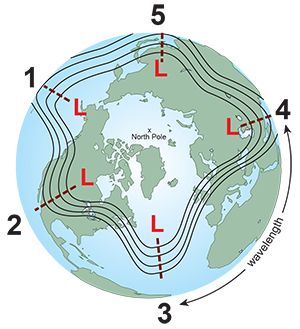
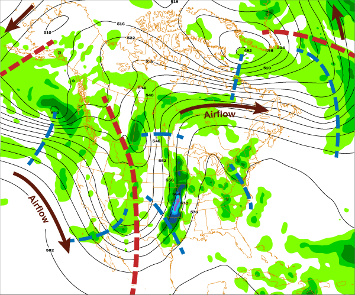

# Longwave Patterns — Long/Shortwaves

> Source: <https://www.noaa.gov/jetstream/upper-air-charts/longwaves-and-shortwaves>  
> Section: Miscellaneous  
> Captured: 2026-08-19 06:00 UTC  
> PDF: [longwave-patterns-long-shortwaves.pdf](longwave-patterns-long-shortwaves.pdf) · Original HTML: [source/original.html](source/original.html)

---

[Skip to main content](#main)

Main Menu

- [Home](https://www.noaa.gov/)
- [Weather](https://www.noaa.gov/weather)
- [Climate](https://www.noaa.gov/climate)
- [Ocean & Coasts](https://www.noaa.gov/ocean-coasts)
- [Fisheries](https://www.noaa.gov/fisheries)
- [Satellites](https://www.noaa.gov/satellites)
- [Research](https://www.noaa.gov/research)
- [Marine & Aviation](https://www.noaa.gov/marine-aviation)
- [Charting](https://www.noaa.gov/charting)
- [Sanctuaries](https://www.noaa.gov/sanctuaries)
- [Education](https://www.noaa.gov/education)
- [News and features](https://www.noaa.gov/news-features)
- [Our data](https://www.noaa.gov/data)
- [Tools & resources](https://www.noaa.gov/tools-and-resources)
- [About our agency](https://www.noaa.gov/about-our-agency)

An official website of the United States government

Here’s how you know

Here’s how you know

**Official websites use .gov**

 A **.gov** website belongs to an official government organization in the United States.

**Secure .gov websites use HTTPS**

 A **lock** (LockA locked padlock) or **https://** means you’ve safely connected to the .gov website. Share sensitive information only on official, secure websites.

Find your local weather

Change location:

Enter City, State or ZIP code

- [News](https://www.noaa.gov/news-features)
- [Data](https://www.noaa.gov/data)
- [Tools](https://www.noaa.gov/tools-and-resources)
- [About](https://www.noaa.gov/about-our-agency)

[National Oceanic and Atmospheric Administration](https://www.noaa.gov/ "National Oceanic and Atmospheric Administration home")
[U.S. Department of Commerce](https://www.commerce.gov)

Enter Search Terms

## Breadcrumb

1. [Home](https://www.noaa.gov/)
2. [JetStream](https://www.noaa.gov/jetstream)
3. [Topic Matrix](https://www.noaa.gov/jetstream/topic-matrix)
4. [Upper Air Charts](https://www.noaa.gov/jetstream/upper-air-charts)

- [JetStream home](https://www.noaa.gov/jetstream)
- Topic

  - [Topic](https://www.noaa.gov/jetstream/topic-matrix)
  - [The Atmosphere](https://www.noaa.gov/jetstream/atmosphere)

    - [Layers of the Atmosphere](../../16-commonly-misunderstood-terms/layers-of-the-atmosphere/layers-of-the-atmosphere.md)
    - [Air Pressure](https://www.noaa.gov/jetstream/atmosphere/air-pressure)
    - [The Transfer of Heat Energy](../../16-commonly-misunderstood-terms/radiation-conduction-and-convection-defined/radiation-conduction-and-convection-defined.md)
    - [Energy Balance](https://www.noaa.gov/jetstream/atmosphere/energy)
    - [Hydrologic Cycle](https://www.noaa.gov/jetstream/atmosphere/hydro)
    - [Precipitation](https://www.noaa.gov/jetstream/atmosphere/precipitation)
  - [The Ocean](https://www.noaa.gov/jetstream/ocean)

    - [Layers of the Ocean](https://www.noaa.gov/jetstream/ocean/layers-of-ocean)
    - [Sea Water](https://www.noaa.gov/jetstream/ocean/sea-water)
    - [Ocean Circulations](https://www.noaa.gov/jetstream/ocean/circulations)
    - [Waves](https://www.noaa.gov/jetstream/ocean/waves)
    - [Tides](https://www.noaa.gov/jetstream/ocean/tides)
    - [The Sea Breeze](https://www.noaa.gov/jetstream/ocean/sea-breeze)
    - [The Marine Layer](https://www.noaa.gov/jetstream/ocean/marine-layer)
    - [Rip Currents](https://www.noaa.gov/jetstream/ocean/rip-currents)

      - [Rip Current Safety](https://www.noaa.gov/jetstream/ocean/rip-currents/rip-current-safety)
  - [Global Weather](https://www.noaa.gov/jetstream/global)

    - [Global Atmospheric Circulations](https://www.noaa.gov/jetstream/global/global-atmospheric-circulations)
    - [The Jet Stream](https://www.noaa.gov/jetstream/global/jet-stream)
    - [Climate vs. Weather](https://www.noaa.gov/jetstream/global/climate-vs-weather)
    - [Climate Zones](https://www.noaa.gov/jetstream/global/climate-zones)
  - [Clouds](https://www.noaa.gov/jetstream/clouds)

    - [How clouds form](https://www.noaa.gov/jetstream/clouds/how-clouds-form)
    - [The Core Four](https://www.noaa.gov/jetstream/clouds/four-core-types-of-clouds)
    - [The Basic Ten](https://www.noaa.gov/jetstream/clouds/ten-basic-clouds)
    - [Cloud Chart](https://www.noaa.gov/jetstream/clouds/nws-cloud-chart)
    - [Color of Clouds](https://www.noaa.gov/jetstream/clouds/color-of-clouds)
  - [The Upper Air](https://www.noaa.gov/jetstream/upperair)

    - [Parcel Theory](https://www.noaa.gov/jetstream/upperair/parcel-theory)
    - [Stability-Instability](https://www.noaa.gov/jetstream/upperair/bowls)
    - [Radiosondes](https://www.noaa.gov/jetstream/upperair/radiosondes)
    - [Skew-T Log-P Diagrams](https://www.noaa.gov/jetstream/upperair/skew-t-log-p-diagrams)
    - [Skew-T Plots](https://www.noaa.gov/jetstream/upperair/skew-t-plots)
    - [Skew-T Examples](https://www.noaa.gov/jetstream/upperair/skewt_samples)
  - [Upper Air Charts](https://www.noaa.gov/jetstream/upper-air-charts)

    - [Pressure vs. Elevation](https://www.noaa.gov/jetstream/upper-air-charts/verses)
    - [Longwaves and Shortwaves](longwave-patterns-long-shortwaves.md)
    - [Basic Wave Patterns](../longwave-patterns-basic-wave-patterns/longwave-patterns-basic-wave-patterns.md)
    - [Common Features](https://www.noaa.gov/jetstream/upper-air-charts/common-features-of-constant-pressure-charts)
    - [200 mb](https://www.noaa.gov/jetstream/upper-air-charts/constant-pressure-charts-200-mb)
    - [300 mb](https://www.noaa.gov/jetstream/upper-air-charts/constant-pressure-charts-300-mb)
    - [500 mb](https://www.noaa.gov/jetstream/upper-air-charts/constant-pressure-charts-500-mb)
    - [700 mb](https://www.noaa.gov/jetstream/upper-air-charts/constant-pressure-charts-700-mb)
    - [850 mb](https://www.noaa.gov/jetstream/upper-air-charts/constant-pressure-charts-850-mb)
    - [Thickness Charts](https://www.noaa.gov/jetstream/upper-air-charts/constant-pressure-charts-thickness)
    - [Weather Models](https://www.noaa.gov/jetstream/upper-air-charts/weather-models)
  - [Synoptic Meteorology](https://www.noaa.gov/jetstream/synoptic)

    - [Time](https://www.noaa.gov/jetstream/time)
    - [Wind](https://www.noaa.gov/jetstream/synoptic/origin-of-wind)
    - [Air Masses](https://www.noaa.gov/jetstream/synoptic/air-masses)
    - [Surface Weather Maps](https://www.noaa.gov/jetstream/wxmaps)

      - [Surface Weather Plots](https://www.noaa.gov/jetstream/wxmaps-max)
    - [Norwegian Cyclone Model](https://www.noaa.gov/jetstream/synoptic/norwegian-cyclone-model)
    - [Types of Weather Phenomena](https://www.noaa.gov/jetstream/synoptic/types-of-weather-phenomena)
    - [Heat Index](https://www.noaa.gov/jetstream/synoptic/heat-index)
    - [Wind Chill](https://www.noaa.gov/jetstream/synoptic/wind-chill)
  - [Satellites](https://www.noaa.gov/jetstream/satellites)

    - [Electromagnetic waves](https://www.noaa.gov/jetstream/satellites/electromagnetic-waves)
    - [The Atmospheric Window](https://www.noaa.gov/jetstream/satellites/absorb)
    - [Weather Satellites](https://www.noaa.gov/jetstream/weather-satellites)
    - [GOES East](https://www.noaa.gov/jetstream/goes_east)
    - [GOES West](https://www.noaa.gov/jetstream/satellites/goes-west-goes-17)
  - [Doppler Radar](https://www.noaa.gov/jetstream/doppler)

    - [How radar works](https://www.noaa.gov/jetstream/doppler/how-radar-works)
    - [Volume Coverage Patterns (VCP)](https://www.noaa.gov/jetstream/vcp_max)
    - [Radar Images: Reflectivity](https://www.noaa.gov/jetstream/reflectivity)
    - [Radar Images: Velocity](https://www.noaa.gov/jetstream/velocity)
    - [Radar Images: Precipitation](https://www.noaa.gov/jetstream/precipitation)
  - [Tropical Weather Systems](../../12-tropical-cyclones/tropical-weather-nws/tropical-weather-nws.md)

    - [Inter-Tropical Convergence Zone](https://www.noaa.gov/jetstream/tropical/convergence-zone)
    - [Tropical Cyclones](https://www.noaa.gov/jetstream/tropical/tropical-cyclone-introduction)

      - [Structure](https://www.noaa.gov/jetstream/tropical/tropical-cyclone-introduction/tropical-cyclone-structure)
      - [Classification](https://www.noaa.gov/jetstream/tropical/tropical-cyclone-introduction/tropical-cyclone-classification)
      - [Names](https://www.noaa.gov/jetstream/tropical/tropical-cyclone-introduction/tropical-cyclone-names)
      - [NHC Forecasts](https://www.noaa.gov/jetstream/tc-tcm)
      - [Hazards & Safety](https://www.noaa.gov/jetstream/tc-hazards)
      - [Damage Potential](https://www.noaa.gov/jetstream/tc-potential)
    - [El Niño/Southern Oscillation](https://www.noaa.gov/jetstream/tropical/enso)

      - [ENSO Pacific Impacts](https://www.noaa.gov/jetstream/tropical/enso/enso-patterns)
      - [ENSO Weather Impacts](https://www.noaa.gov/jetstream/enso_impacts)
  - [Thunderstorms](../../07-thunderstorms/nws-jetstream/nws-jetstream.md)

    - [Ingredients for a Thunderstorm](https://www.noaa.gov/jetstream/thunderstorms/ingredients-for-thunderstorm)
    - [Life Cycle of a Thunderstorm](https://www.noaa.gov/jetstream/thunderstorms/life-cycle-of-thunderstorm)
    - [Types of Thunderstorms](https://www.noaa.gov/jetstream/tstrmtypes)
    - [Hazard: Hail](https://www.noaa.gov/jetstream/hail)
    - [Hazard: Damaging wind](https://www.noaa.gov/jetstream/wind_damage)
    - [Hazard: Tornadoes](https://www.noaa.gov/jetstream/thunderstorms/thunderstorm-hazards-tornadoes)
    - [Hazard: Flash Floods](https://www.noaa.gov/jetstream/thunderstorms/flood)
    - [Staying Ahead of the Storms](https://www.noaa.gov/jetstream/thunderstorms/staying-ahead-of-storms)
  - [Lightning](../../10-lightning/nws-lightning-tutorial/nws-lightning-tutorial.md)

    - [How Lightning is Created](https://www.noaa.gov/jetstream/lightning/how-lightning-is-created)
    - [The Positive and Negative Side of Lightning](https://www.noaa.gov/jetstream/lightning/positive-and-negative-side-of-lightning)
    - [The Sound of Thunder](https://www.noaa.gov/jetstream/lightning/sound-of-thunder)
    - [Lightning Safety](https://www.noaa.gov/jetstream/lightning/lightning-safety)
    - [Frequently Asked Questions](https://www.noaa.gov/jetstream/lightning/frequently-asked-questions)
  - [Derechos](https://www.noaa.gov/jetstream/derechos)

    - [Bow Echoes](https://www.noaa.gov/jetstream/derechos/bow-echoes)
    - [Types of Derechos](https://www.noaa.gov/jetstream/derechos/types-of-derechos)
    - [Where and When](https://www.noaa.gov/jetstream/derecho-climo)
    - [Notable Derechos](https://www.noaa.gov/jetstream/derecho-past)
    - [Keeping Yourself Safe](https://www.noaa.gov/jetstream/derecho-safety)
  - [Tsunamis](https://www.noaa.gov/jetstream/tsunamis)

    - [Historical Context](https://www.noaa.gov/jetstream/tsunamis/historical-context)
    - [Causes: Earthquakes](https://www.noaa.gov/jetstream/tsunamis/tsunami-generation-earthquakes)
    - [Causes: Landslides](https://www.noaa.gov/jetstream/tsunamis/tsunami-generation-landslides)
    - [Causes: Volcanoes](https://www.noaa.gov/jetstream/tsunamis/tsunami-generation-volcanoes)
    - [Causes: Weather](https://www.noaa.gov/jetstream/tsunamis/tsunami-generation-weather)
    - [Propagation](https://www.noaa.gov/jetstream/tsunamis/tsunami-propagation)
    - [Inundation](https://www.noaa.gov/jetstream/tsunamis/tsunami-inundation)
    - [Dangers](https://www.noaa.gov/jetstream/tsunamis/tsunami-dangers)
    - [Locations](https://www.noaa.gov/jetstream/tsunamis/tsunami-locations)
    - [Detection, Warning, and Forecasting](https://www.noaa.gov/jetstream/tsunamis/detection-warning-and-forecasting)
    - [Preparedness and Mitigation: Communities](https://www.noaa.gov/jetstream/prep-com)
    - [Preparedness and Mitigation: Individuals (You!)](https://www.noaa.gov/jetstream/prep-you)
    - [Select NOAA Tsunami Resources](https://www.noaa.gov/jetstream/tsu-resources)
  - [The National Weather Service](https://www.noaa.gov/jetstream/nws_intro)

    - [Weather Forecast Offices](https://www.noaa.gov/jetstream/wfos)
    - [River Forecast Centers](https://www.noaa.gov/jetstream/rfcs)
    - [Center Weather Service Units](https://www.noaa.gov/jetstream/cwsus)
    - [Regional Offices](https://www.noaa.gov/jetstream/regions)
    - [National Centers for Environmental Prediction](https://www.noaa.gov/jetstream/ncep)
    - [NOAA Weather Radio](https://www.noaa.gov/jetstream/nws_intro/noaa-weather-radio-all-hazards)
    - [NWS Careers: Educational Requirements](https://www.noaa.gov/jetstream/nws_intro/educational-requirements-for-careers-in-national-weather-service)
  - [Appendix](https://www.noaa.gov/jetstream/appendix)

    - [Weather Glossary](https://www.noaa.gov/jetstream/appendix/weather-glossary)
    - [Weather Acronyms](https://www.noaa.gov/jetstream/appendix/weather-acronyms)
    - [Downloads](https://www.noaa.gov/jetstream/appendix/downloads)
- [Learning Lessons](https://www.noaa.gov/jetstream/learning-lessons)
- [NWS Info](https://www.noaa.gov/jetstream/info)
- About

  - [About](https://www.noaa.gov/jetstream/about)
  - [Contact Us](https://www.noaa.gov/jetstream/about/contact-jetstream)

# Longwaves and Shortwaves

Share:

[Share to Twitter](https://twitter.com/intent/tweet?url=https://www.noaa.gov/jetstream/upper-air-charts/longwaves-and-shortwaves)
[Share to Facebook](https://www.facebook.com/sharer/sharer.php?u=https://www.noaa.gov/jetstream/upper-air-charts/longwaves-and-shortwaves)
[Share by email](mailto:?body=https://www.noaa.gov/jetstream/upper-air-charts/longwaves-and-shortwaves)
[Print](javascript:window.print())

- [Upper Air Charts](https://www.noaa.gov/jetstream/upper-air-charts)

  - [Pressure vs. Elevation](https://www.noaa.gov/jetstream/upper-air-charts/verses)
  - [Longwaves and Shortwaves](longwave-patterns-long-shortwaves.md)
  - [Basic Patterns](../longwave-patterns-basic-wave-patterns/longwave-patterns-basic-wave-patterns.md)
  - [Common Features](https://www.noaa.gov/jetstream/upper-air-charts/common-features-of-constant-pressure-charts)
  - [200 mb](https://www.noaa.gov/jetstream/upper-air-charts/constant-pressure-charts-200-mb)
  - [300 mb](https://www.noaa.gov/jetstream/upper-air-charts/constant-pressure-charts-300-mb)
  - [500 mb](https://www.noaa.gov/jetstream/upper-air-charts/constant-pressure-charts-500-mb)

    - [The "Spin" Zone](https://www.noaa.gov/jetstream/upper-air-charts/constant-pressure-charts-500-mb/absolute-vorticity)
  - [700 mb](https://www.noaa.gov/jetstream/upper-air-charts/constant-pressure-charts-700-mb)
  - [850 mb](https://www.noaa.gov/jetstream/upper-air-charts/constant-pressure-charts-850-mb)
  - [Thickness Chart](https://www.noaa.gov/jetstream/upper-air-charts/constant-pressure-charts-thickness)
  - [Weather Models](https://www.noaa.gov/jetstream/upper-air-charts/weather-models)

    - [Model Output Statistics](https://www.noaa.gov/jetstream/upper-air-charts/weather-models/jetstream-max-model-output-statistics)

- [Upper Air Charts](https://www.noaa.gov/jetstream/upper-air-charts)

  - [Pressure vs. Elevation](https://www.noaa.gov/jetstream/upper-air-charts/verses)
  - [Longwaves and Shortwaves](longwave-patterns-long-shortwaves.md)
  - [Basic Patterns](../longwave-patterns-basic-wave-patterns/longwave-patterns-basic-wave-patterns.md)
  - [Common Features](https://www.noaa.gov/jetstream/upper-air-charts/common-features-of-constant-pressure-charts)
  - [200 mb](https://www.noaa.gov/jetstream/upper-air-charts/constant-pressure-charts-200-mb)
  - [300 mb](https://www.noaa.gov/jetstream/upper-air-charts/constant-pressure-charts-300-mb)
  - [500 mb](https://www.noaa.gov/jetstream/upper-air-charts/constant-pressure-charts-500-mb)

    - [The "Spin" Zone](https://www.noaa.gov/jetstream/upper-air-charts/constant-pressure-charts-500-mb/absolute-vorticity)
  - [700 mb](https://www.noaa.gov/jetstream/upper-air-charts/constant-pressure-charts-700-mb)
  - [850 mb](https://www.noaa.gov/jetstream/upper-air-charts/constant-pressure-charts-850-mb)
  - [Thickness Chart](https://www.noaa.gov/jetstream/upper-air-charts/constant-pressure-charts-thickness)
  - [Weather Models](https://www.noaa.gov/jetstream/upper-air-charts/weather-models)

    - [Model Output Statistics](https://www.noaa.gov/jetstream/upper-air-charts/weather-models/jetstream-max-model-output-statistics)

## Longwaves

The hemispheric weather patterns are governed by mid-latitude (23.5°N/S to 66.5°N/S) westerly winds which move in large wavy patterns. Known as planetary waves, these **longwaves** are also called Rossby waves, named after Carl Rossby, who discovered them in the 1930s.

Rossby waves form primarily because of the Earth's geography, which does two things. First, the Earth heats unevenly from the sun due to the different shapes and sizes of the land mass (called differential heating of the Earth's surface). Second, since air can't travel through a mountain, it must rise up and over or go around.

In both cases, the disruption of the air flow creates imbalances in temperature distribution both vertically and horizontally. The wind responds by seeking a return to a "balanced" atmosphere and changes speed and/or direction. However, as long as the sun keeps shining, those imbalances will continue to develop. Thus, the wind will constantly be changing directions and develop into wave-like patterns.

An example of a five planetary-wave pattern

[Download Image](https://www.noaa.gov/media/image_download/6622c859-3374-4628-9865-a64fc4d47a1e)

The length of longwaves vary from around 3,700 mi (6,000 km) to 5,000 mi (8,000 km) or more. They generally move very slowly from west to east, but occasionally they will become stationary or retrograde (move east to west).

The speed at which these large waves move should not to be confused with the speed of the wind found *within* the waves themselves. For example, there can be a strong jet stream wind of 100 kt (115 mph / 185 km/h) moving *through* the longwave but the position of long wave itself may move very little. The wave itself is not moving at 100 kt (115 mph / 185 km/h), just the wind within it.

Rossby waves help to transfer heat from the tropics toward the poles and cold air from the poles toward the tropics trying to return the atmosphere to balance. They also help locate the jet stream and mark out the track of surface low-pressure systems. The number of longwaves at any one time varies from three to seven, though it is typically four or five.

Their slow motion often results in fairly long persistent weather patterns. For example, locations between the trough and the downstream ridge can experience extended periods with rain or snow, while at the same time 1,500 - 2,000 miles (3,000 - 4,000 km) upwind and/or downwind, the weather is very dry.

This often can lead to a misconception that the weather experienced is typical everywhere. That is simply not true. If one place is receiving cooler weather and/or flooding rains over a period of several days to weeks, then there are some other places where the weather is warm and dry for about the same period. It all depends upon the location of the longwaves relative to the observer.

## Shortwaves

A "piece of energy", "vort max" (or "vorticity maximum"), "pocket of cold air" (or "pocket of energy"), "upper level disturbance", "upper level energy", or just "**shortwave**" are some of the slang terms for waves with a length of less than 3,700 miles (6,000 km).

Shortwaves are embedded within the longwaves. Unlike the slow movement of longwaves, shortwaves move east (downstream) on average of 23 mph (20 kts, 37 km/h) in summer and 35 mph (30 kts, 55 km/h) in winter. This motion causes longwaves to distort and change shape, such as deepening longwave troughs and flattening longwave ridges.

Due to their variety of sizes, it can be difficult to discern a shortwave embedded within a longwave by looking at a static map. Looping images of the wave patterns are often needed to determine the difference between them.

### Video file

The animation above, from NASA's Goddard Space Flight Center, shows the both longwaves and shortwaves, as indicated by the jet stream. The period covered by the loop is almost one month from June to July of 1988.

Shortwaves are also the chief instigator of episodes of precipitation. Main precipitation bands will typically be localized near the shortwave as it passes overhead.

Below is an example of a 500 mb chart. The height contours are in black. The brown arrows indicate direction of airflow. The large red dashed lines represent the location of the long wave troughs.

The shorter blue dashed lines represent the location of the of the more prominent shortwaves (There are more short waves than indicated.) The green areas represent precipitation totals. The areas of precipitation are mainly associated with shortwaves as they pass through longwaves. Like railroad cars on a train tack, shortwaves will generally follow height contours.

- [Upper Air Charts](https://www.noaa.gov/jetstream/upper-air-charts)

  - [Pressure vs. Elevation](https://www.noaa.gov/jetstream/upper-air-charts/verses)
  - [Longwaves and Shortwaves](longwave-patterns-long-shortwaves.md)
  - [Basic Patterns](../longwave-patterns-basic-wave-patterns/longwave-patterns-basic-wave-patterns.md)
  - [Common Features](https://www.noaa.gov/jetstream/upper-air-charts/common-features-of-constant-pressure-charts)
  - [200 mb](https://www.noaa.gov/jetstream/upper-air-charts/constant-pressure-charts-200-mb)
  - [300 mb](https://www.noaa.gov/jetstream/upper-air-charts/constant-pressure-charts-300-mb)
  - [500 mb](https://www.noaa.gov/jetstream/upper-air-charts/constant-pressure-charts-500-mb)

    - [The "Spin" Zone](https://www.noaa.gov/jetstream/upper-air-charts/constant-pressure-charts-500-mb/absolute-vorticity)
  - [700 mb](https://www.noaa.gov/jetstream/upper-air-charts/constant-pressure-charts-700-mb)
  - [850 mb](https://www.noaa.gov/jetstream/upper-air-charts/constant-pressure-charts-850-mb)
  - [Thickness Chart](https://www.noaa.gov/jetstream/upper-air-charts/constant-pressure-charts-thickness)
  - [Weather Models](https://www.noaa.gov/jetstream/upper-air-charts/weather-models)

    - [Model Output Statistics](https://www.noaa.gov/jetstream/upper-air-charts/weather-models/jetstream-max-model-output-statistics)

## Select Citation Format

- Select citation style -APA (American Psychological Association) 7th editionChicago Manual of Style 17th editionMLA (Modern Language Association) 8th editionPlain Text

Last updated November 1, 2024

[Cite this page](#)

[Have a comment on this page? Let us know.](https://www.noaa.gov/noaa_landing_page/comment_modal?email=JetStream%40noaa.gov&url=https%3A%2F%2Fwww.noaa.gov%2Fjetstream%2Fupper-air-charts%2Flongwaves-and-shortwaves)

[NOAA Home](https://www.noaa.gov/)

Science. Service. Stewardship.

- [News](https://www.noaa.gov/news-features)
- [Tools](https://www.noaa.gov/tools-and-resources)
- [About](https://www.noaa.gov/about-our-agency)

- [Resources for Tribal & Indigenous Communities](https://www.noaa.gov/legislative-and-intergovernmental-affairs/noaa-tribal-resources)
- [Bipartisan Infrastructure Law (BIL)](https://www.noaa.gov/infrastructure-law)
- [Inflation Reduction Act (IRA)](https://www.noaa.gov/inflation-reduction-act)
- [Protecting Your Privacy](https://www.noaa.gov/protecting-your-privacy)
- [FOIA](https://www.noaa.gov/information-technology/foia)
- [Information Quality](https://www.noaa.gov/organization/information-technology/policy-oversight/information-quality)
- [Accessibility](https://www.noaa.gov/accessibility)
- [Guidance](https://www.noaa.gov/guidance)
- [Budget & Performance](https://www.noaa.gov/budget-finance-performance)
- [Disclaimer](https://www.noaa.gov/disclaimer)
- [EEO](https://www.noaa.gov/civil-rights)
- [No-Fear Act](https://www.noaa.gov/organization/inclusion-and-civil-rights/no-fear-act)
- [USA.gov](https://www.usa.gov)
- [Ready.gov](https://www.ready.gov)
- [Employee Check-In](https://www.noaa.gov/organization/information-technology/emergency-information-for-noaa-employees)
- [Staff Directory](https://nsd.rdc.noaa.gov)
- [Contact Us](https://www.noaa.gov/contact-us)
- [Need Help?](https://www.noaa.gov/need-help)
- [COVID-19 hub for NOAA personnel offsite link](https://sites.google.com/noaa.gov/ohcs/current-event)
- [Vote.gov](https://vote.gov/)

[Stay connected to NOAA](https://www.noaa.gov/stay-connected)

[NOAA on Twitter](https://twitter.com/NOAA)
[NOAA on Facebook](https://www.facebook.com/NOAA)
[NOAA on Instagram](https://www.instagram.com/noaa)
[NOAA on YouTube](https://www.youtube.com/noaa)

[Back to top](#top--oXMecpTuDuI "Back to top")
