# Longwave Patterns

> Source: <http://www.weather.gov/source/zhu/ZHU_Training_Page/Miscellaneous/longwave/longwave_patterns.html>  
> Section: Miscellaneous  
> Captured: 2026-08-19 06:00 UTC  
> PDF: [longwave-patterns.pdf](longwave-patterns.pdf) · Original HTML: [source/original.html](source/original.html)

---

# Identifying and Forecasting Long Wave Weather Patterns

Source: [meteorology101.com/](https://meteorology101.com/synoptic-weather-systems/)

Identifying synoptic systems and understanding the synoptic situation is critical for forecasting weather in any specific region. In this article we will discuss the identification of synoptic features and progging synoptic systems.

## Long Wave Charateristics

The long-wave pattern defines the average storm track; cyclones tend to intensify near and just downstream from the long-wave trough axis. The long waves themselves are sometimes referred to as “Rossby waves” named after G.C. Rossby who developed the equations that describe the movement of the upper waves. If all major short waves were removed from the long-wave pattern, it would be barotropic.

However, the major short waves cause baroclinicity within the long-wave pattern. Long waves are best seen on upper-air charts at the 200 to 300-mb level, because the effects of smaller scale baroclinicity decreases with height above mid levels in the atmosphere. Wavelength ranges from 60 to 120° of longitude.

In a region where the winds blow in a west to east direction, parallel to the lines of latitude, the wind flow is termed zonal. Winds on the 500-mb chart below represent a zonal flow across the United States. In zonal flow, little north to south energy (heat and moisture) transfer occurs, and small west to east temperature variations exist.

Weather systems tend to be weaker and move rapidly from west to east. When the wind flows in a more north to south trajectory, parallel to the meridian lines, the flow is termed meridional. Large-scale energy transfer occurs in a meridional flow and large west to east temperature variations exist. Meridional flow can be seen in the figure below along the central United States. Weather systems are often strong, with cyclones producing large cloud and precipitation shields.

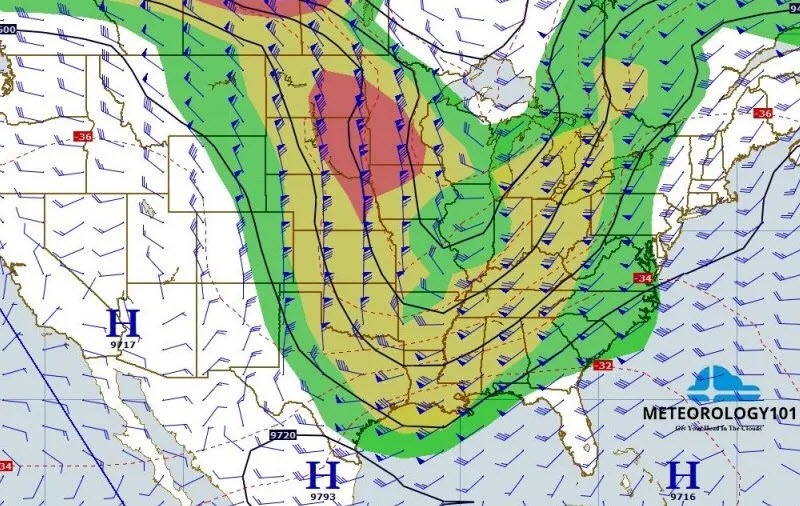

Short waves move through the long-wave pattern. 500-mb hemispheric charts depict a distorted long-wave pattern because of the numerous major baroclinic waves moving through the long-wave. The 0 to 5-wave 500-mb hemispheric chart filters the major short waves out and therefore, is a better indicator of the actual long-wave pattern.

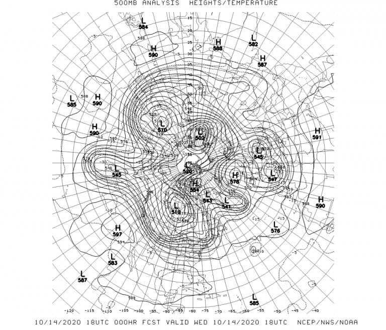

The easiest way to locate long waves is using a 0 to 5-wave chart. However, if a 0 to 5-wave chart is unavailable, the standard means of identification is using the 200 to 300-mb charts. Satellite methods of identifying long waves may also be used. The main axis of the polar front jet tends to outline the current long-wave pattern. Techniques used to locate the PFJ on satellite pictures are useful in defining this pattern.

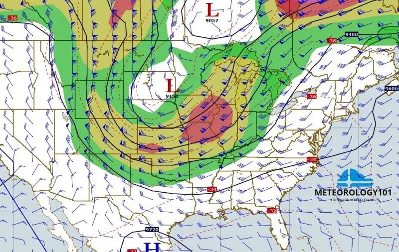

## Forecasting The Longwave Pattern

### Thermal Advection

The long-wave pattern is barotropic, however, the major short waves that move through the long-wave pattern provide thermal advection. Baroclinic instability theory explains that potential energy from the long wave is transferred into kinetic energy by the major short wave. As the major short waves move through the long-wave pattern, they provide the CAA/WAA that affects the long-wave pattern. CAA deepens long-wave troughs and weakens long-wave ridges. WAA will build long-wave ridges and fill long-wave troughs.

Evaluate thermal advection on a long-wave scale using the 1000-500-mb thickness chart. Keep in mind that what occurs upstream of the long-wave ridges and troughs will affect the downstream long-wave trough or ridge. As the upstream ridge builds due to WAA, increased CAA may occur into the downstream long-wave trough, deepening the long-wave trough or as the upstream trough deepens due to CAA, increased WAA may occur into the downstream long-wave ridge, building the long-wave ridge.

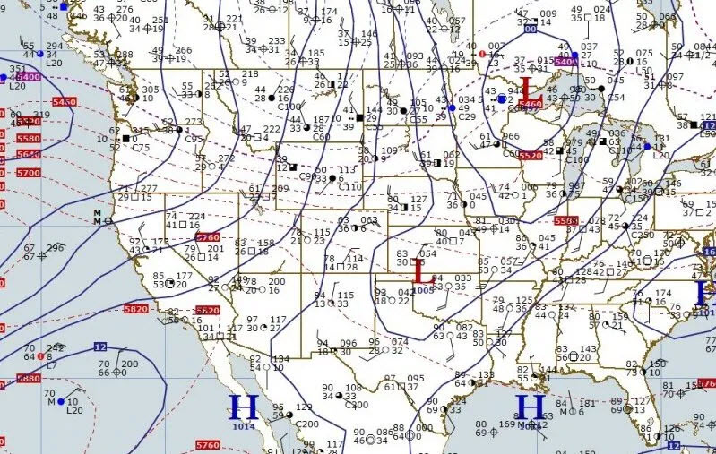

### Subgradient and Supergradient Winds in Upper Levels

Subgradient (confluent) flow causes winds to cross contours toward lower heights, increasing mass to the left of the flow. This fills troughs and weakens ridges when the condition exists between the axis of the long-wave feature and the downstream inflection point.

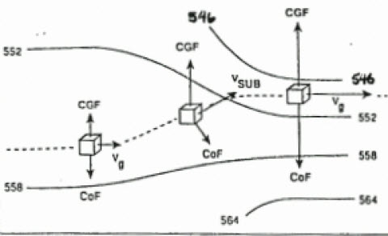
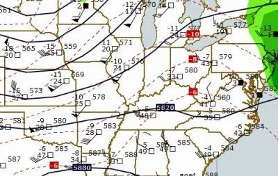

Supergradient (diffluent) flow causes winds to cross contours toward higher heights increasing mass to the right of the flow. This deepens troughs and builds ridges when the condition exists between the axis of the long-wave feature and upstream inflection point.

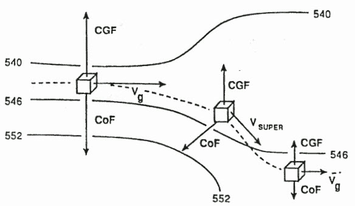
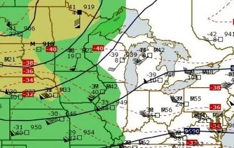

### Intensity Changes

Long-wave troughs deepen as a major short-wave trough, a diffluent flow pattern, or CAA moves into the base of the long-wave trough. Evaluate CAA by using 1000/500mb thickness chart and diffluent flow using the 300mb chart.

Long-wave ridges build as a major short-wave ridge, confluent flow, or WAA moves into the crest of the long-wave ridge. Evaluate WAA by using the 1000-500mb chart and confluent flow using the 300mb chart.

## Long-Wave Movement

They generally progress slowly. Long waves generally move 10 knots or less. However, on occasions, long waves can move as fast as 15 knots. The larger the wavelength, the slower the wave moves, the smaller the wavelength the faster the wave moves.

Long waves can remain stationary or retrogress very slowly. ONLY long waves can remain stationary or retrogress. Retrogression is often a discontinuous process. While a new long-wave trough forms to the west, the old long-wave trough moves east and fills. Retrogression frequently occurs with blocking ridges. The long wave will move with or towards whatever force is increasing the system intensity (building the ridge, deepening the trough).

## Effects of Temperature Advection on the Long-Wave Pattern

An area of cold air advection will deepen the long-wave trough. It can also cause the long-wave trough to orient in the direction of the strongest CAA. If an area of CAA is moving into the base of the long-wave trough, the trough may remain quasi-stationary or retrogress. It an area of CAA is moving out of the long-wave trough, it may cause the eastward progression of the trough to speed up.

The same principle applies to the long-wave ridge. An area of WAA will build the long-wave ridge. It can also cause the long-wave ridge to orient in the direction of the strongest WAA. If an area of WAA is moving into the crest of the long-wave ridge, the ridge may remain quasi-stationary or retrogress. If an area of WAA is moving out of the long-wave ridge, it may cause the eastward progression of the ridge to speed up.

## Effects of Wind Maxima on the Long-Wave Pattern

Long-wave troughs deepen and long-wave ridges build and remain quasi-stationary with a jet maximum moving into the axis of the long-wave feature. (Supergradient winds deflecting mass to the right flow).

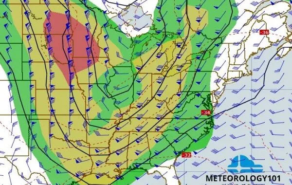

Long-wave in troughs and ridges with jet maxima near the axis of the long-wave feature progress with little or no change in amplitude.

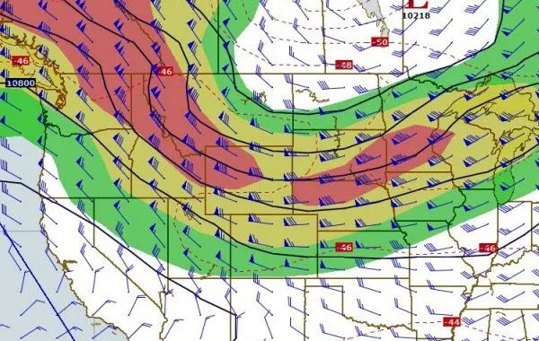

Long wave troughs fill and long-wave ridges weaken and progress more rapidly as the jet maxima move out and down stream of the long wave axis. (Subgradient winds deflects mass to the left of the flow).

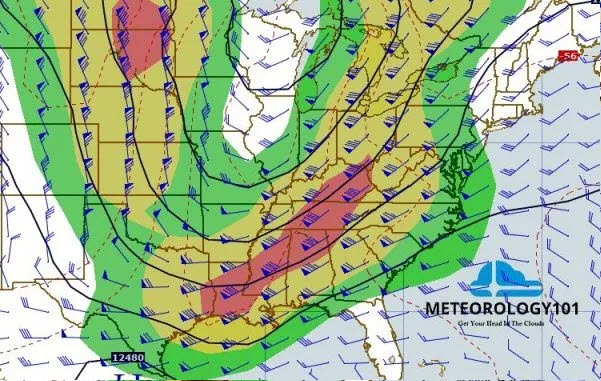

A northwesterly jet maximum approaching a sharply curved ridge (with the downstream trough axis initially oriented NE-SW), causes the trough to fill and reorient to a more N-S direction. If a closed low is present in the base of the trough, it will open up and eject rapidly to the NE. (Centrifugal force adds mass to the trough filling it).

A westerly jet maximum approaching a flat ridge, with a blocking ridge east of a downstream trough oriented N-S, causes the trough to fill. If a closed low is present in the base of the trough, it will open up and move northward with no reorientation of the trough axis. (Centrifugal force adds mass to the trough/low, the downstream blocking ridge will not allow easterly progression).

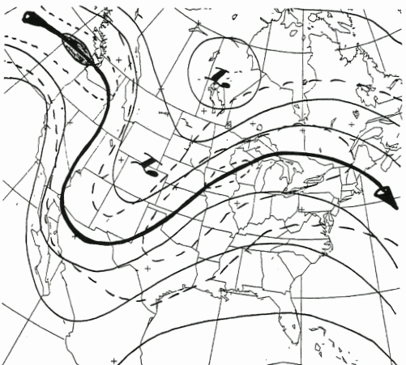

A southwesterly jet maximum approaching a sharply curved ridge with a deep trough positioned just downstream of the ridge, causes the trough to fill while a cut-off low may form in the base of the trough. (Centrifugal force adds mass to the top of the ridge until the jet axis overshoots the deep trough)

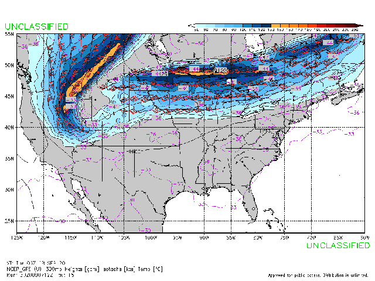

## Blocking Patterns

Blocking. The large scale obstruction of the normal west to east progression of migratory baroclinic lows and highs.

The basic zonal flow becomes split into two appreciable segments for a significant distance, one branch on a poleward trajectory and the other on a equatorward trajectory. The pattern persists for a long period. (A long period on the synoptic scale is approximately a week or more.) Three of the most common blocking patterns are: the Rex block, with a high north of a low; the Omega block, where the flow pattern resembles the Greek letter omega with a high sandwiched between two lows; and the stationary, high amplitude ridge, which is associated with hot, dry weather.

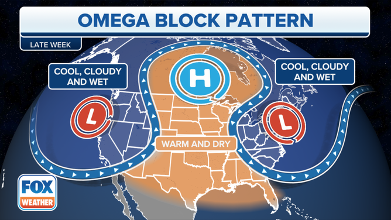

**Omega Blocking Pattern**

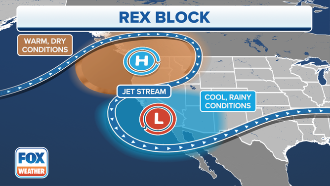

**Rex Blocking Pattern**

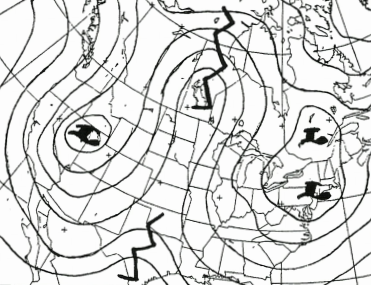

**Blocking Ridge**

## Characteristics of Blocking Patterns

Blocking is associated with upper-level flow patterns and systems where the flow is extremely low zonal. The surface reflections of the upper-level blocking systems can be observed, but the upper-level features are the cause of the blocking. Blocking is normally caused by a group of systems. For example, a blocking high in conjunction with a blocking low, i.e., the Rex block.

**Blocking High/Ridge.** A system that is a warm barotropic high or long-wave ridge responsible, by itself, or in part, for blocking.

**Blocking low/Trough.** A system that is a cold barotropic low or long-wave trough responsible by itself, or in part, for blocking.

Cold barotropic lows evolving from baroclinic lows (decaying waves) appear similar to cut-off lows on satellite imagery, but some differences do exist. They are located north of the main polar front jet. Since they evolve from baroclinic lows which form along frontal systems, they have the remnants of the frontal cloud band wrapped around the low. As the system decays, the cloud band dissipates and becomes more broken and less defined, and the low center may appear as a circulation in the cloud pattern. In most cases, a well defined band of deformation zone cloudiness exists north of the low center. Cold barotropic lows are vertically stacked through the atmosphere and dissipate from the surface up.

## Decaying Wave

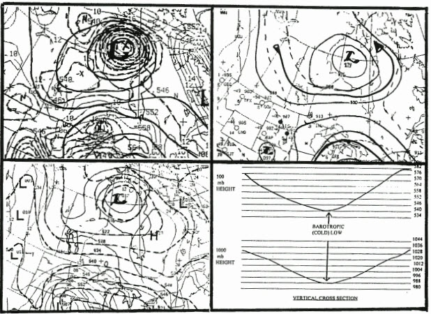

**Decaying Wave**

Subtropical highs are identified on satellite imagery by considering the flow pattern in the surrounding region. The polar front jet is positioned poleward of the subtropical highs and systems north of the subtropical high generally move from the west to east. Tropical systems, equatorward of the subtropical highs, generally move from east to west.

Cut-off highs are warm barotropic systems that are vertically stacked and slow moving or stationary. The polar front jet often splits with two branches flowing around the high. A high amplitude trough normally exists upstream from the block. A well defined band of baroclinic zone cirrus forms with this trough/ridge couplet and shows the classic “sharp” ridge pattern in Dynamics I. A large area of clear skies is found at the center of the barotropic high.
