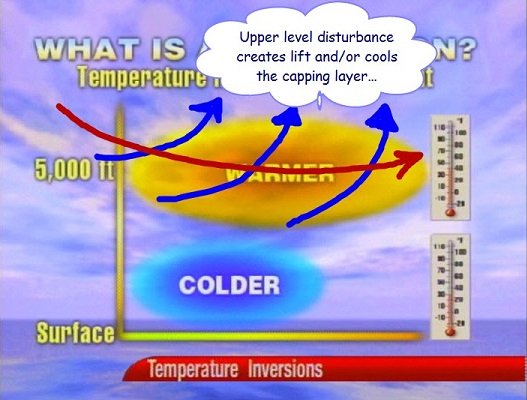
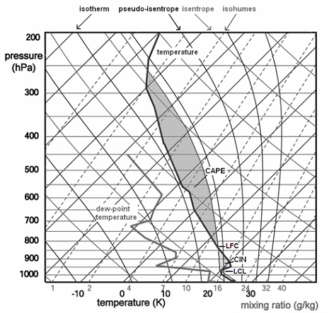
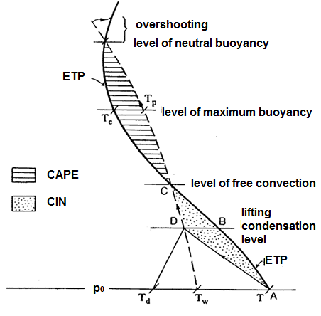

# The Inversion/Cap

> Source: <http://www.weather.gov/source/zhu/ZHU_Training_Page/Miscellaneous/inversion/inversion.html>  
> Section: Miscellaneous  
> Captured: 2026-08-19 06:00 UTC  
> PDF: [the-inversion-cap.pdf](the-inversion-cap.pdf) · Original HTML: [source/original.html](source/original.html)

---

body {background-color:#F2F2F2; }
a:link { color:blue; }
a:visited { color:blue; }
a:hover { color:blue; }
a:active { color:blue; }

# The Inversion

**METEOROLOGIST JEFF HABY**
[theweatherprediction.com](https://theweatherprediction.com/)

An inversion is an increase of temperature with height. There are several ways they can be created which include:
(1) **High pressure subsidence**
(2) **WAA in the middle levels of the troposphere**
(3) **Radiational cooling of the earth's surface**
(4) **Warm air flowing over a large cold water body**
(5) **The frontal inversion and**
(6) **The tropopause inversion (warming by absorption of shortwave radiation
by ozone)**

We will take a closer look at each of these processes.

(1) High pressure promotes sinking air. As air sinks it warms adiabatically. Sinking air will warm at the dry adiabatic lapse rate due to the air being
unsaturated. When high pressure promotes sinking air, the air will not sink at a uniform rate at all levels of the troposphere. *A deep high pressure
will have the greatest sinking motion in the middle levels of the troposphere (near level of non-divergence). The inversion will develop where
the strongest sinking motion is taking place. With deep high pressure this will generally be located between 850 and 600 millibars*. Even if a true
inversion is not produced by the high pressure, the lapse rate will likely be stable in the middle levels of the troposphere (less than WALR).

(2) WAA into the middle levels of the troposphere can occur by way of differential advection or WAA increasing with height from the surface to the
middle levels of the troposphere. WAA propagating into the middle levels of the troposphere can occur as dry hot air in higher elevation regions
advects from its source region. Upon leaving the source region, this dry and warm air advects into the middle levels of the troposphere upon moving
into a region with a lower elevation. The inversion this creates is commonly called a cap or lid. For a good explanation of the Texas Cap, please click
[**here.**](http://michaelsweatherblog.blogspot.com/2013/03/the-cap.html) WAA can increase with height due to surface friction
or a shallow layer of cold dense air in the PBL. *If the WAA is greater at 700 millibars than 850 millibars, this will act to create an inversion over
time*.

(3) The most common inversion is the radiational inversion. The earth is cooled at night by longwave radiation emission to space. This is maximized
on clear nights with light wind and dry air. Air in the lower PBL will cool much more rapidly than air at the top of the PBL at night. This will cause
an inversion that at times can be quite impressive. These inversions generally erode rapidly once daytime heating warms the lower PBL.

(4) A cold body of water will chill the air above it. The air chills due to the conduction of heat away from the air toward the cold body of water.
This is common over the Great Lakes in the early summer. Warm air will advect over the Great Lakes that are recovering from cold winter waters. The
chilling of air near the surface results in a temperature increase with height.

(5) A shallow cold front can create an inversion. This is the second most common type of inversion. The inversion created from a cold front is
especially evident when a shallow layer of polar air moves into lower latitudes. The air associated with the shallow air mass is colder than the
air aloft, thus creating an inversion. Inversions promote stability within the vertical layer of the troposphere they exist. Keep in mind that
precipitation can still occur when there is an inversion in the troposphere (especially frontal and WAA inversions) because rising air can begin ABOVE
the inversion boundary.

(6) An inversion in the tropopause is created by the absorption of shortwave radiation by ozone. This inversion occurs nears the 150 millibar level, but
can be a little higher or lower depending on season and weather. The tropopause inversion and the extreme stability associated with it inhibit
UVV's into the stratosphere.

---

# What is a Cap?

**METEOROLOGIST JEFF HABY**
[theweatherprediction.com](https://theweatherprediction.com/)

A cap is a layer of air that prevents convection or limits dynamic lifting. Another way of describing a cap is that it is a layer of stable
air aloft. Below are some common ways a cap can form:

1. **Sinking air aloft:** Sinking air warms at the dry adiabatic lapse rate. Suppose the air near the surface is not sinking but there is a layer of
air around 800 mb for example that is sinking. Over time the air will become more stable. A stable situation occurs when there is warmer air
above cooler air or the temperature lapse rate is weak. This situation can occur when high pressure is influencing the weather. The surface may
be warm and moist and it feels unstable at the surface but a layer of very stable air aloft can prevent the warm and moist air near the surface
from convectively rising into thunderstorms.

2. **Horizontal advection of hot air aloft:** This is a primary process that creates the famous Great Plains capping inversions that can either
prevent storms from occurring or holds off thunderstorm activity until the heat of the day. The geography of the plains is that the elevation
generally increases moving from the east to the west. Further west of the plains the elevation increases further into mountains and high plateaus.
In the warm season, the air over the high plains, mountains and Mexican plateau is often dry and hot during the day. When the upper level flow
pattern has a component of wind coming from the west then this air will be advected toward the east. Since this hot dry air originates at higher
elevations it will stay around that higher elevation as it moves east. As the hot air moves east the air is higher and higher in elevation above
the surface since the land elevation of the plains decreases when moving east. This can create situations in the plains where there is warm and
moist maritime tropical air near the surface and hot and dry continental tropical air above. The hot and dry air creates a cap. This cap is most
noticeable in the morning hours when the air near the surface has cooled off but the air aloft is very warm. For a good explanation of the Texas
Cap, please click [**here.**](http://michaelsweatherblog.blogspot.com/2013/03/the-cap.html)

3. **Shallow cold front:** Cold air is dense and tends to spread along the earth's surface and hug the earth's surface. When a shallow cold front
moves through it creates a stable situation with cold air at the surface with warmer air above the shallow cold air. Once a cold front passes the
chances for thunderstorms usually decreases significantly. There are special situations in which thunderstorms can still occur but generally
the chances of strong and severe thunderstorms ends once the cold front passes.

4. **Cooling at night of earth's surface:** This is a very common way a cap is developed. The creation of this type of cap is a reason why
thunderstorms are less common in the early morning than they are in the afternoon and evening. At night the earth's surface cools through
longwave energy emission. If the skies are clear then the cooling is most significant. In the early morning hours the air at the surface will have
cooled off while the air higher aloft is not influenced. This creates the classic radiational cooling cap. This type of cap weakens through daytime
heating.

---

# Negative Bouyance and the Cap on Skew-T

**METEOROLOGIST JEFF HABY**
[theweatherprediction.com](https://theweatherprediction.com/)

Most Skew-T's that you see on the web will have a list of abbreviations and numbers to the right of the Skew-T and wind identifiers. On the
actual diagram on the web, there will be three sounding lines (one for the dewpoint, one for the temperature and one for the parcel lapse rate
from the surface). The parcel line is easy to pick out, it is a smooth curve first following a dry adiabat and then after saturation following
a moist adiabat. The temperature and dewpoint soundings are not as smooth in appearance. Since dewpoint is always equal to or less than
temperature, the dewpoint sounding will ALWAYS be to the left of the temperature sounding.

Now for interpretation of some of the abbreviations and numbers to the right of the diagram. The ones we will go over today involve positive
and negative buoyancy. One value is called **CAP**. **The CAP is the number of degrees C the temperature needs to warm in the boundary layer to remove
the cap.** This value tells you the strength of the inversion in the low levels of the troposphere. An inversion is most commonly found at the top
of the planetary boundary layer or the transition zone of differential advection. The CAP is important since it can BOTH promote severe weather
OR prevent storms from forming. If the CAP is too strong, parcels of air in the PBL will not be able to rise above the CAP. Since the CAP is an
inversion, a strong inversion of warm air prevents PBL air from rising above the CAP since the PBL parcels become cooler than the environment
when they reach the CAP. On the other hand, the CAP can trap moisture and heat in the PBL... this will gradually weaken the CAP... the warmer and
more humid the PBL gets, the weaker the CAP will become. Once the CAP is broken, explosive development of thunderstorms can occur. *A general rule
is that if the CAP is greater than 2.0, The CAP will not be broken within the next couple of hours. Once the CAP drops below 2.0, convection
is likely*. The CAP is important to study in the Plains since this is the region most vulnerable to differential advection and convective
instability. It is important to look at forecast soundings to determine the approximate time of when the CAP may break. Some days the CAP will be
too strong and no storms develop at all, even in the heat of the day. These days are called "busts" and are one reason why days with a moderate
or high chance of severe storms end up with no convective activity. Again, this is primarily a Great Plains "tornado alley" problem. The CAP
is not as important in other parts of the country, but can be in certain weather situations (especially warm season thermodynamic thunderstorms).
The CAP is only important to thermodynamic thunderstorms as opposed to elevated convection. If the CAP is weak in the morning, thunderstorms are
liable to form earlier in the day and not be as severe.

Another term you will see under CAPE is **CINH**. This stands for convective inhibition. CAPE is the "positive area" of a sounding while CINH is the
"negative area" (parcel cooler than surrounding environment). CINH is the amount of energy needed to warm the PBL in order for surface parcels
of air to reach the level of free convective. If the CAPE is high, and the CINH is low, thunderstorms are likely. If the CAPE is high and the
CINH is high, then more afternoon heating and warm/moist air advection will be needed before parcels from the surface will be able to reach the
level of free convection. **CINH can also be overcome by fronts, jet streaks, dry lines, vorticity, and others (see image in previous section) since the air is forced in the
vertical to the level of free convection**. *Generally, CINH values of 50 and below are low while 200 and above are high. Thermodynamic
thunderstorms are unlikely as long as the CINH remains above 200. Once the CINH drops below 50 and adequate lift, instability and moisture are
in place, thunderstorms are eminent*. Remember, soundings can change rapidly throughout the day, especially the morning sounding. This is one
area where forecaster experience is critical.

Forecasting how a sounding will change throughout the day requires experience and an hour by hour analysis of how the troposphere is
changing. **RULE: soundings change most dramatically in the low levels of the troposphere due to thermal and moisture advection along with daytime
heating**. Forecast soundings can help answer several questions of how a sounding may change throughout the day. Although CAPE can give you an
idea of upward vertical velocities that will be associated with thunderstorms and the overall instability of the troposphere, the CAP and
CINH are just as important to study. If the CAP is large and/or CINH is large, no amount of CAPE will produce thunderstorms.

   

---

# The Cap and Thunderstorms

**METEOROLOGIST JEFF HABY**
[theweatherprediction.com](https://theweatherprediction.com/)

A common severe weather spring situation in the Great Plains is to have a morning cap. The cap is one reason why storms are more common in the
afternoon than they are in the morning. When the cap is in place, surface based convection is prevented even if there is CAPE. Daytime heating will
increase CAPE and weaken the cap. If the cap is too strong then storms may not occur even when daytime heating occurs. If the cap does get eroded by
daytime heating then storms can occur at the same time of the day CAPE is highest. This can produce explosive severe thunderstorms in the afternoon.
The cap can act to hold the potential energy until it is released later in the day.

Storms that occur in the morning tend to be weaker since CAPE is weaker. In situations where the cap is weak in the morning, thunderstorms will
occur much earlier in the day. These storms tend to produce less severe weather than the explosive afternoon storms. Thus, the cap can act to
prevent the premature release of CAPE until CAPE increases further.

If the cap stays in place all day then no surface based storms will occur. This can lead to severe weather "bust" days. The CAPE and wind shear may
all look great for severe weather but if the cap is too strong then all that potential energy will not be released.

Since the cap is a stable layer and it prevents surface based convection, the sun will not be blocked by cirrus anvils and towering cumulus clouds.
When there is a strong cap there will tend to either be clear skies or low level stratus under the cap. The morning stratus will often mix out
through daytime heating. On a clear or clearing day the stable cap will allow more daytime heating since the storm initiation is delayed until
later in the day.

There is a handy rule of thumb in operational meteorology for determining if the cap is strong enough to likely prevent thunderstorms from developing. This rule works for non-mountainous
regions in the warm season. *If the 700 mb temperature is warmer than 12 C then it is likely that thunderstorms will not occur unless some mechanism
or process cools this temperature*. Processes that can cool this temperature include dynamic lifting (i.e. frontal lifting, PVA). If no
lifting mechanisms are present then daytime heating will likely not be enough to initiate thunderstorm development if the 700 mb temperature is
higher than 12 C.
