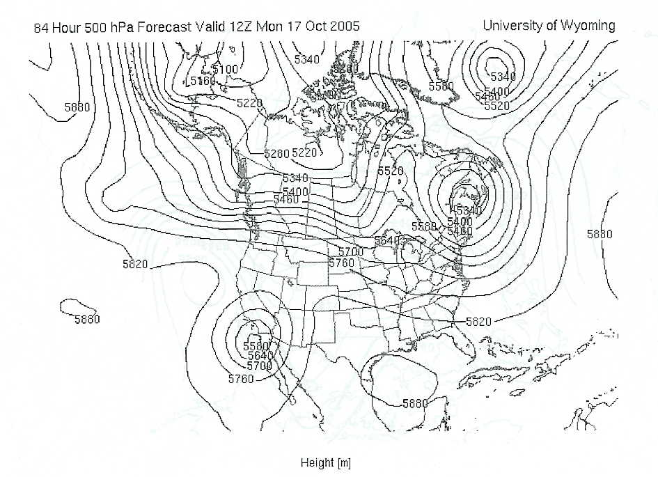

# Vorticity/Shortwaves/Upper-Level Lows — (sample 500 mb map containing a cutoff low).

> Source: <http://www.weather.gov/source/zhu/ZHU_Training_Page/Miscellaneous/vorticity/cutoff.jpg>  
> Section: Miscellaneous  
> Captured: 2026-08-19 06:00 UTC  
> PDF: [cutoff.pdf](cutoff.pdf) · 945×685px

---

