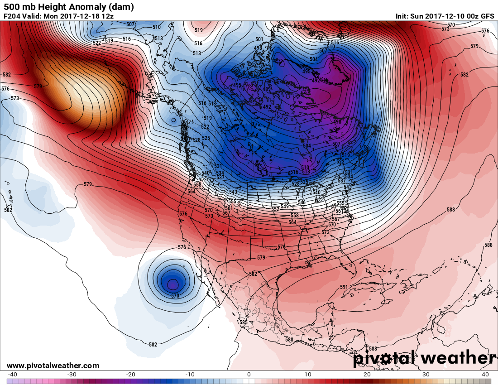

# Vorticity/Shortwaves/Upper-Level Lows — (500 mb height anomlay map with cuttoff low).

> Source: <http://www.weather.gov/source/zhu/ZHU_Training_Page/Miscellaneous/vorticity/Example_zonalflow.png>  
> Section: Miscellaneous  
> Captured: 2026-08-19 06:00 UTC  
> PDF: [example-zonalflow.pdf](example-zonalflow.pdf) · 1100×850px

---

