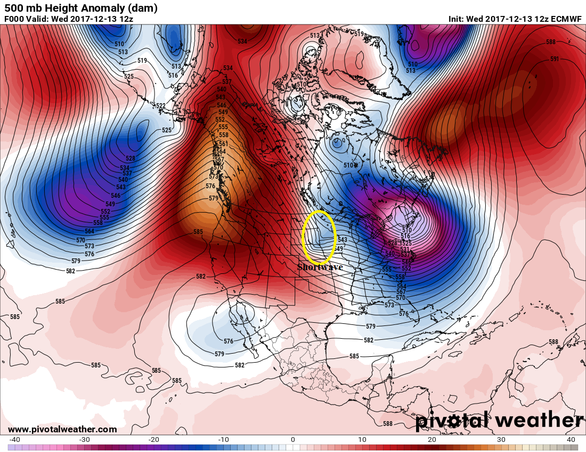

# Vorticity/Shortwaves/Upper-Level Lows — 500 mb height anomaly map with a marked shortwave

> Source: <http://www.weather.gov/source/zhu/ZHU_Training_Page/Miscellaneous/vorticity/Shortwave_example.png>  
> Section: Miscellaneous  
> Captured: 2026-08-19 06:00 UTC  
> PDF: [shortwave-example.pdf](shortwave-example.pdf) · 1100×850px

---

