# Vorticity/Shortwaves/Upper-Level Lows

> Source: <http://www.weather.gov/source/zhu/ZHU_Training_Page/Miscellaneous/vorticity/vorticity.html>  
> Section: Miscellaneous  
> Captured: 2026-08-19 06:00 UTC  
> PDF: [vorticity-shortwaves-upper-level-lows.pdf](vorticity-shortwaves-upper-level-lows.pdf) · Original HTML: [source/original.html](source/original.html)

---

body {background-color:#F2F2F2; }
a:link { color:blue; }
a:visited { color:blue; }
a:hover { color:blue; }
a:active { color:blue; }

**Select a tutorial below or scroll down...**- **[Vorticity Basics](#VORT1)**
- **[Relationship Between Vorticity and Divergence](#VORT7)**
- **[What is DPVA?](#VORT2)**
- **[Vorticity Misconceptions](#VORT6)**
- **[Pressure Troughs and Shortwaves](#VORT3)**
- **[What is a Shortwave Trough?](#VORT4)**
- **[What is a Negatively Tilted Trough?](#VORT5)**
- **[What is a Closed Low/Cutoff Low?](#VORT8)**

# Vorticity Basics

**METEOROLOGIST JEFF HABY**
[theweatherprediction.com](https://theweatherprediction.com/)

Synoptic scale vorticity is analyzed and plotted on the 500-mb chart. Vorticity is a clockwise or counterclockwise spin in the troposphere.
500-mb vorticity is also termed vertical vorticity (the spin is in relation to a vertical axis). This vorticity is caused by troughs and
ridges and other embedded waves or height centers (speed and directional wind changes in relation to a vertical axis). A wind flow
through a vorticity gradient will produce regions of PVA (Positive Vorticity Advection) and NVA (Negative Vorticity Advection). PVA
contributes to rising air.

Vorticity caused by a change in wind direction or wind speed with height is termed horizontal vorticity (the spin is in relation to a
horizontal axis). Horizontal vorticity is most important in the PBL (low-levels of atmosphere). i.e. If the wind at the surface is
southeast at 30 knots and the wind speed at 700 mb is west at 60 knots, there will be a large amount of speed and directional (veering)
shear with height and therefore a large amount of horizontal vorticity.

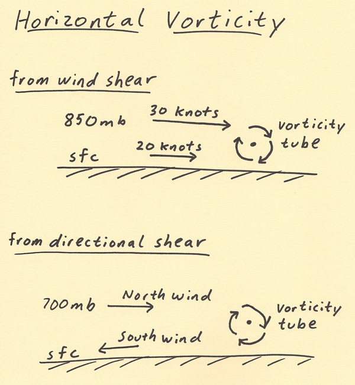

**Streamwise vorticity** is the amount of horizontal vorticity that is parallel to storm inflow. Storm inflow is the velocity of the low-
evel wind moving toward a thunderstorm. Helicity is the amount of streamwise vorticity that is available to be ingested by a
thunderstorm. Helicity is a great chart to use to assess horizontal vorticity and the threat for rotating thunderstorms.

In summary, **vertical positive vorticity contributes to upper level divergence in the PVA region and thus rising air while horizontal
vorticity is important to severe weather** (large values of horizontal vorticity lead to large values of Helicity, which increases the
likelihood of tornadoes in association with supercell thunderstorms). Both vorticity types are a clockwise or counterclockwise rotation, but
one is in relation to a vertical axis and the other a horizontal axis.

For operational purposes, **vorticity can be thought of simply as a COUNTER-CLOCKWISE or CLOCKWISE spin.** You already know that low pressure
is associated with rising air and high pressure with sinking air. Similarly, a counterclockwise spin produces POSITIVE
VORTICITY while a clockwise spin in the Northern Hemisphere produces NEGATIVE VORTICITY. The three elements that produce
vorticity are **SHEAR**, **CURVATURE**, and **CORIOLIS**. Let's define each of these terms as they apply to 500 mb vorticity.

**SHEAR**- A change in wind speed over some horizontal distance. Determined at 500 millibars by examining the spacing (and rate
of spacing change) of height contours.

**CURVATURE**- A change in wind direction over some horizontal distance. This change will result in either a counter-clockwise
or clockwise curvature.

**CORIOLIS (aka EARTH)**- It is the spinning motion created by the Earth's rotation. If you stood on the North Pole, your body
would make a complete rotation in 24 hours. If you stood on the equator, your body would not spin (but rather would face
straight ahead as the earth turns). Therefore, coriolis is a maximum and increases toward the poles and is a minimum and
decreases toward the equator. Coriolis vorticity (also called earth vorticity) is zero at the equator, increases when wind
flow is toward the pole and decreases when wind flow is toward the equator.

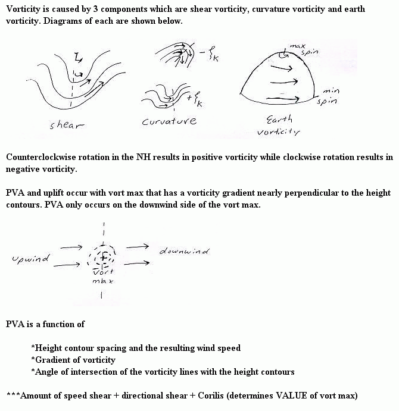

**Absolute vorticity = shear + curvature + f (coriolis)**
The magnitude and sign of each of these three terms determines the amount of absolute vorticity

Now we need to know how these terms create positive or negative vorticity. This is given below.

**POSITIVE / INCREASING VORTICITY**
\*Wind speed increasing when moving away from center point of trough. (positive shear vorticity)
\*A counterclockwise curvature in the wind flow. This occurs in troughs and shortwaves. (positive curvature vorticity)
\*A south to north movement of air. Coriolis increases (becomes more positive) when moving from the equator toward the poles.
(increasingly positive earth vorticity)

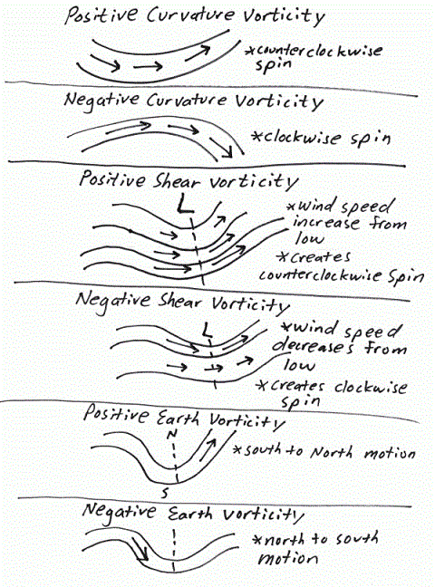

**NEGATIVE / DECREASING VORTICITY**
\*Wind speed decreasing when moving away from center point of trough. (negative shear vorticity)
\*A clockwise curvature in the wind flow. This occurs in ridges. (negative curvature vorticity)
\*A north to south movement of air. Coriolis decreases (becomes less positive) when moving from the pole to the equator.
(decreasingly positive earth vorticity)

There are 6 processes that can create vorticity, four are positive (earth vorticity is always positive in magnitude
(except zero at the equator) but can increase or decrease depending on if the air flow is toward or away from the equator)
and two are negative. It reasons that the more terms that are positive, the higher the value of absolute vorticity will be.
The highest values of vorticity are found often just to the south or east of a highly amplified trough. To the right of the
trough, winds will be from a southerly direction. This makes the coriolis term increasingly positive. Winds are generally
light near the center of a trough with increasing winds away from the base of the trough. This makes the shear term positive.
If the trough is highly amplified, this will give a positive curvature vorticity term. To clarify things further, lets look
at a paper and pen representation of the 6 contributions to vorticity and these 6 contributions on a 500 mb chart. The term
"negative earth vorticity" can be described as positive earth vorticity decreasing with time. The term "positive earth
vorticity" can be described as positive earth vorticity increasing with time. Earth vorticity is always positive (with
the only exception of being zero at the equator); earth vorticity ranges from zero at the equator to a value equal to
the earth's angular momentum at the pole.

The image that follows shows the likely position of vorticity maximums. Again, vorticity maximums will be located in areas
where the most vorticity terms are positive and largely positive in magnitude. When looking at a vorticity plot or a 500
millibar chart you should now know the processes in the atmosphere that are causing the vorticity (shear, curvature,
coriolis vorticity (aka earth vorticity).

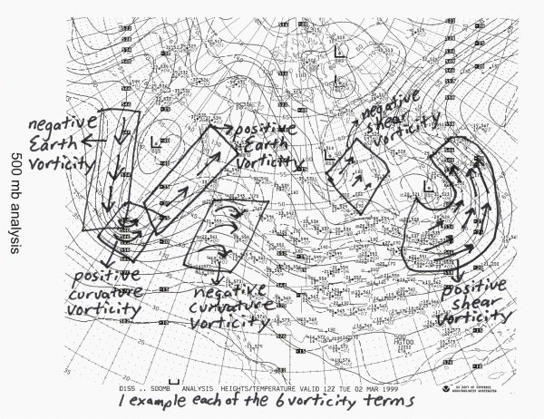

The strength of the wind is also very important. All else being equal, stronger winds will produce stronger vorticity in the
base of a trough.

**RELATION BETWEEN VORTICITY, DIVERGENCE AND VERTICAL MOTION**

The first term of the vorticity equation states that the change in vorticity of an air parcel (following the motion) is proportional to minus
the divergence. On the synoptic scale this term is far the most important effect. From the discussion of divergence, it follows that a fluid
parcel which horizontally converges, stretches vertically. From the vorticity equation it follows, that the rotation of the parcel changes too and
becomes more cyclonic. Conversely, a parcel that horizontally diverges, not only shrinks, but gets more anticyclonic vorticity. This is
illustrated in the figure below.

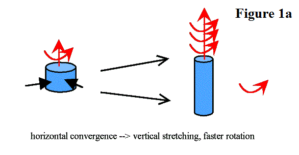

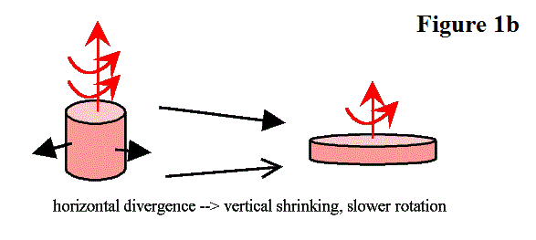

In **Figure 1a** the effect of horizontal convergence is shown. The parcel stretches and the vorticity becomes more cyclonic. In    **Figure 1b** the
opposite effect, horizontal divergence, is shown and the negative vorticity increases.

The relation between change in vorticity and divergence is very important, because in the moving air, parcels are deformed continuously,
undergoing (horizontal) divergence or convergence. The vorticity and its changes are used to calculate divergence and, through continuity, the
vertical motions, which are most important for the weather.

High vorticity is an indication of ageostrophic flow and upper level divergence. *That is to say that middle
level ascending motion has (horizontal) convergence below it and divergence above it, while descending motion in middle levels has divergence below it and convergence
above it (see image below).*

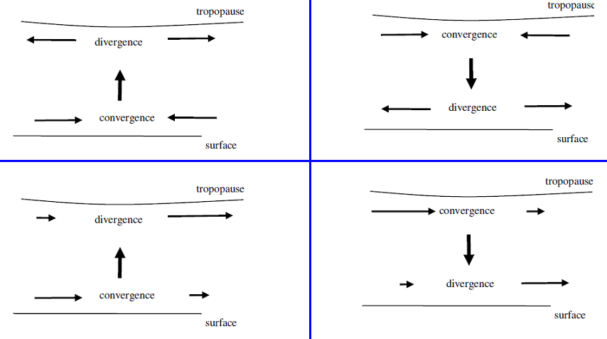

**If we assume, as is usually done, that the level of nondivergence is close to the 500 mb surface, then the vorticity advection determines the motion
of the associated trough or ridge. But this doesn’t tell us anything about the sign of the vertical motion. Therefore, positive vorticity advection
can be associated just as well with upward as downward vertical motion. It is only when we assume that the troughs and ridges have very little slope
(i.e., the vorticity gradient doesn’t change sign with height) and that the wind component perpendicular to the vorticity lines increases with height
that we can use positive vorticity advection at 500 mb as an indicator of upward vertical motion.**

**WHAT TO LOOK FOR:**

The 500 millibars chart is the best for examining the overall trough/ ridge pattern. Underneath troughs, temperatures are
cooler than normal while under ridges warmer than normal.

**(1)** This is the best chart to assess the magnitude of vorticity. Vorticity can be generated in three different ways. They
are:
        a. Curvature vorticity
        b. Shear vorticity
        c. Earth vorticity (Coriolis)

**(2)** This is the best chart in assessing the trough/ ridge pattern . A trough is an indication of cooler weather and
possible precipitation while a ridge is an indication of warmer weather and fair conditions. Greatest storminess is
found to right of 500 mb trough axis.
a. Zonal flow - air flow is generally west to east
b. Meridional flow - highly amplified troughs and ridges

**(3)** Use height falls and height rises to predict movement of troughs and ridges. Lows tend to develop toward regions with
the greatest height falls while large height rises indicates a ridge is building into the area.

**(4)** Temperatures at 500 mb are rarely above 0° Celsius. Temperatures can be above 0 ° Celsius at 500 mb in a
hurricane due to the warm core nature of the storm.

**(5)** Look for shortwaves within the longwave flow. The atmosphere will be unstable in association with shortwaves (baroclinic
instability, ageostrophic flow). Precipitation is most likely to right of shortwave axis. The 500 and 700 mb charts
are the best to use when locating shortwaves.

***Another very good tutorial on vorticity by John Nielson-Gammon, Texas A&M University: <http://atmo.tamu.edu/class/atmo251/book14vorticity.pdf>***

[**TOP**](vorticity-shortwaves-upper-level-lows.md#top)

# Relationship Between Vorticity and Divergence

*Courtesy of University of San Fransisco College of Geoscience*

**1. General**

The importance of understanding horizontal divergence should be well-established in your minds. The vertical motion patterns associated with synoptic scale divergence/convergence are directly connected both with development of surface pressure systems and the development of the vertical motion fields that lead to the creation of cloud/precipitation systems in association with the surface lows.

You have also learned one of the most obvious locations for synoptic scale divergence; in the regions east of upper tropospheric trough lines and west of upper tropospheric ridge lines. Unfortunately, upper tropospheric divergence/convergence patterns can also be embedded in apparently "straight" (i.e., "zonal" = along a line of latitude) flow in which no curvature (no troughs or ridges) are evident.

As you become more experienced in synoptic meteorology, you will be able to judge where even these more subtle areas are located on upper tropospheric charts. The question now is "Is there an easy way to find areas of divergence if they are not associated with prominent troughs and ridges?" The answer is "yes".

**2. Vorticity**

Consider two air parcels stationary with respect to the surface of the earth; one at the North Pole and one at our latitude.

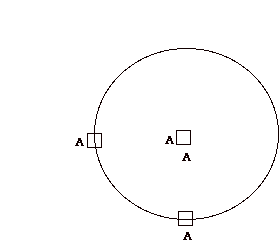

**a. Earth Vorticity**

Relative to an observer in space, both air parcels are turning about an axis through their centers. (Note that side A of each air parcel turns with respect to a point in space. Counterclockwise rotations are termed "positive (or cyclonic)" and clockwise "negative (anticyclonic)".

This rotation is due to the earth's rotation. Such an imparted spin or angular velocity is proportional to a microscopic measure of spin called vorticity . The vorticity imparted to the air parcel by the earth's surface is called the Coriolis parameter.

**b. Relative Vorticity**

Vorticity can also be imparted to air parcels because of the characteristics of the flow around them. This vorticity is called relative vorticity and is due to troughs and ridges and horizontal wind speed differences. Since air flow in troughs is cyclonic and in ridges anticyclonic, relative vorticity in troughs is positive and in ridges anticyclonic.

The mathematical expression for vorticity has the units of "rotations" per second. Since "rotations" is dimensionless (given as degrees or radians), the units for vorticity are the same as those for divergence.

**c. Absolute Vorticity**

The total, or absolute, vorticity of the air parcel is the sum of the relative vorticity imparted to the air parcel by the flow around it **(positive or negative)** and the vorticity imparted to it by the rotating surface of the earth **(which is always positive)**. It can be calculated on isobaric charts and plotted. Usually the highest values of absolute vorticity is found in troughs (and also north of jet maxima) and lowest values in ridges (also south of jet maxima).

**3. Using Vorticity Patterns to Estimate Divergence Patterns**

The question is "how does this discussion of vorticity relate to synoptic scale divergence?"

The following discussion is predicated on SCALING the atmosphere to eliminate factors that are not particularly important on the synoptic scale in very restrictive circumstances. The equation (not shown) that we are using here is called THE VORTICITY EQUATION which is a PROGNOSTIC EQUATION that answers the conceptual question “ how can we change the vorticity experienced by an air parcel?” When the jet stream is present, there is some justification to eliminate all of the terms in the equation that have anything to do with temperature changes, either produced sensibly or by advection. The resulting equation is called the BAROTROPIC or SIMPLIFIED vorticity equation.

Eliminating the terms, as you will see below, makes the equation conceptually accessible. Unfortunately, it also makes it very inaccurate in situations, for example, of strong temperature advection (or synoptic scale diabatic heating/cooling as occurs in the summer over the continent/ocean.). The elimination of these terms has resulted incorrect use of this simplified equation in operational meteorology. For those of you who have taken classes from me before, you know that the classic misuse involves forecasters ONLY looking at vorticity patterns to assess divergence patterns aloft and vertical motion patterns in the mid-troposphere.

For the sake of the discussion, though, we make these assumptions in the discussion below. We will add back the “complicating” factors in the future.

**Discussion Question #1:**
*How do ballet dancers change their rate of spin (change their vorticity)?*

This is simply an application of the principle of Conservation of Absolute Angular Momentum. The fact of the matter is that the dominant way in which the absolute vorticity of air parcels change AT THE SYNOPTIC SCALE (under the restrictive circumstances outlined above---no temperature advection, for example) is by divergence (or convergence).

**Air parcels streaming along and experiencing divergence will experience a DECREASE in absolute vorticity.** On a weather map they will appear to be moving, therefore, from high values of vorticity to lower values of vorticity!

Such areas are termed areas of Positive Vorticity Advection (PVA) (and, conversely, air flowing from lower values of vorticity to high values of vorticity are termed areas of Negative Vorticity Advection (NVA).) Using this rationale, **PVA "diagnoses" divergence and NVA convergence in the upper troposphere.**

In the example below, note the arrow is moving from regions of high vorticity to regions of low vorticity. This implies that the air parcel moving along “advecting” its vorticity experiences a decrease in vorticity. Why? Using the assumptions above, if the vorticity values shown on the chart below indicates the vorticity values of the moving air parcels, as air moves into the region of divergence east of trough axes, it MUST experience a decrease in vorticity because of divergence (remember, the ballet dancer).

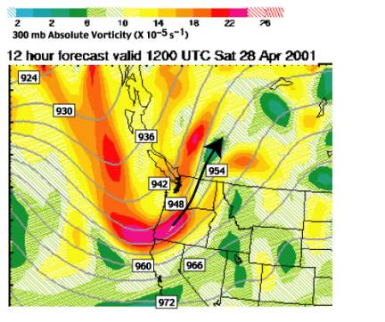

Thus, since horizontal divergence characterizes the region east of trough axis to the downstream ridge axis in the upper troposphere (with the greatest value usually at the inflection point), then the region from the trough axis to the ridge axis is characterized by PVA with the greatest PVA at the inflection point.

It turns out that vorticity is far easier to compute accurately than divergence. In fact, it can be obtained from the geometry (shape) of the flow patterns. Hence, it is easy to construct maps of absolute vorticity and then to infer the divergence patterns VISUALLY. Normally, analysts encircle pva areas with green shading and nva areas with brown shading. The green shading will isolate areas of probable divergence etc.

Use can see the vorticity pattern is pretty complicated. But does the rule of thumb that divergence (“diagnosed” by positive vorticity advection) characterizes the region east of upper tropospheric troughs and convergence (negative vorticity advection) west of upper tropospheric troughs generally explain what we see in the real world? Take a look at the above example, except with light green overlay on top of the positive vorticity advection areas and light brown overlay on top of the negative vorticity advection areas.

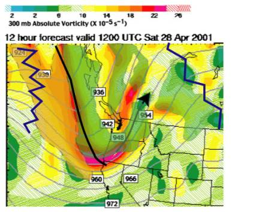

Note that the region between the trough and the downstream ridge axis MOSTLY has positive vorticity advection and the region west of the trough axis to the UPSTREAM ridge axis MOSTLY has negative vorticity advection. Thus, you as meteorologists are “given permission” to assume (rule of thumb) that divergence occurs on the east side of troughs and convergence on the west side, even though, in nature, the pattern is more complex.

All the patterns above about the 850 mb level “mimic” each other (meaning, all the troughs and ridges are basically in the same position (not exactly true…since the troughs tilt a bit towards colder air…future discussion topic). See the 500 mb chart and the 300 mb chart below for an example of the GENERAL correspondence in the geometry.

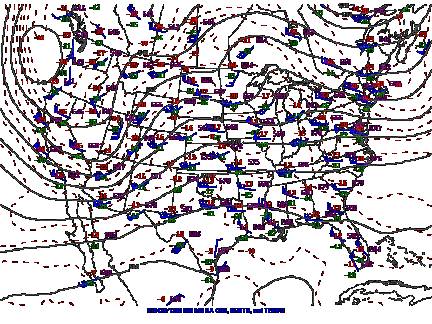
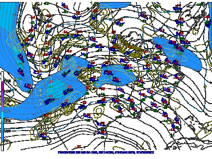

Also, the vorticity patterns are related to the geometry of the flow. Hence, patterns of vorticity at 500 mb “mimic” (are very similar to) the vorticity patterns in the upper troposphere (say, at 300 mb). Thus even though the 500 mb level is very near the Level of Non-divergence, the pva and nva patterns there help us INFER something about the divergence patterns in the upper troposphere.

Now try to synthesize the three-dimensional characteristics of the synoptic scale atmosphere that we have been trying to build up by integrating in your minds the combination of Mass Continuity (Dine’s Compensation) with the ideas expressed here about vorticity advection patterns.

**Discussion Question #2:**
*Positive vorticity advection is ONE WAY in which diagnose upper tropospheric divergence. The 500 mb level is near the level of non-divergence. Hence, pva cannot be associated with divergence at that level. However, some very important component or feature of flow at 500 mb IS associated with PVA at that level.*

[**TOP**](vorticity-shortwaves-upper-level-lows.md#top)

# Vorticity Misconceptions

**METEOROLOGIST JEFF HABY**
[theweatherprediction.com](https://theweatherprediction.com/)

**Misconception #1:** **Small values of vorticity indicate strong negative
vorticity advection.**

**Explanation:** Small values of vorticity indicate the atmosphere is dynamically stable. The upper levels of the atmosphere are generally
stable with geostrophic flow. Strong negative and thus strong sinking motion is associated with a vorticity maximum that is advecting away from
a fixed point. The strongest sinking motion and negative vorticity advection is associated with the upstream portion of a vorticity maximum.

---

**Misconception #2:** **Rising air occurs both behind and in front of an
advecting vorticity maximum.**

**Explanation:** Rising air occurs in the region of the vorticity maximum where the vorticity maximum is approaching a fixed point (downwind flow
through vort max). Once the vorticity maximum moves overhead then downstream, negative vorticity advection (conducive to sinking motion)
occurs. Over the US, in general, rising motion is to the east (right) of the vorticity maximum.

---

**Misconception #3:** **Vorticity maximums are always associated with rising air
from the surface.**

**Explanation:** This is not always the case. Other factors influence the strength of rising air. Three of these are the low-level convergence,
thermodynamic buoyancy and the amount of thermal advection (cold air or warm air advection). Positive vorticity advection (conducive to rising
air) may be outweighed by low level cold air advection, weak surface convergence and negative buoyancy (all conducive to sinking air).

---

**Misconception #4:** **The higher the value of vorticity, the faster the air will rise on the synoptic scale.**

**Explanation:** Not true for the same reasons given in misconception #3. High values of vorticity may be offset by cold air advection, weak buoyancy
and a lack of low level convergence. If the low levels of the atmosphere are stable and strong positive vorticity advection overrides this stable
layer, precipitation will occur as "elevated precipitation". Keep in mind that strong vorticity overriding strong thermodynamics (positive
buoyancy, low level convergence and warm air advection) will lead to huge values of upward vertical velocity and an extremely unstable atmosphere.
Also keep in mind that precipitation might not occur with a strong vorticity maximum. If moisture is lacking and the thermodynamics are
stable, even strong vorticity advection may not produce precipitation.

To produce PVA, there must be a wind flow through the vort max. No matter how large the vort max is, no wind flow through the vort max will result
in no PVA uplift.

---

**Misconception #5:** **A low value of vorticity indicates no chance for rain.**

**Explanation:** Don't fall into this trap. Strong thunderstorms and rain can occur without the aid of positive vorticity advection. This is especially
true in the summer in the SE US. Plenty of low level moisture and positive buoyancy can lead to thunderstorms without the aid of vorticity.
Low level WAA often produces a net uplift even when the vorticity advection is neutral or negative aloft.

---

**Misconception #6:** **Divergence is the same thing as vorticity.**

**Explanation:** Mathematically they are different quantities although they are related to each other. Advection of a parcel experiencing decreasing
values of vorticity are associated with divergence. Increasing values of vorticity are associated with negative vorticity. Since air parcels move
through the vorticity field at 500 millibars, divergence is generally found to the right and convergence found to the left of an advecting
vorticity maximum over the United States. Divergence is a proxy for vorticity since they are mathematically related.

---

**Misconception #7:** **Vorticity and vorticity advection only occurs at 500 millibars.**

**Explanation:** Vorticity occurs in all levels of the atmosphere. It just happens that 500 millibars is the best atmospheric level to accurately
represent vorticity advection. 500 millibars is near the level of non-divergence.

---

**Misconception #8:** **What is the difference between relative and absolute vorticity?**

**Explanation:** Relative vorticity considers shear and curvature vorticity while absolute vorticity considers shear, curvature AND earth vorticity.

[**TOP**](vorticity-shortwaves-upper-level-lows.md#top)

# What is DPVA?

**METEOROLOGIST JEFF HABY**
[theweatherprediction.com](https://theweatherprediction.com/)

**DPVA** stands for **D**ifferential **P**ositive **V**orticity **A**dvection. One way to understand what this is can be done by breaking down and defining each of
the four terms that make up DPVA. The word positive is in reference to "higher values". Higher values of VA are moving toward the forecast
region. Differential refers to "a change in the vertical". VA is changing from the low levels of the troposphere to the upper levels of the
troposphere. **RULE OF THUMB: vorticity will generally increase from the surface to 500 millibars. Vorticity advection is usually higher at 500
millibars than in the low levels of the troposphere because the wind speeds tend to increase with height (500 millibar winds near a trough will
often be stronger than low-level winds)**. Because of this general rule, the "D" is often left out. Then what is left is PVA (positive vorticity
advection). Vorticity is any twisting motion in the troposphere.

Positive vorticity can be broken down into three components, which are positive shear vorticity, positive curvature vorticity and earth
vorticity. A counterclockwise spin in the Northern Hemisphere will produce positive vorticity. Since the earth spins counterclockwise, earth
vorticity is always positive. Motion within a trough produces positive curvature vorticity (because air is rotating counterclockwise within a
trough). Wind speed increasing away from a point source will produce positive shear vorticity. Positive shear vorticity is also common in a
trough since the highest winds are often located away from the center of the trough.

Vorticity maximums are located in regions where there is high positive shear vorticity co-located with positive curvature vorticity. Again, this
is most common just to the south of the center of a trough. The speed of the winds and the amplification of the trough will determine the positive
vorticity it will generate. The last term "A" means the DPV is moving from one place to another over time. Wind speed and the orientation of
the lines of constant vorticity to the height contours determines the rate at which vorticity advection will take place.

Putting this all together, **DPVA means: positive vorticity increasing from the surface to the upper levels is being advected. DPVA causes the
troposphere to become more dynamically unstable. DPVA occurs in shortwaves and within just about any trough. DPVA contributes to rising air. The
spin up of vorticity causes the troposphere to cool since rising air cools. This cooling will lower heights aloft. Cooling the middle and upper
levels of the troposphere causes the troposphere to become more unstable. DPVA is associated with upper level divergence and rising air. DPVA along
with low level warm air advection is a favorable environment for precipitation and storms.**

Click [here](../simplified-omega-equation-thermal-vorticity-advection/simplified-omega-equation-thermal-vorticity-advection.md#OMEGA2) for for additional information on DPVA.[**TOP**](vorticity-shortwaves-upper-level-lows.md#top)

# Pressure Troughs and Shortwaves

**METEOROLOGIST JEFF HABY**
[theweatherprediction.com](https://theweatherprediction.com/)

When analyzing a surface chart you will notice the isobars bend in the vicinity of the warm front and the cold front. The isobars do not make
perfect circles around low-pressure centers because of the pressure troughs created by the fronts. **Pressure can decrease in the atmosphere
by:**
(1) causing the air to rise
(2) decreasing the density of the air
(3) decreasing the mass of the air (i.e. upper level divergence).

Causing the air to rise counteracts some the downward force created by gravity. This lowers pressure just as if someone started pushing up on
you when standing on a scale; your weight would decrease. Fronts force the air to rise. This causes the surface pressure to decrease in the
vicinity of the front. Cold fronts have a more defined pressure trough than warm fronts because the average cold front has a steeper slope and
stronger temperature gradient than the average warm front. A warm front raises the air gradually while a cold front lifts the air more quickly
in the vertical. The faster the air rises, the more pressure will lower. A mid-latitude cyclone and a front will both cause the air to
rise and pressure to lower. The stronger the front, the more well defined the pressure trough will be.

Now to shortwaves. **A shortwave is an upper level front or a cool pocket aloft.** Just as a surface front causes the air to rise, upper level
fronts can do the same. **First, let's start with a general description of a shortwave:**

**(1)** It is smaller than a longwave trough (shortwave ranges from 1 degree to about 30 degrees in longitude (the average one is about the
size of two U.S. states put together (Iowa and Missouri put together is a good example).

**(2)** Isotherms cross the height contours (if it is a baroclinic shortwave). This creates an upper level temperature gradient and
therefore an upper level front.

**(3)** They are best examined on the 700 and 500 millibar charts.

**(4)** They generate positive vorticity (mainly due to counterclockwise curvature within the shortwave). This creates positive curvature and
positive shear vorticity. If PVA occurs with the shortwave then the shortwave will deepen and strengthen due to lift created by upper
level divergence.

**(5)** They can create an environment conducive to surface based convection or elevated convection due to the cooling aloft.

It is important to see how much moisture is associated with the shortwave. A shortwave moving over a warm and moist lower troposphere
has a better chance of producing precipitation and strengthening than one moving over a dry lower troposphere. If the low level
dewpoint depressions are low, the instability and lift associated with the shortwave can enhance cloudiness and precipitation. In
summary, a pressure trough is associated with a low-level front while a shortwave is associated with an upper level front or a cool
pocket aloft. Both are associated with rising air and can add instability to the atmosphere.

[**TOP**](vorticity-shortwaves-upper-level-lows.md#top)

# What is a Shortwave Trough?

**METEOROLOGIST JEFF HABY**
[theweatherprediction.com](https://theweatherprediction.com/)

A shortwave trough can be defined in several ways. **The following are characteristics that most shortwave troughs possess:**
(1) Shortwaves are smaller than longwave troughs
(2) Shortwaves have a counterclockwise kink to the height contours
(3) They are associated with an upper level front or a cold pool aloft
(4) Shortwaves generate positive curvature vorticity and some positive shear vorticity
(5) Shortwaves often represent baroclinicity in the troposphere (WAA and CAA)
(6) Shortwaves are imbedded within the longwave trough / ridge pattern
(7) Shortwaves are best located on the 700 and 500 mb chart / prog
(8) Rising motion occurs within the exit sector of a shortwave
(9) Their size and influence ranges from the mesoscale to the synoptic scale
(10) Shortwaves move faster than longwaves (usually more than twice as
fast).

The following image shows one shortwave over Arizona and another over Iowa. The higher upward vertical velocities tend to be to the
right (exit sector) of the shortwave axis due to this region having the best combination of WAA and PVA.

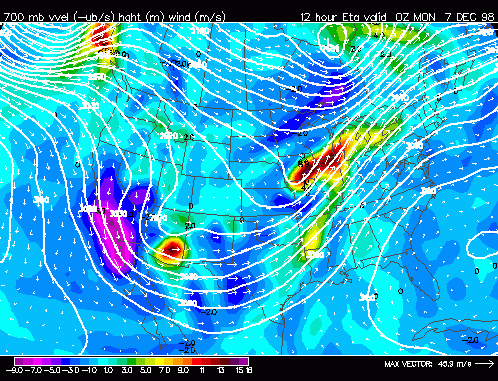

---

*Courtesy of Arizona State University - Atmos 336*

The atmosphere contains waves over a large range of sizes from the planetary-scale longwaves
described above to minute sound waves that have no impact on weather. However,
there are often smaller wiggles or waves that are superimposed on the longwave pattern
that do have a significant impact on weather.
These are called **shortwaves(*see figure below*)**. There are shortwave troughs and shortwave ridges. These
indicate smaller regions of warm/cold temperature contrasts and forced rising or sinking
vertical air motions. Because they are much smaller than longwaves, shortwave troughs
often have a much sharper curvature than longwaves and hence stronger divergence and
forced rising motion. Thus, shortwaves can indicate the position of a strong weather
system especially if it is sharply curved.
Shortwaves typically flow through the longwave pattern following
the longwave wind direction but at a slower speed. (As a rule of thumb, shortwaves
move along at about one-half the speed of the 500 mb winds).
Shortwaves tend to strengthen as they
move into the region just downstream of a longwave trough and weaken as they move into the
region just downstream of a longwave ridge.

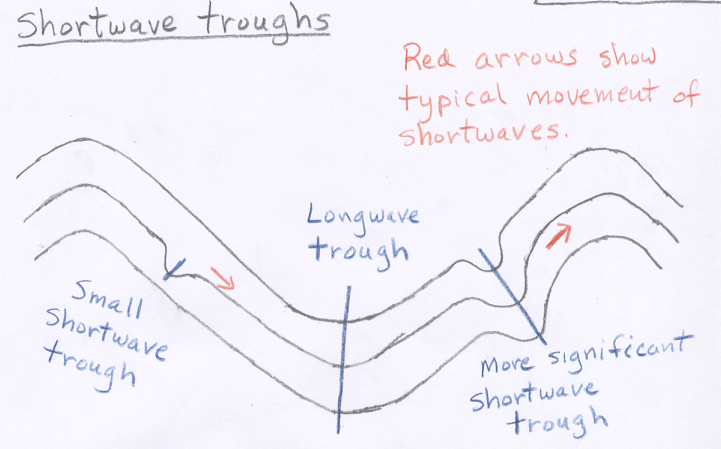

If you compare 500 mb maps with where precipitation is falling, you will see
that it generally is not raining (or snowing) everywhere downwind of troughs. Often
the precipitation gets concentrated near a shortwave trough, then moves along with the
shortwave. You may also notice small areas of precipitation just downwind of longwave
ridges (where you didn't expect to see it). This again can be associated with a shortwave
trough. Weather forecasters sometimes refer to shortwave troughs as "pieces of energy" or
"little disturbances in the flow". This terminology arises
from the fact that shortwave troughs force small areas of horizontal divergence and forced
rising motion and often bring periods of precipitation. It is common for a region downwind of a
longwave trough to have occasional periods of precipitation as shortwaves ripple though the longwave
pattern, rather than continuous precipitation.

Shortwaves come in a wide range of sizes and shapes. If a shortwave is large enough,
you can easily locate it on a 500 mb height map by looking for wiggles (wavelike features) in the
height pattern that are smaller than the longwaves. Here is a
[500 mb height anomaly map with a marked shortwave](subpages/shortwave-example/shortwave-example.md).
On that map the shortwave over the center of the United States is between a longwave ridge
to the west and a longwave trough to the east.
Some shortwaves are so small that they are difficult to see on 500 mb height maps, though their
influence can be seen when they cause small areas of clouds or rain.

[**TOP**](vorticity-shortwaves-upper-level-lows.md#top)

# What is a Negatively Tilted Trough?

**METEOROLOGIST JEFF HABY**
[theweatherprediction.com](https://theweatherprediction.com/)

In forecast discussions you will come across the terms positive, neutrally and negatively tilted trough. When a trough is positive or
neutrally tilted it is usually not referenced at such. However, when it becomes negatively tilted it will be referenced as such. The tilt of
a trough is the angle the trough axis makes with lines of longitude. A negatively tilted trough tilts horizontally (parallel to surface)
from the northwest to the southeast.

**What is the big deal about having a negative tilt?**
(1) indicates a low pressure has reached maturity,
(2) indicates strong differential advection (middle and upper level cool air advecting over low level warm air advection). This
increases thermodynamic instability.
(3) Indicates good vertical wind shear.

A deep low pressure, a negatively tilted trough, and a warm and moist warm sector combination east of the Rockies often produces a severe
weather outbreak.

**What causes the negative tilt?**
(1) Strong middle and upper level winds wrapping around the base of the trough,
(2) A strong jet streak near the base of a trough
(3) A ridge to the east of the trough (like a sideways inverted trough)
(4) Occlusion of low pressure.

The image below is that of a negatively tilted trough located across the Southeast U.S. Notice the trough tilts from the
NW to the SE and wind speeds are highest within the negative tilt.

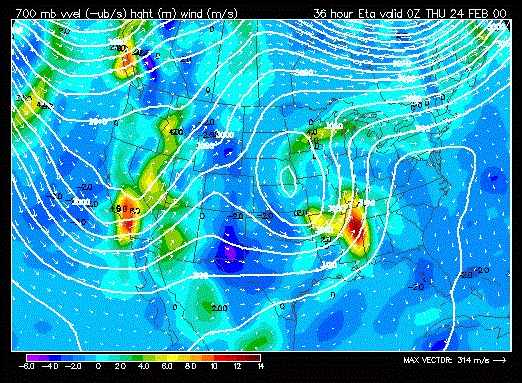

[**TOP**](vorticity-shortwaves-upper-level-lows.md#top)

# What is a Closed Low/Cutoff Low?

*Courtesy of University of Arizona Atmosphere 336*

Although we often think of the 500 mb pattern as being composed of troughs and ridges,
it is fairly common to see closed
lows (and closed highs) in the 500 mb height pattern. A **closed low** on a 500 mb
map is a region surrounded by one or more circular height contours (with the lowest
heights found in the middle). The air flows in
a counterclockwise rotation around the closed low. The closed low indicates a pool of
cooler air surrounded by warmer air. Three closed lows are shown in the figure below.

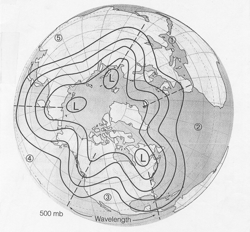

When a closed low becomes completely detached from the main westerly wind
currents at 500 mb, it is called a **cutoff low** because it is cutoff from the main
steering winds. A good example of a cutoff low centered just south of San Diego is shown on
this map from fall 2005 [(sample 500 mb map containing a cutoff low).](subpages/cutoff/cutoff.md)
Another cutoff low in the Pacific off Baja, Mexico is found on the map used above
as an example of a zonal pattern
[(500 mb height anomlay map with cuttoff low).](subpages/example-zonalflow/example-zonalflow.md)
Notice the cutoff low is not connected to the main zonal westerly wind flow that is
taking place across the northern part of the United States.
Cutoff lows may remain detached from the westerlies for days while
exhibiting very little forward (eastward) progress. In some instances, a cutoff low
may move to the west, or retrograde, opposite to the prevailing flow. It is
sometimes difficult for weather models to predict the movement and evolution of cutoff lows. Often
they move very little and over a period of several days eventually weaken and dissipate.
For reasons that I do not understand, the extreme southwestern United States including
the coastal Pacific waters off southern California, is a region where closed and cutoff lows are relatively common.
These features can produce significant rain and high elevation snow in Arizona when positioned
properly, which is one reason for including this discussion.

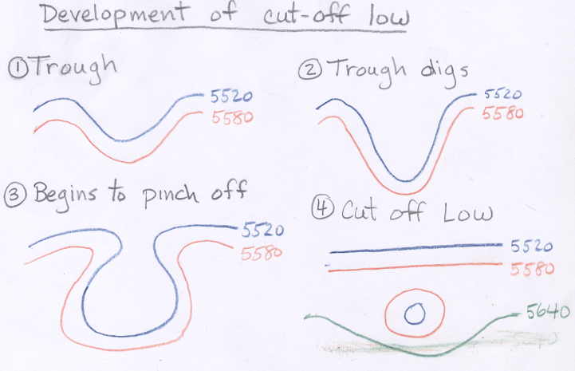

Cutoff lows often form when a 500 mb trough "pinches off" as shown in the sequence of figures above.
As the cutoff low pinches off, the clouds and precipitation
found downstream of the 500 mb trough can be wrapped around low by the counterclockwise
winds. Thus, when cutoff lows sit over a given region, they often bring a prolonged
period of cool, cloudy weather with intervals of rain or snow as shortwave "disturbances"
rotate around the closed low.

More often, closed lows do not become cutoff. As a trough digs, it is fairly common for a closed low to pinch off
as shown above. The closed low remains associated with the trough and moves away with the trough, rather than remaining
stationary as cutoff lows often do.
Here again is the
[example of a trough digging toward the southwestern United States](http://wasatchweatherweenies.blogspot.com/2013/10/the-digging-trough.html). Notice that this trough forms a closed low
as it strengthens.

[**TOP**](vorticity-shortwaves-upper-level-lows.md#top)
