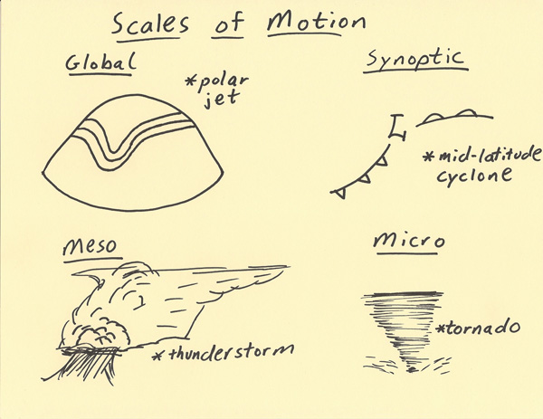

# Different Spacial Scales: Global/Planetary... Synoptic...Mesoscale...Microscale

> Source: <https://www.theweatherprediction.com/habyhints3/733/>  
> Section: Commonly Misunderstood Terms  
> Captured: 2026-08-19 06:00 UTC  
> PDF: [different-spacial-scales-global-planetary-synoptic-mesoscale-microscal.pdf](different-spacial-scales-global-planetary-synoptic-mesoscale-microscal.pdf) · Original HTML: [source/original.html](source/original.html)

---

**

[--**[MAIN HOME](http://www.theweatherprediction.com/)**--]
[--**[ALL HABYHINTS](../../19-weather-handbooks-and-important-links/www-theweatherprediction-com-haby-s-weather-prediction-hints/www-theweatherprediction-com-haby-s-weather-prediction-hints.md)**--]
[--**[FACEBOOK PAGE](https://www.facebook.com/pages/theweatherpredictioncom/265852916887147)**--]

**SCALES OF MOTION**

**METEOROLOGIST JEFF HABY**

**Weather phenomena are analyzed at a variety of scales of motion. Four scales of motion that will be focused on in this writing from largest
to smallest land area are the global scale, synoptic scale, mesoscale and microscale.

The global scale includes events that impact large areas of the global and last for weeks and even months at a time. Features such as the
polar jet stream can be found just about any time somewhere. The polar jet stream is an example of a global scale phenomenon. Its influence
circles the globe and influences the polar and middle latitudes with varying extent throughout the year. Another example of a global
scale phenomenon is the position of subtropical highs. The position and strength of subtropical highs can influence
weather across the globe.

The next scale is the synoptic scale. Phenomena on the synoptic scale can span over 1000s of kilometers and last for many days. Mid-latitude
cyclones, hurricanes, and fronts are examples of synoptic weather events. A weather forecaster looks closely at the global scale
and synoptic scale when making weather forecasts beyond 1 day out.

The mesoscale is the next scale that will be discussed. These weather phenomena typically last from an hour to a day and influence 10s to
100s of kilometers of distance. Examples of mesoscale weather events include thunderstorms (especially complexes of thunderstorms
such as MCCs and squall lines), differential heating boundaries (i.e. sea breeze), and mesolows. A weather forecaster will integrate
an increasing amount of mesoscale analyses into their forecasting technique when making short term forecasts such as over
the next several hours to 1 day.

The last scale of motion that will be mentioned is the microscale. These events occur typically from minutes up to an hour and cover
small distances such as less than 10 kilometers. Examples of microscale phenomena include tornadoes, rainbows, convective updrafts,
and downdrafts. This scale is important since it is the scale most experienced with the eyes in-person. These are the weather
events that are witnessed when going outside.**

