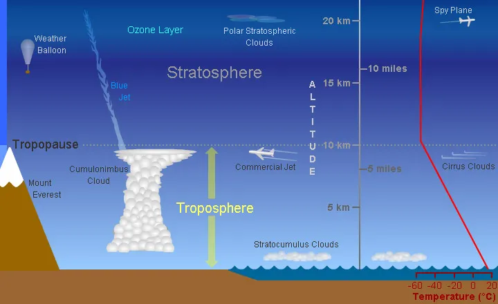

# Layers of the Atmosphere — Tutorial 2

> Source: <https://scied.ucar.edu/learning-zone/atmosphere/troposphere>  
> Section: Commonly Misunderstood Terms  
> Captured: 2026-08-19 06:00 UTC  
> PDF: [layers-of-the-atmosphere-tutorial-2.pdf](layers-of-the-atmosphere-tutorial-2.pdf) · Original HTML: [source/original.html](source/original.html)

---

[Skip to main content](#main-content)

## Main navigation

[Center for Science Education](https://scied.ucar.edu/)

[Contact Us](https://scied.ucar.edu/form/contact)

Search SciEd

- [Home](https://scied.ucar.edu/home)
- [About](https://scied.ucar.edu/about)

  - [Collaborate with Us](https://scied.ucar.edu/about/collaborate)
  - [Affiliations and Partnerships](https://scied.ucar.edu/about/affiliations-partnerships)
  - [Supporters](https://scied.ucar.edu/about/supporters)
  - [UCAR Center for Science Education Logo](https://scied.ucar.edu/logo)
- [Educators](https://scied.ucar.edu/educators)

  - [Teaching Resources](https://scied.ucar.edu/educators/teaching-resources)
  - [School Field Trips to NSF NCAR](https://scied.ucar.edu/visit/field-trips-ncar)
  - [Join Us Virtually](https://scied.ucar.edu/visit/virtual)
  - [Teacher Professional Development](https://scied.ucar.edu/educators/teacher-professional-development)
- [Explore](https://scied.ucar.edu/explore)

  - [Learning Zone](https://scied.ucar.edu/learning-zone)
  - [SkySci for Kids](https://scied.ucar.edu/kids)
  - [Explore Virtually](https://scied.ucar.edu/explore/virtual)
  - [Careers in STEM](https://scied.ucar.edu/explore/careers)
  - [STEM at Home](https://scied.ucar.edu/stem-at-home)
- [Visit](https://scied.ucar.edu/visit)

  - [Visit NSF NCAR](https://scied.ucar.edu/visit/ncar)
  - [Join Us Virtually](https://scied.ucar.edu/visit/virtual)
  - [Exhibits](https://scied.ucar.edu/exhibits/about)
  - [Visitor Accessibility](https://scied.ucar.edu/visit/accessibility)
- [Events](https://scied.ucar.edu/events)
- [Support Our Mission](https://scied.ucar.edu/support)

Search SciEd

[Contact Us](https://scied.ucar.edu/form/contact)

### Informational Message

NSF NCAR Mesa Lab road lane closures Aug. 24-25 - Expect delays and no pedestrian or bicycle access. [View more information.](https://www.ucar.edu/alerts)

[Close](https://scied.ucar.edu/)

## Breadcrumb

1. [Home](https://scied.ucar.edu/)
2. [Explore](https://scied.ucar.edu/explore)
3. [Learning Zone](https://scied.ucar.edu/learning-zone)
4. [Layers of the Atmosphere](https://scied.ucar.edu/learning-zone/atmosphere)
5. [Layers of Earth's Atmosphere](https://scied.ucar.edu/learning-zone/atmosphere/layers-earths-atmosphere)
6. The Troposphere

# The Troposphere

The troposphere is the lowest [layer of Earth's atmosphere](https://scied.ucar.edu/learning-zone/atmosphere/layers-earths-atmosphere). Most of the mass (about 75-80%) of the atmosphere is in the troposphere. Most types of clouds are found in the troposphere, and almost all [weather](https://scied.ucar.edu/learning-zone/how-weather-works/weather) occurs within this layer. The troposphere is by far the wettest layer of the atmosphere (all of the other layers contain very little moisture).

This diagram shows some of the features of the troposphere.

*UCAR/Randy Russell*

The bottom of the troposphere is at Earth's surface. The troposphere extends upward to about 10 km (6.2 miles or about 33,000 feet) above sea level. The height of the top of the troposphere varies with latitude (it is lowest over the poles and highest at the equator) and by season (it is lower in winter and higher in summer). It can be as high as 20 km (12 miles or 65,000 feet) near the equator, and as low as 7 km (4 miles or 23,000 feet) over the poles in winter.

Air is warmest at the bottom of the troposphere near ground level. Air gets colder as one rises through the troposphere. That's why the peaks of tall mountains can be snow-covered even in the summertime.

Air pressure and the density of the air also decrease as altitude increases. Jet aircraft often fly just above the tropopause, which is the boundary between the troposphere and the more stable [stratosphere](https://scied.ucar.edu/learning-zone/atmosphere/stratosphere). Because of the decrease in air pressure with height, the cabins of these high-flying jet aircraft are pressurized.

## [Layers of Earth's Atmosphere](https://scied.ucar.edu/learning-zone/atmosphere/layers-earths-atmosphere)

- The Troposphere
- [The Stratosphere](https://scied.ucar.edu/learning-zone/atmosphere/stratosphere)
- [The Mesosphere](https://scied.ucar.edu/learning-zone/atmosphere/mesosphere)
- [The Thermosphere](https://scied.ucar.edu/learning-zone/atmosphere/thermosphere)
- [The Exosphere](https://scied.ucar.edu/learning-zone/atmosphere/exosphere)

## Related Links

- [Layers of Earth's Atmosphere](https://scied.ucar.edu/learning-zone/atmosphere/layers-earths-atmosphere)
- [Stratosphere](https://scied.ucar.edu/learning-zone/atmosphere/stratosphere)
- [What is the Atmosphere?](https://scied.ucar.edu/learning-zone/atmosphere/what-is-atmosphere)

## Resource Links

- [Virtual Ballooning to Explore the Atmosphere](https://scied.ucar.edu/interactive/virtual-ballooning)
- [Clouds Memory Game](https://scied.ucar.edu/interactive/clouds-memory-game)
- [Atmospheric Chemistry Memory Game](https://scied.ucar.edu/interactive/molecules-memory-game)

How likely are you to recommend this page to a friend?

0

1

2

3

4

5

6

7

8

9

10

Not likely at all

Extremely likely

Leave this field blank

### NSF NCAR

- [NSF NCAR Homepage](https://ncar.ucar.edu)
- [ACOM | Atmospheric Chemistry Observations & Modeling](https://www2.acom.ucar.edu/)
- [CGD Laboratory](https://www.cgd.ucar.edu/)
- [CISL | Computational & Information Systems](https://www.cisl.ucar.edu)
- [EdEC | Education, Engagement & Early-Career Development](https://edec.ucar.edu/)
- [EOL | Earth Observing Laboratory](https://www.eol.ucar.edu/)
- [HAO | High Altitude Observatory](https://www2.hao.ucar.edu/)
- [MMM | Mesoscale & Microscale Meteorology](https://www.mmm.ucar.edu/)
- [RAL | Research Applications Laboratory](https://ral.ucar.edu/)

### UCAR

- [UCAR Homepage](https://www.ucar.edu)
- [Community Programs](https://www.ucar.edu/community-programs)
- [Education & Training](https://www.ucar.edu/what-we-offer/education-training)
- [For Staff](https://sundog.ucar.edu/)
- [Government Relations & External Engagement](https://www.ucar.edu/what-we-do/advocacy/office-government-relations)
- [Member Institutions](https://www.ucar.edu/who-we-are/membership)
- [Tech Transfer & Engagement](https://www.ucar.edu/what-we-do/tech-transfer-engagement)
- [University Collaboration](https://www.ucar.edu/what-we-do/university-collaboration)

### Subscribe to Monthly K-12 News

Sign Up

[Learn more about our monthly newsletters](https://scied.ucar.edu/newsletter)

#### Follow Us on Social Media!

© 2026 UCAR

- [Privacy](https://www.ucar.edu/privacy-notice)
- [Cookies](https://www.ucar.edu/cookie-other-tracking-technologies-notice)
- [Web Accessibility](https://www.ucar.edu/web-accessibility)
- [Terms of Use](https://www.ucar.edu/terms-of-use)
- [Copyright Issues](https://www.ucar.edu/notification-copyright-infringement-digital-millenium-copyright-act)
- [Sponsored by U.S. NSF](https://nsf.gov)
- [Report Ethics Concern](https://www.ucar.edu/who-we-are/ethics)
- [Staff Login](https://scied.ucar.edu/saml_login?destination=learning-zone/atmosphere/troposphere)

**Postal Address:**
P.O. Box 3000, Boulder, CO 80307-3000
•
**Shipping Address:**
3090 Center Green Drive, Boulder, CO 80301

This material is based upon work supported by the NSF National Center for Atmospheric Research, a major facility sponsored by the U.S. National Science Foundation and managed by the University Corporation for Atmospheric Research. Any opinions, findings and conclusions or recommendations expressed in this material do not necessarily reflect the views of the [U.S. National Science Foundation.](https://nsf.gov)
