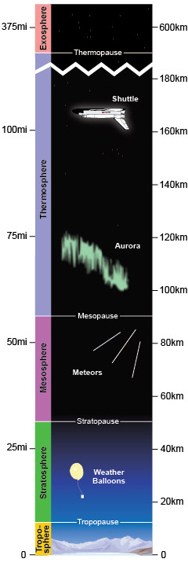
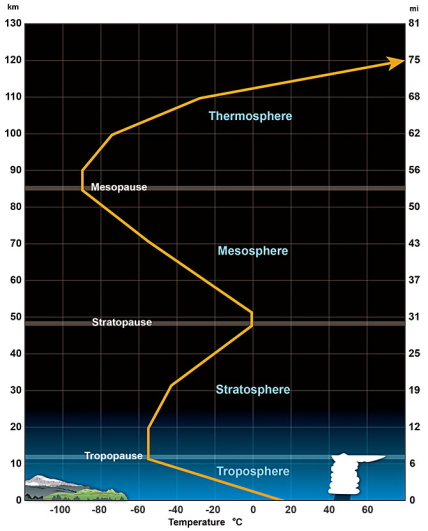

# Layers of the Atmosphere

> Source: <https://www.noaa.gov/jetstream/atmosphere/layers-of-atmosphere>  
> Section: Commonly Misunderstood Terms  
> Captured: 2026-08-19 06:00 UTC  
> PDF: [layers-of-the-atmosphere.pdf](layers-of-the-atmosphere.pdf) · Original HTML: [source/original.html](source/original.html)

---

[Skip to main content](#main)

Main Menu

- [Home](https://www.noaa.gov/)
- [Weather](https://www.noaa.gov/weather)
- [Climate](https://www.noaa.gov/climate)
- [Ocean & Coasts](https://www.noaa.gov/ocean-coasts)
- [Fisheries](https://www.noaa.gov/fisheries)
- [Satellites](https://www.noaa.gov/satellites)
- [Research](https://www.noaa.gov/research)
- [Marine & Aviation](https://www.noaa.gov/marine-aviation)
- [Charting](https://www.noaa.gov/charting)
- [Sanctuaries](https://www.noaa.gov/sanctuaries)
- [Education](https://www.noaa.gov/education)
- [News and features](https://www.noaa.gov/news-features)
- [Our data](https://www.noaa.gov/data)
- [Tools & resources](https://www.noaa.gov/tools-and-resources)
- [About our agency](https://www.noaa.gov/about-our-agency)

An official website of the United States government

Here’s how you know

Here’s how you know

**Official websites use .gov**

 A **.gov** website belongs to an official government organization in the United States.

**Secure .gov websites use HTTPS**

 A **lock** (LockA locked padlock) or **https://** means you’ve safely connected to the .gov website. Share sensitive information only on official, secure websites.

Find your local weather

Change location:

Enter City, State or ZIP code

- [News](https://www.noaa.gov/news-features)
- [Data](https://www.noaa.gov/data)
- [Tools](https://www.noaa.gov/tools-and-resources)
- [About](https://www.noaa.gov/about-our-agency)

[National Oceanic and Atmospheric Administration](https://www.noaa.gov/ "National Oceanic and Atmospheric Administration home")
[U.S. Department of Commerce](https://www.commerce.gov)

Enter Search Terms

## Breadcrumb

1. [Home](https://www.noaa.gov/)
2. [JetStream](https://www.noaa.gov/jetstream)
3. [Topic Matrix](https://www.noaa.gov/jetstream/topic-matrix)
4. [The Atmosphere](https://www.noaa.gov/jetstream/atmosphere)

- [JetStream home](https://www.noaa.gov/jetstream)
- Topic

  - [Topic](https://www.noaa.gov/jetstream/topic-matrix)
  - [The Atmosphere](https://www.noaa.gov/jetstream/atmosphere)

    - [Layers of the Atmosphere](layers-of-the-atmosphere.md)
    - [Air Pressure](https://www.noaa.gov/jetstream/atmosphere/air-pressure)
    - [The Transfer of Heat Energy](../radiation-conduction-and-convection-defined/radiation-conduction-and-convection-defined.md)
    - [Energy Balance](https://www.noaa.gov/jetstream/atmosphere/energy)
    - [Hydrologic Cycle](https://www.noaa.gov/jetstream/atmosphere/hydro)
    - [Precipitation](https://www.noaa.gov/jetstream/atmosphere/precipitation)
  - [The Ocean](https://www.noaa.gov/jetstream/ocean)

    - [Layers of the Ocean](https://www.noaa.gov/jetstream/ocean/layers-of-ocean)
    - [Sea Water](https://www.noaa.gov/jetstream/ocean/sea-water)
    - [Ocean Circulations](https://www.noaa.gov/jetstream/ocean/circulations)
    - [Waves](https://www.noaa.gov/jetstream/ocean/waves)
    - [Tides](https://www.noaa.gov/jetstream/ocean/tides)
    - [The Sea Breeze](https://www.noaa.gov/jetstream/ocean/sea-breeze)
    - [The Marine Layer](https://www.noaa.gov/jetstream/ocean/marine-layer)
    - [Rip Currents](https://www.noaa.gov/jetstream/ocean/rip-currents)

      - [Rip Current Safety](https://www.noaa.gov/jetstream/ocean/rip-currents/rip-current-safety)
  - [Global Weather](https://www.noaa.gov/jetstream/global)

    - [Global Atmospheric Circulations](https://www.noaa.gov/jetstream/global/global-atmospheric-circulations)
    - [The Jet Stream](https://www.noaa.gov/jetstream/global/jet-stream)
    - [Climate vs. Weather](https://www.noaa.gov/jetstream/global/climate-vs-weather)
    - [Climate Zones](https://www.noaa.gov/jetstream/global/climate-zones)
  - [Clouds](https://www.noaa.gov/jetstream/clouds)

    - [How clouds form](https://www.noaa.gov/jetstream/clouds/how-clouds-form)
    - [The Core Four](https://www.noaa.gov/jetstream/clouds/four-core-types-of-clouds)
    - [The Basic Ten](https://www.noaa.gov/jetstream/clouds/ten-basic-clouds)
    - [Cloud Chart](https://www.noaa.gov/jetstream/clouds/nws-cloud-chart)
    - [Color of Clouds](https://www.noaa.gov/jetstream/clouds/color-of-clouds)
  - [The Upper Air](https://www.noaa.gov/jetstream/upperair)

    - [Parcel Theory](https://www.noaa.gov/jetstream/upperair/parcel-theory)
    - [Stability-Instability](https://www.noaa.gov/jetstream/upperair/bowls)
    - [Radiosondes](https://www.noaa.gov/jetstream/upperair/radiosondes)
    - [Skew-T Log-P Diagrams](https://www.noaa.gov/jetstream/upperair/skew-t-log-p-diagrams)
    - [Skew-T Plots](https://www.noaa.gov/jetstream/upperair/skew-t-plots)
    - [Skew-T Examples](https://www.noaa.gov/jetstream/upperair/skewt_samples)
  - [Upper Air Charts](https://www.noaa.gov/jetstream/upper-air-charts)

    - [Pressure vs. Elevation](https://www.noaa.gov/jetstream/upper-air-charts/verses)
    - [Longwaves and Shortwaves](../../14-miscellaneous/longwave-patterns-long-shortwaves/longwave-patterns-long-shortwaves.md)
    - [Basic Wave Patterns](../../14-miscellaneous/longwave-patterns-basic-wave-patterns/longwave-patterns-basic-wave-patterns.md)
    - [Common Features](https://www.noaa.gov/jetstream/upper-air-charts/common-features-of-constant-pressure-charts)
    - [200 mb](https://www.noaa.gov/jetstream/upper-air-charts/constant-pressure-charts-200-mb)
    - [300 mb](https://www.noaa.gov/jetstream/upper-air-charts/constant-pressure-charts-300-mb)
    - [500 mb](https://www.noaa.gov/jetstream/upper-air-charts/constant-pressure-charts-500-mb)
    - [700 mb](https://www.noaa.gov/jetstream/upper-air-charts/constant-pressure-charts-700-mb)
    - [850 mb](https://www.noaa.gov/jetstream/upper-air-charts/constant-pressure-charts-850-mb)
    - [Thickness Charts](https://www.noaa.gov/jetstream/upper-air-charts/constant-pressure-charts-thickness)
    - [Weather Models](https://www.noaa.gov/jetstream/upper-air-charts/weather-models)
  - [Synoptic Meteorology](https://www.noaa.gov/jetstream/synoptic)

    - [Time](https://www.noaa.gov/jetstream/time)
    - [Wind](https://www.noaa.gov/jetstream/synoptic/origin-of-wind)
    - [Air Masses](https://www.noaa.gov/jetstream/synoptic/air-masses)
    - [Surface Weather Maps](https://www.noaa.gov/jetstream/wxmaps)

      - [Surface Weather Plots](https://www.noaa.gov/jetstream/wxmaps-max)
    - [Norwegian Cyclone Model](https://www.noaa.gov/jetstream/synoptic/norwegian-cyclone-model)
    - [Types of Weather Phenomena](https://www.noaa.gov/jetstream/synoptic/types-of-weather-phenomena)
    - [Heat Index](https://www.noaa.gov/jetstream/synoptic/heat-index)
    - [Wind Chill](https://www.noaa.gov/jetstream/synoptic/wind-chill)
  - [Satellites](https://www.noaa.gov/jetstream/satellites)

    - [Electromagnetic waves](https://www.noaa.gov/jetstream/satellites/electromagnetic-waves)
    - [The Atmospheric Window](https://www.noaa.gov/jetstream/satellites/absorb)
    - [Weather Satellites](https://www.noaa.gov/jetstream/weather-satellites)
    - [GOES East](https://www.noaa.gov/jetstream/goes_east)
    - [GOES West](https://www.noaa.gov/jetstream/satellites/goes-west-goes-17)
  - [Doppler Radar](https://www.noaa.gov/jetstream/doppler)

    - [How radar works](https://www.noaa.gov/jetstream/doppler/how-radar-works)
    - [Volume Coverage Patterns (VCP)](https://www.noaa.gov/jetstream/vcp_max)
    - [Radar Images: Reflectivity](https://www.noaa.gov/jetstream/reflectivity)
    - [Radar Images: Velocity](https://www.noaa.gov/jetstream/velocity)
    - [Radar Images: Precipitation](https://www.noaa.gov/jetstream/precipitation)
  - [Tropical Weather Systems](../../12-tropical-cyclones/tropical-weather-nws/tropical-weather-nws.md)

    - [Inter-Tropical Convergence Zone](https://www.noaa.gov/jetstream/tropical/convergence-zone)
    - [Tropical Cyclones](https://www.noaa.gov/jetstream/tropical/tropical-cyclone-introduction)

      - [Structure](https://www.noaa.gov/jetstream/tropical/tropical-cyclone-introduction/tropical-cyclone-structure)
      - [Classification](https://www.noaa.gov/jetstream/tropical/tropical-cyclone-introduction/tropical-cyclone-classification)
      - [Names](https://www.noaa.gov/jetstream/tropical/tropical-cyclone-introduction/tropical-cyclone-names)
      - [NHC Forecasts](https://www.noaa.gov/jetstream/tc-tcm)
      - [Hazards & Safety](https://www.noaa.gov/jetstream/tc-hazards)
      - [Damage Potential](https://www.noaa.gov/jetstream/tc-potential)
    - [El Niño/Southern Oscillation](https://www.noaa.gov/jetstream/tropical/enso)

      - [ENSO Pacific Impacts](https://www.noaa.gov/jetstream/tropical/enso/enso-patterns)
      - [ENSO Weather Impacts](https://www.noaa.gov/jetstream/enso_impacts)
  - [Thunderstorms](../../07-thunderstorms/nws-jetstream/nws-jetstream.md)

    - [Ingredients for a Thunderstorm](https://www.noaa.gov/jetstream/thunderstorms/ingredients-for-thunderstorm)
    - [Life Cycle of a Thunderstorm](https://www.noaa.gov/jetstream/thunderstorms/life-cycle-of-thunderstorm)
    - [Types of Thunderstorms](https://www.noaa.gov/jetstream/tstrmtypes)
    - [Hazard: Hail](https://www.noaa.gov/jetstream/hail)
    - [Hazard: Damaging wind](https://www.noaa.gov/jetstream/wind_damage)
    - [Hazard: Tornadoes](https://www.noaa.gov/jetstream/thunderstorms/thunderstorm-hazards-tornadoes)
    - [Hazard: Flash Floods](https://www.noaa.gov/jetstream/thunderstorms/flood)
    - [Staying Ahead of the Storms](https://www.noaa.gov/jetstream/thunderstorms/staying-ahead-of-storms)
  - [Lightning](../../10-lightning/nws-lightning-tutorial/nws-lightning-tutorial.md)

    - [How Lightning is Created](https://www.noaa.gov/jetstream/lightning/how-lightning-is-created)
    - [The Positive and Negative Side of Lightning](https://www.noaa.gov/jetstream/lightning/positive-and-negative-side-of-lightning)
    - [The Sound of Thunder](https://www.noaa.gov/jetstream/lightning/sound-of-thunder)
    - [Lightning Safety](https://www.noaa.gov/jetstream/lightning/lightning-safety)
    - [Frequently Asked Questions](https://www.noaa.gov/jetstream/lightning/frequently-asked-questions)
  - [Derechos](https://www.noaa.gov/jetstream/derechos)

    - [Bow Echoes](https://www.noaa.gov/jetstream/derechos/bow-echoes)
    - [Types of Derechos](https://www.noaa.gov/jetstream/derechos/types-of-derechos)
    - [Where and When](https://www.noaa.gov/jetstream/derecho-climo)
    - [Notable Derechos](https://www.noaa.gov/jetstream/derecho-past)
    - [Keeping Yourself Safe](https://www.noaa.gov/jetstream/derecho-safety)
  - [Tsunamis](https://www.noaa.gov/jetstream/tsunamis)

    - [Historical Context](https://www.noaa.gov/jetstream/tsunamis/historical-context)
    - [Causes: Earthquakes](https://www.noaa.gov/jetstream/tsunamis/tsunami-generation-earthquakes)
    - [Causes: Landslides](https://www.noaa.gov/jetstream/tsunamis/tsunami-generation-landslides)
    - [Causes: Volcanoes](https://www.noaa.gov/jetstream/tsunamis/tsunami-generation-volcanoes)
    - [Causes: Weather](https://www.noaa.gov/jetstream/tsunamis/tsunami-generation-weather)
    - [Propagation](https://www.noaa.gov/jetstream/tsunamis/tsunami-propagation)
    - [Inundation](https://www.noaa.gov/jetstream/tsunamis/tsunami-inundation)
    - [Dangers](https://www.noaa.gov/jetstream/tsunamis/tsunami-dangers)
    - [Locations](https://www.noaa.gov/jetstream/tsunamis/tsunami-locations)
    - [Detection, Warning, and Forecasting](https://www.noaa.gov/jetstream/tsunamis/detection-warning-and-forecasting)
    - [Preparedness and Mitigation: Communities](https://www.noaa.gov/jetstream/prep-com)
    - [Preparedness and Mitigation: Individuals (You!)](https://www.noaa.gov/jetstream/prep-you)
    - [Select NOAA Tsunami Resources](https://www.noaa.gov/jetstream/tsu-resources)
  - [The National Weather Service](https://www.noaa.gov/jetstream/nws_intro)

    - [Weather Forecast Offices](https://www.noaa.gov/jetstream/wfos)
    - [River Forecast Centers](https://www.noaa.gov/jetstream/rfcs)
    - [Center Weather Service Units](https://www.noaa.gov/jetstream/cwsus)
    - [Regional Offices](https://www.noaa.gov/jetstream/regions)
    - [National Centers for Environmental Prediction](https://www.noaa.gov/jetstream/ncep)
    - [NOAA Weather Radio](https://www.noaa.gov/jetstream/nws_intro/noaa-weather-radio-all-hazards)
    - [NWS Careers: Educational Requirements](https://www.noaa.gov/jetstream/nws_intro/educational-requirements-for-careers-in-national-weather-service)
  - [Appendix](https://www.noaa.gov/jetstream/appendix)

    - [Weather Glossary](https://www.noaa.gov/jetstream/appendix/weather-glossary)
    - [Weather Acronyms](https://www.noaa.gov/jetstream/appendix/weather-acronyms)
    - [Downloads](https://www.noaa.gov/jetstream/appendix/downloads)
- [Learning Lessons](https://www.noaa.gov/jetstream/learning-lessons)
- [NWS Info](https://www.noaa.gov/jetstream/info)
- About

  - [About](https://www.noaa.gov/jetstream/about)
  - [Contact Us](https://www.noaa.gov/jetstream/about/contact-jetstream)

# Layers of the Atmosphere

Share:

[Share to Twitter](https://twitter.com/intent/tweet?url=https://www.noaa.gov/jetstream/atmosphere/layers-of-atmosphere)
[Share to Facebook](https://www.facebook.com/sharer/sharer.php?u=https://www.noaa.gov/jetstream/atmosphere/layers-of-atmosphere)
[Share by email](mailto:?body=https://www.noaa.gov/jetstream/atmosphere/layers-of-atmosphere)
[Print](javascript:window.print())

- [The Atmosphere](https://www.noaa.gov/jetstream/atmosphere)

  - [Layers of the Atmosphere](layers-of-the-atmosphere.md)

    - [The Ionosphere](https://www.noaa.gov/jetstream/ionosphere-max)
  - [Air Pressure](https://www.noaa.gov/jetstream/atmosphere/air-pressure)
  - [The Transfer of Heat Energy](../radiation-conduction-and-convection-defined/radiation-conduction-and-convection-defined.md)
  - [Energy Balance](https://www.noaa.gov/jetstream/atmosphere/energy)
  - [Hydrologic Cycle](https://www.noaa.gov/jetstream/atmosphere/hydro)

    - [What-a-cycle](https://www.noaa.gov/jetstream/max-what-cycle)
  - [Precipitation](https://www.noaa.gov/jetstream/atmosphere/precipitation)

- [The Atmosphere](https://www.noaa.gov/jetstream/atmosphere)

  - [Layers of the Atmosphere](layers-of-the-atmosphere.md)

    - [The Ionosphere](https://www.noaa.gov/jetstream/ionosphere-max)
  - [Air Pressure](https://www.noaa.gov/jetstream/atmosphere/air-pressure)
  - [The Transfer of Heat Energy](../radiation-conduction-and-convection-defined/radiation-conduction-and-convection-defined.md)
  - [Energy Balance](https://www.noaa.gov/jetstream/atmosphere/energy)
  - [Hydrologic Cycle](https://www.noaa.gov/jetstream/atmosphere/hydro)

    - [What-a-cycle](https://www.noaa.gov/jetstream/max-what-cycle)
  - [Precipitation](https://www.noaa.gov/jetstream/atmosphere/precipitation)

The envelope of gas surrounding the Earth changes from the ground up. Five distinct layers have been identified using

- thermal characteristics (temperature changes),
- chemical composition,
- movement, and
- density.

Each of the layers are bounded by "pauses" where the greatest changes in thermal characteristics, chemical composition, movement, and density occur.

The five basic layers of the atmosphere

[Download Image](https://www.noaa.gov/media/image_download/4f1fef55-e0b9-4ad7-a9f2-b2cdf1e6724d)

### Exosphere

This is the outermost layer of the atmosphere. It extends from about 375 miles (600 km) to 6,200 miles (10,000 km) above the earth. In this layer, atoms and molecules escape into space and satellites orbit the earth. At the bottom of the exosphere is a transition layer called the thermopause.

### Thermosphere

Between about 53 miles (85 km) and 375 miles (600 km) lies the thermosphere, known as the upper atmosphere. While still extremely thin, the gases of the thermosphere become increasingly denser as one descends toward the Earth.

As such, incoming high energy ultraviolet and x-ray radiation from the sun begins to be absorbed by the molecules in this layer and causes a large temperature increase.

Because of this absorption, the temperature increases with height. From as low as -184°F (-120°C) at the bottom of this layer, temperatures can reach as high as 3,600°F (2,000°C) near the top.

However, despite the high temperature, this layer of the atmosphere would still feel very cold to our skin. The high temperature indicates the amount of the energy absorbed by the molecules, but with so few molecules in this layer, the total number would not be enough to heat our skin.

**Take it to the MAX!**[The Ionosphere: The Outer Edges of the Atmosphere](https://www.noaa.gov/jetstream/ionosphere-max)

The bottom of the thermosphere is the mesopause - the transition into the mesosphere.

### Mesosphere

This layer extends from around 31 miles (50 km) above the Earth's surface to 53 miles (85 km). The gases that comprise this layer continue to become denser as one descends. As such, temperatures increase as one descends, rising to about 5°F (-15°C) near the bottom of this layer.

The gases in the mesosphere are now thick enough to slow down meteors hurtling into the atmosphere, where they burn up, leaving fiery trails in the night sky. Both the stratosphere (next layer down) and the mesosphere are considered the middle atmosphere. The transition boundary which separates the mesosphere from the stratosphere is called the stratopause.

### Stratosphere

The stratosphere extends from 4 -12 miles (6-20 km) above the Earth's surface to around 31 miles (50 km). This layer holds 19 percent of the atmosphere's gases but very little water vapor.

In this region, the temperature increases with height. Heat is produced in the process of the formation of ozone, and this heat is responsible for temperature increases, from an average -60°F (-51°C) at tropopause to a maximum of about 5°F (-15°C) at the top of the stratosphere.

This increase in temperature with height means warmer air is located above cooler air. This prevents convection as there is no upward vertical movement of the gases. As such, the location of the bottom of this layer is readily seen by the anvil-shaped tops of cumulonimbus clouds

The transition layer at the bottom of the stratosphere is called the tropopause.

### Troposphere

Known as the lower atmosphere, almost all weather occurs in this region. The troposphere begins at the Earth's surface, but the height of the troposphere varies. It is 11-12 miles (18-20 km) high at the equator, 5½ miles (9 km) at 50°N and 50°S, and just under four miles (6 km) high at the poles.

As the density of the gases in this layer decrease with height, the air becomes thinner. Therefore, the temperature in the troposphere also decreases with height. As one climbs higher, the temperature drops from an average around 62°F (17°C) to -60°F (-51°C) at the tropopause.

Average temperature profile for the lower layers of the atmosphere

[Download Image](https://www.noaa.gov/media/image_download/4abff0ab-b122-4940-9629-0ae8d5f63a03)

- [The Atmosphere](https://www.noaa.gov/jetstream/atmosphere)

  - [Layers of the Atmosphere](layers-of-the-atmosphere.md)

    - [The Ionosphere](https://www.noaa.gov/jetstream/ionosphere-max)
  - [Air Pressure](https://www.noaa.gov/jetstream/atmosphere/air-pressure)
  - [The Transfer of Heat Energy](../radiation-conduction-and-convection-defined/radiation-conduction-and-convection-defined.md)
  - [Energy Balance](https://www.noaa.gov/jetstream/atmosphere/energy)
  - [Hydrologic Cycle](https://www.noaa.gov/jetstream/atmosphere/hydro)

    - [What-a-cycle](https://www.noaa.gov/jetstream/max-what-cycle)
  - [Precipitation](https://www.noaa.gov/jetstream/atmosphere/precipitation)

## Select Citation Format

- Select citation style -APA (American Psychological Association) 7th editionChicago Manual of Style 17th editionMLA (Modern Language Association) 8th editionPlain Text

Last updated February 17, 2026

[Cite this page](#)

[Have a comment on this page? Let us know.](https://www.noaa.gov/noaa_landing_page/comment_modal?email=JetStream%40noaa.gov&url=https%3A%2F%2Fwww.noaa.gov%2Fjetstream%2Fatmosphere%2Flayers-of-atmosphere)

[NOAA Home](https://www.noaa.gov/)

Science. Service. Stewardship.

- [News](https://www.noaa.gov/news-features)
- [Tools](https://www.noaa.gov/tools-and-resources)
- [About](https://www.noaa.gov/about-our-agency)

- [Resources for Tribal & Indigenous Communities](https://www.noaa.gov/legislative-and-intergovernmental-affairs/noaa-tribal-resources)
- [Bipartisan Infrastructure Law (BIL)](https://www.noaa.gov/infrastructure-law)
- [Inflation Reduction Act (IRA)](https://www.noaa.gov/inflation-reduction-act)
- [Protecting Your Privacy](https://www.noaa.gov/protecting-your-privacy)
- [FOIA](https://www.noaa.gov/information-technology/foia)
- [Information Quality](https://www.noaa.gov/organization/information-technology/policy-oversight/information-quality)
- [Accessibility](https://www.noaa.gov/accessibility)
- [Guidance](https://www.noaa.gov/guidance)
- [Budget & Performance](https://www.noaa.gov/budget-finance-performance)
- [Disclaimer](https://www.noaa.gov/disclaimer)
- [EEO](https://www.noaa.gov/civil-rights)
- [No-Fear Act](https://www.noaa.gov/organization/inclusion-and-civil-rights/no-fear-act)
- [USA.gov](https://www.usa.gov)
- [Ready.gov](https://www.ready.gov)
- [Employee Check-In](https://www.noaa.gov/organization/information-technology/emergency-information-for-noaa-employees)
- [Staff Directory](https://nsd.rdc.noaa.gov)
- [Contact Us](https://www.noaa.gov/contact-us)
- [Need Help?](https://www.noaa.gov/need-help)
- [COVID-19 hub for NOAA personnel offsite link](https://sites.google.com/noaa.gov/ohcs/current-event)
- [Vote.gov](https://vote.gov/)

[Stay connected to NOAA](https://www.noaa.gov/stay-connected)

[NOAA on Twitter](https://twitter.com/NOAA)
[NOAA on Facebook](https://www.facebook.com/NOAA)
[NOAA on Instagram](https://www.instagram.com/noaa)
[NOAA on YouTube](https://www.youtube.com/noaa)

[Back to top](#top--qX_2U6hb5s0 "Back to top")
