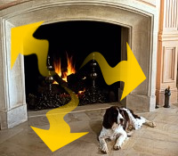
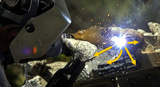
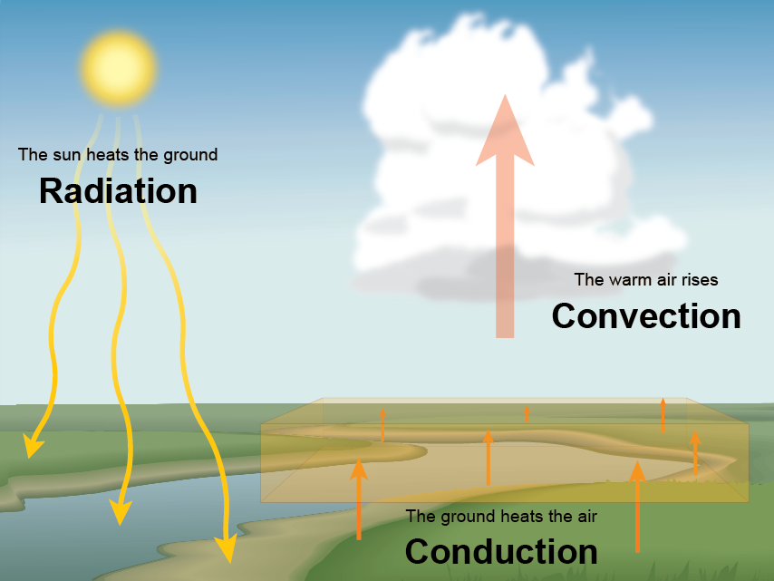

# Radiation, Conduction and Convection Defined

> Source: <https://www.noaa.gov/jetstream/atmosphere/transfer-of-heat-energy>  
> Section: Commonly Misunderstood Terms  
> Captured: 2026-08-19 06:00 UTC  
> PDF: [radiation-conduction-and-convection-defined.pdf](radiation-conduction-and-convection-defined.pdf) · Original HTML: [source/original.html](source/original.html)

---

[Skip to main content](#main)

Main Menu

- [Home](https://www.noaa.gov/)
- [Weather](https://www.noaa.gov/weather)
- [Climate](https://www.noaa.gov/climate)
- [Ocean & Coasts](https://www.noaa.gov/ocean-coasts)
- [Fisheries](https://www.noaa.gov/fisheries)
- [Satellites](https://www.noaa.gov/satellites)
- [Research](https://www.noaa.gov/research)
- [Marine & Aviation](https://www.noaa.gov/marine-aviation)
- [Charting](https://www.noaa.gov/charting)
- [Sanctuaries](https://www.noaa.gov/sanctuaries)
- [Education](https://www.noaa.gov/education)
- [News and features](https://www.noaa.gov/news-features)
- [Our data](https://www.noaa.gov/data)
- [Tools & resources](https://www.noaa.gov/tools-and-resources)
- [About our agency](https://www.noaa.gov/about-our-agency)

An official website of the United States government

Here’s how you know

Here’s how you know

**Official websites use .gov**

 A **.gov** website belongs to an official government organization in the United States.

**Secure .gov websites use HTTPS**

 A **lock** (LockA locked padlock) or **https://** means you’ve safely connected to the .gov website. Share sensitive information only on official, secure websites.

Find your local weather

Change location:

Enter City, State or ZIP code

- [News](https://www.noaa.gov/news-features)
- [Data](https://www.noaa.gov/data)
- [Tools](https://www.noaa.gov/tools-and-resources)
- [About](https://www.noaa.gov/about-our-agency)

[National Oceanic and Atmospheric Administration](https://www.noaa.gov/ "National Oceanic and Atmospheric Administration home")
[U.S. Department of Commerce](https://www.commerce.gov)

Enter Search Terms

## Breadcrumb

1. [Home](https://www.noaa.gov/)
2. [JetStream](https://www.noaa.gov/jetstream)
3. [Topic Matrix](https://www.noaa.gov/jetstream/topic-matrix)
4. [The Atmosphere](https://www.noaa.gov/jetstream/atmosphere)

- [JetStream home](https://www.noaa.gov/jetstream)
- Topic

  - [Topic](https://www.noaa.gov/jetstream/topic-matrix)
  - [The Atmosphere](https://www.noaa.gov/jetstream/atmosphere)

    - [Layers of the Atmosphere](../layers-of-the-atmosphere/layers-of-the-atmosphere.md)
    - [Air Pressure](https://www.noaa.gov/jetstream/atmosphere/air-pressure)
    - [The Transfer of Heat Energy](radiation-conduction-and-convection-defined.md)
    - [Energy Balance](https://www.noaa.gov/jetstream/atmosphere/energy)
    - [Hydrologic Cycle](https://www.noaa.gov/jetstream/atmosphere/hydro)
    - [Precipitation](https://www.noaa.gov/jetstream/atmosphere/precipitation)
  - [The Ocean](https://www.noaa.gov/jetstream/ocean)

    - [Layers of the Ocean](https://www.noaa.gov/jetstream/ocean/layers-of-ocean)
    - [Sea Water](https://www.noaa.gov/jetstream/ocean/sea-water)
    - [Ocean Circulations](https://www.noaa.gov/jetstream/ocean/circulations)
    - [Waves](https://www.noaa.gov/jetstream/ocean/waves)
    - [Tides](https://www.noaa.gov/jetstream/ocean/tides)
    - [The Sea Breeze](https://www.noaa.gov/jetstream/ocean/sea-breeze)
    - [The Marine Layer](https://www.noaa.gov/jetstream/ocean/marine-layer)
    - [Rip Currents](https://www.noaa.gov/jetstream/ocean/rip-currents)

      - [Rip Current Safety](https://www.noaa.gov/jetstream/ocean/rip-currents/rip-current-safety)
  - [Global Weather](https://www.noaa.gov/jetstream/global)

    - [Global Atmospheric Circulations](https://www.noaa.gov/jetstream/global/global-atmospheric-circulations)
    - [The Jet Stream](https://www.noaa.gov/jetstream/global/jet-stream)
    - [Climate vs. Weather](https://www.noaa.gov/jetstream/global/climate-vs-weather)
    - [Climate Zones](https://www.noaa.gov/jetstream/global/climate-zones)
  - [Clouds](https://www.noaa.gov/jetstream/clouds)

    - [How clouds form](https://www.noaa.gov/jetstream/clouds/how-clouds-form)
    - [The Core Four](https://www.noaa.gov/jetstream/clouds/four-core-types-of-clouds)
    - [The Basic Ten](https://www.noaa.gov/jetstream/clouds/ten-basic-clouds)
    - [Cloud Chart](https://www.noaa.gov/jetstream/clouds/nws-cloud-chart)
    - [Color of Clouds](https://www.noaa.gov/jetstream/clouds/color-of-clouds)
  - [The Upper Air](https://www.noaa.gov/jetstream/upperair)

    - [Parcel Theory](https://www.noaa.gov/jetstream/upperair/parcel-theory)
    - [Stability-Instability](https://www.noaa.gov/jetstream/upperair/bowls)
    - [Radiosondes](https://www.noaa.gov/jetstream/upperair/radiosondes)
    - [Skew-T Log-P Diagrams](https://www.noaa.gov/jetstream/upperair/skew-t-log-p-diagrams)
    - [Skew-T Plots](https://www.noaa.gov/jetstream/upperair/skew-t-plots)
    - [Skew-T Examples](https://www.noaa.gov/jetstream/upperair/skewt_samples)
  - [Upper Air Charts](https://www.noaa.gov/jetstream/upper-air-charts)

    - [Pressure vs. Elevation](https://www.noaa.gov/jetstream/upper-air-charts/verses)
    - [Longwaves and Shortwaves](../../14-miscellaneous/longwave-patterns-long-shortwaves/longwave-patterns-long-shortwaves.md)
    - [Basic Wave Patterns](../../14-miscellaneous/longwave-patterns-basic-wave-patterns/longwave-patterns-basic-wave-patterns.md)
    - [Common Features](https://www.noaa.gov/jetstream/upper-air-charts/common-features-of-constant-pressure-charts)
    - [200 mb](https://www.noaa.gov/jetstream/upper-air-charts/constant-pressure-charts-200-mb)
    - [300 mb](https://www.noaa.gov/jetstream/upper-air-charts/constant-pressure-charts-300-mb)
    - [500 mb](https://www.noaa.gov/jetstream/upper-air-charts/constant-pressure-charts-500-mb)
    - [700 mb](https://www.noaa.gov/jetstream/upper-air-charts/constant-pressure-charts-700-mb)
    - [850 mb](https://www.noaa.gov/jetstream/upper-air-charts/constant-pressure-charts-850-mb)
    - [Thickness Charts](https://www.noaa.gov/jetstream/upper-air-charts/constant-pressure-charts-thickness)
    - [Weather Models](https://www.noaa.gov/jetstream/upper-air-charts/weather-models)
  - [Synoptic Meteorology](https://www.noaa.gov/jetstream/synoptic)

    - [Time](https://www.noaa.gov/jetstream/time)
    - [Wind](https://www.noaa.gov/jetstream/synoptic/origin-of-wind)
    - [Air Masses](https://www.noaa.gov/jetstream/synoptic/air-masses)
    - [Surface Weather Maps](https://www.noaa.gov/jetstream/wxmaps)

      - [Surface Weather Plots](https://www.noaa.gov/jetstream/wxmaps-max)
    - [Norwegian Cyclone Model](https://www.noaa.gov/jetstream/synoptic/norwegian-cyclone-model)
    - [Types of Weather Phenomena](https://www.noaa.gov/jetstream/synoptic/types-of-weather-phenomena)
    - [Heat Index](https://www.noaa.gov/jetstream/synoptic/heat-index)
    - [Wind Chill](https://www.noaa.gov/jetstream/synoptic/wind-chill)
  - [Satellites](https://www.noaa.gov/jetstream/satellites)

    - [Electromagnetic waves](https://www.noaa.gov/jetstream/satellites/electromagnetic-waves)
    - [The Atmospheric Window](https://www.noaa.gov/jetstream/satellites/absorb)
    - [Weather Satellites](https://www.noaa.gov/jetstream/weather-satellites)
    - [GOES East](https://www.noaa.gov/jetstream/goes_east)
    - [GOES West](https://www.noaa.gov/jetstream/satellites/goes-west-goes-17)
  - [Doppler Radar](https://www.noaa.gov/jetstream/doppler)

    - [How radar works](https://www.noaa.gov/jetstream/doppler/how-radar-works)
    - [Volume Coverage Patterns (VCP)](https://www.noaa.gov/jetstream/vcp_max)
    - [Radar Images: Reflectivity](https://www.noaa.gov/jetstream/reflectivity)
    - [Radar Images: Velocity](https://www.noaa.gov/jetstream/velocity)
    - [Radar Images: Precipitation](https://www.noaa.gov/jetstream/precipitation)
  - [Tropical Weather Systems](../../12-tropical-cyclones/tropical-weather-nws/tropical-weather-nws.md)

    - [Inter-Tropical Convergence Zone](https://www.noaa.gov/jetstream/tropical/convergence-zone)
    - [Tropical Cyclones](https://www.noaa.gov/jetstream/tropical/tropical-cyclone-introduction)

      - [Structure](https://www.noaa.gov/jetstream/tropical/tropical-cyclone-introduction/tropical-cyclone-structure)
      - [Classification](https://www.noaa.gov/jetstream/tropical/tropical-cyclone-introduction/tropical-cyclone-classification)
      - [Names](https://www.noaa.gov/jetstream/tropical/tropical-cyclone-introduction/tropical-cyclone-names)
      - [NHC Forecasts](https://www.noaa.gov/jetstream/tc-tcm)
      - [Hazards & Safety](https://www.noaa.gov/jetstream/tc-hazards)
      - [Damage Potential](https://www.noaa.gov/jetstream/tc-potential)
    - [El Niño/Southern Oscillation](https://www.noaa.gov/jetstream/tropical/enso)

      - [ENSO Pacific Impacts](https://www.noaa.gov/jetstream/tropical/enso/enso-patterns)
      - [ENSO Weather Impacts](https://www.noaa.gov/jetstream/enso_impacts)
  - [Thunderstorms](../../07-thunderstorms/nws-jetstream/nws-jetstream.md)

    - [Ingredients for a Thunderstorm](https://www.noaa.gov/jetstream/thunderstorms/ingredients-for-thunderstorm)
    - [Life Cycle of a Thunderstorm](https://www.noaa.gov/jetstream/thunderstorms/life-cycle-of-thunderstorm)
    - [Types of Thunderstorms](https://www.noaa.gov/jetstream/tstrmtypes)
    - [Hazard: Hail](https://www.noaa.gov/jetstream/hail)
    - [Hazard: Damaging wind](https://www.noaa.gov/jetstream/wind_damage)
    - [Hazard: Tornadoes](https://www.noaa.gov/jetstream/thunderstorms/thunderstorm-hazards-tornadoes)
    - [Hazard: Flash Floods](https://www.noaa.gov/jetstream/thunderstorms/flood)
    - [Staying Ahead of the Storms](https://www.noaa.gov/jetstream/thunderstorms/staying-ahead-of-storms)
  - [Lightning](../../10-lightning/nws-lightning-tutorial/nws-lightning-tutorial.md)

    - [How Lightning is Created](https://www.noaa.gov/jetstream/lightning/how-lightning-is-created)
    - [The Positive and Negative Side of Lightning](https://www.noaa.gov/jetstream/lightning/positive-and-negative-side-of-lightning)
    - [The Sound of Thunder](https://www.noaa.gov/jetstream/lightning/sound-of-thunder)
    - [Lightning Safety](https://www.noaa.gov/jetstream/lightning/lightning-safety)
    - [Frequently Asked Questions](https://www.noaa.gov/jetstream/lightning/frequently-asked-questions)
  - [Derechos](https://www.noaa.gov/jetstream/derechos)

    - [Bow Echoes](https://www.noaa.gov/jetstream/derechos/bow-echoes)
    - [Types of Derechos](https://www.noaa.gov/jetstream/derechos/types-of-derechos)
    - [Where and When](https://www.noaa.gov/jetstream/derecho-climo)
    - [Notable Derechos](https://www.noaa.gov/jetstream/derecho-past)
    - [Keeping Yourself Safe](https://www.noaa.gov/jetstream/derecho-safety)
  - [Tsunamis](https://www.noaa.gov/jetstream/tsunamis)

    - [Historical Context](https://www.noaa.gov/jetstream/tsunamis/historical-context)
    - [Causes: Earthquakes](https://www.noaa.gov/jetstream/tsunamis/tsunami-generation-earthquakes)
    - [Causes: Landslides](https://www.noaa.gov/jetstream/tsunamis/tsunami-generation-landslides)
    - [Causes: Volcanoes](https://www.noaa.gov/jetstream/tsunamis/tsunami-generation-volcanoes)
    - [Causes: Weather](https://www.noaa.gov/jetstream/tsunamis/tsunami-generation-weather)
    - [Propagation](https://www.noaa.gov/jetstream/tsunamis/tsunami-propagation)
    - [Inundation](https://www.noaa.gov/jetstream/tsunamis/tsunami-inundation)
    - [Dangers](https://www.noaa.gov/jetstream/tsunamis/tsunami-dangers)
    - [Locations](https://www.noaa.gov/jetstream/tsunamis/tsunami-locations)
    - [Detection, Warning, and Forecasting](https://www.noaa.gov/jetstream/tsunamis/detection-warning-and-forecasting)
    - [Preparedness and Mitigation: Communities](https://www.noaa.gov/jetstream/prep-com)
    - [Preparedness and Mitigation: Individuals (You!)](https://www.noaa.gov/jetstream/prep-you)
    - [Select NOAA Tsunami Resources](https://www.noaa.gov/jetstream/tsu-resources)
  - [The National Weather Service](https://www.noaa.gov/jetstream/nws_intro)

    - [Weather Forecast Offices](https://www.noaa.gov/jetstream/wfos)
    - [River Forecast Centers](https://www.noaa.gov/jetstream/rfcs)
    - [Center Weather Service Units](https://www.noaa.gov/jetstream/cwsus)
    - [Regional Offices](https://www.noaa.gov/jetstream/regions)
    - [National Centers for Environmental Prediction](https://www.noaa.gov/jetstream/ncep)
    - [NOAA Weather Radio](https://www.noaa.gov/jetstream/nws_intro/noaa-weather-radio-all-hazards)
    - [NWS Careers: Educational Requirements](https://www.noaa.gov/jetstream/nws_intro/educational-requirements-for-careers-in-national-weather-service)
  - [Appendix](https://www.noaa.gov/jetstream/appendix)

    - [Weather Glossary](https://www.noaa.gov/jetstream/appendix/weather-glossary)
    - [Weather Acronyms](https://www.noaa.gov/jetstream/appendix/weather-acronyms)
    - [Downloads](https://www.noaa.gov/jetstream/appendix/downloads)
- [Learning Lessons](https://www.noaa.gov/jetstream/learning-lessons)
- [NWS Info](https://www.noaa.gov/jetstream/info)
- About

  - [About](https://www.noaa.gov/jetstream/about)
  - [Contact Us](https://www.noaa.gov/jetstream/about/contact-jetstream)

# The Transfer of Heat Energy

Share:

[Share to Twitter](https://twitter.com/intent/tweet?url=https://www.noaa.gov/jetstream/atmosphere/transfer-of-heat-energy)
[Share to Facebook](https://www.facebook.com/sharer/sharer.php?u=https://www.noaa.gov/jetstream/atmosphere/transfer-of-heat-energy)
[Share by email](mailto:?body=https://www.noaa.gov/jetstream/atmosphere/transfer-of-heat-energy)
[Print](javascript:window.print())

- [The Atmosphere](https://www.noaa.gov/jetstream/atmosphere)

  - [Layers of the Atmosphere](../layers-of-the-atmosphere/layers-of-the-atmosphere.md)

    - [The Ionosphere](https://www.noaa.gov/jetstream/ionosphere-max)
  - [Air Pressure](https://www.noaa.gov/jetstream/atmosphere/air-pressure)
  - [The Transfer of Heat Energy](radiation-conduction-and-convection-defined.md)
  - [Energy Balance](https://www.noaa.gov/jetstream/atmosphere/energy)
  - [Hydrologic Cycle](https://www.noaa.gov/jetstream/atmosphere/hydro)

    - [What-a-cycle](https://www.noaa.gov/jetstream/max-what-cycle)
  - [Precipitation](https://www.noaa.gov/jetstream/atmosphere/precipitation)

**Fast Facts**

It is not the heat you feel but ultraviolet radiation from the sun that causes sunburns that lead to skin cancer. The warmth of the sun does not lead to a sunburn.

From the American Academy of Dermatology, sunlight consists of two types of harmful rays that reach the earth - ultraviolet A (UVA) rays and ultraviolet B (UVB) rays. Overexposure to either can lead to skin cancer. In addition to causing skin cancer, here's what each of these rays do:

- UVA rays can prematurely age your skin, causing wrinkles and age spots, and can pass through window glass.
- UVB rays are the primary cause of sunburn and are blocked by window glass.

There is no safe way to tan. This includes radiation from artificial sources, such as tanning beds and sun lamps. Every time you tan, you damage your skin. As this damage builds, you speed up the aging of your skin and increase your risk for all types of skin cancer.

Even on cloudy days, ultraviolet radiation can pass through clouds and cause a sunburn if you remain outdoors long enough.

- [The Atmosphere](https://www.noaa.gov/jetstream/atmosphere)

  - [Layers of the Atmosphere](../layers-of-the-atmosphere/layers-of-the-atmosphere.md)

    - [The Ionosphere](https://www.noaa.gov/jetstream/ionosphere-max)
  - [Air Pressure](https://www.noaa.gov/jetstream/atmosphere/air-pressure)
  - [The Transfer of Heat Energy](radiation-conduction-and-convection-defined.md)
  - [Energy Balance](https://www.noaa.gov/jetstream/atmosphere/energy)
  - [Hydrologic Cycle](https://www.noaa.gov/jetstream/atmosphere/hydro)

    - [What-a-cycle](https://www.noaa.gov/jetstream/max-what-cycle)
  - [Precipitation](https://www.noaa.gov/jetstream/atmosphere/precipitation)

**Fast Facts**

It is not the heat you feel but ultraviolet radiation from the sun that causes sunburns that lead to skin cancer. The warmth of the sun does not lead to a sunburn.

From the American Academy of Dermatology, sunlight consists of two types of harmful rays that reach the earth - ultraviolet A (UVA) rays and ultraviolet B (UVB) rays. Overexposure to either can lead to skin cancer. In addition to causing skin cancer, here's what each of these rays do:

- UVA rays can prematurely age your skin, causing wrinkles and age spots, and can pass through window glass.
- UVB rays are the primary cause of sunburn and are blocked by window glass.

There is no safe way to tan. This includes radiation from artificial sources, such as tanning beds and sun lamps. Every time you tan, you damage your skin. As this damage builds, you speed up the aging of your skin and increase your risk for all types of skin cancer.

Even on cloudy days, ultraviolet radiation can pass through clouds and cause a sunburn if you remain outdoors long enough.

The Sun generates energy, which is transferred through space to the Earth's atmosphere and surface. Some of this energy warms the atmosphere and surface as heat. There are three ways energy is transferred into and through the atmosphere:

- radiation
- conduction
- convection

### Radiation

If you have stood in front of a fireplace or near a campfire, you have felt the heat transfer known as radiation. The side of your body nearest the fire warms while your other side remains unaffected by the heat. Although you are surrounded by air, the air has nothing to do with this transfer of heat. Heat lamps that keep food warm work in the same way. Radiation is the transfer of heat energy through space by electromagnetic radiation.

Electromagnetic radiation is made of waves of different frequencies. The frequency is the number of instances that a repeated event occurs over a set time. In other words, the frequency of electromagnetic radiation is the number of electromagnetic waves moving past a point each second. Most wavelengths of electromagnetic radiation are invisible. However, much of the electromagnetic radiation that reaches the Earth from the Sun is visible light.

Our brains interpret some of these frequencies as colors, including red, orange, yellow, green, blue, indigo, and violet. When the eye views all these different frequencies at the same time, it is interpreted as white. Infrared and ultraviolet are two of the waves we can't see. Infrared had a lower frequency than red, and ultraviolet has a higher frequency than violet [[more on electromagnetic radiation](https://www.noaa.gov/jetstream/satellites/electromagnetic-waves)]. It is infrared radiation that produces the warm feeling on our bodies.

Most of the solar radiation is absorbed by the atmosphere, and much of what reaches the Earth's surface is radiated back into the atmosphere to become heat energy. Dark colored objects, such as asphalt, absorb radiant energy faster than light colored objects. However, they also radiate their energy faster than lighter colored objects. (The variations in how Earth's surface absorbs heat from the Sun is called differential heating.)

**Learning Lesson:** [Melts in your bag, not in your hand](https://www.noaa.gov/jetstream/ll-melts)

### Conduction

Conduction is the transfer of heat energy from one substance to another or within a substance. Have you ever left a metal spoon in a pot of soup being heated on a stove? After a short time, the handle of the spoon will become hot.

This is due to transfer of heat energy from molecule to molecule or from atom to atom. Another example is when objects are welded together; the metal becomes hot (the orange-red glow) by the transfer of heat from an arc.

Conduction is a very effective method of heat transfer in metals. However, air conducts heat poorly.

### Convection

Convection is the transfer of heat energy in a fluid. In the kitchen, this type of heating is most commonly seen as the circulation that develops in a boiling liquid.

Air in the atmosphere acts as a fluid. The Sun's radiation strikes the Earth's surface, thus warming it. As the surface's temperature rises due to conduction, heat energy is released into the atmosphere, forming a bubble of air that is warmer than the surrounding air. This bubble of air rises into the atmosphere. As it rises, the bubble cools, with its heat moving into the surrounding atmosphere.

As the hot air mass rises, it is replaced by the surrounding cooler, more dense air, which we feel as wind. These movements of air masses can be small in a certain region, such as local cumulus clouds, or large cycles in the troposphere, covering large sections of the Earth. The large cycles are called convection currents and are responsible for many weather patterns in the troposphere.

- [The Atmosphere](https://www.noaa.gov/jetstream/atmosphere)

  - [Layers of the Atmosphere](../layers-of-the-atmosphere/layers-of-the-atmosphere.md)

    - [The Ionosphere](https://www.noaa.gov/jetstream/ionosphere-max)
  - [Air Pressure](https://www.noaa.gov/jetstream/atmosphere/air-pressure)
  - [The Transfer of Heat Energy](radiation-conduction-and-convection-defined.md)
  - [Energy Balance](https://www.noaa.gov/jetstream/atmosphere/energy)
  - [Hydrologic Cycle](https://www.noaa.gov/jetstream/atmosphere/hydro)

    - [What-a-cycle](https://www.noaa.gov/jetstream/max-what-cycle)
  - [Precipitation](https://www.noaa.gov/jetstream/atmosphere/precipitation)

**Fast Facts**

It is not the heat you feel but ultraviolet radiation from the sun that causes sunburns that lead to skin cancer. The warmth of the sun does not lead to a sunburn.

From the American Academy of Dermatology, sunlight consists of two types of harmful rays that reach the earth - ultraviolet A (UVA) rays and ultraviolet B (UVB) rays. Overexposure to either can lead to skin cancer. In addition to causing skin cancer, here's what each of these rays do:

- UVA rays can prematurely age your skin, causing wrinkles and age spots, and can pass through window glass.
- UVB rays are the primary cause of sunburn and are blocked by window glass.

There is no safe way to tan. This includes radiation from artificial sources, such as tanning beds and sun lamps. Every time you tan, you damage your skin. As this damage builds, you speed up the aging of your skin and increase your risk for all types of skin cancer.

Even on cloudy days, ultraviolet radiation can pass through clouds and cause a sunburn if you remain outdoors long enough.

## Select Citation Format

- Select citation style -APA (American Psychological Association) 7th editionChicago Manual of Style 17th editionMLA (Modern Language Association) 8th editionPlain Text

Last updated January 2, 2024

[Cite this page](#)

[Have a comment on this page? Let us know.](https://www.noaa.gov/noaa_landing_page/comment_modal?email=JetStream%40noaa.gov&url=https%3A%2F%2Fwww.noaa.gov%2Fjetstream%2Fatmosphere%2Ftransfer-of-heat-energy)

[NOAA Home](https://www.noaa.gov/)

Science. Service. Stewardship.

- [News](https://www.noaa.gov/news-features)
- [Tools](https://www.noaa.gov/tools-and-resources)
- [About](https://www.noaa.gov/about-our-agency)

- [Resources for Tribal & Indigenous Communities](https://www.noaa.gov/legislative-and-intergovernmental-affairs/noaa-tribal-resources)
- [Bipartisan Infrastructure Law (BIL)](https://www.noaa.gov/infrastructure-law)
- [Inflation Reduction Act (IRA)](https://www.noaa.gov/inflation-reduction-act)
- [Protecting Your Privacy](https://www.noaa.gov/protecting-your-privacy)
- [FOIA](https://www.noaa.gov/information-technology/foia)
- [Information Quality](https://www.noaa.gov/organization/information-technology/policy-oversight/information-quality)
- [Accessibility](https://www.noaa.gov/accessibility)
- [Guidance](https://www.noaa.gov/guidance)
- [Budget & Performance](https://www.noaa.gov/budget-finance-performance)
- [Disclaimer](https://www.noaa.gov/disclaimer)
- [EEO](https://www.noaa.gov/civil-rights)
- [No-Fear Act](https://www.noaa.gov/organization/inclusion-and-civil-rights/no-fear-act)
- [USA.gov](https://www.usa.gov)
- [Ready.gov](https://www.ready.gov)
- [Employee Check-In](https://www.noaa.gov/organization/information-technology/emergency-information-for-noaa-employees)
- [Staff Directory](https://nsd.rdc.noaa.gov)
- [Contact Us](https://www.noaa.gov/contact-us)
- [Need Help?](https://www.noaa.gov/need-help)
- [COVID-19 hub for NOAA personnel offsite link](https://sites.google.com/noaa.gov/ohcs/current-event)
- [Vote.gov](https://vote.gov/)

[Stay connected to NOAA](https://www.noaa.gov/stay-connected)

[NOAA on Twitter](https://twitter.com/NOAA)
[NOAA on Facebook](https://www.facebook.com/NOAA)
[NOAA on Instagram](https://www.instagram.com/noaa)
[NOAA on YouTube](https://www.youtube.com/noaa)

[Back to top](#top--GvQZcHrwwE4 "Back to top")
