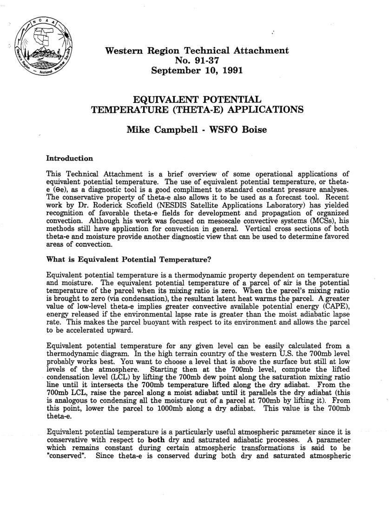
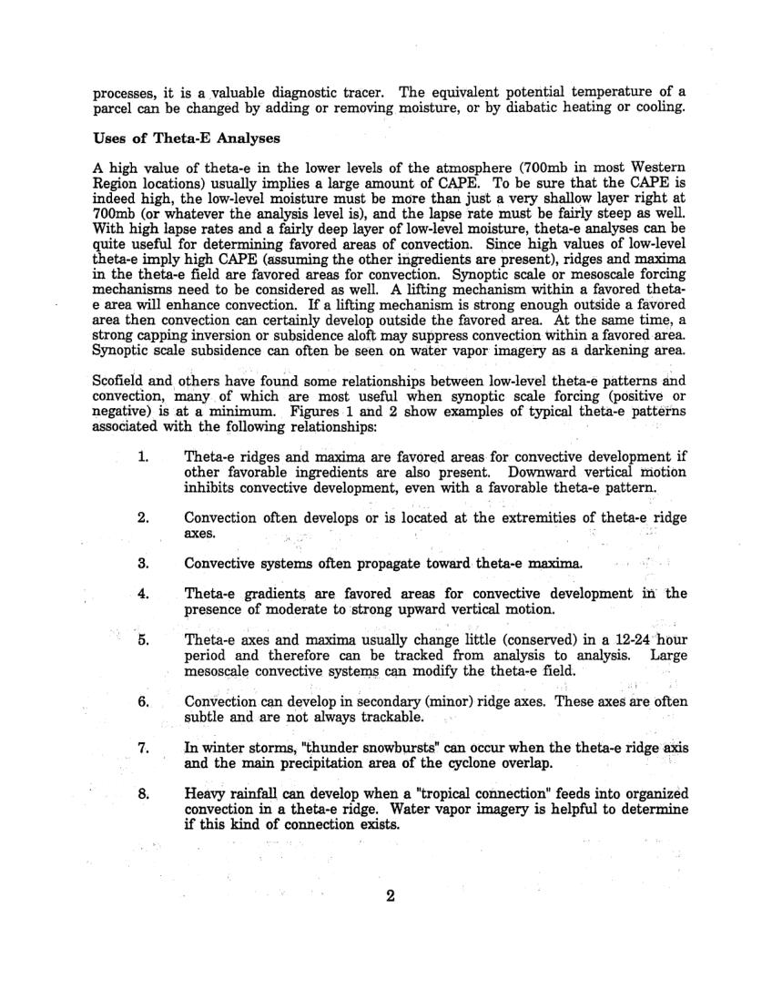
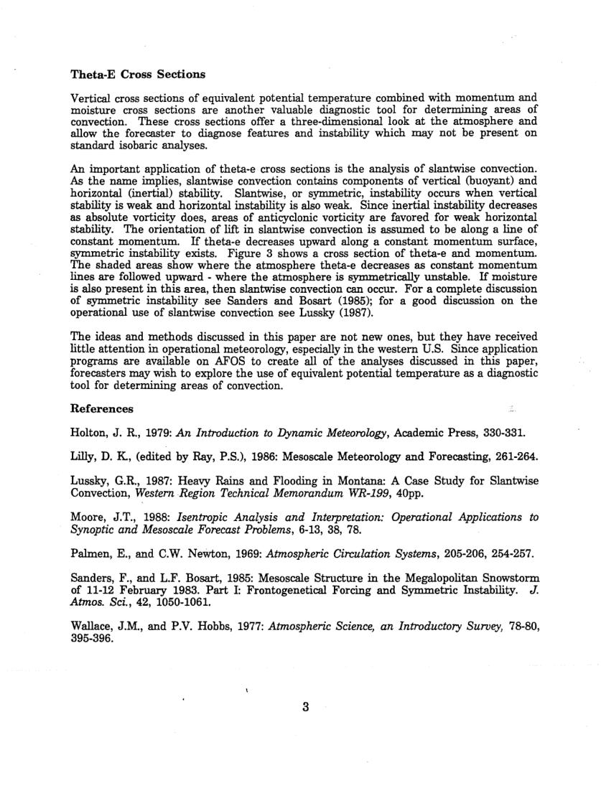
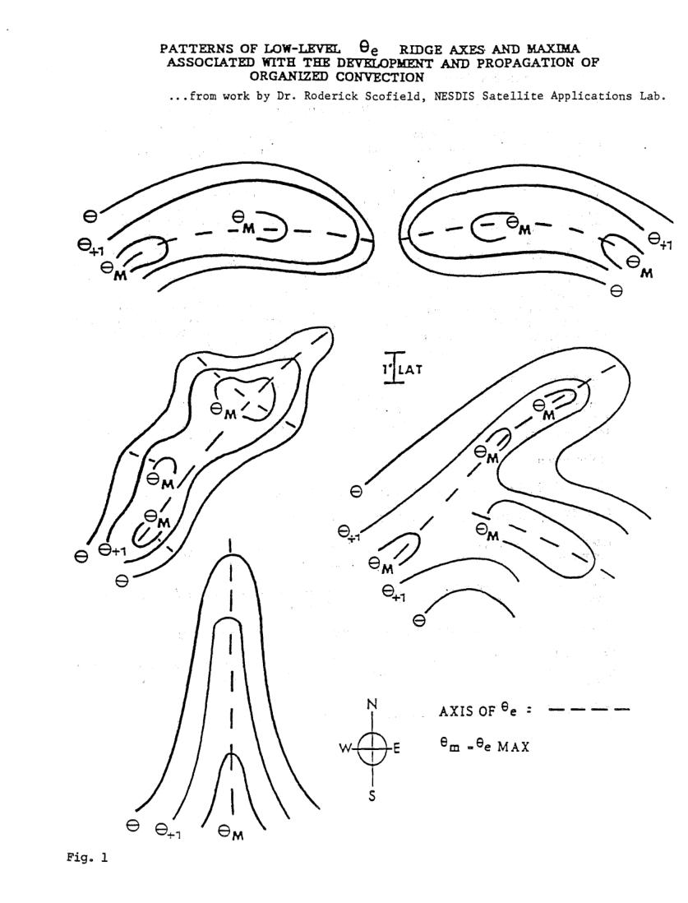
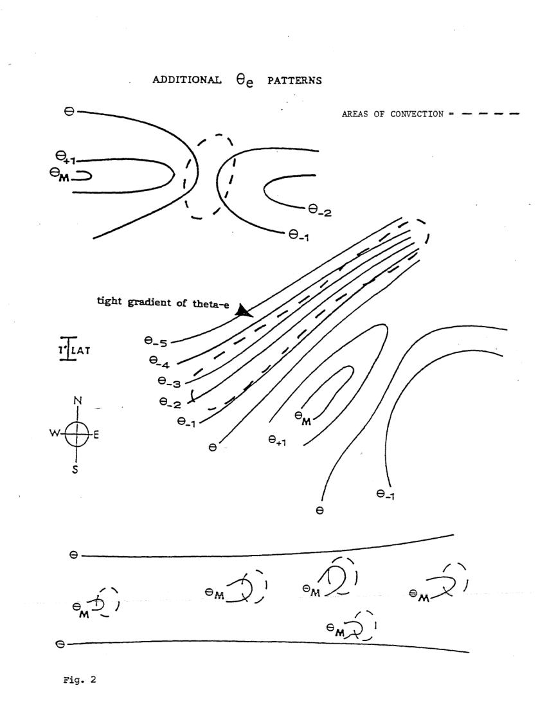
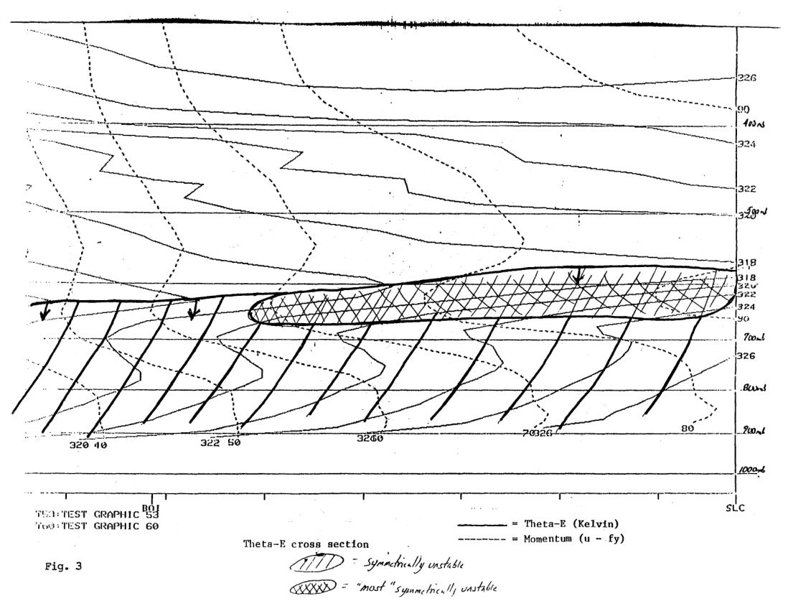

# Temperatures - Dry Bulb / Wet Bulb / Dew Point / Potential — here

> Source: <https://www.weather.gov/media/zhu/ZHU_Training_Page/definitions/dry_wet_bulb_definition/theta_e.pdf>  
> Section: Commonly Misunderstood Terms  
> Captured: 2026-08-19 06:00 UTC  
> PDF: [theta-e.pdf](theta-e.pdf) (6 pages)

---

## Page 1

Western Region Technical Attachment 
No. 91-37 
September 10, 1991 
EQUIVALENT POTENTIAL 
TEMPERATURE (THETA-E) APPLICATIONS 
Mike Campbell - WSFO Boise 
Introduction 
This Technical Attachment is a brief overview of some operational applications of 
equivalent potential temperature. The use of equivalent potential temperature, or theta-
e (ae), as a diagnostic tool is a good compliment to standard constant pressure analyses. 
The conservative property of theta-e also allows it to be used as a forecast tool. Recent 
work by Dr. Roderick Scofield (NESDIS Satellite Applications Laboratory) has yielded 
recognition of favorable theta-e fields for development and propagation of organized 
convection. Although his work was focused on mesoscale convective systems (MCSs), his 
methods still have application for convection in general. Vertical cross sections of both 
theta-e and moisture provide another diagnostic view that can be used to determine favored 
areas of convection. 
What is Equivalent Potential Temperature? 
Equivalent potential temperature is a thermodynamic property dependent on temperature 
and moisture. The equivalent potential temperature of a parcel of air is the potential 
temperature of the parcel when its mixing ratio is zero. When the parcel's mixing ratio 
is brought to zero (via condensation), the resultant latent heat warms the parcel. A greater 
value of low-level theta-e implies greater convective available potential energy (CAPE), 
energy released if the environmental lapse rate is greater than the moist adiabatic lapse 
rate. This makes the parcel buoyant with respect to its environment and allows the parcel 
to be accelerated upward. 
Equivalent potential temperature for any given level can be easily calculated from a 
thermodynamic diagram. In the high terrain country of the western U.S. the 700mb level 
probably works best. You want to choose a level that is above the surface but still at low 
levels of the atmosphere. 
Starting then at the 700mb level, compute the lifted 
· condensation level (LCL) by lifting the 700mb dew point along the saturation mixing ratio 
line until it intersects the 700mb temperature lifted along the dry adiabat. From the 
700mb LCL, raise the parcel along a moist adiabat until it parallels the dry adiabat (this 
is analogous to condensing all the moisture out of a parcel at 700mb by lifting it). From 
this point, lower the parcel to 1000mb along a dry adiabat. 
This value is the 700mb 
theta-e. 
Equivalent potential temperature is a pa.rticularly useful atmospheric parameter since it is 
conservative with respect to both dry and saturated adiabatic processes. A parameter 
which remains constant during certain atmospheric transformations is said to be 
"conserved". 
Since theta-e is conserved during both dry and saturated atmospheric

## Page 2

processes, it is a .valuable diagnostic tracer. The equivalent potential temperature of a 
parcel can be changed by adding or removing moisture, or by diabatic heating or cooling. 
Uses of Theta-E Analyses 
A high value of theta-e in the lower levels of the atmosphere (700mb in most Western 
Region locations) usually implies a large amount of CA;PE. To be sure that the CAPE is 
indeed high, the low-level moisture must be more than just a very shallow layer right at 
700mb (or whatever the analysis level is), and the lapse rate must be fairly steep as well. 
With high lapse rates and a fairly deep layer of low-level moisture, theta-e analyses can be 
quite useful for determining favored areas of convection. Since high values of low-level 
theta-e imply high CAPE (assuming the other ingredients are present), ridges and maxima 
in the theta-e field are favored areas for convection. Synoptic scale or mesoscale forcing 
mechanisms need to be considered as well. A lifting mechanism within a favored theta-
e area will enhance convection. If a lifting mechanism is strong enough outside a favored 
area then convection can certainly develop outside the favored area. At the same time, a 
strong capping inversion or subsidence aloft may suppress convection Within a favored area. 
Synoptic scale subsidence can often be seen on water vapor imagery as a darkening area. 
Scofield and others have found some relationships between low-level theta-e patterns and 
convection, many of which are most useful when synoptic scale forcing (positive or 
negative) is at a minimum. Figures 1 and 2 show examples of typical theta-e patterns 
associated with the following relationships: 
1. 
Theta-e ridges and maxima are favored areas for convective development if 
other favorable ingredients are also present. 
Downward vertical motion 
inhibits convective development, even with a favorable theta-e pattern. 
2. 
Convection often develops or is located at the extremities of theta-e ridge 
axes. 
3. 
Convective systems often propagate toward· theta-e maxima. 
4. 
Theta-e gradients are favored areas for convective development in: the 
presence of moderate to strong upward vertical motion. 
5. 
Theta-e axes and maxima usually change little (conserved) in a 12-24·hol.lr 
period and therefore can be tracked from analysis to analysis. 
Large 
mesoscale convective systen;ts ~ 
modify the theta~e field. 
6. 
Convection can develop in secondary (minor) ridge axes. These axes are often 
subtle and are not always trackable. 
7. 
In winter storms, "thunder snowbursts" can occur when the theta-e ridge axis 
and the main precipitation area of the cyclone overlap. 
· 
8, 
Heavy rainfall can develop when a "tropical connection" feeds into organized 
convection in a theta-e ridge. Water vapor imagery is helpful to determine 
if this kind of connection exists. 
2

## Page 3

Theta-E Cross Sections 
Vertical cross sections of equivalent potential temperature combined with momentum and 
moisture cross sections are another valuable diagnostic tool for determining areas of 
convection. These cross sections offer a three-dimensional look at the atmosphere and 
allow the forecaster to diagnose features and instability which may not be present on 
standard isobaric analyses. 
An important application of theta-e cross sections is the analysis of slantwise convection. 
As the name implies, slantwise convection contains components of vertical (buoyant) and 
horizontal (inertial) stability. Slantwise, or symmetric, instability occurs when vertical 
stability is weak and horizontal instability is also weak. Since inertial instability decreases 
as absolute vorticity does, areas of anticyclonic vorticity are favored for weak horizontal 
stability. The orientation of lift in slantwise convection is assumed to be along a line of 
constant momentum. If theta-e decreases upward along a constant momentum surface, 
symmetric instability exists. Figure 3 shows a cross section of theta-e and momentum. 
The shaded areas show where the atmosphere theta-e decreases as constant momentum 
lines are followed upward - where the atmosphere is symmetrically unstable. If moisture 
is also present in this area, then slantwise convection can occur. For a complete discussion 
of symmetric instability see Sanders and Bosart (1985); for a good discussion on the 
operational use of slantwise convection see Lussky (1987). 
The ideas and methods discussed in this paper are not new ones, but they have received 
little attention in operational meteorology, especially in the western U.S. Since application 
programs are available on AFOS to create all of the analyses discussed in this paper, 
forecasters may wish to explore the use of equivalent potential temperature as a diagnostic 
tool for determining areas of convection. 
References 
Holton, J. R., 1979: An Introduction to Dynamic Meteorology, Academic Press, 330-331. 
Lilly, D. K, (edited by Ray, P.S.), 1986: Mesoscale Meteorology and Forecasting, 261-264. 
Lussky, G.R., 1987: Heavy Rains and Flooding in Montana: A Case Study for Slantwise 
Convection, Western Region Technical Memorandum WR-199, 40pp. 
Moore, J. T., 1988: Isentropic Analysis and Interpretation: Operational Applications to 
Synoptic and Mesoscale Forecast Problems, 6-13, 38, 78. 
Palmen, E., and C.W. NeWton, 1969: Atmospheric Circulation Systems, 205-206, 254-257. 
Sanders, F., and L.F. Bosart, 1985: Mesoscale Structure in the Megalopolitan Snowstorm 
of 11-12 February 1983. Part I: Frontogenetical Forcing and Symmetric Instability. J. 
Atmos. Sci., 42, 1050-1061. 
Wallace, J.M., and P.V. Hobbs, 1977: Atmospheric Science, an Introductory Survey, 78-80, 
395-396. 
3

## Page 4

Figo 1 
PATTERNS OF LOW-LEVEL 
9e 
RIDGE AXES AND MAX.IMA 
ASSOCIATED WITH THE DEVELOPMENT AND PROPAGATION OF 
ORGANIZED CONVECTION 
..• from work by Dr. Roderick Scofield, NESDIS Satellite Applications Lab. 
N 
AXIS OF 9e : 
-
-
__, -
s

## Page 5

ADDITIONAL 9e 
PATTERNS 
AREAS OF CONVECTION = -
-
-
-
- \ 
6+1------
eM..::::> 
-
tight gradient of theta-e 
N 
s 
e_, 
e 
9--------------------------~r~~-----
/~ 
e~ J 
M 
-
"" 
e A 
l 
M__x}./ 
eM~J 
/' 
e.~ I 
~_., 
6------------------------------~~--------
Fig. 2

## Page 6

-------------~-------....i .......... • 
... 
O 
• ........,.......,__ __ , 
00oo0o~:- .... ~Lo-. 
••• 
' 
~.~ 
.~, . ..,..-
'~.. 
I 
.. "-. 
• 
• 
• 
1 
\ 
',. 
--,3._(:) 
. 
. 
-
. 
. 
. 
·. 
~ 
• 
• 
• 
•• 
···......... . 
. 
. 
-... 
----·~ 
• 
' 
.... ______________ "0 
\ --------------\, •, 
-~~-----··--·-··· .,1"4#:JI\$ 
' 
. 
. 
-
~ 
' 
. 
. 
-
----- ~·· 
. 
.. 
·--
•··· .. 
. 
. 
-
-
' 
----- .,.________ 
. 
. . 
-' 
'· 
. . 
. 
' 
' 
---. -----
• 
I 
'• 
··-·---------.,_,___ 
-
·-. 
.. --·-·· 
• 
• 
•• 
'3"" 
............. ·-·-·-~~.. 
', 
• 
•••• 
---, .:..c. 
• 
• 
•• 
• 
• 
• 
' 
·-·-·----. 
\ 
'0 
'o 
--~M.J 
--.____ 
' 
' 
' 
-~~ 
.... ~ow 
\ 
' 
'"? 
• 
• 
----
' 
. 
' 
z___ \ 
. 
. 
• 
• 
• 
• 
• 
• 
• 
' 
. 
' 
\ 
•, 
·. 
. ~ 
) 
..... ·· .. ·-:--.. ,\;:::;::_:---
\ ~ 
~ 
·. --------
. 
.. 
~ 
~-
", 
. 
\ 
\ 
I 
I 
. 
' 
" 
................ _,_~ ,' 
,' 
I I 
...... -.. -.~~ .. -~ 
" 
,. ,. 
i~~~~f195!L~t:J~~~~ .~ .. : 
.. 3l.v· 
-···~Z2 
--
... 3?.4 
-~·····'~o I 7£¥J.J 
/1326 
:;;r--
I 
...:L. ..c= 
I 
.L_ c 
.... , I 
~~ 
l. ./ / 
(/ ·. 
I 
., 
7' 
z:>· 
7 
L7' 
,r 
...... ·~ 
~ 7 
,-
, 
· 
... _ ..
. il£u,J 
320 <10 
I 
'i'~·~: l : 'I' EST CRAPI-II C D~j 
·,\,•): TEST GI~APJ-11 C 60 
Fig. 3 
322 
TI1eta-E cross section 
di2P 
~ 
-:-
-?7'/'f~~ln~ .. I!J l/;1.$~5/t 
"mod ''syJnM(In·c~ 1(1 vt-'Jh,tr(. 
... ..... , 
I 
.. ~--
i..L.--..-------~~0 
---· __ 2W,.J 
J· 
Theta-E (Kelvin) 
= Momentum (u -
fy) 
.@Jo.,.l. 
-r-------·--..1 
s~c
