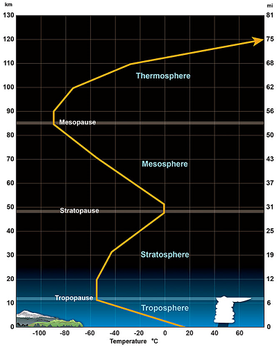
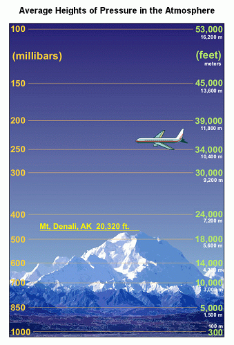
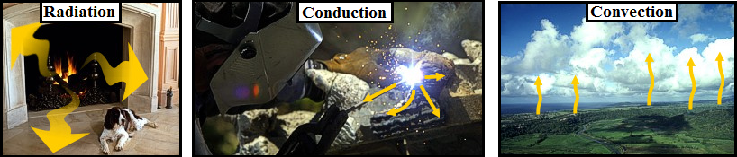
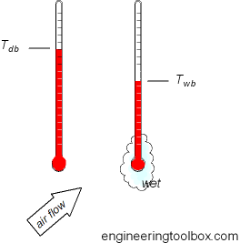
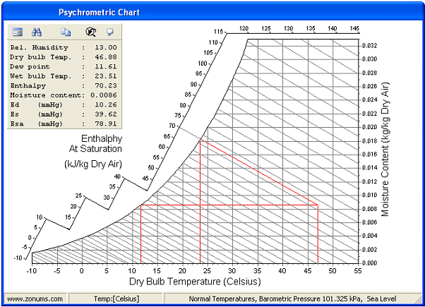
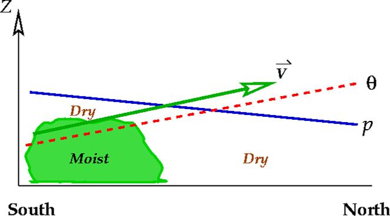
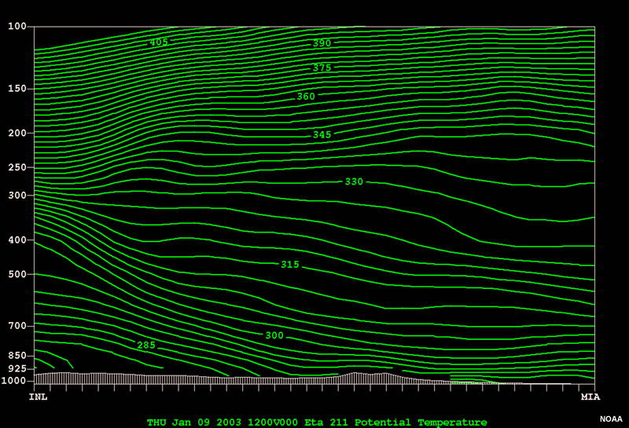

# Temperatures - Dry Bulb / Wet Bulb / Dew Point / Potential

> Source: <http://www.weather.gov/source/zhu/ZHU_Training_Page/definitions/dry_wet_bulb_definition/dry_wet_bulb.html>  
> Section: Commonly Misunderstood Terms  
> Captured: 2026-08-19 06:00 UTC  
> PDF: [temperatures-dry-bulb-wet-bulb-dew-point-potential.pdf](temperatures-dry-bulb-wet-bulb-dew-point-potential.pdf) · Original HTML: [source/original.html](source/original.html)

---

**TEMPERATURES INCLUDING DRY BULB / WET BULB / DEW POINT /
POTENTIAL / EQUIVALENT POTENTIAL**

1. **Temperature**
   - Temperature - the measure of average kinetic energy (KE) of a gas, liquid, or solid. KE is *energy of motion*.
   - For air and other gases (in the troposphere only), it is common to consider the KE to be proportional to the *number of molecular collisions.* More collisions means higher temps while less collisions means lower temps.
   - Temperature is measured in degrees on the Fahrenheit, Celsius, and Kelvin scales.
   - Kelvin scale is called the *absolute temperature scale* because it is the only scale that directly measures energy. There are negative temps on the other two scales and it is impossible to have a negative energy.
2. **Temperature Profile of the Atmosphere**
   - The atmosphere may be divided into four distinct temperature layers:
     - **Troposphere:** contains most of the atmosphere even though it is very shallow. Gravity causes the air to be concentrated in this layer. The normal environmental lapse rate (ELR) is negative (cooling with increasing height) because the ground is the heat source, but a temperature inversion may exist which results in a positive ELR (warming with height).
     - **Stratosphere:** above the tropopause, a layer of air that has a positive ELR due to absorption of UV rays from the sun by the ozone.
     - **Mesosphere:** above the stratopause, a layer of air that has a negative ELR since there is no ozone present and this layer is at an extremely high altitude.
     - **Thermosphere:** above the mesopause, this layer of air has so few air molecules that the KE is extremely high due to the very high velocities of these few air molecules. By definition that implies a very high temperature so the ELR is positive. In reality, the air is not "hot to the touch" since there is so little air present one would not feel anything.

   
3. **Methods of Heat Transfer**
   - **Radiation** - heat that is transferred by wave-like energy (ex. photons) without any molecular contact and with no air movement involved. Ex. earth is warmed by the sun via radiation.
   - **Conduction** - heat that is transferred via molecule to molecule contact. Ex. surface air is heated by touching the warmer surface of the earth.
   - **Convection** - heat that is transferred by moving air or water. Ex. warm air rising into the atmosphere transfers heat from the lowest levels to above.

   
4. **Adiabatic Process**
   - The process which involves a rising or sinking air parcel and the temperature changes associated with that motion.
   - As an air parcel rises it moves into an area of lower pressure aloft. This lower pressure causes the air parcel to expand. The expansion allows more room for the air molecules inside the parcel to move about. More room means less collisions between the molecules. Fewer collisions means less average KE. Less average KE means cooler temperatures. Therefore, **RISING AIR ALWAYS COOLS**.
   - As an air parcel SINKS it moves into an area of higher pressure below. This higher pressure causes the air parcel to compress. The compression allows less room for the air molecules inside the parcel to move about. Less room means more collisions between the molecules. More collisions means greater average KE. Greater average KE means warmer temperatures. Therefore, **SINKING AIR ALWAYS WARMS**.
   - The rate of warming or cooling is constant and is known as the *adiabatic lapse rate (ALR)*. The ALR = 5.5 oF/1,000 ft. or 10 oC/1 Km.
5. **Environmental Lapse Rate (ELR)**
   The *environmental lapse rate* is the rate of change of temperature with height between two altitudes in a layer of atmosphere. The ELR is assumed to be constant between those two points. To calculate the ELR, one needs two temperatures at two different altitudes (heights). To calculate, use the formula (T2-T1)/(H2-H1) where T is temperature and H is height. Answers must always be reduced to degrees F per 1,000 feet.

   **Example:**
    *The air at 2,000 feet is 40 degrees F while the air at 6,000 feet is 10 degrees F. Calculate the ELR.*

   1. Jot down the two points being considered: T1 = 40 F, H1 = 2,000ft., T2 = 10 F, H2 = 6,000 ft.
   2. Use the formula: (10F - 40F)/(6,000ft. - 2,000ft.)
   3. Result = -30F/4,000ft. Divide top and bottom by 4 to reduce the ratio to F/1,000 ft.
   4. Answer: -7.5F / 1,000ft.
6. **Using the ELR to Estimate an "In-Between" Temperature**
   The previous ELR means that the air temperature is cooling 7.5 F for each 1,000 feet of elevation. Therefore, one can use this ELR value to estimate any temperature between 2,000 and 6,000 feet. For example, if one wanted to estimate the temperature at 4,000 feet, the ELR shows that there should be a decrease of 15 F (2 x 7.5) moving from 2,000 feet to 4,000 feet. Since the air at 2,000 feet is 40F, the air at 4,000 feet is 25F (40F - 15F).

---

## Dry Bulb, Wet Bulb, and Dew Point Temperatures

The **Dry Bulb**, **Wet Bulb** and **Dew Point** temperatures are important to determine the state of humid air.
The knowledge of only two of these values is enough to determine the state - including the content of water vapor and the sensible and latent energy (enthalpy).

### Dry Bulb Temperature - *Tdb*

The Dry Bulb temperature, usually referred to as air temperature, is the air property that is most common used. When people refer to the temperature of the air, they are normally referring to its dry bulb temperature.

The Dry Bulb Temperature refers basically to the ambient air temperature. It is called "Dry Bulb" because the air temperature is indicated by a thermometer not affected by the moisture of the air.

Dry-bulb temperature - *Tdb*, can be measured using a normal thermometer freely exposed to the air but shielded from radiation and moisture. The temperature is usually given in degrees Celsius (oC) or degrees Fahrenheit (oF). The SI unit is Kelvin (K). Zero Kelvin equals to -273oC.

The dry-bulb temperature is an indicator of heat content and is shown along the bottom axis of the psychrometric chart. Constant dry bulb temperatures appear as vertical lines in the psychrometric chart.

### Wet Bulb Temperature - *Twb*

The **Wet Bulb** temperature is the temperature of adiabatic saturation. This is the temperature indicated by a moistened thermometer bulb exposed to the air flow.

Wet Bulb temperature can be measured by using a thermometer with the bulb wrapped in wet muslin. The adiabatic evaporation of water from the thermometer and the cooling effect is indicated by a "wet bulb temperature" lower than the "dry bulb temperature" in the air.

The rate of evaporation from the wet bandage on the bulb, and the temperature difference between the dry bulb and wet bulb, depends on the humidity of the air. The evaporation is reduced when the air contains more water vapor.

The wet bulb temperature is always lower than the dry bulb temperature but will be identical with 100% relative humidity (the air is at the saturation line).

Combining the dry bulb and wet bulb temperature in a psychrometric diagram or Mollier chart, gives the state of the humid air. Lines of constant wet bulb temperatures run diagonally from the upper left to the lower right in the Psychrometric Chart.

### Dew Point Temperature - *Tdp*

The **Dew Point** is the temperature at which water vapor starts to condense out of the air, the temperature at which air becomes completely saturated. Above this temperature the moisture will stay in the air.

If the dew-point temperature is close to the air temperature, the relative humidity is high, and if the dew point is well below the air temperature, the relative humidity is low.

If moisture condensates on a cold bottle from the refrigerator, the dew-point temperature of the air is above the temperature in the refrigerator.

The Dew Point temperature can be measured by filling a metal can with water and ice cubes. Stir by a thermometer and watch the outside of the can. When the vapor in the air starts to condensate on the outside of the can, the temperature on the thermometer is pretty close to the dew point of the actual air.

The Dew Point is given by the saturation line in the psychrometric chart.

---

## What is the difference between potential and equivalent potential temperature and what is their importance?

### METEOROLOGIST JEFF HABY

### Potential Temperature - THETA  (Θ)

**THETA (Potential Temperature)** is the temperature (measured in Kelvin **K**) a parcel of dry air would have if brought adiabatically (i.e., without transfer of heat or mass) to a standard pressure level of 1000 mb..

### Equivalent Potential Temperature - THETA-E  (Θe)

**THETA-E (Equivalent Potential Temperature)** is the temperature (measured in Kelvin **K**) a parcel of air would reach if all the water vapor in the parcel were to condense, releasing its latent heat, and the parcel is then brought adiabatically to the 1000 mb level. THETA-E increases as dewpoint and/or temperature increases.

Many students are curious in the operational importance of potential temperature and equivalent potential temperature. Potential temperature can be used to compare the temperature of air parcels that are at different levels in the atmosphere. Temperature tends to decrease with height. This fact makes it more difficult to note which regions in the atmosphere are experiencing WAA and CAA. Therefore, bringing air parcels adiabatically to a standard level (1000 millibars) allows comparisons to be made between air parcels at different elevations. If the potential temperature of an air parcel at one pressure level is colder than air parcels at other pressure levels, a forecaster can infer cold air advection or a cold pocket exists at the pressure level with the lowest theta.

Moist air from low levels on the left (south) is transported upward and to the right (north) along the isentropic surface (adapted from Bluestein, 1992).

Finding the potential temperature at a constant pressure level over an area produces one type of theta chart. The term theta and potential temperature are synonyms. Higher theta represents warmer air while lower theta represents colder air. For example, theta can be found at 700 millibars. Each location at 700 millibars drops a parcel from the 700 to 1000 millibar level and the temperature is read off at 1000 millibars and thus this is the 700 millibar theta temperature (theta is always given in degrees Kelvin). A vertical cross section of theta can be produced by finding the areal distribution of theta at many pressure levels, then connecting the points of equal theta. At this point, sloping constant theta surfaces can be plotted (see Chaston's Weather Maps book P. 167-8) Air parcels tend to travel along constant theta surfaces. This makes sense because constant theta surfaces represent constant density surfaces.

By definition, potential temperature increases with height, as it is the temperature that a parcel of air would have if brought dry adiabatically to a reference pressure level, usually 1000 mb, which represents the surface at sea level. The higher up the parcel begins, the more it will be adiabatically warmed before reaching the surface.

The path of least resistance on an air parcel that is advecting is for it to remain at the same density as its environment. Dr. Arnold describes this as, "If a parcel is subjected only to adiabatic transformation as it moves through the atmosphere its theta remains constant." The term that describes this process is isentropic lifting/descent. Isentropic lifting/descent occurs whenever WAA, CAA or flow of one air mass over another occurs. Less dense air will tend to glide up and over more dense air (thus low level WAA leads to rising air) when less dense air advects toward more dense air. You will hear theta and isentropic lifting referenced to often in forecast discussions. The trajectories that wind vectors take over theta surfaces determine how much lifting or sinking will take place due to advection. NWS forecasters are experts on these processes and use them as a major part of their forecasting process. All the different ways of graphing theta can be quite complex.

**Key points to remember are that:**
(1) air parcels in a convectively stable environment tend to advect along constant theta surfaces and
(2) low level WAA produces isentropic lifting and uplift while CAA produces isentropic downglide and sinking.

While potential temperature can be used to compare temperatures at different elevations and the trajectory air parcels will take (rising or sinking), equivalent potential temperature can be used to compare BOTH moisture content and temperature of the air. The equivalent potential temperature (or Theta-e as it is usually called) is found by lowering an air parcel to the 1000 mb level AND releasing the latent heat in the parcel. The lifting of a parcel from its original pressure level to the upper levels of the atmosphere will release the latent heat of condensation and freezing in that parcel. The more moisture the parcel contains the more latent heat that can be released. Theta-e is used operationally to map out which regions have the most unstable and thus positively buoyant air. The Theta-E of an air parcel increases with increasing temperature and increasing moisture content. Therefore, in a region with adequate instability, areas of relatively high theta-e (called theta-e ridges) are often the burst points for thermodynamically induced thunderstorms and MCS's. Theta-e ridges can often be found in those areas experiencing the greatest warm air advection and moisture advection. For more information on Theta-e, consult Chaston's book "weather maps" used in the Synoptic I (starting on page 127).

More info on potential temperature and equivalent potential temperature can be found [**here**](https://www.meted.ucar.edu/labs/synoptic/isentropic_analysis/navmenu.php?tab=1&page=2-0-0&type=flash) and [**here**](https://www.chemeurope.com/en/encyclopedia/Equivalent_potential_temperature.html) and [**here**](https://resources.eumetrain.org/data/2/28/Content/pottem_explanation.htm).

Nice NWS writeup on operational use of equivlanet potential temperature for thunderstorm development can be found [**here**](subpages/theta-e/theta-e.md).
