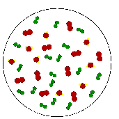

# Water Vapor - RH / Dew Point / Mixing Ratio

> Source: <http://www.atmo.arizona.edu/students/courselinks/fall12/atmo336/lectures/sec1/humidity.html>  
> Section: Commonly Misunderstood Terms  
> Captured: 2026-08-19 06:00 UTC  
> PDF: [water-vapor-rh-dew-point-mixing-ratio.pdf](water-vapor-rh-dew-point-mixing-ratio.pdf) · Original HTML: [source/original.html](source/original.html)

---

# The atmosphere and the Weather

[![[Home]](assets/home.jpg)](http://www.atmo.arizona.edu/students/courselinks/fall12/atmo336/home.html)
[![[Lectures]](assets/lectures.jpg)](http://www.atmo.arizona.edu/students/courselinks/fall12/atmo336/lectures.html)
[![[Previous]](assets/previous.jpg)](http://www.atmo.arizona.edu/students/courselinks/fall12/atmo336/lectures/sec1/evap_cond.html)
[![[Next]](assets/next.jpg)](http://www.atmo.arizona.edu/students/courselinks/fall12/atmo336/lectures/sec1/energy_trans.html)

## Water Vapor in the Atmosphere

A "Parcel of Air" is an iminaginary body of air about the size
of a large balloon that is used to explain the behavior of air.
We will describe what is meant by the relative humidity and dew
point temperature of air in a parcel. The parcel concept is used
because we often would like to know what will happen to air as it
moves in the atmosphere, and air tends to move together in blobs about
the size of parcels (not molecule by molecule). The parcel concept
will be extemely important in describing cloud and thunderstorm formation.
For one thing, we will want to keep track of the relative humidity in
an air parcels as it moves up and down in the atmosphere.

### Relative Humidity

The relative humidity in an air parcel is defined
as the ratio of the amount of water vapor actually in the air
to the maximum amount of water vapor required for
saturation at a particular temperature

water vapor content

Relative humidity

≡

RH

=

---

water vapor capacity

For example, air with a 50 percent relative humidity actually
contains one-half the amount of water vapor required for saturation.
Air with a 100 percent relative humidity is said to be
saturated because it is filled to capacity with water vapor.

One way to compute relative humidity is to take the ratio of the
actual vapor pressure (e) in a parcel (measured) with the saturation
vapor pressure (es) at the parcel temperature, or RH = e/es.
However, following meteorological convention, we will use something called *Mixing Ratio*
(U) instead of vapor pressure.

actual (measured) mass of water vapor (in parcel) in grams

Mixing Ratio

≡

U

=

---

mass of dry (non water vapor) air (in parcel) in kilograms

We will use the mixing ratio of keep track of the amount of water vapor in air parcels ...
the greater the mixing ratio, the more water vapor that is in the air. We will use the
Saturation Mixing Ratio (Us) to tell us the maximum amount of water vapor
that can be in the air.

mass of water vapor required for saturation (in parcel) in grams

Saturation Mixing Ratio

≡

Us

=

---

mass of dry (non water vapor) air (in parcel) in kilograms

The Relative Humidity (RH) is simply the mixing ratio divided by the saturation
mixing ratio.

actual (measured) water vapor content

U

Relative Humidity

≡

RH

=

---

=

---

maximum possible water vapor amount (saturation)

Us

You are expected to know this equation for relative humidity and to be
able to use it to solve simple problems. Just as with saturation vapor pressure,
the saturation mixing ratio, which specifies the maximum amount of water
vapor that can be in the air, is
determined by the air temperature ... the higher the air temperature, the
greater the saturation mixing ratio. We will use pre-computed tables of
[saturation mixing ratio](http://www.atmo.arizona.edu/students/courselinks/fall12/atmo336/lectures/sec1/Saturation_Mixing_Ratio_Tables.htm) to help solve problems. You should open the tables
and make sure you understand the relationship between air temperature and the
saturation mixing ratio, which is, as the air temperature increases, the saturation
mixing ratio increases rapidly (exponentially). When using these tables make sure
to use the correct temperature table, Fahrenheit or Celsius.

Let's go through an example.

A. What is the RH of an air parcel with a temperature of 25°C and a water vapor
mixing ratio of U = 8 g/kg?

- Step 1.
  Use table of saturation mixing ratio to get Us. Reading from the
  Celsius table, for T = 25°C, Us = 20.1 g/kg.
- Step 2. Use the RH equation. RH = U/Us = 8/20.1 = 0.398 or 39.8%

B. Continuing the example. What will the RH of the air in the parcel be if the parcel
is cooled to T = 15°C with no change in the water vapor content?

- Step 1.
  Use table of saturation mixing ratio to get Us. Reading from the
  Celsius table, for T = 15°C, Us = 10.6g/kg.
- Step 2. Use the RH equation. RH = U/Us = 8/10.6 = 0.755 or 75.5%

We can see that RH by itself does not indicate the actual amount
of water vapor in the air because it has a dependence on the air temperature. In the example
above, even though the actual amount of water vapor in the air was the same in parts A
and B, the relative humidity was different because Us changed due to the temperature
change. In fact there are two ways RH can change: (1) Change the water vapor content of
the air (changes the mixing ratio, U, which is the numerator of the RH equation) and
(2) Change the temperature of the air (changes the saturation mixing ratio, Us,
which is the denominator of the RH equation).

Most people use Relative humidity to describe the water vapor content of
the air, but it is widely misunderstood. Relative humdity in itself
does not indicate the actual amount of water vapor in the air because it
depends on temperature. For example, an air parcel at a temperature of
10°C with RH = 100% contains less water vapor than an air parcel
at a temperature of 25°C with RH = 50%. **You should be able to convince
yourself of this by using the table of saturation mixing ratios.**

### Dew point

The **dew point temperature (Td)** is defined as the temperature to which an
air parcel would have to be cooled (with no change in
its water vapor content) in order for it to be saturated with water vapor. It is determined by the amount
of water vapor in the parcel, i.e., as the mixing ratio, U, increases, the dew point
temperature, Td increases. If you know the actual
mixing ratio in an air parcel, you can use the table of saturation mixing ratios to get
the dew point temperature.

The dew point temperature is the answer to this question: "Given the amount of water vapor
that is in a parcel, what would the air temperature have to be for the parcel to be saturated
with that amount of water vapor?" The dew point temperature does indicate the actual vapor content
of the air: the higher the dew point, the more water vapor in the
air. You should realize that the dew point temperature is not something that is measured
with a thermometer. It is really used to indicate the amount of water vapor that
is in the air.

You are expected to be able to use the Relative Humidity equation and the table of saturation
mixing ratios to perform simple calculations of dew point temperature. So far we have used the
saturation mixing ratio tables to correspond air temperature in the left hand column with
the saturation mixing ratio in the right hand column. **The saturation mixing ratio tables
are also be used to correspond the dew point temperature, Td in the left hand column with the
mixing ratio, U, in the right hand column.** In other words the actual amount of water vapor in the
air can be specified using the mixing ratio or the dew point temperature.

Dew point temperature calculation example.

If the air temperature is T = 10°C and the relative humidity is RH = 50%, what is the dew point
temperature, Td?

- Step 1.
  Use table of saturation mixing ratio to get Us. Reading from the
  Celsius table, for T = 10°C, Us = 7.6 g/kg.
- Step 2. Use the RH equation. In this example we know the relative humidity and the saturation mixing
  ratio and we will use the RH equation to first calculate the mixing ratio. Simply rearranging the RH equation,
  U = (RH) x (Us) = (0.5) x (7.6 g/kg) = 3.8 g/kg.
- Step 3. Use the table of saturation mixing ratios to find the dew point temperature. Locate U = 3.8 g/kg in
  the right hand column. The corresponding entry in the left hand column is the dew point temperature,
  Td = 0°C

The difference between air temperature and dew point temperature
can indicate whether the relative humidity is low or high.

- when the air and the dew point temperatures are far apart, the relative
  humidity is low
- when the air and the dew point temperatures are close to the same value, the relative humidity is
  high
- when the air and the dew point temperatures are the same, the air is
  saturated and the relative humidity is 100 percent.

**Normally, near the Earth's surface, the relative humidity is less than 100%,
therefore, net evaporation is occurring.** since the rate of evaporation is faster
than the rate of condensation. To convince yourself of this, leave out an
uncovered glass of water. The water will eventually evaporate. In fact the lower the
relative humidity, the faster the rate
of net evaporation. Once evaporated
from the surface, water vapor moves around with the rest of the air.

Occasionally,
there may be net condensation occurring near the Earth's surface.
If air near the ground is cooled below its original
dew point temerature, fog will result. Fog is nothing more than a cloud at
ground level. We will talk more about clouds soon.
Beside fog, are there ever situations near the Earth's surface when net
condensation occurs? ANSWER: Yes, dew and frost.
When an object becomes colder than the dew point temperature, the air in contact
with that object becomes colder than the dew point temperature, resulting
in net condensation:

- Dew if the object is warmer than 0° Celsius
- Frost if the object is colder than 0° C. NOTE: frost forms
  by the process of deposition (water vapor --> ice). It is not frozen dew.

An everyday example is condensation that happens on the outside of a cold can of
soda or a glass of ice water. The water that you see came from the air as water
vapor condensed into liquid. It tells you that the can must be colder than the
dew point temperature of the air. Here in the desert, where the dew point temperature
is often well below 0° C, you will not always get condensation on
the sides of a cold can of soda. But in a more humid climate where the dew point
is higher, you will see this type of condensation more often.

As mentioned above, the dew point temperature is a measure of the amount of water
vapor that is in the air. So if you wanted to compare the amount of water vapor in the
air at two different locations, the one with the higher dew point temperature has the
greater water vapor content. A graph of the dew point temperature with time indicates
how the amount of water vapor in the air changes at a fixed location. Often there is an
increase in dew point temperature just before and after a rain event.

A couple of links to dew point information:

[dew point temperature and relative humidity on the Univ. of
Arizona campus over the last 24 hours.](http://www.atmo.arizona.edu/products/graphs/dailyE/) Click on the weekly or monthly plots at the bottom
of the page to see a longer time series of changes in dew point temperature. Look at
how the dew point temperature and relative humidity change on days when precipitation
was measured on campus.

[U.S. map of current dew-point temperature](http://www.weather.com/maps/maptype/currentweatherusnational/uscurrentdewpoints_large.html).

### Summary for how Water Behaves Based on Relative Humidity

- If RH = 100% (Td = T), there will be no net evaporation or condensation,
  since the rate of evaporation is equal to the rate of condensation.
- If RH < 100% (Td < T), any liquid water present will evaporate with time,
  since the rate of evaporation is greater than the rate of condensation.
- If RH > 100% (Td > T), water vapor will condense to liquid water until RH falls back to 100%,
  since the rate of condensation is greater than the rate of evaporation.
  *When this occurs, it is only a temporary situation until sufficient water vapor condenses out of the air.*

[![[Home]](assets/home.jpg)](http://www.atmo.arizona.edu/students/courselinks/fall12/atmo336/home.html)
[![[Lectures]](assets/lectures.jpg)](http://www.atmo.arizona.edu/students/courselinks/fall12/atmo336/lectures.html)
[![[Previous]](assets/previous.jpg)](http://www.atmo.arizona.edu/students/courselinks/fall12/atmo336/lectures/sec1/evap_cond.html)
[![[Next]](assets/next.jpg)](http://www.atmo.arizona.edu/students/courselinks/fall12/atmo336/lectures/sec1/energy_trans.html)
