# Forecasting Summertime Winds at KIAH ***

> Source: <http://www.weather.gov/media/zhu/ZHU_Training_Page/ZHU_Presentations/Summer_Winds_KIAH.ppsx>  
> Section: ZHU Presentations  
> Captured: 2026-08-19 06:00 UTC  
> Format: PowerPoint show (16 slides). PDF: [forecasting-summertime-winds-at-kiah.pdf](forecasting-summertime-winds-at-kiah.pdf) · Original: [source/Summer_Winds_KIAH.ppsx](source/Summer_Winds_KIAH.ppsx)

---

## Slide 1: Review of Summertime Winds at George Bush International Airport (KIAH)

- Eric Zappe
- National Weather Service
- Houston Center Weather Service Unit

## Slide 2: Geography of Houston Metro Area
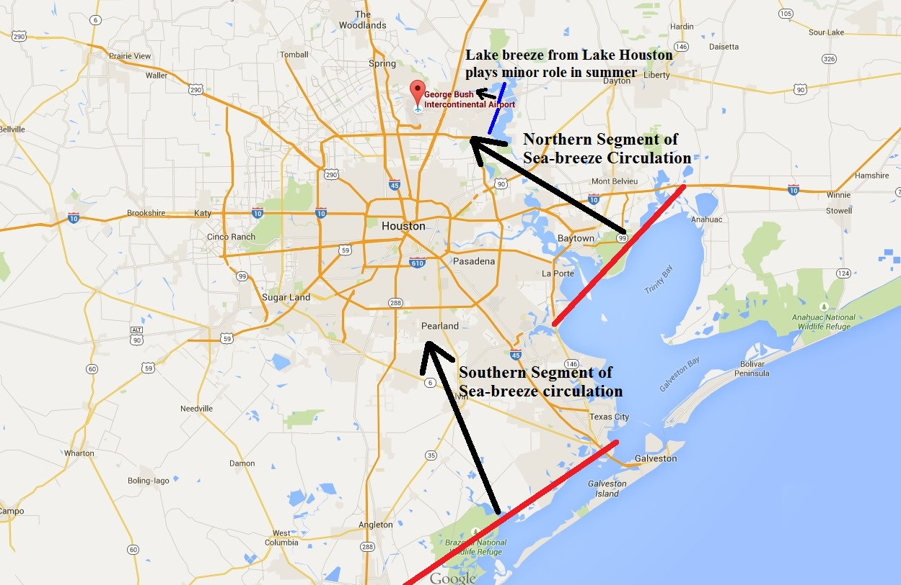
- * Northern segment typically precedes
- arrival of southern segment.
- * Winds from 120/140 degrees develop
- behind northern segment.
- * Winds from 150/170 degrees develop
- behind southern segment.

## Slide 3: July 22, 2015 Event
- Afternoon convection developed east of KIAH with outflow boundaries arriving at KIAH prior to 21Z.
- Interaction of aforementioned outflow boundaries, northern segment of sea-breeze circulation (and possible enhancement from lake breeze from Lake Houston) maintained easterly winds for approximately 2 hours.
- A persistent and deep southerly flow was noted through the lowest 5,000 feet in the afternoon/evening. This allowed main (southern) segment of sea-breeze circulation to arrive from the south prior to 23Z.
- See following slides for animation of kiah reflectivity data
- and tiah 0.1 velocity data

## Slide 4
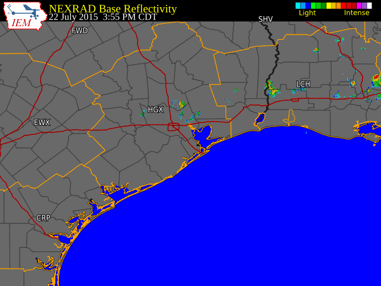
- kiah Reflectivity–Animation (July 25, 2015)

## Slide 5
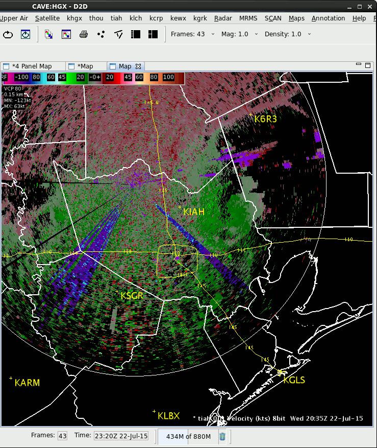
- KIAH 0.5 Degree Velocity (
- tiah 0.1 Degree Velocity - Animation
- July 22, 2015 20:35Z – 23:10Z
- Easterly winds spawned from outflow boundaries followed by southerly winds from southern
- segment of sea breeze

## Slide 6
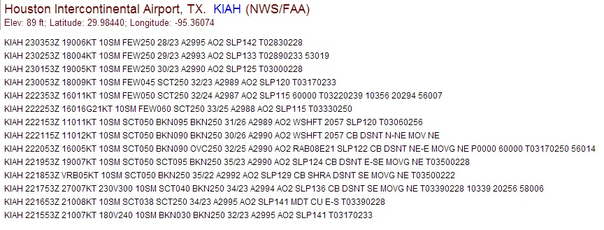
- KIAH METARs – July 22, 2015
- Effects from outflow boundaries and sea breeze
- Arrival of southern segment
- NOTE: earlier METARs displayed at bottom

## Slide 7
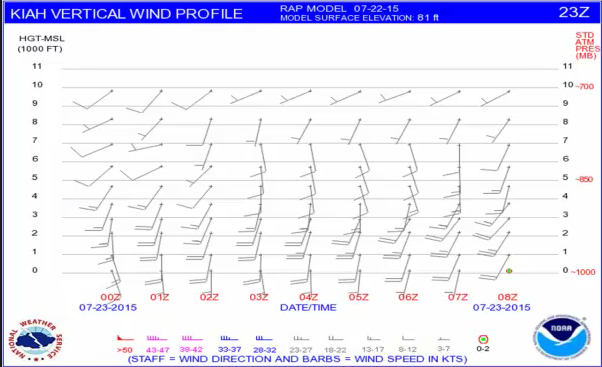

- KIAH RAP Vertical Wind
- Profile - July 22, 2015
- 16Z issuance - top image
- 23Z issuance – bottom
- NOTE: Pronounced southerly winds through the lowest  5,000 feet allowed for the southern segment of sea-breeze to arrive within a few hours of northern segment.

## Slide 8: July 23, 2015 Event
- There was no convection on this day.
- A persistent and deep southerly flow was noted through the lowest 5,000 feet in the afternoon/evening.
- These winds held the northern segment of the sea-breeze circulation east of KIAH while some semblance of the southern segment may have arrived late.
- Surface winds at KIAH stayed between 180/230 degrees.
- See following slide for tiah 0.1 velocity data

## Slide 9
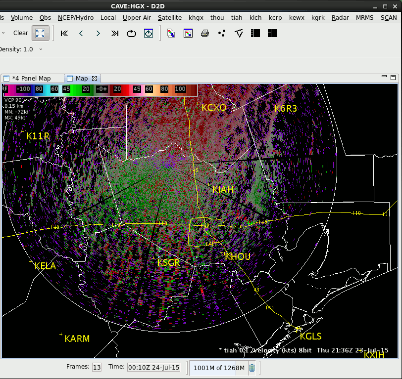
- tiah 0.1 Velocity- Animation
- July 23, 2015 21:36Z – 00:50Z
- Sea breeze stayedeast of KIAH

## Slide 10
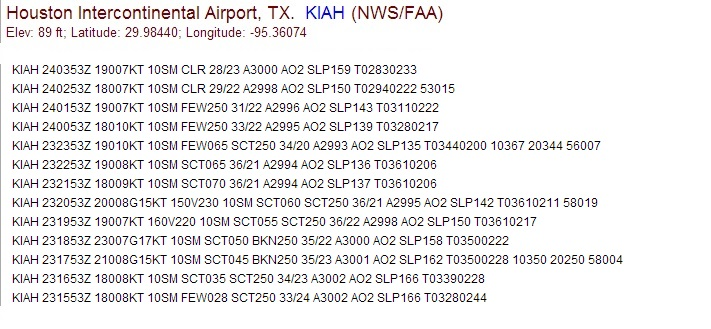
- KIAH METARs – July 23, 2015
- NOTE: No sea breeze arrival
- NOTE: earlier METARs displayed at bottom

## Slide 11

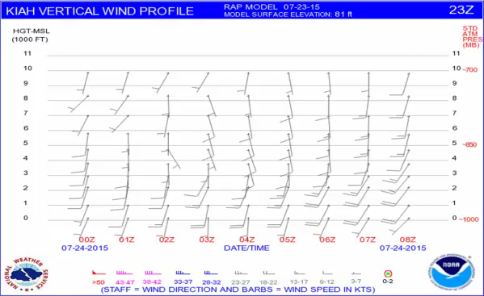
- KIAH RAP Vertical Wind
- Profile - July 23, 2015
- 15Z issuance - top image
- 23Z issuance – bottom
- NOTE: Both wind profiles indicated pronounced southerly winds (i.e., 10 knots or stronger) would extend through the lowest 5,000 feet and last through at least 00Z.

## Slide 12: July 24, 2015 Event
- There was no convection on this day.
- A weak southerly flow was noted through the lowest 5,000 feet in the afternoon/evening.
- In particular, winds within the lowest 3,000 feet were only 5 knots which enabled the northern segment of the sea-breeze circulation to arrive by 22Z with southeast winds (from 130 degrees and near 10 knots ) developing in its wake and lasting for about 3 hours.
- See following slide for tiah 0.1 velocity data

## Slide 13
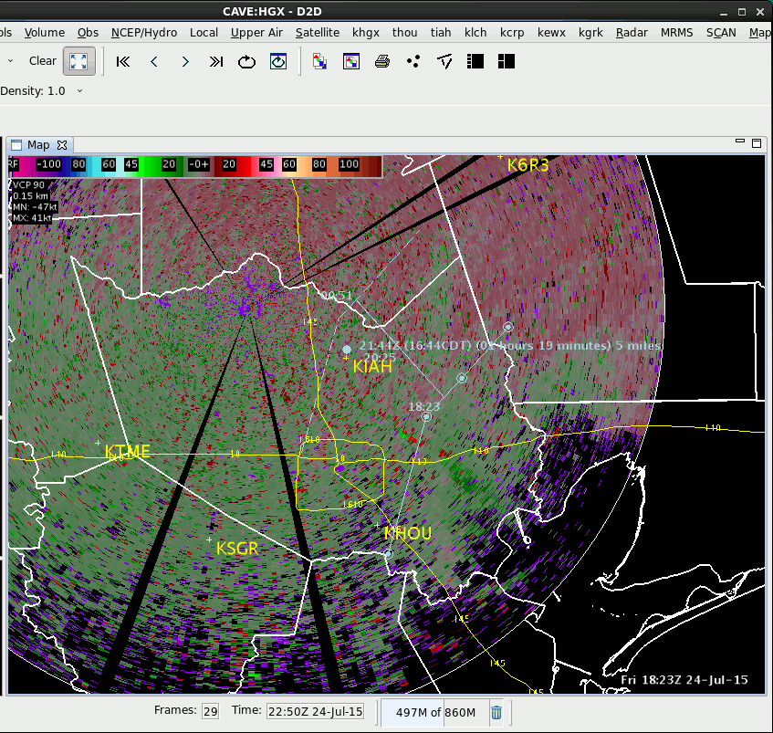
- tiah 0.1 Velocity- Animation
- July 24, 2015 18:23Z – 20:25Z
- NOTE: Radar went offline after 20:25Z
- Outline of sea breeze
- In light blue

## Slide 14
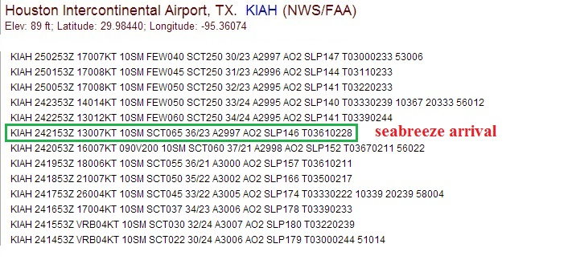
- KIAH METARs – July 24, 2015
- NOTE: earlier METARs displayed at bottom

## Slide 15
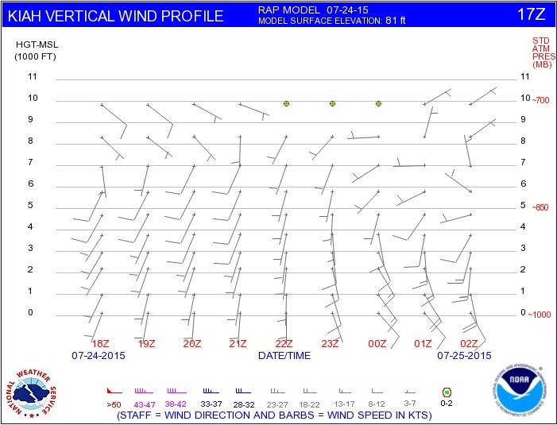
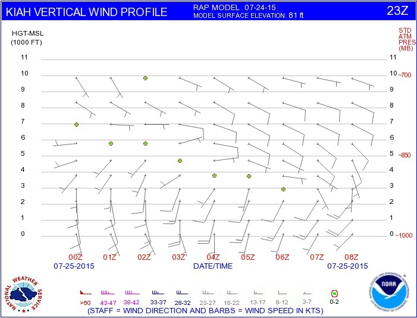
- KIAH RAP Vertical Wind
- Profile - July 24, 2015
- 17Z issuance - top image
- 23Z issuance – bottom
- NOTE: 17Z issuance  indicated light southerly winds (i.e., 5 knots)  would extend from surface through the lowest 5,000 feet and last through at least 00Z.  Some semblance of sea-breeze arrival around 00Z.

## Slide 16: What Can We Learn?

- KIAH RAP Vertical Wind Profile graphics can be a valuable tool in forecasting afternoon winds in the summer.
- Identify potential changes in wind direction/speed.
- Light winds within lowest 5,000 feet will favor
- arrival of northern segment of sea breeze with winds
- between 120/140 degrees.
- Southerly winds of 10 knots or stronger within lowest 5,000   	    feet will preclude arrival of northern segment with winds
- backing no more than 160 degrees.
- Northern segment of sea breeze (if conditions support) normally arrives after 5 PM CDT and precedes arrival of southern segment.  However, east or southeast winds in the lowest 5,000 feet will favor an earlier arrival of the northern segment.
- Inflow into thunderstorm development near KIAH can result in both an earlier arrival and prolonged event of easterly winds at KIAH!!
