# Utilizing AWIPS 4-Panels to Forecast Convection ***

> Source: <http://www.weather.gov/media/zhu/ZHU_Training_Page/ZHU_Presentations/Forecasting_Convection.ppsx>  
> Section: ZHU Presentations  
> Captured: 2026-08-19 06:00 UTC  
> Format: PowerPoint show (25 slides). PDF: [utilizing-awips-4-panels-to-forecast-convection.pdf](utilizing-awips-4-panels-to-forecast-convection.pdf) · Original: [source/Forecasting_Convection.ppsx](source/Forecasting_Convection.ppsx)

---

## Slide 1
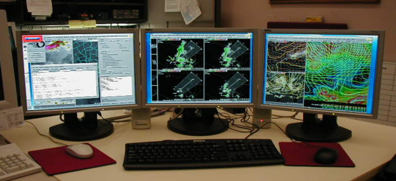

- Utilizing Model 4 Panels on AWIPS to Forecast Convection
- Eric Zappe
- National Weather Service
- Houston Center Weather Service Unit

## Slide 2
- This tutorial will demonstrate the usefulness of employing model 4 panels to forecast timing/place of convection.
- This event took place during the afternoon of June 14, 2016 across Houston CWSU (ZHU) portions of the Gulf Coast region.
- The following case study contains AWIPS 4-panel snapshots of GFS and RAP forecast models.

## Slide 3
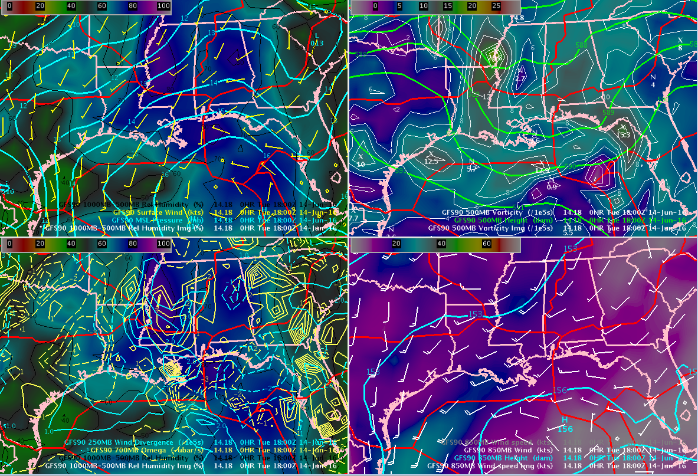
- I first like to view GFS model to discern large (synoptic) scale features…
- 850
- 500
- Sfc
- 250/700

## Slide 4

- Top left is surface features
- * MSL Pressure
- * Surface Wind
- * 100MB-500MB RH (image)
- * 500MB Height
- * 500MB Vorticity
- * 500MB Vorticity (image)
- 250/700
- Sfc
- 500
- 850
- Top right is 500 mb features

## Slide 5

- Bottom left is 700/250 mb features
- * 250MB Wind Divergence
- * 700MB Omega
- * 1000MB-500MB RH (image)
- * 850MB Height
- * 850MB Winds
- * 850MB Winds (image)
- Bottom right is 850 mb features
- Sfc
- 500
- 250/700
- 850

## Slide 6

- A broad trough (and associated lift) was noted from Louisiana eastward as well as over the northern half of the Gulf of Mexico
- H
- 500 mb shortwaves
- Higher moisture
- 250 mb divergence / 700 mb omega couplets
- (large scale ascent)
- Higher 850 mb winds
- (promoting shear)
- Sfc
- 500
- 250/700
- 850

## Slide 7
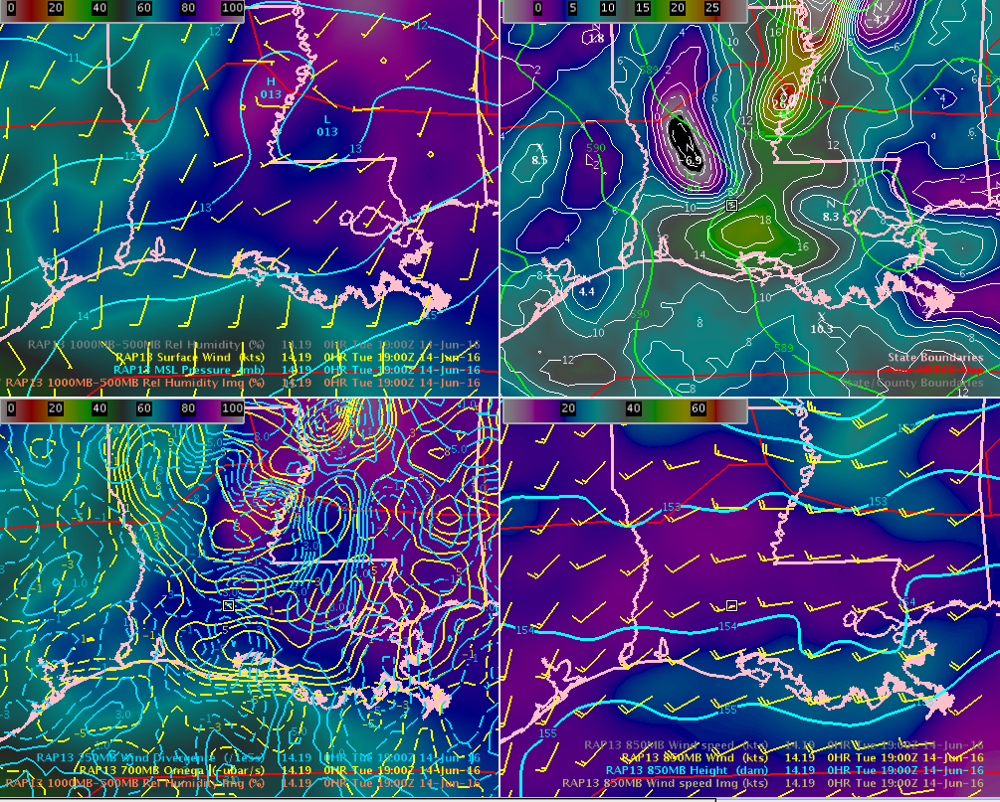
- I then look at the finer details using same 4-panel configuration of 13 km RAP model
- RAP13  19Z  June 14, 016
- Sfc
- 500
- 250/700
- 850

## Slide 8
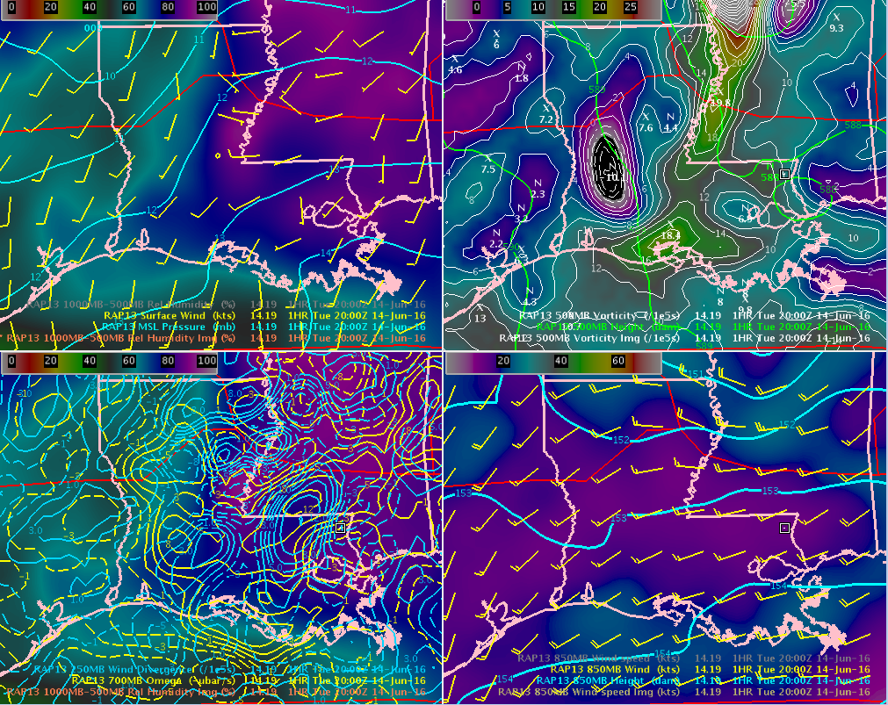
- RAP13 provides one-hour time steps, so I advance to see trends of weather features…
- RAP13  20Z  June 14, 016
- Sfc
- 500
- 250/700
- 850

## Slide 9
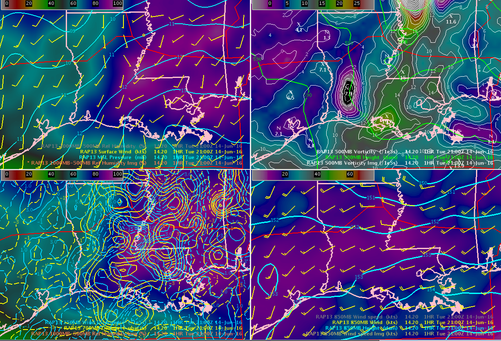
- such as strengthening/weakening of    winds and 500 mb shortwaves
- RAP13  21Z  June 14, 016
- Sfc
- 500
- 250/700
- 850

## Slide 10

- I also like to see lowest slices of the atmosphere to identify lifting mechanisms
- RAP40  18Z  June 14, 016
- Sfc
- 925
- 850
- 700

## Slide 11

- Top left is surface features
  - Top right is 925 mb features
- * MSL Pressure
- * Surface Wind
- * Surface Vorticity
- * Surface Vorticity (image)
- * 925MB Height
- * 925MB Wind
- * 925MB Vorticity
- * 925MB Vorticity (image)
- Sfc
- 925
- 850
- 700

## Slide 12

- Bottom left is 850 mb features
  - Bottom right is 700 mb features
- * 700MB Height
- * 700MB Wind
- * 700MB Vorticity
- * 700MB Vorticity (image)
- * 850MB Height
- * 850MB Wind
- * 850MB Vorticity
- * 850MB Vorticity (image)
- Sfc
- 925
- 850
- 700

## Slide 13
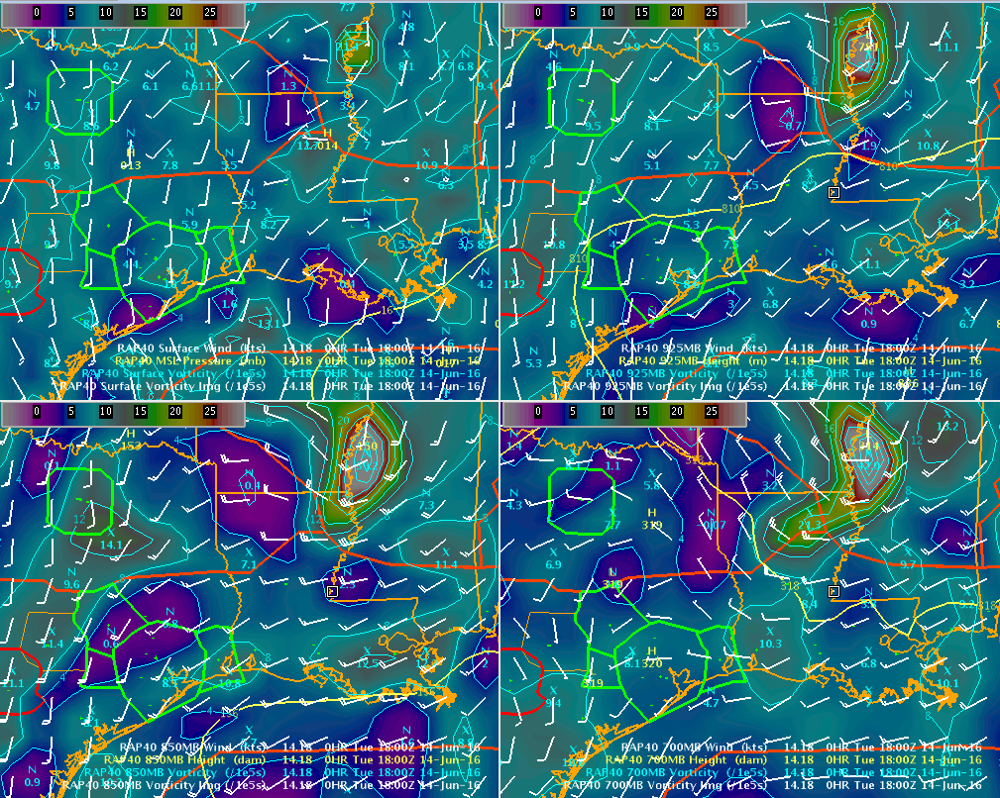
- I like to loop these images to detect trends, such as increasing/decreasing PVA/NVA
- RAP40  18Z-20Z  loop
- Sfc
- 925
- 850
- 700

## Slide 14

- I like to loop these images to detect trends, such as increasing/decreasing PVA/NVA
- RAP40  18Z-20Z  loop
- Decreasing NVA/
- increasing PVA at 700 mb
- Strong and deep layer vorticity maxima (here 925-700 mb) favors showers over storms
- 700
- 925
- 850
- Sfc
- Increasing southwest winds will enhance shear/instability

## Slide 15
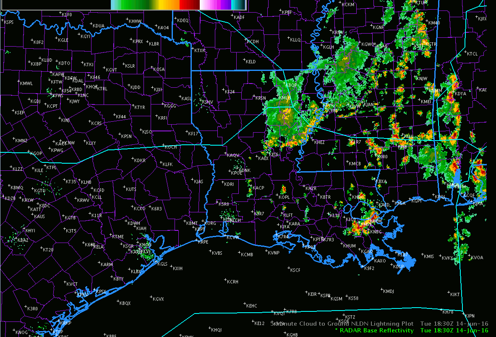
- Here’s the mosaic radar loop for the western half of the Gulf Coast region
- Strong and deep layer vorticity max (in this case 925-700mb) favors showers over storms
- Decreasing NVA/
- increasing PVA at 700 mb
- Increasing southwest winds at 925 mb will enhance shear/instability

## Slide 16
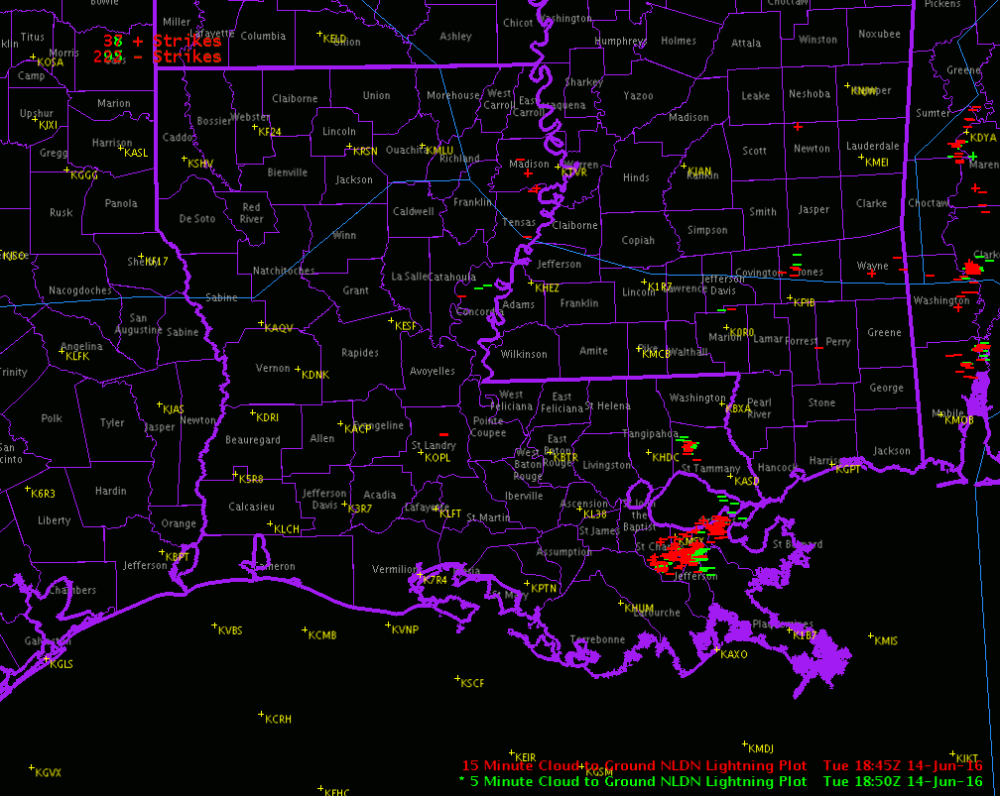
- Here’s the lightning for the same sector
- 5-minute strikes green      15-minute (older) strikes red
- Strong and deep layer vorticity max (in this case 925-700mb) favors showers over storms
- Decreasing NVA/
- increasing PVA at 700 mb
- Increasing southwest winds at 925 mb will enhance shear/instability

## Slide 17

- Once again, the other 4 panel of RAP model
- RAP13  19Z  June 14, 016
- Sfc
- 500
- 250/700
- 850
- Higher moisture
- (1000/500 mb)
- Decreasing NVA/
- increasing PVA
- 250 mb divergence/700 mb omega couplets
- (large scale ascent)
- Higher 850 mb winds will enhance shear.  Moisture advection determined by wind orientation

## Slide 18
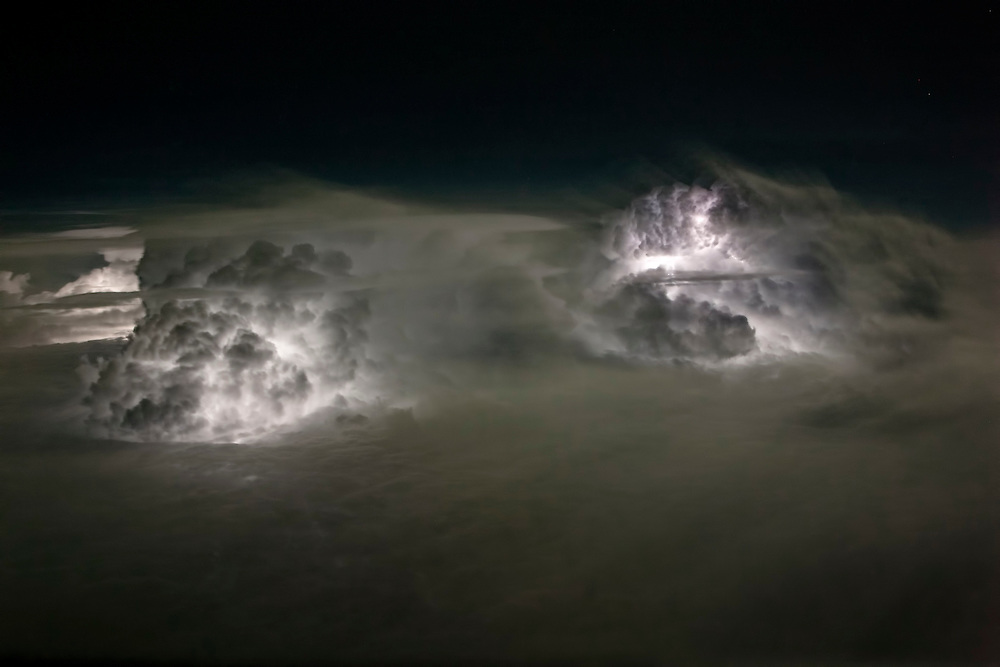
- Now for quick review of necessary ingredients for thunderstorm development

## Slide 19
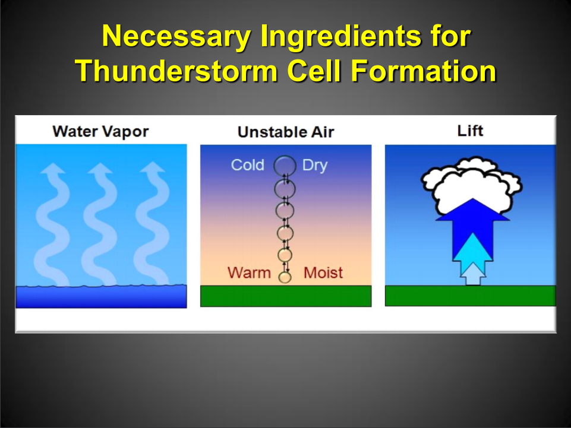

## Slide 20
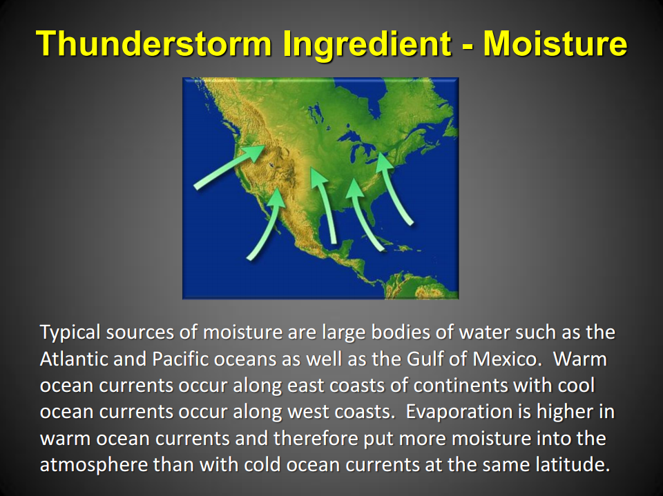

## Slide 21
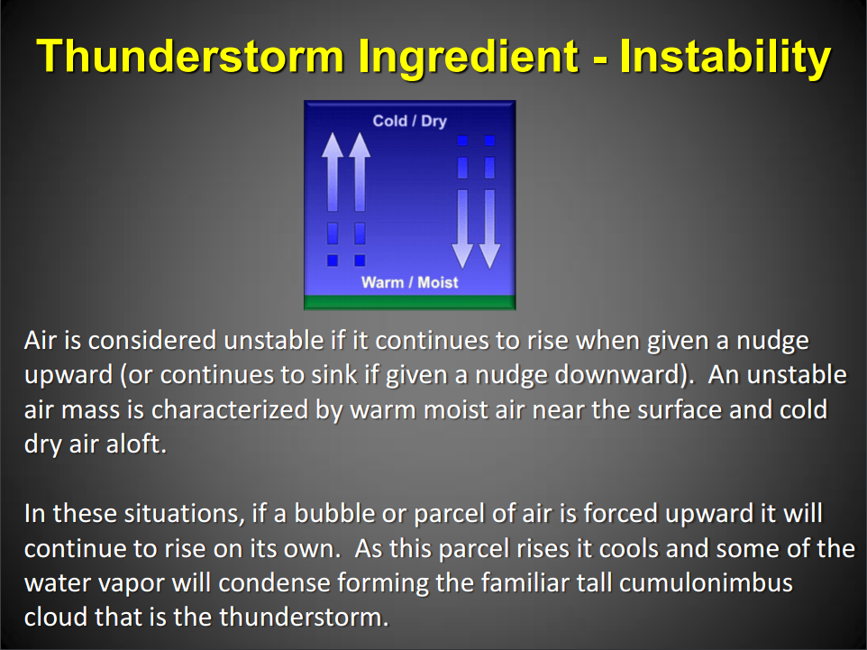

## Slide 22
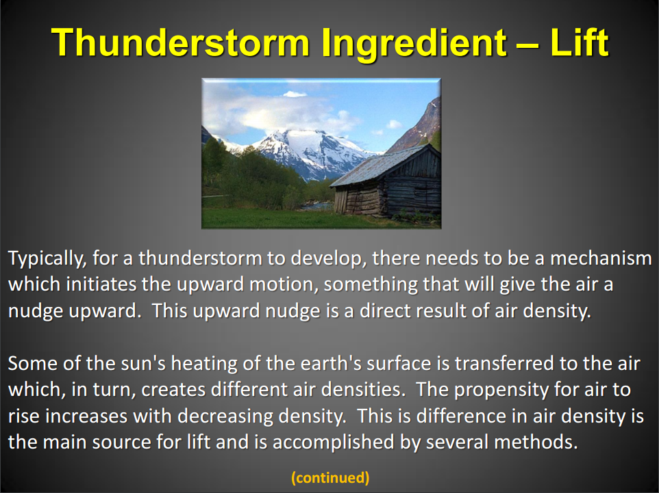

## Slide 23
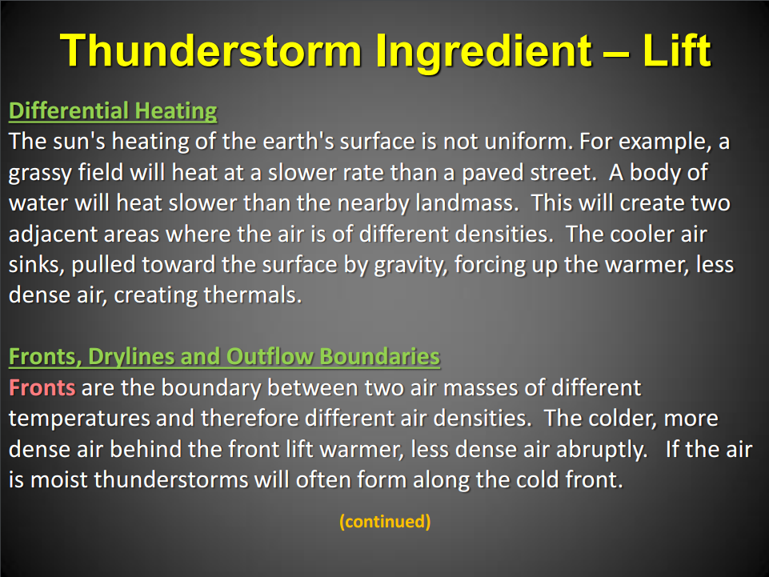

## Slide 24
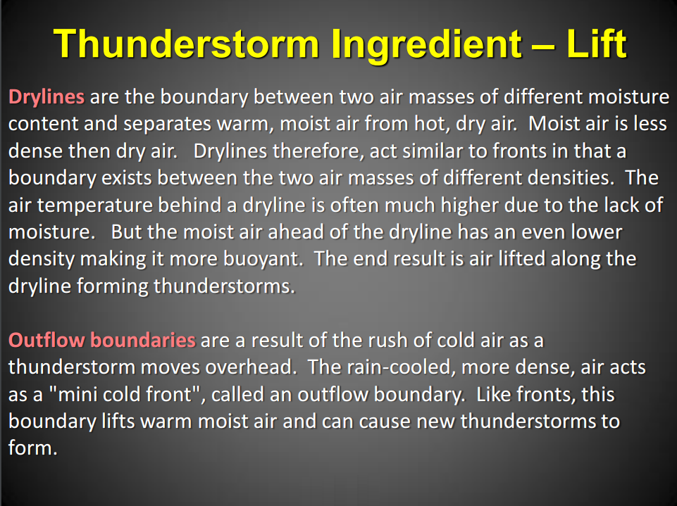

## Slide 25

- The End
- Eric Zappe
- National Weather Service
- Houston Center Weather Service Unit
